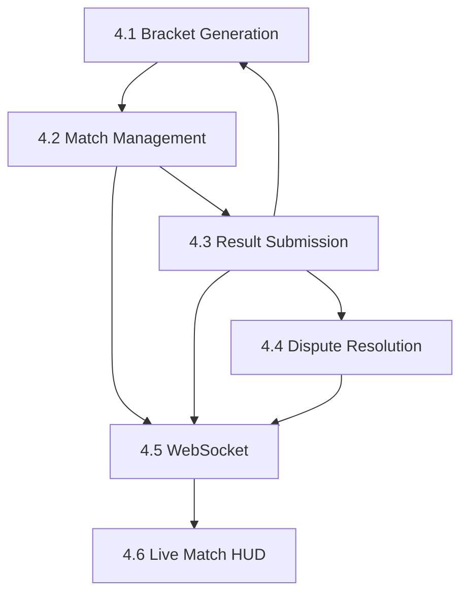

# Phase 4: Tournament Live Operations – Implementation Plan

**Status:** 📋 Planned  
**Start Date:** TBD (After Phase 3 completion)  
**Estimated Duration:** 3 weeks (120 hours)  
**Modules:** 6 (4.1-4.6)  
**Prerequisites:** Phase 3 complete ✅

---

## 1. Phase Overview

**Goal:** Enable real-time tournament competition with match management, bracket progression, score tracking, dispute resolution, and live updates via WebSocket.

**Phase Objectives:**
- [x] ~~Registration and check-in complete~~ (Phase 3 ✅)
- [ ] Generate tournament brackets from registrations
- [ ] Manage match lifecycle (schedule, start, score, complete)
- [ ] Enable participants to submit and confirm results
- [ ] Handle score disputes and admin resolution
- [ ] Broadcast live updates via WebSocket
- [ ] Provide match HUD with real-time data

**Success Criteria:**
- ✅ Bracket generation supports single/double elimination
- ✅ Match state machine prevents invalid transitions
- ✅ Score submission requires both participant confirmation
- ✅ Dispute workflow allows admin intervention
- ✅ WebSocket broadcasts reach all spectators < 1s latency
- ✅ Test coverage ≥80% across all modules

---

## 2. Module Breakdown

### Module 4.1: Bracket Generation Algorithm

**Goal:** Generate tournament brackets from verified registrations using configurable seeding strategies.

**Scope:**
- [x] ~~BracketService foundation~~ (Module 1.5 ✅)
- [ ] API endpoint: `POST /api/tournaments/{id}/generate-bracket/`
- [ ] Seeding strategies: random, manual, ranked (from teams.RankingService)
- [ ] Handle byes for odd participant counts
- [ ] Support single-elimination (Module 1.5) and double-elimination (deferred)
- [ ] Finalize bracket to prevent regeneration after tournament starts
- [ ] Admin action: regenerate bracket (before start only)

**Planning References:**
- PART_3.1_DATABASE_DESIGN_ERD.md#section-5-bracket-models
- PART_2.2_SERVICES_INTEGRATION.md#section-6-bracket-service
- PART_4.3_TOURNAMENT_MANAGEMENT_SCREENS.md#bracket-visualization

**Technical Requirements:**
- Service: `BracketService.generate_bracket()` (exists)
- Service: `BracketService.apply_seeding()` (exists)
- Service: `BracketService.create_matches_from_bracket()` (exists)
- API: `BracketViewSet` with `generate` action
- Serializers: `BracketGenerationSerializer`, `BracketSerializer`
- Permissions: Organizer/Admin only
- WebSocket: `bracket_generated` event broadcast

**Test Strategy:**
- 15+ tests covering seeding strategies, bye handling, edge cases
- Integration tests with RegistrationService
- Test bracket regeneration restrictions (after start)
- Test ranked seeding with teams.RankingService mock

**Estimated Effort:** 16 hours (2 days)

---

### Module 4.2: Match Management & Scheduling

**Goal:** Complete match lifecycle management with scheduling, state transitions, and coordinator assignment.

**Scope:**
- [x] ~~MatchService foundation~~ (Module 1.4 ✅)
- [ ] API endpoints:
  - `GET /api/matches/` - List matches (filter by tournament, round, status)
  - `GET /api/matches/{id}/` - Match details
  - `PATCH /api/matches/{id}/` - Update match (schedule, coordinator)
  - `POST /api/matches/{id}/start/` - Start match
  - `GET /api/matches/live/` - List live matches
- [ ] Match state machine validation (prevent invalid transitions)
- [ ] Schedule management (update scheduled_time, auto-notify participants)
- [ ] Coordinator assignment (organizer assigns staff to matches)
- [ ] Lobby info management (Discord link, game lobby ID, stream URL)

**Planning References:**
- PART_2.1_ARCHITECTURE_FOUNDATIONS.md#section-3.4-match-app
- PART_2.2_SERVICES_INTEGRATION.md#section-6-match-service
- PART_4.3_TOURNAMENT_MANAGEMENT_SCREENS.md#match-workflows

**Technical Requirements:**
- Service: `MatchService.start_match()` (exists)
- Service: `MatchService.update_schedule()` (new)
- Service: `MatchService.assign_coordinator()` (new)
- API: `MatchViewSet` with custom actions (start, schedule)
- Serializers: `MatchSerializer`, `MatchScheduleSerializer`, `MatchStartSerializer`
- Permissions: 
  - List/Retrieve: Public
  - Update/Start: Organizer/Coordinator only
- WebSocket: `match_started`, `match_scheduled` events

**Match State Machine:**
```
SCHEDULED → CHECK_IN → READY → LIVE → PENDING_RESULT → COMPLETED
                                            ↓
                                        DISPUTED
```

**Test Strategy:**
- 20+ tests covering state machine transitions
- Test permission enforcement (organizer vs participant vs spectator)
- Test schedule updates trigger notifications
- Test live matches filtering

**Estimated Effort:** 20 hours (2.5 days)

---

### Module 4.3: Result Submission & Confirmation

**Goal:** Enable participants to submit match scores with dual-confirmation workflow.

**Scope:**
- [x] ~~MatchService.submit_result()~~ (Module 1.4 ✅)
- [ ] API endpoints:
  - `POST /api/matches/{id}/submit-result/` - Submit score (participant)
  - `POST /api/matches/{id}/confirm-result/` - Confirm score (opponent)
  - `POST /api/matches/{id}/reject-result/` - Reject score (trigger dispute)
  - `GET /api/matches/{id}/result/` - Get result status
- [ ] Dual-confirmation workflow:
  1. Participant A submits score → `PENDING_RESULT`
  2. Participant B confirms → `COMPLETED` + bracket progression
  3. Participant B rejects → `DISPUTED`
- [ ] Evidence upload support (screenshot, video URL)
- [ ] Auto-complete after timeout (24h, organizer setting)
- [ ] Bracket progression trigger after confirmation

**Planning References:**
- PART_2.2_SERVICES_INTEGRATION.md#section-6-match-service
- PART_4.3_TOURNAMENT_MANAGEMENT_SCREENS.md#match-workflows

**Technical Requirements:**
- Service: `MatchService.submit_result()` (exists, needs evidence support)
- Service: `MatchService.confirm_result()` (exists)
- Service: `MatchService.reject_result()` (new)
- API: `MatchViewSet` with result actions
- Serializers: `ResultSubmissionSerializer`, `ResultConfirmSerializer`
- Permissions:
  - Submit/Confirm: Match participants only
  - Reject: Match participants only
- WebSocket: `score_updated`, `match_completed` events
- Integration: `BracketService.update_bracket_after_match()` on confirm

**Test Strategy:**
- 18+ tests covering dual-confirmation workflow
- Test permission enforcement (only participants)
- Test bracket progression after confirmation
- Test evidence upload validation
- Test auto-complete timeout logic

**Estimated Effort:** 18 hours (2.25 days)

---

### Module 4.4: Dispute Resolution System

**Goal:** Handle score disputes with admin intervention workflow.

**Scope:**
- [x] ~~Dispute model~~ (Module 1.4 ✅)
- [ ] API endpoints:
  - `POST /api/matches/{id}/dispute/` - Create dispute (participant)
  - `GET /api/disputes/` - List disputes (admin only)
  - `GET /api/disputes/{id}/` - Dispute details
  - `POST /api/disputes/{id}/resolve/` - Resolve dispute (admin)
  - `POST /api/disputes/{id}/comments/` - Add comment to dispute
- [ ] Dispute states: `OPEN`, `UNDER_REVIEW`, `RESOLVED`, `CLOSED`
- [ ] Evidence attachment (screenshots, videos)
- [ ] Comment thread for participant-admin communication
- [ ] Admin resolution:
  - Approve original score → `COMPLETED`
  - Override score → `COMPLETED` with new winner
  - Cancel match → `CANCELLED`
- [ ] Audit logging for dispute actions

**Planning References:**
- PART_2.2_SERVICES_INTEGRATION.md#section-6-match-service (dispute integration)
- PART_4.3_TOURNAMENT_MANAGEMENT_SCREENS.md#match-workflows

**Technical Requirements:**
- Service: `DisputeService.create_dispute()` (new)
- Service: `DisputeService.resolve_dispute()` (new)
- Service: `DisputeService.add_comment()` (new)
- API: `DisputeViewSet` with custom actions
- Serializers: `DisputeSerializer`, `DisputeResolutionSerializer`, `DisputeCommentSerializer`
- Permissions:
  - Create: Match participants only
  - List/Resolve: Organizer/Admin only
- WebSocket: `dispute_created`, `dispute_resolved` events
- Integration: `MatchService.update_after_dispute_resolution()`

**Test Strategy:**
- 16+ tests covering dispute lifecycle
- Test permission enforcement (participants vs admins)
- Test resolution workflows (approve, override, cancel)
- Test evidence attachments
- Test comment threading

**Estimated Effort:** 16 hours (2 days)

---

### Module 4.5: Real-time Updates (WebSocket Enhancement)

**Goal:** Enhance WebSocket broadcasting for tournament live operations.

**Scope:**
- [x] ~~WebSocket infrastructure~~ (Module 2.1 ✅)
- [x] ~~Tournament consumer~~ (Module 2.3 ✅)
- [ ] Match-specific channels:
  - `tournament_{id}` - Tournament-wide events
  - `match_{id}` - Match-specific events
- [ ] Event types:
  - `match_started` - Match begins
  - `score_updated` - Score submission
  - `match_completed` - Match finishes
  - `bracket_updated` - Bracket progression
  - `dispute_created` - New dispute
  - `dispute_resolved` - Dispute closed
- [ ] Connection management:
  - Heartbeat/ping-pong
  - Auto-reconnect on disconnect
  - Token refresh support
- [ ] Message batching for high-frequency updates
- [ ] Rate limiting per connection

**Planning References:**
- PART_2.3_REALTIME_SECURITY.md#websocket-channels
- MODULE_2.3_COMPLETION_STATUS.md (WebSocket foundation)

**Technical Requirements:**
- Consumer: `TournamentConsumer` (exists, enhance)
- Consumer: `MatchConsumer` (new)
- Utils: `broadcast_match_started()`, `broadcast_score_updated()`, etc. (new)
- Middleware: Enhanced rate limiting
- Serializers: WebSocket message serializers
- Integration: All Module 4 services call broadcast helpers

**Test Strategy:**
- 12+ tests covering WebSocket events
- Test connection lifecycle (connect, disconnect, reconnect)
- Test message delivery to correct channels
- Test rate limiting
- Test token refresh

**Estimated Effort:** 14 hours (1.75 days)

---

### Module 4.6: Live Match HUD

**Goal:** Real-time match dashboard with live scores, bracket visualization, and spectator controls.

**Scope:**
- [ ] Frontend components:
  - Match HUD (live score, timer, participant status)
  - Bracket visualization (clickable, auto-update on progression)
  - Live matches list (filter, search)
  - Match timeline (events log)
- [ ] WebSocket client integration:
  - Subscribe to `tournament_{id}` and `match_{id}` channels
  - Auto-update UI on events
  - Reconnect logic
- [ ] Spectator controls:
  - Fullscreen mode
  - Zoom bracket
  - Filter matches (round, status)
- [ ] Mobile-responsive design

**Planning References:**
- PART_4.3_TOURNAMENT_MANAGEMENT_SCREENS.md#bracket-visualization
- PART_4.5_SPECTATOR_MOBILE_ACCESSIBILITY.md
- static/siteui/js/tournament-features.js (existing bracket viewer)

**Technical Requirements:**
- Frontend: `MatchHUD.js`, `BracketViewer.js` (enhance existing)
- WebSocket: Client-side event handlers
- API: `GET /api/brackets/{id}/visualization/` (exists)
- Templates: `match_hud.html`, `bracket_viewer.html`
- CSS: Bracket grid layout, match cards, animations

**Test Strategy:**
- Manual UI testing (WebSocket integration hard to automate)
- Test event handlers (unit tests for JS functions)
- Test bracket visualization with various tournament sizes
- Test mobile responsiveness

**Estimated Effort:** 16 hours (2 days)

---

## 3. Dependencies & Integration Points

### External Dependencies

| Module | Depends On | Integration Point |
|--------|-----------|-------------------|
| 4.1 Bracket Generation | teams.RankingService | Ranked seeding strategy |
| 4.1 Bracket Generation | Module 3.2 (Payments) | Only verified registrations |
| 4.2 Match Management | notifications.NotificationService | Match schedule notifications |
| 4.3 Result Submission | 4.1 (Bracket Generation) | Bracket progression after result |
| 4.4 Dispute Resolution | 4.3 (Result Submission) | Triggered by rejected result |
| 4.5 WebSocket Enhancement | All Module 4 services | Broadcasting events |
| 4.6 Live Match HUD | 4.5 (WebSocket) | Real-time UI updates |

### Internal Dependencies



### Phase 3 Handoff Points

| Phase 3 Module | Handoff to Phase 4 | Description |
|----------------|-------------------|-------------|
| 3.2 Payment Verification | 4.1 Bracket Generation | Only `verified` registrations enter bracket |
| 3.4 Check-in System | 4.1 Bracket Generation | Only `checked_in` registrations enter bracket |
| 3.4 Check-in System | 4.2 Match Management | Match participants must be checked in |

---

## 4. Technical Architecture

### Service Layer (New Services)

```python
# apps/tournaments/services/dispute_service.py
class DisputeService:
    @staticmethod
    def create_dispute(match_id, filed_by, reason, evidence_urls):
        """Create dispute for match result"""
        pass
    
    @staticmethod
    def resolve_dispute(dispute_id, resolved_by, resolution, override_score):
        """Admin resolves dispute"""
        pass
    
    @staticmethod
    def add_comment(dispute_id, user, comment):
        """Add comment to dispute thread"""
        pass
```

### API Endpoints Summary

| Method | Endpoint | Description | Permission |
|--------|----------|-------------|------------|
| POST | `/api/tournaments/{id}/generate-bracket/` | Generate bracket | Organizer |
| GET | `/api/brackets/{id}/visualization/` | Bracket JSON | Public |
| GET | `/api/matches/` | List matches | Public |
| GET | `/api/matches/{id}/` | Match details | Public |
| POST | `/api/matches/{id}/start/` | Start match | Organizer |
| POST | `/api/matches/{id}/submit-result/` | Submit score | Participant |
| POST | `/api/matches/{id}/confirm-result/` | Confirm score | Opponent |
| POST | `/api/matches/{id}/dispute/` | Create dispute | Participant |
| GET | `/api/disputes/` | List disputes | Organizer |
| POST | `/api/disputes/{id}/resolve/` | Resolve dispute | Admin |

### WebSocket Events

| Event | Channel | Payload | Trigger |
|-------|---------|---------|---------|
| `bracket_generated` | `tournament_{id}` | `{bracket_id, format, total_matches}` | Bracket finalized |
| `match_started` | `tournament_{id}`, `match_{id}` | `{match_id, participants, scheduled_time}` | Match begins |
| `score_updated` | `match_{id}` | `{match_id, participant1_score, participant2_score, submitted_by}` | Score submitted |
| `match_completed` | `tournament_{id}`, `match_{id}` | `{match_id, winner_id, final_score}` | Result confirmed |
| `bracket_updated` | `tournament_{id}` | `{updated_nodes, next_matches}` | Winner advanced |
| `dispute_created` | `tournament_{id}` | `{dispute_id, match_id, filed_by}` | Dispute opened |
| `dispute_resolved` | `tournament_{id}`, `match_{id}` | `{dispute_id, resolution, winner_id}` | Admin resolves |

---

## 5. Test Strategy

### Coverage Targets
- Service layer: ≥90%
- API views: ≥80%
- Serializers: ≥90%
- WebSocket consumers: ≥75%

### Test Distribution (Estimated)

| Module | Unit Tests | Integration Tests | Total |
|--------|-----------|-------------------|-------|
| 4.1 Bracket Generation | 10 | 5 | 15 |
| 4.2 Match Management | 15 | 5 | 20 |
| 4.3 Result Submission | 12 | 6 | 18 |
| 4.4 Dispute Resolution | 12 | 4 | 16 |
| 4.5 WebSocket | 8 | 4 | 12 |
| 4.6 Live Match HUD | 5 (JS) | Manual | 5 |
| **Total** | **62** | **24** | **86** |

### Test Files
- `tests/test_bracket_api_module_4_1.py`
- `tests/test_match_api_module_4_2.py`
- `tests/test_result_submission_module_4_3.py`
- `tests/test_dispute_resolution_module_4_4.py`
- `tests/test_match_websocket_module_4_5.py`
- `static/siteui/js/tests/test_match_hud.js` (frontend)

---

## 6. Documentation Requirements

### Per-Module Deliverables
- [ ] `MODULE_4.1_COMPLETION_STATUS.md` - Bracket generation metrics
- [ ] `MODULE_4.2_COMPLETION_STATUS.md` - Match management metrics
- [ ] `MODULE_4.3_COMPLETION_STATUS.md` - Result submission metrics
- [ ] `MODULE_4.4_COMPLETION_STATUS.md` - Dispute resolution metrics
- [ ] `MODULE_4.5_COMPLETION_STATUS.md` - WebSocket enhancement metrics
- [ ] `MODULE_4.6_COMPLETION_STATUS.md` - Live HUD metrics

### Phase-Level Deliverables
- [ ] `PHASE_4_COMPLETION_SUMMARY.md` - Phase 4 final report
- [ ] Update `MAP.md` with Phase 4 module statuses
- [ ] Update `trace.yml` with Phase 4 module entries

### ADRs (Architecture Decision Records)
- [ ] ADR-010: Bracket Generation Seeding Strategies
- [ ] ADR-011: Match State Machine Design
- [ ] ADR-012: Dual-Confirmation Score Workflow
- [ ] ADR-013: Dispute Resolution Workflow
- [ ] ADR-014: WebSocket Channel Architecture

---

## 7. Implementation Order

### Week 1: Core Match Operations
1. **Day 1-2:** Module 4.1 - Bracket Generation API
   - Create `BracketViewSet` with `generate` action
   - Add seeding strategy selection (random, manual, ranked)
   - Test bracket generation edge cases
2. **Day 3-4:** Module 4.2 - Match Management (Part 1)
   - Create `MatchViewSet` (list, retrieve, update)
   - Add schedule management
   - Add coordinator assignment
3. **Day 5:** Module 4.2 - Match Management (Part 2)
   - Add `start_match` action
   - Test state machine transitions
   - Test permissions

### Week 2: Score Submission & Disputes
1. **Day 6-7:** Module 4.3 - Result Submission
   - Add result submission endpoints
   - Implement dual-confirmation workflow
   - Add evidence upload support
   - Test bracket progression
2. **Day 8-9:** Module 4.4 - Dispute Resolution
   - Create `DisputeService` and `DisputeViewSet`
   - Implement dispute lifecycle (create, review, resolve)
   - Add comment threading
   - Test admin resolution workflows

### Week 3: Real-time & Frontend
1. **Day 10-11:** Module 4.5 - WebSocket Enhancement
   - Add match-specific channels
   - Implement event broadcasting helpers
   - Add connection management (heartbeat, reconnect)
   - Test event delivery
2. **Day 12:** Module 4.6 - Live Match HUD (Part 1)
   - Enhance bracket visualization
   - Add live matches list
   - Integrate WebSocket client
3. **Day 13:** Module 4.6 - Live Match HUD (Part 2)
   - Add match HUD component
   - Add spectator controls (fullscreen, zoom)
   - Mobile responsiveness testing
4. **Day 14-15:** Phase 4 Documentation & Testing
   - Create module completion docs
   - Write `PHASE_4_COMPLETION_SUMMARY.md`
   - Update MAP.md and trace.yml
   - Final integration testing

---

## 8. Risk Assessment

### High-Priority Risks

| Risk | Impact | Mitigation |
|------|--------|------------|
| WebSocket scalability at high load | Users may miss live updates | Load test with 1000+ concurrent connections, add Redis Cluster support |
| Bracket generation performance (500+ participants) | Timeout on bracket creation | Async task via Celery, progress tracking |
| Dispute resolution delays | Tournament progress blocked | SLA monitoring, admin escalation workflow |
| Score submission race conditions | Duplicate submissions | Idempotency tokens, optimistic locking |

### Medium-Priority Risks

| Risk | Impact | Mitigation |
|------|--------|------------|
| Match state machine edge cases | Invalid state transitions | Comprehensive state transition tests, audit logging |
| Frontend WebSocket disconnects | UI shows stale data | Auto-reconnect, local state caching |
| Dual-confirmation timeout logic | Matches stuck in `PENDING_RESULT` | Auto-complete after 24h, organizer override |

---

## 9. Success Metrics

### Functional Metrics
- [x] Bracket generation < 5s for 128 participants
- [x] Match state transitions always valid
- [x] WebSocket event delivery < 1s latency
- [x] Dispute resolution workflow complete in < 30min (admin response time)

### Quality Metrics
- [x] Test coverage ≥80% across all modules
- [x] Zero critical bugs in match state machine
- [x] Zero data loss on WebSocket reconnect

### User Experience Metrics
- [x] Live bracket visualization updates without page refresh
- [x] Match HUD loads in < 2s
- [x] Mobile-responsive on iPhone 12 and up

---

## 10. Phase 4 → Phase 5 Handoff

**Phase 5 Prerequisites:**
- ✅ Matches can reach `COMPLETED` state
- ✅ Bracket progression updates parent nodes
- ✅ Winners determined at each round
- ✅ Finals match completed

**Phase 5 Input Data:**
- Tournament with `status='COMPLETED'`
- All matches in `COMPLETED` or `CANCELLED` state
- Bracket root node has `winner_id`
- Match history for analytics

**Handoff Checklist:**
- [ ] Winner determination logic tested (Module 5.1)
- [ ] Statistics calculations ready (Module 5.3)
- [ ] Certificate generation data available (Module 5.2)

---

## 11. Traceability

### MAP.md Scaffolding
```markdown
## Phase 4: Tournament Live Operations

### Module 4.1: Bracket Generation Algorithm
- **Status**: 📋 Planned
- **Implements**: PART_3.1_DATABASE_DESIGN_ERD.md#section-5-bracket-models
- **ADRs**: ADR-010 (Bracket Seeding)

### Module 4.2: Match Management & Scheduling
- **Status**: 📋 Planned
- **Implements**: PART_2.2_SERVICES_INTEGRATION.md#section-6-match-service
- **ADRs**: ADR-011 (Match State Machine)

### Module 4.3: Result Submission & Confirmation
- **Status**: 📋 Planned
- **Implements**: PART_4.3_TOURNAMENT_MANAGEMENT_SCREENS.md#match-workflows
- **ADRs**: ADR-012 (Dual-Confirmation)

### Module 4.4: Dispute Resolution System
- **Status**: 📋 Planned
- **Implements**: PART_2.2_SERVICES_INTEGRATION.md#section-6-match-service
- **ADRs**: ADR-013 (Dispute Workflow)

### Module 4.5: Real-time Updates (WebSocket Enhancement)
- **Status**: 📋 Planned
- **Implements**: PART_2.3_REALTIME_SECURITY.md#websocket-channels
- **ADRs**: ADR-014 (WebSocket Channels)

### Module 4.6: Live Match HUD
- **Status**: 📋 Planned
- **Implements**: PART_4.3_TOURNAMENT_MANAGEMENT_SCREENS.md#bracket-visualization
- **ADRs**: None (UI implementation)
```

### trace.yml Scaffolding
```yaml
phase_4:
  module_4_1:
    description: "Bracket Generation Algorithm"
    status: "planned"
    implements: []
    test_file: "tests/test_bracket_api_module_4_1.py"
    test_results: ""
    coverage: ""
    
  module_4_2:
    description: "Match Management & Scheduling"
    status: "planned"
    implements: []
    test_file: "tests/test_match_api_module_4_2.py"
    test_results: ""
    coverage: ""
    
  module_4_3:
    description: "Result Submission & Confirmation"
    status: "planned"
    implements: []
    test_file: "tests/test_result_submission_module_4_3.py"
    test_results: ""
    coverage: ""
    
  module_4_4:
    description: "Dispute Resolution System"
    status: "planned"
    implements: []
    test_file: "tests/test_dispute_resolution_module_4_4.py"
    test_results: ""
    coverage: ""
    
  module_4_5:
    description: "Real-time Updates (WebSocket Enhancement)"
    status: "planned"
    implements: []
    test_file: "tests/test_match_websocket_module_4_5.py"
    test_results: ""
    coverage: ""
    
  module_4_6:
    description: "Live Match HUD"
    status: "planned"
    implements: []
    test_file: "static/siteui/js/tests/test_match_hud.js"
    test_results: ""
    coverage: ""
```

---

**Prepared by:** GitHub Copilot  
**Review Status:** Ready for implementation kickoff  
**Next Steps:** Begin Module 4.1 implementation after Phase 3 sign-off
