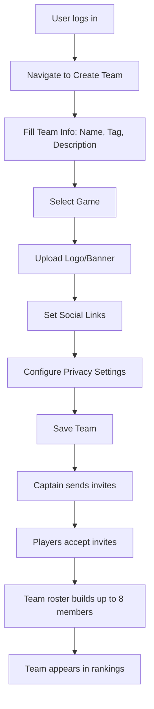
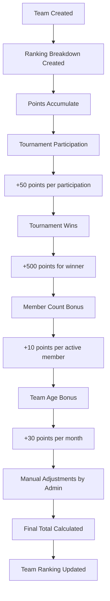
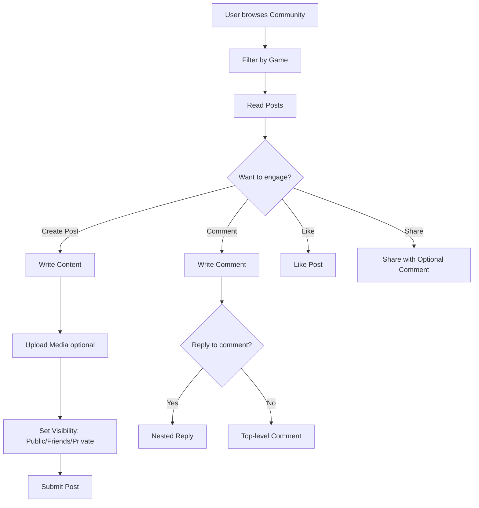
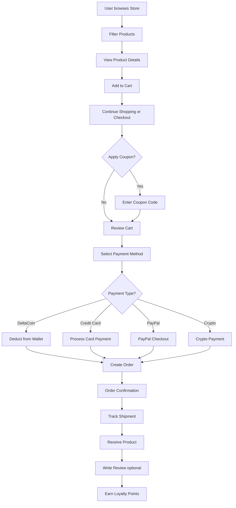
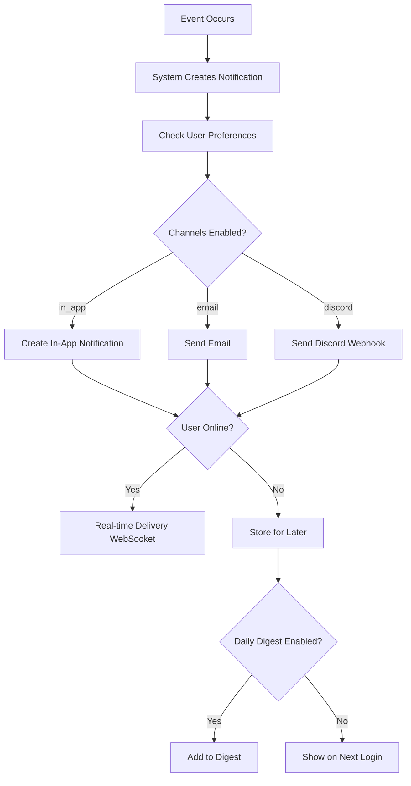

# 01 - Project Overview and Scope

**Document Version:** 2.0 (CORRECTED)  
**Last Updated:** November 2, 2025  
**Status:** Current System Documentation - Post-Audit Rewrite

> ⚠️ **IMPORTANT:** This document has been rewritten based on full codebase audit. Previous version contained significant inaccuracies regarding tournament system functionality. See `CHANGELOG.md` for details.

---

## Table of Contents
- [Product Purpose](#product-purpose)
- [Supported Games and Platforms](#supported-games-and-platforms)
- [Primary User Types](#primary-user-types)
- [High-Level User Flows](#high-level-user-flows)
- [Current Scope and Capabilities](#current-scope-and-capabilities)
- [Known Limitations](#known-limitations)
- [Business Model](#business-model)
- [Architecture Status](#architecture-status)

---

## Product Purpose

**DeltaCrown** is an esports community and team management platform designed primarily for the Bangladesh gaming market. The platform enables teams to organize, track rosters, manage social presence, and maintain tournament participation history. A comprehensive tournament system is planned but **not currently operational** (legacy system moved to `legacy_backup/` on November 2, 2025).

### Core Value Propositions (AS IMPLEMENTED)

**For Teams:**
- Team creation and roster management (captain + up to 7 members)
- Team rankings based on configurable point system
- Tournament registration history tracking (decoupled from legacy tournament system)
- Team social features: posts, followers, discussions
- Team page customization with banners, logos, social links
- Sponsor management and promotion tracking

**For Players:**
- Join teams via invitation system
- Store game IDs for 9 supported games
- Track personal achievements
- Earn and spend DeltaCoin virtual currency
- Shop in DeltaStore for merchandise
- Participate in community discussions

**For Community Members:**
- Create posts with media attachments (images, videos, GIFs)
- Comment on posts with threaded replies
- Like and share content
- Filter content by game
- Follow teams and players

**For Organizers:**
- DeltaStore/Crown Store for merchandise sales
- Loyalty program management
- Order processing with multiple payment methods (DeltaCoin, credit card, PayPal, crypto)

### Tagline
**"From the Delta to the Crown — Where Champions Rise"**

### Geographic Focus
- **Primary:** Bangladesh 🇧🇩
- **Secondary:** South Asia (India, Pakistan, Nepal)
- **Language:** English only
- **Timezone:** Asia/Dhaka (GMT+6)
- **Currency:** DeltaCoin (virtual currency) + Real currency for merchandise

---

## Supported Games and Platforms

### Game ID Support (9 Games)

**Code Reference:** `apps/user_profile/models.py` (UserProfile model)

| Game | Platform | Team Size | Player ID Field | Status |
|------|----------|-----------|----------------|--------|
| **Valorant** | PC (Riot) | 5v5 | `riot_id` + `riot_tagline` | ✅ Active |
| **Counter-Strike** | PC (Steam) | 5v5 | `steam_id` | ✅ Active |
| **Dota 2** | PC (Steam) | 5v5 | `steam_id` | ✅ Active |
| **eFootball** | Multi-platform | 1v1, 2v2 | `efootball_id` | ✅ Active |
| **EA Sports FC 24/26** | Multi-platform | 1v1 | `ea_id` | ✅ Active |
| **Mobile Legends** | Mobile | 5v5 | `mlbb_id` + `mlbb_server_id` | ✅ Active |
| **Call of Duty Mobile** | Mobile | 5v5 | `codm_uid` | ✅ Active |
| **Free Fire** | Mobile | 4-squad | `free_fire_id` | ✅ Active |
| **PUBG Mobile** | Mobile | 4-squad | `pubg_mobile_id` | ✅ Active |

### Game Configuration

**Code Reference:** `apps/teams/game_config.py`

Game choices are defined with proper validation. Teams can be created for any of the 9 supported games.

**Helper Methods in UserProfile:**
- `get_game_id(game_code)` - Retrieves the appropriate game ID field
- `set_game_id(game_code, value)` - Sets game ID dynamically
- `get_game_id_label(game_code)` - Returns user-friendly label

**Example:**
```python
profile.get_game_id('valorant')  # Returns riot_id value
profile.get_game_id_label('mlbb')  # Returns "Game ID"
```

### Game-Specific Apps Status

⚠️ **IMPORTANT:** Legacy game-specific apps were moved to `legacy_backup/` on November 2, 2025:
- ❌ `apps/game_valorant/` - LEGACY (not operational)
- ❌ `apps/game_efootball/` - LEGACY (not operational)

Game validation logic is preserved in the Teams app via `game_config.py`.

---

## Primary User Types

### 1. Team Captain
**Role:** Creates and manages teams  
**Access Level:** Authenticated user with team ownership  
**Key Actions:**
- Create team (name, tag, logo, description)
- Invite players to team (max roster: 8 including captain)
- Manage team roster (promote, demote, remove members)
- Customize team page (banner, social links, settings)
- Create team posts and discussions
- Track team ranking and point history
- Manage team sponsorships
- Register team for tournaments (historical tracking only)

**Code Reference:** `apps/teams/models/_legacy.py` (Team model, 794 lines)

**Typical Journey:**
```
Create Team → Set Team Game → Build Roster (Send Invites) →  
Customize Team Page → Post Updates → Grow Followers →  
Track Ranking Points → Manage Sponsors
```

---

### 2. Team Member (Player)
**Role:** Participates as team member  
**Access Level:** Authenticated user  
**Key Actions:**
- Accept team invitations
- View team roster and statistics
- Earn DeltaCoin for achievements
- Shop in DeltaStore for merchandise
- Create community posts
- Comment on and like content
- Receive notifications (in-app, email, discord)

**Code Reference:** `apps/teams/models/_legacy.py` (TeamMembership model)

**Typical Journey:**
```
Receive Team Invite → Accept → Update Profile (Add Game IDs) →  
Participate in Team Activities → Earn DeltaCoin →  
Shop for Merchandise → Engage in Community
```

---

### 3. Community Member
**Role:** Creates and engages with community content  
**Access Level:** Authenticated user (or public for viewing)  
**Key Actions:**
- Create posts with title, content, media attachments
- Set post visibility (public, friends, private)
- Associate posts with specific games
- Comment on posts (threaded replies)
- Like and share posts
- Follow teams and players
- Filter content by game

**Code Reference:** `apps/siteui/models.py` (CommunityPost, 5 models total)

**Typical Journey:**
```
Browse Community → Filter by Game → Read Posts →  
Create Post (Add Media) → Receive Likes/Comments →  
Reply to Comments → Share Popular Posts
```

---

### 4. Store Customer
**Role:** Purchases merchandise from DeltaStore  
**Access Level:** Authenticated user  
**Key Actions:**
- Browse products (physical, digital, subscription, bundle)
- Filter by category, rarity, price
- Add items to cart
- Apply coupon codes
- Purchase with DeltaCoin or real currency
- Track orders and shipments
- Write product reviews
- Earn loyalty points

**Code Reference:** `apps/ecommerce/models.py` (11 models: Product, Order, Cart, etc.)

**Typical Journey:**
```
Browse Store → Add to Cart → Apply Coupon →  
Checkout (DeltaCoin or Card) → Track Order →  
Receive Product → Write Review → Earn Loyalty Points
```

---

### 5. Administrator / Staff
**Role:** Platform management and support  
**Access Level:** Django staff or superuser  
**Key Actions:**
- Manage teams and users via Django admin
- Configure ranking criteria (point values)
- Manually adjust team points
- Review and approve community posts
- Process orders and handle refunds
- Manage product catalog
- Send notifications manually
- View analytics dashboards

**Typical Journey:**
```
Monitor Admin Dashboard → Review Flagged Content →  
Adjust Team Rankings → Process Refund Requests →  
Manage Products → Send Notifications
```

---

## High-Level User Flows

### Flow 1: Team Creation and Roster Building



**Code Reference:** `apps/teams/models/_legacy.py` (Team.save(), TeamInvite.clean())

**Validation Rules:**
- Team name must be unique
- Team tag must be unique (2-10 characters)
- Max roster size: 8 (enforced in TeamInvite.clean())
- Game selection from GAME_CHOICES (9 games)

---

### Flow 2: Team Ranking System



**Code Reference:** `apps/teams/models/ranking.py` (RankingCriteria, TeamRankingBreakdown)

**Point Sources:**
- Tournament participation: 50 points (default)
- Tournament winner: 500 points
- Tournament runner-up: 300 points
- Tournament top 4: 150 points
- Per team member: 10 points
- Per month age: 30 points
- Achievements: 100 points (default)
- Manual adjustments: variable

**History Tracking:**
- All point changes logged in TeamRankingHistory
- Audit trail includes: points_before, points_after, source, reason, admin_user

---

### Flow 3: Community Engagement



**Code Reference:** `apps/siteui/models.py` (CommunityPost, CommunityPostComment, etc.)

**Features:**
- Post visibility: public, friends, private
- Media types: image, video, GIF
- Threaded comments with parent/reply structure
- Auto-incrementing counters: likes_count, comments_count, shares_count
- Moderation: is_approved, is_pinned, is_featured

---

### Flow 4: DeltaStore Shopping



**Code Reference:** `apps/ecommerce/models.py` (Product, Order, Cart, Coupon, LoyaltyProgram)

**Order Statuses:**
- pending → processing → paid → shipped → delivered → completed
- Can transition to: cancelled, refunded

**Payment Methods:**
- `delta_coins` - Virtual currency
- `credit_card` - Real payment
- `paypal` - Real payment
- `crypto` - Cryptocurrency

**Product Types:**
- physical - Requires shipping
- digital - Instant delivery
- subscription - Recurring
- bundle - Multiple items

---

### Flow 5: Notification Management



**Code Reference:** `apps/notifications/models.py` (Notification, NotificationPreference, NotificationDigest)

**Notification Types (15+):**
- Team: INVITE_SENT, INVITE_ACCEPTED, ROSTER_CHANGED
- Tournament: TOURNAMENT_REGISTERED, MATCH_RESULT, RANKING_CHANGED
- Economy: PAYOUT_RECEIVED
- Social: ACHIEVEMENT_EARNED, SPONSOR_APPROVED, PROMOTION_STARTED
- Legacy: REG_CONFIRMED, BRACKET_READY, MATCH_SCHEDULED, RESULT_VERIFIED, PAYMENT_VERIFIED, CHECKIN_OPEN, GENERIC

**Preferences:**
- Per-notification-type channel configuration (JSONField)
- Global opt-outs: email, in-app, discord
- Digest settings: enable_daily_digest, digest_time (default 8 AM)

---

## Current Scope and Capabilities

### ✅ Fully Implemented Features

**User Management:**
- User authentication (Django's AUTH_USER_MODEL = "accounts.User")
- UserProfile with 9 game IDs (Valorant, CS, Dota 2, eFootball, FC24, MLBB, CODM, Free Fire, PUBG)
- Privacy settings (is_private, show_email, show_phone, show_socials)
- Social links (YouTube, Twitch, Discord)
- Avatar uploads
- Code: `apps/accounts/`, `apps/user_profile/`

**Team Management:**
- Team CRUD with full customization (name, tag, logo, banner, description)
- Game association (9 games from GAME_CHOICES)
- Roster management (captain + up to 7 members, enforced)
- Team invitation system with UUID tokens and expiration
- Team membership roles (captain, player, sub, coach, manager)
- Team membership statuses (active, inactive, banned)
- Case-insensitive search (name_ci, tag_ci fields)
- Code: `apps/teams/models/_legacy.py` (Team - 794 lines), `apps/teams/models/membership.py`

**Team Ranking System:**
- Configurable point criteria (RankingCriteria singleton model)
- Tournament participation tracking (50 points default)
- Tournament wins/runner-up/top4 tracking (500/300/150 points)
- Member count bonus (10 points per member)
- Team age bonus (30 points per month)
- Achievement points (100 points default)
- Manual adjustments by admin (positive or negative)
- Full audit trail (TeamRankingHistory)
- Point breakdown transparency (TeamRankingBreakdown)
- Code: `apps/teams/models/ranking.py`

**Team Social Features:**
- Team pages with customizable templates (5 hero template choices)
- Followers system (followers_count)
- Team posts (posts_count)
- Verification badges (is_verified, is_featured)
- Recruiting status flag (is_recruiting)
- Privacy controls (10+ granular settings)
- Member permissions (can_post, require_post_approval, can_invite)
- Join settings (auto_accept, require_application_message, min_rank_requirement)
- Code: `apps/teams/models/_legacy.py` (Team model fields)

**Tournament History Tracking:**
- TeamTournamentRegistration model (DECOUPLED from legacy tournament system)
- Tracks tournament_id as IntegerField (historical reference only)
- Registration statuses: pending, approved, confirmed, rejected, withdrawn, cancelled
- Roster snapshot in JSONField
- Payment verification tracking
- Code: `apps/teams/models/tournament_integration.py`

**Community Features:**
- CommunityPost creation with title, content, media
- Post visibility levels (public, friends, private)
- Game association for filtering
- Media attachments (image, video, GIF) with thumbnails
- Threaded comments with nested replies
- Like system (unique constraint: post + user)
- Share/repost system with optional comment
- Auto-incrementing engagement counters (signal handlers)
- Moderation flags (is_approved, is_pinned, is_featured)
- Code: `apps/siteui/models.py` (5 models: CommunityPost, CommunityPostMedia, CommunityPostComment, CommunityPostLike, CommunityPostShare)

**Economy (DeltaCoin):**
- DeltaCrownWallet (OneToOne with UserProfile, cached_balance)
- DeltaCrownTransaction (immutable ledger, positive=credit, negative=debit)
- Transaction reasons: PARTICIPATION, TOP4, RUNNER_UP, WINNER, ENTRY_FEE_DEBIT, REFUND, MANUAL_ADJUST, CORRECTION
- CoinPolicy (per-tournament distribution rules)
- Idempotency keys (prevent duplicate transactions)
- Wallet recalculation from ledger
- Legacy tournament_id/registration_id/match_id as IntegerField
- Code: `apps/economy/models.py`

**Ecommerce (DeltaStore / Crown Store):**
- Product catalog (11 models total)
  - Product: 4 types (physical, digital, subscription, bundle), 5 rarity levels (common to mythic)
  - Category: 5 types (featured, merchandise, digital, exclusive, limited)
  - Brand: Logo, description, featured flag
- Shopping cart (Cart, CartItem with variant support)
- Order management (8 statuses from pending to completed/refunded)
- Payment methods: delta_coins, credit_card, paypal, crypto
- Wishlist (ManyToMany with Product)
- Product reviews (rating 1-5, verified purchase flag)
- Coupon system (percentage/fixed discount, usage limits, member exclusive)
- Loyalty program (points, tier, total spent tracking)
- Code: `apps/ecommerce/models.py`

**Notifications:**
- 15+ notification types (teams, tournaments, economy, social, legacy)
- NotificationPreference with per-type channel configuration (JSONField)
- Multi-channel delivery: in_app, email, discord
- Global opt-outs per channel
- Daily digest system (NotificationDigest model)
- Digest scheduling (default 8 AM)
- Legacy tournament_id/match_id as IntegerField (historical reference)
- Code: `apps/notifications/models.py`

**Dashboard:**
- User's teams display (up to 6 teams)
- Pending team invites (up to 5, filtered by expiration)
- Team cards with basic info
- ❌ Note: Tournament/match features return empty lists (legacy system removed)
- Code: `apps/dashboard/views.py`

**Admin Interface:**
- Django admin with custom views
- Team ranking management
- Point adjustment interface
- Community post moderation
- Product catalog management
- Order processing
- Notification sending tools

---

### ⏳ Partially Implemented / Not Yet Audited

**Team Features (Not Yet Fully Audited):**
- ⏳ Team achievements system (models exist, not audited)
- ⏳ Team analytics (models exist, not audited)
- ⏳ Team chat (models exist, not audited)
- ⏳ Team discussions (models exist, not audited)
- ⏳ Team social posts (separate from community posts - not audited)
- ⏳ Team sponsorship system (models exist, not audited)
- ⏳ Team statistics (models exist, not audited)

**Apps Not Yet Audited:**
- ⏳ `apps/players/` - Purpose and implementation unclear
- ⏳ `apps/search/` - Search functionality details needed
- ⏳ `apps/support/` - Support ticket system details needed
- ⏳ `apps/core/`, `apps/corelib/` - Core infrastructure shared utilities
- ⏳ `apps/common/` - Serializers and utilities (TournamentSerializer exists)

**WebSocket/Realtime:**
- ✅ Django Channels configured
- ⏳ Actual WebSocket consumers not audited
- ⏳ Real-time notification delivery status unclear

**Payment Processing:**
- ✅ DeltaCoin payment method functional
- ⏳ Real currency payment gateways (credit_card, paypal, crypto) - integration status unclear
- ⏳ bKash, Nagad, Rocket (Bangladesh) - configuration not audited

---

### ❌ Not Implemented / Removed

**Tournament System:**
- ❌ **Tournament creation and management** - Legacy system moved to `legacy_backup/` (Nov 2, 2025)
- ❌ **Bracket generation** - Not operational
- ❌ **Match scheduling** - Not operational
- ❌ **Match result submission** - Not operational
- ❌ **Dispute resolution** - Not operational
- ❌ **Tournament browsing** - Not operational
- ❌ **Registration forms** - Legacy
- ❌ **Payment verification for tournaments** - Legacy
- ❌ **Check-in system** - Legacy

**Game-Specific Apps:**
- ❌ **Valorant deep integration** - `apps/game_valorant/` moved to legacy_backup/
- ❌ **eFootball deep integration** - `apps/game_efootball/` moved to legacy_backup/
- ❌ **Agent selection, map veto, rank validation** - Legacy features

**Other:**
- ❌ **Mobile apps** - Web-only (responsive design)
- ❌ **Multi-language support** - English only
- ❌ **Live match streaming** - Not implemented
- ❌ **In-platform match hosting** - External (Discord, game clients)
- ❌ **Automated seeding** - N/A (no tournaments)
- ❌ **Cross-platform tournaments** - N/A (no tournaments)

---

## Known Limitations

### Architecture Status

**Tournament System:**
- ❌ **Legacy tournament system moved to `legacy_backup/` on November 2, 2025**
- ❌ **Not in INSTALLED_APPS** (commented out in settings.py lines 58-61)
- ❌ **Not in URL routing** (commented out in deltacrown/urls.py lines 19-26)
- ❌ **Match, Bracket, Registration models not available**
- ✅ **Decoupling strategy implemented:** tournament_id as IntegerField in Economy, Teams, Notifications

**Comment in Code (deltacrown/settings.py line 58):**
```python
# Legacy tournament system moved to legacy_backup/ (November 2, 2025)
# New Tournament Engine will be built from scratch in tournament_engine/
```

---

### Functional Limitations

**Dashboard:**
- ❌ Does NOT show tournaments (legacy system removed)
- ❌ Does NOT show matches (Match model explicitly set to None)
- ❌ Does NOT show registrations (returns empty list)
- ✅ Shows teams (up to 6)
- ✅ Shows pending team invites (up to 5)
- Code: `apps/dashboard/views.py` lines 230-233, 138-142

**Team Management:**
- ⚠️ Max roster size: 8 (enforced, may need adjustment for some games)
- ⏳ Roster lock behavior after tournament registration unclear (needs verification)
- ⏳ Team game change workflow unclear (likely requires admin)
- ⏳ Case-insensitive uniqueness enforcement needs verification (name_ci, tag_ci fields exist)

**Economy (DeltaCoin):**
- ⏳ How are coins earned without active tournaments? (Manual admin adjustment only?)
- ⏳ Is CoinPolicy model still used? (Per-tournament rules but no tournaments)
- ✅ Wallet and transaction system fully functional
- ✅ Idempotency keys prevent duplicate transactions

**Community:**
- ⏳ Post approval workflow unclear (is_approved field exists but flow not audited)
- ⏳ Moderation tools not audited
- ⏳ Visibility enforcement (friends-only) not verified
- ✅ Basic post/comment/like/share functionality verified

**Notifications:**
- ⏳ Discord webhook delivery not verified (preferences stored, actual sending unclear)
- ⏳ Daily digest Celery task not audited (NotificationDigest model exists)
- ⏳ Real-time WebSocket delivery not audited (channels configured)
- ✅ Notification model and preference system verified

**Ecommerce:**
- ⏳ Real payment gateway integration status unclear (credit_card, paypal, crypto methods defined)
- ⏳ Shipping calculation and tracking not audited
- ⏳ Order fulfillment workflow not audited
- ✅ Cart, order, product models fully verified

---

### Scalability Constraints

**Game Support:**
- ✅ 9 games supported via UserProfile fields (extensible via new fields)
- ❌ Cannot easily add game-specific validation (game_config.py needs updates)
- ✅ Game-specific apps removed (less coupling than before)

**Team Capacity:**
- ✅ No hard limits on number of teams
- ⚠️ Max 8 members per team (enforced in TeamInvite.clean())
- ⏳ Team ranking calculation performance not measured at scale

**Performance:**
- ⏳ Caching strategy not audited
- ⏳ N+1 query analysis not performed
- ⏳ Database indexing not fully reviewed (some indexes verified: teams name_ci, tag_ci, notifications recipient+is_read+created_at)
- ⏳ WebSocket backend configuration not audited

---

### Technical Debt

**Architecture:**
- ✅ **Decoupling achieved:** Tournament references changed from ForeignKey to IntegerField
- ✅ **Legacy isolation:** Old tournament code in `legacy_backup/`, not in active codebase
- ⏳ **Remaining coupling:** Extent of `teams` ↔ `economy` ↔ `ecommerce` dependencies not measured
- ⏳ **Signal usage:** Number and complexity of signal handlers not audited

**Code Quality:**
- ⏳ Type checking enforcement not verified
- ⏳ Test coverage not measured (test files exist in `tests/` directory)
- ⏳ Code formatter usage not verified
- ✅ Documentation updated via this audit process

**Security:**
- ⏳ CSRF configuration not audited
- ⏳ File upload security not audited (media uploads exist for team logos, product images, community posts)
- ⏳ Rate limiting configuration not audited
- ⏳ Payment security not audited

---

## Business Model

### Revenue Streams (Current)

**1. DeltaStore (Ecommerce):**
- Physical merchandise sales (apparel, accessories, gaming gear)
- Digital products (in-game items, skins, guides)
- Subscriptions (premium memberships)
- Product bundles
- Payment methods: DeltaCoin, credit card, PayPal, crypto
- Code: `apps/ecommerce/models.py` (Product, Order, Cart models)

**2. Virtual Currency (DeltaCoin):**
- Users earn DeltaCoin through participation and achievements
- Users spend DeltaCoin in DeltaStore
- Potential for DeltaCoin purchase with real currency (not audited)
- Code: `apps/economy/models.py` (DeltaCrownWallet, DeltaCrownTransaction)

**3. Team Sponsorships:**
- Teams can display sponsor information
- Sponsorship tracking system (not fully audited)
- Code: `apps/teams/models/sponsorship.py` (not audited)

**4. Loyalty Program:**
- Points earned on purchases
- Tier system (implementation details not audited)
- Total spend tracking
- Code: `apps/ecommerce/models.py` (LoyaltyProgram model)

**5. Future (Not Verified):**
- Tournament platform fees (legacy system removed, future unclear)
- Premium team features (advanced analytics, custom branding)
- Advertising (no evidence in audited code)
- Subscription tiers (subscription product type exists in ecommerce)

### Pricing Model (Current)

**Free Tier:**
- Users: Unlimited free accounts
- Teams: Unlimited free teams (max 8 members per team)
- Community posts: Unlimited
- Basic dashboard: Free

**Paid Products (Ecommerce):**
- Physical merchandise: Variable pricing
- Digital products: Variable pricing
- Subscriptions: Recurring pricing
- Bundles: Bundled pricing
- Member-exclusive items: Requires membership status

**DeltaCoin Economy:**
- Earn: Participation (5), Top 4 (25), Runner-up (50), Winner (100) - default values from CoinPolicy
- Spend: DeltaStore purchases
- Manual adjustments: Admin can credit/debit coins

---

## Architecture Status

### Active Apps (15)

**Code Reference:** `deltacrown/settings.py` INSTALLED_APPS (lines 39-139)

1. **apps.core** - Core infrastructure (must be first)
2. **apps.common** - Shared utilities, serializers
3. **apps.corelib** - Core library functions
4. **apps.accounts** - User authentication (AUTH_USER_MODEL = "accounts.User")
5. **apps.user_profile** - Extended profiles with 9 game IDs
6. **apps.teams** - Team management (HIGHLY FEATURED)
7. **apps.notifications** - 15+ notification types
8. **apps.economy** - DeltaCoin wallet and transactions
9. **apps.ecommerce** - DeltaStore / Crown Store
10. **apps.siteui** - UI components + Community features
11. **apps.dashboard** - User dashboard (teams + invites)
12. **apps.players** - Player profiles (not yet audited)
13. **apps.search** - Search functionality (not yet audited)
14. **apps.support** - Support tickets (not yet audited)
15. **apps.corepages** - Static pages

### Legacy Apps (Moved to legacy_backup/)

**Code Reference:** `legacy_backup/apps/` directory

1. ❌ **tournaments** - Tournament CRUD, brackets, matches (LEGACY)
2. ❌ **game_valorant** - Valorant-specific logic (LEGACY)
3. ❌ **game_efootball** - eFootball-specific logic (LEGACY)

**Migration Date:** November 2, 2025  
**Reason:** "New Tournament Engine will be built from scratch" (comment in settings.py)

### URL Configuration

**Code Reference:** `deltacrown/urls.py`

**Active Routes:**
- `/` - Home page (siteui)
- `/teams/` - Team management
- `/profile/` - User profiles
- `/notifications/` - Notification center
- `/dashboard/` - User dashboard
- `/crownstore/` - DeltaStore (ecommerce app, namespace "ecommerce")
- `/economy/` - DeltaCoin management
- `/community/` - Community hub (siteui)
- `/accounts/` - Authentication
- `/admin/` - Django admin

**Removed Routes:**
- ❌ `/tournaments/` - Commented out (line 19-20)
- ❌ `/api/tournaments/` - Commented out (line 25-26)

### Database Schema

**Active Tables (Primary):**
- User & Auth: `accounts_user`, `user_profile_userprofile`
- Teams: `teams_team`, `teams_teammembership`, `teams_teaminvite`, `teams_teamtournamentregistration`
- Rankings: `teams_ranking_criteria`, `teams_ranking_history`, `teams_ranking_breakdown`
- Community: `siteui_communitypost`, `siteui_communitypostcomment`, `siteui_communitypostlike`, etc.
- Economy: `economy_deltacrownwallet`, `economy_deltacrowntransaction`, `economy_coinpolicy`
- Ecommerce: `ecommerce_product`, `ecommerce_order`, `ecommerce_cart`, etc. (11 tables)
- Notifications: `notifications_notification`, `notifications_notificationpreference`, `notifications_notificationdigest`

**Legacy References:**
- `tournament_id`, `registration_id`, `match_id` fields exist as IntegerField (no ForeignKey)
- Historical data preserved for audit purposes

---

## Where to Read Next

**Understand the technology:** → [02-architecture-and-tech-stack.md](./02-architecture-and-tech-stack.md)  
**Learn the data model:** → [03-domain-model-erd-and-storage.md](./03-domain-model-erd-and-storage.md)  
**Explore the user interface:** → [05-user-flows-ui-and-frontend.md](./05-user-flows-ui-and-frontend.md)  
**Review audit findings:** → [AUDIT_SUMMARY.md](./AUDIT_SUMMARY.md)  
**See what changed:** → [CHANGELOG.md](./CHANGELOG.md)

---

**Document Navigation:** [← README](./README.md) | [Next: Architecture →](./02-architecture-and-tech-stack.md)

---

**Audit Status:** ✅ Version 2.0 - Rewritten based on full codebase audit (November 2, 2025)  
**Evidence:** See [CORRECTIONS_AND_EVIDENCE.md](./CORRECTIONS_AND_EVIDENCE.md) for code references
