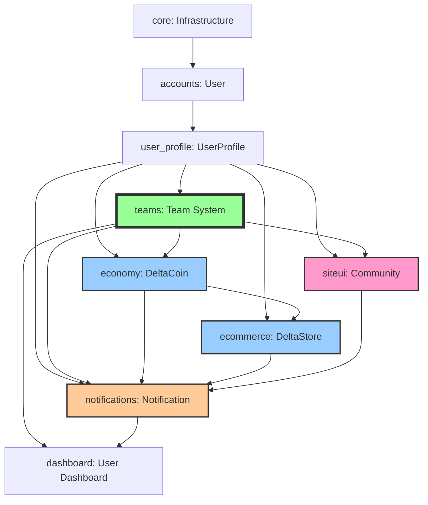
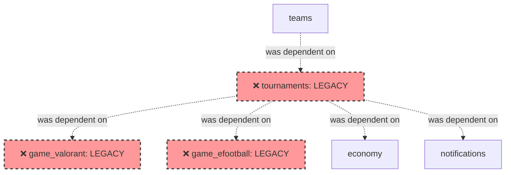

# 02 - Architecture and Tech Stack

**Document Version:** 2.0 (CORRECTED)  
**Last Updated:** November 2, 2025  
**Status:** Current System Documentation - Post-Audit Rewrite

> ⚠️ **IMPORTANT:** This document has been rewritten based on full codebase audit. Previous version incorrectly listed tournament apps as active. See `CHANGELOG.md` for details.

---

## Table of Contents
- [Backend Architecture](#backend-architecture)
- [Frontend Architecture](#frontend-architecture)
- [Technology Stack](#technology-stack)
- [Integration Points](#integration-points)
- [Request Flow Diagrams](#request-flow-diagrams)
- [Deployment Architecture](#deployment-architecture)
- [Architecture Evolution](#architecture-evolution)

---

## Backend Architecture

### Framework Foundation

**Django 4.2 LTS**
- Monolithic architecture
- **15 active custom Django apps** (3 moved to legacy_backup/)
- Shared PostgreSQL database
- MVT (Model-View-Template) pattern
- Code Reference: `deltacrown/settings.py` INSTALLED_APPS

### Application Layer Structure

```
┌─────────────────────────────────────────────────┐
│            HTTP/WebSocket Requests              │
└────────────────┬────────────────────────────────┘
                 │
┌────────────────┴────────────────────────────────┐
│              Django Middleware Layer            │
│  • Authentication • CSRF • Sessions • CORS      │
└────────────────┬────────────────────────────────┘
                 │
        ┌────────┴────────┐
        │                 │
   ┌────▼─────┐     ┌────▼─────┐
   │   URLs   │     │WebSocket │
   │  Router  │     │ Routing  │
   └────┬─────┘     └────┬─────┘
        │                │
   ┌────▼─────────────┐  │
   │  View Layer      │  │
   │  • FBV (mixed)   │  │
   │  • CBV (mixed)   │  │
   │  • Viewsets (DRF)│  │
   └────┬─────────────┘  │
        │                │
   ┌────▼─────────────┐  │
   │ Service Layer    │  │
   │ (Partial/Signals)│  │
   └────┬─────────────┘  │
        │                │
   ┌────▼────────────────▼────┐
   │     Model Layer          │
   │  • ORM (100+ models)     │
   │  • Business Logic (mixed)│
   │  • Signal Handlers       │
   └────┬─────────────────────┘
        │
   ┌────▼─────────────────────┐
   │   PostgreSQL Database    │
   └──────────────────────────┘

   Async Layer (Parallel):
   ┌──────────────────────────┐
   │   Celery Workers         │
   │  • Background Tasks      │
   │  • Email Sending         │
   │  • Notifications         │
   │  • Digest Generation     │
   └────┬─────────────────────┘
        │
   ┌────▼─────────────────────┐
   │   Redis (Broker/Cache)   │
   └──────────────────────────┘
```

### Core Apps and Responsibilities

**Code Reference:** `deltacrown/settings.py` lines 39-139

| App | Purpose | Key Models | Status | LoC (Est.) |
|-----|---------|------------|--------|------------|
| `core` | Core infrastructure | (base classes) | ✅ Active | ~800 |
| `common` | Shared utilities | (serializers, utils) | ✅ Active | ~1,200 |
| `corelib` | Core libraries | (base classes) | ✅ Active | ~600 |
| `accounts` | Authentication | User | ✅ Active | ~500 |
| `user_profile` | User profiles | UserProfile (9 game IDs) | ✅ Active | ~1,000 |
| `teams` | **Team management** | Team, TeamMembership, TeamInvite, TeamTournamentRegistration, RankingCriteria, TeamRankingHistory, TeamRankingBreakdown + 10 more | ✅ Active | **~8,000** |
| `notifications` | Multi-channel alerts | Notification, NotificationPreference, NotificationDigest | ✅ Active | ~2,500 |
| `economy` | Virtual currency | DeltaCrownWallet, DeltaCrownTransaction, CoinPolicy | ✅ Active | ~1,500 |
| `ecommerce` | DeltaStore | Product, Order, Cart, OrderItem, Wishlist, Review, Coupon, LoyaltyProgram (11 models) | ✅ Active | ~3,000 |
| `siteui` | **UI + Community** | CommunityPost, CommunityPostComment, CommunityPostLike, CommunityPostShare, CommunityPostMedia | ✅ Active | ~2,000 |
| `dashboard` | User dashboard | (no models, views only) | ✅ Active | ~800 |
| `corepages` | Static pages | (no models) | ✅ Active | ~300 |
| `search` | Global search | (not audited) | ⏳ Active | ~400 |
| `support` | Help/tickets | (not audited) | ⏳ Active | ~1,200 |
| `players` | Player profiles | (not audited) | ⏳ Active | ~800 |
| **`tournaments`** | **Tournament system** | Tournament, Match, Bracket, Registration (20+ models) | ❌ **LEGACY** | ~15,000 |
| **`game_valorant`** | **Valorant integration** | ValorantConfig | ❌ **LEGACY** | ~800 |
| **`game_efootball`** | **eFootball integration** | EfootballConfig | ❌ **LEGACY** | ~600 |

**Active Total:** ~23,000 lines (estimated, excluding tests, migrations, templates)  
**Legacy Total:** ~16,400 lines (moved to `legacy_backup/apps/`)

### Dependency Graph (Current State)



**Architecture Improvement:** Tournament app removed, reducing coupling. Teams app is now the primary feature hub but with cleaner dependencies.

### Legacy Dependencies (Removed)



**Date Removed:** November 2, 2025  
**Location:** `legacy_backup/apps/`  
**Reason:** "New Tournament Engine will be built from scratch" (comment in settings.py)

---

## Frontend Architecture

### Technology Stack

**Template Engine:** Django Templates (server-side rendering)  
**CSS:** Custom CSS + Utility classes  
**JavaScript:** Vanilla JS (no framework)  
**Rich Text Editor:** CKEditor 5 (Django integration)  
**Build Tool:** None (static files served directly)  
**State Management:** None (server-driven)

### Frontend Pattern

```
HTTP Request → Django View → Render Template with Context → HTML Response
```

**Pure Server-Side Rendering (SSR):**
- No React, Vue, or Angular
- No build step or bundler
- JavaScript used for progressive enhancement only
- HTMX or similar not used (standard form submissions)

### Template Structure

```
templates/
├── base.html                    # Master template
├── base_no_footer.html          # Variant without footer
├── home_modern.html             # Home page
├── home_cyberpunk.html          # Alt home theme
├── 403.html, 404.html, 500.html # Error pages
├── account/                     # allauth templates
├── admin/                       # Django admin overrides
├── components/                  # Reusable UI components
├── partials/                    # Partial templates (includes)
├── sections/                    # Page sections
├── teams/                       # Team-related templates
│   ├── team_list.html
│   ├── team_detail.html
│   ├── team_create.html
│   └── team_ranking.html
├── dashboard/                   # Dashboard templates
│   ├── index.html
│   └── matches.html
├── ecommerce/                   # Store templates
│   ├── product_list.html
│   ├── product_detail.html
│   ├── cart.html
│   └── checkout.html
├── pages/                       # Static/dynamic pages
│   └── community.html           # Community hub
├── notifications/               # Notification templates
├── profile/                     # User profile templates
├── user_profile/                # Extended profile templates
└── emails/                      # Email templates
```

**Code Reference:** `templates/` directory structure

### JavaScript Usage

**Minimal JS Enhancement:**
- Form validation (client-side)
- Modal dialogs
- Image preview before upload
- Notification polling/WebSocket
- Cart interactions
- Like/comment buttons (AJAX)

**No SPA Architecture:**
- Full page reloads on navigation
- Traditional form POST/GET
- Server validates all inputs

### CSS Architecture

```
static/
├── css/
│   ├── main.css              # Global styles
│   ├── teams.css             # Team-specific
│   ├── tournaments.css       # (Legacy, may be unused)
│   ├── dashboard.css         # Dashboard styles
│   └── community.css         # Community styles
├── js/
│   ├── main.js               # Global JS
│   ├── teams.js              # Team interactions
│   ├── notifications.js      # Notification handling
│   └── cart.js               # Shopping cart
├── img/                      # Static images
├── logos/                    # Brand logos
├── ecommerce/                # Store assets
├── siteui/                   # UI component assets
└── admin/                    # Django admin static files
```

---

## Technology Stack

### Backend Technologies

**Core Framework:**
- **Python 3.11+**
- **Django 4.2 LTS** (Long-term support until April 2026)
- **Django REST Framework (DRF)** - API endpoints (if any)

**Database:**
- **PostgreSQL 14+** - Primary database
- **Database Features Used:**
  - JSONB fields (preferred_games, variant, roster_snapshot, channel preferences)
  - Full-text search (not audited)
  - Indexes on foreign keys, created_at, name_ci, tag_ci
  - Unique constraints (team name, tag, coupon code, etc.)

**Caching & Task Queue:**
- **Redis 6+** - Cache + Celery broker
- **Celery** - Async task processing
  - Email sending
  - Notification digests
  - Point recalculations (?)
  - Code: `deltacrown/celery.py`

**Real-time Communication:**
- **Django Channels 4.0+** - WebSocket support
- **Channel Layer Backend:** Redis (configured in settings)
- **Use Cases:** 
  - Real-time notifications
  - Live updates (not fully audited)

**Authentication:**
- **django-allauth** - Social authentication + standard auth
- **Providers:** Google, Facebook, Discord (configured)
- **Custom User Model:** `accounts.User`

**Rich Text Editing:**
- **django-ckeditor-5** - WYSIWYG editor
- **Use Cases:**
  - Tournament rules/descriptions (legacy)
  - Community post content
  - Product descriptions

**File Storage:**
- **Django's FileField/ImageField**
- **Storage:** Local filesystem (development) or cloud (production - not audited)
- **Upload Paths:**
  - `user_avatars/{user_id}/`
  - `team_logos/{team_id}/`
  - `teams/banners/`
  - `teams/rosters/`
  - `community/posts/{year}/{month}/{day}/`
  - `ecommerce/products/`

**API Framework:**
- **Django REST Framework (DRF)**
- **Serializers:** `apps/common/serializers.py` (TournamentSerializer for legacy data)
- **Status:** API endpoints not fully audited

### Third-Party Packages

**Code Reference:** `requirements.txt`

**Key Dependencies (Verified):**
```
Django>=4.2,<5.0
django-allauth
django-ckeditor-5
djangorestframework
channels
channels-redis
celery
redis
psycopg2-binary
Pillow  # Image processing
```

**Additional Packages (Not Fully Audited):**
- `django-crispy-forms` - Form rendering
- `whitenoise` - Static file serving
- `gunicorn` - WSGI server (production)
- `python-decouple` - Environment variables
- Payment integrations (if any)

### Frontend Technologies

**Core:**
- HTML5
- CSS3 (custom, no Tailwind/Bootstrap confirmed)
- Vanilla JavaScript (ES6+)
- Django Template Language (DTL)

**No Build Pipeline:**
- No Webpack, Vite, or Parcel
- No npm/yarn dependencies for frontend
- No TypeScript
- No Sass/Less preprocessing (plain CSS)

**Progressive Enhancement:**
- Site works without JavaScript
- JavaScript adds interactivity (modals, AJAX, live updates)

---

## Integration Points

### External Services

**Payment Gateways (Status Unknown):**
- ❓ bKash, Nagad, Rocket (Bangladesh mobile banking)
- ❓ Stripe (international credit cards)
- ❓ PayPal
- ❓ Cryptocurrency payment processor
- **Note:** Payment methods defined in ecommerce models but integration not audited

**Social Media (OAuth):**
- ✅ Google OAuth (django-allauth)
- ✅ Facebook OAuth (django-allauth)
- ✅ Discord OAuth (django-allauth)
- **Code:** `deltacrown/settings.py` SOCIALACCOUNT_PROVIDERS

**Notifications:**
- ✅ Email (SMTP configured)
- ❓ Discord webhooks (preference exists, actual sending not verified)
- ❓ SMS/mobile push (not found in audit)

**Cloud Services:**
- ❓ Media storage (S3, Cloudinary, etc.) - Not audited
- ❓ CDN - Not audited
- ❓ Logging/monitoring (Sentry, etc.) - Not audited

### Internal APIs

**REST API (DRF):**
- ❓ API endpoints not fully mapped
- ✅ `TournamentSerializer` exists in `apps/common/serializers.py`
- ❓ API authentication method unclear (Token, JWT, Session)

**WebSocket Channels:**
- ✅ Django Channels configured
- ❓ WebSocket routing not audited
- ❓ Consumer classes not audited
- **Potential Use Cases:**
  - Real-time notifications
  - Live community feed updates
  - Team activity streams

---

## Request Flow Diagrams

### Standard Page Request (SSR)

```
1. Browser → Django (HTTP GET /teams/)
2. Django URLConf routes to teams.views.team_list
3. View queries Team.objects.all()
4. PostgreSQL returns queryset
5. View renders templates/teams/team_list.html with context
6. Django returns HTML response
7. Browser displays page
8. Browser requests static files (CSS, JS, images)
9. Django serves from static/ folder (or CDN)
```

### Form Submission (POST)

```
1. Browser → Django (HTTP POST /teams/create/)
2. Django validates CSRF token
3. View processes form (TeamCreateForm)
4. Validation:
   - Check team name uniqueness (case-insensitive via name_ci)
   - Check tag uniqueness
   - Validate game choice
   - Validate image upload
5. If valid:
   - Create Team instance
   - Save to PostgreSQL
   - Create TeamMembership for captain
   - Create TeamRankingBreakdown
   - Trigger signal handlers (if any)
6. Redirect to team detail page (HTTP 302)
7. Browser follows redirect (GET /teams/{slug}/)
```

### AJAX Request (Community Like)

```
1. Browser → Django (HTTP POST /community/post/{id}/like/, AJAX)
2. Django authenticates user
3. View checks if CommunityPostLike exists
4. If not exists:
   - Create CommunityPostLike(post=post, user=user)
   - Signal increments post.likes_count
   - Save to PostgreSQL
5. Return JSON response: {"success": true, "likes_count": 42}
6. JavaScript updates like counter in DOM (no page reload)
```

### WebSocket Connection (Notifications)

```
1. Browser establishes WebSocket connection (ws://domain/ws/notifications/)
2. Django Channels routes to NotificationConsumer
3. Consumer authenticates user
4. Consumer joins user-specific channel group
5. Server sends unread notification count
6. When new notification created:
   - Signal handler sends to channel layer
   - Channel layer broadcasts to user's group
   - Consumer sends JSON to WebSocket
   - Browser displays notification popup
```

### Async Task (Email Notification)

```
1. Event occurs (e.g., team invite sent)
2. Signal handler or view creates Notification instance
3. Notification.save() triggers post_save signal
4. Signal checks NotificationPreference for user
5. If 'email' in enabled channels:
   - Celery task queued: send_notification_email.delay(notification_id)
6. Celery worker picks up task from Redis
7. Worker renders email template
8. Worker sends via SMTP
9. Task marked complete
```

### DeltaCoin Transaction Flow

```
1. User earns achievement (e.g., team reaches top 4)
2. View or signal calls create_transaction()
3. DeltaCrownTransaction created:
   - amount = +25 (top 4 reward from CoinPolicy)
   - reason = 'TOP4'
   - tournament_id = 123 (IntegerField - legacy reference)
   - idempotency_key = f"top4_{tournament_id}_{team_id}"
4. Transaction.save() triggers post_save signal
5. Signal updates DeltaCrownWallet.cached_balance
6. Notification created: "You earned 25 DeltaCoin!"
7. User can spend coins in DeltaStore
```

### E-commerce Purchase Flow

```
1. User adds Product to Cart
2. CartItem created/updated
3. User navigates to /crownstore/checkout/
4. View displays CartItem list + total
5. User selects payment method (delta_coins)
6. Form POST to /crownstore/checkout/
7. View validates:
   - Cart not empty
   - DeltaCrownWallet has sufficient balance
   - Product stock available (if track_stock=True)
8. If valid:
   - Create Order (status='pending')
   - Create OrderItem for each CartItem
   - Create DeltaCrownTransaction (negative amount)
   - Update product stock
   - Update Order.status = 'paid'
   - Clear Cart
   - Send order confirmation email (Celery task)
9. Redirect to order success page
```

---

## Deployment Architecture

### Development Environment

**Local Setup:**
```
┌─────────────────────────────────────┐
│       Developer Machine             │
│  • Python 3.11 venv                 │
│  • PostgreSQL (local or Docker)     │
│  • Redis (local or Docker)          │
│  • Django runserver (port 8000)     │
│  • Celery worker (terminal 2)       │
└─────────────────────────────────────┘
```

**Configuration:**
- **Settings:** `deltacrown/settings.py`
- **Test Settings:** `deltacrown/settings_test_pg.py`
- **Environment Variables:** `.env` file (via python-decouple)
- **Database:** SQLite (default) or PostgreSQL (recommended)

### Production Environment (Assumed)

**Not Fully Audited - Standard Django Stack:**

```
Internet
   ↓
┌─────────────────────────────────────┐
│   Load Balancer / Reverse Proxy     │
│         (Nginx / Cloudflare)        │
└────────────┬────────────────────────┘
             │
   ┌─────────┴────────┐
   │                  │
┌──▼──────────┐  ┌────▼────────────┐
│   Nginx     │  │  Nginx (Static) │
│  (Reverse   │  │  + Whitenoise   │
│   Proxy)    │  │                 │
└──┬──────────┘  └─────────────────┘
   │
┌──▼────────────────────────────────┐
│     Gunicorn (WSGI Server)        │
│  • Multiple worker processes      │
│  • Handles HTTP requests          │
└──┬────────────────────────────────┘
   │
┌──▼────────────────────────────────┐
│      Django Application           │
│  • 15 active apps                 │
│  • Business logic                 │
└──┬───────────┬────────────────────┘
   │           │
   │   ┌───────▼────────────────┐
   │   │   Daphne / Uvicorn     │
   │   │  (ASGI Server)         │
   │   │  • WebSocket support   │
   │   └───────┬────────────────┘
   │           │
   ├───────────┴────────┐
   │                    │
┌──▼─────────────┐  ┌──▼──────────────┐
│  PostgreSQL    │  │  Redis          │
│  • Primary DB  │  │  • Cache        │
│  • Persistent  │  │  • Celery broker│
└────────────────┘  │  • Channel layer│
                    └──┬──────────────┘
                       │
                ┌──────▼────────────┐
                │  Celery Workers   │
                │  • Background tasks│
                │  • Email sending   │
                └───────────────────┘
```

**Assumptions (Not Verified):**
- Cloud hosting (AWS, DigitalOcean, Heroku, etc.)
- PostgreSQL managed service or self-hosted
- Redis managed service (ElastiCache, Redis Cloud) or self-hosted
- Static files served via CDN or S3 + CloudFront
- SSL/TLS via Let's Encrypt or cloud provider

### File Structure

```
G:\My Projects\WORK\DeltaCrown\
├── manage.py                  # Django management
├── pytest.ini                 # Test configuration
├── requirements.txt           # Python dependencies
├── README.md                  # Project readme
├── apps/                      # 15 active Django apps
│   ├── __init__.py
│   ├── accounts/
│   ├── user_profile/
│   ├── teams/
│   ├── notifications/
│   ├── economy/
│   ├── ecommerce/
│   ├── siteui/
│   ├── dashboard/
│   ├── common/
│   ├── core/
│   ├── corelib/
│   ├── corepages/
│   ├── players/
│   ├── search/
│   └── support/
├── deltacrown/                # Project settings
│   ├── __init__.py
│   ├── settings.py            # Main settings
│   ├── settings_test_pg.py    # Test settings
│   ├── urls.py                # Root URL config
│   ├── wsgi.py                # WSGI entry
│   ├── asgi.py                # ASGI entry
│   ├── celery.py              # Celery config
│   ├── sitemaps.py            # SEO sitemaps
│   ├── test_runner.py         # Custom test runner
│   └── views.py               # Root views
├── templates/                 # Django templates
│   ├── base.html
│   ├── home_modern.html
│   ├── teams/
│   ├── dashboard/
│   ├── ecommerce/
│   ├── pages/
│   │   └── community.html
│   └── ...
├── static/                    # Static assets
│   ├── css/
│   ├── js/
│   ├── img/
│   ├── ecommerce/
│   └── ...
├── logos/                     # Logo uploads
├── tests/                     # Test files
│   ├── test_teams.py
│   ├── test_economy.py
│   ├── test_ecommerce.py
│   └── ...
├── legacy_backup/             # Removed apps
│   └── apps/
│       ├── tournaments/       # ❌ LEGACY
│       ├── game_valorant/     # ❌ LEGACY
│       └── game_efootball/    # ❌ LEGACY
└── Documents/                 # Project docs
    └── For_New_Tournament_Design/
        ├── AUDIT_SUMMARY.md
        ├── CORRECTIONS_AND_EVIDENCE.md
        └── 01-08 documentation files
```

---

## Architecture Evolution

### November 2, 2025 - Major Refactoring

**What Changed:**
1. ❌ **Removed:** `apps/tournaments/` (15,000 LoC)
2. ❌ **Removed:** `apps/game_valorant/` (800 LoC)
3. ❌ **Removed:** `apps/game_efootball/` (600 LoC)
4. ✅ **Preserved:** Tournament history tracking in Teams app
5. ✅ **Decoupled:** Changed ForeignKey to IntegerField for legacy references

**Migration Strategy:**
- Moved apps to `legacy_backup/apps/`
- Commented out in INSTALLED_APPS
- Commented out URL routes
- Changed foreign keys to IntegerField:
  - `economy.DeltaCrownTransaction.tournament_id`
  - `economy.DeltaCrownTransaction.registration_id`
  - `economy.DeltaCrownTransaction.match_id`
  - `notifications.Notification.tournament_id`
  - `notifications.Notification.match_id`
  - `teams.TeamTournamentRegistration.tournament_id`

**Rationale (from code comments):**
> "Legacy tournament system moved to legacy_backup/ (November 2, 2025)  
> New Tournament Engine will be built from scratch in tournament_engine/"

**Impact:**
- Reduced coupling: Tournament dependencies removed
- Reduced codebase size: -16,400 LoC
- Preserved history: Historical tournament data accessible via IntegerField references
- Dashboard graceful degradation: Returns empty lists for tournaments/matches
- No breaking changes: System continues to operate without errors

### Future Architecture (Planned but Not Implemented)

**New Tournament Engine (Not Built Yet):**
- Location: `tournament_engine/` (does not exist yet)
- Goals (inferred from comments):
  - Cleaner separation of concerns
  - Better game integration (plugin architecture?)
  - Scalable bracket generation
  - Real-time match updates
  - Automated workflows

**Current Status:**
- ❌ Not implemented
- ❌ No code in `tournament_engine/` directory
- ❌ No design documents for new system
- ✅ Legacy system preserved in `legacy_backup/`

---

## Where to Read Next

**Explore data models:** → [03-domain-model-erd-and-storage.md](./03-domain-model-erd-and-storage.md)  
**Understand modules:** → [04-modules-services-and-apis.md](./04-modules-services-and-apis.md)  
**Review flows:** → [05-user-flows-ui-and-frontend.md](./05-user-flows-ui-and-frontend.md)  
**See audit details:** → [AUDIT_SUMMARY.md](./AUDIT_SUMMARY.md)

---

**Document Navigation:** [← Previous: Overview](./01-project-overview-and-scope.md) | [Next: Data Model →](./03-domain-model-erd-and-storage.md)

---

**Audit Status:** ✅ Version 2.0 - Rewritten based on full codebase audit (November 2, 2025)  
**Evidence:** See [CORRECTIONS_AND_EVIDENCE.md](./CORRECTIONS_AND_EVIDENCE.md) for code references
