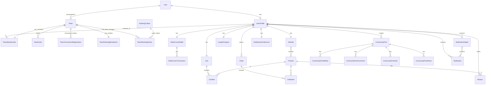
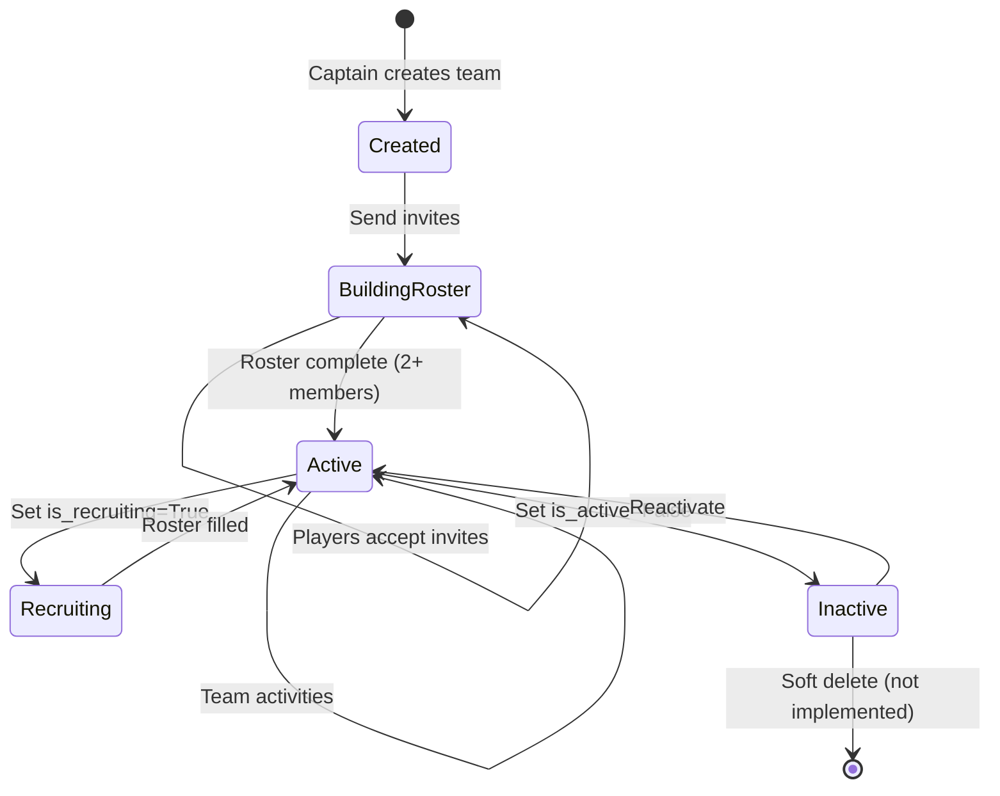
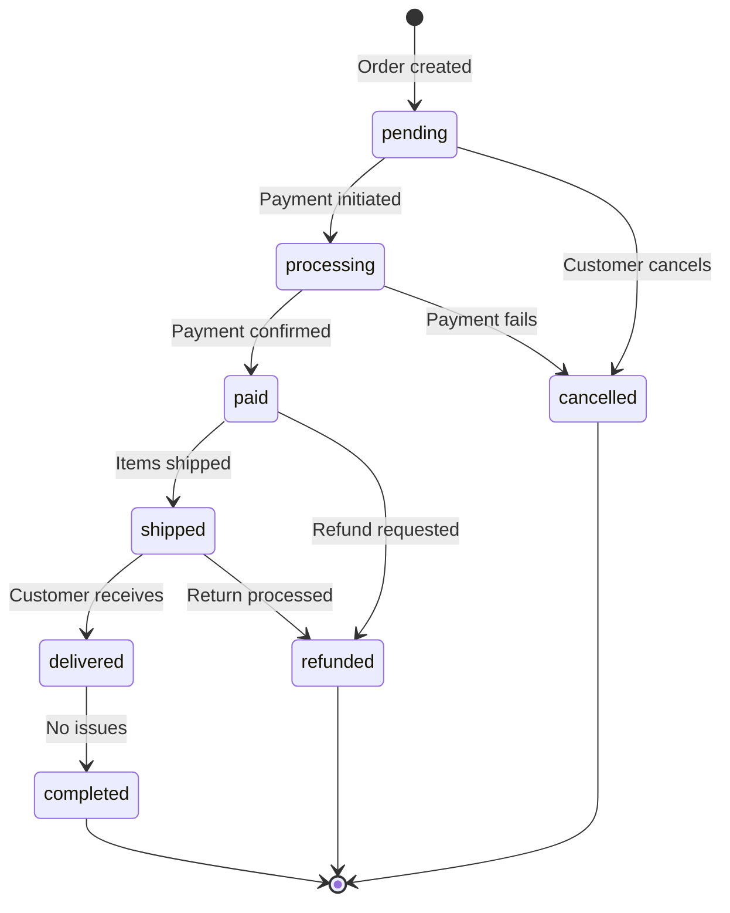
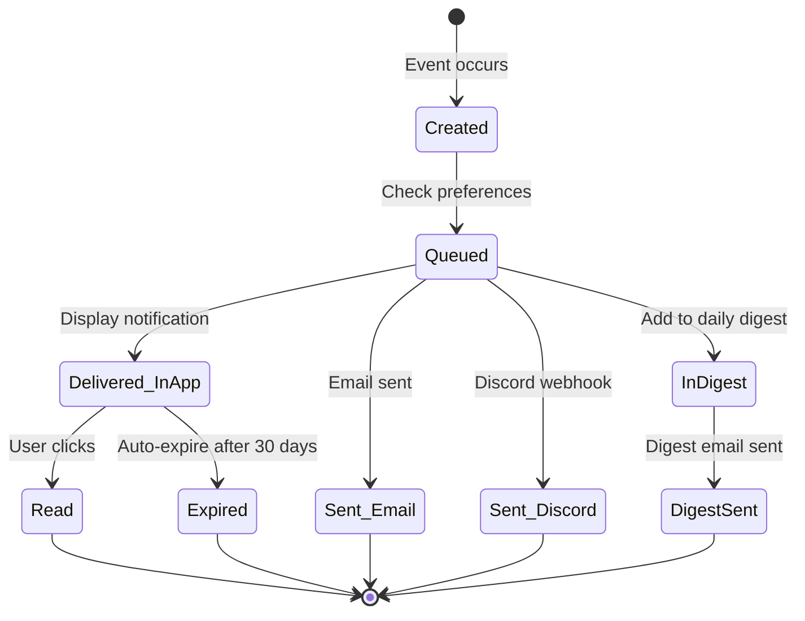
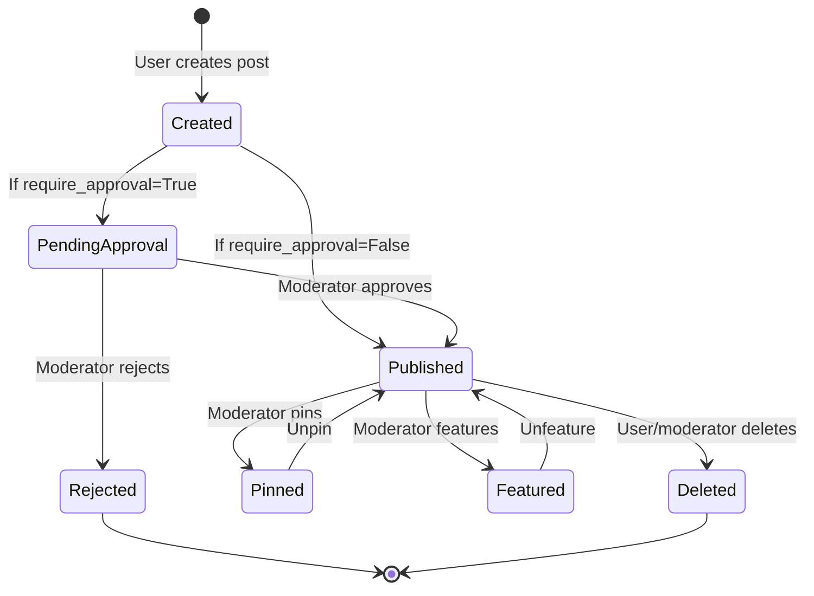

# 03 - Domain Model, ERD, and Storage

**Document Version:** 2.0 (CORRECTED)  
**Last Updated:** November 2, 2025  
**Status:** Current System Documentation - Post-Audit Rewrite

> ⚠️ **IMPORTANT:** This document has been rewritten based on full codebase audit. Previous version documented Tournament/Match/Bracket models that are now in `legacy_backup/`. See `CHANGELOG.md` for details.

---

## Table of Contents
- [Core Entity Overview](#core-entity-overview)
- [Entity Relationship Diagram](#entity-relationship-diagram)
- [Detailed Entity Specifications](#detailed-entity-specifications)
- [Lifecycle State Machines](#lifecycle-state-machines)
- [Database Schema](#database-schema)
- [Storage and Persistence](#storage-and-persistence)
- [Legacy References](#legacy-references)

---

## Core Entity Overview

### Active Entity Categorization

**User & Profile Domain (apps/accounts, apps/user_profile):**
- `User` - Authentication (Django's AbstractUser)
- `UserProfile` - Extended user info with 9 game IDs

**Team Domain (apps/teams):**
- `Team` - Team entities (794 lines, highly featured)
- `TeamMembership` - Player roster entries
- `TeamInvite` - Team invitation system with UUID tokens
- `TeamTournamentRegistration` - Tournament history tracking (DECOUPLED)
- `TournamentParticipation` - Player participation tracking
- `TournamentRosterLock` - Roster locking mechanism
- `RankingCriteria` - Configurable point values
- `TeamRankingHistory` - Point change audit trail
- `TeamRankingBreakdown` - Current point breakdown
- Plus 10+ additional models (achievements, analytics, chat, discussions, game-specific, presets, social, sponsorship, stats)

**Community Domain (apps/siteui):**
- `CommunityPost` - User posts with media
- `CommunityPostMedia` - Image/video/GIF attachments
- `CommunityPostComment` - Threaded comments
- `CommunityPostLike` - Like system
- `CommunityPostShare` - Share/repost system

**Economy Domain (apps/economy):**
- `DeltaCrownWallet` - User coin wallets
- `DeltaCrownTransaction` - Immutable transaction ledger
- `CoinPolicy` - Per-tournament coin distribution rules

**Ecommerce Domain (apps/ecommerce):**
- `Product` - Product catalog
- `Category` - Product categories
- `Brand` - Product brands
- `Cart` - Shopping carts
- `CartItem` - Cart line items
- `Order` - Orders with 8 status states
- `OrderItem` - Order line items
- `Wishlist` - User wishlists
- `Review` - Product reviews
- `Coupon` - Discount codes
- `LoyaltyProgram` - Points and tiers

**Notification Domain (apps/notifications):**
- `Notification` - Notification records (15+ types)
- `NotificationPreference` - Per-type channel preferences
- `NotificationDigest` - Daily digest batching

**Dashboard Domain (apps/dashboard):**
- No models (views only)

**Total Active Entity Count:** 40+ verified models (10+ not yet audited in teams, players, search, support apps)

### ❌ Legacy Entities (Moved to legacy_backup/)

**Tournament Domain (LEGACY):**
- ❌ `Tournament` - Main tournament entity
- ❌ `TournamentSettings` - Configuration
- ❌ `TournamentSchedule` - Time management
- ❌ `TournamentCapacity` - Slot limits
- ❌ `TournamentFinance` - Pricing and prizes
- ❌ `TournamentMedia` - Media assets
- ❌ `TournamentRules` - Rules
- ❌ `TournamentArchive` - Historical data

**Registration Domain (LEGACY):**
- ❌ `Registration` - Team/player entries
- ❌ `RegistrationRequest` - Pre-approval queue
- ❌ `PaymentVerification` - Payment proof workflow

**Match Domain (LEGACY):**
- ❌ `Bracket` - Bracket structure
- ❌ `Match` - Match entities
- ❌ `MatchAttendance` - Check-in tracking
- ❌ `MatchEvent` - Match timeline
- ❌ `MatchComment` - Match discussions
- ❌ `MatchDispute` - Dispute workflow
- ❌ `MatchDisputeEvidence` - Evidence uploads

**Game Configuration Domain (LEGACY):**
- ❌ `GameConfiguration` - Dynamic game settings
- ❌ `ValorantConfig` - Valorant-specific settings
- ❌ `EfootballConfig` - eFootball-specific settings

**Total Legacy Entity Count:** 20+ models (not operational)

---

## Entity Relationship Diagram

### High-Level Domain Relationships (Current State)



### Team Domain Detail

```mermaid
erDiagram
    Team {
        int id PK
        string name UK "Unique team name"
        string tag UK "Unique 2-10 char tag"
        string name_ci "Case-insensitive search"
        string tag_ci "Case-insensitive search"
        text description
        string game "One of 9 GAME_CHOICES"
        string slug
        FK captain "UserProfile FK"
        image logo
        image banner_image
        image roster_image
        string region
        url twitter
        url instagram
        url discord
        url youtube
        url twitch
        url linktree
        int followers_count
        int posts_count
        bool is_verified
        bool is_featured
        bool allow_posts
        bool allow_followers
        bool posts_require_approval
        bool is_active
        bool is_public
        bool allow_join_requests
        int total_points "Calculated from breakdown"
        int adjust_points "Manual admin adjustment"
        string hero_template "5 choices"
        string tagline
        bool is_recruiting
        bool show_roster_publicly
        bool members_can_post
        bool require_post_approval
        bool members_can_invite
        bool auto_accept_join_requests
        datetime created_at
        datetime updated_at
    }
    
    TeamMembership {
        int id PK
        FK team
        FK profile "UserProfile FK"
        string role "captain/player/sub/coach/manager"
        string status "active/inactive/banned"
        datetime joined_at
    }
    
    TeamInvite {
        int id PK
        FK team
        FK invited_user "UserProfile FK, nullable"
        string invited_email "If no user yet"
        FK inviter "UserProfile FK"
        string role "Target role"
        uuid token "Unique invite token"
        string status "pending/accepted/rejected/expired/cancelled"
        datetime expires_at
        datetime created_at
    }
    
    TeamTournamentRegistration {
        int id PK
        FK team
        int tournament_id "IntegerField - legacy reference"
        FK registered_by "UserProfile FK"
        string status "pending/approved/confirmed/rejected/withdrawn/cancelled"
        json roster_snapshot
        bool payment_verified
        FK verified_by "User FK, nullable"
        datetime created_at
        datetime verified_at
    }
    
    TeamRankingBreakdown {
        FK team PK "OneToOne"
        int tournament_participation_points
        int tournament_winner_points
        int tournament_runner_up_points
        int tournament_top_4_points
        int member_count_points
        int team_age_points
        int achievement_points
        int manual_adjustment_points
        int calculated_total
        int final_total
        datetime last_calculated
    }
    
    TeamRankingHistory {
        int id PK
        FK team
        int points_change "Positive or negative"
        int points_before
        int points_after
        string source "tournament_participation/winner/etc"
        text reason
        string related_object_type
        int related_object_id
        FK admin_user "User FK, nullable"
        datetime created_at
    }
    
    RankingCriteria {
        int id PK
        int tournament_participation "Default 50"
        int tournament_winner "Default 500"
        int tournament_runner_up "Default 300"
        int tournament_top_4 "Default 150"
        int points_per_member "Default 10"
        int points_per_month_age "Default 30"
        int achievement_points "Default 100"
        bool is_active "Only one active at a time"
        datetime created_at
        datetime updated_at
    }
    
    Team ||--o{ TeamMembership : "has_members"
    Team ||--o{ TeamInvite : "sends_invites"
    Team ||--o{ TeamTournamentRegistration : "has_history"
    Team ||--|| TeamRankingBreakdown : "has_breakdown"
    Team ||--o{ TeamRankingHistory : "has_changes"
```

### Economy Domain Detail

```mermaid
erDiagram
    UserProfile {
        int id PK
        FK user UK "OneToOne to User"
        string display_name
        string region
        image avatar
        text bio
        json preferred_games
        string riot_id "Valorant"
        string riot_tagline "Valorant"
        string efootball_id "eFootball"
        string steam_id "CS2, Dota 2"
        string mlbb_id "Mobile Legends"
        string mlbb_server_id "Mobile Legends"
        string pubg_mobile_id "PUBG Mobile"
        string free_fire_id "Free Fire"
        string ea_id "EA Sports FC"
        string codm_uid "COD Mobile"
        bool is_private
        bool show_email
        bool show_phone
        bool show_socials
        datetime created_at
    }
    
    DeltaCrownWallet {
        int id PK
        FK profile UK "OneToOne to UserProfile"
        int cached_balance "Calculated from transactions"
        datetime created_at
        datetime updated_at
    }
    
    DeltaCrownTransaction {
        int id PK
        FK wallet
        int amount "Positive=credit, Negative=debit"
        string reason "PARTICIPATION/TOP4/RUNNER_UP/WINNER/ENTRY_FEE_DEBIT/REFUND/MANUAL_ADJUST/CORRECTION"
        int tournament_id "IntegerField - legacy reference"
        int registration_id "IntegerField - legacy reference"
        int match_id "IntegerField - legacy reference"
        text note
        FK created_by "User FK, nullable"
        string idempotency_key "Prevent duplicates"
        datetime created_at
    }
    
    CoinPolicy {
        int id PK
        int tournament_id UK "IntegerField - legacy reference"
        bool enabled "Default True"
        int participation "Default 5"
        int top4 "Default 25"
        int runner_up "Default 50"
        int winner "Default 100"
    }
    
    UserProfile ||--|| DeltaCrownWallet : "has"
    DeltaCrownWallet ||--o{ DeltaCrownTransaction : "has"
```

**Code Reference:** `apps/economy/models.py` lines 66-68 (IntegerField comment)

### Ecommerce Domain Detail

```mermaid
erDiagram
    Product {
        int id PK
        string name
        string slug UK
        text description
        text short_description
        decimal price
        decimal original_price
        decimal discount_percentage
        FK category
        FK brand "Nullable"
        string product_type "physical/digital/subscription/bundle"
        string rarity "common/rare/epic/legendary/mythic"
        image featured_image
        image hover_image
        int stock
        bool track_stock
        bool allow_backorder
        bool is_featured
        bool is_digital
        bool is_member_exclusive
        bool is_limited_edition
        int limited_quantity
        json compatible_games
        string esports_team
        datetime created_at
    }
    
    Category {
        int id PK
        string name UK
        string slug UK
        string category_type "featured/merchandise/digital/exclusive/limited"
        text description
        image image
        string icon
        bool is_active
        int sort_order
    }
    
    Brand {
        int id PK
        string name UK
        string slug UK
        image logo
        text description
        bool is_featured
        bool is_active
    }
    
    Cart {
        int id PK
        FK user UK "OneToOne to UserProfile"
        datetime created_at
        datetime updated_at
    }
    
    CartItem {
        int id PK
        FK cart
        FK product
        json variant "Product variant options"
        int quantity
        datetime added_at
    }
    
    Order {
        int id PK
        string order_number UK
        FK user "UserProfile FK"
        string status "pending/processing/paid/shipped/delivered/completed/cancelled/refunded"
        string payment_method "delta_coins/credit_card/paypal/crypto"
        decimal subtotal
        decimal tax_amount
        decimal shipping_cost
        decimal discount_amount
        decimal total_price
        text billing_address
        text shipping_address
        text notes
        string tracking_number
        datetime created_at
        datetime updated_at
    }
    
    OrderItem {
        int id PK
        FK order
        FK product "Nullable - snapshot preserved"
        json variant
        int quantity
        decimal unit_price
        decimal total_price
        string product_name "Snapshot"
        string product_sku "Snapshot"
    }
    
    Wishlist {
        int id PK
        FK user UK "OneToOne to UserProfile"
        datetime created_at
    }
    
    Review {
        int id PK
        FK product
        FK user "UserProfile FK"
        int rating "1-5"
        string title
        text comment
        bool is_verified_purchase
        bool is_approved
        datetime created_at
    }
    
    Coupon {
        int id PK
        string code UK
        text description
        string discount_type "percentage/fixed"
        decimal discount_value
        decimal minimum_amount
        int maximum_uses
        int used_count
        date valid_from
        date valid_to
        bool is_active
        bool member_exclusive
    }
    
    LoyaltyProgram {
        int id PK
        FK user UK "OneToOne to UserProfile"
        int points
        string tier
        decimal total_spent
        datetime created_at
        datetime updated_at
    }
    
    Product }o--|| Category : "belongs_to"
    Product }o--o| Brand : "belongs_to"
    Cart ||--o{ CartItem : "contains"
    CartItem }o--|| Product : "references"
    Order ||--o{ OrderItem : "contains"
    OrderItem }o--|| Product : "references"
    Wishlist }o--o{ Product : "contains"
    Product ||--o{ Review : "has"
```

**Code Reference:** `apps/ecommerce/models.py` (11 models, ~10KB)

### Community Domain Detail

```mermaid
erDiagram
    CommunityPost {
        int id PK
        FK author "UserProfile FK"
        string title
        text content
        string visibility "public/friends/private"
        string game "Filter by game"
        int likes_count "Auto-incremented"
        int comments_count "Auto-incremented"
        int shares_count "Auto-incremented"
        bool is_approved
        bool is_pinned
        bool is_featured
        datetime created_at
        datetime updated_at
    }
    
    CommunityPostMedia {
        int id PK
        FK post
        string media_type "image/video/gif"
        file file
        image thumbnail
        string alt_text
        int file_size
        int width
        int height
        datetime created_at
    }
    
    CommunityPostComment {
        int id PK
        FK post
        FK author "UserProfile FK"
        text content
        FK parent "Self-referential for replies"
        bool is_approved
        datetime created_at
        datetime updated_at
    }
    
    CommunityPostLike {
        int id PK
        FK post
        FK user "UserProfile FK"
        datetime created_at
        UK post_user "Unique together"
    }
    
    CommunityPostShare {
        int id PK
        FK original_post
        FK shared_by "UserProfile FK"
        text comment "Optional"
        datetime created_at
        UK original_post_shared_by "Unique together"
    }
    
    CommunityPost ||--o{ CommunityPostMedia : "has"
    CommunityPost ||--o{ CommunityPostComment : "has"
    CommunityPost ||--o{ CommunityPostLike : "has"
    CommunityPost ||--o{ CommunityPostShare : "has"
    CommunityPostComment ||--o{ CommunityPostComment : "has_replies"
```

**Code Reference:** `apps/siteui/models.py` (5 models with signal handlers)

### Notification Domain Detail

```mermaid
erDiagram
    Notification {
        int id PK
        string event "Generic event name"
        string type "15+ choices"
        string title
        text body
        string url
        bool is_read
        FK recipient "User FK"
        int tournament_id "IntegerField - legacy reference"
        int match_id "IntegerField - legacy reference"
        datetime created_at
    }
    
    NotificationPreference {
        int id PK
        FK user UK "OneToOne to User"
        json invite_sent_channels
        json invite_accepted_channels
        json roster_changed_channels
        json tournament_registered_channels
        json match_result_channels
        json ranking_changed_channels
        json sponsor_approved_channels
        json promotion_started_channels
        json payout_received_channels
        json achievement_earned_channels
        bool enable_daily_digest
        time digest_time "Default 08:00:00"
        bool opt_out_email
        bool opt_out_in_app
        bool opt_out_discord
        datetime created_at
        datetime updated_at
    }
    
    NotificationDigest {
        int id PK
        FK user
        date digest_date
        datetime sent_at
        bool is_sent
        datetime created_at
        UK user_digest_date "Unique together"
    }
    
    Notification }o--|| NotificationPreference : "respects"
    NotificationDigest }o--o{ Notification : "contains"
```

**Notification Types:**
```python
# Active types (apps/notifications/models.py lines 9-26)
INVITE_SENT, INVITE_ACCEPTED, ROSTER_CHANGED, 
TOURNAMENT_REGISTERED, MATCH_RESULT, RANKING_CHANGED,
SPONSOR_APPROVED, PROMOTION_STARTED, PAYOUT_RECEIVED,
ACHIEVEMENT_EARNED, GENERIC

# Legacy types (still in choices but may not trigger)
REG_CONFIRMED, BRACKET_READY, MATCH_SCHEDULED,
RESULT_VERIFIED, PAYMENT_VERIFIED, CHECKIN_OPEN
```

**Code Reference:** `apps/notifications/models.py` lines 42-43 (IntegerField comment)

---

## Detailed Entity Specifications

### User (`accounts.User`)

**Purpose:** Core authentication and user identity

**Model Type:** Django's AbstractUser (extended)

**Fields:**
```python
# Inherited from AbstractUser:
username: str (max=150, unique, required)
email: str (unique, required)
password: str (hashed, required)
first_name: str (max=150, optional)
last_name: str (max=150, optional)
is_staff: bool (default=False)
is_active: bool (default=True)
is_superuser: bool (default=False)
date_joined: datetime (auto)
last_login: datetime (auto)
```

**Relationships:**
- OneToOne → UserProfile
- OneToMany → Team (as captain)
- OneToMany → Notification (as recipient)
- OneToMany → NotificationPreference (as user)

**Code Reference:** `apps/accounts/models.py`

---

### UserProfile (`user_profile.UserProfile`)

**Purpose:** Extended user profile with game IDs and social links

**Key Features:**
- 9 game ID fields (Valorant, CS, Dota, eFootball, FC24, MLBB, CODM, Free Fire, PUBG)
- Privacy controls (4 boolean flags)
- Social media links (YouTube, Twitch, Discord)
- Helper methods: `get_game_id()`, `set_game_id()`, `get_game_id_label()`

**Fields:**
```python
user: FK(User, unique=True)
display_name: str(max=80)
region: str(choices=REGION_CHOICES, default='BD')
avatar: ImageField(upload_to='user_avatars/{user_id}/')
bio: text
youtube_link: url
twitch_link: url
preferred_games: JSONField(default=list)
discord_id: str(max=64)

# Game IDs (9 games)
riot_id: str(max=100)  # Valorant (Name#TAG)
riot_tagline: str(max=50)  # Valorant tagline
efootball_id: str(max=100)  # eFootball
steam_id: str(max=100)  # CS2, Dota 2
mlbb_id: str(max=100)  # Mobile Legends Game ID
mlbb_server_id: str(max=50)  # Mobile Legends Server ID
pubg_mobile_id: str(max=100)  # PUBG Mobile
free_fire_id: str(max=100)  # Free Fire
ea_id: str(max=100)  # EA Sports FC 24
codm_uid: str(max=100)  # COD Mobile

# Privacy
is_private: bool(default=False)
show_email: bool(default=False)
show_phone: bool(default=False)
show_socials: bool(default=True)

created_at: datetime(auto)
```

**Relationships:**
- OneToOne ← User
- OneToMany → TeamMembership
- OneToMany → TeamInvite (as invited_user or inviter)
- OneToOne → DeltaCrownWallet
- OneToOne → Cart
- OneToMany → Order
- OneToOne → Wishlist
- OneToMany → Review
- OneToOne → LoyaltyProgram
- OneToMany → CommunityPost
- OneToMany → CommunityPostComment
- OneToMany → CommunityPostLike
- OneToMany → CommunityPostShare

**Code Reference:** `apps/user_profile/models.py` (lines 1-70)

---

### Team (`teams.Team`)

**Purpose:** Team management with comprehensive feature set

**Key Features:**
- 794 lines of model code
- Unique name and tag (case-insensitive search via name_ci, tag_ci)
- Max roster: 8 members (enforced in TeamInvite.clean())
- 5 hero template choices
- 10+ granular privacy settings
- Member permission controls
- Join request settings
- Ranking points (calculated from TeamRankingBreakdown)

**Critical Fields:**
```python
# Identity
name: str(max=100, unique=True)
tag: str(max=10, unique=True)
name_ci: str(db_index=True)  # Case-insensitive search
tag_ci: str(db_index=True)  # Case-insensitive search
description: text(max=500)
slug: str(max=64)

# Core
captain: FK(UserProfile, null=True, SET_NULL)
game: str(choices=GAME_CHOICES)  # 9 games
region: str(max=48)
created_at: datetime(auto)
updated_at: datetime(auto)

# Media
logo: ImageField(upload_to='team_logos/{id}/')
banner_image: ImageField(upload_to='teams/banners/')
roster_image: ImageField(upload_to='teams/rosters/')

# Social
twitter, instagram, discord, youtube, twitch, linktree: url
followers_count: int(default=0)
posts_count: int(default=0)
is_verified: bool(default=False)
is_featured: bool(default=False)

# Permissions
allow_posts: bool(default=True)
allow_followers: bool(default=True)
posts_require_approval: bool(default=False)
is_active: bool(default=True)
is_public: bool(default=True)
allow_join_requests: bool(default=True)
members_can_post: bool(default=True)
require_post_approval: bool(default=False)
members_can_invite: bool(default=False)
auto_accept_join_requests: bool(default=False)
require_application_message: bool(default=True)

# Ranking
total_points: int(default=0)  # Calculated automatically
adjust_points: int(default=0)  # Manual admin adjustment

# Appearance
hero_template: str(choices=[default/centered/split/minimal/championship])
tagline: str(max=200)
is_recruiting: bool(default=False)

# Privacy (10+ settings)
show_roster_publicly: bool(default=True)
show_statistics_publicly: bool(default=True)
show_tournaments_publicly: bool(default=True)
show_achievements_publicly: bool(default=True)
hide_member_stats: bool(default=False)
hide_social_links: bool(default=False)
# ... more privacy settings
```

**Relationships:**
- ManyToOne → UserProfile (as captain)
- OneToMany → TeamMembership
- OneToMany → TeamInvite
- OneToMany → TeamTournamentRegistration
- OneToOne → TeamRankingBreakdown
- OneToMany → TeamRankingHistory

**Code Reference:** `apps/teams/models/_legacy.py` (lines 1-794)

---

### DeltaCrownTransaction (`economy.DeltaCrownTransaction`)

**Purpose:** Immutable coin transaction ledger

**Key Features:**
- Positive amount = credit, negative = debit
- Idempotency keys prevent duplicates
- Legacy tournament references as IntegerField (no FK)
- Auto-updates wallet.cached_balance on save (signal)

**Fields:**
```python
wallet: FK(DeltaCrownWallet)
amount: int  # Positive=credit, Negative=debit
reason: str(choices=[
    'PARTICIPATION',      # Tournament participation
    'TOP4',               # Tournament top 4
    'RUNNER_UP',          # Tournament runner-up
    'WINNER',             # Tournament winner
    'ENTRY_FEE_DEBIT',    # Entry fee payment
    'REFUND',             # Refund
    'MANUAL_ADJUST',      # Admin adjustment
    'CORRECTION',         # Error correction
])

# Legacy references (IntegerField - no ForeignKey)
tournament_id: int(null=True, db_index=True)
registration_id: int(null=True, db_index=True)
match_id: int(null=True)

note: text
created_by: FK(User, null=True)
idempotency_key: str(max=255, unique=True)
created_at: datetime(auto)
```

**Comment in Code (lines 66-68):**
```python
# NOTE: Changed to IntegerField - tournament app moved to legacy (Nov 2, 2025)
# Stores legacy tournament/registration/match IDs for historical reference
```

**Code Reference:** `apps/economy/models.py`

---

## Lifecycle State Machines

### Team Lifecycle



### Order Lifecycle



**Status Transitions:**
```python
# Valid transitions (apps/ecommerce/models.py)
pending → processing → paid → shipped → delivered → completed
pending → cancelled
processing → cancelled
paid → refunded
shipped → refunded
```

### Notification Lifecycle



### Community Post Lifecycle



---

## Database Schema

### Key Indexes (Verified)

**Teams:**
```sql
CREATE INDEX teams_team_name_ci ON teams_team(name_ci);
CREATE INDEX teams_team_tag_ci ON teams_team(tag_ci);
CREATE INDEX teams_team_game ON teams_team(game);
CREATE INDEX teams_team_captain_id ON teams_team(captain_id);
```

**Notifications:**
```sql
CREATE INDEX notifications_notification_recipient_is_read_created_at 
  ON notifications_notification(recipient_id, is_read, created_at);
CREATE INDEX notifications_notification_recipient_type 
  ON notifications_notification(recipient_id, type);
```

**Economy:**
```sql
CREATE INDEX economy_transaction_wallet_id ON economy_deltacrowntransaction(wallet_id);
CREATE INDEX economy_transaction_tournament_id ON economy_deltacrowntransaction(tournament_id);
CREATE INDEX economy_transaction_registration_id ON economy_deltacrowntransaction(registration_id);
CREATE UNIQUE INDEX economy_transaction_idempotency_key 
  ON economy_deltacrowntransaction(idempotency_key);
```

**Ecommerce:**
```sql
CREATE UNIQUE INDEX ecommerce_product_slug ON ecommerce_product(slug);
CREATE INDEX ecommerce_product_category_id ON ecommerce_product(category_id);
CREATE UNIQUE INDEX ecommerce_order_order_number ON ecommerce_order(order_number);
CREATE INDEX ecommerce_order_user_id ON ecommerce_order(user_id);
CREATE INDEX ecommerce_order_status ON ecommerce_order(status);
```

**Community:**
```sql
CREATE INDEX siteui_communitypost_created_at ON siteui_communitypost(created_at DESC);
CREATE INDEX siteui_communitypost_visibility_created_at 
  ON siteui_communitypost(visibility, created_at DESC);
CREATE INDEX siteui_communitypost_game_created_at 
  ON siteui_communitypost(game, created_at DESC);
CREATE INDEX siteui_communitypost_featured_created_at 
  ON siteui_communitypost(is_featured, created_at DESC);
```

### Unique Constraints

```sql
-- Teams
UNIQUE (teams_team.name)
UNIQUE (teams_team.tag)
UNIQUE (teams_teaminvite.token)

-- Economy
UNIQUE (economy_deltacrownwallet.profile_id)
UNIQUE (economy_deltacrowntransaction.idempotency_key)
UNIQUE (economy_coinpolicy.tournament_id)

-- Ecommerce
UNIQUE (ecommerce_product.slug)
UNIQUE (ecommerce_category.name)
UNIQUE (ecommerce_category.slug)
UNIQUE (ecommerce_brand.name)
UNIQUE (ecommerce_brand.slug)
UNIQUE (ecommerce_order.order_number)
UNIQUE (ecommerce_coupon.code)
UNIQUE (ecommerce_cart.user_id)
UNIQUE (ecommerce_wishlist.user_id)
UNIQUE (ecommerce_loyaltyprogram.user_id)

-- Community
UNIQUE (siteui_communitypostlike.post_id, siteui_communitypostlike.user_id)
UNIQUE (siteui_communitypostshare.original_post_id, siteui_communitypostshare.shared_by_id)

-- Notifications
UNIQUE (notifications_notificationpreference.user_id)
UNIQUE (notifications_notificationdigest.user_id, notifications_notificationdigest.digest_date)
```

---

## Storage and Persistence

### File Uploads

**Upload Paths:**
```python
# User avatars
user_avatars/{user_id}/{filename}

# Team assets
team_logos/{team_id}/{filename}
teams/banners/{filename}
teams/rosters/{filename}

# Community media
community/posts/{year}/{month}/{day}/{filename}
community/thumbnails/{year}/{month}/{day}/{filename}

# Ecommerce
ecommerce/products/{filename}
ecommerce/brands/{filename}
ecommerce/categories/{filename}
```

**Storage Backend:**
- Development: Local filesystem (`MEDIA_ROOT`)
- Production: Not audited (likely S3 or similar)

### Database

**Primary Database:** PostgreSQL 14+

**JSON Fields (JSONB):**
- `UserProfile.preferred_games` - List of game preferences
- `Team.roster_snapshot` - Tournament roster snapshots
- `CartItem.variant` - Product variant options
- `OrderItem.variant` - Order item variants
- `TournamentSettings.custom_fields` - Custom config (legacy)
- `NotificationPreference.*_channels` - Per-type channel lists (15+ fields)

**Transaction Isolation:**
- Default: READ COMMITTED
- Atomic operations for coin transactions (idempotency keys)
- Signal handlers may create race conditions (not fully audited)

---

## Legacy References

### IntegerField Migration (November 2, 2025)

**Apps Affected:**
1. **apps/economy/models.py** (lines 66-68)
2. **apps/notifications/models.py** (lines 42-43)
3. **apps/teams/models/tournament_integration.py**

**Pattern:**
```python
# Before (with ForeignKey):
tournament = models.ForeignKey('tournaments.Tournament', on_delete=CASCADE)

# After (with IntegerField):
tournament_id = models.IntegerField(
    null=True, 
    blank=True, 
    db_index=True,
    help_text="Legacy tournament ID (reference only)"
)
```

**Rationale:**
- Preserve historical data
- Decouple from removed tournament app
- Allow future tournament system without breaking existing data

**Data Preservation:**
- All historical tournament IDs preserved as integers
- Queries can still filter by tournament_id
- No data loss during migration

---

## Where to Read Next

**Explore app details:** → [04-modules-services-and-apis.md](./04-modules-services-and-apis.md)  
**Review user flows:** → [05-user-flows-ui-and-frontend.md](./05-user-flows-ui-and-frontend.md)  
**See audit summary:** → [AUDIT_SUMMARY.md](./AUDIT_SUMMARY.md)

---

**Document Navigation:** [← Previous: Architecture](./02-architecture-and-tech-stack.md) | [Next: Modules & APIs →](./04-modules-services-and-apis.md)

---

**Audit Status:** ✅ Version 2.0 - Rewritten based on full codebase audit (November 2, 2025)  
**Evidence:** See [CORRECTIONS_AND_EVIDENCE.md](./CORRECTIONS_AND_EVIDENCE.md) for code references
