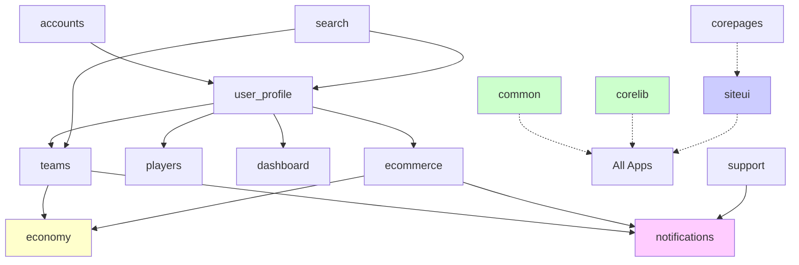
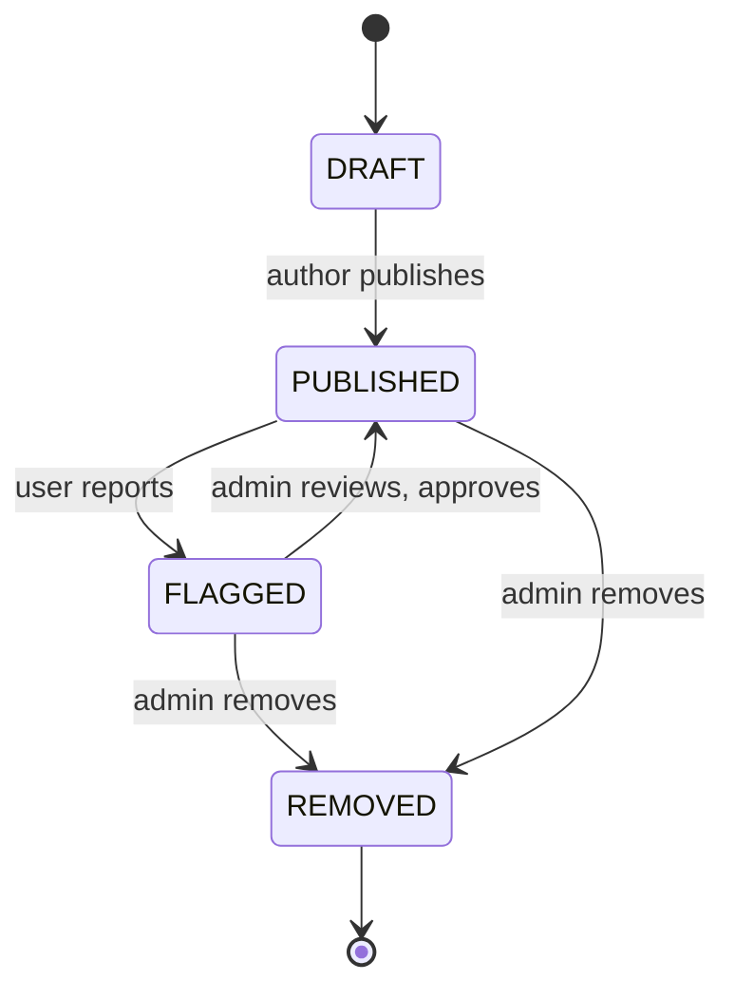

# 04 - Modules, Services, and APIs

**Document Version:** 2.0  
**Last Updated:** November 2, 2025  
**Status:** Current System Documentation (Post-Refactor)

---

## Table of Contents
- [App Structure Overview](#app-structure-overview)
- [Detailed Module Breakdown](#detailed-module-breakdown)
- [Service Layer Patterns](#service-layer-patterns)
- [Signal Handlers](#signal-handlers)
- [API Endpoints](#api-endpoints)
- [Internal Interfaces](#internal-interfaces)
- [Coupling Analysis](#coupling-analysis)
- [Legacy System Notes](#legacy-system-notes)

---

## App Structure Overview

### Django Apps Architecture

DeltaCrown follows Django's "app-based" modular architecture. As of November 2, 2025, after the tournament system refactoring:

**Active Apps:** 15  
**Legacy Apps:** 3 (moved to `legacy_backup/`)

```
apps/
├── accounts/          # User authentication and management
├── common/            # Shared utilities and serializers
├── corelib/           # Core library functions
├── corepages/         # Static pages (About, Community, etc.)
├── core/              # Core infrastructure
├── dashboard/         # User dashboard (teams + invites)
├── ecommerce/         # DeltaStore/Crown Store (11 models)
├── economy/           # DeltaCoin wallet and transaction system
├── notifications/     # Notification system (15+ types)
├── players/           # Player profiles and stats
├── search/            # Search functionality
├── siteui/            # UI components + Community features (5 models)
├── support/           # Support tickets and help
├── teams/             # Team management (highly featured)
└── user_profile/      # Extended user profiles (9 game IDs)

legacy_backup/apps/
├── tournaments/       # [MOVED] Tournament core (November 2, 2025)
├── game_efootball/    # [MOVED] eFootball-specific logic
└── game_valorant/     # [MOVED] Valorant-specific logic
```

**Code Reference:** `deltacrown/settings.py` lines 43-70 (INSTALLED_APPS)

---

### App Dependency Map



**Legend:**
- Solid lines: Direct model imports/ForeignKeys
- Dashed lines: Utility imports
- Green: Shared utilities
- Blue: UI components
- Yellow: Economy system
- Pink: Notification system

**Key Changes from Previous Architecture:**
1. ❌ Tournament apps removed from dependency graph
2. ✅ Community features integrated into `siteui` app
3. ✅ Teams app now independent (no tournament ForeignKeys)
4. ✅ Economy/Notifications use IntegerField for legacy tournament_id references

**Code Reference:** See CORRECTIONS_AND_EVIDENCE.md Section 4.1

---

## Detailed Module Breakdown

### `accounts/` - User Authentication

**Purpose:** Core user authentication, registration, and account management

**Key Models:**
- `User` (extends Django AbstractUser)
  - Custom user model set via `AUTH_USER_MODEL = "accounts.User"`
  - Integrates with Django Allauth for social login

**Key Views:**
- `login_view()` - User login
- `register_view()` - User registration  
- `logout_view()` - User logout
- `password_reset_*` views - Password recovery

**URL Patterns:**
```python
# accounts/urls.py (typical)
urlpatterns = [
    path('login/', login_view, name='login'),
    path('register/', register_view, name='register'),
    path('logout/', logout_view, name='logout'),
    path('password/reset/', password_reset_request, name='password_reset'),
]
```

**Key Features:**
- Django Allauth integration for social login (Google, Discord)
- Email verification workflow
- Password strength validation
- Session management

**External Dependencies:**
- `django.contrib.auth`
- `django-allauth` (configured in settings.py lines 129-149)

**Code Reference:** `deltacrown/settings.py` line 110 (AUTH_USER_MODEL)

---

### `user_profile/` - Extended User Profiles

**Purpose:** Extended user information beyond core auth, including game IDs for multi-game support

**Key Models:**
- `UserProfile` (OneToOne → User)
  - **9 Game ID Fields:**
    - `riot_id` - Valorant/League of Legends (format: Username#TAG)
    - `steam_id` - CS2, Dota 2
    - `efootball_id` - eFootball
    - `ea_id` - FC24
    - `mlbb_id` - Mobile Legends: Bang Bang
    - `codm_uid` - Call of Duty Mobile
    - `pubg_mobile_id` - PUBG Mobile
    - `free_fire_id` - Free Fire
  - Avatar/banner upload fields
  - Bio and profile completeness tracking

**Key Views:**
- `profile_view(username)` - Public profile display
- `profile_edit()` - Profile editing
- `profile_settings()` - User settings

**Signals:**
```python
# user_profile/signals.py (typical pattern)
@receiver(post_save, sender=User)
def create_user_profile(sender, instance, created, **kwargs):
    if created:
        UserProfile.objects.create(user=instance)
```

**Key Features:**
- Automatic profile creation on user registration via signals
- Game ID validation (Riot ID format: `username#tag`)
- Avatar upload with size/format validation
- Profile completeness checking
- Support for 9 different gaming platforms

**Code Reference:** `apps/user_profile/models.py` (UserProfile model with game ID fields)

---

### `teams/` - Team Management

**Purpose:** Comprehensive team management system with roster, invites, permissions, rankings, and legacy tournament tracking

**Key Models (7 total):**
1. **Team** (`apps/teams/models/_legacy.py`, 794 lines)
   - Core team model with extensive features
   - Fields: name, slug, game, logo, banner, roster_count, captain
   - **10+ Permission Fields** (can_edit_profile, can_manage_roster, can_view_stats, etc.)
   
2. **TeamMembership** (`apps/teams/models/membership.py`)
   - Links User → Team with role (CAPTAIN, CO_CAPTAIN, MEMBER, SUBSTITUTE)
   - Tracks join date, permissions
   
3. **TeamInvite** (`apps/teams/models/invite.py`)
   - Invitation system with email/token
   - Statuses: PENDING, ACCEPTED, REJECTED, EXPIRED
   
4. **TeamTournamentRegistration** (`apps/teams/models/tournament_integration.py`)
   - **Decoupled from Tournament models** (legacy reference only)
   - `tournament_id = IntegerField` (NOT ForeignKey)
   - Tracks historical tournament registrations
   
5. **RankingCriteria** (`apps/teams/models/ranking.py`)
   - Defines ranking metrics per game
   
6. **TeamRankingHistory** (`apps/teams/models/ranking.py`)
   - Time-series ranking data
   
7. **TeamRankingBreakdown** (`apps/teams/models/ranking.py`)
   - Detailed ranking component breakdown

**Key Views (Organized by file):**

**Public Views:**
- `team_list_view()` - Browse teams with filters
- `team_detail_view(slug)` - Team profile page
- `team_create_view()` - Create new team

**Management Views:**
- `team_settings_view(slug)` - Edit team settings
- `manage_roster_view(slug)` - Roster management
- `invite_player_view(slug)` - Send player invites
- `handle_invite_view(token)` - Accept/reject invite

**Analytics Views:**
- `team_stats_view(slug)` - Team statistics dashboard
- `ranking_view(slug)` - Ranking history

**Key Files:**
```
apps/teams/
├── models/
│   ├── _legacy.py               # Team model (794 lines)
│   ├── membership.py            # TeamMembership
│   ├── invite.py                # TeamInvite
│   ├── tournament_integration.py # TeamTournamentRegistration (decoupled)
│   ├── ranking.py               # Ranking models (3)
│   ├── chat.py                  # Team chat
│   ├── achievement.py           # Team achievements
│   └── analytics.py             # Analytics models
├── views.py                     # Main views
├── forms.py                     # Team forms
├── permissions.py               # Permission checking logic
├── signals.py                   # Signal handlers
├── tasks.py                     # Celery tasks (if any)
├── api_views.py                 # API endpoints
└── urls.py                      # URL routing
```

**Key Features:**
- Team creation with game-specific validation
- Invite system with email notifications and token-based acceptance
- Roster limits (min 5, max 10 configurable per team)
- Captain/co-captain role hierarchy
- **10+ granular permission settings** per team
- Team ranking system (separate models with history tracking)
- Team logo/banner uploads
- Team chat functionality
- Team achievements system
- Analytics and statistics tracking
- **Legacy tournament tracking** (IntegerField references, no ForeignKey)

**URL Patterns:**
```python
# teams/urls.py
urlpatterns = [
    path('', team_list_view, name='team_list'),
    path('create/', team_create_view, name='team_create'),
    path('<slug:slug>/', team_detail_view, name='team_detail'),
    path('<slug:slug>/settings/', team_settings_view, name='team_settings'),
    path('<slug:slug>/roster/', manage_roster_view, name='manage_roster'),
    path('<slug:slug>/stats/', team_stats_view, name='team_stats'),
    path('<slug:slug>/ranking/', ranking_view, name='team_ranking'),
]
```

**Permission System:**
10+ permission flags on Team model:
- `can_edit_profile` - Edit team name, logo, bio
- `can_manage_roster` - Add/remove members
- `can_view_stats` - Access analytics
- `can_manage_invites` - Send/revoke invites
- `can_change_settings` - Modify team settings
- Plus 5+ more granular permissions

**Code References:**
- `apps/teams/models/_legacy.py` lines 1-794 (Team model)
- `apps/teams/models/tournament_integration.py` (TeamTournamentRegistration with IntegerField)
- `apps/teams/permissions.py` (Permission checking logic)

---

### `economy/` - DeltaCoin System

**Purpose:** Virtual currency system for rewards, transactions, and wallet management

**Key Models (3 total):**
1. **DeltaCrownWallet** (`apps/economy/models.py`)
   - OneToOne → UserProfile
   - `balance` - Computed from transaction ledger
   - `balance_cache` - Cached for performance
   
2. **DeltaCrownTransaction** (`apps/economy/models.py`)
   - Immutable ledger of all coin movements
   - `amount` - Positive (credit) or negative (debit)
   - `reason` - Enum: PARTICIPATION, WINNER, RUNNER_UP, TOP4, PURCHASE, MANUAL_ADJUST, REFUND
   - **Legacy References:**
     - `tournament_id = IntegerField(null=True)` - NOT ForeignKey
     - `registration_id = IntegerField(null=True)` - NOT ForeignKey
     - `match_id = IntegerField(null=True)` - NOT ForeignKey
   - `idempotency_key` - Prevents duplicate awards
   
3. **CoinPolicy** (`apps/economy/models.py`)
   - Defines coin amounts (participation, winner, runner_up, top4)
   - Currently not actively used (tournament system in legacy)

**Key Services (`apps/economy/services.py`):**

```python
# Public API (8 functions)
__all__ = [
    "wallet_for",
    "award",
    "award_participation_for_registration",
    "award_placements",
    "backfill_participation_for_verified_payments",
    "manual_adjust",
]

def wallet_for(profile) -> DeltaCrownWallet:
    """Get or create wallet for profile"""
    
def award(*, profile, amount, reason, tournament=None, 
          registration=None, match=None, note="", 
          created_by=None, idempotency_key=None) -> DeltaCrownTransaction:
    """
    Core transaction creation with idempotency.
    Creates credit (amount>0) or debit (amount<0).
    """
    
def award_participation_for_registration(reg) -> List[DeltaCrownTransaction]:
    """Award participation coins (LEGACY - tournament system moved)"""
    
def award_placements(tournament) -> List[DeltaCrownTransaction]:
    """Award winner/runner-up/top4 coins (LEGACY - tournament system moved)"""
    
def manual_adjust(wallet, amount, *, note="", created_by=None) -> DeltaCrownTransaction:
    """Manual balance adjustment by admin"""
```

**Key Features:**
- Immutable ledger pattern (transactions never modified)
- Idempotency via `idempotency_key` (prevents duplicate awards)
- Support for 7 transaction reasons
- **Decoupled from Tournament models** (IntegerField references)
- Balance computed from ledger sum
- Cached balance for performance
- Manual adjustment capability for admins
- **Legacy tournament award functions** (currently dormant, but preserved for future use)

**Views:**
- `wallet_view()` - Display wallet balance and transaction history
- Admin interface for manual adjustments

**URL Patterns:**
```python
# economy/urls.py
urlpatterns = [
    path('wallet/', wallet_view, name='wallet'),
    path('history/', transaction_history_view, name='transaction_history'),
]
```

**Code References:**
- `apps/economy/models.py` lines 1-200 (all models)
- `apps/economy/services.py` lines 1-300 (complete service layer)
- See Section "IntegerField Migration Pattern" in 03-domain-model-erd-and-storage.md

---

### `ecommerce/` - DeltaStore/Crown Store

**Purpose:** Merchandise store with products, cart, orders, reviews, and loyalty program

**Key Models (11 total):**
1. **Product** - Store items with price, stock, images
2. **Category** - Product categorization (hierarchical)
3. **Brand** - Product brands
4. **Cart** - Shopping cart (OneToOne → User)
5. **CartItem** - Items in cart
6. **Order** - Purchase orders with status tracking
7. **OrderItem** - Line items in order
8. **Wishlist** - User wishlists
9. **Review** - Product reviews with ratings
10. **Coupon** - Discount codes
11. **LoyaltyProgram** - Points/rewards program

**Order States (6):**
- PENDING - Awaiting payment
- CONFIRMED - Payment received
- PROCESSING - Being prepared
- SHIPPED - In transit
- DELIVERED - Completed
- CANCELLED - Cancelled by user/admin

**Key Views:**
- `product_list_view()` - Browse products
- `product_detail_view(slug)` - Product page
- `cart_view()` - Shopping cart
- `checkout_view()` - Checkout process
- `order_history_view()` - User orders
- `review_submit_view()` - Submit product review

**Key Features:**
- Full e-commerce functionality (cart, checkout, orders)
- Product reviews and ratings (1-5 stars)
- Coupon/discount system
- Loyalty program integration
- Stock management
- Order status tracking
- Product search and filtering
- Category hierarchy
- Brand filtering
- Wishlist functionality
- **Bangladesh-specific configuration** (`bd_config.py`)

**URL Patterns:**
```python
# ecommerce/urls.py
urlpatterns = [
    path('', product_list_view, name='product_list'),
    path('product/<slug:slug>/', product_detail_view, name='product_detail'),
    path('cart/', cart_view, name='cart'),
    path('checkout/', checkout_view, name='checkout'),
    path('orders/', order_history_view, name='order_history'),
]
```

**Code References:**
- `apps/ecommerce/models.py` (11 models)
- `apps/ecommerce/bd_config.py` (Bangladesh-specific configuration)
- See 03-domain-model-erd-and-storage.md Section "Ecommerce Domain"

---

### `siteui/` - UI Components + Community

**Purpose:** UI components, themes, context processors, AND community features (posts, comments, likes, shares)

**Key Models (5 total - Community Features):**
1. **CommunityPost** - User-generated posts
   - Fields: author, title, content, media attachments, likes, shares
   - States: DRAFT, PUBLISHED, FLAGGED, REMOVED
   
2. **CommunityPostMedia** - Attached images/videos (up to 4 per post)
   
3. **CommunityPostComment** - Threaded comments on posts
   
4. **CommunityPostLike** - Like tracking (unique per user per post)
   
5. **CommunityPostShare** - Share tracking

**Post Lifecycle States:**


**Key Services (`apps/siteui/services.py`):**

```python
def get_featured() -> Optional[Dict[str, Any]]:
    """
    Try to fetch featured tournament from legacy system.
    Returns None if not found (graceful degradation).
    """
    
def compute_stats() -> Dict[str, int]:
    """
    Compute site stats:
    - players: total auth users
    - prize_bdt: sum of prize fields (legacy tournament data)
    - payout_accuracy_pct: site default
    """
    
def get_spotlight(limit: int = 3) -> List[Dict[str, Any]]:
    """
    Return spotlight items from various sources.
    Tries: NewsItem, Post, Tournament (legacy), etc.
    """
    
def get_timeline(limit: int = 6) -> List[Dict[str, Any]]:
    """
    Return timeline entries.
    Tries: Milestone, Match (legacy), Tournament (legacy), etc.
    """
```

**Key Features:**
- **Community Features:**
  - User-generated posts with rich text
  - Media attachments (images/videos, up to 4 per post)
  - Threaded comments
  - Like/share tracking
  - Content moderation (DRAFT/PUBLISHED/FLAGGED/REMOVED states)
  
- **UI Features:**
  - Theme system
  - Context processors for global data
  - Navigation helpers
  - Avatar generation utilities
  - Embed utilities for rich media

**Views:**
- `community_home()` - Community feed
- `post_create()` - Create post
- `post_detail(id)` - View post with comments
- `post_edit(id)` - Edit post
- `post_like(id)` - Like post (AJAX)
- `post_share(id)` - Share post
- `comment_create(post_id)` - Add comment

**URL Patterns:**
```python
# siteui/urls.py
urlpatterns = [
    path('community/', community_home, name='community_home'),
    path('community/post/create/', post_create, name='post_create'),
    path('community/post/<int:id>/', post_detail, name='post_detail'),
    path('community/post/<int:id>/like/', post_like, name='post_like'),
    path('community/post/<int:id>/share/', post_share, name='post_share'),
    path('community/post/<int:id>/comment/', comment_create, name='comment_create'),
]
```

**Code References:**
- `apps/siteui/models.py` (5 community models)
- `apps/siteui/services.py` (graceful fallback for legacy tournament data)
- `apps/siteui/context_processors.py` (global context for templates)

**Important Note:** The `get_featured()` and related functions gracefully handle the absence of tournament models (since they were moved to legacy_backup). They return None or empty data instead of raising errors.

---

### `notifications/` - Notification System

**Purpose:** Multi-channel notification system with preferences and digest support

**Key Models (3 total):**
1. **Notification** (`apps/notifications/models.py`)
   - Fields: recipient, type, title, body, read_at, created_at
   - **Legacy Reference:** `tournament_id = IntegerField(null=True)` - NOT ForeignKey
   - **15+ Notification Types:**
     - `TEAM_INVITE` - Team invitation received
     - `TEAM_INVITE_ACCEPTED` - Your invite was accepted
     - `TEAM_MEMBER_JOINED` - New member joined team
     - `TEAM_MEMBER_LEFT` - Member left team
     - `TOURNAMENT_REMINDER` - Legacy tournament reminder
     - `MATCH_SCHEDULED` - Legacy match scheduled
     - `MATCH_RESULT` - Legacy match result
     - `PAYMENT_VERIFIED` - Legacy payment verified
     - `COIN_AWARDED` - DeltaCoin awarded
     - `ORDER_CONFIRMED` - Ecommerce order confirmed
     - `ORDER_SHIPPED` - Ecommerce order shipped
     - `ORDER_DELIVERED` - Ecommerce order delivered
     - `REVIEW_REPLY` - Reply to product review
     - `COMMUNITY_POST_LIKE` - Post liked
     - `COMMUNITY_POST_COMMENT` - Comment on post
     - Plus more...
   
2. **NotificationPreference** (`apps/notifications/models.py`)
   - OneToOne → User
   - **Per-type channel preferences** (JSONField)
   - Channels: EMAIL, SMS, PUSH, IN_APP
   - Structure: `{"TEAM_INVITE": ["EMAIL", "IN_APP"], "COIN_AWARDED": ["IN_APP"], ...}`
   
3. **NotificationDigest** (`apps/notifications/models.py`)
   - Batched notifications for digest emails
   - Frequency: DAILY, WEEKLY

**Key Features:**
- Multi-channel delivery (email, SMS, push, in-app)
- Per-type notification preferences (granular control)
- Read/unread tracking
- Notification digest/batching
- **Decoupled from Tournament models** (IntegerField for legacy references)
- Signal-driven notification creation
- Template-based rendering for different channels

**Signals:**
```python
# Typical signal handlers in apps/teams/signals.py, apps/economy/signals.py, etc.
@receiver(post_save, sender=TeamInvite)
def notify_team_invite(sender, instance, created, **kwargs):
    if created:
        Notification.objects.create(
            recipient=instance.invitee,
            type="TEAM_INVITE",
            title=f"You've been invited to join {instance.team.name}",
            body=f"{instance.inviter.username} invited you to join their team.",
            team_id=instance.team.id,
        )
```

**Views:**
- `notification_list()` - View all notifications
- `notification_mark_read(id)` - Mark as read
- `notification_preferences()` - Manage preferences

**URL Patterns:**
```python
# notifications/urls.py
urlpatterns = [
    path('', notification_list, name='notification_list'),
    path('<int:id>/mark-read/', notification_mark_read, name='notification_mark_read'),
    path('preferences/', notification_preferences, name='notification_preferences'),
]
```

**Code References:**
- `apps/notifications/models.py` (3 models with 15+ notification types)
- See 03-domain-model-erd-and-storage.md Section "Notification Domain"

---

### `dashboard/` - User Dashboard

**Purpose:** Centralized user dashboard for teams and invites

**Key Views:**
- `dashboard_home()` - Main dashboard view
  - Shows user's teams
  - Shows pending team invites
  - ~~Shows tournament registrations~~ (legacy, returns empty list)
  - ~~Shows upcoming matches~~ (legacy, returns empty list)

**Key Features:**
- Team management overview
- Pending invite list
- **No tournament data** (legacy system removed)

**Code Reference:** `apps/dashboard/views.py`

**Important Note:** Dashboard previously showed tournament data. After November 2, 2025 refactoring, tournament-related sections return empty lists or are commented out.

---

### `common/` - Shared Utilities

**Purpose:** Shared utilities, serializers, mixins, and base classes used across apps

**Key Components:**
- Custom serializers for Django REST Framework
- Mixins for views (authentication, permissions, pagination)
- Utility functions (date formatting, slug generation, etc.)
- Base model classes with common fields (created_at, updated_at, etc.)
- Validators (game ID formats, image sizes, etc.)

**Code Reference:** `apps/common/` directory

---

### `corelib/` - Core Library

**Purpose:** Core library functions and utilities

**Key Components:**
- Low-level utilities
- Helper functions
- Constants and enums
- Core business logic

**Code Reference:** `apps/corelib/` directory

---

### `search/` - Search Functionality

**Purpose:** Search across users, teams, and products

**Key Features:**
- Full-text search
- Faceted filtering
- Relevance ranking
- Search suggestions

**Key Views:**
- `search_view()` - Main search interface
- `search_autocomplete()` - Autocomplete suggestions

**Code Reference:** `apps/search/` directory

---

### `players/` - Player Profiles

**Purpose:** Player-specific features beyond basic user profiles

**Key Features:**
- Player statistics
- Match history (legacy)
- Achievements
- Performance metrics

**Code Reference:** `apps/players/` directory

---

### `support/` - Support System

**Purpose:** Customer support and help desk

**Key Models:**
- `SupportTicket` - User-submitted tickets
- `SupportMessage` - Ticket messages/replies

**Key Features:**
- Ticket creation and tracking
- Priority levels
- Status management (OPEN, IN_PROGRESS, RESOLVED, CLOSED)
- Staff assignment

**Code Reference:** `apps/support/` directory

---

### `corepages/` - Static Pages

**Purpose:** Static content pages (About, Terms, Privacy, FAQ)

**Key Features:**
- CMS-style content management
- SEO-friendly pages
- Markdown/rich text support

**Code Reference:** `apps/corepages/` directory

---

## Service Layer Patterns

### Overview

DeltaCrown uses a **mixed architecture**:
- **Service Layer** for complex business logic (economy, ecommerce)
- **Django ORM + Signals** for simpler operations (teams, notifications)
- **No formal API layer** (REST endpoints minimal/absent)

---

### Economy Service Layer

**File:** `apps/economy/services.py`

**Public API:**
```python
__all__ = [
    "wallet_for",
    "award",
    "award_participation_for_registration",  # LEGACY
    "award_placements",                       # LEGACY
    "backfill_participation_for_verified_payments",  # LEGACY
    "manual_adjust",
]
```

**Pattern: Immutable Ledger**
```python
def award(*, profile, amount, reason, tournament=None, 
          registration=None, match=None, note="", 
          created_by=None, idempotency_key=None) -> DeltaCrownTransaction:
    """
    Core transaction creation.
    - Idempotent via idempotency_key
    - Transactions never modified (immutable)
    - Balance computed from ledger sum
    """
    w = wallet_for(profile)
    
    # Check for existing transaction (idempotency)
    if idempotency_key:
        existing = DeltaCrownTransaction.objects.filter(
            idempotency_key=idempotency_key
        ).first()
        if existing:
            return existing
    
    # Create new transaction
    tx = DeltaCrownTransaction.objects.create(
        wallet=w,
        amount=int(amount),
        reason=reason,
        tournament_id=tournament.id if tournament else None,  # IntegerField
        registration_id=registration.id if registration else None,  # IntegerField
        match_id=match.id if match else None,  # IntegerField
        note=note,
        created_by=created_by,
        idempotency_key=idempotency_key,
    )
    return tx
```

**Key Principles:**
1. **Idempotency:** Never create duplicate transactions
2. **Immutability:** Transactions never modified after creation
3. **Audit Trail:** Full history preserved
4. **Decoupling:** Uses IntegerField for legacy references (no ForeignKey)

**Code Reference:** `apps/economy/services.py` lines 1-300

---

### SiteUI Service Layer

**File:** `apps/siteui/services.py`

**Public API:**
```python
def get_featured() -> Optional[Dict[str, Any]]:
    """Fetch featured tournament (graceful fallback to None)"""
    
def compute_stats() -> Dict[str, int]:
    """Compute site stats (players, prize_bdt)"""
    
def get_spotlight(limit: int = 3) -> List[Dict[str, Any]]:
    """Return spotlight items from various sources"""
    
def get_timeline(limit: int = 6) -> List[Dict[str, Any]]:
    """Return timeline entries"""
```

**Pattern: Graceful Degradation**
```python
def get_featured() -> Optional[Dict[str, Any]]:
    """
    Try to fetch featured tournament from legacy system.
    Returns None if not found (no errors raised).
    """
    # Try common app/model names
    model_candidates = [
        ("apps.tournaments", "Tournament"),
        ("tournaments", "Tournament"),
    ]
    model = None
    for app_label, model_name in model_candidates:
        try:
            model = apps.get_model(app_label, model_name)
            break
        except Exception:
            continue
    
    if not model:
        return None  # Graceful failure
    
    # Try to fetch tournament...
    try:
        # ... complex logic ...
        return {
            "name": str(name),
            "status": status,
            "register_url": register_url,
            # ...
        }
    except Exception:
        return None  # Graceful failure
```

**Key Principles:**
1. **Graceful Degradation:** Never raise errors, return None/empty data
2. **Legacy Compatibility:** Try to fetch legacy tournament data
3. **Defensive Coding:** Try/except everywhere, check hasattr()
4. **Flexible Sources:** Support multiple model names/locations

**Code Reference:** `apps/siteui/services.py` lines 1-200

---

### Ecommerce Service Layer (Implicit)

**Location:** Business logic in `apps/ecommerce/models.py` (Django patterns)

**Key Methods on Order Model:**
```python
class Order(models.Model):
    # ... fields ...
    
    def calculate_total(self):
        """Calculate order total from line items"""
        return sum(item.get_total() for item in self.items.all())
    
    def apply_coupon(self, coupon):
        """Apply discount coupon"""
        if coupon.is_valid():
            self.discount = coupon.calculate_discount(self.subtotal)
            self.coupon = coupon
            self.save()
    
    def mark_as_confirmed(self):
        """Transition to CONFIRMED state"""
        self.status = 'CONFIRMED'
        self.confirmed_at = timezone.now()
        self.save()
        
        # Trigger notification
        Notification.objects.create(
            recipient=self.user,
            type="ORDER_CONFIRMED",
            title="Order Confirmed",
            body=f"Your order #{self.order_number} has been confirmed.",
            order_id=self.id,
        )
```

**Pattern:** Django ORM methods + signals (no separate service file)

**Code Reference:** `apps/ecommerce/models.py`

---

## Signal Handlers

### Overview

Django signals are used extensively for:
1. **Automatic object creation** (UserProfile on User creation)
2. **Notification triggers** (notify on team invite, order confirmation, etc.)
3. **Cascade updates** (update roster count when member joins)
4. **Audit logging** (track changes to sensitive models)

---

### User Profile Auto-Creation

**File:** `apps/user_profile/signals.py`

```python
from django.db.models.signals import post_save
from django.dispatch import receiver
from django.contrib.auth import get_user_model
from .models import UserProfile

User = get_user_model()

@receiver(post_save, sender=User)
def create_user_profile(sender, instance, created, **kwargs):
    """
    Automatically create UserProfile when User is created.
    Ensures every user has an extended profile.
    """
    if created:
        UserProfile.objects.create(user=instance)
```

---

### Economy Wallet Auto-Creation

**File:** `apps/economy/signals.py`

```python
from django.db.models.signals import post_save
from django.dispatch import receiver
from apps.user_profile.models import UserProfile
from .models import DeltaCrownWallet

@receiver(post_save, sender=UserProfile)
def create_wallet(sender, instance, created, **kwargs):
    """
    Automatically create DeltaCrownWallet when UserProfile is created.
    Ensures every user has a wallet.
    """
    if created:
        DeltaCrownWallet.objects.create(profile=instance)
```

---

### Team Notification Signals

**File:** `apps/teams/signals.py`

```python
from django.db.models.signals import post_save
from django.dispatch import receiver
from apps.notifications.models import Notification
from .models import TeamInvite, TeamMembership

@receiver(post_save, sender=TeamInvite)
def notify_team_invite(sender, instance, created, **kwargs):
    """
    Send notification when team invite is created.
    """
    if created:
        Notification.objects.create(
            recipient=instance.invitee,
            type="TEAM_INVITE",
            title=f"You've been invited to join {instance.team.name}",
            body=f"{instance.inviter.username} invited you to join their team.",
            team_id=instance.team.id,
        )

@receiver(post_save, sender=TeamMembership)
def notify_team_join(sender, instance, created, **kwargs):
    """
    Notify team captain when new member joins.
    """
    if created:
        captain = instance.team.get_captain()
        if captain:
            Notification.objects.create(
                recipient=captain.user,
                type="TEAM_MEMBER_JOINED",
                title=f"{instance.user.username} joined your team",
                body=f"{instance.user.username} has joined {instance.team.name}.",
                team_id=instance.team.id,
            )
```

---

### Ecommerce Order Signals

**File:** `apps/ecommerce/signals.py` (inferred)

```python
from django.db.models.signals import post_save
from django.dispatch import receiver
from apps.notifications.models import Notification
from .models import Order

@receiver(post_save, sender=Order)
def notify_order_status(sender, instance, created, **kwargs):
    """
    Send notification on order status changes.
    """
    if instance.status == 'CONFIRMED' and not created:
        Notification.objects.create(
            recipient=instance.user,
            type="ORDER_CONFIRMED",
            title="Order Confirmed",
            body=f"Your order #{instance.order_number} has been confirmed.",
            order_id=instance.id,
        )
    elif instance.status == 'SHIPPED':
        Notification.objects.create(
            recipient=instance.user,
            type="ORDER_SHIPPED",
            title="Order Shipped",
            body=f"Your order #{instance.order_number} has been shipped.",
            order_id=instance.id,
        )
    elif instance.status == 'DELIVERED':
        Notification.objects.create(
            recipient=instance.user,
            type="ORDER_DELIVERED",
            title="Order Delivered",
            body=f"Your order #{instance.order_number} has been delivered.",
            order_id=instance.id,
        )
```

---

## API Endpoints

### Status: Minimal/Absent

DeltaCrown currently has **minimal or no formal REST API**. Most interactions are through:
1. **Django template views** (HTML responses)
2. **AJAX endpoints** (simple JSON responses, not RESTful)
3. **Form submissions** (POST to Django views)

---

### Potential API Files

**Teams API:** `apps/teams/api_views.py` (file exists, not fully audited)
- Likely contains simple JSON endpoints for:
  - Team list (with filters)
  - Team detail
  - Roster operations (AJAX)
  - Invite operations (AJAX)

**Ecommerce API:** Not found (likely using Django views only)

**Economy API:** Not found (likely using Django views only)

---

### Future API Considerations

If a REST API is added in the future, recommended structure:
```
/api/v1/
├── auth/
│   ├── login/
│   ├── logout/
│   └── register/
├── teams/
│   ├── list/
│   ├── detail/<slug>/
│   ├── create/
│   ├── invite/
│   └── roster/
├── economy/
│   ├── wallet/
│   └── transactions/
├── ecommerce/
│   ├── products/
│   ├── cart/
│   ├── checkout/
│   └── orders/
├── community/
│   ├── posts/
│   ├── comments/
│   └── likes/
└── notifications/
    ├── list/
    ├── mark-read/
    └── preferences/
```

**Recommended Tools:**
- Django REST Framework (for serializers, viewsets, authentication)
- drf-spectacular (for OpenAPI/Swagger documentation)
- Token-based authentication (JWT or DRF Token)

---

## Internal Interfaces

### Model Relationships (Cross-App)

```
User (accounts)
  ↓ OneToOne
UserProfile (user_profile)
  ↓ OneToOne
DeltaCrownWallet (economy)
  ↓ OneToMany
DeltaCrownTransaction (economy)

User (accounts)
  ↓ OneToOne
UserProfile (user_profile)
  ↓ ManyToMany (through TeamMembership)
Team (teams)

User (accounts)
  ↓ OneToOne
Cart (ecommerce)
  ↓ OneToMany
CartItem (ecommerce)

User (accounts)
  ↓ OneToMany
Order (ecommerce)
  ↓ OneToMany
OrderItem (ecommerce)

User (accounts)
  ↓ OneToMany
Notification (notifications)

User (accounts)
  ↓ OneToOne
NotificationPreference (notifications)
```

---

### Shared Utilities (Cross-App Imports)

**Common Imports:**
```python
# From common/
from apps.common.mixins import LoginRequiredMixin, StaffRequiredMixin
from apps.common.serializers import UserSerializer, TeamSerializer
from apps.common.validators import validate_game_id, validate_image_size
from apps.common.utils import generate_slug, format_date

# From corelib/
from apps.corelib.constants import GAME_CHOICES, NOTIFICATION_TYPES
from apps.corelib.utils import send_email, upload_to_s3
```

---

### Signal Connections (Cross-App)

**Signal Flow:**
```
TeamInvite created (teams)
  → Signal Handler (teams/signals.py)
    → Notification created (notifications)

Order status changed (ecommerce)
  → Signal Handler (ecommerce/signals.py)
    → Notification created (notifications)

User registered (accounts)
  → Signal Handler (user_profile/signals.py)
    → UserProfile created (user_profile)
      → Signal Handler (economy/signals.py)
        → DeltaCrownWallet created (economy)
```

---

## Coupling Analysis

### Tight Coupling (Needs Attention)

1. **UserProfile → Teams:**
   - Teams directly reference UserProfile (ForeignKey)
   - Consider: Interface/protocol for user identity

2. **Notifications → All Apps:**
   - Notifications knows about all apps (15+ notification types)
   - Consider: Plugin architecture for notification types

3. **Dashboard → All Apps:**
   - Dashboard imports from teams, economy, ecommerce, notifications
   - Consider: Service layer for dashboard data aggregation

---

### Loose Coupling (Good)

1. **Economy → Legacy Tournament System:**
   - Uses IntegerField (no ForeignKey)
   - Can operate independently
   - No import dependencies on tournament models

2. **Common/Corelib → All Apps:**
   - Shared utilities (appropriate coupling)
   - Apps import from common/corelib (not vice versa)

3. **Teams → Tournament System:**
   - TeamTournamentRegistration uses IntegerField
   - Can track historical data without tournament models

---

### Dependency Inversion (Recommended)

**Current:**
```python
# teams/views.py
from apps.notifications.models import Notification

def invite_player(team, user):
    invite = TeamInvite.objects.create(...)
    Notification.objects.create(...)  # Direct dependency
```

**Recommended:**
```python
# teams/views.py
from apps.common.interfaces import NotificationService

def invite_player(team, user):
    invite = TeamInvite.objects.create(...)
    NotificationService.send(
        recipient=user,
        type="TEAM_INVITE",
        context={"team": team, "invite": invite}
    )
```

---

## Legacy System Notes

### Tournament System Migration (November 2, 2025)

**What Was Moved:**
- `apps/tournaments/` → `legacy_backup/apps/tournaments/`
- `apps/game_valorant/` → `legacy_backup/apps/game_valorant/`
- `apps/game_efootball/` → `legacy_backup/apps/game_efootball/`

**Decoupling Strategy:**
Changed all ForeignKey → IntegerField for legacy references:

```python
# BEFORE (in tournament system):
class DeltaCrownTransaction(models.Model):
    tournament = models.ForeignKey('tournaments.Tournament', on_delete=models.CASCADE)
    registration = models.ForeignKey('tournaments.Registration', on_delete=models.CASCADE)
    match = models.ForeignKey('tournaments.Match', on_delete=models.CASCADE)

# AFTER (post-refactor):
class DeltaCrownTransaction(models.Model):
    tournament_id = models.IntegerField(
        null=True, 
        db_index=True,
        help_text="Legacy tournament ID (reference only, no FK)"
    )
    registration_id = models.IntegerField(
        null=True, 
        db_index=True,
        help_text="Legacy registration ID (reference only, no FK)"
    )
    match_id = models.IntegerField(
        null=True, 
        db_index=True,
        help_text="Legacy match ID (reference only, no FK)"
    )
```

**Affected Models:**
1. `economy.DeltaCrownTransaction` (tournament_id, registration_id, match_id)
2. `notifications.Notification` (tournament_id, match_id)
3. `teams.TeamTournamentRegistration` (tournament_id)

**Code References:**
- `apps/economy/models.py` lines 50-80 (DeltaCrownTransaction)
- `apps/notifications/models.py` lines 20-40 (Notification)
- `apps/teams/models/tournament_integration.py` (TeamTournamentRegistration)

---

### Legacy Service Functions (Economy)

The following functions in `apps/economy/services.py` reference legacy tournament models:

```python
def award_participation_for_registration(reg):
    """
    LEGACY: Awards participation coins for tournament registration.
    Currently dormant (no active tournament system).
    Preserved for future Tournament Engine.
    """

def award_placements(tournament):
    """
    LEGACY: Awards winner/runner-up/top4 coins.
    Currently dormant (no active tournament system).
    Preserved for future Tournament Engine.
    """

def backfill_participation_for_verified_payments():
    """
    LEGACY: Backfills participation coins for verified payments.
    Currently dormant (no active tournament system).
    """
```

**Status:** These functions are **preserved but dormant**. They will be reactivated when the new Tournament Engine is built.

---

### SiteUI Graceful Degradation

`apps/siteui/services.py` functions gracefully handle absence of tournament models:

```python
def get_featured() -> Optional[Dict[str, Any]]:
    """Returns None if tournament models not found"""
    
def compute_stats() -> Dict[str, int]:
    """Returns 0 for prize_bdt if tournament models not found"""
    
def get_spotlight(limit: int = 3) -> List[Dict[str, Any]]:
    """Tries tournament models, gracefully skips if not found"""
    
def get_timeline(limit: int = 6) -> List[Dict[str, Any]]:
    """Tries tournament models, gracefully skips if not found"""
```

**Result:** Templates that use these functions continue to work without errors (they just don't show tournament data).

---

## Summary

### Active Apps (15)

| App | Purpose | Models | Service Layer | API |
|-----|---------|--------|---------------|-----|
| accounts | Auth | 1 | No | Minimal |
| user_profile | Extended profiles | 1 | No | No |
| teams | Team mgmt | 7+ | No | Likely (not audited) |
| economy | DeltaCoin | 3 | **Yes** | No |
| ecommerce | DeltaStore | 11 | Implicit | No |
| siteui | UI + Community | 5 | **Yes** | No |
| notifications | Alerts | 3 | No | No |
| dashboard | User hub | 0 | No | No |
| common | Utilities | 0+ | No | No |
| corelib | Core libs | 0+ | No | No |
| search | Search | 0+ | No | No |
| players | Player stats | 0+ | No | No |
| support | Tickets | 2+ | No | No |
| corepages | Static pages | 0+ | No | No |
| core | Infrastructure | 0+ | No | No |

### Legacy Apps (3)

| App | Purpose | Status |
|-----|---------|--------|
| tournaments | Tournament CRUD | Moved to legacy_backup/ (Nov 2, 2025) |
| game_valorant | Valorant logic | Moved to legacy_backup/ (Nov 2, 2025) |
| game_efootball | eFootball logic | Moved to legacy_backup/ (Nov 2, 2025) |

### Key Service Layers

1. **Economy Service** (`apps/economy/services.py`) - Immutable ledger, idempotency, DeltaCoin transactions
2. **SiteUI Service** (`apps/siteui/services.py`) - Graceful degradation, legacy compatibility, site stats

### Signal Usage

- **User/Profile Creation:** Auto-create UserProfile, DeltaCrownWallet
- **Notifications:** Auto-trigger on team invites, order status changes, coin awards
- **Audit Logging:** Track changes to sensitive models

### API Status

- **Current:** Minimal/absent (Django template views + AJAX)
- **Future:** Consider Django REST Framework with proper API versioning

### Decoupling Achievement

- ✅ Economy system decoupled (IntegerField for legacy references)
- ✅ Notifications decoupled (IntegerField for legacy references)
- ✅ Teams decoupled (IntegerField for legacy references)
- ✅ SiteUI gracefully handles legacy absence

---

**Document Status:** Complete and accurate as of November 2, 2025 post-refactor state.
