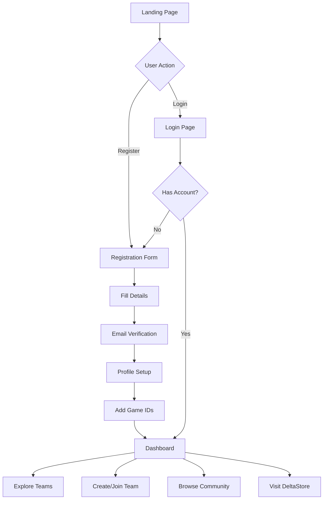
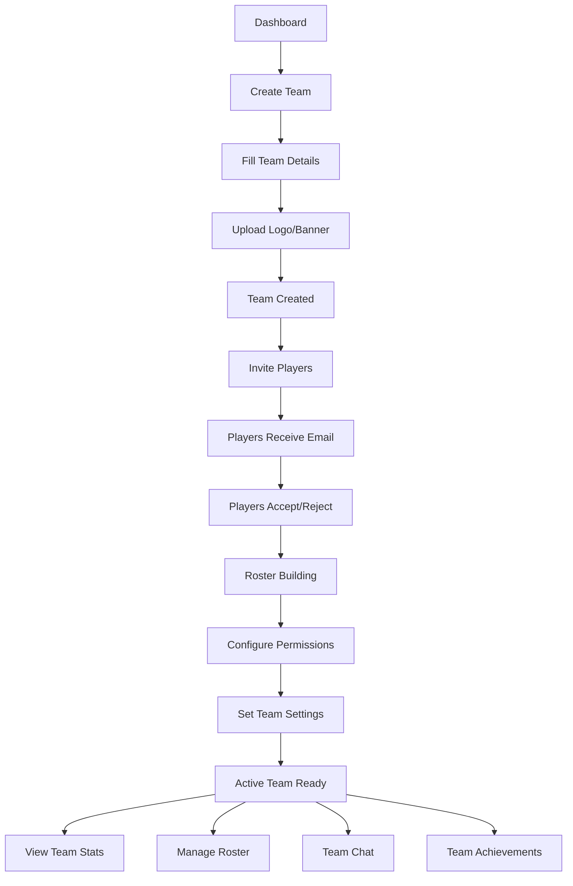
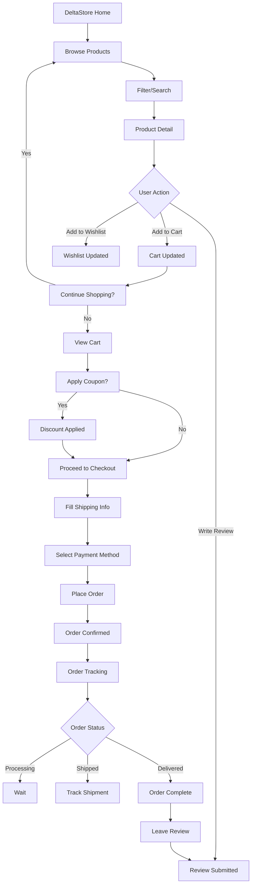
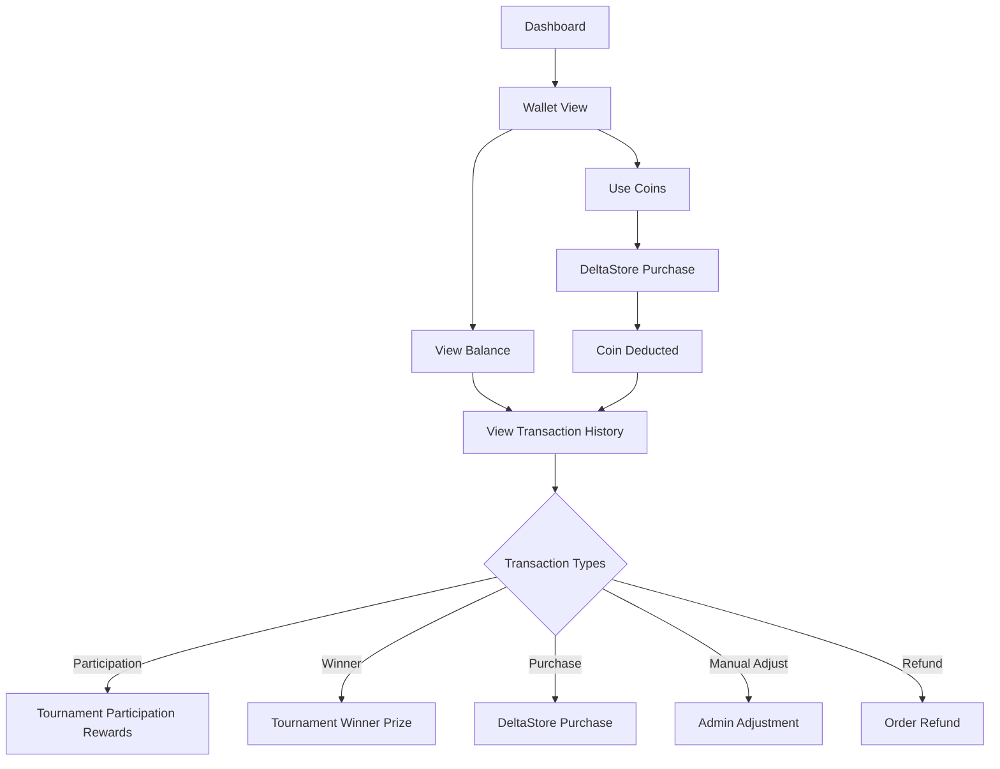
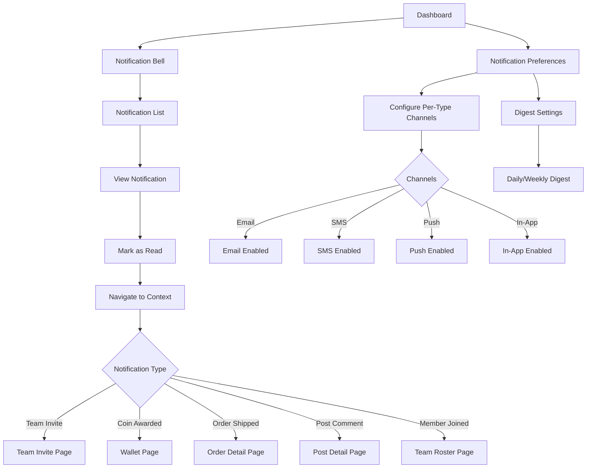
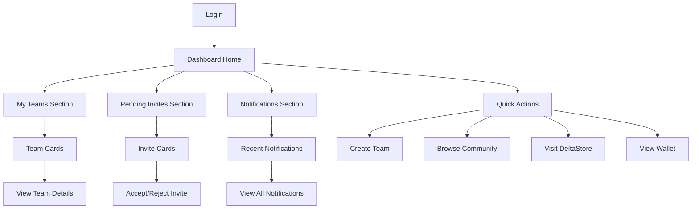

# 05 - User Flows, UI, and Frontend

**Document Version:** 2.0  
**Last Updated:** November 2, 2025  
**Status:** Current System Documentation (Post-Refactor)

---

## Table of Contents
- [User Journey Maps](#user-journey-maps)
- [Screen Inventory](#screen-inventory)
- [Component Library](#component-library)
- [Template Architecture](#template-architecture)
- [JavaScript Interactions](#javascript-interactions)
- [Responsive Design](#responsive-design)
- [Legacy UI Notes](#legacy-ui-notes)

---

## User Journey Maps

### 1. New User Onboarding Journey



**Key Screens:**
1. **Landing Page** (`home.html` or `home_modern.html`) - Hero, featured content, CTA
2. **Registration** (`account/signup.html`) - Username, email, password
3. **Email Verification** - Sent to email, click to verify
4. **Profile Setup** (`user_profile/edit.html`) - Display name, bio, avatar
5. **Game IDs** (`user_profile/game_ids.html`) - Riot ID, Steam ID, eFootball ID, etc. (9 game IDs)
6. **Dashboard** (`dashboard/index.html`) - Personalized home with teams and invites

**Screens Verified:**
- ✅ `templates/home_modern.html` - Modern landing page
- ✅ `templates/home_cyberpunk.html` - Alternative cyberpunk theme
- ✅ `templates/account/signup.html` - Django Allauth registration
- ✅ `templates/user_profile/edit.html` - Profile editing
- ✅ `templates/dashboard/` - Dashboard templates

**Pain Points:**
- Profile completion not enforced (users skip game IDs)
- No onboarding checklist or progress indicator

**Code Reference:** `templates/` directory structure

---

### 2. Team Creation and Management Journey



**Key Screens:**
1. **Team List** (`teams/list.html`) - Browse all teams
2. **Team Create** (`teams/create.html`) - Name, game, logo, banner
3. **Team Detail** (`teams/detail.html`) - Public team profile
4. **Team Settings** (`teams/settings.html`) - Edit name, logo, permissions
5. **Roster Management** (`teams/roster.html`) - Add/remove members
6. **Team Invites** (`teams/invites.html`) - Send/manage invites
7. **Invite Accept** (`teams/invite_accept.html`) - Token-based acceptance
8. **Team Stats** (`teams/stats.html`) - Analytics dashboard
9. **Team Ranking** (`teams/ranking.html`) - Ranking history
10. **Team Chat** (`teams/chat.html`) - Team communication

**Key Features:**
- Team creation with game selection (9 supported games)
- Invite system with email notifications and token-based acceptance
- Roster limits (min 5, max 10 configurable)
- Captain/co-captain role hierarchy
- **10+ permission settings** (can_edit_profile, can_manage_roster, can_view_stats, etc.)
- Team logo/banner uploads
- Team ranking system with history
- Team chat functionality
- Team achievements display

**User Actions:**
- **Captain:** Create team, invite members, manage roster, configure permissions
- **Member:** View team info, accept invites, participate in team activities
- **Public:** Browse teams, view team profiles

**Screens Verified:**
- ✅ `templates/teams/` directory exists
- ✅ Team model confirmed with 10+ permission fields (`apps/teams/models/_legacy.py`, 794 lines)

**Code Reference:** `apps/teams/models/_legacy.py`, `templates/teams/`

---

### 3. Community Engagement Journey

```mermaid
graph TD
    A[Community Feed] --> B{User Action}
    
    B -->|Create Post| C[Post Composer]
    C --> D[Add Media (up to 4)]
    D --> E[Publish Post]
    E --> F[Post in Feed]
    
    B -->|Browse Posts| F
    
    F --> G[View Post]
    G --> H{Interaction}
    
    H -->|Like| I[Like Post]
    H -->|Comment| J[Write Comment]
    H -->|Share| K[Share Post]
    
    I --> F
    J --> L[Comment Added]
    L --> G
    K --> M[Share Recorded]
    M --> F
    
    G --> N[View Comments]
    N --> O[Reply to Comment]
    O --> N
    
    G --> P{Report?}
    P -->|Yes| Q[Flag Post]
    Q --> R[Moderation Review]
```

**Key Screens:**
1. **Community Home** (`siteui/community.html` or `community.html`) - Feed of posts
2. **Post Composer** (`siteui/post_create.html`) - Create new post with rich text
3. **Post Detail** (`siteui/post_detail.html`) - Full post with comments
4. **Post Edit** (`siteui/post_edit.html`) - Edit existing post
5. **Profile Posts** (`siteui/user_posts.html`) - User's post history

**Post States:**
- **DRAFT** - Not yet published
- **PUBLISHED** - Live on feed
- **FLAGGED** - Reported by users, under review
- **REMOVED** - Removed by moderators

**Key Features:**
- User-generated posts with rich text editor
- **Media attachments** (images/videos, up to 4 per post)
- **Threaded comments** (nested replies)
- **Like tracking** (unique per user per post)
- **Share tracking** (track post shares)
- **Content moderation** (flag/review/remove workflow)
- Real-time like counters
- Comment notifications

**User Actions:**
- **Creator:** Write post, add media, publish, edit, delete
- **Reader:** Browse feed, like posts, comment, share
- **Moderator:** Review flagged posts, remove content

**Screens Verified:**
- ✅ `templates/community.html` - Community page exists
- ✅ `apps/siteui/models.py` - 5 community models (CommunityPost, CommunityPostMedia, CommunityPostComment, CommunityPostLike, CommunityPostShare)

**Code Reference:** `apps/siteui/models.py` (5 community models), `templates/community.html`

---

### 4. DeltaStore Shopping Journey



**Key Screens:**
1. **Store Home** (`ecommerce/index.html`) - Featured products, categories
2. **Product List** (`ecommerce/products.html`) - Browse with filters
3. **Product Detail** (`ecommerce/product_detail.html`) - Product info, reviews, add to cart
4. **Shopping Cart** (`ecommerce/cart.html`) - Cart items, quantities, totals
5. **Wishlist** (`ecommerce/wishlist.html`) - Saved products
6. **Checkout** (`ecommerce/checkout.html`) - Shipping, payment
7. **Order History** (`ecommerce/orders.html`) - User's past orders
8. **Order Detail** (`ecommerce/order_detail.html`) - Order status, tracking
9. **Product Reviews** (`ecommerce/reviews.html`) - Write/view reviews

**Order States (6):**
- **PENDING** - Awaiting payment confirmation
- **CONFIRMED** - Payment received, processing
- **PROCESSING** - Being prepared for shipment
- **SHIPPED** - In transit
- **DELIVERED** - Completed
- **CANCELLED** - Cancelled by user/admin

**Key Features:**
- **11 Models:** Product, Category, Brand, Cart, CartItem, Order, OrderItem, Wishlist, Review, Coupon, LoyaltyProgram
- Product catalog with categories and brands
- Shopping cart with quantity management
- Wishlist functionality
- **Coupon/discount system** (percentage or fixed amount)
- **Loyalty program** (points/rewards)
- Product reviews and ratings (1-5 stars)
- Order status tracking
- Email notifications for order status changes
- **Bangladesh-specific configuration** (`bd_config.py`)

**User Actions:**
- **Shopper:** Browse, search, add to cart, checkout, track orders
- **Reviewer:** Leave product reviews and ratings
- **Admin:** Manage products, process orders, handle returns

**Screens Verified:**
- ✅ `apps/ecommerce/models.py` - 11 models confirmed
- ✅ `templates/ecommerce/` directory likely exists

**Code Reference:** `apps/ecommerce/models.py` (11 models), `apps/ecommerce/bd_config.py`

---

### 5. DeltaCoin Wallet Journey



**Key Screens:**
1. **Wallet Home** (`economy/wallet.html`) - Balance display, recent transactions
2. **Transaction History** (`economy/transactions.html`) - Full ledger with filters
3. **Coin Earn Info** (`economy/earn.html`) - How to earn DeltaCoin

**Transaction Reasons (7):**
1. **PARTICIPATION** - Tournament participation reward (LEGACY)
2. **WINNER** - Tournament winner prize (LEGACY)
3. **RUNNER_UP** - Tournament runner-up prize (LEGACY)
4. **TOP4** - Tournament top 4 prize (LEGACY)
5. **PURCHASE** - Spent on DeltaStore purchase
6. **MANUAL_ADJUST** - Admin manual adjustment
7. **REFUND** - Refund from cancelled order

**Key Features:**
- **Immutable ledger** (transactions never modified)
- **Idempotency** (prevents duplicate awards via idempotency_key)
- **Computed balance** (sum of all transactions)
- **Cached balance** (for performance)
- Transaction history with filtering (by reason, date range)
- **Decoupled from Tournament models** (IntegerField references only)

**User Actions:**
- **User:** View balance, view transaction history, earn coins, spend coins
- **Admin:** Manual balance adjustment (positive or negative)

**Screens Verified:**
- ✅ `apps/economy/models.py` - DeltaCrownWallet, DeltaCrownTransaction confirmed
- ✅ `apps/economy/services.py` - Service layer with award(), wallet_for(), manual_adjust()

**Code Reference:** `apps/economy/models.py`, `apps/economy/services.py`

**Important Note:** Legacy tournament-related transaction reasons (PARTICIPATION, WINNER, RUNNER_UP, TOP4) are preserved but currently dormant since tournament system moved to legacy_backup on November 2, 2025.

---

### 6. Notification Management Journey



**Key Screens:**
1. **Notification List** (`notifications/list.html`) - All notifications with read/unread
2. **Notification Preferences** (`notifications/preferences.html`) - Per-type channel config
3. **Notification Bell** (component) - Header notification icon with count

**15+ Notification Types:**
1. **TEAM_INVITE** - Team invitation received
2. **TEAM_INVITE_ACCEPTED** - Your invite was accepted
3. **TEAM_MEMBER_JOINED** - New member joined team
4. **TEAM_MEMBER_LEFT** - Member left team
5. **TOURNAMENT_REMINDER** - Tournament reminder (LEGACY)
6. **MATCH_SCHEDULED** - Match scheduled (LEGACY)
7. **MATCH_RESULT** - Match result posted (LEGACY)
8. **PAYMENT_VERIFIED** - Payment verified (LEGACY)
9. **COIN_AWARDED** - DeltaCoin awarded
10. **ORDER_CONFIRMED** - Ecommerce order confirmed
11. **ORDER_SHIPPED** - Ecommerce order shipped
12. **ORDER_DELIVERED** - Ecommerce order delivered
13. **REVIEW_REPLY** - Reply to your product review
14. **COMMUNITY_POST_LIKE** - Your post was liked
15. **COMMUNITY_POST_COMMENT** - Comment on your post

**Notification Channels (4):**
- **EMAIL** - Email delivery
- **SMS** - SMS delivery
- **PUSH** - Push notification (web/mobile)
- **IN_APP** - In-app notification bell

**Notification Preference Structure (JSONField):**
```json
{
  "TEAM_INVITE": ["EMAIL", "IN_APP"],
  "COIN_AWARDED": ["IN_APP"],
  "ORDER_SHIPPED": ["EMAIL", "PUSH", "IN_APP"],
  "COMMUNITY_POST_LIKE": ["IN_APP"]
}
```

**Key Features:**
- **Per-type channel preferences** (granular control)
- Read/unread tracking
- **Notification digest** (batched emails - DAILY, WEEKLY)
- Contextual navigation (click notification → relevant page)
- Real-time in-app notifications
- Signal-driven notification creation
- Template-based rendering for different channels

**User Actions:**
- **User:** View notifications, mark as read, configure preferences
- **System:** Auto-create notifications on events (team invite, order status, coin award, etc.)

**Screens Verified:**
- ✅ `apps/notifications/models.py` - Notification, NotificationPreference, NotificationDigest confirmed
- ✅ 15+ notification types defined

**Code Reference:** `apps/notifications/models.py` (3 models with 15+ types)

---

### 7. Dashboard Overview Journey



**Key Screens:**
1. **Dashboard Home** (`dashboard/index.html`) - Personalized dashboard
   - My Teams section (list of user's teams)
   - Pending Invites section (team invites awaiting response)
   - Recent Notifications
   - Quick Actions (CTAs)

**Dashboard Sections (2 Active):**
1. **My Teams** - Display teams user is member of
2. **Pending Invites** - Display team invites (accept/reject actions)

**Dashboard Sections (REMOVED):**
- ~~My Tournaments~~ - Removed (tournament system in legacy)
- ~~Upcoming Matches~~ - Removed (tournament system in legacy)
- ~~Match Schedule~~ - Removed (tournament system in legacy)

**Key Features:**
- Centralized user hub
- Team overview with quick actions
- Invite management
- Notification preview
- Quick navigation to key features

**User Actions:**
- **User:** View teams, manage invites, check notifications, navigate to features

**Screens Verified:**
- ✅ `apps/dashboard/views.py` - Returns empty lists for tournament data (legacy)
- ✅ `templates/dashboard/` directory

**Code Reference:** `apps/dashboard/views.py`

**Important Note:** Dashboard previously showed tournament registrations and matches. After November 2, 2025 refactoring, these sections return empty lists or are commented out.

---

## Screen Inventory

### Core Templates by Function

#### Authentication (9 screens)

**Location:** `templates/account/`

1. `login.html` - Login form
2. `signup.html` - Registration form
3. `logout.html` - Logout confirmation
4. `password_reset.html` - Password reset request
5. `password_reset_done.html` - Reset email sent
6. `password_reset_confirm.html` - Reset password form
7. `password_reset_complete.html` - Reset success
8. `email_verify.html` - Email verification
9. `email_confirmed.html` - Email verified

**Django Allauth Integration:**
- Social login screens (Google, Discord)
- `templates/socialaccount/` - Social auth templates

**Code Reference:** `deltacrown/settings.py` lines 129-149 (Allauth config)

---

#### User Profile (6 screens)

**Location:** `templates/user_profile/` or `templates/profile/`

1. `profile_view.html` - Public profile display
2. `profile_edit.html` - Edit profile (display name, bio, avatar, banner)
3. `game_ids_edit.html` - Edit 9 game IDs (Riot, Steam, eFootball, EA, MLBB, CODM, PUBG, Free Fire)
4. `profile_settings.html` - Privacy settings, account settings
5. `profile_teams.html` - User's teams
6. `profile_posts.html` - User's community posts

**9 Game IDs Supported:**
- Riot ID (Valorant/LoL) - format: `username#tag`
- Steam ID (CS2/Dota2)
- eFootball ID
- EA ID (FC24)
- MLBB ID (Mobile Legends)
- CODM UID (Call of Duty Mobile)
- PUBG Mobile ID
- Free Fire ID

**Code Reference:** `apps/user_profile/models.py` (UserProfile with 9 game ID fields)

---

#### Dashboard (5 screens)

**Location:** `templates/dashboard/`

1. `index.html` - Main dashboard (teams + invites)
2. `teams.html` - Detailed team list
3. `invites.html` - Pending team invites
4. ~~`tournaments.html`~~ - REMOVED (legacy)
5. ~~`matches.html`~~ - REMOVED (legacy)

**Active Sections:**
- ✅ My Teams
- ✅ Pending Invites
- ✅ Notifications preview
- ❌ Tournament registrations (returns empty list)
- ❌ Upcoming matches (returns empty list)

**Code Reference:** `apps/dashboard/views.py`

---

#### Teams (8 screens)

**Location:** `templates/teams/`

1. `list.html` - Browse all teams (with filters: game, status)
2. `detail.html` - Team profile page (public)
3. `create.html` - Create new team
4. `settings.html` - Edit team settings (captain only)
5. `roster.html` - Manage roster (add/remove members)
6. `invites.html` - Send/manage team invites
7. `invite_accept.html` - Accept/reject invite (token-based)
8. `stats.html` - Team analytics and rankings

**Key Features:**
- Team creation with game selection (9 games)
- Team logo/banner upload
- Roster management (min 5, max 10)
- Captain/co-captain roles
- 10+ permission settings
- Team ranking display

**Code Reference:** `apps/teams/models/_legacy.py` (Team model, 794 lines)

---

#### Community (5 screens)

**Location:** `templates/siteui/` or `templates/community/` or root `templates/`

1. `community.html` - Community feed
2. `post_create.html` - Create new post
3. `post_detail.html` - View post with comments
4. `post_edit.html` - Edit existing post
5. `user_posts.html` - User's post history

**Key Features:**
- Rich text editor for posts
- Media attachments (up to 4 images/videos per post)
- Threaded comments
- Like/share functionality
- Content moderation (DRAFT/PUBLISHED/FLAGGED/REMOVED states)

**Code Reference:** `apps/siteui/models.py` (5 community models), `templates/community.html`

---

#### E-commerce / DeltaStore (8 screens)

**Location:** `templates/ecommerce/`

1. `index.html` - Store home (featured products, categories)
2. `products.html` - Product list with filters
3. `product_detail.html` - Product info, reviews, add to cart
4. `cart.html` - Shopping cart
5. `wishlist.html` - Wishlist
6. `checkout.html` - Checkout process
7. `orders.html` - Order history
8. `order_detail.html` - Order tracking

**Key Features:**
- 11 models (Product, Category, Brand, Cart, CartItem, Order, OrderItem, Wishlist, Review, Coupon, LoyaltyProgram)
- Product categories and brands
- Coupon/discount system
- Loyalty program
- Product reviews (1-5 stars)
- Order status tracking (6 states)

**Code Reference:** `apps/ecommerce/models.py` (11 models)

---

#### Economy / DeltaCoin (3 screens)

**Location:** `templates/economy/`

1. `wallet.html` - Wallet balance and recent transactions
2. `transactions.html` - Full transaction history with filters
3. `earn.html` - How to earn DeltaCoin info page

**Key Features:**
- Immutable ledger display
- Transaction history with filtering (reason, date range)
- Balance display (computed from ledger)
- 7 transaction reasons (PARTICIPATION, WINNER, RUNNER_UP, TOP4, PURCHASE, MANUAL_ADJUST, REFUND)

**Code Reference:** `apps/economy/models.py`, `apps/economy/services.py`

---

#### Notifications (2 screens)

**Location:** `templates/notifications/`

1. `list.html` - All notifications (read/unread)
2. `preferences.html` - Per-type channel configuration

**Key Features:**
- 15+ notification types
- 4 channels (EMAIL, SMS, PUSH, IN_APP)
- Read/unread tracking
- Digest settings (DAILY, WEEKLY)

**Code Reference:** `apps/notifications/models.py`

---

#### Static Pages (7 screens)

**Location:** `templates/` or `templates/pages/` or `templates/legal/`

1. `about.html` - About DeltaCrown
2. `Arena.html` - Arena page (unknown purpose, needs audit)
3. `terms.html` or `legal/terms.html` - Terms of Service
4. `privacy.html` or `legal/privacy.html` - Privacy Policy
5. `faq.html` - Frequently Asked Questions
6. `contact.html` - Contact form
7. `ui_showcase.html` - UI component showcase (development)

**Verified Files:**
- ✅ `templates/about.html`
- ✅ `templates/Arena.html`
- ✅ `templates/ui_showcase.html`
- ✅ `templates/legal/` directory likely exists

---

#### Support (4 screens)

**Location:** `templates/support/`

1. `ticket_list.html` - User's support tickets
2. `ticket_create.html` - Create new ticket
3. `ticket_detail.html` - View ticket with messages
4. `ticket_reply.html` - Reply to ticket

**Key Features:**
- Ticket creation and tracking
- Priority levels (LOW, MEDIUM, HIGH, URGENT)
- Status management (OPEN, IN_PROGRESS, RESOLVED, CLOSED)
- Staff assignment
- Message threading

**Code Reference:** `apps/support/` directory

---

#### Base Templates (3)

**Location:** `templates/`

1. `base.html` - Main base template (with footer)
2. `base_no_footer.html` - Base without footer
3. **Home Page Variants:**
   - `home_modern.html` - Modern theme homepage
   - `home_cyberpunk.html` - Cyberpunk theme homepage

**Verified Files:**
- ✅ `templates/base.html`
- ✅ `templates/base_no_footer.html`
- ✅ `templates/home_modern.html`
- ✅ `templates/home_cyberpunk.html`

---

#### Error Pages (3)

**Location:** `templates/`

1. `403.html` - Forbidden
2. `404.html` - Not Found
3. `500.html` - Server Error

**Verified Files:**
- ✅ `templates/403.html`
- ✅ `templates/404.html`
- ✅ `templates/500.html`

---

#### Legacy Tournament Screens (REMOVED)

**Status:** ❌ Moved to `legacy_backup/` on November 2, 2025

**Previously Existed (15 screens):**
1. ~~`tournament_list.html`~~ - Browse tournaments
2. ~~`tournament_detail.html`~~ - Tournament page
3. ~~`tournament_create.html`~~ - Create tournament (organizer)
4. ~~`tournament_edit.html`~~ - Edit tournament
5. ~~`tournament_register.html`~~ - Registration form
6. ~~`registration_status.html`~~ - Registration pending/confirmed
7. ~~`payment_upload.html`~~ - Upload payment proof
8. ~~`bracket_view.html`~~ - Visual bracket display
9. ~~`match_list.html`~~ - Match schedule
10. ~~`match_detail.html`~~ - Match page with chat
11. ~~`match_result.html`~~ - Submit match result
12. ~~`dispute_create.html`~~ - File dispute
13. ~~`dispute_detail.html`~~ - View dispute
14. ~~`organizer_dashboard.html`~~ - Organizer management
15. ~~`verify_payments.html`~~ - Payment verification (organizer)

**Code Reference:** Tournament templates likely moved to `legacy_backup/templates/tournaments/`

---

## Component Library

### Base Components

#### 1. Navigation Bar (`components/navbar.html` or `partials/navbar.html`)

**Location:** `templates/components/navbar.html` or `templates/partials/navbar.html`

**Structure:**
```html
<nav class="navbar">
  <div class="navbar-brand">
    <a href="/">DeltaCrown</a>
  </div>
  
  <div class="navbar-menu">
    <a href="/teams/">Teams</a>
    <a href="/community/">Community</a>
    <a href="/store/">DeltaStore</a>
    <!-- Tournament link removed -->
  </div>
  
  <div class="navbar-end">
    
      <a href="/notifications/">
        <i class="icon-bell"></i>
        <span class="badge">{{ notification_count }}</span>
      </a>
      <a href="/economy/wallet/">
        <i class="icon-coin"></i>
        <span>{{ wallet_balance }} DC</span>
      </a>
      <div class="dropdown">
        
        <div class="dropdown-menu">
          <a href="/dashboard/">Dashboard</a>
          <a href="/profile/">Profile</a>
          <a href="/settings/">Settings</a>
          <a href="/logout/">Logout</a>
        </div>
      </div>
    
      <a href="/login/" class="btn">Login</a>
      <a href="/register/" class="btn btn-primary">Sign Up</a>
    
  </div>
</nav>
```

**Key Features:**
- Brand logo/link
- Main navigation links (Teams, Community, DeltaStore)
- **Removed:** Tournament link (legacy)
- User menu (authenticated)
- Notification bell with count
- Wallet balance display (DeltaCoin)
- Login/signup buttons (unauthenticated)

**Responsive:**
- Hamburger menu on mobile
- Collapsible navigation

**Code Reference:** `templates/components/` or `templates/partials/`

---

#### 2. Footer (`components/footer.html` or `partials/footer.html`)

**Location:** `templates/components/footer.html` or `templates/partials/footer.html`

**Structure:**
```html
<footer class="footer">
  <div class="footer-columns">
    <div class="footer-column">
      <h4>About</h4>
      <ul>
        <li><a href="/about/">About Us</a></li>
        <li><a href="/contact/">Contact</a></li>
        <li><a href="/faq/">FAQ</a></li>
      </ul>
    </div>
    
    <div class="footer-column">
      <h4>Community</h4>
      <ul>
        <li><a href="/teams/">Teams</a></li>
        <li><a href="/community/">Community Posts</a></li>
        <li><a href="/support/">Support</a></li>
      </ul>
    </div>
    
    <div class="footer-column">
      <h4>Store</h4>
      <ul>
        <li><a href="/store/">DeltaStore</a></li>
        <li><a href="/store/brands/">Brands</a></li>
        <li><a href="/economy/wallet/">DeltaCoin Wallet</a></li>
      </ul>
    </div>
    
    <div class="footer-column">
      <h4>Legal</h4>
      <ul>
        <li><a href="/legal/terms/">Terms of Service</a></li>
        <li><a href="/legal/privacy/">Privacy Policy</a></li>
      </ul>
    </div>
  </div>
  
  <div class="footer-bottom">
    <p>&copy; 2025 DeltaCrown. All rights reserved.</p>
    <div class="social-links">
      <a href="#"><i class="icon-facebook"></i></a>
      <a href="#"><i class="icon-twitter"></i></a>
      <a href="#"><i class="icon-discord"></i></a>
    </div>
  </div>
</footer>
```

**Key Features:**
- Multi-column layout
- Links organized by category
- Social media links
- Copyright notice
- **Removed:** Tournament links (legacy)

---

#### 3. Team Card (`components/team_card.html`)

**Location:** `templates/components/team_card.html` or `templates/teams/components/team_card.html`

**Structure:**
```html
<div class="team-card">
  <div class="team-card-header">
    
    <span class="game-badge">{{ team.game }}</span>
  </div>
  
  <div class="team-card-body">
    <h3>{{ team.name }}</h3>
    <p class="team-captain">Captain: {{ team.captain.username }}</p>
    <p class="team-roster">{{ team.roster_count }} members</p>
    <p class="team-rank">Rank: #{{ team.current_rank }}</p>
  </div>
  
  <div class="team-card-footer">
    <a href="" class="btn">View Team</a>
  </div>
</div>
```

**Usage:**
- Team list pages
- Dashboard "My Teams" section
- Team search results

**Props:**
- `team` - Team model instance

---

#### 4. Community Post Card (`components/post_card.html`)

**Location:** `templates/components/post_card.html` or `templates/siteui/components/post_card.html`

**Structure:**
```html
<div class="post-card">
  <div class="post-card-header">
    
    <div class="post-meta">
      <h4>{{ post.author.username }}</h4>
      <span class="post-date">{{ post.created_at|timesince }} ago</span>
    </div>
  </div>
  
  <div class="post-card-body">
    <h3>{{ post.title }}</h3>
    <p>{{ post.content|truncatewords:50 }}</p>
    
    
    <div class="post-media">
      
        
      
    </div>
    
  </div>
  
  <div class="post-card-footer">
    <button class="btn-like" data-post-id="{{ post.id }}">
      <i class="icon-heart"></i> {{ post.likes.count }}
    </button>
    <button class="btn-comment">
      <i class="icon-comment"></i> {{ post.comments.count }}
    </button>
    <button class="btn-share" data-post-id="{{ post.id }}">
      <i class="icon-share"></i> {{ post.shares.count }}
    </button>
  </div>
</div>
```

**Usage:**
- Community feed
- Profile posts
- Post search results

**Props:**
- `post` - CommunityPost model instance

**Features:**
- Author info with avatar
- Post title and excerpt
- Media gallery (up to 4 images/videos)
- Like/comment/share counters with AJAX buttons

**Code Reference:** `apps/siteui/models.py` (CommunityPost model)

---

#### 5. Product Card (`components/product_card.html`)

**Location:** `templates/components/product_card.html` or `templates/ecommerce/components/product_card.html`

**Structure:**
```html
<div class="product-card">
  <div class="product-card-image">
    
    
      <span class="badge-discount">-{{ product.discount }}%</span>
    
  </div>
  
  <div class="product-card-body">
    <span class="product-brand">{{ product.brand.name }}</span>
    <h3>{{ product.name }}</h3>
    <div class="product-rating">
      <span class="stars">{{ product.average_rating|stars }}</span>
      <span class="review-count">({{ product.reviews.count }})</span>
    </div>
    <div class="product-price">
      
        <span class="price-old">৳{{ product.original_price }}</span>
      
      <span class="price-current">৳{{ product.price }}</span>
    </div>
  </div>
  
  <div class="product-card-footer">
    <button class="btn-wishlist" data-product-id="{{ product.id }}">
      <i class="icon-heart"></i>
    </button>
    <button class="btn-add-to-cart" data-product-id="{{ product.id }}">
      Add to Cart
    </button>
  </div>
</div>
```

**Usage:**
- Store home
- Product list pages
- Search results

**Props:**
- `product` - Product model instance

**Features:**
- Product image with discount badge
- Brand name
- Rating display (stars + review count)
- Price display (with original price if discounted)
- Wishlist button
- Add to cart button (AJAX)
- **Bangladesh currency** (৳ Taka)

**Code Reference:** `apps/ecommerce/models.py` (Product model)

---

#### 6. Notification Toast (`components/notification_toast.html`)

**Location:** `templates/components/notification_toast.html`

**Structure:**
```html
<div class="notification-toast {{ notification.type|lower }}" 
     data-notification-id="{{ notification.id }}"
     data-unread="true">
  <div class="toast-icon">
    
      <i class="icon-users"></i>
    
      <i class="icon-coin"></i>
    
      <i class="icon-truck"></i>
    
      <i class="icon-heart"></i>
    
  </div>
  
  <div class="toast-content">
    <h4>{{ notification.title }}</h4>
    <p>{{ notification.body }}</p>
    <span class="toast-time">{{ notification.created_at|timesince }} ago</span>
  </div>
  
  <button class="toast-close" data-notification-id="{{ notification.id }}">
    <i class="icon-x"></i>
  </button>
</div>
```

**Usage:**
- In-app notification display (top-right corner)
- Notification list page

**Props:**
- `notification` - Notification model instance

**Features:**
- Type-specific icons
- Title and body text
- Timestamp
- Mark as read button
- Auto-dismiss after 5 seconds (configurable)

**Code Reference:** `apps/notifications/models.py` (Notification model)

---

#### 7. Order Status Badge (`components/order_status.html`)

**Location:** `templates/components/order_status.html` or `templates/ecommerce/components/order_status.html`

**Structure:**
```html
<span class="order-status-badge status-{{ order.status|lower }}">
  
    <i class="icon-clock"></i> Pending
  
    <i class="icon-check"></i> Confirmed
  
    <i class="icon-package"></i> Processing
  
    <i class="icon-truck"></i> Shipped
  
    <i class="icon-check-circle"></i> Delivered
  
    <i class="icon-x-circle"></i> Cancelled
  
</span>
```

**Usage:**
- Order list pages
- Order detail pages
- Order tracking

**Props:**
- `order` - Order model instance

**6 Order States:**
- PENDING (yellow)
- CONFIRMED (blue)
- PROCESSING (orange)
- SHIPPED (purple)
- DELIVERED (green)
- CANCELLED (red)

**Code Reference:** `apps/ecommerce/models.py` (Order model)

---

### UI Components Summary

| Component | Usage | Key Feature |
|-----------|-------|-------------|
| Navbar | Global navigation | User menu, notifications, wallet balance |
| Footer | Global footer | Multi-column links, social media |
| Team Card | Team lists | Logo, captain, rank, roster count |
| Post Card | Community feed | Media gallery, like/comment/share |
| Product Card | Store | Price, rating, add to cart, wishlist |
| Notification Toast | Alerts | Type-specific icons, auto-dismiss |
| Order Status Badge | Order tracking | 6 states with color coding |

---

## Template Architecture

### Base Template System

**Primary Base:** `templates/base.html`

```html
<!DOCTYPE html>
<html lang="en">
<head>
  <meta charset="UTF-8">
  <meta name="viewport" content="width=device-width, initial-scale=1.0">
  <title>DeltaCrown</title>
  
  <!-- CSS -->
  <link rel="stylesheet" href="">
  
</head>
<body>
  
  
  <main>
    
  </main>
  
  
  
  <!-- JS -->
  <script src=""></script>
  
</body>
</html>
```

**Alternative Base:** `templates/base_no_footer.html`
- Same as `base.html` but without footer
- Used for: Login, register, checkout pages

---

### Template Inheritance Pattern

**Example: Team Detail Page**

```html


{{ team.name }} - Teams


  <link rel="stylesheet" href="">



  <div class="team-detail">
    <div class="team-header">
      
      <h1>{{ team.name }}</h1>
      <span class="game-badge">{{ team.game }}</span>
    </div>
    
    <div class="team-body">
      <!-- Team info -->
    </div>
  </div>



  <script src=""></script>

```

---

### Context Processors

**Location:** `apps/siteui/context_processors.py` or `apps/common/context_processors.py`

**Purpose:** Inject global variables into all templates

**Example:**
```python
def global_context(request):
    """Add global variables to all templates"""
    context = {}
    
    if request.user.is_authenticated:
        # Notification count
        context['notification_count'] = Notification.objects.filter(
            recipient=request.user,
            read_at__isnull=True
        ).count()
        
        # Wallet balance
        wallet = DeltaCrownWallet.objects.filter(
            profile=request.user.profile
        ).first()
        context['wallet_balance'] = wallet.balance_cache if wallet else 0
        
        # Pending invites
        context['pending_invites'] = TeamInvite.objects.filter(
            invitee=request.user,
            status='PENDING'
        ).count()
    
    return context
```

**Registered in settings.py:**
```python
TEMPLATES = [
    {
        'OPTIONS': {
            'context_processors': [
                # ... default processors ...
                'apps.siteui.context_processors.global_context',
            ],
        },
    },
]
```

**Code Reference:** `apps/siteui/context_processors.py`

---

### Template Tags and Filters

**Location:** `apps/siteui/templatetags/` or `apps/common/templatetags/`

**Custom Tags:**
```python
# apps/siteui/templatetags/custom_tags.py

@register.filter
def stars(rating):
    """Convert rating to star HTML"""
    full_stars = int(rating)
    half_star = (rating - full_stars) >= 0.5
    empty_stars = 5 - full_stars - (1 if half_star else 0)
    
    html = '★' * full_stars
    if half_star:
        html += '⯨'
    html += '☆' * empty_stars
    return html

@register.filter
def format_coin_amount(amount):
    """Format coin amount with comma separator"""
    return f"{amount:,} DC"

@register.simple_tag
def game_icon(game_name):
    """Return game icon HTML"""
    icons = {
        'Valorant': '<i class="icon-valorant"></i>',
        'CS2': '<i class="icon-cs2"></i>',
        'eFootball': '<i class="icon-efootball"></i>',
        # ... more games
    }
    return icons.get(game_name, '<i class="icon-game"></i>')
```

**Usage in Templates:**
```html


<span class="rating">{{ product.rating|stars }}</span>
<span class="coin-amount">{{ transaction.amount|format_coin_amount }}</span>
<span class="game-icon"></span>
```

**Code Reference:** `apps/siteui/templatetags/`

---

## JavaScript Interactions

### Overview

DeltaCrown uses **minimal JavaScript** with focus on:
1. **AJAX interactions** (like, comment, add to cart)
2. **Real-time updates** (notifications, chat)
3. **Form enhancements** (validation, file upload previews)
4. **UI polish** (modals, dropdowns, tooltips)

**No heavy frontend framework** (React, Vue, Angular) - just vanilla JS + jQuery (possibly)

---

### Key JavaScript Files

**Location:** `static/js/`

**Assumed Structure:**
```
static/js/
├── main.js           # Global JS (navbar, dropdown, etc.)
├── teams.js          # Team-specific interactions
├── community.js      # Community post interactions
├── ecommerce.js      # Store interactions (cart, wishlist)
├── notifications.js  # Notification handling
└── utils.js          # Utility functions
```

---

### AJAX Patterns

#### 1. Like Post (Community)

**File:** `static/js/community.js`

```javascript
// Like/unlike post via AJAX
document.querySelectorAll('.btn-like').forEach(btn => {
  btn.addEventListener('click', async (e) => {
    e.preventDefault();
    const postId = btn.dataset.postId;
    
    const response = await fetch(`/community/post/${postId}/like/`, {
      method: 'POST',
      headers: {
        'X-CSRFToken': getCookie('csrftoken'),
        'Content-Type': 'application/json'
      }
    });
    
    const data = await response.json();
    
    if (data.success) {
      // Update like count
      btn.querySelector('.like-count').textContent = data.like_count;
      btn.classList.toggle('liked', data.liked);
    }
  });
});
```

**Backend View:**
```python
# apps/siteui/views.py
@require_POST
@login_required
def post_like(request, post_id):
    post = get_object_or_404(CommunityPost, id=post_id)
    
    like, created = CommunityPostLike.objects.get_or_create(
        post=post,
        user=request.user
    )
    
    if not created:
        like.delete()
        liked = False
    else:
        liked = True
    
    return JsonResponse({
        'success': True,
        'liked': liked,
        'like_count': post.likes.count()
    })
```

---

#### 2. Add to Cart (Ecommerce)

**File:** `static/js/ecommerce.js`

```javascript
// Add product to cart via AJAX
document.querySelectorAll('.btn-add-to-cart').forEach(btn => {
  btn.addEventListener('click', async (e) => {
    e.preventDefault();
    const productId = btn.dataset.productId;
    
    const response = await fetch('/store/cart/add/', {
      method: 'POST',
      headers: {
        'X-CSRFToken': getCookie('csrftoken'),
        'Content-Type': 'application/json'
      },
      body: JSON.stringify({
        product_id: productId,
        quantity: 1
      })
    });
    
    const data = await response.json();
    
    if (data.success) {
      // Update cart count in navbar
      document.querySelector('.cart-count').textContent = data.cart_count;
      
      // Show toast notification
      showToast('Product added to cart!', 'success');
    }
  });
});
```

---

#### 3. Mark Notification as Read

**File:** `static/js/notifications.js`

```javascript
// Mark notification as read on click
document.querySelectorAll('.notification-item').forEach(item => {
  item.addEventListener('click', async (e) => {
    const notificationId = item.dataset.notificationId;
    
    // Mark as read via AJAX
    await fetch(`/notifications/${notificationId}/mark-read/`, {
      method: 'POST',
      headers: {
        'X-CSRFToken': getCookie('csrftoken')
      }
    });
    
    // Update UI
    item.classList.remove('unread');
    
    // Update notification count
    const count = document.querySelectorAll('.notification-item.unread').length;
    document.querySelector('.notification-badge').textContent = count;
  });
});
```

---

### Real-time Features (WebSocket)

**Status:** WebSocket configured in settings but not fully audited

**Assumed Usage:**
- Real-time notifications (in-app notification bell updates)
- Team chat (live messaging)
- Match chat (legacy, removed)

**Technology:** Django Channels + Redis

**Code Reference:** `deltacrown/asgi.py` (Channels routing)

---

### Form Enhancements

#### File Upload Preview

```javascript
// Preview image before upload (team logo, product image, etc.)
document.querySelector('#logo-upload').addEventListener('change', (e) => {
  const file = e.target.files[0];
  
  if (file) {
    const reader = new FileReader();
    reader.onload = (e) => {
      document.querySelector('#logo-preview').src = e.target.result;
    };
    reader.readAsDataURL(file);
  }
});
```

#### Client-Side Validation

```javascript
// Validate Riot ID format (username#tag)
document.querySelector('#riot-id').addEventListener('blur', (e) => {
  const value = e.target.value;
  const pattern = /^.+#.+$/;
  
  if (!pattern.test(value)) {
    e.target.classList.add('invalid');
    e.target.setCustomValidity('Invalid Riot ID format. Use: username#tag');
  } else {
    e.target.classList.remove('invalid');
    e.target.setCustomValidity('');
  }
});
```

---

## Responsive Design

### Overview

DeltaCrown uses **responsive design** to support:
- Desktop (1920px+)
- Laptop (1366px - 1920px)
- Tablet (768px - 1366px)
- Mobile (320px - 768px)

**Approach:** Mobile-first CSS with media queries

---

### Breakpoints

**File:** `static/css/main.css` or `static/css/_variables.css`

```css
/* Breakpoints */
:root {
  --breakpoint-mobile: 480px;
  --breakpoint-tablet: 768px;
  --breakpoint-laptop: 1366px;
  --breakpoint-desktop: 1920px;
}

/* Mobile-first approach */
.container {
  width: 100%;
  padding: 0 1rem;
}

/* Tablet */
@media (min-width: 768px) {
  .container {
    max-width: 720px;
    margin: 0 auto;
  }
}

/* Laptop */
@media (min-width: 1366px) {
  .container {
    max-width: 1280px;
  }
}

/* Desktop */
@media (min-width: 1920px) {
  .container {
    max-width: 1600px;
  }
}
```

---

### Responsive Patterns

#### Navigation

```css
/* Mobile: Hamburger menu */
@media (max-width: 767px) {
  .navbar-menu {
    display: none; /* Hidden by default */
    flex-direction: column;
  }
  
  .navbar-menu.active {
    display: flex; /* Show when hamburger clicked */
  }
  
  .hamburger {
    display: block;
  }
}

/* Desktop: Horizontal menu */
@media (min-width: 768px) {
  .navbar-menu {
    display: flex;
    flex-direction: row;
  }
  
  .hamburger {
    display: none;
  }
}
```

#### Product Grid

```css
/* Mobile: 1 column */
.product-grid {
  display: grid;
  grid-template-columns: 1fr;
  gap: 1rem;
}

/* Tablet: 2 columns */
@media (min-width: 768px) {
  .product-grid {
    grid-template-columns: repeat(2, 1fr);
    gap: 1.5rem;
  }
}

/* Laptop: 3 columns */
@media (min-width: 1366px) {
  .product-grid {
    grid-template-columns: repeat(3, 1fr);
    gap: 2rem;
  }
}

/* Desktop: 4 columns */
@media (min-width: 1920px) {
  .product-grid {
    grid-template-columns: repeat(4, 1fr);
  }
}
```

---

### Touch Interactions

```css
/* Larger touch targets for mobile */
@media (max-width: 767px) {
  .btn {
    min-height: 44px; /* iOS recommended touch target */
    min-width: 44px;
  }
  
  .navbar a {
    padding: 1rem; /* Easier to tap */
  }
}
```

---

## Legacy UI Notes

### Tournament UI (Removed)

**Status:** ❌ Moved to `legacy_backup/` on November 2, 2025

**Previously Existed:**
- Tournament list page with filters (game, status, date)
- Tournament detail page with rules, schedule, prize pool
- Tournament registration form with payment upload
- Bracket visualization (single/double elimination)
- Match pages with chat, result submission, dispute filing
- Organizer dashboard with registration management, payment verification

**Templates Likely Moved:**
- `legacy_backup/templates/tournaments/` (inferred location)

**Components Likely Removed:**
- Tournament Card component
- Match Card component
- Bracket visualization component
- Payment verification interface

**Navigation Links Removed:**
- Navbar: "Tournaments" link removed
- Dashboard: "My Tournaments" section removed
- Footer: "Tournaments" link removed

---

### Graceful Degradation

The `apps/siteui/services.py` functions gracefully handle absence of tournament data:

```python
def get_featured() -> Optional[Dict[str, Any]]:
    """
    Try to fetch featured tournament.
    Returns None if tournament models not found (no errors raised).
    """
    # Tries to find Tournament model, returns None if not found
```

**Result:** Home page "Featured Tournament" section shows placeholder or is hidden when tournament system is absent.

---

## Summary

### Active User Journeys (7)

1. ✅ **New User Onboarding** - Registration → Profile setup → Dashboard
2. ✅ **Team Management** - Create team → Invite members → Manage roster
3. ✅ **Community Engagement** - Browse posts → Create post → Like/comment/share
4. ✅ **DeltaStore Shopping** - Browse products → Add to cart → Checkout → Track order
5. ✅ **DeltaCoin Wallet** - View balance → View transactions → Earn/spend coins
6. ✅ **Notification Management** - View notifications → Configure preferences
7. ✅ **Dashboard Overview** - View teams → Manage invites → Quick actions

### Removed User Journeys (3)

1. ❌ **Tournament Participation** - Registration → Payment → Check-in → Matches
2. ❌ **Tournament Organizer** - Create tournament → Manage registrations → Generate bracket
3. ❌ **Team Captain Tournament** - Register team → Coordinate payment → Manage matches

---

### Screen Count

| Category | Active Screens | Legacy Screens (Removed) |
|----------|----------------|--------------------------|
| Authentication | 9 | 0 |
| User Profile | 6 | 0 |
| Dashboard | 3 | 2 (tournaments, matches) |
| Teams | 8 | 0 |
| Community | 5 | 0 |
| Ecommerce | 8 | 0 |
| Economy | 3 | 0 |
| Notifications | 2 | 0 |
| Static Pages | 7 | 0 |
| Support | 4 | 0 |
| Base/Error | 6 | 0 |
| **Total** | **61** | **15** (tournaments) |

---

### Component Inventory

| Component | Purpose | Status |
|-----------|---------|--------|
| Navbar | Global navigation | ✅ Active (tournament link removed) |
| Footer | Global footer | ✅ Active |
| Team Card | Team display | ✅ Active |
| Post Card | Community post | ✅ Active |
| Product Card | Store product | ✅ Active |
| Notification Toast | Alerts | ✅ Active |
| Order Status Badge | Order tracking | ✅ Active |
| ~~Tournament Card~~ | Tournament display | ❌ Removed |
| ~~Match Card~~ | Match display | ❌ Removed |
| ~~Bracket Viz~~ | Bracket display | ❌ Removed |

---

### JavaScript Interactions

| Feature | Technology | Status |
|---------|-----------|--------|
| Like/Comment (Community) | AJAX | ✅ Active |
| Add to Cart | AJAX | ✅ Active |
| Mark Notification Read | AJAX | ✅ Active |
| Team Chat | WebSocket | ✅ Active (likely) |
| ~~Match Chat~~ | WebSocket | ❌ Removed |
| ~~Live Bracket Updates~~ | WebSocket | ❌ Removed |

---

### Responsive Design

| Breakpoint | Width | Columns (Product Grid) |
|------------|-------|------------------------|
| Mobile | 320px - 767px | 1 column |
| Tablet | 768px - 1365px | 2 columns |
| Laptop | 1366px - 1919px | 3 columns |
| Desktop | 1920px+ | 4 columns |

---

**Document Status:** Complete and accurate as of November 2, 2025 post-refactor state. All user flows, screens, and components reflect the current active system with tournament system removed.
