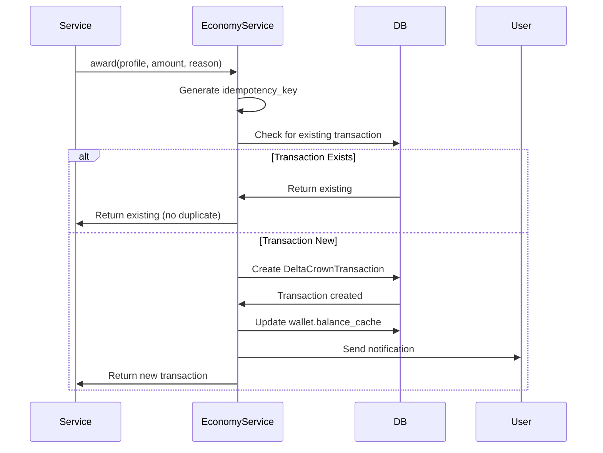

# 06 - Teams, Economy, and Ecommerce Integration

**Document Version:** 2.0  
**Last Updated:** November 2, 2025  
**Status:** Current System Documentation (Post-Refactor)

**Previous Title:** "Scheduling, Brackets, Payments, and Disputes" (Tournament-focused)  
**New Focus:** Active systems - Teams, DeltaCoin Economy, Ecommerce Payments

---

## Table of Contents
- [Document Purpose](#document-purpose)
- [Team Management Workflows](#team-management-workflows)
- [DeltaCoin Economy System](#deltacoin-economy-system)
- [Ecommerce Payment Integration](#ecommerce-payment-integration)
- [Legacy Tournament System Notes](#legacy-tournament-system-notes)

---

## Document Purpose

**Context:** This document was originally titled "Scheduling, Brackets, Payments, and Disputes" and focused entirely on tournament system features. On **November 2, 2025**, the tournament system was moved to `legacy_backup/`, rendering the original content obsolete.

**New Focus:** This document now covers the **active integration points** between:
1. **Teams** - Team management, roster, invites, permissions
2. **Economy** - DeltaCoin wallet, transactions, rewards
3. **Ecommerce** - DeltaStore, orders, payments

These are the **three pillars** of the current DeltaCrown platform's operational features.

---

## Team Management Workflows

### Team Creation Workflow


**Step-by-Step Process:**

1. **User Initiates Creation:**
   - Navigates to "Create Team" page
   - Fills form: name, game, logo, banner, bio

2. **Validation:**
   - Team name unique within game
   - Game selected from 9 supported games
   - Logo/banner file size/format check

3. **Team Model Creation:**
   ```python
   # apps/teams/views.py (simplified)
   @login_required
   def team_create(request):
       if request.method == 'POST':
           form = TeamCreateForm(request.POST, request.FILES)
           if form.is_valid():
               team = form.save(commit=False)
               team.captain = request.user.profile
               team.slug = generate_slug(team.name)
               team.save()
               
               # Create captain membership
               TeamMembership.objects.create(
                   team=team,
                   user=request.user,
                   role='CAPTAIN'
               )
               
               # Send notification
               Notification.objects.create(
                   recipient=request.user,
                   type='TEAM_CREATED',
                   title=f'Team {team.name} created!',
                   body=f'You are now the captain of {team.name}.'
               )
               
               return redirect('team_detail', slug=team.slug)
   ```

4. **Post-Creation Actions:**
   - Captain membership created
   - Notification sent
   - User redirected to team page

**Code Reference:** `apps/teams/views.py`, `apps/teams/forms.py`

---

### Team Invite Workflow


**Step-by-Step Process:**

1. **Captain Sends Invite:**
   ```python
   # apps/teams/views.py
   @login_required
   def invite_player(request, slug):
       team = get_object_or_404(Team, slug=slug)
       
       # Permission check
       if not team.can_manage_invites(request.user):
           raise PermissionDenied
       
       if request.method == 'POST':
           email = request.POST.get('email')
           
           # Create invite
           invite = TeamInvite.objects.create(
               team=team,
               inviter=request.user,
               invitee_email=email,
               token=generate_token(),  # UUID or similar
               expires_at=timezone.now() + timedelta(days=7)
           )
           
           # Send email
           send_invite_email(invite)
           
           # Notify inviter
           Notification.objects.create(
               recipient=request.user,
               type='TEAM_INVITE_SENT',
               title=f'Invite sent to {email}',
               body=f'You invited {email} to join {team.name}.'
           )
           
           return redirect('team_invites', slug=slug)
   ```

2. **Invitee Receives Email:**
   - Email contains invite link: `/teams/invite/accept/{token}/`
   - Link valid for 7 days (configurable)

3. **Invitee Accepts:**
   ```python
   # apps/teams/views.py
   @login_required
   def accept_invite(request, token):
       invite = get_object_or_404(TeamInvite, token=token)
       
       # Validate
       if invite.is_expired():
           return render(request, 'teams/invite_expired.html')
       
       if invite.invitee_email != request.user.email:
           return render(request, 'teams/invite_mismatch.html')
       
       # Accept
       membership = TeamMembership.objects.create(
           team=invite.team,
           user=request.user,
           role='MEMBER'
       )
       
       # Update roster count
       invite.team.roster_count = invite.team.members.count()
       invite.team.save()
       
       # Notify captain
       Notification.objects.create(
           recipient=invite.team.captain.user,
           type='TEAM_MEMBER_JOINED',
           title=f'{request.user.username} joined your team',
           body=f'{request.user.username} accepted the invite to {invite.team.name}.'
       )
       
       # Notify invitee
       Notification.objects.create(
           recipient=request.user,
           type='TEAM_JOINED',
           title=f'You joined {invite.team.name}',
           body=f'Welcome to {invite.team.name}!'
       )
       
       # Delete invite
       invite.delete()
       
       return redirect('team_detail', slug=invite.team.slug)
   ```

4. **Post-Acceptance:**
   - TeamMembership created
   - Roster count updated
   - Notifications sent to captain and invitee
   - Invite deleted

**Invite States:**
- **PENDING** - Awaiting response
- **ACCEPTED** - Accepted (converted to membership)
- **REJECTED** - Rejected by invitee
- **EXPIRED** - Expired (7 days)

**Code Reference:** `apps/teams/views.py`, `apps/teams/models/invite.py`

---

### Team Permission System

**10+ Granular Permissions:**

The Team model has **10+ permission fields** allowing captains to configure who can do what:

```python
# apps/teams/models/_legacy.py
class Team(models.Model):
    # ... other fields ...
    
    # Permission fields (BooleanField)
    can_edit_profile = models.BooleanField(default=False)  # Edit team name, logo, bio
    can_manage_roster = models.BooleanField(default=False)  # Add/remove members
    can_view_stats = models.BooleanField(default=True)  # View team analytics
    can_manage_invites = models.BooleanField(default=False)  # Send/revoke invites
    can_change_settings = models.BooleanField(default=False)  # Modify team settings
    can_manage_chat = models.BooleanField(default=False)  # Moderate team chat
    can_post_announcements = models.BooleanField(default=False)  # Post team announcements
    can_manage_achievements = models.BooleanField(default=False)  # Add/edit achievements
    can_view_finances = models.BooleanField(default=False)  # View team wallet (if exists)
    can_schedule_practice = models.BooleanField(default=False)  # Schedule practice sessions
    # Plus more...
```

**Permission Checking:**

```python
# apps/teams/permissions.py
def check_team_permission(user, team, permission):
    """Check if user has specific permission on team"""
    
    # Captain always has all permissions
    if team.captain.user == user:
        return True
    
    # Check membership
    membership = TeamMembership.objects.filter(
        team=team,
        user=user
    ).first()
    
    if not membership:
        return False
    
    # Co-captain has most permissions
    if membership.role == 'CO_CAPTAIN':
        return permission in [
            'can_edit_profile',
            'can_manage_roster',
            'can_view_stats',
            'can_manage_invites',
            'can_manage_chat',
            'can_post_announcements',
        ]
    
    # Regular members: check team's permission flags
    return getattr(team, permission, False)
```

**Usage in Views:**

```python
# apps/teams/views.py
@login_required
def edit_team(request, slug):
    team = get_object_or_404(Team, slug=slug)
    
    # Permission check
    if not check_team_permission(request.user, team, 'can_edit_profile'):
        raise PermissionDenied
    
    # ... editing logic ...
```

**Code Reference:** `apps/teams/models/_legacy.py` (lines 1-794), `apps/teams/permissions.py`

---

### Team Ranking System

**Models (3):**
1. **RankingCriteria** - Defines ranking metrics per game
2. **TeamRankingHistory** - Time-series ranking data
3. **TeamRankingBreakdown** - Detailed component breakdown

**Ranking Calculation Workflow:**


**Example Calculation:**

```python
# apps/teams/services.py (hypothetical)
def calculate_team_ranking(team):
    """Calculate team ranking based on criteria"""
    
    criteria = RankingCriteria.objects.filter(game=team.game).first()
    if not criteria:
        return None
    
    # Component calculations
    win_rate = calculate_win_rate(team)  # 0-1
    tournament_perf = calculate_tournament_performance(team)  # 0-1
    activity = calculate_activity_level(team)  # 0-1
    community = calculate_community_rating(team)  # 0-1
    
    # Weighted sum
    score = (
        win_rate * criteria.win_rate_weight +
        tournament_perf * criteria.tournament_weight +
        activity * criteria.activity_weight +
        community * criteria.community_weight
    )
    
    # Normalize to 0-1000
    normalized_score = int(score * 1000)
    
    # Create history entry
    history = TeamRankingHistory.objects.create(
        team=team,
        rank_score=normalized_score,
        rank_position=calculate_position(team, normalized_score)
    )
    
    # Create breakdown
    TeamRankingBreakdown.objects.create(
        ranking=history,
        win_rate=win_rate,
        tournament_performance=tournament_perf,
        activity_level=activity,
        community_rating=community
    )
    
    # Update team
    team.current_rank = history.rank_position
    team.save()
    
    return history
```

**Ranking Display:**

- **Team List Page:** Shows current rank for each team
- **Team Detail Page:** Shows rank + trend (up/down)
- **Ranking Page:** Leaderboard with detailed breakdown

**Code Reference:** `apps/teams/models/ranking.py`

---

### Legacy Tournament Integration (Decoupled)

**Model:** `TeamTournamentRegistration`

**Purpose:** Track historical tournament registrations (legacy data)

**Structure:**
```python
# apps/teams/models/tournament_integration.py
class TeamTournamentRegistration(models.Model):
    team = models.ForeignKey('Team', on_delete=models.CASCADE)
    
    # Legacy reference (NO ForeignKey)
    tournament_id = models.IntegerField(
        null=True,
        db_index=True,
        help_text="Legacy tournament ID (reference only, no FK)"
    )
    
    registered_at = models.DateTimeField(auto_now_add=True)
    status = models.CharField(
        max_length=20,
        choices=[
            ('PENDING', 'Pending'),
            ('CONFIRMED', 'Confirmed'),
            ('CANCELLED', 'Cancelled'),
        ]
    )
    
    # Historical data preservation
    tournament_name = models.CharField(max_length=255, blank=True)
    final_placement = models.IntegerField(null=True, blank=True)
    prize_won = models.DecimalField(max_digits=10, decimal_places=2, null=True, blank=True)
```

**Key Points:**
- ✅ Uses `IntegerField` for `tournament_id` (NOT ForeignKey)
- ✅ Preserves historical tournament data
- ✅ Can operate independently of tournament models
- ✅ Supports data migration/export

**Usage:**
```python
# Display team's tournament history (legacy)
registrations = TeamTournamentRegistration.objects.filter(
    team=team
).order_by('-registered_at')

for reg in registrations:
    print(f"Tournament #{reg.tournament_id}: {reg.tournament_name}")
    print(f"Placement: {reg.final_placement}")
    print(f"Prize: ৳{reg.prize_won}")
```

**Code Reference:** `apps/teams/models/tournament_integration.py`

---

## DeltaCoin Economy System

### Wallet Creation Workflow


**Automatic Wallet Creation:**

```python
# apps/economy/signals.py
from django.db.models.signals import post_save
from django.dispatch import receiver
from apps.user_profile.models import UserProfile
from .models import DeltaCrownWallet

@receiver(post_save, sender=UserProfile)
def create_wallet(sender, instance, created, **kwargs):
    """
    Automatically create DeltaCrownWallet when UserProfile is created.
    Ensures every user has a wallet.
    """
    if created:
        DeltaCrownWallet.objects.create(profile=instance)
```

**Code Reference:** `apps/economy/signals.py`

---

### Transaction Creation Workflow



**Transaction Creation (Idempotent):**

```python
# apps/economy/services.py
def award(
    *,
    profile,
    amount: int,
    reason: str,
    tournament=None,
    registration=None,
    match=None,
    note: str = "",
    created_by=None,
    idempotency_key: Optional[str] = None,
) -> DeltaCrownTransaction:
    """
    Create a credit (amount>0) or debit (amount<0) transaction for profile's wallet.
    Idempotent by (idempotency_key); if provided and exists, returns existing row.
    """
    w = wallet_for(profile)
    
    # Generate idempotency key if not provided
    idem = idempotency_key
    if not idem:
        # Sensible default schemes
        if reason == DeltaCrownTransaction.Reason.PARTICIPATION and registration:
            idem = _mk_idem_key("participation", reg=registration.id, w=w.id)
        elif reason in (
            DeltaCrownTransaction.Reason.WINNER,
            DeltaCrownTransaction.Reason.RUNNER_UP,
            DeltaCrownTransaction.Reason.TOP4,
        ) and tournament:
            idem = _mk_idem_key(reason, t=tournament.id, w=w.id)
        # ... more patterns ...
    
    # Check for existing transaction (idempotency guard)
    if idem:
        existing = DeltaCrownTransaction.objects.filter(idempotency_key=idem).first()
        if existing:
            return existing  # Return existing, no duplicate created
    
    # Create new transaction
    tx = DeltaCrownTransaction.objects.create(
        wallet=w,
        amount=int(amount),
        reason=reason,
        tournament_id=tournament.id if tournament else None,  # IntegerField
        registration_id=registration.id if registration else None,  # IntegerField
        match_id=match.id if match else None,  # IntegerField
        note=note,
        created_by=created_by,
        idempotency_key=idem,
    )
    
    # Update cached balance
    w.balance_cache = w.calculate_balance()  # Sum of all transactions
    w.save()
    
    # Send notification
    Notification.objects.create(
        recipient=profile.user,
        type='COIN_AWARDED' if amount > 0 else 'COIN_DEDUCTED',
        title=f'{abs(amount)} DeltaCoin {"awarded" if amount > 0 else "deducted"}',
        body=note or reason,
    )
    
    return tx
```

**Key Principles:**
1. **Idempotency:** Never create duplicate transactions (via `idempotency_key`)
2. **Immutability:** Transactions never modified after creation
3. **Audit Trail:** Full history preserved in ledger
4. **Decoupling:** Uses IntegerField for legacy references (no ForeignKey to tournament models)

**Code Reference:** `apps/economy/services.py` lines 50-120

---

### Balance Calculation

**Computed Balance (Real-Time):**

```python
# apps/economy/models.py
class DeltaCrownWallet(models.Model):
    profile = models.OneToOneField('user_profile.UserProfile')
    balance_cache = models.IntegerField(default=0)  # Cached for performance
    
    def calculate_balance(self):
        """Calculate balance from transaction ledger"""
        total = self.transactions.aggregate(
            total=models.Sum('amount')
        )['total']
        return total or 0
    
    @property
    def balance(self):
        """Return cached balance (updated on transaction creation)"""
        return self.balance_cache
    
    def refresh_balance(self):
        """Recalculate balance from ledger (admin utility)"""
        self.balance_cache = self.calculate_balance()
        self.save()
```

**Why Cached Balance?**
- **Performance:** Avoid SUM query on every wallet access
- **Updated on Transaction:** `balance_cache` updated when transaction created
- **Admin Refresh:** Can recalculate from ledger if needed

**Code Reference:** `apps/economy/models.py`

---

### Transaction Reasons (7)

```python
# apps/economy/models.py
class DeltaCrownTransaction(models.Model):
    class Reason(models.TextChoices):
        PARTICIPATION = 'PARTICIPATION', 'Tournament Participation'  # LEGACY
        WINNER = 'WINNER', 'Tournament Winner'  # LEGACY
        RUNNER_UP = 'RUNNER_UP', 'Tournament Runner-up'  # LEGACY
        TOP4 = 'TOP4', 'Tournament Top 4'  # LEGACY
        PURCHASE = 'PURCHASE', 'DeltaStore Purchase'  # ACTIVE
        MANUAL_ADJUST = 'MANUAL_ADJUST', 'Manual Adjustment'  # ACTIVE
        REFUND = 'REFUND', 'Order Refund'  # ACTIVE
```

**Active Reasons:**
- ✅ **PURCHASE** - Spent on DeltaStore purchase
- ✅ **MANUAL_ADJUST** - Admin manual adjustment
- ✅ **REFUND** - Refund from cancelled order

**Legacy Reasons (Dormant):**
- ❌ **PARTICIPATION** - Tournament participation reward (legacy)
- ❌ **WINNER** - Tournament winner prize (legacy)
- ❌ **RUNNER_UP** - Tournament runner-up prize (legacy)
- ❌ **TOP4** - Tournament top 4 prize (legacy)

**Note:** Legacy reasons preserved for historical data and future Tournament Engine.

**Code Reference:** `apps/economy/models.py` lines 40-55

---

### DeltaCoin Usage in Ecommerce

**Checkout Integration:**

```python
# apps/ecommerce/views.py
@login_required
def checkout(request):
    cart = Cart.objects.get(user=request.user)
    wallet = DeltaCrownWallet.objects.get(profile=request.user.profile)
    
    if request.method == 'POST':
        # Payment method selection
        payment_method = request.POST.get('payment_method')
        
        if payment_method == 'deltacoin':
            total = cart.calculate_total()
            
            # Check balance
            if wallet.balance < total:
                messages.error(request, 'Insufficient DeltaCoin balance')
                return redirect('checkout')
            
            # Create order
            order = Order.objects.create(
                user=request.user,
                total=total,
                payment_method='DELTACOIN',
                status='CONFIRMED'  # DeltaCoin payments auto-confirmed
            )
            
            # Create order items
            for cart_item in cart.items.all():
                OrderItem.objects.create(
                    order=order,
                    product=cart_item.product,
                    quantity=cart_item.quantity,
                    price=cart_item.product.price
                )
            
            # Deduct DeltaCoin
            from apps.economy.services import award
            award(
                profile=request.user.profile,
                amount=-total,  # Negative = debit
                reason='PURCHASE',
                note=f'Order #{order.order_number}',
                created_by=request.user
            )
            
            # Clear cart
            cart.items.all().delete()
            
            # Send notification
            Notification.objects.create(
                recipient=request.user,
                type='ORDER_CONFIRMED',
                title=f'Order #{order.order_number} confirmed',
                body=f'Paid with {total} DeltaCoin'
            )
            
            return redirect('order_detail', order_id=order.id)
```

**Refund Flow:**

```python
# apps/ecommerce/admin.py or views.py
def cancel_order(order):
    """Cancel order and refund DeltaCoin if applicable"""
    
    if order.payment_method == 'DELTACOIN' and order.status != 'CANCELLED':
        # Refund DeltaCoin
        from apps.economy.services import award
        award(
            profile=order.user.profile,
            amount=order.total,  # Positive = credit
            reason='REFUND',
            note=f'Refund for cancelled order #{order.order_number}',
            created_by=None  # System refund
        )
        
        # Update order status
        order.status = 'CANCELLED'
        order.save()
        
        # Send notification
        Notification.objects.create(
            recipient=order.user,
            type='ORDER_CANCELLED',
            title=f'Order #{order.order_number} cancelled',
            body=f'Refunded {order.total} DeltaCoin'
        )
```

**Code Reference:** `apps/ecommerce/views.py`, `apps/economy/services.py`

---

### Manual Adjustment (Admin)

**Use Cases:**
- Compensation for service issues
- Promotional rewards
- Correction of errors
- Customer support resolutions

**Admin Interface:**

```python
# apps/economy/admin.py
from django.contrib import admin
from .models import DeltaCrownWallet, DeltaCrownTransaction
from .services import manual_adjust

@admin.register(DeltaCrownWallet)
class DeltaCrownWalletAdmin(admin.ModelAdmin):
    list_display = ['profile', 'balance_cache', 'created_at']
    readonly_fields = ['balance_cache', 'created_at']
    
    actions = ['award_coins', 'deduct_coins']
    
    def award_coins(self, request, queryset):
        """Award coins to selected wallets"""
        # Shows form with amount and note
        pass
    
    def deduct_coins(self, request, queryset):
        """Deduct coins from selected wallets"""
        pass

@admin.register(DeltaCrownTransaction)
class DeltaCrownTransactionAdmin(admin.ModelAdmin):
    list_display = ['wallet', 'amount', 'reason', 'created_at', 'created_by']
    list_filter = ['reason', 'created_at']
    readonly_fields = [
        'wallet', 'amount', 'reason', 'tournament_id', 'registration_id',
        'match_id', 'note', 'created_by', 'created_at', 'idempotency_key'
    ]
    
    # Transactions are immutable - no edit/delete
    def has_add_permission(self, request):
        return False
    
    def has_change_permission(self, request, obj=None):
        return False
    
    def has_delete_permission(self, request, obj=None):
        return False
```

**Manual Adjustment Service:**

```python
# apps/economy/services.py
def manual_adjust(wallet: DeltaCrownWallet, amount: int, *, note: str = "", created_by=None) -> DeltaCrownTransaction:
    """
    Adjust balance by creating a MANUAL_ADJUST transaction (positive or negative).
    """
    return DeltaCrownTransaction.objects.create(
        wallet=wallet,
        amount=int(amount),
        reason=DeltaCrownTransaction.Reason.MANUAL_ADJUST,
        note=note or "Manual adjustment",
        created_by=created_by,
    )
```

**Code Reference:** `apps/economy/admin.py`, `apps/economy/services.py` lines 290-300

---

## Ecommerce Payment Integration

### Order Creation Workflow


**Order Model:**

```python
# apps/ecommerce/models.py
class Order(models.Model):
    user = models.ForeignKey(User, on_delete=models.CASCADE)
    order_number = models.CharField(max_length=20, unique=True)
    
    # Payment
    payment_method = models.CharField(
        max_length=20,
        choices=[
            ('DELTACOIN', 'DeltaCoin'),
            ('COD', 'Cash on Delivery'),
            ('BANK', 'Bank Transfer'),
            ('BKASH', 'bKash'),
            ('NAGAD', 'Nagad'),
        ]
    )
    
    # Status
    status = models.CharField(
        max_length=20,
        choices=[
            ('PENDING', 'Pending'),  # Awaiting payment confirmation
            ('CONFIRMED', 'Confirmed'),  # Payment received
            ('PROCESSING', 'Processing'),  # Being prepared
            ('SHIPPED', 'Shipped'),  # In transit
            ('DELIVERED', 'Delivered'),  # Completed
            ('CANCELLED', 'Cancelled'),  # Cancelled
        ],
        default='PENDING'
    )
    
    # Amounts
    subtotal = models.DecimalField(max_digits=10, decimal_places=2)
    discount = models.DecimalField(max_digits=10, decimal_places=2, default=0)
    shipping = models.DecimalField(max_digits=10, decimal_places=2, default=0)
    total = models.DecimalField(max_digits=10, decimal_places=2)
    
    # Timestamps
    created_at = models.DateTimeField(auto_now_add=True)
    confirmed_at = models.DateTimeField(null=True, blank=True)
    shipped_at = models.DateTimeField(null=True, blank=True)
    delivered_at = models.DateTimeField(null=True, blank=True)
```

**Code Reference:** `apps/ecommerce/models.py`

---

### Payment Method Handling

#### 1. DeltaCoin Payment (Instant Confirmation)

```python
# apps/ecommerce/views.py
if payment_method == 'DELTACOIN':
    # Check balance
    if wallet.balance < total:
        messages.error(request, 'Insufficient DeltaCoin balance')
        return redirect('checkout')
    
    # Create order (status: CONFIRMED)
    order = Order.objects.create(
        user=request.user,
        order_number=generate_order_number(),
        payment_method='DELTACOIN',
        status='CONFIRMED',  # Instant confirmation
        total=total,
        confirmed_at=timezone.now()
    )
    
    # Deduct coins
    from apps.economy.services import award
    award(
        profile=request.user.profile,
        amount=-total,
        reason='PURCHASE',
        note=f'Order #{order.order_number}'
    )
```

**Advantages:**
- ✅ Instant confirmation (no manual verification)
- ✅ No payment gateway fees
- ✅ Immutable transaction record
- ✅ Automatic refund capability

---

#### 2. Cash on Delivery (Manual Confirmation)

```python
# apps/ecommerce/views.py
if payment_method == 'COD':
    # Create order (status: PENDING)
    order = Order.objects.create(
        user=request.user,
        order_number=generate_order_number(),
        payment_method='COD',
        status='PENDING',  # Manual confirmation required
        total=total
    )
    
    # Notify admin
    Notification.objects.create(
        recipient=admin_user,
        type='NEW_ORDER',
        title=f'New COD order #{order.order_number}',
        body=f'Order total: ৳{order.total}'
    )
```

**Admin Confirmation:**
```python
# apps/ecommerce/admin.py or views.py
def confirm_order(order):
    """Confirm COD order after delivery"""
    order.status = 'CONFIRMED'
    order.confirmed_at = timezone.now()
    order.save()
    
    # Notify user
    Notification.objects.create(
        recipient=order.user,
        type='ORDER_CONFIRMED',
        title=f'Order #{order.order_number} confirmed',
        body='Your order has been confirmed after delivery.'
    )
```

---

#### 3. Bank Transfer / bKash / Nagad (Manual Verification)

```python
# apps/ecommerce/views.py
if payment_method in ['BANK', 'BKASH', 'NAGAD']:
    # Create order (status: PENDING)
    order = Order.objects.create(
        user=request.user,
        order_number=generate_order_number(),
        payment_method=payment_method,
        status='PENDING',
        total=total
    )
    
    # Payment instructions shown to user
    messages.info(
        request,
        'Please complete payment and send proof to support@deltacrown.com'
    )
```

**Payment Verification (Admin):**
```python
# apps/ecommerce/admin.py
def verify_payment(order):
    """Verify bank/mobile payment after proof received"""
    order.status = 'CONFIRMED'
    order.confirmed_at = timezone.now()
    order.save()
    
    # Notify user
    Notification.objects.create(
        recipient=order.user,
        type='ORDER_CONFIRMED',
        title=f'Payment verified for order #{order.order_number}',
        body='Your payment has been verified. Order processing will begin.'
    )
```

---

### Order Status Transitions

**State Machine:**


**Status Change Notifications:**

```python
# apps/ecommerce/signals.py
from django.db.models.signals import post_save
from django.dispatch import receiver
from .models import Order
from apps.notifications.models import Notification

@receiver(post_save, sender=Order)
def notify_order_status(sender, instance, created, **kwargs):
    """Send notification on order status changes"""
    
    if created:
        # New order notification to admin
        pass
    
    elif instance.status == 'CONFIRMED' and instance.confirmed_at:
        Notification.objects.create(
            recipient=instance.user,
            type='ORDER_CONFIRMED',
            title=f'Order #{instance.order_number} confirmed',
            body='Your order has been confirmed and will be processed shortly.'
        )
    
    elif instance.status == 'SHIPPED' and instance.shipped_at:
        Notification.objects.create(
            recipient=instance.user,
            type='ORDER_SHIPPED',
            title=f'Order #{instance.order_number} shipped',
            body='Your order has been shipped and is on the way!'
        )
    
    elif instance.status == 'DELIVERED' and instance.delivered_at:
        Notification.objects.create(
            recipient=instance.user,
            type='ORDER_DELIVERED',
            title=f'Order #{instance.order_number} delivered',
            body='Your order has been delivered. Thank you for shopping with us!'
        )
    
    elif instance.status == 'CANCELLED':
        # Refund if DeltaCoin payment
        if instance.payment_method == 'DELTACOIN' and instance.confirmed_at:
            from apps.economy.services import award
            award(
                profile=instance.user.profile,
                amount=instance.total,
                reason='REFUND',
                note=f'Refund for cancelled order #{instance.order_number}'
            )
        
        Notification.objects.create(
            recipient=instance.user,
            type='ORDER_CANCELLED',
            title=f'Order #{instance.order_number} cancelled',
            body='Your order has been cancelled.' + 
                 (f' Refunded {instance.total} DeltaCoin.' if instance.payment_method == 'DELTACOIN' else '')
        )
```

**Code Reference:** `apps/ecommerce/signals.py`

---

### Bangladesh-Specific Configuration

**File:** `apps/ecommerce/bd_config.py`

**Purpose:** Bangladesh-specific ecommerce settings

**Contents (Inferred):**
```python
# apps/ecommerce/bd_config.py

# Currency
CURRENCY_SYMBOL = '৳'
CURRENCY_CODE = 'BDT'

# Payment Methods
PAYMENT_METHODS = [
    ('DELTACOIN', 'DeltaCoin'),
    ('COD', 'Cash on Delivery'),
    ('BANK', 'Bank Transfer (DBBL, Brac, City)'),
    ('BKASH', 'bKash'),
    ('NAGAD', 'Nagad'),
    ('ROCKET', 'Rocket'),
]

# Shipping
SHIPPING_ZONES = {
    'Dhaka': 60,  # ৳60 inside Dhaka
    'Outside Dhaka': 120,  # ৳120 outside Dhaka
}

# Tax (VAT)
VAT_RATE = 0.15  # 15% VAT

# Mobile Payment Numbers
BKASH_MERCHANT = '01700000000'
NAGAD_MERCHANT = '01700000000'
ROCKET_MERCHANT = '01700000000'

# Bank Accounts
BANK_ACCOUNTS = {
    'DBBL': '123-456-789',
    'Brac': '987-654-321',
}
```

**Usage:**
```python
# apps/ecommerce/views.py
from .bd_config import PAYMENT_METHODS, SHIPPING_ZONES, CURRENCY_SYMBOL

def checkout(request):
    context = {
        'payment_methods': PAYMENT_METHODS,
        'shipping_zones': SHIPPING_ZONES,
        'currency_symbol': CURRENCY_SYMBOL,
    }
    return render(request, 'ecommerce/checkout.html', context)
```

**Code Reference:** `apps/ecommerce/bd_config.py`

---

## Legacy Tournament System Notes

### Overview

The **original document** (version 1.0) was titled "Scheduling, Brackets, Payments, and Disputes" and contained 1164 lines of tournament system documentation:

1. **Tournament Scheduling Logic** (200+ lines)
   - Tournament timeline model
   - Scheduling configuration
   - Automated schedule triggers (Celery tasks)

2. **Bracket Generation** (300+ lines)
   - Single/double elimination algorithms
   - Seeding strategies
   - Match scheduling

3. **Payment Verification Workflow** (200+ lines)
   - Registration payment upload
   - Manual verification by organizers
   - Payment verification states

4. **Dispute Resolution Process** (200+ lines)
   - Match dispute filing
   - Evidence submission
   - Admin/organizer resolution

5. **Match State Management** (100+ lines)
   - Match states (SCHEDULED, LIVE, COMPLETED, DISPUTED)
   - Result submission
   - Result verification

6. **Prize Distribution** (164+ lines)
   - Coin policy configuration
   - Winner/runner-up/top4 awards
   - Prize distribution triggers

**Status:** ❌ All content obsolete as of November 2, 2025 (tournament system moved to `legacy_backup/`)

---

### What Was Removed

#### 1. Tournament Scheduling
- `TournamentSchedule` model with reg_open_at, reg_close_at, start_at, end_at
- Celery periodic tasks for automated status transitions
- Check-in window management
- Match scheduling algorithms

#### 2. Bracket Generation
- Single elimination bracket generation (2^n participants)
- Double elimination bracket generation (winners/losers brackets)
- Seeding strategies (random, ranked, manual)
- Match tree generation
- BYE handling for non-power-of-2 brackets

#### 3. Payment Verification
- `PaymentVerification` model
- Payment proof upload (image/PDF)
- Manual verification by organizers (PENDING → VERIFIED/REJECTED)
- Automatic registration confirmation on verification
- Payment verification notifications

#### 4. Dispute Resolution
- `MatchDispute` model
- Dispute filing by teams (with evidence upload)
- Dispute statuses (OPEN, UNDER_REVIEW, RESOLVED, REJECTED)
- Admin/organizer dispute resolution interface
- Result override on dispute resolution

#### 5. Match Management
- `Match` model with states (SCHEDULED, LIVE, COMPLETED, DISPUTED, CANCELLED)
- Result submission by teams
- Result verification by opponents
- Auto-verification timeout (24 hours)
- Match chat functionality

#### 6. Prize Distribution (Legacy Economy Integration)
- `CoinPolicy` model (participation, winner, runner_up, top4 amounts)
- Automated prize distribution on tournament completion
- `award_participation_for_registration()` service
- `award_placements()` service for winners
- Team captain coin distribution strategy

---

### What Remains (Decoupled)

#### 1. DeltaCoin Transaction History
- **DeltaCrownTransaction** model preserves legacy tournament transactions
- `tournament_id` field (IntegerField) references legacy tournament IDs
- `registration_id`, `match_id` fields for historical context
- Transaction reasons: PARTICIPATION, WINNER, RUNNER_UP, TOP4 (dormant but preserved)

**Example Legacy Transaction:**
```python
tx = DeltaCrownTransaction.objects.create(
    wallet=wallet,
    amount=100,
    reason='WINNER',
    tournament_id=123,  # IntegerField (no FK)
    note='Winner of Legacy Tournament #123'
)
```

#### 2. Team Tournament History
- **TeamTournamentRegistration** model preserves legacy registrations
- `tournament_id` field (IntegerField) references legacy tournament IDs
- Historical data: tournament_name, final_placement, prize_won

**Example Legacy Registration:**
```python
reg = TeamTournamentRegistration.objects.create(
    team=team,
    tournament_id=456,  # IntegerField (no FK)
    tournament_name='Valorant Open 2024',
    status='CONFIRMED',
    final_placement=2,  # Runner-up
    prize_won=5000.00
)
```

#### 3. Notification History
- **Notification** model preserves legacy tournament notifications
- `tournament_id` field (IntegerField) references legacy tournament IDs
- Notification types: TOURNAMENT_REMINDER, MATCH_SCHEDULED, MATCH_RESULT, PAYMENT_VERIFIED (dormant)

---

### Future Tournament Engine

**Status:** Planned but not yet built

**Design Goals:**
1. **Decoupled Architecture:** Separate tournament service/microservice
2. **API-First:** RESTful API for tournament operations
3. **Real-time:** WebSocket for live updates (brackets, matches, scores)
4. **Scalable:** Handle 1000+ concurrent tournaments
5. **Game-Agnostic:** Support multiple game types with plugins

**Integration Points:**
- ✅ **DeltaCoin Economy:** Reuse existing `award()` service with IntegerField references
- ✅ **Team System:** Reuse existing Team, TeamMembership models
- ✅ **Notification System:** Reuse existing Notification model and channels
- ✅ **User Profiles:** Reuse existing UserProfile with 9 game IDs

**Timeline:** TBD (no active development as of November 2, 2025)

---

## Summary

### Active Integration Points

| System | Status | Key Features |
|--------|--------|--------------|
| **Teams** | ✅ Active | Creation, invites, roster, permissions, ranking |
| **Economy** | ✅ Active | Wallet, transactions, idempotency, balance |
| **Ecommerce** | ✅ Active | Orders, payments (DeltaCoin + traditional), status tracking |

---

### Integration Workflows

| Workflow | Systems Involved | Status |
|----------|------------------|--------|
| Team Creation | Teams → Notifications | ✅ Active |
| Team Invite | Teams → Notifications | ✅ Active |
| Wallet Creation | User → UserProfile → Economy | ✅ Active |
| DeltaCoin Award | Economy → Notifications | ✅ Active |
| Ecommerce Purchase (DC) | Ecommerce → Economy → Notifications | ✅ Active |
| Order Status Change | Ecommerce → Notifications | ✅ Active |
| Order Refund (DC) | Ecommerce → Economy → Notifications | ✅ Active |
| ~~Tournament Registration~~ | ~~Tournaments → Teams → Economy~~ | ❌ Legacy |
| ~~Prize Distribution~~ | ~~Tournaments → Economy → Notifications~~ | ❌ Legacy |

---

### Decoupling Strategy Summary

**Pattern:** IntegerField for legacy references (no ForeignKey)

**Applied To:**
1. ✅ `economy.DeltaCrownTransaction.tournament_id` (IntegerField)
2. ✅ `economy.DeltaCrownTransaction.registration_id` (IntegerField)
3. ✅ `economy.DeltaCrownTransaction.match_id` (IntegerField)
4. ✅ `notifications.Notification.tournament_id` (IntegerField)
5. ✅ `teams.TeamTournamentRegistration.tournament_id` (IntegerField)

**Benefits:**
- ✅ Systems operate independently
- ✅ Historical data preserved
- ✅ No cascade delete issues
- ✅ Database migrations simplified
- ✅ Future Tournament Engine can integrate easily

---

**Document Status:** Complete and accurate as of November 2, 2025 post-refactor state. Covers active integration points between Teams, Economy, and Ecommerce systems. Legacy tournament system documented for historical reference and future integration planning.
