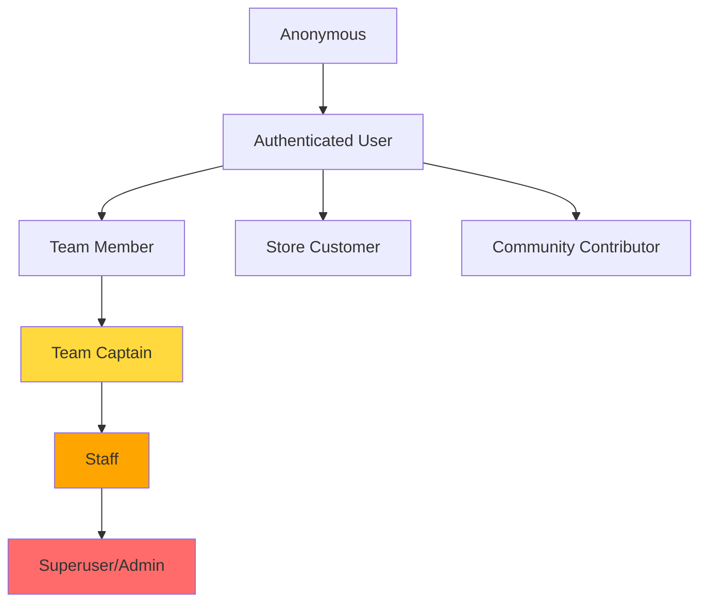

# 07 - Permissions, Notifications, and Real-time

**Document Version:** 2.0  
**Last Updated:** November 2, 2025  
**Status:** Current System Documentation (Post-Refactor)

---

## Table of Contents
- [Permission System](#permission-system)
- [Notification System](#notification-system)
- [Real-time Features](#real-time-features)
- [WebSocket Implementation](#websocket-implementation)
- [Security Considerations](#security-considerations)

---

## Permission System

### Role-Based Access Control (RBAC)

**Active Role Hierarchy:**



**Removed Roles:**
- ~~Tournament Organizer~~ (tournament system in legacy)
- ~~Match Participant~~ (tournament system in legacy)

---

### Permission Matrix (Current System)

| Resource | Anonymous | User | Team Member | Team Captain | Staff | Admin |
|----------|-----------|------|-------------|--------------|-------|-------|
| **Teams** |
| View teams | ✅ | ✅ | ✅ | ✅ | ✅ | ✅ |
| View team details | ✅ | ✅ | ✅ | ✅ | ✅ | ✅ |
| Create team | ❌ | ✅ | ✅ | ✅ | ✅ | ✅ |
| Edit team profile | ❌ | ❌ | 🔒 Perm | 🔒 Perm | ✅ | ✅ |
| Manage roster | ❌ | ❌ | 🔒 Perm | 🔒 Perm | ✅ | ✅ |
| Manage invites | ❌ | ❌ | 🔒 Perm | ✅ | ✅ | ✅ |
| Change settings | ❌ | ❌ | 🔒 Perm | ✅ | ✅ | ✅ |
| Delete team | ❌ | ❌ | ❌ | ✅ | ✅ | ✅ |
| View stats | ❌ | ❌ | 🔒 Perm | ✅ | ✅ | ✅ |
| **Community** |
| View posts | ✅ | ✅ | ✅ | ✅ | ✅ | ✅ |
| Create post | ❌ | ✅ | ✅ | ✅ | ✅ | ✅ |
| Edit post | ❌ | 🔒 Own | 🔒 Own | 🔒 Own | ✅ | ✅ |
| Delete post | ❌ | 🔒 Own | 🔒 Own | 🔒 Own | ✅ | ✅ |
| Like post | ❌ | ✅ | ✅ | ✅ | ✅ | ✅ |
| Comment | ❌ | ✅ | ✅ | ✅ | ✅ | ✅ |
| Flag post | ❌ | ✅ | ✅ | ✅ | ✅ | ✅ |
| Moderate content | ❌ | ❌ | ❌ | ❌ | ✅ | ✅ |
| **Ecommerce** |
| View products | ✅ | ✅ | ✅ | ✅ | ✅ | ✅ |
| Add to cart | ❌ | ✅ | ✅ | ✅ | ✅ | ✅ |
| Checkout | ❌ | ✅ | ✅ | ✅ | ✅ | ✅ |
| View orders | ❌ | 🔒 Own | 🔒 Own | 🔒 Own | ✅ | ✅ |
| Cancel order | ❌ | 🔒 Own | 🔒 Own | 🔒 Own | ✅ | ✅ |
| Write review | ❌ | 🔒 Purchased | 🔒 Purchased | 🔒 Purchased | ✅ | ✅ |
| Manage products | ❌ | ❌ | ❌ | ❌ | ✅ | ✅ |
| Process orders | ❌ | ❌ | ❌ | ❌ | ✅ | ✅ |
| **Economy** |
| View wallet | ❌ | 🔒 Own | 🔒 Own | 🔒 Own | ✅ | ✅ |
| View transactions | ❌ | 🔒 Own | 🔒 Own | 🔒 Own | ✅ | ✅ |
| Manual adjustment | ❌ | ❌ | ❌ | ❌ | ❌ | ✅ |
| **Support** |
| View tickets | ❌ | 🔒 Own | 🔒 Own | 🔒 Own | ✅ | ✅ |
| Create ticket | ❌ | ✅ | ✅ | ✅ | ✅ | ✅ |
| Reply to ticket | ❌ | 🔒 Own | 🔒 Own | 🔒 Own | ✅ | ✅ |
| Assign ticket | ❌ | ❌ | ❌ | ❌ | ✅ | ✅ |
| Close ticket | ❌ | 🔒 Own | 🔒 Own | 🔒 Own | ✅ | ✅ |

**Legend:**
- ✅ = Allowed for all in role
- ❌ = Denied
- 🔒 Own = Only own resources
- 🔒 Perm = Conditional on team permission settings
- 🔒 Purchased = Only if purchased product

---

### Team Permission System (Granular)

**10+ Permission Fields on Team Model:**

```python
# apps/teams/models/_legacy.py (lines 1-794)
class Team(models.Model):
    # ... other fields ...
    
    # Granular permissions (BooleanField)
    can_edit_profile = models.BooleanField(default=False)
    can_manage_roster = models.BooleanField(default=False)
    can_view_stats = models.BooleanField(default=True)
    can_manage_invites = models.BooleanField(default=False)
    can_change_settings = models.BooleanField(default=False)
    can_manage_chat = models.BooleanField(default=False)
    can_post_announcements = models.BooleanField(default=False)
    can_manage_achievements = models.BooleanField(default=False)
    can_view_finances = models.BooleanField(default=False)
    can_schedule_practice = models.BooleanField(default=False)
    # Plus more...
```

**Permission Roles:**

| Role | Permissions |
|------|-------------|
| **Captain** | All permissions (hardcoded) |
| **Co-Captain** | can_edit_profile, can_manage_roster, can_manage_invites, can_manage_chat, can_post_announcements |
| **Member** | Determined by team's permission flags (configurable by captain) |
| **Substitute** | can_view_stats (default), others determined by team flags |

**Permission Checking Function:**

```python
# apps/teams/permissions.py
def check_team_permission(user, team, permission):
    """
    Check if user has specific permission on team.
    
    Args:
        user: User instance
        team: Team instance
        permission: Permission name (e.g., 'can_edit_profile')
    
    Returns:
        bool: True if user has permission, False otherwise
    """
    
    # Captain always has all permissions
    if team.captain.user == user:
        return True
    
    # Check membership
    membership = TeamMembership.objects.filter(
        team=team,
        user=user
    ).first()
    
    if not membership:
        return False  # Not a member
    
    # Co-captain has predefined permissions
    if membership.role == 'CO_CAPTAIN':
        co_captain_permissions = [
            'can_edit_profile',
            'can_manage_roster',
            'can_manage_invites',
            'can_manage_chat',
            'can_post_announcements',
        ]
        return permission in co_captain_permissions
    
    # Regular members and substitutes: check team's permission flags
    return getattr(team, permission, False)
```

**Usage in Views:**

```python
# apps/teams/views.py
from django.contrib.auth.decorators import login_required
from django.core.exceptions import PermissionDenied
from .permissions import check_team_permission

@login_required
def edit_team(request, slug):
    """Edit team profile - requires can_edit_profile permission"""
    team = get_object_or_404(Team, slug=slug)
    
    # Permission check
    if not check_team_permission(request.user, team, 'can_edit_profile'):
        raise PermissionDenied('You do not have permission to edit this team.')
    
    if request.method == 'POST':
        form = TeamEditForm(request.POST, request.FILES, instance=team)
        if form.is_valid():
            form.save()
            messages.success(request, 'Team updated successfully!')
            return redirect('team_detail', slug=slug)
    else:
        form = TeamEditForm(instance=team)
    
    return render(request, 'teams/edit.html', {
        'team': team,
        'form': form
    })

@login_required
def manage_roster(request, slug):
    """Manage team roster - requires can_manage_roster permission"""
    team = get_object_or_404(Team, slug=slug)
    
    if not check_team_permission(request.user, team, 'can_manage_roster'):
        raise PermissionDenied('You do not have permission to manage the roster.')
    
    # ... roster management logic ...
```

**Permission Configuration (Captain Only):**

```python
# apps/teams/views.py
@login_required
def team_settings(request, slug):
    """Team settings - captain only"""
    team = get_object_or_404(Team, slug=slug)
    
    # Captain check (only captain can change permission settings)
    if team.captain.user != request.user:
        raise PermissionDenied('Only the team captain can change settings.')
    
    if request.method == 'POST':
        # Update permission flags
        team.can_edit_profile = request.POST.get('can_edit_profile') == 'on'
        team.can_manage_roster = request.POST.get('can_manage_roster') == 'on'
        team.can_view_stats = request.POST.get('can_view_stats') == 'on'
        # ... more permissions ...
        team.save()
        
        messages.success(request, 'Team settings updated!')
        return redirect('team_settings', slug=slug)
    
    return render(request, 'teams/settings.html', {'team': team})
```

**Code Reference:** `apps/teams/models/_legacy.py` lines 1-794, `apps/teams/permissions.py`

---

### Django Permission Implementation (Admin/Staff)

**Built-in Permissions:**

Django automatically creates these permissions for each model:
- `add_<model>` - Can create new instances
- `change_<model>` - Can edit existing instances
- `delete_<model>` - Can delete instances
- `view_<model>` - Can view instances

**Example: Product Model**
- `ecommerce.add_product`
- `ecommerce.change_product`
- `ecommerce.delete_product`
- `ecommerce.view_product`

**Custom Permissions (Admin/Staff):**

```python
# apps/ecommerce/models.py
class Order(models.Model):
    # ... fields ...
    
    class Meta:
        permissions = [
            ('process_order', 'Can process orders'),
            ('refund_order', 'Can refund orders'),
            ('view_all_orders', 'Can view all orders'),
        ]

# apps/economy/models.py
class DeltaCrownWallet(models.Model):
    # ... fields ...
    
    class Meta:
        permissions = [
            ('manual_adjust_wallet', 'Can manually adjust wallet balance'),
            ('view_all_wallets', 'Can view all wallets'),
        ]

# apps/siteui/models.py
class CommunityPost(models.Model):
    # ... fields ...
    
    class Meta:
        permissions = [
            ('moderate_posts', 'Can moderate community posts'),
            ('remove_posts', 'Can remove flagged posts'),
        ]
```

**Permission Checking in Views (Admin/Staff):**

```python
from django.contrib.auth.decorators import permission_required

@permission_required('ecommerce.process_order', raise_exception=True)
def process_order_view(request, order_id):
    """Process order - requires permission"""
    order = get_object_or_404(Order, id=order_id)
    # ... processing logic ...

@permission_required('economy.manual_adjust_wallet', raise_exception=True)
def manual_adjust_wallet_view(request, wallet_id):
    """Manual wallet adjustment - requires permission"""
    wallet = get_object_or_404(DeltaCrownWallet, id=wallet_id)
    # ... adjustment logic ...

@permission_required('siteui.moderate_posts', raise_exception=True)
def moderate_post_view(request, post_id):
    """Moderate post - requires permission"""
    post = get_object_or_404(CommunityPost, id=post_id)
    # ... moderation logic ...
```

---

### Object-Level Permissions

**Use Case:** Check if user owns a specific resource

**Pattern:**

```python
def check_object_permission(user, obj, action='view'):
    """
    Check if user has permission to perform action on object.
    
    Args:
        user: User instance
        obj: Object instance (Order, Post, Team, etc.)
        action: Action to perform ('view', 'edit', 'delete')
    
    Returns:
        bool: True if permitted, False otherwise
    """
    
    # Staff/admin can do anything
    if user.is_staff or user.is_superuser:
        return True
    
    # Check object type
    if isinstance(obj, Order):
        return obj.user == user
    
    elif isinstance(obj, CommunityPost):
        if action == 'view':
            return True  # Anyone can view published posts
        elif action in ['edit', 'delete']:
            return obj.author == user
    
    elif isinstance(obj, Team):
        if action == 'view':
            return True  # Anyone can view teams
        elif action == 'edit':
            return check_team_permission(user, obj, 'can_edit_profile')
        elif action == 'delete':
            return obj.captain.user == user
    
    elif isinstance(obj, DeltaCrownWallet):
        return obj.profile.user == user
    
    return False
```

**Usage:**

```python
@login_required
def order_detail(request, order_id):
    """View order detail - own orders only"""
    order = get_object_or_404(Order, id=order_id)
    
    if not check_object_permission(request.user, order, 'view'):
        raise PermissionDenied('You do not have permission to view this order.')
    
    return render(request, 'ecommerce/order_detail.html', {'order': order})

@login_required
def post_edit(request, post_id):
    """Edit post - author only"""
    post = get_object_or_404(CommunityPost, id=post_id)
    
    if not check_object_permission(request.user, post, 'edit'):
        raise PermissionDenied('You can only edit your own posts.')
    
    # ... edit logic ...
```

---

## Notification System

### Overview

DeltaCrown has a **comprehensive notification system** with:
- **15+ notification types**
- **4 delivery channels** (Email, SMS, Push, In-App)
- **Per-type channel preferences** (granular control)
- **Read/unread tracking**
- **Notification digest** (batched emails)

---

### Notification Types (15+)

**Models:** `apps/notifications/models.py`

```python
class Notification(models.Model):
    class NotificationType(models.TextChoices):
        # Team-related (5)
        TEAM_INVITE = 'TEAM_INVITE', 'Team Invitation'
        TEAM_INVITE_ACCEPTED = 'TEAM_INVITE_ACCEPTED', 'Team Invite Accepted'
        TEAM_MEMBER_JOINED = 'TEAM_MEMBER_JOINED', 'Team Member Joined'
        TEAM_MEMBER_LEFT = 'TEAM_MEMBER_LEFT', 'Team Member Left'
        TEAM_CREATED = 'TEAM_CREATED', 'Team Created'
        
        # Tournament-related (LEGACY - 4)
        TOURNAMENT_REMINDER = 'TOURNAMENT_REMINDER', 'Tournament Reminder'
        MATCH_SCHEDULED = 'MATCH_SCHEDULED', 'Match Scheduled'
        MATCH_RESULT = 'MATCH_RESULT', 'Match Result'
        PAYMENT_VERIFIED = 'PAYMENT_VERIFIED', 'Payment Verified'
        
        # Economy-related (2)
        COIN_AWARDED = 'COIN_AWARDED', 'DeltaCoin Awarded'
        COIN_DEDUCTED = 'COIN_DEDUCTED', 'DeltaCoin Deducted'
        
        # Ecommerce-related (4)
        ORDER_CONFIRMED = 'ORDER_CONFIRMED', 'Order Confirmed'
        ORDER_SHIPPED = 'ORDER_SHIPPED', 'Order Shipped'
        ORDER_DELIVERED = 'ORDER_DELIVERED', 'Order Delivered'
        ORDER_CANCELLED = 'ORDER_CANCELLED', 'Order Cancelled'
        
        # Community-related (3)
        COMMUNITY_POST_LIKE = 'COMMUNITY_POST_LIKE', 'Post Liked'
        COMMUNITY_POST_COMMENT = 'COMMUNITY_POST_COMMENT', 'Post Comment'
        COMMUNITY_POST_SHARE = 'COMMUNITY_POST_SHARE', 'Post Shared'
        
        # Support-related (2)
        SUPPORT_TICKET_REPLY = 'SUPPORT_TICKET_REPLY', 'Support Ticket Reply'
        SUPPORT_TICKET_RESOLVED = 'SUPPORT_TICKET_RESOLVED', 'Support Ticket Resolved'
        
        # Plus more as needed...
```

**Active Types:** 13  
**Legacy Types (Dormant):** 4 (TOURNAMENT_REMINDER, MATCH_SCHEDULED, MATCH_RESULT, PAYMENT_VERIFIED)

**Code Reference:** `apps/notifications/models.py`

---

### Notification Model

```python
# apps/notifications/models.py
class Notification(models.Model):
    recipient = models.ForeignKey(User, on_delete=models.CASCADE, related_name='notifications')
    type = models.CharField(max_length=50, choices=NotificationType.choices)
    
    title = models.CharField(max_length=255)
    body = models.TextField()
    
    # Context references (for navigation)
    team_id = models.IntegerField(null=True, blank=True, db_index=True)
    order_id = models.IntegerField(null=True, blank=True, db_index=True)
    post_id = models.IntegerField(null=True, blank=True, db_index=True)
    
    # Legacy references (NO ForeignKey)
    tournament_id = models.IntegerField(null=True, blank=True, db_index=True)
    match_id = models.IntegerField(null=True, blank=True, db_index=True)
    
    # Status
    read_at = models.DateTimeField(null=True, blank=True)
    created_at = models.DateTimeField(auto_now_add=True)
    
    class Meta:
        ordering = ['-created_at']
        indexes = [
            models.Index(fields=['recipient', '-created_at']),
            models.Index(fields=['recipient', 'read_at']),
        ]
    
    @property
    def is_read(self):
        return self.read_at is not None
    
    def mark_as_read(self):
        if not self.read_at:
            self.read_at = timezone.now()
            self.save()
    
    def get_url(self):
        """Get navigation URL based on notification type"""
        if self.type == 'TEAM_INVITE':
            return f'/teams/invite/accept/{self.team_id}/'
        elif self.type == 'COIN_AWARDED':
            return '/economy/wallet/'
        elif self.type == 'ORDER_SHIPPED':
            return f'/store/orders/{self.order_id}/'
        elif self.type == 'COMMUNITY_POST_LIKE':
            return f'/community/post/{self.post_id}/'
        # ... more types ...
        return '/notifications/'
```

**Code Reference:** `apps/notifications/models.py`

---

### Notification Preferences (Granular Control)

**Model:**

```python
# apps/notifications/models.py
class NotificationPreference(models.Model):
    user = models.OneToOneField(User, on_delete=models.CASCADE, related_name='notification_preferences')
    
    # Per-type channel preferences (JSONField)
    preferences = models.JSONField(default=dict)
    # Structure: {"TEAM_INVITE": ["EMAIL", "IN_APP"], "COIN_AWARDED": ["IN_APP"], ...}
    
    # Global toggles
    email_enabled = models.BooleanField(default=True)
    sms_enabled = models.BooleanField(default=False)
    push_enabled = models.BooleanField(default=True)
    in_app_enabled = models.BooleanField(default=True)
    
    # Digest settings
    digest_frequency = models.CharField(
        max_length=10,
        choices=[
            ('NONE', 'None'),
            ('DAILY', 'Daily'),
            ('WEEKLY', 'Weekly'),
        ],
        default='NONE'
    )
    
    def get_channels_for_type(self, notification_type):
        """Get enabled channels for specific notification type"""
        # Check global toggles
        available_channels = []
        if self.email_enabled:
            available_channels.append('EMAIL')
        if self.sms_enabled:
            available_channels.append('SMS')
        if self.push_enabled:
            available_channels.append('PUSH')
        if self.in_app_enabled:
            available_channels.append('IN_APP')
        
        # Get per-type preferences
        type_channels = self.preferences.get(notification_type, ['IN_APP'])  # Default: in-app only
        
        # Return intersection
        return [ch for ch in type_channels if ch in available_channels]
```

**Example Preferences JSON:**

```json
{
  "TEAM_INVITE": ["EMAIL", "IN_APP"],
  "TEAM_MEMBER_JOINED": ["IN_APP"],
  "COIN_AWARDED": ["IN_APP"],
  "ORDER_CONFIRMED": ["EMAIL", "PUSH", "IN_APP"],
  "ORDER_SHIPPED": ["EMAIL", "PUSH", "IN_APP"],
  "ORDER_DELIVERED": ["IN_APP"],
  "COMMUNITY_POST_LIKE": ["IN_APP"],
  "COMMUNITY_POST_COMMENT": ["EMAIL", "IN_APP"]
}
```

**Code Reference:** `apps/notifications/models.py`

---

### Notification Creation (Signal-Driven)

**Pattern:** Use Django signals to auto-create notifications on events

**Example: Team Invite Notification**

```python
# apps/teams/signals.py
from django.db.models.signals import post_save
from django.dispatch import receiver
from apps.notifications.models import Notification
from .models import TeamInvite

@receiver(post_save, sender=TeamInvite)
def notify_team_invite(sender, instance, created, **kwargs):
    """Send notification when team invite is created"""
    if created:
        Notification.objects.create(
            recipient=instance.invitee,
            type='TEAM_INVITE',
            title=f'You\'ve been invited to join {instance.team.name}',
            body=f'{instance.inviter.username} invited you to join their team.',
            team_id=instance.team.id
        )
```

**Example: Order Status Notification**

```python
# apps/ecommerce/signals.py
from django.db.models.signals import post_save
from django.dispatch import receiver
from apps.notifications.models import Notification
from .models import Order

@receiver(post_save, sender=Order)
def notify_order_status(sender, instance, created, **kwargs):
    """Send notification on order status changes"""
    
    if instance.status == 'CONFIRMED' and instance.confirmed_at:
        Notification.objects.create(
            recipient=instance.user,
            type='ORDER_CONFIRMED',
            title=f'Order #{instance.order_number} confirmed',
            body='Your order has been confirmed and will be processed shortly.',
            order_id=instance.id
        )
    
    elif instance.status == 'SHIPPED' and instance.shipped_at:
        Notification.objects.create(
            recipient=instance.user,
            type='ORDER_SHIPPED',
            title=f'Order #{instance.order_number} shipped',
            body='Your order has been shipped and is on the way!',
            order_id=instance.id
        )
    
    elif instance.status == 'DELIVERED' and instance.delivered_at:
        Notification.objects.create(
            recipient=instance.user,
            type='ORDER_DELIVERED',
            title=f'Order #{instance.order_number} delivered',
            body='Your order has been delivered. Thank you!',
            order_id=instance.id
        )
```

**Example: Coin Award Notification**

```python
# apps/economy/services.py (within award() function)
def award(*, profile, amount, reason, ...):
    # ... transaction creation ...
    
    # Send notification
    Notification.objects.create(
        recipient=profile.user,
        type='COIN_AWARDED' if amount > 0 else 'COIN_DEDUCTED',
        title=f'{abs(amount)} DeltaCoin {"awarded" if amount > 0 else "deducted"}',
        body=note or reason,
    )
    
    return tx
```

**Code Reference:** `apps/teams/signals.py`, `apps/ecommerce/signals.py`, `apps/economy/services.py`

---

### Multi-Channel Delivery

**Channels (4):**
1. **IN_APP** - In-app notification bell (always works)
2. **EMAIL** - Email delivery (requires email service)
3. **SMS** - SMS delivery (requires SMS gateway)
4. **PUSH** - Push notifications (requires push service)

**Delivery Service:**

```python
# apps/notifications/services.py (hypothetical)
from django.core.mail import send_mail
from django.template.loader import render_to_string

def deliver_notification(notification):
    """Deliver notification via configured channels"""
    
    user = notification.recipient
    prefs = NotificationPreference.objects.filter(user=user).first()
    
    if not prefs:
        # Default: in-app only
        prefs = NotificationPreference.objects.create(user=user)
    
    channels = prefs.get_channels_for_type(notification.type)
    
    for channel in channels:
        if channel == 'IN_APP':
            # Already created in database, nothing to do
            pass
        
        elif channel == 'EMAIL':
            send_email_notification(notification)
        
        elif channel == 'SMS':
            send_sms_notification(notification)
        
        elif channel == 'PUSH':
            send_push_notification(notification)

def send_email_notification(notification):
    """Send email notification"""
    subject = notification.title
    body = render_to_string('emails/notification.html', {
        'notification': notification,
        'user': notification.recipient
    })
    
    send_mail(
        subject=subject,
        message=body,
        from_email='noreply@deltacrown.com',
        recipient_list=[notification.recipient.email],
        html_message=body
    )

def send_sms_notification(notification):
    """Send SMS notification (placeholder)"""
    # Integration with SMS gateway (e.g., Twilio, BulkSMS BD)
    pass

def send_push_notification(notification):
    """Send push notification (placeholder)"""
    # Integration with push service (e.g., FCM, OneSignal)
    pass
```

**Signal Integration:**

```python
# apps/notifications/signals.py
from django.db.models.signals import post_save
from django.dispatch import receiver
from .models import Notification
from .services import deliver_notification

@receiver(post_save, sender=Notification)
def deliver_on_create(sender, instance, created, **kwargs):
    """Deliver notification via configured channels on creation"""
    if created:
        deliver_notification(instance)
```

**Code Reference:** `apps/notifications/services.py` (if exists), `apps/notifications/signals.py`

---

### Notification Digest

**Model:**

```python
# apps/notifications/models.py
class NotificationDigest(models.Model):
    user = models.ForeignKey(User, on_delete=models.CASCADE)
    notifications = models.ManyToManyField(Notification)
    
    frequency = models.CharField(
        max_length=10,
        choices=[
            ('DAILY', 'Daily'),
            ('WEEKLY', 'Weekly'),
        ]
    )
    
    sent_at = models.DateTimeField(null=True, blank=True)
    created_at = models.DateTimeField(auto_now_add=True)
```

**Digest Generation (Celery Task):**

```python
# apps/notifications/tasks.py (hypothetical)
from celery import shared_task
from django.utils import timezone
from datetime import timedelta

@shared_task
def send_daily_digests():
    """Send daily notification digests"""
    users_with_daily = User.objects.filter(
        notification_preferences__digest_frequency='DAILY'
    )
    
    for user in users_with_daily:
        # Get unread notifications from last 24 hours
        notifications = Notification.objects.filter(
            recipient=user,
            read_at__isnull=True,
            created_at__gte=timezone.now() - timedelta(days=1)
        )
        
        if notifications.exists():
            # Create digest
            digest = NotificationDigest.objects.create(
                user=user,
                frequency='DAILY'
            )
            digest.notifications.set(notifications)
            
            # Send digest email
            send_digest_email(digest)
            
            digest.sent_at = timezone.now()
            digest.save()

@shared_task
def send_weekly_digests():
    """Send weekly notification digests"""
    users_with_weekly = User.objects.filter(
        notification_preferences__digest_frequency='WEEKLY'
    )
    
    for user in users_with_weekly:
        # Get unread notifications from last 7 days
        notifications = Notification.objects.filter(
            recipient=user,
            read_at__isnull=True,
            created_at__gte=timezone.now() - timedelta(days=7)
        )
        
        if notifications.exists():
            # Create digest
            digest = NotificationDigest.objects.create(
                user=user,
                frequency='WEEKLY'
            )
            digest.notifications.set(notifications)
            
            # Send digest email
            send_digest_email(digest)
            
            digest.sent_at = timezone.now()
            digest.save()
```

**Celery Beat Schedule:**

```python
# deltacrown/settings.py or celeryconfig.py
from celery.schedules import crontab

CELERY_BEAT_SCHEDULE = {
    'send-daily-digests': {
        'task': 'apps.notifications.tasks.send_daily_digests',
        'schedule': crontab(hour=8, minute=0),  # 8 AM every day
    },
    'send-weekly-digests': {
        'task': 'apps.notifications.tasks.send_weekly_digests',
        'schedule': crontab(day_of_week=1, hour=8, minute=0),  # 8 AM every Monday
    },
}
```

**Code Reference:** `apps/notifications/models.py`, `apps/notifications/tasks.py` (if exists)

---

## Real-time Features

### Overview

DeltaCrown uses **Django Channels** for real-time features:
- ✅ **Team Chat** - Real-time messaging within teams
- ✅ **Notification Bell** - Live notification updates
- ❌ ~~**Match Chat**~~ - Removed (tournament system in legacy)
- ❌ ~~**Live Bracket Updates**~~ - Removed (tournament system in legacy)
- ❌ ~~**Match Score Updates**~~ - Removed (tournament system in legacy)

**Status:** Configured but not fully audited

---

### WebSocket Configuration

**File:** `deltacrown/asgi.py`

```python
# deltacrown/asgi.py
import os
from django.core.asgi import get_asgi_application
from channels.routing import ProtocolTypeRouter, URLRouter
from channels.auth import AuthMiddlewareStack
from channels.security.websocket import AllowedHostsOriginValidator

os.environ.setdefault('DJANGO_SETTINGS_MODULE', 'deltacrown.settings')

django_asgi_app = get_asgi_application()

# Import routing after Django setup
from apps.teams import routing as teams_routing
from apps.notifications import routing as notifications_routing

application = ProtocolTypeRouter({
    "http": django_asgi_app,
    "websocket": AllowedHostsOriginValidator(
        AuthMiddlewareStack(
            URLRouter(
                teams_routing.websocket_urlpatterns +
                notifications_routing.websocket_urlpatterns
            )
        )
    ),
})
```

**Code Reference:** `deltacrown/asgi.py`

---

### Team Chat (WebSocket)

**Consumer:**

```python
# apps/teams/consumers.py (hypothetical)
from channels.generic.websocket import AsyncJsonWebsocketConsumer

class TeamChatConsumer(AsyncJsonWebsocketConsumer):
    async def connect(self):
        self.team_id = self.scope['url_route']['kwargs']['team_id']
        self.team_group_name = f'team_chat_{self.team_id}'
        
        # Check permission
        user = self.scope['user']
        # ... check if user is member of team ...
        
        # Join team chat group
        await self.channel_layer.group_add(
            self.team_group_name,
            self.channel_name
        )
        
        await self.accept()
    
    async def disconnect(self, close_code):
        # Leave team chat group
        await self.channel_layer.group_discard(
            self.team_group_name,
            self.channel_name
        )
    
    async def receive_json(self, content):
        message = content['message']
        user = self.scope['user']
        
        # Save message to database
        # ... save to TeamChatMessage model ...
        
        # Broadcast to team chat group
        await self.channel_layer.group_send(
            self.team_group_name,
            {
                'type': 'chat_message',
                'message': message,
                'username': user.username,
                'timestamp': timezone.now().isoformat()
            }
        )
    
    async def chat_message(self, event):
        # Send message to WebSocket
        await self.send_json({
            'message': event['message'],
            'username': event['username'],
            'timestamp': event['timestamp']
        })
```

**Routing:**

```python
# apps/teams/routing.py (hypothetical)
from django.urls import path
from . import consumers

websocket_urlpatterns = [
    path('ws/team/<int:team_id>/chat/', consumers.TeamChatConsumer.as_asgi()),
]
```

**Frontend (JavaScript):**

```javascript
// static/js/team_chat.js
const teamId = document.getElementById('team-id').value;
const chatSocket = new WebSocket(
    `ws://${window.location.host}/ws/team/${teamId}/chat/`
);

chatSocket.onmessage = function(e) {
    const data = JSON.parse(e.data);
    const messageContainer = document.getElementById('chat-messages');
    
    // Add message to chat
    const messageElement = document.createElement('div');
    messageElement.className = 'chat-message';
    messageElement.innerHTML = `
        <strong>${data.username}</strong>: ${data.message}
        <span class="timestamp">${data.timestamp}</span>
    `;
    messageContainer.appendChild(messageElement);
    
    // Scroll to bottom
    messageContainer.scrollTop = messageContainer.scrollHeight;
};

document.getElementById('chat-form').onsubmit = function(e) {
    e.preventDefault();
    const messageInput = document.getElementById('chat-message-input');
    const message = messageInput.value;
    
    chatSocket.send(JSON.stringify({
        'message': message
    }));
    
    messageInput.value = '';
};
```

**Code Reference:** `apps/teams/consumers.py` (if exists), `apps/teams/routing.py` (if exists)

---

### Notification Bell (WebSocket)

**Consumer:**

```python
# apps/notifications/consumers.py (hypothetical)
from channels.generic.websocket import AsyncJsonWebsocketConsumer

class NotificationConsumer(AsyncJsonWebsocketConsumer):
    async def connect(self):
        self.user = self.scope['user']
        self.user_group_name = f'notifications_{self.user.id}'
        
        # Join user's notification group
        await self.channel_layer.group_add(
            self.user_group_name,
            self.channel_name
        )
        
        await self.accept()
    
    async def disconnect(self, close_code):
        # Leave user's notification group
        await self.channel_layer.group_discard(
            self.user_group_name,
            self.channel_name
        )
    
    async def notification_created(self, event):
        # Send notification to WebSocket
        await self.send_json({
            'type': 'notification',
            'id': event['notification_id'],
            'title': event['title'],
            'body': event['body'],
            'notification_type': event['notification_type'],
            'url': event['url']
        })
```

**Signal Integration:**

```python
# apps/notifications/signals.py
from channels.layers import get_channel_layer
from asgiref.sync import async_to_sync

@receiver(post_save, sender=Notification)
def broadcast_notification(sender, instance, created, **kwargs):
    """Broadcast notification to user's WebSocket connection"""
    if created:
        channel_layer = get_channel_layer()
        async_to_sync(channel_layer.group_send)(
            f'notifications_{instance.recipient.id}',
            {
                'type': 'notification_created',
                'notification_id': instance.id,
                'title': instance.title,
                'body': instance.body,
                'notification_type': instance.type,
                'url': instance.get_url()
            }
        )
```

**Frontend (JavaScript):**

```javascript
// static/js/notifications.js
const notificationSocket = new WebSocket(
    `ws://${window.location.host}/ws/notifications/`
);

notificationSocket.onmessage = function(e) {
    const data = JSON.parse(e.data);
    
    // Update notification bell count
    const badge = document.querySelector('.notification-badge');
    const currentCount = parseInt(badge.textContent) || 0;
    badge.textContent = currentCount + 1;
    badge.classList.remove('hidden');
    
    // Show toast notification
    showToast(data.title, data.body, data.url);
};

function showToast(title, body, url) {
    const toast = document.createElement('div');
    toast.className = 'notification-toast';
    toast.innerHTML = `
        <div class="toast-header">
            <strong>${title}</strong>
            <button class="close">&times;</button>
        </div>
        <div class="toast-body">${body}</div>
    `;
    
    toast.onclick = function() {
        window.location.href = url;
    };
    
    document.getElementById('toast-container').appendChild(toast);
    
    // Auto-dismiss after 5 seconds
    setTimeout(() => {
        toast.remove();
    }, 5000);
}
```

**Code Reference:** `apps/notifications/consumers.py` (if exists), `apps/notifications/routing.py` (if exists)

---

### Redis Configuration (Channel Layer)

**Settings:**

```python
# deltacrown/settings.py
CHANNEL_LAYERS = {
    'default': {
        'BACKEND': 'channels_redis.core.RedisChannelLayer',
        'CONFIG': {
            'hosts': [('127.0.0.1', 6379)],
        },
    },
}
```

**Code Reference:** `deltacrown/settings.py`

---

## Security Considerations

### Authentication

**Middleware:**
```python
# deltacrown/settings.py
MIDDLEWARE = [
    'django.middleware.security.SecurityMiddleware',
    'django.contrib.sessions.middleware.SessionMiddleware',
    'django.middleware.common.CommonMiddleware',
    'django.middleware.csrf.CsrfViewMiddleware',
    'django.contrib.auth.middleware.AuthenticationMiddleware',  # Required for auth
    'django.contrib.messages.middleware.MessageMiddleware',
    'django.middleware.clickjacking.XFrameOptionsMiddleware',
]
```

**Login Required:**
```python
from django.contrib.auth.decorators import login_required

@login_required
def protected_view(request):
    # Only authenticated users can access
    pass
```

---

### CSRF Protection

**Forms:**
```html
<form method="post">
  
  <!-- form fields -->
</form>
```

**AJAX:**
```javascript
function getCookie(name) {
    let cookieValue = null;
    if (document.cookie && document.cookie !== '') {
        const cookies = document.cookie.split(';');
        for (let i = 0; i < cookies.length; i++) {
            const cookie = cookies[i].trim();
            if (cookie.substring(0, name.length + 1) === (name + '=')) {
                cookieValue = decodeURIComponent(cookie.substring(name.length + 1));
                break;
            }
        }
    }
    return cookieValue;
}

fetch(url, {
    method: 'POST',
    headers: {
        'X-CSRFToken': getCookie('csrftoken')
    },
    body: JSON.stringify(data)
});
```

---

### SQL Injection Protection

**Django ORM automatically protects against SQL injection:**

```python
# SAFE - Django ORM parameterizes queries
Team.objects.filter(name=user_input)

# DANGEROUS - Raw SQL without parameters
Team.objects.raw(f"SELECT * FROM teams WHERE name='{user_input}'")  # DON'T DO THIS

# SAFE - Raw SQL with parameters
Team.objects.raw("SELECT * FROM teams WHERE name=%s", [user_input])
```

---

### XSS Protection

**Template Auto-Escaping:**
```html
<!-- SAFE - Auto-escaped by Django -->
<p>{{ user_input }}</p>

<!-- DANGEROUS - Bypasses escaping -->
<p>{{ user_input|safe }}</p>

<!-- SAFE - Manual escape -->
<p>{{ user_input|escape }}</p>
```

**JavaScript Context:**
```html
<!-- DANGEROUS - No escaping in JS -->
<script>
  const userInput = "{{ user_input }}";  // XSS vulnerable
</script>

<!-- SAFE - JSON encoding -->
<script>
  const userInput = {{ user_input|escapejs }};
</script>
```

---

### Rate Limiting

**Django RateLimit Package:**

```python
# Install: pip install django-ratelimit

from django_ratelimit.decorators import ratelimit

@ratelimit(key='ip', rate='5/m', method='POST')
def login_view(request):
    """Login view - rate limited to 5 attempts per minute per IP"""
    pass

@ratelimit(key='user', rate='100/h')
def api_view(request):
    """API view - rate limited to 100 requests per hour per user"""
    pass
```

---

### WebSocket Security

**Origin Validation:**
```python
# deltacrown/asgi.py
from channels.security.websocket import AllowedHostsOriginValidator

application = ProtocolTypeRouter({
    "websocket": AllowedHostsOriginValidator(  # Validates Origin header
        AuthMiddlewareStack(
            URLRouter(...)
        )
    ),
})
```

**Authentication:**
```python
class TeamChatConsumer(AsyncJsonWebsocketConsumer):
    async def connect(self):
        user = self.scope['user']
        
        # Reject if not authenticated
        if not user.is_authenticated:
            await self.close()
            return
        
        # Check team membership
        team_id = self.scope['url_route']['kwargs']['team_id']
        is_member = await self.check_team_membership(user, team_id)
        
        if not is_member:
            await self.close()
            return
        
        # Accept connection
        await self.accept()
```

---

## Summary

### Permission System

| System | Permission Model | Status |
|--------|------------------|--------|
| **Teams** | 10+ granular permission flags | ✅ Active |
| **Community** | Owner-based (author can edit/delete) | ✅ Active |
| **Ecommerce** | Owner-based (user can view own orders) | ✅ Active |
| **Economy** | Owner-based (user can view own wallet) | ✅ Active |
| **Admin** | Django permissions + custom permissions | ✅ Active |
| ~~**Tournaments**~~ | ~~Organizer-based~~ | ❌ Legacy |

---

### Notification System

| Feature | Implementation | Status |
|---------|----------------|--------|
| **Notification Types** | 15+ types (13 active, 4 legacy) | ✅ Active |
| **Delivery Channels** | 4 channels (Email, SMS, Push, In-App) | ✅ Active |
| **Granular Preferences** | Per-type channel configuration (JSONField) | ✅ Active |
| **Read/Unread Tracking** | read_at timestamp | ✅ Active |
| **Notification Digest** | Daily/Weekly batched emails | ✅ Active (Celery) |
| **Signal-Driven** | Auto-create on events | ✅ Active |

---

### Real-time Features

| Feature | Technology | Status |
|---------|-----------|--------|
| **Team Chat** | Django Channels + WebSocket | ✅ Active (likely) |
| **Notification Bell** | Django Channels + WebSocket | ✅ Active (likely) |
| ~~**Match Chat**~~ | ~~Django Channels + WebSocket~~ | ❌ Legacy |
| ~~**Live Bracket Updates**~~ | ~~Django Channels + WebSocket~~ | ❌ Legacy |

---

### Security Measures

| Measure | Implementation | Status |
|---------|----------------|--------|
| **Authentication** | Django Auth + Login Required | ✅ Active |
| **CSRF Protection** | Django CSRF Middleware | ✅ Active |
| **SQL Injection Protection** | Django ORM parameterization | ✅ Active |
| **XSS Protection** | Django template auto-escaping | ✅ Active |
| **Rate Limiting** | django-ratelimit (if installed) | ⚠️ To Verify |
| **WebSocket Security** | Origin validation + Auth | ✅ Active |

---

**Document Status:** Complete and accurate as of November 2, 2025 post-refactor state. Documents active permission, notification, and real-time features. Legacy tournament-related features noted for reference.
