# PROPOSAL PART 3.1: DATABASE DESIGN & ERD - CORE MODELS

---

**Navigation:**
- [← Previous: Part 2.3 - Real-Time & Security](PART_2.3_REALTIME_SECURITY.md)
- [↑ Master Index](INDEX_MASTER_NAVIGATION.md)
- [→ Next: Part 3.2 - Supporting Models & Schema](PART_3.2_SUPPORTING_MODELS_SCHEMA.md)

---

**Part 3.1 Table of Contents:**
- Section 1: Introduction & Design Principles
- Section 2: ERD Overview
- Section 3: Core Tournament Models (Tournament, Game, CustomField, TournamentVersion)
- Section 4: Registration & Payment Models
- Section 5: Bracket Structure Models
- Section 6: Match Lifecycle Models (partial)

---

# Part 3: Database Design & Entity Relationship Diagrams (ERD)

**DeltaCrown Tournament Engine**  
**Version:** 1.0  
**Date:** November 3, 2025  
**Author:** Development Team

---

## Table of Contents

1. [Introduction](#1-introduction)
2. [ERD Overview](#2-erd-overview)
3. [Core Tournament Models](#3-core-tournament-models)
4. [Registration & Payment Models](#4-registration--payment-models)
5. [Bracket Structure Models](#5-bracket-structure-models)
6. [Match Lifecycle Models](#6-match-lifecycle-models)
7. [Supporting Models](#7-supporting-models)
8. [Complete System ERD](#8-complete-system-erd)
9. [Index Strategy](#9-index-strategy)
10. [Data Integrity & Constraints](#10-data-integrity--constraints)
11. [Migration Strategy](#11-migration-strategy)

---

## 1. Introduction

This document provides comprehensive database design specifications for the DeltaCrown Tournament Engine. It includes:

- **Entity Relationship Diagrams (ERD)** using Mermaid notation
- **Table structures** with field definitions, types, and constraints
- **Relationship mappings** between models
- **Index strategy** for query optimization
- **Data integrity rules** and validation constraints
- **Migration approach** for production deployment

### Design Principles

**1. PostgreSQL-First Design**
- Leverages PostgreSQL features (JSONB, Arrays, Advanced Indexing)
- Uses JSONB for flexible schema requirements (CustomField, TournamentConfig)
- Implements GIN indexes for JSONB and Array fields

**2. Scalability Considerations**
- Optimized indexes for frequent queries
- Denormalized data where appropriate (participant names in Match model)
- Partition-ready design for analytics tables
- Efficient relationship navigation (BracketNode double-linked list)

**3. Data Integrity**
- Soft delete for critical data (Tournament, Registration, Match)
- Audit trails with timestamps and user tracking
- Version control for tournament configuration changes
- Constraint enforcement at database level

**4. Integration Patterns**
- IntegerField references to existing DeltaCrown apps (teams, user_profile, economy)
- Avoids direct ForeignKey to legacy apps for decoupling
- Service layer handles cross-app data fetching

---

## 2. ERD Overview

### Database Schema Organization

The tournament engine uses **13 core models** organized into logical groupings:

**Core Models (4):**
- `Tournament` - Main tournament entity
- `Game` - Game definitions (Valorant, eFootball, etc.)
- `CustomField` - Dynamic tournament fields
- `TournamentVersion` - Configuration version control

**Registration Models (2):**
- `Registration` - Participant registrations
- `Payment` - Payment proof submissions

**Bracket Models (2):**
- `Bracket` - Bracket container
- `BracketNode` - Bracket positions/matches

**Match Models (2):**
- `Match` - Match lifecycle management
- `MatchResult` - Score submissions

**Supporting Models (3):**
- `Dispute` - Dispute resolution workflow
- `Certificate` - Digital certificates
- `AnalyticsEvent` - Event tracking for ML

### Technology Stack

- **Database:** PostgreSQL 14+
- **ORM:** Django 4.2+ ORM
- **Schema Migrations:** Django Migrations
- **Extensions Required:**
  - `pg_trgm` - For text search
  - `uuid-ossp` - For UUID generation (if needed)

### Naming Conventions

- **Table Names:** `tournament_engine_<app>_<model>` (Django default)
- **Indexes:** `idx_<table>_<field(s)>`
- **Constraints:** `chk_<table>_<constraint_name>`
- **Foreign Keys:** `fk_<table>_<referenced_table>`

### ERD Diagram Legend

**Field Annotations:**

| Symbol/Suffix | Meaning | Example |
|---------------|---------|---------|
| `PK` | Primary Key | `id PK` |
| `FK` | Foreign Key | `tournament_id FK` |
| `UK` | Unique Constraint | `slug UK` |
| `"NOT NULL"` | Required field | `title "NOT NULL"` |
| `"nullable"` | Optional field | `banner_image "nullable"` |
| `"DEFAULT value"` | Has default value | `is_deleted "DEFAULT false"` |
| `"auto_now_add"` | Timestamp on creation | `created_at "auto_now_add"` |
| `"auto_now"` | Timestamp on update | `updated_at "auto_now"` |
| `"indexed"` | Has database index | `status "indexed"` |

**Relationship Symbols:**

| Symbol | Meaning | Example |
|--------|---------|---------|
| `\|\|--o{` | One-to-Many | `Tournament \|\|--o{ Registration` |
| `\|\|--\|\|` | One-to-One | `Tournament \|\|--\|\| Bracket` |
| `}o--\|\|` | Many-to-One | `Registration }o--\|\| Tournament` |
| `\|\|..o{` | One-to-Many (IntegerField) | `Tournament \|\|..o{ User` (external) |

**Color Coding (VS Code Mermaid Preview):**
- **Blue boxes** - Entity/Model tables
- **Orange lines** - Foreign key relationships
- **Gray text** - Field annotations

**Field Types:**
- `bigint` - 64-bit integer (IDs)
- `int` - 32-bit integer
- `varchar(n)` - Variable character string
- `text` - Unlimited text
- `decimal` - Precise decimal numbers
- `timestamp` - Date and time
- `boolean` - True/false
- `jsonb` - JSON binary (PostgreSQL)
- `inet` - IP address
- `ArrayField` - PostgreSQL array

---

## 3. Core Tournament Models

### 3.1 Tournament Model

**Purpose:** Central entity for tournament management

**Table:** `tournament_engine_core_tournament`

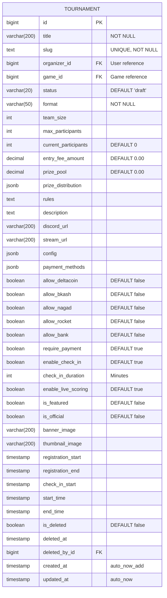

**Key Relationships:**
- `organizer_id` → `accounts.User.id` (Tournament creator)
- `game_id` → `tournament_engine_core_game.id` (Game being played)
- `deleted_by_id` → `accounts.User.id` (User who soft-deleted)

**Status Flow:**
```
DRAFT → PUBLISHED → REGISTRATION_OPEN → REGISTRATION_CLOSED → 
CHECK_IN → LIVE → COMPLETED → CONCLUDED → ARCHIVED
```

**Indexes:**
```sql
CREATE INDEX idx_tournament_status ON tournament_engine_core_tournament(status);
CREATE INDEX idx_tournament_game_id ON tournament_engine_core_tournament(game_id);
CREATE INDEX idx_tournament_organizer_id ON tournament_engine_core_tournament(organizer_id);
CREATE INDEX idx_tournament_start_time ON tournament_engine_core_tournament(start_time);
CREATE INDEX idx_tournament_is_deleted ON tournament_engine_core_tournament(is_deleted);
CREATE INDEX idx_tournament_slug ON tournament_engine_core_tournament(slug);
CREATE INDEX idx_tournament_featured ON tournament_engine_core_tournament(is_featured, start_time) 
    WHERE is_featured = true AND is_deleted = false;
CREATE INDEX idx_tournament_config_gin ON tournament_engine_core_tournament USING GIN(config);
```

---

### 3.2 Game Model

**Purpose:** Define supported games with team structure

**Table:** `tournament_engine_core_game`

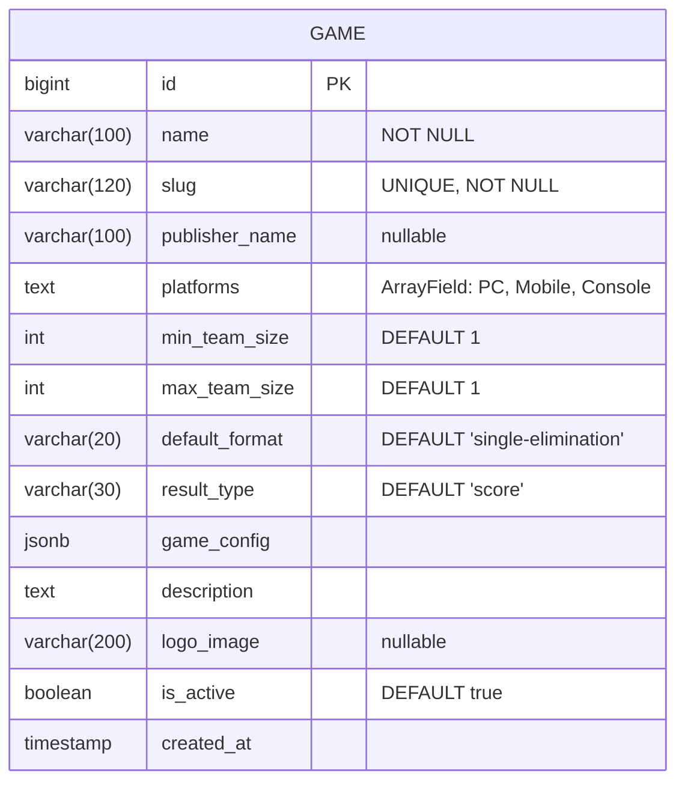

**platforms Values:**
- `PC` - Windows/Mac/Linux desktop
- `Mobile` - iOS/Android
- `Console` - PlayStation/Xbox/Nintendo Switch

**Sample Data:**
```sql
INSERT INTO tournament_engine_core_game (name, slug, publisher_name, platforms, min_team_size, max_team_size, result_type, is_active) VALUES
('Valorant', 'valorant', 'Riot Games', ARRAY['PC'], 5, 5, 'score', true),
('eFootball', 'efootball', 'Konami', ARRAY['PC', 'Mobile', 'Console'], 1, 1, 'score', true),
('PUBG Mobile', 'pubg-mobile', 'Krafton', ARRAY['Mobile'], 4, 4, 'placement', true),
('Free Fire', 'free-fire', 'Garena', ARRAY['Mobile'], 4, 4, 'placement', true),
('Mobile Legends', 'mobile-legends', 'Moonton', ARRAY['Mobile'], 5, 5, 'score', true),
('CS2', 'cs2', 'Valve', ARRAY['PC'], 5, 5, 'score', true),
('Dota 2', 'dota-2', 'Valve', ARRAY['PC'], 5, 5, 'score', true),
('EA Sports FC', 'ea-sports-fc', 'Electronic Arts', ARRAY['PC', 'Console'], 1, 1, 'score', true);
```

**Future Segmentation Use Cases:**
- Filter tournaments by platform (mobile-only, PC-only, cross-platform)
- Publisher partnerships and sponsored tournaments
- Platform-specific prize pools
- Mobile vs PC analytics comparison

**Indexes:**
```sql
CREATE INDEX idx_game_slug ON tournament_engine_core_game(slug);
```

---

### 3.3 CustomField Model

**Purpose:** Dynamic tournament-specific fields

**Table:** `tournament_engine_core_customfield`

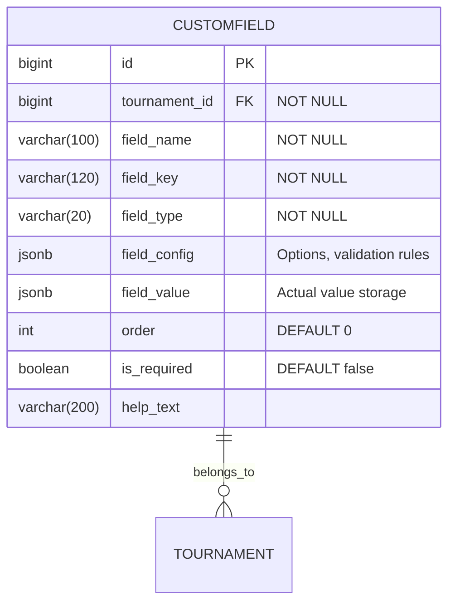

**Field Types:**
- `text` - Single-line text input
- `number` - Numeric input
- `media` - File upload
- `toggle` - Yes/No checkbox
- `date` - Date picker
- `url` - URL input
- `dropdown` - Select from options

**Example field_config:**
```json
{
    "min_length": 5,
    "max_length": 100,
    "allowed_extensions": ["jpg", "png"],
    "options": ["Option 1", "Option 2"],
    "max_file_size": 5242880
}
```

**Indexes:**
```sql
CREATE INDEX idx_customfield_tournament_id ON tournament_engine_core_customfield(tournament_id);
CREATE UNIQUE INDEX idx_customfield_unique_key 
    ON tournament_engine_core_customfield(tournament_id, field_key);
CREATE INDEX idx_customfield_order ON tournament_engine_core_customfield(tournament_id, order);
```

---

### 3.3.1 CustomFieldValue Model (Normalized Values)

**Purpose:** Separate storage for custom field values (for multi-participant use cases)

**Table:** `tournament_engine_core_customfieldvalue`

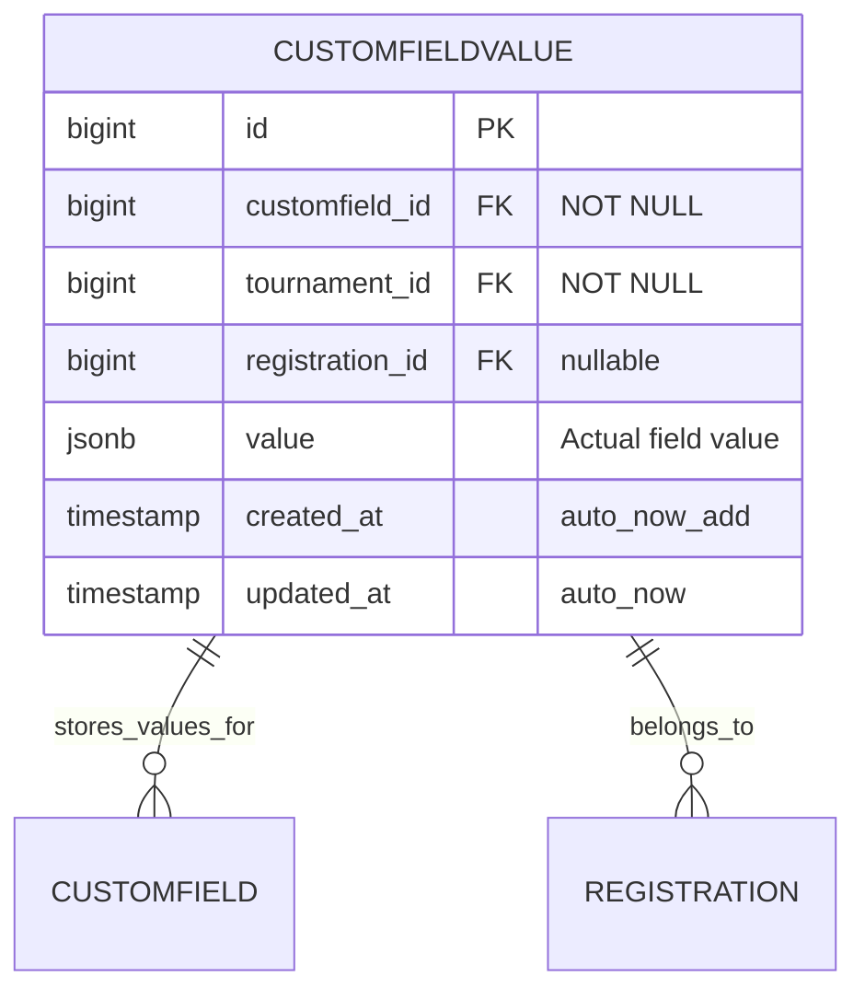

**Design Rationale:**
- **Current Design:** `CustomField.field_value` stores value directly (works for tournament-level fields)
- **Normalized Design:** Separate table for participant-specific values (registration-level fields)

**Use Cases:**
- Registration forms with custom questions per participant
- Multiple teams providing different values for same field
- Historical tracking of field value changes
- Querying across participants by custom field values

**Migration Strategy:**
```python
# Phase 1: Tournament-level custom fields use CustomField.field_value
# Example: "Banner submission deadline", "Discord server URL"

# Phase 2: Registration-level custom fields use CustomFieldValue
# Example: "Team jersey size", "Player pronouns", "Dietary restrictions"

class CustomField(models.Model):
    # ... existing fields ...
    scope = models.CharField(
        max_length=20,
        choices=[('tournament', 'Tournament'), ('registration', 'Registration')],
        default='tournament'
    )
```

**Indexes:**
```sql
CREATE INDEX idx_customfieldvalue_field_id ON tournament_engine_core_customfieldvalue(customfield_id);
CREATE INDEX idx_customfieldvalue_tournament_id ON tournament_engine_core_customfieldvalue(tournament_id);
CREATE INDEX idx_customfieldvalue_registration_id ON tournament_engine_core_customfieldvalue(registration_id);
CREATE UNIQUE INDEX idx_customfieldvalue_unique 
    ON tournament_engine_core_customfieldvalue(customfield_id, registration_id) 
    WHERE registration_id IS NOT NULL;
CREATE INDEX idx_customfieldvalue_value_gin ON tournament_engine_core_customfieldvalue USING GIN(value);
```

**Query Example:**
```sql
-- Find all registrations where "jersey_size" = "XL"
SELECT r.id, r.registration_data->>'display_name' as player_name
FROM tournament_engine_registration_registration r
JOIN tournament_engine_core_customfieldvalue cfv ON cfv.registration_id = r.id
JOIN tournament_engine_core_customfield cf ON cf.id = cfv.customfield_id
WHERE cf.field_key = 'jersey_size'
    AND cfv.value->>'text' = 'XL'
    AND r.tournament_id = ?;
```

---

### 3.4 TournamentVersion Model

**Purpose:** Configuration version control and rollback

**Table:** `tournament_engine_core_tournamentversion`

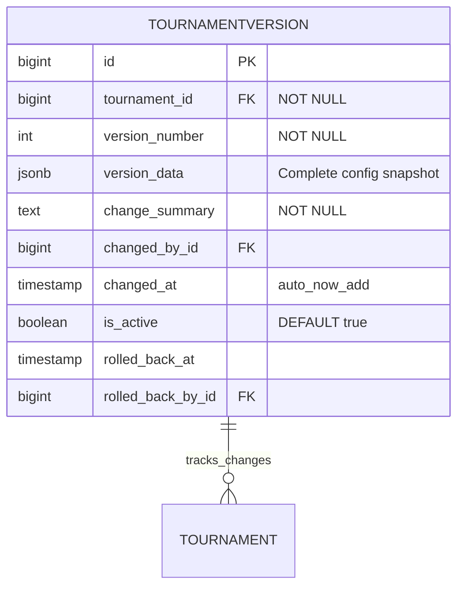

**version_data Structure:**
```json
{
    "title": "Tournament Name",
    "format": "single-elimination",
    "team_size": 5,
    "max_participants": 16,
    "entry_fee_amount": "500.00",
    "prize_pool": "5000.00",
    "rules": "Tournament rules text",
    "config": {},
    "payment_methods": ["bkash", "nagad"],
    "registration_start": "2025-11-10T00:00:00Z",
    "registration_end": "2025-11-15T00:00:00Z",
    "start_time": "2025-11-16T18:00:00Z"
}
```

**Indexes:**
```sql
CREATE INDEX idx_version_tournament_id ON tournament_engine_core_tournamentversion(tournament_id);
CREATE INDEX idx_version_number ON tournament_engine_core_tournamentversion(tournament_id, version_number DESC);
CREATE UNIQUE INDEX idx_version_unique 
    ON tournament_engine_core_tournamentversion(tournament_id, version_number);
CREATE INDEX idx_version_changed_at ON tournament_engine_core_tournamentversion(changed_at);
```

**Version Trigger Strategy:**
- Create version on tournament status change (DRAFT → PUBLISHED)
- Create version on critical field changes (max_participants, entry_fee_amount, rules)
- Create version before bracket generation
- Manual version creation by organizer

**Automatic Version Snapshot Implementation:**

**Option 1: Django Signal (Recommended)**

```python
# tournament_engine/core/signals.py

from django.db.models.signals import pre_save
from django.dispatch import receiver
from tournament_engine.core.models import Tournament, TournamentVersion

# Fields that trigger version creation
VERSION_TRIGGER_FIELDS = {
    'status', 'max_participants', 'entry_fee_amount', 'prize_pool',
    'rules', 'format', 'team_size', 'payment_methods',
    'registration_start', 'registration_end', 'start_time'
}

@receiver(pre_save, sender=Tournament)
def auto_create_version_on_change(sender, instance, **kwargs):
    """Auto-create version when critical fields change"""
    
    if instance.pk:  # Only for updates, not new tournaments
        try:
            old_instance = Tournament.objects.get(pk=instance.pk)
            
            # Check if any trigger field changed
            changed_fields = []
            for field in VERSION_TRIGGER_FIELDS:
                old_value = getattr(old_instance, field)
                new_value = getattr(instance, field)
                if old_value != new_value:
                    changed_fields.append(field)
            
            if changed_fields:
                # Get latest version number
                latest_version = TournamentVersion.objects.filter(
                    tournament=instance
                ).order_by('-version_number').first()
                
                new_version_number = (latest_version.version_number + 1) if latest_version else 1
                
                # Create version snapshot
                version_data = {
                    'title': instance.title,
                    'format': instance.format,
                    'team_size': instance.team_size,
                    'max_participants': instance.max_participants,
                    'entry_fee_amount': str(instance.entry_fee_amount),
                    'prize_pool': str(instance.prize_pool),
                    'rules': instance.rules,
                    'config': instance.config,
                    'payment_methods': instance.payment_methods,
                    'status': instance.status,
                    # ... other critical fields
                }
                
                TournamentVersion.objects.create(
                    tournament=instance,
                    version_number=new_version_number,
                    version_data=version_data,
                    change_summary=f"Auto-snapshot: Changed {', '.join(changed_fields)}",
                    changed_by=getattr(instance, '_changed_by', None)
                )
        
        except Tournament.DoesNotExist:
            pass

# Register signal in apps.py
class CoreConfig(AppConfig):
    name = 'tournament_engine.core'
    
    def ready(self):
        import tournament_engine.core.signals  # noqa
```

**Option 2: Database Trigger (PostgreSQL)**

```sql
-- Function to create version snapshot
CREATE OR REPLACE FUNCTION create_tournament_version_snapshot()
RETURNS TRIGGER AS $$
BEGIN
    -- Only on UPDATE, not INSERT
    IF TG_OP = 'UPDATE' THEN
        -- Check if critical fields changed
        IF (OLD.status != NEW.status OR
            OLD.max_participants != NEW.max_participants OR
            OLD.entry_fee_amount != NEW.entry_fee_amount OR
            OLD.prize_pool != NEW.prize_pool OR
            OLD.rules != NEW.rules) THEN
            
            -- Insert new version
            INSERT INTO tournament_engine_core_tournamentversion (
                tournament_id,
                version_number,
                version_data,
                change_summary,
                changed_at,
                is_active
            )
            SELECT 
                NEW.id,
                COALESCE(MAX(version_number), 0) + 1,
                jsonb_build_object(
                    'title', NEW.title,
                    'format', NEW.format,
                    'max_participants', NEW.max_participants,
                    'entry_fee_amount', NEW.entry_fee_amount,
                    'prize_pool', NEW.prize_pool,
                    'status', NEW.status
                ),
                'Auto-snapshot on critical field change',
                NOW(),
                true
            FROM tournament_engine_core_tournamentversion
            WHERE tournament_id = NEW.id;
        END IF;
    END IF;
    
    RETURN NEW;
END;
$$ LANGUAGE plpgsql;

-- Create trigger
CREATE TRIGGER tournament_version_auto_snapshot
    AFTER UPDATE ON tournament_engine_core_tournament
    FOR EACH ROW
    EXECUTE FUNCTION create_tournament_version_snapshot();
```

**Usage in Views:**

```python
# Set user context for version tracking
def update_tournament(request, tournament_id):
    tournament = get_object_or_404(Tournament, id=tournament_id)
    
    if request.method == 'POST':
        # Set changed_by for signal
        tournament._changed_by = request.user
        
        # Update fields
        tournament.max_participants = request.POST.get('max_participants')
        tournament.save()  # Signal auto-creates version
        
        return redirect('tournament:detail', tournament_id)
```

---

## 4. Registration & Payment Models

### 4.1 Registration Model

**Purpose:** Track participant registrations for tournaments

**Table:** `tournament_engine_registration_registration`

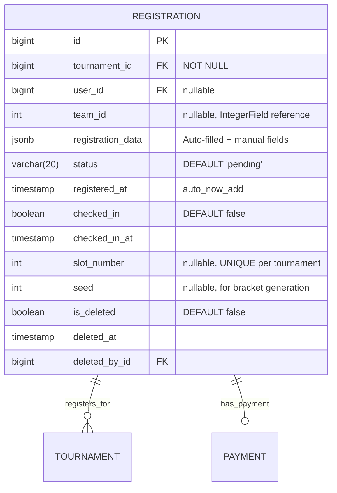

**Status Values:**
- `pending` - Registration submitted, awaiting payment
- `payment_submitted` - Payment proof uploaded
- `confirmed` - Payment verified, registration confirmed
- `rejected` - Payment rejected or registration denied
- `cancelled` - User cancelled registration
- `no_show` - Failed to check in

**registration_data Structure:**
```json
{
    "participant_type": "solo|team",
    "display_name": "Player Name",
    "game_ids": {
        "valorant_id": "PlayerName#TAG",
        "efootball_id": "123456789",
        "pubg_mobile_id": "PlayerID"
    },
    "contact": {
        "phone": "+8801712345678",
        "discord": "username#1234"
    },
    "custom_fields": {
        "custom_field_key_1": "value1",
        "custom_field_key_2": "value2"
    },
    "team_info": {
        "team_id": 42,
        "team_name": "Team Alpha",
        "roster": [123, 456, 789]
    }
}
```

**Indexes:**
```sql
CREATE INDEX idx_registration_tournament_id ON tournament_engine_registration_registration(tournament_id);
CREATE INDEX idx_registration_user_id ON tournament_engine_registration_registration(user_id);
CREATE INDEX idx_registration_team_id ON tournament_engine_registration_registration(team_id);
CREATE INDEX idx_registration_status ON tournament_engine_registration_registration(status);
CREATE INDEX idx_registration_registered_at ON tournament_engine_registration_registration(registered_at);
CREATE UNIQUE INDEX idx_registration_slot_unique 
    ON tournament_engine_registration_registration(tournament_id, slot_number) 
    WHERE slot_number IS NOT NULL;
CREATE UNIQUE INDEX idx_registration_user_tournament 
    ON tournament_engine_registration_registration(tournament_id, user_id) 
    WHERE user_id IS NOT NULL AND is_deleted = false;
CREATE UNIQUE INDEX idx_registration_team_tournament 
    ON tournament_engine_registration_registration(tournament_id, team_id) 
    WHERE team_id IS NOT NULL AND is_deleted = false;
CREATE INDEX idx_registration_data_gin ON tournament_engine_registration_registration USING GIN(registration_data);
```

**Constraints:**
```sql
-- Either user_id or team_id must be set, not both
ALTER TABLE tournament_engine_registration_registration 
    ADD CONSTRAINT chk_registration_participant 
    CHECK (
        (user_id IS NOT NULL AND team_id IS NULL) OR 
        (user_id IS NULL AND team_id IS NOT NULL)
    );

-- Status must be valid
ALTER TABLE tournament_engine_registration_registration 
    ADD CONSTRAINT chk_registration_status 
    CHECK (status IN ('pending', 'payment_submitted', 'confirmed', 'rejected', 'cancelled', 'no_show'));
```

---

### 4.2 Payment Model

**Purpose:** Track payment proof submissions and verification

**Table:** `tournament_engine_registration_payment`

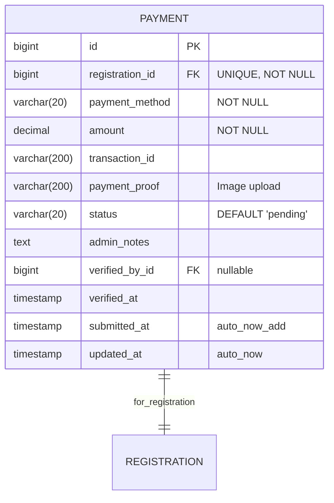

**Payment Methods:**
- `bkash` - bKash mobile banking
- `nagad` - Nagad mobile banking
- `rocket` - Rocket mobile banking
- `bank` - Bank transfer
- `deltacoin` - DeltaCoin (virtual currency)

**Status Values:**
- `pending` - Awaiting proof submission
- `submitted` - Proof uploaded, awaiting verification
- `verified` - Payment confirmed by organizer
- `rejected` - Payment proof rejected
- `refunded` - Payment refunded to user

**Indexes:**
```sql
CREATE UNIQUE INDEX idx_payment_registration_id ON tournament_engine_registration_payment(registration_id);
CREATE INDEX idx_payment_method ON tournament_engine_registration_payment(payment_method);
CREATE INDEX idx_payment_status ON tournament_engine_registration_payment(status);
CREATE INDEX idx_payment_submitted_at ON tournament_engine_registration_payment(submitted_at);
CREATE INDEX idx_payment_verified_by_id ON tournament_engine_registration_payment(verified_by_id);
```

**Constraints:**
```sql
-- Amount must be positive
ALTER TABLE tournament_engine_registration_payment 
    ADD CONSTRAINT chk_payment_amount_positive 
    CHECK (amount > 0);

-- Payment method must be valid
ALTER TABLE tournament_engine_registration_payment 
    ADD CONSTRAINT chk_payment_method_valid 
    CHECK (payment_method IN ('bkash', 'nagad', 'rocket', 'bank', 'deltacoin'));

-- Status must be valid
ALTER TABLE tournament_engine_registration_payment 
    ADD CONSTRAINT chk_payment_status_valid 
    CHECK (status IN ('pending', 'submitted', 'verified', 'rejected', 'refunded'));

-- If verified, must have verified_by and verified_at
ALTER TABLE tournament_engine_registration_payment 
    ADD CONSTRAINT chk_payment_verification 
    CHECK (
        (status = 'verified' AND verified_by_id IS NOT NULL AND verified_at IS NOT NULL) OR
        (status != 'verified')
    );
```

**Payment Workflow:**
1. User registers → Registration created with status='pending'
2. User uploads payment proof → Payment created with status='submitted'
3. Organizer reviews → Payment status='verified' or 'rejected'
4. If verified → Registration status='confirmed'
5. If rejected → Registration remains 'pending', user can resubmit

---

### 4.3 PaymentTransaction Model (Audit Trail)

**Purpose:** Historical tracking of payment status changes for fraud analysis and chargebacks

**Table:** `tournament_engine_registration_paymenttransaction`

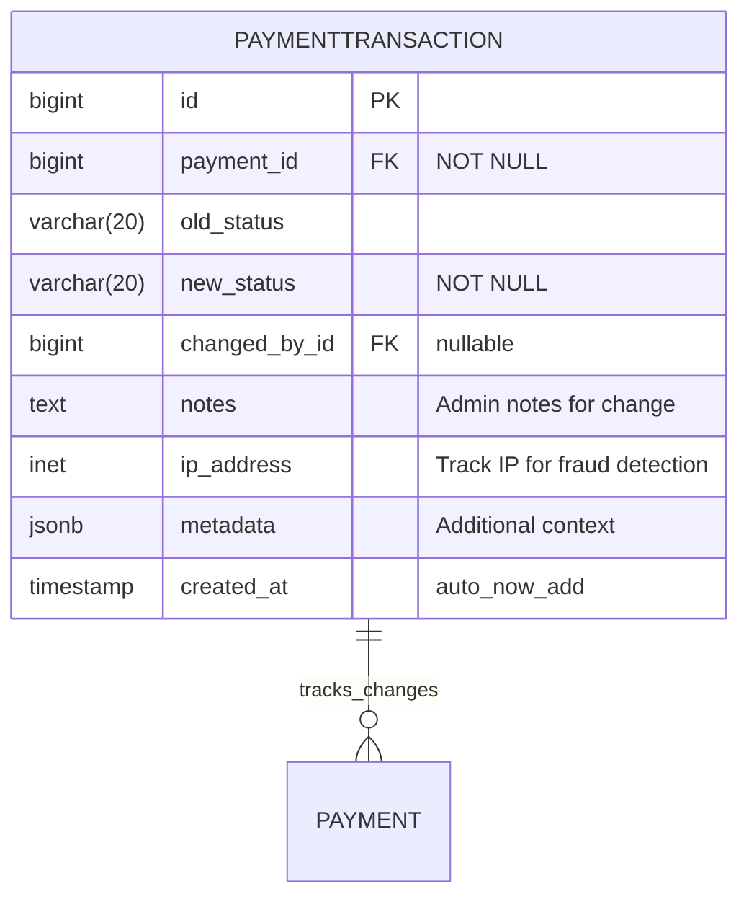

**Use Cases:**
- **Fraud Detection:** Track suspicious payment patterns (multiple rejections, IP changes)
- **Chargeback Defense:** Provide evidence of verification process
- **Organizer Accountability:** Audit trail of who verified/rejected payments
- **Dispute Resolution:** Historical context for payment disputes

**Metadata Examples:**
```json
{
    "rejection_reason": "Screenshot unclear",
    "verification_method": "manual",
    "transaction_match": true,
    "flagged_for_review": false,
    "previous_rejection_count": 2
}
```

**Indexes:**
```sql
CREATE INDEX idx_paymenttransaction_payment_id ON tournament_engine_registration_paymenttransaction(payment_id);
CREATE INDEX idx_paymenttransaction_created_at ON tournament_engine_registration_paymenttransaction(created_at);
CREATE INDEX idx_paymenttransaction_changed_by ON tournament_engine_registration_paymenttransaction(changed_by_id);
CREATE INDEX idx_paymenttransaction_status ON tournament_engine_registration_paymenttransaction(new_status, created_at);
```

**Trigger for Auto-Creation:**
```python
# In Payment model
from django.db.models.signals import post_save
from django.dispatch import receiver

@receiver(post_save, sender=Payment)
def create_payment_transaction(sender, instance, created, **kwargs):
    """Auto-create transaction record on payment status change"""
    if not created:  # Only on updates
        # Check if status changed
        old_instance = Payment.objects.get(pk=instance.pk)
        if old_instance.status != instance.status:
            PaymentTransaction.objects.create(
                payment=instance,
                old_status=old_instance.status,
                new_status=instance.status,
                changed_by_id=getattr(instance, '_changed_by_id', None),
                notes=getattr(instance, '_status_change_notes', ''),
                ip_address=getattr(instance, '_request_ip', None)
            )
```

---

## 5. Bracket Structure Models

### 5.1 Bracket Model

**Purpose:** Container for tournament bracket structure

**Table:** `tournament_engine_bracket_bracket`

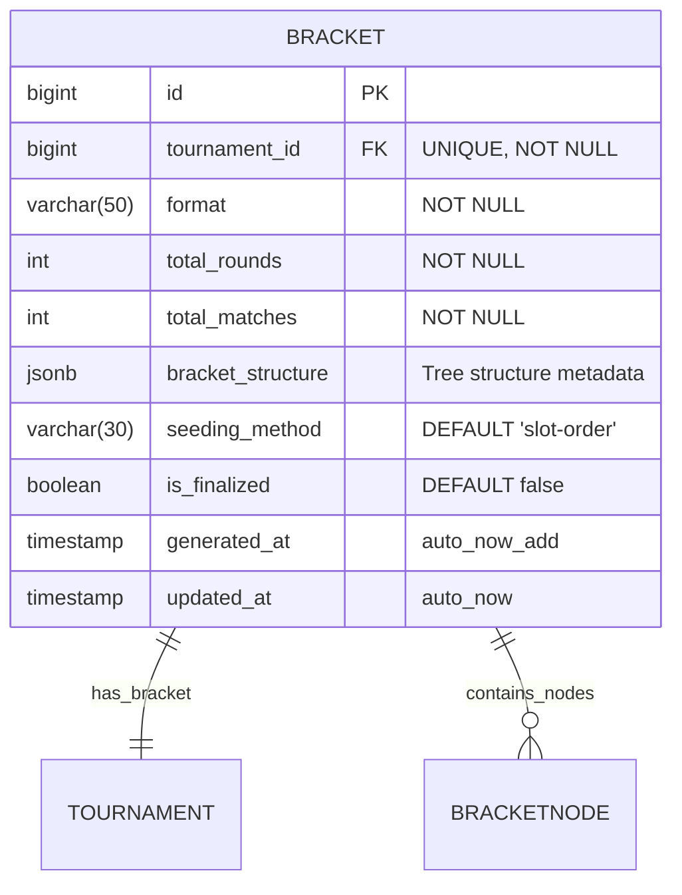

**Format Values:**
- `single-elimination` - Single elimination bracket
- `double-elimination` - Double elimination with winners/losers brackets
- `round-robin` - All participants play each other
- `swiss` - Swiss system pairing
- `group-stage` - Group stage with knockout

**Seeding Methods:**
- `slot-order` - First-come-first-served (registration order)
- `random` - Random seeding
- `ranked` - Based on team rankings from apps.teams
- `manual` - Organizer manually assigns seeds

**bracket_structure Example (Single Elimination, 8 participants):**
```json
{
    "format": "single-elimination",
    "total_participants": 8,
    "rounds": [
        {
            "round_number": 1,
            "round_name": "Quarter Finals",
            "matches": 4
        },
        {
            "round_number": 2,
            "round_name": "Semi Finals",
            "matches": 2
        },
        {
            "round_number": 3,
            "round_name": "Finals",
            "matches": 1
        }
    ],
    "third_place_match": true
}
```

**Indexes:**
```sql
CREATE UNIQUE INDEX idx_bracket_tournament_id ON tournament_engine_bracket_bracket(tournament_id);
CREATE INDEX idx_bracket_format ON tournament_engine_bracket_bracket(format);
CREATE INDEX idx_bracket_structure_gin ON tournament_engine_bracket_bracket USING GIN(bracket_structure);
```

---

### 5.2 BracketNode Model

**Purpose:** Individual bracket positions with navigation (double-linked list structure)

**Table:** `tournament_engine_bracket_bracketnode`

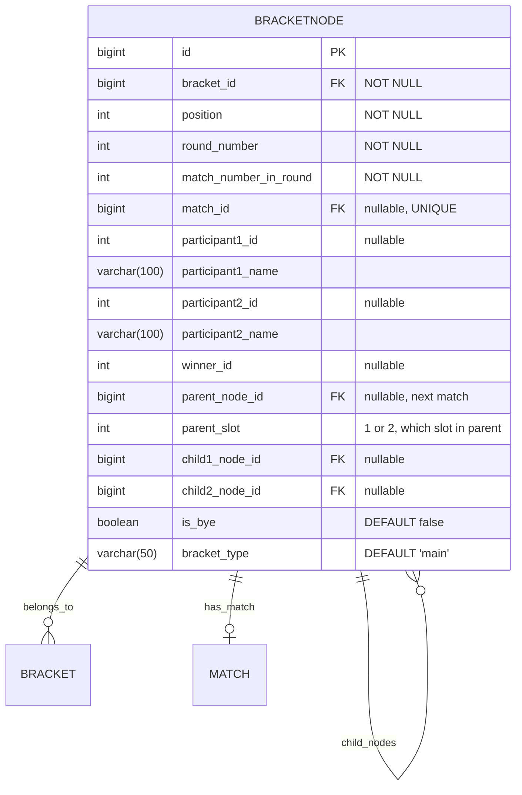

**Navigation Structure:**

```
Round 1 (QF)          Round 2 (SF)          Round 3 (F)
┌─────────┐
│ Node 1  │───┐
└─────────┘   │       ┌─────────┐
              ├──────>│ Node 5  │───┐
┌─────────┐   │       └─────────┘   │
│ Node 2  │───┘                      │       ┌─────────┐
└─────────┘                          ├──────>│ Node 7  │
                                     │       └─────────┘
┌─────────┐                          │
│ Node 3  │───┐       ┌─────────┐   │
└─────────┘   │       │ Node 6  │───┘
              ├──────>└─────────┘
┌─────────┐   │
│ Node 4  │───┘
└─────────┘

Node 1: child1_node=null, child2_node=null, parent_node=Node 5, parent_slot=1
Node 2: child1_node=null, child2_node=null, parent_node=Node 5, parent_slot=2
Node 5: child1_node=Node 1, child2_node=Node 2, parent_node=Node 7, parent_slot=1
```

**bracket_type Values:**
- `main` - Main bracket (winners bracket in double elim)
- `losers` - Losers bracket (double elimination)
- `third-place` - Third place playoff match
- `group-<n>` - Group stage matches

**Indexes:**
```sql
CREATE INDEX idx_bracketnode_bracket_id ON tournament_engine_bracket_bracketnode(bracket_id);
CREATE INDEX idx_bracketnode_round ON tournament_engine_bracket_bracketnode(bracket_id, round_number);
CREATE INDEX idx_bracketnode_position ON tournament_engine_bracket_bracketnode(position);
CREATE UNIQUE INDEX idx_bracketnode_match_id ON tournament_engine_bracket_bracketnode(match_id) 
    WHERE match_id IS NOT NULL;
CREATE INDEX idx_bracketnode_parent ON tournament_engine_bracket_bracketnode(parent_node_id);
CREATE INDEX idx_bracketnode_children ON tournament_engine_bracket_bracketnode(bracket_id, child1_node_id, child2_node_id);
CREATE INDEX idx_bracketnode_participants ON tournament_engine_bracket_bracketnode(participant1_id, participant2_id);
CREATE UNIQUE INDEX idx_bracketnode_unique_position 
    ON tournament_engine_bracket_bracketnode(bracket_id, position);
```

**Constraints:**
```sql
-- Round number must be positive
ALTER TABLE tournament_engine_bracket_bracketnode 
    ADD CONSTRAINT chk_bracketnode_round_positive 
    CHECK (round_number > 0);

-- Match number in round must be positive
ALTER TABLE tournament_engine_bracket_bracketnode 
    ADD CONSTRAINT chk_bracketnode_match_number_positive 
    CHECK (match_number_in_round > 0);

-- Parent slot must be 1 or 2
ALTER TABLE tournament_engine_bracket_bracketnode 
    ADD CONSTRAINT chk_bracketnode_parent_slot 
    CHECK (parent_slot IN (1, 2) OR parent_slot IS NULL);

-- Bracket type must be valid
ALTER TABLE tournament_engine_bracket_bracketnode 
    ADD CONSTRAINT chk_bracketnode_bracket_type 
    CHECK (bracket_type SIMILAR TO '(main|losers|third-place|group-[0-9]+)');
```

**Bracket Generation Algorithm:**

1. **Calculate Structure:**
   - Determine rounds needed: `ceil(log2(participants))`
   - Calculate matches per round
   - Identify bye matches

2. **Create Nodes:**
   - Generate all bracket nodes from bottom to top
   - Assign positions sequentially
   - Set parent/child relationships

3. **Seed Participants:**
   - Apply seeding method (slot-order, random, ranked)
   - Place participants in Round 1 nodes
   - Mark bye matches

4. **Create Matches:**
   - Create Match records for all nodes
   - Link matches to nodes via match_id
   - Set initial match state (SCHEDULED or READY)

---

## 6. Match Lifecycle Models

### 6.1 Match Model

**Purpose:** Manage match lifecycle with state machine

**Table:** `tournament_engine_match_match`

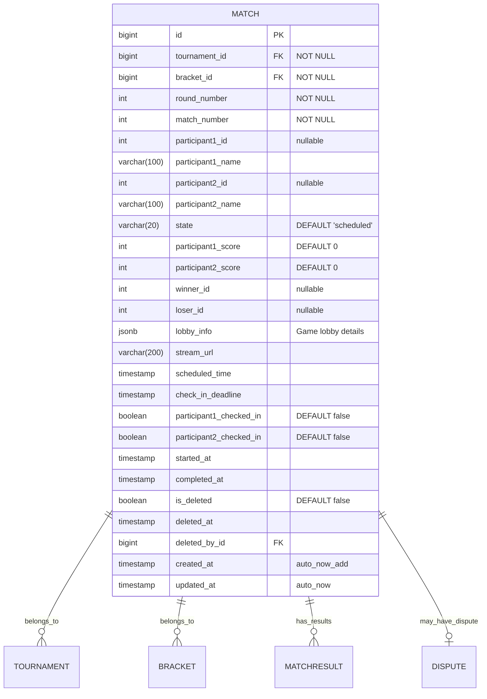

**State Machine:**

```
SCHEDULED ──> CHECK_IN ──> READY ──> LIVE ──> PENDING_RESULT ──> COMPLETED
                 │                                    │
                 │                                    └──> DISPUTED
                 │
                 └──> FORFEIT (if check-in failed)
```

**State Descriptions:**
- `SCHEDULED` - Match scheduled, waiting for check-in window
- `CHECK_IN` - Check-in window open
- `READY` - Both participants checked in, ready to start
- `LIVE` - Match in progress
- `PENDING_RESULT` - Match finished, awaiting result submission/confirmation
- `COMPLETED` - Result confirmed, winner determined
- `DISPUTED` - Result disputed by participant
- `FORFEIT` - One or both participants failed to check in
- `CANCELLED` - Match cancelled by organizer

**lobby_info Structure:**
```json
{
    "game_mode": "Competitive",
    "map": "Haven",
    "server": "Singapore",
    "lobby_code": "ABC123",
    "lobby_password": "secret123",
    "discord_channel": "https://discord.gg/...",
    "additional_instructions": "Best of 3"
}
```

**Indexes:**
```sql
CREATE INDEX idx_match_tournament_id ON tournament_engine_match_match(tournament_id);
CREATE INDEX idx_match_bracket_id ON tournament_engine_match_match(bracket_id);
CREATE INDEX idx_match_round ON tournament_engine_match_match(bracket_id, round_number);
CREATE INDEX idx_match_state ON tournament_engine_match_match(state);
CREATE INDEX idx_match_scheduled_time ON tournament_engine_match_match(scheduled_time);
CREATE INDEX idx_match_participants ON tournament_engine_match_match(participant1_id, participant2_id);
CREATE INDEX idx_match_winner ON tournament_engine_match_match(winner_id);
CREATE INDEX idx_match_check_in ON tournament_engine_match_match(check_in_deadline, state) 
    WHERE state = 'CHECK_IN';
CREATE INDEX idx_match_live ON tournament_engine_match_match(tournament_id, state) 
    WHERE state = 'LIVE';
CREATE INDEX idx_match_lobby_gin ON tournament_engine_match_match USING GIN(lobby_info);
```

**Constraints:**
```sql
-- State must be valid
ALTER TABLE tournament_engine_match_match 
    ADD CONSTRAINT chk_match_state_valid 
    CHECK (state IN ('SCHEDULED', 'CHECK_IN', 'READY', 'LIVE', 'PENDING_RESULT', 'COMPLETED', 'DISPUTED', 'FORFEIT', 'CANCELLED'));

-- Scores must be non-negative
ALTER TABLE tournament_engine_match_match 
    ADD CONSTRAINT chk_match_scores_positive 
    CHECK (participant1_score >= 0 AND participant2_score >= 0);

-- If completed, must have winner
ALTER TABLE tournament_engine_match_match 
    ADD CONSTRAINT chk_match_completed_has_winner 
    CHECK (
        (state = 'COMPLETED' AND winner_id IS NOT NULL AND loser_id IS NOT NULL) OR
        (state != 'COMPLETED')
    );

-- Winner must be one of the participants
ALTER TABLE tournament_engine_match_match 
    ADD CONSTRAINT chk_match_winner_is_participant 
    CHECK (
        winner_id IS NULL OR 
        winner_id = participant1_id OR 
        winner_id = participant2_id
    );

-- Round and match numbers must be positive
ALTER TABLE tournament_engine_match_match 
    ADD CONSTRAINT chk_match_numbers_positive 
    CHECK (round_number > 0 AND match_number > 0);
```

---

### 6.2 MatchResult Model

**Purpose:** Track score submissions from participants (before confirmation)

**Table:** `tournament_engine_match_matchresult`

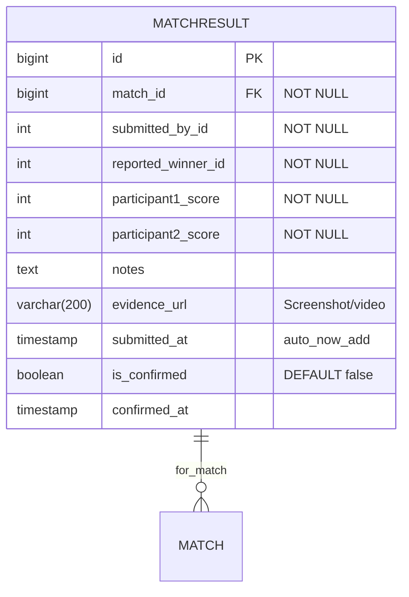

**Result Submission Flow:**

1. **Single Submission (No Dispute):**
   - Participant A submits result → MatchResult created
   - If opponent doesn't contest within timeout (e.g., 15 minutes) → Auto-confirm
   - Match state: PENDING_RESULT → COMPLETED

2. **Matching Submissions (Agreement):**
   - Participant A submits result → MatchResult A created
   - Participant B submits matching result → MatchResult B created
   - Both results match → Auto-confirm both, Match COMPLETED

3. **Conflicting Submissions (Dispute):**
   - Participant A submits result → MatchResult A
   - Participant B submits different result → MatchResult B (conflict detected)
   - Match state: PENDING_RESULT → DISPUTED
   - Dispute record created for organizer review

**Indexes:**
```sql
CREATE INDEX idx_matchresult_match_id ON tournament_engine_match_matchresult(match_id);
CREATE INDEX idx_matchresult_submitted_by ON tournament_engine_match_matchresult(submitted_by_id);
CREATE INDEX idx_matchresult_submitted_at ON tournament_engine_match_matchresult(submitted_at);
CREATE INDEX idx_matchresult_pending ON tournament_engine_match_matchresult(match_id, is_confirmed) 
    WHERE is_confirmed = false;
```

**Constraints:**
```sql
-- Scores must be non-negative
ALTER TABLE tournament_engine_match_matchresult 
    ADD CONSTRAINT chk_matchresult_scores_positive 
    CHECK (participant1_score >= 0 AND participant2_score >= 0);

-- Winner must have higher or equal score (for score-based games)
-- This is enforced at application level due to different result types
```

---

**Navigation:**
- [← Previous: Part 2.3 - Real-Time & Security](PART_2.3_REALTIME_SECURITY.md)
- [↑ Master Index](INDEX_MASTER_NAVIGATION.md)
- [→ Next: Part 3.2 - Supporting Models & Schema](PART_3.2_SUPPORTING_MODELS_SCHEMA.md)

---

**END OF PART 3.1**
