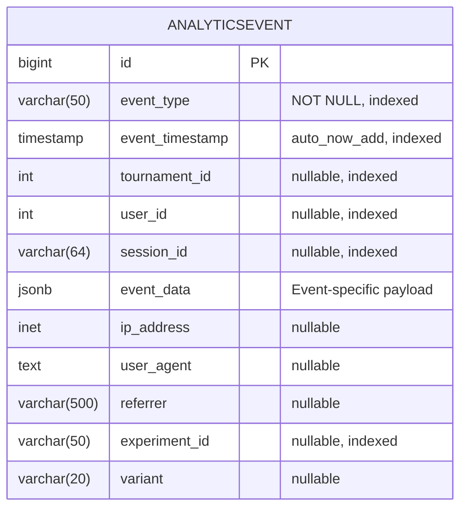

# PART 3.2: Database Design & ERD - Supporting Models, Indexes, and Migration Strategy

**Navigation:**  
← [Previous: PART_3.1_DATABASE_DESIGN_ERD.md](PART_3.1_DATABASE_DESIGN_ERD.md) | [Next: PART_4.1 (UI/UX Design - Coming Soon)](PART_4.1_UI_UX_DESIGN_SPECIFICATIONS.md) →

**Contents:** Supporting Models (Dispute, Certificate, AnalyticsEvent), Complete System ERD, Index Strategy, Data Integrity & Constraints, Migration Strategy

---

*This is Part 3.2 of the Database Design & ERD documentation (Lines 1402-2457 from PROPOSAL_PART_3_DATABASE_DESIGN_ERD.md)*

---

### 7.1 Certificate Model (Continued)

**Use Cases:**

- Post-tournament winner recognition
- LinkedIn-sharable achievements
- Home page "Hall of Fame" section
- Sponsorship showcases
- Home page featured winners section
- Email marketing with winner spotlights
- Profile badges for featured winners

**certificate_id Format:**
- `DC-TOUR-{tournament_id}-{placement}-{timestamp_hash}`
- Example: `DC-TOUR-42-1-8F3A2B`

**metadata Structure:**
```json
{
    "tournament_name": "DeltaCrown Valorant Cup 2025",
    "game": "Valorant",
    "placement": 1,
    "placement_label": "Champion",
    "prize_amount": "5000 BDT",
    "organizer": "DeltaCrown Official",
    "participants_count": 16,
    "tournament_date": "2025-11-16",
    "recipient_name": "Team Alpha",
    "team_members": ["Player1", "Player2", "Player3", "Player4", "Player5"]
}
```

**Indexes:**
```sql
CREATE UNIQUE INDEX idx_certificate_certificate_id ON tournament_engine_awards_certificate(certificate_id);
CREATE INDEX idx_certificate_tournament_id ON tournament_engine_awards_certificate(tournament_id);
CREATE INDEX idx_certificate_recipient ON tournament_engine_awards_certificate(recipient_id, recipient_type);
CREATE INDEX idx_certificate_placement ON tournament_engine_awards_certificate(tournament_id, placement);
CREATE INDEX idx_certificate_issued_at ON tournament_engine_awards_certificate(issued_at);
CREATE INDEX idx_certificate_metadata_gin ON tournament_engine_awards_certificate USING GIN(metadata);
```

**Constraints:**
```sql
-- Placement must be positive
ALTER TABLE tournament_engine_awards_certificate 
    ADD CONSTRAINT chk_certificate_placement_positive 
    CHECK (placement > 0);

-- Recipient type must be valid
ALTER TABLE tournament_engine_awards_certificate 
    ADD CONSTRAINT chk_certificate_recipient_type 
    CHECK (recipient_type IN ('user', 'team'));

-- Certificate ID must match format
ALTER TABLE tournament_engine_awards_certificate 
    ADD CONSTRAINT chk_certificate_id_format 
    CHECK (certificate_id ~ '^DC-TOUR-[0-9]+-[0-9]+-[A-Z0-9]+$');
```

**QR Code Verification URL:**
```
https://deltacrown.com/verify/certificate/{certificate_id}
```

---

### 7.3 AnalyticsEvent Model

**Purpose:** Fine-grained event tracking for ML/analytics

**Table:** `tournament_engine_analytics_analyticsevent`



**Event Types (20+ tracked):**

**User Behavior:**
- `tournament_viewed` - User viewed tournament detail page
- `tournament_registered` - User completed registration
- `registration_abandoned` - Started but didn't complete
- `payment_submitted` - Payment proof uploaded
- `payment_verified` - Payment confirmed

**Engagement:**
- `match_watched` - User watched live match
- `bracket_explored` - User interacted with bracket
- `comment_posted` - User posted in discussion
- `tournament_shared` - Shared tournament link

**Conversion:**
- `registration_started` - Clicked register button
- `payment_page_viewed` - Viewed payment instructions
- `certificate_downloaded` - Downloaded certificate

**Retention:**
- `return_visit` - User returned to tournament
- `notification_clicked` - Clicked notification link

**event_data Examples:**

```json
// tournament_viewed
{
    "tournament_status": "LIVE",
    "participants_count": 14,
    "time_to_start_seconds": 3600,
    "user_has_registered": false,
    "referrer_source": "discord"
}

// registration_abandoned
{
    "abandon_step": "payment_upload",
    "time_spent_seconds": 120,
    "fields_completed": 8,
    "total_fields": 10
}

// match_watched
{
    "match_id": 42,
    "round_number": 3,
    "watch_duration_seconds": 1800,
    "interaction_count": 5
}
```

**Indexes:**
```sql
CREATE INDEX idx_analytics_event_type ON tournament_engine_analytics_analyticsevent(event_type);
CREATE INDEX idx_analytics_timestamp ON tournament_engine_analytics_analyticsevent(event_timestamp);
CREATE INDEX idx_analytics_tournament_id ON tournament_engine_analytics_analyticsevent(tournament_id);
CREATE INDEX idx_analytics_user_id ON tournament_engine_analytics_analyticsevent(user_id);
CREATE INDEX idx_analytics_session_id ON tournament_engine_analytics_analyticsevent(session_id);
CREATE INDEX idx_analytics_experiment ON tournament_engine_analytics_analyticsevent(experiment_id, variant);
CREATE INDEX idx_analytics_event_tournament ON tournament_engine_analytics_analyticsevent(event_type, tournament_id, event_timestamp);
CREATE INDEX idx_analytics_user_timeline ON tournament_engine_analytics_analyticsevent(user_id, event_timestamp);
CREATE INDEX idx_analytics_data_gin ON tournament_engine_analytics_analyticsevent USING GIN(event_data);
```

**Partitioning Strategy (For Production):**

```sql
-- Partition by month for efficient querying and archival
CREATE TABLE tournament_engine_analytics_analyticsevent (
    -- columns as defined above
) PARTITION BY RANGE (event_timestamp);

-- Create monthly partitions
CREATE TABLE analyticsevent_2025_11 PARTITION OF tournament_engine_analytics_analyticsevent
    FOR VALUES FROM ('2025-11-01') TO ('2025-12-01');

CREATE TABLE analyticsevent_2025_12 PARTITION OF tournament_engine_analytics_analyticsevent
    FOR VALUES FROM ('2025-12-01') TO ('2026-01-01');
```

**Retention Policy:**

```sql
-- Archive partitions older than 12 months to warehouse schema
-- Cron job runs monthly on 1st day of month

-- 1. Create archive schema
CREATE SCHEMA IF NOT EXISTS analytics_archive;

-- 2. Move old partition to archive
ALTER TABLE tournament_engine_analytics_analyticsevent 
    DETACH PARTITION analyticsevent_2024_11;

ALTER TABLE analyticsevent_2024_11 
    SET SCHEMA analytics_archive;

-- 3. Export to data warehouse (CSV or Parquet)
COPY analytics_archive.analyticsevent_2024_11 
    TO '/var/lib/postgresql/exports/analyticsevent_2024_11.csv' 
    WITH (FORMAT CSV, HEADER);

-- 4. Optional: Drop partition after successful export
DROP TABLE IF EXISTS analytics_archive.analyticsevent_2024_11;
```

**Automated Partition Creation:**

```python
# tournament_engine/analytics/management/commands/create_analytics_partition.py

from django.core.management.base import BaseCommand
from django.db import connection
from datetime import datetime, timedelta

class Command(BaseCommand):
    help = 'Create analytics event partition for next month'
    
    def handle(self, *args, **kwargs):
        # Get next month
        next_month = datetime.now() + timedelta(days=32)
        next_month = next_month.replace(day=1)
        month_after = (next_month + timedelta(days=32)).replace(day=1)
        
        table_name = f"analyticsevent_{next_month.strftime('%Y_%m')}"
        
        with connection.cursor() as cursor:
            cursor.execute(f"""
                CREATE TABLE IF NOT EXISTS {table_name}
                PARTITION OF tournament_engine_analytics_analyticsevent
                FOR VALUES FROM ('{next_month.date()}') TO ('{month_after.date()}');
            """)
        
        self.stdout.write(f"Created partition: {table_name}")

# Add to Celery beat schedule:
# 'create-analytics-partition': {
#     'task': 'tournament_engine.tasks.create_analytics_partition',
#     'schedule': crontab(day_of_month=25, hour=0, minute=0),  # Create on 25th
# }
```

**Performance Benefits:**
- Queries on recent data (last 3 months) scan only relevant partitions
- Archival doesn't impact production database size
- Data warehouse retains full history for ML training
- Partition drop is instant (vs DELETE which is slow)

**ML Export Query:**
```sql
-- Export conversion funnel data for ML model training
SELECT 
    user_id,
    session_id,
    tournament_id,
    event_type,
    event_timestamp,
    event_data,
    LEAD(event_type) OVER (PARTITION BY session_id ORDER BY event_timestamp) as next_event,
    LEAD(event_timestamp) OVER (PARTITION BY session_id ORDER BY event_timestamp) - event_timestamp as time_to_next_event
FROM tournament_engine_analytics_analyticsevent
WHERE event_timestamp >= NOW() - INTERVAL '3 months'
    AND event_type IN ('tournament_viewed', 'registration_started', 'tournament_registered', 'payment_submitted')
ORDER BY user_id, event_timestamp;
```

---

## 8. Complete System ERD

### 8.1 Full Relationship Diagram

This diagram shows all 13 models and their interconnections:

```mermaid
erDiagram
    %% Core Models
    TOURNAMENT ||--o{ CUSTOMFIELD : "has_custom_fields"
    TOURNAMENT ||--o{ TOURNAMENTVERSION : "has_versions"
    TOURNAMENT ||--o{ REGISTRATION : "has_registrations"
    TOURNAMENT ||--|| BRACKET : "has_bracket"
    TOURNAMENT ||--o{ MATCH : "has_matches"
    TOURNAMENT ||--o{ CERTIFICATE : "issues_certificates"
    TOURNAMENT ||--o{ ANALYTICSEVENT : "tracks_events"
    TOURNAMENT }o--|| GAME : "uses_game"
    
    %% Registration Flow
    REGISTRATION ||--o| PAYMENT : "requires_payment"
    
    %% Bracket Structure
    BRACKET ||--o{ BRACKETNODE : "contains_nodes"
    BRACKET ||--o{ MATCH : "organizes_matches"
    BRACKETNODE ||--o| MATCH : "represents_match"
    BRACKETNODE ||--o| BRACKETNODE : "parent_node"
    BRACKETNODE ||--o{ BRACKETNODE : "child_nodes"
    
    %% Match Lifecycle
    MATCH ||--o{ MATCHRESULT : "has_result_submissions"
    MATCH ||--o| DISPUTE : "may_have_dispute"
    
    %% External References (IntegerField, not FK)
    TOURNAMENT ||..o{ USER : "organizer_id"
    REGISTRATION ||..o{ USER : "user_id"
    REGISTRATION ||..o{ TEAM : "team_id"
    MATCH ||..o{ PARTICIPANT : "participant1_id/participant2_id"
    CERTIFICATE ||..o{ RECIPIENT : "recipient_id"
    
    TOURNAMENT {
        bigint id PK
        varchar title
        varchar status
        bigint organizer_id
        bigint game_id FK
    }
    
    GAME {
        bigint id PK
        varchar name
        varchar slug UK
    }
    
    CUSTOMFIELD {
        bigint id PK
        bigint tournament_id FK
        varchar field_key
        jsonb field_config
    }
    
    TOURNAMENTVERSION {
        bigint id PK
        bigint tournament_id FK
        int version_number
        jsonb version_data
    }
    
    REGISTRATION {
        bigint id PK
        bigint tournament_id FK
        bigint user_id
        int team_id
        varchar status
    }
    
    PAYMENT {
        bigint id PK
        bigint registration_id FK UK
        varchar payment_method
        varchar status
    }
    
    BRACKET {
        bigint id PK
        bigint tournament_id FK UK
        varchar format
    }
    
    BRACKETNODE {
        bigint id PK
        bigint bracket_id FK
        bigint match_id FK UK
        bigint parent_node_id FK
    }
    
    MATCH {
        bigint id PK
        bigint tournament_id FK
        bigint bracket_id FK
        varchar state
    }
    
    MATCHRESULT {
        bigint id PK
        bigint match_id FK
        int submitted_by_id
    }
    
    DISPUTE {
        bigint id PK
        bigint match_id FK UK
        varchar status
    }
    
    CERTIFICATE {
        bigint id PK
        bigint tournament_id FK
        varchar certificate_id UK
    }
    
    ANALYTICSEVENT {
        bigint id PK
        varchar event_type
        int tournament_id
        int user_id
    }
    
    USER {
        int id PK
        varchar username
    }
    
    TEAM {
        int id PK
        varchar name
    }
    
    PARTICIPANT {
        int id
        varchar type
    }
    
    RECIPIENT {
        int id
        varchar type
    }
```

### 8.2 Relationship Summary

**One-to-One Relationships:**
- `Tournament` ↔ `Bracket` (one tournament has one bracket)
- `Registration` ↔ `Payment` (one registration has one payment)
- `Match` ↔ `Dispute` (one match can have one active dispute)
- `BracketNode` ↔ `Match` (one node represents one match)

**One-to-Many Relationships:**
- `Tournament` → `Registration` (one tournament, many registrations)
- `Tournament` → `Match` (one tournament, many matches)
- `Tournament` → `CustomField` (one tournament, many custom fields)
- `Tournament` → `TournamentVersion` (one tournament, many versions)
- `Tournament` → `Certificate` (one tournament, many certificates)
- `Bracket` → `BracketNode` (one bracket, many nodes)
- `Match` → `MatchResult` (one match, multiple result submissions)
- `BracketNode` → `BracketNode` (parent-child navigation)

**Many-to-One Relationships:**
- Multiple `Tournament` → One `Game` (many tournaments for one game)

**External References (IntegerField):**
- `Tournament.organizer_id` → `accounts.User.id`
- `Registration.user_id` → `accounts.User.id`
- `Registration.team_id` → `apps.teams.Team.id`
- `Match.participant1_id/participant2_id` → User or Team ID
- `Certificate.recipient_id` → User or Team ID

### 8.3 Data Flow Diagrams

**Tournament Lifecycle Flow:**

```
1. CREATION
   Tournament created (DRAFT) → TournamentVersion v1

2. PUBLICATION
   Tournament published → status=PUBLISHED
   Registration opens → status=REGISTRATION_OPEN

3. REGISTRATION
   Users register → Registration (pending)
   Upload payment → Payment (submitted)
   Organizer verifies → Payment (verified), Registration (confirmed)

4. BRACKET GENERATION
   Registration closes → status=REGISTRATION_CLOSED
   Generate bracket → Bracket + BracketNodes created
   Create matches → Match records linked to nodes
   TournamentVersion v2 created

5. CHECK-IN
   Tournament starts → status=CHECK_IN
   Participants check in → Match.participant_checked_in = true
   Matches advance → state=READY

6. LIVE MATCHES
   Tournament live → status=LIVE
   Matches play out → Match.state=LIVE → PENDING_RESULT
   Results submitted → MatchResult created
   Winners advance → BracketNode.winner_id updated
   Next match participants set

7. DISPUTES
   Conflicting results → Dispute created, Match.state=DISPUTED
   Organizer resolves → Dispute.status=resolved
   Match finalized → Match.state=COMPLETED

8. CONCLUSION
   Final match completed → Tournament.status=COMPLETED
   Distribute prizes → Integration with apps.economy
   Generate certificates → Certificate records created
   Tournament concluded → status=CONCLUDED
   Analytics tracked → AnalyticsEvent records

9. ARCHIVAL
   Tournament archived → status=ARCHIVED
   Data retained → Soft delete protections in place
```

**Registration to Match Flow:**

```
Registration.slot_number → Bracket seeding → BracketNode.participant_id → Match.participant_id
                                                                         ↓
                                                                    Match played
                                                                         ↓
                                                               Match.winner_id
                                                                         ↓
                                                           BracketNode.winner_id
                                                                         ↓
                                                           parent_node.participant_id
                                                                         ↓
                                                               Next round match
```

---

## 9. Index Strategy

### 9.1 Index Types Used

**B-Tree Indexes (Default):**
- Primary keys (automatic)
- Foreign keys for JOIN operations
- Status fields for filtering
- Timestamp fields for date range queries
- Slug fields for lookups

**GIN Indexes (Generalized Inverted Index):**
- JSONB fields (`config`, `registration_data`, `event_data`)
- Array fields (if used in future)

**Partial Indexes:**
- Condition-based indexes for frequently filtered queries
- Example: Only active tournaments, only pending payments

**Unique Indexes:**
- Enforce uniqueness constraints
- Composite unique constraints

### 9.2 Critical Query Patterns & Indexes

**Query Pattern 1: List Published Tournaments by Game**
```sql
SELECT * FROM tournament_engine_core_tournament
WHERE game_id = ? AND status = 'PUBLISHED' AND is_deleted = false
ORDER BY start_time DESC
LIMIT 20;
```
**Indexes:**
```sql
CREATE INDEX idx_tournament_game_status_time 
    ON tournament_engine_core_tournament(game_id, status, start_time DESC) 
    WHERE is_deleted = false;
```

---

**Query Pattern 2: Get User's Tournament Registrations**
```sql
SELECT r.*, t.title, t.start_time, p.status as payment_status
FROM tournament_engine_registration_registration r
JOIN tournament_engine_core_tournament t ON r.tournament_id = t.id
LEFT JOIN tournament_engine_registration_payment p ON r.id = p.registration_id
WHERE r.user_id = ? AND r.is_deleted = false
ORDER BY r.registered_at DESC;
```
**Indexes:**
```sql
CREATE INDEX idx_registration_user_deleted 
    ON tournament_engine_registration_registration(user_id, registered_at DESC) 
    WHERE is_deleted = false;
```

---

**Query Pattern 3: Get Live Matches for Tournament**
```sql
SELECT * FROM tournament_engine_match_match
WHERE tournament_id = ? AND state = 'LIVE'
ORDER BY round_number, match_number;
```
**Indexes:**
```sql
CREATE INDEX idx_match_tournament_live 
    ON tournament_engine_match_match(tournament_id, round_number, match_number) 
    WHERE state = 'LIVE';
```

---

**Query Pattern 4: Get Upcoming Check-Ins**
```sql
SELECT * FROM tournament_engine_match_match
WHERE state = 'CHECK_IN' 
    AND check_in_deadline > NOW()
    AND check_in_deadline < NOW() + INTERVAL '1 hour'
ORDER BY check_in_deadline;
```
**Indexes:**
```sql
CREATE INDEX idx_match_checkin_deadline 
    ON tournament_engine_match_match(check_in_deadline, state) 
    WHERE state = 'CHECK_IN';
```

---

**Query Pattern 5: Get Pending Payment Verifications**
```sql
SELECT p.*, r.registration_data, t.title
FROM tournament_engine_registration_payment p
JOIN tournament_engine_registration_registration r ON p.registration_id = r.id
JOIN tournament_engine_core_tournament t ON r.tournament_id = t.id
WHERE p.status = 'submitted' AND t.organizer_id = ?
ORDER BY p.submitted_at;
```
**Indexes:**
```sql
CREATE INDEX idx_payment_status_submitted 
    ON tournament_engine_registration_payment(status, submitted_at) 
    WHERE status = 'submitted';
```

---

**Query Pattern 6: Get Bracket with Nodes (Nested Set Query)**
```sql
SELECT bn.*, m.state, m.participant1_score, m.participant2_score
FROM tournament_engine_bracket_bracketnode bn
LEFT JOIN tournament_engine_match_match m ON bn.match_id = m.id
WHERE bn.bracket_id = ?
ORDER BY bn.round_number, bn.position;
```
**Indexes:**
```sql
CREATE INDEX idx_bracketnode_bracket_round 
    ON tournament_engine_bracket_bracketnode(bracket_id, round_number, position);
```

---

**Query Pattern 7: Get Tournament Analytics Conversion Funnel**
```sql
SELECT 
    event_type,
    COUNT(DISTINCT user_id) as unique_users,
    COUNT(*) as total_events
FROM tournament_engine_analytics_analyticsevent
WHERE tournament_id = ?
    AND event_type IN ('tournament_viewed', 'registration_started', 'tournament_registered')
    AND event_timestamp >= ?
GROUP BY event_type;
```
**Indexes:**
```sql
CREATE INDEX idx_analytics_tournament_funnel 
    ON tournament_engine_analytics_analyticsevent(tournament_id, event_type, event_timestamp)
    WHERE event_type IN ('tournament_viewed', 'registration_started', 'tournament_registered');
```

---

**Query Pattern 8: Search Tournaments by Title (Full-Text Search)**
```sql
SELECT * FROM tournament_engine_core_tournament
WHERE title ILIKE '%search_term%' 
    AND status = 'PUBLISHED'
    AND is_deleted = false
ORDER BY start_time DESC;
```
**Indexes:**
```sql
-- Enable pg_trgm extension
CREATE EXTENSION IF NOT EXISTS pg_trgm;

-- Create trigram index for fuzzy search
CREATE INDEX idx_tournament_title_trgm 
    ON tournament_engine_core_tournament USING gin (title gin_trgm_ops)
    WHERE is_deleted = false;

-- Alternative: Full-text search index
CREATE INDEX idx_tournament_title_fts 
    ON tournament_engine_core_tournament USING gin (to_tsvector('english', title))
    WHERE is_deleted = false;
```

---

### 9.3 Index Maintenance

**Monitoring Index Usage:**
```sql
-- Check index usage statistics
SELECT 
    schemaname,
    tablename,
    indexname,
    idx_scan as index_scans,
    idx_tup_read as tuples_read,
    idx_tup_fetch as tuples_fetched
FROM pg_stat_user_indexes
WHERE schemaname = 'public'
    AND tablename LIKE 'tournament_engine_%'
ORDER BY idx_scan;

-- Find unused indexes (idx_scan = 0)
SELECT 
    schemaname,
    tablename,
    indexname,
    pg_size_pretty(pg_relation_size(indexrelid)) as index_size
FROM pg_stat_user_indexes
WHERE schemaname = 'public'
    AND tablename LIKE 'tournament_engine_%'
    AND idx_scan = 0
ORDER BY pg_relation_size(indexrelid) DESC;
```

**Rebuild Indexes (Periodic Maintenance):**
```sql
-- Rebuild all indexes for a table
REINDEX TABLE tournament_engine_core_tournament;

-- Rebuild specific index
REINDEX INDEX idx_tournament_game_status_time;

-- Rebuild concurrently (no table lock)
REINDEX INDEX CONCURRENTLY idx_tournament_game_status_time;
```

**Vacuum and Analyze:**
```sql
-- Update statistics for query planner
ANALYZE tournament_engine_core_tournament;

-- Reclaim space and update statistics
VACUUM ANALYZE tournament_engine_core_tournament;

-- Full vacuum (more aggressive, locks table)
VACUUM FULL tournament_engine_core_tournament;
```

**Automated Maintenance Schedule:**

```bash
#!/bin/bash
# /etc/cron.d/postgresql-maintenance

# Weekly VACUUM ANALYZE (Sundays at 3 AM)
0 3 * * 0 postgres psql -d deltacrown_db -c "VACUUM ANALYZE tournament_engine_core_tournament;"
0 3 * * 0 postgres psql -d deltacrown_db -c "VACUUM ANALYZE tournament_engine_registration_registration;"
0 3 * * 0 postgres psql -d deltacrown_db -c "VACUUM ANALYZE tournament_engine_match_match;"
0 3 * * 0 postgres psql -d deltacrown_db -c "VACUUM ANALYZE tournament_engine_analytics_analyticsevent;"

# Monthly index rebuild (1st of month at 2 AM)
0 2 1 * * postgres psql -d deltacrown_db -c "REINDEX TABLE CONCURRENTLY tournament_engine_analytics_analyticsevent;"

# Check for bloat monthly (15th at 4 AM)
0 4 15 * * postgres /usr/local/bin/check_table_bloat.sh

# Update statistics daily (2 AM)
0 2 * * * postgres psql -d deltacrown_db -c "ANALYZE;"
```

**Django Management Command for Maintenance:**

```python
# tournament_engine/management/commands/db_maintenance.py

from django.core.management.base import BaseCommand
from django.db import connection

class Command(BaseCommand):
    help = 'Run database maintenance tasks'
    
    def add_arguments(self, parser):
        parser.add_argument(
            '--vacuum',
            action='store_true',
            help='Run VACUUM ANALYZE on tournament tables',
        )
        parser.add_argument(
            '--reindex',
            action='store_true',
            help='Rebuild indexes on large tables',
        )
        parser.add_argument(
            '--stats',
            action='store_true',
            help='Update table statistics',
        )
    
    def handle(self, *args, **options):
        tournament_tables = [
            'tournament_engine_core_tournament',
            'tournament_engine_registration_registration',
            'tournament_engine_match_match',
            'tournament_engine_analytics_analyticsevent',
        ]
        
        with connection.cursor() as cursor:
            if options['vacuum']:
                self.stdout.write('Running VACUUM ANALYZE...')
                for table in tournament_tables:
                    cursor.execute(f'VACUUM ANALYZE {table};')
                    self.stdout.write(f'  ✓ {table}')
            
            if options['reindex']:
                self.stdout.write('Rebuilding indexes...')
                for table in tournament_tables:
                    cursor.execute(f'REINDEX TABLE CONCURRENTLY {table};')
                    self.stdout.write(f'  ✓ {table}')
            
            if options['stats']:
                self.stdout.write('Updating statistics...')
                cursor.execute('ANALYZE;')
                self.stdout.write('  ✓ All tables')
        
        self.stdout.write(self.style.SUCCESS('Maintenance completed'))

# Usage:
# python manage.py db_maintenance --vacuum
# python manage.py db_maintenance --reindex
# python manage.py db_maintenance --stats
```

**Celery Periodic Task (Alternative):**

```python
# tournament_engine/tasks.py

from celery import shared_task
from django.db import connection
import logging

logger = logging.getLogger(__name__)

@shared_task
def weekly_database_maintenance():
    """Run weekly VACUUM ANALYZE"""
    tables = [
        'tournament_engine_core_tournament',
        'tournament_engine_registration_registration',
        'tournament_engine_match_match',
    ]
    
    with connection.cursor() as cursor:
        for table in tables:
            logger.info(f"Running VACUUM ANALYZE on {table}")
            cursor.execute(f'VACUUM ANALYZE {table};')
    
    logger.info("Weekly database maintenance completed")

@shared_task
def monthly_index_rebuild():
    """Rebuild indexes on large tables"""
    tables = ['tournament_engine_analytics_analyticsevent']
    
    with connection.cursor() as cursor:
        for table in tables:
            logger.info(f"Rebuilding indexes for {table}")
            cursor.execute(f'REINDEX TABLE CONCURRENTLY {table};')
    
    logger.info("Monthly index rebuild completed")

# Add to celery beat schedule:
# 'weekly-db-maintenance': {
#     'task': 'tournament_engine.tasks.weekly_database_maintenance',
#     'schedule': crontab(day_of_week=0, hour=3, minute=0),  # Sundays 3 AM
# },
# 'monthly-index-rebuild': {
#     'task': 'tournament_engine.tasks.monthly_index_rebuild',
#     'schedule': crontab(day_of_month=1, hour=2, minute=0),  # 1st of month 2 AM
# }
```

**Monitoring Index Health:**

```sql
-- Check for bloated indexes (run monthly)
SELECT 
    schemaname,
    tablename,
    indexname,
    pg_size_pretty(pg_relation_size(indexrelid)) as index_size,
    idx_scan as index_scans,
    idx_tup_read as tuples_read,
    idx_tup_fetch as tuples_fetched,
    CASE 
        WHEN idx_scan = 0 THEN 'UNUSED'
        WHEN idx_scan < 10 THEN 'RARELY USED'
        ELSE 'ACTIVE'
    END as usage_status
FROM pg_stat_user_indexes
WHERE schemaname = 'public'
    AND tablename LIKE 'tournament_engine_%'
ORDER BY pg_relation_size(indexrelid) DESC;

-- Alert if index is large but unused
```

### 9.4 Query Optimization Techniques

**1. Use select_related for Foreign Keys:**
```python
# Bad: N+1 queries
tournaments = Tournament.objects.all()
for t in tournaments:
    print(t.game.name)  # Hits DB each iteration

# Good: 1 query with JOIN
tournaments = Tournament.objects.select_related('game').all()
for t in tournaments:
    print(t.game.name)  # Already loaded
```

**2. Use prefetch_related for Reverse Foreign Keys:**
```python
# Bad: N+1 queries
tournaments = Tournament.objects.all()
for t in tournaments:
    print(t.registrations.count())  # Hits DB each iteration

# Good: 2 queries (1 for tournaments, 1 for all registrations)
tournaments = Tournament.objects.prefetch_related('registrations').all()
for t in tournaments:
    print(t.registrations.count())  # Already prefetched
```

**3. Use only() and defer() to Limit Fields:**
```python
# Only load specific fields
tournaments = Tournament.objects.only('id', 'title', 'start_time')

# Exclude large fields
tournaments = Tournament.objects.defer('config', 'rules')
```

**4. Use values() and values_list() for Simple Queries:**
```python
# Return dictionaries instead of model instances
tournament_ids = Tournament.objects.filter(
    status='PUBLISHED'
).values('id', 'title')

# Return tuples
tournament_ids = Tournament.objects.filter(
    status='PUBLISHED'
).values_list('id', flat=True)
```

**5. Use Database Functions:**
```python
from django.db.models import Count, Q, F

# Count registrations per tournament
tournaments = Tournament.objects.annotate(
    registration_count=Count('registrations', filter=Q(registrations__status='confirmed'))
)

# Update current_participants from count
Tournament.objects.update(
    current_participants=Count('registrations', filter=Q(registrations__status='confirmed'))
)
```

**6. Batch Operations:**
```python
# Bad: 100 queries
for reg_data in registration_list:
    Registration.objects.create(**reg_data)

# Good: 1 query
Registration.objects.bulk_create([
    Registration(**reg_data) for reg_data in registration_list
])
```

**7. Use Database-Level Constraints:**
```python
# Let database enforce constraints instead of application logic
class Meta:
    constraints = [
        models.CheckConstraint(
            check=Q(participant1_score__gte=0) & Q(participant2_score__gte=0),
            name='positive_scores'
        ),
        models.UniqueConstraint(
            fields=['tournament_id', 'slot_number'],
            name='unique_slot_per_tournament'
        )
    ]
```

---

## 10. Data Integrity & Constraints

### 10.1 Constraint Types

**Primary Key Constraints:**
- Every table has `id` as bigint primary key
- Auto-incrementing via PostgreSQL sequences
- Indexed automatically

**Foreign Key Constraints:**
- Explicit ForeignKey within tournament_engine apps
- IntegerField references to external apps (no FK constraint)
- `on_delete` behavior defined:
  - `CASCADE` - Delete dependent records (e.g., CustomField when Tournament deleted)
  - `SET_NULL` - Set to NULL (e.g., verified_by when User deleted)
  - `PROTECT` - Prevent deletion (e.g., Game with active tournaments)

**Unique Constraints:**

```sql
-- Single-column unique
ALTER TABLE tournament_engine_core_game 
    ADD CONSTRAINT unique_game_slug UNIQUE (slug);

-- Composite unique
ALTER TABLE tournament_engine_core_tournamentversion 
    ADD CONSTRAINT unique_tournament_version 
    UNIQUE (tournament_id, version_number);

-- Conditional unique (partial index)
CREATE UNIQUE INDEX unique_active_registration 
    ON tournament_engine_registration_registration(tournament_id, user_id) 
    WHERE is_deleted = false;
```

**Check Constraints:**

```sql
-- Positive values
ALTER TABLE tournament_engine_registration_payment 
    ADD CONSTRAINT chk_payment_amount_positive 
    CHECK (amount > 0);

-- Valid enum values
ALTER TABLE tournament_engine_core_tournament 
    ADD CONSTRAINT chk_tournament_status 
    CHECK (status IN ('DRAFT', 'PUBLISHED', 'REGISTRATION_OPEN', 'REGISTRATION_CLOSED', 
                      'CHECK_IN', 'LIVE', 'COMPLETED', 'CONCLUDED', 'ARCHIVED'));

-- Date range validation
ALTER TABLE tournament_engine_core_tournament 
    ADD CONSTRAINT chk_tournament_dates 
    CHECK (registration_start < registration_end AND registration_end < start_time);

-- Conditional constraints
ALTER TABLE tournament_engine_match_match 
    ADD CONSTRAINT chk_match_completed_has_winner 
    CHECK (
        (state = 'COMPLETED' AND winner_id IS NOT NULL) OR
        (state != 'COMPLETED')
    );

-- Mutually exclusive fields
ALTER TABLE tournament_engine_registration_registration 
    ADD CONSTRAINT chk_registration_participant_type 
    CHECK (
        (user_id IS NOT NULL AND team_id IS NULL) OR 
        (user_id IS NULL AND team_id IS NOT NULL)
    );
```

**Not Null Constraints:**

```python
# Django model definition enforces NOT NULL
class Tournament(models.Model):
    title = models.CharField(max_length=200)  # NOT NULL by default
    description = models.TextField(blank=True)  # Allows empty string
    organizer = models.ForeignKey(User, on_delete=models.CASCADE)  # NOT NULL
    entry_fee = models.DecimalField(default=0, null=False)  # NOT NULL with default
```

### 10.2 Data Validation Rules

**Application-Level Validation (Django):**

```python
from django.core.exceptions import ValidationError
from django.core.validators import MinValueValidator, MaxValueValidator

class Tournament(models.Model):
    # Field validators
    entry_fee_amount = models.DecimalField(
        max_digits=10,
        decimal_places=2,
        validators=[MinValueValidator(0)]
    )
    
    max_participants = models.IntegerField(
        validators=[MinValueValidator(4), MaxValueValidator(256)]
    )
    
    # Model-level validation
    def clean(self):
        # Registration dates must be in order
        if self.registration_start >= self.registration_end:
            raise ValidationError("Registration start must be before end")
        
        # Tournament must start after registration ends
        if self.start_time <= self.registration_end:
            raise ValidationError("Tournament must start after registration ends")
        
        # Prize pool cannot exceed total entry fees
        max_possible_pool = self.entry_fee_amount * self.max_participants
        if self.prize_pool > max_possible_pool:
            raise ValidationError(f"Prize pool cannot exceed {max_possible_pool}")
    
    def save(self, *args, **kwargs):
        self.full_clean()  # Run validation
        super().save(*args, **kwargs)
```

**Custom Validators:**

```python
from django.core.validators import RegexValidator

# Discord URL validator
discord_url_validator = RegexValidator(
    regex=r'^https:\/\/(discord\.gg|discord\.com\/invite)\/[a-zA-Z0-9]+$',
    message='Enter a valid Discord invite URL'
)

# Certificate ID validator
certificate_id_validator = RegexValidator(
    regex=r'^DC-TOUR-\d+-\d+-[A-Z0-9]+$',
    message='Invalid certificate ID format'
)

# Bangladesh phone number validator
bd_phone_validator = RegexValidator(
    regex=r'^\+880\d{10}$',
    message='Enter a valid Bangladesh phone number (+880...)'
)
```

### 10.3 Soft Delete Implementation

**Mixin Usage:**

```python
from tournament_engine.utils.mixins import SoftDeleteMixin, SoftDeleteManager

class Tournament(SoftDeleteMixin, models.Model):
    # ... fields ...
    
    objects = SoftDeleteManager()  # Default manager excludes deleted
    all_objects = models.Manager()  # Access all including deleted
    
    class Meta:
        # Ensure soft-deleted items don't violate unique constraints
        constraints = [
            models.UniqueConstraint(
                fields=['slug'],
                condition=Q(is_deleted=False),
                name='unique_active_tournament_slug'
            )
        ]
```

**Usage:**

```python
# Soft delete
tournament.soft_delete(user=request.user)

# Restore
tournament.restore()

# Query only deleted
deleted_tournaments = Tournament.objects.deleted_only()

# Query all (including deleted)
all_tournaments = Tournament.all_objects.all()
```

### 10.4 Referential Integrity

**Cascade Delete Rules:**

```python
# CustomField deleted when Tournament deleted
class CustomField(models.Model):
    tournament = models.ForeignKey(
        Tournament,
        on_delete=models.CASCADE,  # Delete custom fields with tournament
        related_name='custom_fields'
    )

# Registration preserved when User deleted (for audit)
class Registration(models.Model):
    user = models.ForeignKey(
        User,
        on_delete=models.SET_NULL,  # Keep registration, set user to NULL
        null=True,
        related_name='tournament_registrations'
    )

# Bracket cannot be deleted if Tournament exists
class Bracket(models.Model):
    tournament = models.OneToOneField(
        Tournament,
        on_delete=models.PROTECT,  # Prevent bracket deletion
        related_name='bracket'
    )
```

**IntegerField Reference Pattern:**

```python
# For cross-app references (no FK constraint)
class Registration(models.Model):
    team_id = models.PositiveIntegerField(
        null=True,
        blank=True,
        db_index=True,
        help_text="Reference to apps.teams.Team.id"
    )
    
    # Service layer handles fetching
    def get_team(self):
        from apps.teams.services import TeamService
        if self.team_id:
            return TeamService.get_team(self.team_id)
        return None
```

---

## 11. Migration Strategy

### 11.1 Migration Phases

**Phase 1: Initial Schema Creation**

```bash
# Create migrations for all apps
python manage.py makemigrations tournament_engine.core
python manage.py makemigrations tournament_engine.registration
python manage.py makemigrations tournament_engine.bracket
python manage.py makemigrations tournament_engine.match
python manage.py makemigrations tournament_engine.dispute
python manage.py makemigrations tournament_engine.awards
python manage.py makemigrations tournament_engine.analytics

# Review migration files
# Ensure dependencies are correct
# Check for any issues

# Apply migrations
python manage.py migrate
```

**Phase 2: Index Creation**

```python
# Create custom migration for indexes
# tournament_engine/core/migrations/0002_add_indexes.py

from django.db import migrations, models

class Migration(migrations.Migration):
    dependencies = [
        ('core', '0001_initial'),
    ]
    
    operations = [
        migrations.AddIndex(
            model_name='tournament',
            index=models.Index(
                fields=['status', 'start_time'],
                name='idx_tournament_status_time',
                condition=models.Q(is_deleted=False)
            ),
        ),
        # ... more indexes
    ]
```

**Phase 3: Data Migration (If Needed)**

```python
# If migrating from existing system
# tournament_engine/core/migrations/0003_migrate_legacy_data.py

from django.db import migrations

def migrate_legacy_tournaments(apps, schema_editor):
    Tournament = apps.get_model('core', 'Tournament')
    LegacyTournament = apps.get_model('legacy_app', 'Tournament')
    
    for legacy in LegacyTournament.objects.all():
        Tournament.objects.create(
            title=legacy.name,
            organizer_id=legacy.creator_id,
            # ... map fields
        )

class Migration(migrations.Migration):
    dependencies = [
        ('core', '0002_add_indexes'),
    ]
    
    operations = [
        migrations.RunPython(migrate_legacy_tournaments),
    ]
```

### 11.2 Migration Best Practices

**1. Always Review Generated Migrations:**

```bash
# Generate migration
python manage.py makemigrations

# Review SQL before applying
python manage.py sqlmigrate tournament_engine.core 0001

# Check migration plan
python manage.py showmigrations
```

**2. Test Migrations on Copy of Production Data:**

```bash
# Dump production database
pg_dump production_db > prod_backup.sql

# Restore to test database
createdb test_db
psql test_db < prod_backup.sql

# Run migrations on test database
python manage.py migrate --database=test_db

# Verify data integrity
python manage.py check
python manage.py test
```

**3. Backward Compatible Changes:**

```python
# Adding nullable field (safe)
class Migration(migrations.Migration):
    operations = [
        migrations.AddField(
            model_name='tournament',
            name='new_field',
            field=models.CharField(max_length=100, null=True, blank=True),
        ),
    ]

# Removing field (requires 2-phase deployment)
# Phase 1: Stop writing to field, mark as deprecated
# Phase 2: Remove field in next deployment
```

**4. Handle Large Tables:**

```python
# Add index concurrently (no table lock)
from django.contrib.postgres.operations import AddIndexConcurrently

class Migration(migrations.Migration):
    atomic = False  # Required for concurrent operations
    
    operations = [
        AddIndexConcurrently(
            model_name='analyticsevent',
            index=models.Index(fields=['event_timestamp'], name='idx_event_timestamp'),
        ),
    ]
```

### 11.3 Rollback Strategy

**Migration Rollback:**

```bash
# Show current migrations
python manage.py showmigrations tournament_engine.core

# Rollback to specific migration
python manage.py migrate tournament_engine.core 0001

# Rollback all migrations for app
python manage.py migrate tournament_engine.core zero
```

**Data Rollback (Use TournamentVersion):**

```python
# Rollback tournament config to previous version
from tournament_engine.core.services import TournamentService

TournamentService.rollback_to_version(
    tournament_id=42,
    version_number=5,
    rolled_back_by=request.user
)
```

**Database Backup Before Migrations:**

```bash
# Automated backup script
#!/bin/bash
TIMESTAMP=$(date +%Y%m%d_%H%M%S)
BACKUP_FILE="backup_before_migration_${TIMESTAMP}.sql"

echo "Creating backup: $BACKUP_FILE"
pg_dump deltacrown_db > $BACKUP_FILE

echo "Running migrations..."
python manage.py migrate

echo "Backup completed: $BACKUP_FILE"
```

### 11.4 Production Deployment Checklist

**Pre-Deployment:**
- [ ] Review all migration files
- [ ] Test migrations on production data copy
- [ ] Create database backup
- [ ] Check disk space for new indexes
- [ ] Notify team of deployment window
- [ ] Prepare rollback plan

**During Deployment:**
- [ ] Enable maintenance mode
- [ ] Stop Celery workers
- [ ] Stop application servers
- [ ] Create final backup
- [ ] Run migrations: `python manage.py migrate`
- [ ] Verify migration success: `python manage.py showmigrations`
- [ ] Run smoke tests
- [ ] Start application servers
- [ ] Start Celery workers
- [ ] Disable maintenance mode

**Post-Deployment:**
- [ ] Monitor application logs
- [ ] Check database performance
- [ ] Verify critical user flows
- [ ] Monitor error tracking (Sentry)
- [ ] Update documentation
- [ ] Notify team of completion

**Rollback Procedure (If Needed):**
- [ ] Enable maintenance mode
- [ ] Stop all services
- [ ] Restore database from backup
- [ ] Rollback code to previous version
- [ ] Restart services
- [ ] Verify system stability
- [ ] Document issues for post-mortem

---

## Conclusion

This database design provides:

✅ **Scalability:** Optimized indexes, partition-ready analytics, efficient queries  
✅ **Data Integrity:** Comprehensive constraints, soft deletes, version control  
✅ **Flexibility:** JSONB for dynamic data, extensible via CustomField  
✅ **Performance:** Strategic indexing, query optimization patterns  
✅ **Maintainability:** Clear relationships, well-documented constraints  
✅ **Safety:** Migration strategy, rollback capabilities, backup procedures  

**Total Database Objects:**
- **Tables:** 15 core models (13 original + PaymentTransaction + CustomFieldValue)
- **Indexes:** 120+ (including partial and GIN indexes)
- **Constraints:** 60+ (CHECK, UNIQUE, FK)
- **Triggers:** 2 (auto-version snapshot, payment audit)
- **Partitions:** Monthly analytics partitions with 12-month retention
- **Expected Size (1000 tournaments, 10k registrations, 100k events):** ~5-10 GB

**Enhanced Features Added:**
- ✅ PaymentTransaction audit trail for fraud detection
- ✅ Game model enhanced with publisher and platforms
- ✅ Dispute-to-MatchResult linking for analytics
- ✅ Certificate featured winner flags for campaigns
- ✅ CustomFieldValue normalization for multi-participant data
- ✅ Auto-snapshot triggers for version control
- ✅ Analytics retention policy with archival strategy
- ✅ Automated maintenance schedule (VACUUM, REINDEX)
- ✅ ERD legend with field annotations

**Next Steps:**
1. Implement models in Django
2. Create initial migrations
3. Load seed data (8 games)
4. Test with sample tournaments
5. Deploy to staging environment
6. Performance testing with realistic data volumes
7. Production deployment

---

**End of Part 3: Database Design & ERD**

---

**Navigation:**  
← [Previous: PART_3.1_DATABASE_DESIGN_ERD.md](PART_3.1_DATABASE_DESIGN_ERD.md) | [Next: PART_4.1 (UI/UX Design - Coming Soon)](PART_4.1_UI_UX_DESIGN_SPECIFICATIONS.md) →
