# Part 3: Database Design & Entity Relationship Diagrams (ERD)

**DeltaCrown Tournament Engine**  
**Version:** 1.0  
**Date:** November 3, 2025  
**Author:** Development Team

---

## Table of Contents

1. [Introduction](#1-introduction)
2. [ERD Overview](#2-erd-overview)
3. [Core Tournament Models](#3-core-tournament-models)
4. [Registration & Payment Models](#4-registration--payment-models)
5. [Bracket Structure Models](#5-bracket-structure-models)
6. [Match Lifecycle Models](#6-match-lifecycle-models)
7. [Supporting Models](#7-supporting-models)
8. [Complete System ERD](#8-complete-system-erd)
9. [Index Strategy](#9-index-strategy)
10. [Data Integrity & Constraints](#10-data-integrity--constraints)
11. [Migration Strategy](#11-migration-strategy)

---

## 1. Introduction

This document provides comprehensive database design specifications for the DeltaCrown Tournament Engine. It includes:

- **Entity Relationship Diagrams (ERD)** using Mermaid notation
- **Table structures** with field definitions, types, and constraints
- **Relationship mappings** between models
- **Index strategy** for query optimization
- **Data integrity rules** and validation constraints
- **Migration approach** for production deployment

### Design Principles

**1. PostgreSQL-First Design**
- Leverages PostgreSQL features (JSONB, Arrays, Advanced Indexing)
- Uses JSONB for flexible schema requirements (CustomField, TournamentConfig)
- Implements GIN indexes for JSONB and Array fields

**2. Scalability Considerations**
- Optimized indexes for frequent queries
- Denormalized data where appropriate (participant names in Match model)
- Partition-ready design for analytics tables
- Efficient relationship navigation (BracketNode double-linked list)

**3. Data Integrity**
- Soft delete for critical data (Tournament, Registration, Match)
- Audit trails with timestamps and user tracking
- Version control for tournament configuration changes
- Constraint enforcement at database level

**4. Integration Patterns**
- IntegerField references to existing DeltaCrown apps (teams, user_profile, economy)
- Avoids direct ForeignKey to legacy apps for decoupling
- Service layer handles cross-app data fetching

---

## 2. ERD Overview

### Database Schema Organization

The tournament engine uses **13 core models** organized into logical groupings:

**Core Models (4):**
- `Tournament` - Main tournament entity
- `Game` - Game definitions (Valorant, eFootball, etc.)
- `CustomField` - Dynamic tournament fields
- `TournamentVersion` - Configuration version control

**Registration Models (2):**
- `Registration` - Participant registrations
- `Payment` - Payment proof submissions

**Bracket Models (2):**
- `Bracket` - Bracket container
- `BracketNode` - Bracket positions/matches

**Match Models (2):**
- `Match` - Match lifecycle management
- `MatchResult` - Score submissions

**Supporting Models (3):**
- `Dispute` - Dispute resolution workflow
- `Certificate` - Digital certificates
- `AnalyticsEvent` - Event tracking for ML

### Technology Stack

- **Database:** PostgreSQL 14+
- **ORM:** Django 4.2+ ORM
- **Schema Migrations:** Django Migrations
- **Extensions Required:**
  - `pg_trgm` - For text search
  - `uuid-ossp` - For UUID generation (if needed)

### Naming Conventions

- **Table Names:** `tournament_engine_<app>_<model>` (Django default)
- **Indexes:** `idx_<table>_<field(s)>`
- **Constraints:** `chk_<table>_<constraint_name>`
- **Foreign Keys:** `fk_<table>_<referenced_table>`

### ERD Diagram Legend

**Field Annotations:**

| Symbol/Suffix | Meaning | Example |
|---------------|---------|---------|
| `PK` | Primary Key | `id PK` |
| `FK` | Foreign Key | `tournament_id FK` |
| `UK` | Unique Constraint | `slug UK` |
| `"NOT NULL"` | Required field | `title "NOT NULL"` |
| `"nullable"` | Optional field | `banner_image "nullable"` |
| `"DEFAULT value"` | Has default value | `is_deleted "DEFAULT false"` |
| `"auto_now_add"` | Timestamp on creation | `created_at "auto_now_add"` |
| `"auto_now"` | Timestamp on update | `updated_at "auto_now"` |
| `"indexed"` | Has database index | `status "indexed"` |

**Relationship Symbols:**

| Symbol | Meaning | Example |
|--------|---------|---------|
| `\|\|--o{` | One-to-Many | `Tournament \|\|--o{ Registration` |
| `\|\|--\|\|` | One-to-One | `Tournament \|\|--\|\| Bracket` |
| `}o--\|\|` | Many-to-One | `Registration }o--\|\| Tournament` |
| `\|\|..o{` | One-to-Many (IntegerField) | `Tournament \|\|..o{ User` (external) |

**Color Coding (VS Code Mermaid Preview):**
- **Blue boxes** - Entity/Model tables
- **Orange lines** - Foreign key relationships
- **Gray text** - Field annotations

**Field Types:**
- `bigint` - 64-bit integer (IDs)
- `int` - 32-bit integer
- `varchar(n)` - Variable character string
- `text` - Unlimited text
- `decimal` - Precise decimal numbers
- `timestamp` - Date and time
- `boolean` - True/false
- `jsonb` - JSON binary (PostgreSQL)
- `inet` - IP address
- `ArrayField` - PostgreSQL array

---

## 3. Core Tournament Models

### 3.1 Tournament Model

**Purpose:** Central entity for tournament management

**Table:** `tournament_engine_core_tournament`


**Key Relationships:**
- `organizer_id` → `accounts.User.id` (Tournament creator)
- `game_id` → `tournament_engine_core_game.id` (Game being played)
- `deleted_by_id` → `accounts.User.id` (User who soft-deleted)

**Status Flow:**
```
DRAFT → PUBLISHED → REGISTRATION_OPEN → REGISTRATION_CLOSED → 
CHECK_IN → LIVE → COMPLETED → CONCLUDED → ARCHIVED
```

**Indexes:**
```sql
CREATE INDEX idx_tournament_status ON tournament_engine_core_tournament(status);
CREATE INDEX idx_tournament_game_id ON tournament_engine_core_tournament(game_id);
CREATE INDEX idx_tournament_organizer_id ON tournament_engine_core_tournament(organizer_id);
CREATE INDEX idx_tournament_start_time ON tournament_engine_core_tournament(start_time);
CREATE INDEX idx_tournament_is_deleted ON tournament_engine_core_tournament(is_deleted);
CREATE INDEX idx_tournament_slug ON tournament_engine_core_tournament(slug);
CREATE INDEX idx_tournament_featured ON tournament_engine_core_tournament(is_featured, start_time) 
    WHERE is_featured = true AND is_deleted = false;
CREATE INDEX idx_tournament_config_gin ON tournament_engine_core_tournament USING GIN(config);
```

---

### 3.2 Game Model

**Purpose:** Define supported games with team structure

**Table:** `tournament_engine_core_game`


**platforms Values:**
- `PC` - Windows/Mac/Linux desktop
- `Mobile` - iOS/Android
- `Console` - PlayStation/Xbox/Nintendo Switch

**Sample Data:**
```sql
INSERT INTO tournament_engine_core_game (name, slug, publisher_name, platforms, min_team_size, max_team_size, result_type, is_active) VALUES
('Valorant', 'valorant', 'Riot Games', ARRAY['PC'], 5, 5, 'score', true),
('eFootball', 'efootball', 'Konami', ARRAY['PC', 'Mobile', 'Console'], 1, 1, 'score', true),
('PUBG Mobile', 'pubg-mobile', 'Krafton', ARRAY['Mobile'], 4, 4, 'placement', true),
('Free Fire', 'free-fire', 'Garena', ARRAY['Mobile'], 4, 4, 'placement', true),
('Mobile Legends', 'mobile-legends', 'Moonton', ARRAY['Mobile'], 5, 5, 'score', true),
('CS2', 'cs2', 'Valve', ARRAY['PC'], 5, 5, 'score', true),
('Dota 2', 'dota-2', 'Valve', ARRAY['PC'], 5, 5, 'score', true),
('EA Sports FC', 'ea-sports-fc', 'Electronic Arts', ARRAY['PC', 'Console'], 1, 1, 'score', true);
```

**Future Segmentation Use Cases:**
- Filter tournaments by platform (mobile-only, PC-only, cross-platform)
- Publisher partnerships and sponsored tournaments
- Platform-specific prize pools
- Mobile vs PC analytics comparison

**Indexes:**
```sql
CREATE INDEX idx_game_slug ON tournament_engine_core_game(slug);
```

---

### 3.3 CustomField Model

**Purpose:** Dynamic tournament-specific fields

**Table:** `tournament_engine_core_customfield`


**Field Types:**
- `text` - Single-line text input
- `number` - Numeric input
- `media` - File upload
- `toggle` - Yes/No checkbox
- `date` - Date picker
- `url` - URL input
- `dropdown` - Select from options

**Example field_config:**
```json
{
    "min_length": 5,
    "max_length": 100,
    "allowed_extensions": ["jpg", "png"],
    "options": ["Option 1", "Option 2"],
    "max_file_size": 5242880
}
```

**Indexes:**
```sql
CREATE INDEX idx_customfield_tournament_id ON tournament_engine_core_customfield(tournament_id);
CREATE UNIQUE INDEX idx_customfield_unique_key 
    ON tournament_engine_core_customfield(tournament_id, field_key);
CREATE INDEX idx_customfield_order ON tournament_engine_core_customfield(tournament_id, order);
```

---

### 3.3.1 CustomFieldValue Model (Normalized Values)

**Purpose:** Separate storage for custom field values (for multi-participant use cases)

**Table:** `tournament_engine_core_customfieldvalue`


**Design Rationale:**
- **Current Design:** `CustomField.field_value` stores value directly (works for tournament-level fields)
- **Normalized Design:** Separate table for participant-specific values (registration-level fields)

**Use Cases:**
- Registration forms with custom questions per participant
- Multiple teams providing different values for same field
- Historical tracking of field value changes
- Querying across participants by custom field values

**Migration Strategy:**
```python
# Phase 1: Tournament-level custom fields use CustomField.field_value
# Example: "Banner submission deadline", "Discord server URL"

# Phase 2: Registration-level custom fields use CustomFieldValue
# Example: "Team jersey size", "Player pronouns", "Dietary restrictions"

class CustomField(models.Model):
    # ... existing fields ...
    scope = models.CharField(
        max_length=20,
        choices=[('tournament', 'Tournament'), ('registration', 'Registration')],
        default='tournament'
    )
```

**Indexes:**
```sql
CREATE INDEX idx_customfieldvalue_field_id ON tournament_engine_core_customfieldvalue(customfield_id);
CREATE INDEX idx_customfieldvalue_tournament_id ON tournament_engine_core_customfieldvalue(tournament_id);
CREATE INDEX idx_customfieldvalue_registration_id ON tournament_engine_core_customfieldvalue(registration_id);
CREATE UNIQUE INDEX idx_customfieldvalue_unique 
    ON tournament_engine_core_customfieldvalue(customfield_id, registration_id) 
    WHERE registration_id IS NOT NULL;
CREATE INDEX idx_customfieldvalue_value_gin ON tournament_engine_core_customfieldvalue USING GIN(value);
```

**Query Example:**
```sql
-- Find all registrations where "jersey_size" = "XL"
SELECT r.id, r.registration_data->>'display_name' as player_name
FROM tournament_engine_registration_registration r
JOIN tournament_engine_core_customfieldvalue cfv ON cfv.registration_id = r.id
JOIN tournament_engine_core_customfield cf ON cf.id = cfv.customfield_id
WHERE cf.field_key = 'jersey_size'
    AND cfv.value->>'text' = 'XL'
    AND r.tournament_id = ?;
```

---

### 3.4 TournamentVersion Model

**Purpose:** Configuration version control and rollback

**Table:** `tournament_engine_core_tournamentversion`


**version_data Structure:**
```json
{
    "title": "Tournament Name",
    "format": "single-elimination",
    "team_size": 5,
    "max_participants": 16,
    "entry_fee_amount": "500.00",
    "prize_pool": "5000.00",
    "rules": "Tournament rules text",
    "config": {},
    "payment_methods": ["bkash", "nagad"],
    "registration_start": "2025-11-10T00:00:00Z",
    "registration_end": "2025-11-15T00:00:00Z",
    "start_time": "2025-11-16T18:00:00Z"
}
```

**Indexes:**
```sql
CREATE INDEX idx_version_tournament_id ON tournament_engine_core_tournamentversion(tournament_id);
CREATE INDEX idx_version_number ON tournament_engine_core_tournamentversion(tournament_id, version_number DESC);
CREATE UNIQUE INDEX idx_version_unique 
    ON tournament_engine_core_tournamentversion(tournament_id, version_number);
CREATE INDEX idx_version_changed_at ON tournament_engine_core_tournamentversion(changed_at);
```

**Version Trigger Strategy:**
- Create version on tournament status change (DRAFT → PUBLISHED)
- Create version on critical field changes (max_participants, entry_fee_amount, rules)
- Create version before bracket generation
- Manual version creation by organizer

**Automatic Version Snapshot Implementation:**

**Option 1: Django Signal (Recommended)**

```python
# tournament_engine/core/signals.py

from django.db.models.signals import pre_save
from django.dispatch import receiver
from tournament_engine.core.models import Tournament, TournamentVersion

# Fields that trigger version creation
VERSION_TRIGGER_FIELDS = {
    'status', 'max_participants', 'entry_fee_amount', 'prize_pool',
    'rules', 'format', 'team_size', 'payment_methods',
    'registration_start', 'registration_end', 'start_time'
}

@receiver(pre_save, sender=Tournament)
def auto_create_version_on_change(sender, instance, **kwargs):
    """Auto-create version when critical fields change"""
    
    if instance.pk:  # Only for updates, not new tournaments
        try:
            old_instance = Tournament.objects.get(pk=instance.pk)
            
            # Check if any trigger field changed
            changed_fields = []
            for field in VERSION_TRIGGER_FIELDS:
                old_value = getattr(old_instance, field)
                new_value = getattr(instance, field)
                if old_value != new_value:
                    changed_fields.append(field)
            
            if changed_fields:
                # Get latest version number
                latest_version = TournamentVersion.objects.filter(
                    tournament=instance
                ).order_by('-version_number').first()
                
                new_version_number = (latest_version.version_number + 1) if latest_version else 1
                
                # Create version snapshot
                version_data = {
                    'title': instance.title,
                    'format': instance.format,
                    'team_size': instance.team_size,
                    'max_participants': instance.max_participants,
                    'entry_fee_amount': str(instance.entry_fee_amount),
                    'prize_pool': str(instance.prize_pool),
                    'rules': instance.rules,
                    'config': instance.config,
                    'payment_methods': instance.payment_methods,
                    'status': instance.status,
                    # ... other critical fields
                }
                
                TournamentVersion.objects.create(
                    tournament=instance,
                    version_number=new_version_number,
                    version_data=version_data,
                    change_summary=f"Auto-snapshot: Changed {', '.join(changed_fields)}",
                    changed_by=getattr(instance, '_changed_by', None)
                )
        
        except Tournament.DoesNotExist:
            pass

# Register signal in apps.py
class CoreConfig(AppConfig):
    name = 'tournament_engine.core'
    
    def ready(self):
        import tournament_engine.core.signals  # noqa
```

**Option 2: Database Trigger (PostgreSQL)**

```sql
-- Function to create version snapshot
CREATE OR REPLACE FUNCTION create_tournament_version_snapshot()
RETURNS TRIGGER AS $$
BEGIN
    -- Only on UPDATE, not INSERT
    IF TG_OP = 'UPDATE' THEN
        -- Check if critical fields changed
        IF (OLD.status != NEW.status OR
            OLD.max_participants != NEW.max_participants OR
            OLD.entry_fee_amount != NEW.entry_fee_amount OR
            OLD.prize_pool != NEW.prize_pool OR
            OLD.rules != NEW.rules) THEN
            
            -- Insert new version
            INSERT INTO tournament_engine_core_tournamentversion (
                tournament_id,
                version_number,
                version_data,
                change_summary,
                changed_at,
                is_active
            )
            SELECT 
                NEW.id,
                COALESCE(MAX(version_number), 0) + 1,
                jsonb_build_object(
                    'title', NEW.title,
                    'format', NEW.format,
                    'max_participants', NEW.max_participants,
                    'entry_fee_amount', NEW.entry_fee_amount,
                    'prize_pool', NEW.prize_pool,
                    'status', NEW.status
                ),
                'Auto-snapshot on critical field change',
                NOW(),
                true
            FROM tournament_engine_core_tournamentversion
            WHERE tournament_id = NEW.id;
        END IF;
    END IF;
    
    RETURN NEW;
END;
$$ LANGUAGE plpgsql;

-- Create trigger
CREATE TRIGGER tournament_version_auto_snapshot
    AFTER UPDATE ON tournament_engine_core_tournament
    FOR EACH ROW
    EXECUTE FUNCTION create_tournament_version_snapshot();
```

**Usage in Views:**

```python
# Set user context for version tracking
def update_tournament(request, tournament_id):
    tournament = get_object_or_404(Tournament, id=tournament_id)
    
    if request.method == 'POST':
        # Set changed_by for signal
        tournament._changed_by = request.user
        
        # Update fields
        tournament.max_participants = request.POST.get('max_participants')
        tournament.save()  # Signal auto-creates version
        
        return redirect('tournament:detail', tournament_id)
```

---

## 4. Registration & Payment Models

### 4.1 Registration Model

**Purpose:** Track participant registrations for tournaments

**Table:** `tournament_engine_registration_registration`


**Status Values:**
- `pending` - Registration submitted, awaiting payment
- `payment_submitted` - Payment proof uploaded
- `confirmed` - Payment verified, registration confirmed
- `rejected` - Payment rejected or registration denied
- `cancelled` - User cancelled registration
- `no_show` - Failed to check in

**registration_data Structure:**
```json
{
    "participant_type": "solo|team",
    "display_name": "Player Name",
    "game_ids": {
        "valorant_id": "PlayerName#TAG",
        "efootball_id": "123456789",
        "pubg_mobile_id": "PlayerID"
    },
    "contact": {
        "phone": "+8801712345678",
        "discord": "username#1234"
    },
    "custom_fields": {
        "custom_field_key_1": "value1",
        "custom_field_key_2": "value2"
    },
    "team_info": {
        "team_id": 42,
        "team_name": "Team Alpha",
        "roster": [123, 456, 789]
    }
}
```

**Indexes:**
```sql
CREATE INDEX idx_registration_tournament_id ON tournament_engine_registration_registration(tournament_id);
CREATE INDEX idx_registration_user_id ON tournament_engine_registration_registration(user_id);
CREATE INDEX idx_registration_team_id ON tournament_engine_registration_registration(team_id);
CREATE INDEX idx_registration_status ON tournament_engine_registration_registration(status);
CREATE INDEX idx_registration_registered_at ON tournament_engine_registration_registration(registered_at);
CREATE UNIQUE INDEX idx_registration_slot_unique 
    ON tournament_engine_registration_registration(tournament_id, slot_number) 
    WHERE slot_number IS NOT NULL;
CREATE UNIQUE INDEX idx_registration_user_tournament 
    ON tournament_engine_registration_registration(tournament_id, user_id) 
    WHERE user_id IS NOT NULL AND is_deleted = false;
CREATE UNIQUE INDEX idx_registration_team_tournament 
    ON tournament_engine_registration_registration(tournament_id, team_id) 
    WHERE team_id IS NOT NULL AND is_deleted = false;
CREATE INDEX idx_registration_data_gin ON tournament_engine_registration_registration USING GIN(registration_data);
```

**Constraints:**
```sql
-- Either user_id or team_id must be set, not both
ALTER TABLE tournament_engine_registration_registration 
    ADD CONSTRAINT chk_registration_participant 
    CHECK (
        (user_id IS NOT NULL AND team_id IS NULL) OR 
        (user_id IS NULL AND team_id IS NOT NULL)
    );

-- Status must be valid
ALTER TABLE tournament_engine_registration_registration 
    ADD CONSTRAINT chk_registration_status 
    CHECK (status IN ('pending', 'payment_submitted', 'confirmed', 'rejected', 'cancelled', 'no_show'));
```

---

### 4.2 Payment Model

**Purpose:** Track payment proof submissions and verification

**Table:** `tournament_engine_registration_payment`


**Payment Methods:**
- `bkash` - bKash mobile banking
- `nagad` - Nagad mobile banking
- `rocket` - Rocket mobile banking
- `bank` - Bank transfer
- `deltacoin` - DeltaCoin (virtual currency)

**Status Values:**
- `pending` - Awaiting proof submission
- `submitted` - Proof uploaded, awaiting verification
- `verified` - Payment confirmed by organizer
- `rejected` - Payment proof rejected
- `refunded` - Payment refunded to user

**Indexes:**
```sql
CREATE UNIQUE INDEX idx_payment_registration_id ON tournament_engine_registration_payment(registration_id);
CREATE INDEX idx_payment_method ON tournament_engine_registration_payment(payment_method);
CREATE INDEX idx_payment_status ON tournament_engine_registration_payment(status);
CREATE INDEX idx_payment_submitted_at ON tournament_engine_registration_payment(submitted_at);
CREATE INDEX idx_payment_verified_by_id ON tournament_engine_registration_payment(verified_by_id);
```

**Constraints:**
```sql
-- Amount must be positive
ALTER TABLE tournament_engine_registration_payment 
    ADD CONSTRAINT chk_payment_amount_positive 
    CHECK (amount > 0);

-- Payment method must be valid
ALTER TABLE tournament_engine_registration_payment 
    ADD CONSTRAINT chk_payment_method_valid 
    CHECK (payment_method IN ('bkash', 'nagad', 'rocket', 'bank', 'deltacoin'));

-- Status must be valid
ALTER TABLE tournament_engine_registration_payment 
    ADD CONSTRAINT chk_payment_status_valid 
    CHECK (status IN ('pending', 'submitted', 'verified', 'rejected', 'refunded'));

-- If verified, must have verified_by and verified_at
ALTER TABLE tournament_engine_registration_payment 
    ADD CONSTRAINT chk_payment_verification 
    CHECK (
        (status = 'verified' AND verified_by_id IS NOT NULL AND verified_at IS NOT NULL) OR
        (status != 'verified')
    );
```

**Payment Workflow:**
1. User registers → Registration created with status='pending'
2. User uploads payment proof → Payment created with status='submitted'
3. Organizer reviews → Payment status='verified' or 'rejected'
4. If verified → Registration status='confirmed'
5. If rejected → Registration remains 'pending', user can resubmit

---

### 4.3 PaymentTransaction Model (Audit Trail)

**Purpose:** Historical tracking of payment status changes for fraud analysis and chargebacks

**Table:** `tournament_engine_registration_paymenttransaction`

```mermaid
erDiagram
    PAYMENTTRANSACTION {
        bigint id PK
        bigint payment_id FK "NOT NULL"
        varchar(20) old_status
        varchar(20) new_status "NOT NULL"
        bigint changed_by_id FK "nullable"
        text notes "Admin notes for change"
        inet ip_address "Track IP for fraud detection"
        jsonb metadata "Additional context"
        timestamp created_at "auto_now_add"
    }
    
    PAYMENTTRANSACTION ||--o{ PAYMENT : "tracks_changes"
```



**Use Cases:**
- **Fraud Detection:** Track suspicious payment patterns (multiple rejections, IP changes)
- **Chargeback Defense:** Provide evidence of verification process
- **Organizer Accountability:** Audit trail of who verified/rejected payments
- **Dispute Resolution:** Historical context for payment disputes

**Metadata Examples:**
```json
{
    "rejection_reason": "Screenshot unclear",
    "verification_method": "manual",
    "transaction_match": true,
    "flagged_for_review": false,
    "previous_rejection_count": 2
}
```

**Indexes:**
```sql
CREATE INDEX idx_paymenttransaction_payment_id ON tournament_engine_registration_paymenttransaction(payment_id);
CREATE INDEX idx_paymenttransaction_created_at ON tournament_engine_registration_paymenttransaction(created_at);
CREATE INDEX idx_paymenttransaction_changed_by ON tournament_engine_registration_paymenttransaction(changed_by_id);
CREATE INDEX idx_paymenttransaction_status ON tournament_engine_registration_paymenttransaction(new_status, created_at);
```

**Trigger for Auto-Creation:**
```python
# In Payment model
from django.db.models.signals import post_save
from django.dispatch import receiver

@receiver(post_save, sender=Payment)
def create_payment_transaction(sender, instance, created, **kwargs):
    """Auto-create transaction record on payment status change"""
    if not created:  # Only on updates
        # Check if status changed
        old_instance = Payment.objects.get(pk=instance.pk)
        if old_instance.status != instance.status:
            PaymentTransaction.objects.create(
                payment=instance,
                old_status=old_instance.status,
                new_status=instance.status,
                changed_by_id=getattr(instance, '_changed_by_id', None),
                notes=getattr(instance, '_status_change_notes', ''),
                ip_address=getattr(instance, '_request_ip', None)
            )
```

---

## 5. Bracket Structure Models

### 5.1 Bracket Model

**Purpose:** Container for tournament bracket structure

**Table:** `tournament_engine_bracket_bracket`


**Format Values:**
- `single-elimination` - Single elimination bracket
- `double-elimination` - Double elimination with winners/losers brackets
- `round-robin` - All participants play each other
- `swiss` - Swiss system pairing
- `group-stage` - Group stage with knockout

**Seeding Methods:**
- `slot-order` - First-come-first-served (registration order)
- `random` - Random seeding
- `ranked` - Based on team rankings from apps.teams
- `manual` - Organizer manually assigns seeds

**bracket_structure Example (Single Elimination, 8 participants):**
```json
{
    "format": "single-elimination",
    "total_participants": 8,
    "rounds": [
        {
            "round_number": 1,
            "round_name": "Quarter Finals",
            "matches": 4
        },
        {
            "round_number": 2,
            "round_name": "Semi Finals",
            "matches": 2
        },
        {
            "round_number": 3,
            "round_name": "Finals",
            "matches": 1
        }
    ],
    "third_place_match": true
}
```

**Indexes:**
```sql
CREATE UNIQUE INDEX idx_bracket_tournament_id ON tournament_engine_bracket_bracket(tournament_id);
CREATE INDEX idx_bracket_format ON tournament_engine_bracket_bracket(format);
CREATE INDEX idx_bracket_structure_gin ON tournament_engine_bracket_bracket USING GIN(bracket_structure);
```

---

### 5.2 BracketNode Model

**Purpose:** Individual bracket positions with navigation (double-linked list structure)

**Table:** `tournament_engine_bracket_bracketnode`


**Navigation Structure:**

```
Round 1 (QF)          Round 2 (SF)          Round 3 (F)
┌─────────┐
│ Node 1  │───┐
└─────────┘   │       ┌─────────┐
              ├──────>│ Node 5  │───┐
┌─────────┐   │       └─────────┘   │
│ Node 2  │───┘                      │       ┌─────────┐
└─────────┘                          ├──────>│ Node 7  │
                                     │       └─────────┘
┌─────────┐                          │
│ Node 3  │───┐       ┌─────────┐   │
└─────────┘   │       │ Node 6  │───┘
              ├──────>└─────────┘
┌─────────┐   │
│ Node 4  │───┘
└─────────┘

Node 1: child1_node=null, child2_node=null, parent_node=Node 5, parent_slot=1
Node 2: child1_node=null, child2_node=null, parent_node=Node 5, parent_slot=2
Node 5: child1_node=Node 1, child2_node=Node 2, parent_node=Node 7, parent_slot=1
```

**bracket_type Values:**
- `main` - Main bracket (winners bracket in double elim)
- `losers` - Losers bracket (double elimination)
- `third-place` - Third place playoff match
- `group-<n>` - Group stage matches

**Indexes:**
```sql
CREATE INDEX idx_bracketnode_bracket_id ON tournament_engine_bracket_bracketnode(bracket_id);
CREATE INDEX idx_bracketnode_round ON tournament_engine_bracket_bracketnode(bracket_id, round_number);
CREATE INDEX idx_bracketnode_position ON tournament_engine_bracket_bracketnode(position);
CREATE UNIQUE INDEX idx_bracketnode_match_id ON tournament_engine_bracket_bracketnode(match_id) 
    WHERE match_id IS NOT NULL;
CREATE INDEX idx_bracketnode_parent ON tournament_engine_bracket_bracketnode(parent_node_id);
CREATE INDEX idx_bracketnode_children ON tournament_engine_bracket_bracketnode(bracket_id, child1_node_id, child2_node_id);
CREATE INDEX idx_bracketnode_participants ON tournament_engine_bracket_bracketnode(participant1_id, participant2_id);
CREATE UNIQUE INDEX idx_bracketnode_unique_position 
    ON tournament_engine_bracket_bracketnode(bracket_id, position);
```

**Constraints:**
```sql
-- Round number must be positive
ALTER TABLE tournament_engine_bracket_bracketnode 
    ADD CONSTRAINT chk_bracketnode_round_positive 
    CHECK (round_number > 0);

-- Match number in round must be positive
ALTER TABLE tournament_engine_bracket_bracketnode 
    ADD CONSTRAINT chk_bracketnode_match_number_positive 
    CHECK (match_number_in_round > 0);

-- Parent slot must be 1 or 2
ALTER TABLE tournament_engine_bracket_bracketnode 
    ADD CONSTRAINT chk_bracketnode_parent_slot 
    CHECK (parent_slot IN (1, 2) OR parent_slot IS NULL);

-- Bracket type must be valid
ALTER TABLE tournament_engine_bracket_bracketnode 
    ADD CONSTRAINT chk_bracketnode_bracket_type 
    CHECK (bracket_type SIMILAR TO '(main|losers|third-place|group-[0-9]+)');
```

**Bracket Generation Algorithm:**

1. **Calculate Structure:**
   - Determine rounds needed: `ceil(log2(participants))`
   - Calculate matches per round
   - Identify bye matches

2. **Create Nodes:**
   - Generate all bracket nodes from bottom to top
   - Assign positions sequentially
   - Set parent/child relationships

3. **Seed Participants:**
   - Apply seeding method (slot-order, random, ranked)
   - Place participants in Round 1 nodes
   - Mark bye matches

4. **Create Matches:**
   - Create Match records for all nodes
   - Link matches to nodes via match_id
   - Set initial match state (SCHEDULED or READY)

---

## 6. Match Lifecycle Models

### 6.1 Match Model

**Purpose:** Manage match lifecycle with state machine

**Table:** `tournament_engine_match_match`


**State Machine:**

```
SCHEDULED ──> CHECK_IN ──> READY ──> LIVE ──> PENDING_RESULT ──> COMPLETED
                 │                                    │
                 │                                    └──> DISPUTED
                 │
                 └──> FORFEIT (if check-in failed)
```

**State Descriptions:**
- `SCHEDULED` - Match scheduled, waiting for check-in window
- `CHECK_IN` - Check-in window open
- `READY` - Both participants checked in, ready to start
- `LIVE` - Match in progress
- `PENDING_RESULT` - Match finished, awaiting result submission/confirmation
- `COMPLETED` - Result confirmed, winner determined
- `DISPUTED` - Result disputed by participant
- `FORFEIT` - One or both participants failed to check in
- `CANCELLED` - Match cancelled by organizer

**lobby_info Structure:**
```json
{
    "game_mode": "Competitive",
    "map": "Haven",
    "server": "Singapore",
    "lobby_code": "ABC123",
    "lobby_password": "secret123",
    "discord_channel": "https://discord.gg/...",
    "additional_instructions": "Best of 3"
}
```

**Indexes:**
```sql
CREATE INDEX idx_match_tournament_id ON tournament_engine_match_match(tournament_id);
CREATE INDEX idx_match_bracket_id ON tournament_engine_match_match(bracket_id);
CREATE INDEX idx_match_round ON tournament_engine_match_match(bracket_id, round_number);
CREATE INDEX idx_match_state ON tournament_engine_match_match(state);
CREATE INDEX idx_match_scheduled_time ON tournament_engine_match_match(scheduled_time);
CREATE INDEX idx_match_participants ON tournament_engine_match_match(participant1_id, participant2_id);
CREATE INDEX idx_match_winner ON tournament_engine_match_match(winner_id);
CREATE INDEX idx_match_check_in ON tournament_engine_match_match(check_in_deadline, state) 
    WHERE state = 'CHECK_IN';
CREATE INDEX idx_match_live ON tournament_engine_match_match(tournament_id, state) 
    WHERE state = 'LIVE';
CREATE INDEX idx_match_lobby_gin ON tournament_engine_match_match USING GIN(lobby_info);
```

**Constraints:**
```sql
-- State must be valid
ALTER TABLE tournament_engine_match_match 
    ADD CONSTRAINT chk_match_state_valid 
    CHECK (state IN ('SCHEDULED', 'CHECK_IN', 'READY', 'LIVE', 'PENDING_RESULT', 'COMPLETED', 'DISPUTED', 'FORFEIT', 'CANCELLED'));

-- Scores must be non-negative
ALTER TABLE tournament_engine_match_match 
    ADD CONSTRAINT chk_match_scores_positive 
    CHECK (participant1_score >= 0 AND participant2_score >= 0);

-- If completed, must have winner
ALTER TABLE tournament_engine_match_match 
    ADD CONSTRAINT chk_match_completed_has_winner 
    CHECK (
        (state = 'COMPLETED' AND winner_id IS NOT NULL AND loser_id IS NOT NULL) OR
        (state != 'COMPLETED')
    );

-- Winner must be one of the participants
ALTER TABLE tournament_engine_match_match 
    ADD CONSTRAINT chk_match_winner_is_participant 
    CHECK (
        winner_id IS NULL OR 
        winner_id = participant1_id OR 
        winner_id = participant2_id
    );

-- Round and match numbers must be positive
ALTER TABLE tournament_engine_match_match 
    ADD CONSTRAINT chk_match_numbers_positive 
    CHECK (round_number > 0 AND match_number > 0);
```

---

### 6.2 MatchResult Model

**Purpose:** Track score submissions from participants (before confirmation)

**Table:** `tournament_engine_match_matchresult`


**Result Submission Flow:**

1. **Single Submission (No Dispute):**
   - Participant A submits result → MatchResult created
   - If opponent doesn't contest within timeout (e.g., 15 minutes) → Auto-confirm
   - Match state: PENDING_RESULT → COMPLETED

2. **Matching Submissions (Agreement):**
   - Participant A submits result → MatchResult A created
   - Participant B submits matching result → MatchResult B created
   - Both results match → Auto-confirm both, Match COMPLETED

3. **Conflicting Submissions (Dispute):**
   - Participant A submits result → MatchResult A
   - Participant B submits different result → MatchResult B (conflict detected)
   - Match state: PENDING_RESULT → DISPUTED
   - Dispute record created for organizer review

**Indexes:**
```sql
CREATE INDEX idx_matchresult_match_id ON tournament_engine_match_matchresult(match_id);
CREATE INDEX idx_matchresult_submitted_by ON tournament_engine_match_matchresult(submitted_by_id);
CREATE INDEX idx_matchresult_submitted_at ON tournament_engine_match_matchresult(submitted_at);
CREATE INDEX idx_matchresult_pending ON tournament_engine_match_matchresult(match_id, is_confirmed) 
    WHERE is_confirmed = false;
```

**Constraints:**
```sql
-- Scores must be non-negative
ALTER TABLE tournament_engine_match_matchresult 
    ADD CONSTRAINT chk_matchresult_scores_positive 
    CHECK (participant1_score >= 0 AND participant2_score >= 0);

-- Winner must have higher or equal score (for score-based games)
-- This is enforced at application level due to different result types
```

---

## 7. Supporting Models

### 7.1 Dispute Model

**Purpose:** Handle match result disputes

**Table:** `tournament_engine_dispute_dispute`


**Status Values:**
- `pending` - Awaiting organizer review
- `under_review` - Organizer is reviewing evidence
- `resolved_participant1` - Resolved in favor of participant 1
- `resolved_participant2` - Resolved in favor of participant 2
- `dismissed` - Dispute dismissed, original result stands
- `cancelled` - Dispute withdrawn by submitter

**Dispute Resolution Flow:**
1. Match result submitted → Conflicting results detected
2. Match state changes to DISPUTED
3. Dispute record created automatically
4. Organizer reviews evidence from both parties
5. Organizer makes decision → Dispute status updated
6. Match result finalized → Match state: DISPUTED → COMPLETED
7. Winner/loser updated in Match model

**Analytics Benefits:**
- Track which result submission pattern causes most disputes
- Identify problematic participants (frequent dispute initiators)
- Analyze dispute resolution time by result type

**Indexes:**
```sql
CREATE UNIQUE INDEX idx_dispute_match_id ON tournament_engine_dispute_dispute(match_id);
CREATE INDEX idx_dispute_raised_by ON tournament_engine_dispute_dispute(raised_by_id);
CREATE INDEX idx_dispute_status ON tournament_engine_dispute_dispute(status);
CREATE INDEX idx_dispute_created_at ON tournament_engine_dispute_dispute(created_at);
CREATE INDEX idx_dispute_result_id ON tournament_engine_dispute_dispute(conflicting_result_id);
CREATE INDEX idx_dispute_pending ON tournament_engine_dispute_dispute(status, created_at) 
    WHERE status IN ('pending', 'under_review');
```

**Constraints:**
```sql
-- Status must be valid
ALTER TABLE tournament_engine_dispute_dispute 
    ADD CONSTRAINT chk_dispute_status_valid 
    CHECK (status IN ('pending', 'under_review', 'resolved_participant1', 'resolved_participant2', 'dismissed', 'cancelled'));

-- If resolved, must have resolution details
ALTER TABLE tournament_engine_dispute_dispute 
    ADD CONSTRAINT chk_dispute_resolution 
    CHECK (
        (status LIKE 'resolved_%' AND resolution IS NOT NULL AND resolved_by_id IS NOT NULL AND resolved_at IS NOT NULL) OR
        (status NOT LIKE 'resolved_%' AND status != 'dismissed')
    );
```

---

### 7.2 Certificate Model

**Purpose:** Digital certificates with QR verification

**Table:** `tournament_engine_awards_certificate`


**recipient_type Values:**
- `user` - Individual player
- `team` - Team (recipient_id references apps.teams.Team)

**is_featured_winner Use Cases:**
- Social media campaigns (highlight champions)
- Sponsorship showcases
- Home page featured winners section
- Email marketing with winner spotlights
- Profile badges for featured winners

**certificate_id Format:**
- `DC-TOUR-{tournament_id}-{placement}-{timestamp_hash}`
- Example: `DC-TOUR-42-1-8F3A2B`

**metadata Structure:**
```json
{
    "tournament_name": "DeltaCrown Valorant Cup 2025",
    "game": "Valorant",
    "placement": 1,
    "placement_label": "Champion",
    "prize_amount": "5000 BDT",
    "organizer": "DeltaCrown Official",
    "participants_count": 16,
    "tournament_date": "2025-11-16",
    "recipient_name": "Team Alpha",
    "team_members": ["Player1", "Player2", "Player3", "Player4", "Player5"]
}
```

**Indexes:**
```sql
CREATE UNIQUE INDEX idx_certificate_certificate_id ON tournament_engine_awards_certificate(certificate_id);
CREATE INDEX idx_certificate_tournament_id ON tournament_engine_awards_certificate(tournament_id);
CREATE INDEX idx_certificate_recipient ON tournament_engine_awards_certificate(recipient_id, recipient_type);
CREATE INDEX idx_certificate_placement ON tournament_engine_awards_certificate(tournament_id, placement);
CREATE INDEX idx_certificate_issued_at ON tournament_engine_awards_certificate(issued_at);
CREATE INDEX idx_certificate_metadata_gin ON tournament_engine_awards_certificate USING GIN(metadata);
```

**Constraints:**
```sql
-- Placement must be positive
ALTER TABLE tournament_engine_awards_certificate 
    ADD CONSTRAINT chk_certificate_placement_positive 
    CHECK (placement > 0);

-- Recipient type must be valid
ALTER TABLE tournament_engine_awards_certificate 
    ADD CONSTRAINT chk_certificate_recipient_type 
    CHECK (recipient_type IN ('user', 'team'));

-- Certificate ID must match format
ALTER TABLE tournament_engine_awards_certificate 
    ADD CONSTRAINT chk_certificate_id_format 
    CHECK (certificate_id ~ '^DC-TOUR-[0-9]+-[0-9]+-[A-Z0-9]+$');
```

**QR Code Verification URL:**
```
https://deltacrown.com/verify/certificate/{certificate_id}
```

---

### 7.3 AnalyticsEvent Model

**Purpose:** Fine-grained event tracking for ML/analytics

**Table:** `tournament_engine_analytics_analyticsevent`


**Event Types (20+ tracked):**

**User Behavior:**
- `tournament_viewed` - User viewed tournament detail page
- `tournament_registered` - User completed registration
- `registration_abandoned` - Started but didn't complete
- `payment_submitted` - Payment proof uploaded
- `payment_verified` - Payment confirmed

**Engagement:**
- `match_watched` - User watched live match
- `bracket_explored` - User interacted with bracket
- `comment_posted` - User posted in discussion
- `tournament_shared` - Shared tournament link

**Conversion:**
- `registration_started` - Clicked register button
- `payment_page_viewed` - Viewed payment instructions
- `certificate_downloaded` - Downloaded certificate

**Retention:**
- `return_visit` - User returned to tournament
- `notification_clicked` - Clicked notification link

**event_data Examples:**

```json
// tournament_viewed
{
    "tournament_status": "LIVE",
    "participants_count": 14,
    "time_to_start_seconds": 3600,
    "user_has_registered": false,
    "referrer_source": "discord"
}

// registration_abandoned
{
    "abandon_step": "payment_upload",
    "time_spent_seconds": 120,
    "fields_completed": 8,
    "total_fields": 10
}

// match_watched
{
    "match_id": 42,
    "round_number": 3,
    "watch_duration_seconds": 1800,
    "interaction_count": 5
}
```

**Indexes:**
```sql
CREATE INDEX idx_analytics_event_type ON tournament_engine_analytics_analyticsevent(event_type);
CREATE INDEX idx_analytics_timestamp ON tournament_engine_analytics_analyticsevent(event_timestamp);
CREATE INDEX idx_analytics_tournament_id ON tournament_engine_analytics_analyticsevent(tournament_id);
CREATE INDEX idx_analytics_user_id ON tournament_engine_analytics_analyticsevent(user_id);
CREATE INDEX idx_analytics_session_id ON tournament_engine_analytics_analyticsevent(session_id);
CREATE INDEX idx_analytics_experiment ON tournament_engine_analytics_analyticsevent(experiment_id, variant);
CREATE INDEX idx_analytics_event_tournament ON tournament_engine_analytics_analyticsevent(event_type, tournament_id, event_timestamp);
CREATE INDEX idx_analytics_user_timeline ON tournament_engine_analytics_analyticsevent(user_id, event_timestamp);
CREATE INDEX idx_analytics_data_gin ON tournament_engine_analytics_analyticsevent USING GIN(event_data);
```

**Partitioning Strategy (For Production):**

```sql
-- Partition by month for efficient querying and archival
CREATE TABLE tournament_engine_analytics_analyticsevent (
    -- columns as defined above
) PARTITION BY RANGE (event_timestamp);

-- Create monthly partitions
CREATE TABLE analyticsevent_2025_11 PARTITION OF tournament_engine_analytics_analyticsevent
    FOR VALUES FROM ('2025-11-01') TO ('2025-12-01');

CREATE TABLE analyticsevent_2025_12 PARTITION OF tournament_engine_analytics_analyticsevent
    FOR VALUES FROM ('2025-12-01') TO ('2026-01-01');
```

**Retention Policy:**

```sql
-- Archive partitions older than 12 months to warehouse schema
-- Cron job runs monthly on 1st day of month

-- 1. Create archive schema
CREATE SCHEMA IF NOT EXISTS analytics_archive;

-- 2. Move old partition to archive
ALTER TABLE tournament_engine_analytics_analyticsevent 
    DETACH PARTITION analyticsevent_2024_11;

ALTER TABLE analyticsevent_2024_11 
    SET SCHEMA analytics_archive;

-- 3. Export to data warehouse (CSV or Parquet)
COPY analytics_archive.analyticsevent_2024_11 
    TO '/var/lib/postgresql/exports/analyticsevent_2024_11.csv' 
    WITH (FORMAT CSV, HEADER);

-- 4. Optional: Drop partition after successful export
DROP TABLE IF EXISTS analytics_archive.analyticsevent_2024_11;
```

**Automated Partition Creation:**

```python
# tournament_engine/analytics/management/commands/create_analytics_partition.py

from django.core.management.base import BaseCommand
from django.db import connection
from datetime import datetime, timedelta

class Command(BaseCommand):
    help = 'Create analytics event partition for next month'
    
    def handle(self, *args, **kwargs):
        # Get next month
        next_month = datetime.now() + timedelta(days=32)
        next_month = next_month.replace(day=1)
        month_after = (next_month + timedelta(days=32)).replace(day=1)
        
        table_name = f"analyticsevent_{next_month.strftime('%Y_%m')}"
        
        with connection.cursor() as cursor:
            cursor.execute(f"""
                CREATE TABLE IF NOT EXISTS {table_name}
                PARTITION OF tournament_engine_analytics_analyticsevent
                FOR VALUES FROM ('{next_month.date()}') TO ('{month_after.date()}');
            """)
        
        self.stdout.write(f"Created partition: {table_name}")

# Add to Celery beat schedule:
# 'create-analytics-partition': {
#     'task': 'tournament_engine.tasks.create_analytics_partition',
#     'schedule': crontab(day_of_month=25, hour=0, minute=0),  # Create on 25th
# }
```

**Performance Benefits:**
- Queries on recent data (last 3 months) scan only relevant partitions
- Archival doesn't impact production database size
- Data warehouse retains full history for ML training
- Partition drop is instant (vs DELETE which is slow)

**ML Export Query:**
```sql
-- Export conversion funnel data for ML model training
SELECT 
    user_id,
    session_id,
    tournament_id,
    event_type,
    event_timestamp,
    event_data,
    LEAD(event_type) OVER (PARTITION BY session_id ORDER BY event_timestamp) as next_event,
    LEAD(event_timestamp) OVER (PARTITION BY session_id ORDER BY event_timestamp) - event_timestamp as time_to_next_event
FROM tournament_engine_analytics_analyticsevent
WHERE event_timestamp >= NOW() - INTERVAL '3 months'
    AND event_type IN ('tournament_viewed', 'registration_started', 'tournament_registered', 'payment_submitted')
ORDER BY user_id, event_timestamp;
```

---

## 8. Complete System ERD

### 8.1 Full Relationship Diagram

This diagram shows all 13 models and their interconnections:

```mermaid
erDiagram
    %% Core Models
    TOURNAMENT ||--o{ CUSTOMFIELD : "has_custom_fields"
    TOURNAMENT ||--o{ TOURNAMENTVERSION : "has_versions"
    TOURNAMENT ||--o{ REGISTRATION : "has_registrations"
    TOURNAMENT ||--|| BRACKET : "has_bracket"
    TOURNAMENT ||--o{ MATCH : "has_matches"
    TOURNAMENT ||--o{ CERTIFICATE : "issues_certificates"
    TOURNAMENT ||--o{ ANALYTICSEVENT : "tracks_events"
    TOURNAMENT }o--|| GAME : "uses_game"
    
    %% Registration Flow
    REGISTRATION ||--o| PAYMENT : "requires_payment"
    
    %% Bracket Structure
    BRACKET ||--o{ BRACKETNODE : "contains_nodes"
    BRACKET ||--o{ MATCH : "organizes_matches"
    BRACKETNODE ||--o| MATCH : "represents_match"
    BRACKETNODE ||--o| BRACKETNODE : "parent_node"
    BRACKETNODE ||--o{ BRACKETNODE : "child_nodes"
    
    %% Match Lifecycle
    MATCH ||--o{ MATCHRESULT : "has_result_submissions"
    MATCH ||--o| DISPUTE : "may_have_dispute"
    
    %% External References (IntegerField, not FK)
    TOURNAMENT ||..o{ USER : "organizer_id"
    REGISTRATION ||..o{ USER : "user_id"
    REGISTRATION ||..o{ TEAM : "team_id"
    MATCH ||..o{ PARTICIPANT : "participant1_id/participant2_id"
    CERTIFICATE ||..o{ RECIPIENT : "recipient_id"
    
    TOURNAMENT {
        bigint id PK
        varchar title
        varchar status
        bigint organizer_id
        bigint game_id FK
    }
    
    GAME {
        bigint id PK
        varchar name
        varchar slug UK
    }
    
    CUSTOMFIELD {
        bigint id PK
        bigint tournament_id FK
        varchar field_key
        jsonb field_config
    }
    
    TOURNAMENTVERSION {
        bigint id PK
        bigint tournament_id FK
        int version_number
        jsonb version_data
    }
    
    REGISTRATION {
        bigint id PK
        bigint tournament_id FK
        bigint user_id
        int team_id
        varchar status
    }
    
    PAYMENT {
        bigint id PK
        bigint registration_id FK UK
        varchar payment_method
        varchar status
    }
    
    BRACKET {
        bigint id PK
        bigint tournament_id FK UK
        varchar format
    }
    
    BRACKETNODE {
        bigint id PK
        bigint bracket_id FK
        bigint match_id FK UK
        bigint parent_node_id FK
    }
    
    MATCH {
        bigint id PK
        bigint tournament_id FK
        bigint bracket_id FK
        varchar state
    }
    
    MATCHRESULT {
        bigint id PK
        bigint match_id FK
        int submitted_by_id
    }
    
    DISPUTE {
        bigint id PK
        bigint match_id FK UK
        varchar status
    }
    
    CERTIFICATE {
        bigint id PK
        bigint tournament_id FK
        varchar certificate_id UK
    }
    
    ANALYTICSEVENT {
        bigint id PK
        varchar event_type
        int tournament_id
        int user_id
    }
    
    USER {
        int id PK
        varchar username
    }
    
    TEAM {
        int id PK
        varchar name
    }
    
    PARTICIPANT {
        int id
        varchar type
    }
    
    RECIPIENT {
        int id
        varchar type
    }
```

### 8.2 Relationship Summary

**One-to-One Relationships:**
- `Tournament` ↔ `Bracket` (one tournament has one bracket)
- `Registration` ↔ `Payment` (one registration has one payment)
- `Match` ↔ `Dispute` (one match can have one active dispute)
- `BracketNode` ↔ `Match` (one node represents one match)

**One-to-Many Relationships:**
- `Tournament` → `Registration` (one tournament, many registrations)
- `Tournament` → `Match` (one tournament, many matches)
- `Tournament` → `CustomField` (one tournament, many custom fields)
- `Tournament` → `TournamentVersion` (one tournament, many versions)
- `Tournament` → `Certificate` (one tournament, many certificates)
- `Bracket` → `BracketNode` (one bracket, many nodes)
- `Match` → `MatchResult` (one match, multiple result submissions)
- `BracketNode` → `BracketNode` (parent-child navigation)

**Many-to-One Relationships:**
- Multiple `Tournament` → One `Game` (many tournaments for one game)

**External References (IntegerField):**
- `Tournament.organizer_id` → `accounts.User.id`
- `Registration.user_id` → `accounts.User.id`
- `Registration.team_id` → `apps.teams.Team.id`
- `Match.participant1_id/participant2_id` → User or Team ID
- `Certificate.recipient_id` → User or Team ID

### 8.3 Data Flow Diagrams

**Tournament Lifecycle Flow:**

```
1. CREATION
   Tournament created (DRAFT) → TournamentVersion v1

2. PUBLICATION
   Tournament published → status=PUBLISHED
   Registration opens → status=REGISTRATION_OPEN

3. REGISTRATION
   Users register → Registration (pending)
   Upload payment → Payment (submitted)
   Organizer verifies → Payment (verified), Registration (confirmed)

4. BRACKET GENERATION
   Registration closes → status=REGISTRATION_CLOSED
   Generate bracket → Bracket + BracketNodes created
   Create matches → Match records linked to nodes
   TournamentVersion v2 created

5. CHECK-IN
   Tournament starts → status=CHECK_IN
   Participants check in → Match.participant_checked_in = true
   Matches advance → state=READY

6. LIVE MATCHES
   Tournament live → status=LIVE
   Matches play out → Match.state=LIVE → PENDING_RESULT
   Results submitted → MatchResult created
   Winners advance → BracketNode.winner_id updated
   Next match participants set

7. DISPUTES
   Conflicting results → Dispute created, Match.state=DISPUTED
   Organizer resolves → Dispute.status=resolved
   Match finalized → Match.state=COMPLETED

8. CONCLUSION
   Final match completed → Tournament.status=COMPLETED
   Distribute prizes → Integration with apps.economy
   Generate certificates → Certificate records created
   Tournament concluded → status=CONCLUDED
   Analytics tracked → AnalyticsEvent records

9. ARCHIVAL
   Tournament archived → status=ARCHIVED
   Data retained → Soft delete protections in place
```

**Registration to Match Flow:**

```
Registration.slot_number → Bracket seeding → BracketNode.participant_id → Match.participant_id
                                                                         ↓
                                                                    Match played
                                                                         ↓
                                                               Match.winner_id
                                                                         ↓
                                                           BracketNode.winner_id
                                                                         ↓
                                                           parent_node.participant_id
                                                                         ↓
                                                               Next round match
```

---

## 9. Index Strategy

### 9.1 Index Types Used

**B-Tree Indexes (Default):**
- Primary keys (automatic)
- Foreign keys for JOIN operations
- Status fields for filtering
- Timestamp fields for date range queries
- Slug fields for lookups

**GIN Indexes (Generalized Inverted Index):**
- JSONB fields (`config`, `registration_data`, `event_data`)
- Array fields (if used in future)

**Partial Indexes:**
- Condition-based indexes for frequently filtered queries
- Example: Only active tournaments, only pending payments

**Unique Indexes:**
- Enforce uniqueness constraints
- Composite unique constraints

### 9.2 Critical Query Patterns & Indexes

**Query Pattern 1: List Published Tournaments by Game**
```sql
SELECT * FROM tournament_engine_core_tournament
WHERE game_id = ? AND status = 'PUBLISHED' AND is_deleted = false
ORDER BY start_time DESC
LIMIT 20;
```
**Indexes:**
```sql
CREATE INDEX idx_tournament_game_status_time 
    ON tournament_engine_core_tournament(game_id, status, start_time DESC) 
    WHERE is_deleted = false;
```

---

**Query Pattern 2: Get User's Tournament Registrations**
```sql
SELECT r.*, t.title, t.start_time, p.status as payment_status
FROM tournament_engine_registration_registration r
JOIN tournament_engine_core_tournament t ON r.tournament_id = t.id
LEFT JOIN tournament_engine_registration_payment p ON r.id = p.registration_id
WHERE r.user_id = ? AND r.is_deleted = false
ORDER BY r.registered_at DESC;
```
**Indexes:**
```sql
CREATE INDEX idx_registration_user_deleted 
    ON tournament_engine_registration_registration(user_id, registered_at DESC) 
    WHERE is_deleted = false;
```

---

**Query Pattern 3: Get Live Matches for Tournament**
```sql
SELECT * FROM tournament_engine_match_match
WHERE tournament_id = ? AND state = 'LIVE'
ORDER BY round_number, match_number;
```
**Indexes:**
```sql
CREATE INDEX idx_match_tournament_live 
    ON tournament_engine_match_match(tournament_id, round_number, match_number) 
    WHERE state = 'LIVE';
```

---

**Query Pattern 4: Get Upcoming Check-Ins**
```sql
SELECT * FROM tournament_engine_match_match
WHERE state = 'CHECK_IN' 
    AND check_in_deadline > NOW()
    AND check_in_deadline < NOW() + INTERVAL '1 hour'
ORDER BY check_in_deadline;
```
**Indexes:**
```sql
CREATE INDEX idx_match_checkin_deadline 
    ON tournament_engine_match_match(check_in_deadline, state) 
    WHERE state = 'CHECK_IN';
```

---

**Query Pattern 5: Get Pending Payment Verifications**
```sql
SELECT p.*, r.registration_data, t.title
FROM tournament_engine_registration_payment p
JOIN tournament_engine_registration_registration r ON p.registration_id = r.id
JOIN tournament_engine_core_tournament t ON r.tournament_id = t.id
WHERE p.status = 'submitted' AND t.organizer_id = ?
ORDER BY p.submitted_at;
```
**Indexes:**
```sql
CREATE INDEX idx_payment_status_submitted 
    ON tournament_engine_registration_payment(status, submitted_at) 
    WHERE status = 'submitted';
```

---

**Query Pattern 6: Get Bracket with Nodes (Nested Set Query)**
```sql
SELECT bn.*, m.state, m.participant1_score, m.participant2_score
FROM tournament_engine_bracket_bracketnode bn
LEFT JOIN tournament_engine_match_match m ON bn.match_id = m.id
WHERE bn.bracket_id = ?
ORDER BY bn.round_number, bn.position;
```
**Indexes:**
```sql
CREATE INDEX idx_bracketnode_bracket_round 
    ON tournament_engine_bracket_bracketnode(bracket_id, round_number, position);
```

---

**Query Pattern 7: Get Tournament Analytics Conversion Funnel**
```sql
SELECT 
    event_type,
    COUNT(DISTINCT user_id) as unique_users,
    COUNT(*) as total_events
FROM tournament_engine_analytics_analyticsevent
WHERE tournament_id = ?
    AND event_type IN ('tournament_viewed', 'registration_started', 'tournament_registered')
    AND event_timestamp >= ?
GROUP BY event_type;
```
**Indexes:**
```sql
CREATE INDEX idx_analytics_tournament_funnel 
    ON tournament_engine_analytics_analyticsevent(tournament_id, event_type, event_timestamp)
    WHERE event_type IN ('tournament_viewed', 'registration_started', 'tournament_registered');
```

---

**Query Pattern 8: Search Tournaments by Title (Full-Text Search)**
```sql
SELECT * FROM tournament_engine_core_tournament
WHERE title ILIKE '%search_term%' 
    AND status = 'PUBLISHED'
    AND is_deleted = false
ORDER BY start_time DESC;
```
**Indexes:**
```sql
-- Enable pg_trgm extension
CREATE EXTENSION IF NOT EXISTS pg_trgm;

-- Create trigram index for fuzzy search
CREATE INDEX idx_tournament_title_trgm 
    ON tournament_engine_core_tournament USING gin (title gin_trgm_ops)
    WHERE is_deleted = false;

-- Alternative: Full-text search index
CREATE INDEX idx_tournament_title_fts 
    ON tournament_engine_core_tournament USING gin (to_tsvector('english', title))
    WHERE is_deleted = false;
```

---

### 9.3 Index Maintenance

**Monitoring Index Usage:**
```sql
-- Check index usage statistics
SELECT 
    schemaname,
    tablename,
    indexname,
    idx_scan as index_scans,
    idx_tup_read as tuples_read,
    idx_tup_fetch as tuples_fetched
FROM pg_stat_user_indexes
WHERE schemaname = 'public'
    AND tablename LIKE 'tournament_engine_%'
ORDER BY idx_scan;

-- Find unused indexes (idx_scan = 0)
SELECT 
    schemaname,
    tablename,
    indexname,
    pg_size_pretty(pg_relation_size(indexrelid)) as index_size
FROM pg_stat_user_indexes
WHERE schemaname = 'public'
    AND tablename LIKE 'tournament_engine_%'
    AND idx_scan = 0
ORDER BY pg_relation_size(indexrelid) DESC;
```

**Rebuild Indexes (Periodic Maintenance):**
```sql
-- Rebuild all indexes for a table
REINDEX TABLE tournament_engine_core_tournament;

-- Rebuild specific index
REINDEX INDEX idx_tournament_game_status_time;

-- Rebuild concurrently (no table lock)
REINDEX INDEX CONCURRENTLY idx_tournament_game_status_time;
```

**Vacuum and Analyze:**
```sql
-- Update statistics for query planner
ANALYZE tournament_engine_core_tournament;

-- Reclaim space and update statistics
VACUUM ANALYZE tournament_engine_core_tournament;

-- Full vacuum (more aggressive, locks table)
VACUUM FULL tournament_engine_core_tournament;
```

**Automated Maintenance Schedule:**

```bash
#!/bin/bash
# /etc/cron.d/postgresql-maintenance

# Weekly VACUUM ANALYZE (Sundays at 3 AM)
0 3 * * 0 postgres psql -d deltacrown_db -c "VACUUM ANALYZE tournament_engine_core_tournament;"
0 3 * * 0 postgres psql -d deltacrown_db -c "VACUUM ANALYZE tournament_engine_registration_registration;"
0 3 * * 0 postgres psql -d deltacrown_db -c "VACUUM ANALYZE tournament_engine_match_match;"
0 3 * * 0 postgres psql -d deltacrown_db -c "VACUUM ANALYZE tournament_engine_analytics_analyticsevent;"

# Monthly index rebuild (1st of month at 2 AM)
0 2 1 * * postgres psql -d deltacrown_db -c "REINDEX TABLE CONCURRENTLY tournament_engine_analytics_analyticsevent;"

# Check for bloat monthly (15th at 4 AM)
0 4 15 * * postgres /usr/local/bin/check_table_bloat.sh

# Update statistics daily (2 AM)
0 2 * * * postgres psql -d deltacrown_db -c "ANALYZE;"
```

**Django Management Command for Maintenance:**

```python
# tournament_engine/management/commands/db_maintenance.py

from django.core.management.base import BaseCommand
from django.db import connection

class Command(BaseCommand):
    help = 'Run database maintenance tasks'
    
    def add_arguments(self, parser):
        parser.add_argument(
            '--vacuum',
            action='store_true',
            help='Run VACUUM ANALYZE on tournament tables',
        )
        parser.add_argument(
            '--reindex',
            action='store_true',
            help='Rebuild indexes on large tables',
        )
        parser.add_argument(
            '--stats',
            action='store_true',
            help='Update table statistics',
        )
    
    def handle(self, *args, **options):
        tournament_tables = [
            'tournament_engine_core_tournament',
            'tournament_engine_registration_registration',
            'tournament_engine_match_match',
            'tournament_engine_analytics_analyticsevent',
        ]
        
        with connection.cursor() as cursor:
            if options['vacuum']:
                self.stdout.write('Running VACUUM ANALYZE...')
                for table in tournament_tables:
                    cursor.execute(f'VACUUM ANALYZE {table};')
                    self.stdout.write(f'  ✓ {table}')
            
            if options['reindex']:
                self.stdout.write('Rebuilding indexes...')
                for table in tournament_tables:
                    cursor.execute(f'REINDEX TABLE CONCURRENTLY {table};')
                    self.stdout.write(f'  ✓ {table}')
            
            if options['stats']:
                self.stdout.write('Updating statistics...')
                cursor.execute('ANALYZE;')
                self.stdout.write('  ✓ All tables')
        
        self.stdout.write(self.style.SUCCESS('Maintenance completed'))

# Usage:
# python manage.py db_maintenance --vacuum
# python manage.py db_maintenance --reindex
# python manage.py db_maintenance --stats
```

**Celery Periodic Task (Alternative):**

```python
# tournament_engine/tasks.py

from celery import shared_task
from django.db import connection
import logging

logger = logging.getLogger(__name__)

@shared_task
def weekly_database_maintenance():
    """Run weekly VACUUM ANALYZE"""
    tables = [
        'tournament_engine_core_tournament',
        'tournament_engine_registration_registration',
        'tournament_engine_match_match',
    ]
    
    with connection.cursor() as cursor:
        for table in tables:
            logger.info(f"Running VACUUM ANALYZE on {table}")
            cursor.execute(f'VACUUM ANALYZE {table};')
    
    logger.info("Weekly database maintenance completed")

@shared_task
def monthly_index_rebuild():
    """Rebuild indexes on large tables"""
    tables = ['tournament_engine_analytics_analyticsevent']
    
    with connection.cursor() as cursor:
        for table in tables:
            logger.info(f"Rebuilding indexes for {table}")
            cursor.execute(f'REINDEX TABLE CONCURRENTLY {table};')
    
    logger.info("Monthly index rebuild completed")

# Add to celery beat schedule:
# 'weekly-db-maintenance': {
#     'task': 'tournament_engine.tasks.weekly_database_maintenance',
#     'schedule': crontab(day_of_week=0, hour=3, minute=0),  # Sundays 3 AM
# },
# 'monthly-index-rebuild': {
#     'task': 'tournament_engine.tasks.monthly_index_rebuild',
#     'schedule': crontab(day_of_month=1, hour=2, minute=0),  # 1st of month 2 AM
# }
```

**Monitoring Index Health:**

```sql
-- Check for bloated indexes (run monthly)
SELECT 
    schemaname,
    tablename,
    indexname,
    pg_size_pretty(pg_relation_size(indexrelid)) as index_size,
    idx_scan as index_scans,
    idx_tup_read as tuples_read,
    idx_tup_fetch as tuples_fetched,
    CASE 
        WHEN idx_scan = 0 THEN 'UNUSED'
        WHEN idx_scan < 10 THEN 'RARELY USED'
        ELSE 'ACTIVE'
    END as usage_status
FROM pg_stat_user_indexes
WHERE schemaname = 'public'
    AND tablename LIKE 'tournament_engine_%'
ORDER BY pg_relation_size(indexrelid) DESC;

-- Alert if index is large but unused
```

### 9.4 Query Optimization Techniques

**1. Use select_related for Foreign Keys:**
```python
# Bad: N+1 queries
tournaments = Tournament.objects.all()
for t in tournaments:
    print(t.game.name)  # Hits DB each iteration

# Good: 1 query with JOIN
tournaments = Tournament.objects.select_related('game').all()
for t in tournaments:
    print(t.game.name)  # Already loaded
```

**2. Use prefetch_related for Reverse Foreign Keys:**
```python
# Bad: N+1 queries
tournaments = Tournament.objects.all()
for t in tournaments:
    print(t.registrations.count())  # Hits DB each iteration

# Good: 2 queries (1 for tournaments, 1 for all registrations)
tournaments = Tournament.objects.prefetch_related('registrations').all()
for t in tournaments:
    print(t.registrations.count())  # Already prefetched
```

**3. Use only() and defer() to Limit Fields:**
```python
# Only load specific fields
tournaments = Tournament.objects.only('id', 'title', 'start_time')

# Exclude large fields
tournaments = Tournament.objects.defer('config', 'rules')
```

**4. Use values() and values_list() for Simple Queries:**
```python
# Return dictionaries instead of model instances
tournament_ids = Tournament.objects.filter(
    status='PUBLISHED'
).values('id', 'title')

# Return tuples
tournament_ids = Tournament.objects.filter(
    status='PUBLISHED'
).values_list('id', flat=True)
```

**5. Use Database Functions:**
```python
from django.db.models import Count, Q, F

# Count registrations per tournament
tournaments = Tournament.objects.annotate(
    registration_count=Count('registrations', filter=Q(registrations__status='confirmed'))
)

# Update current_participants from count
Tournament.objects.update(
    current_participants=Count('registrations', filter=Q(registrations__status='confirmed'))
)
```

**6. Batch Operations:**
```python
# Bad: 100 queries
for reg_data in registration_list:
    Registration.objects.create(**reg_data)

# Good: 1 query
Registration.objects.bulk_create([
    Registration(**reg_data) for reg_data in registration_list
])
```

**7. Use Database-Level Constraints:**
```python
# Let database enforce constraints instead of application logic
class Meta:
    constraints = [
        models.CheckConstraint(
            check=Q(participant1_score__gte=0) & Q(participant2_score__gte=0),
            name='positive_scores'
        ),
        models.UniqueConstraint(
            fields=['tournament_id', 'slot_number'],
            name='unique_slot_per_tournament'
        )
    ]
```

---

## 10. Data Integrity & Constraints

### 10.1 Constraint Types

**Primary Key Constraints:**
- Every table has `id` as bigint primary key
- Auto-incrementing via PostgreSQL sequences
- Indexed automatically

**Foreign Key Constraints:**
- Explicit ForeignKey within tournament_engine apps
- IntegerField references to external apps (no FK constraint)
- `on_delete` behavior defined:
  - `CASCADE` - Delete dependent records (e.g., CustomField when Tournament deleted)
  - `SET_NULL` - Set to NULL (e.g., verified_by when User deleted)
  - `PROTECT` - Prevent deletion (e.g., Game with active tournaments)

**Unique Constraints:**

```sql
-- Single-column unique
ALTER TABLE tournament_engine_core_game 
    ADD CONSTRAINT unique_game_slug UNIQUE (slug);

-- Composite unique
ALTER TABLE tournament_engine_core_tournamentversion 
    ADD CONSTRAINT unique_tournament_version 
    UNIQUE (tournament_id, version_number);

-- Conditional unique (partial index)
CREATE UNIQUE INDEX unique_active_registration 
    ON tournament_engine_registration_registration(tournament_id, user_id) 
    WHERE is_deleted = false;
```

**Check Constraints:**

```sql
-- Positive values
ALTER TABLE tournament_engine_registration_payment 
    ADD CONSTRAINT chk_payment_amount_positive 
    CHECK (amount > 0);

-- Valid enum values
ALTER TABLE tournament_engine_core_tournament 
    ADD CONSTRAINT chk_tournament_status 
    CHECK (status IN ('DRAFT', 'PUBLISHED', 'REGISTRATION_OPEN', 'REGISTRATION_CLOSED', 
                      'CHECK_IN', 'LIVE', 'COMPLETED', 'CONCLUDED', 'ARCHIVED'));

-- Date range validation
ALTER TABLE tournament_engine_core_tournament 
    ADD CONSTRAINT chk_tournament_dates 
    CHECK (registration_start < registration_end AND registration_end < start_time);

-- Conditional constraints
ALTER TABLE tournament_engine_match_match 
    ADD CONSTRAINT chk_match_completed_has_winner 
    CHECK (
        (state = 'COMPLETED' AND winner_id IS NOT NULL) OR
        (state != 'COMPLETED')
    );

-- Mutually exclusive fields
ALTER TABLE tournament_engine_registration_registration 
    ADD CONSTRAINT chk_registration_participant_type 
    CHECK (
        (user_id IS NOT NULL AND team_id IS NULL) OR 
        (user_id IS NULL AND team_id IS NOT NULL)
    );
```

**Not Null Constraints:**

```python
# Django model definition enforces NOT NULL
class Tournament(models.Model):
    title = models.CharField(max_length=200)  # NOT NULL by default
    description = models.TextField(blank=True)  # Allows empty string
    organizer = models.ForeignKey(User, on_delete=models.CASCADE)  # NOT NULL
    entry_fee = models.DecimalField(default=0, null=False)  # NOT NULL with default
```

### 10.2 Data Validation Rules

**Application-Level Validation (Django):**

```python
from django.core.exceptions import ValidationError
from django.core.validators import MinValueValidator, MaxValueValidator

class Tournament(models.Model):
    # Field validators
    entry_fee_amount = models.DecimalField(
        max_digits=10,
        decimal_places=2,
        validators=[MinValueValidator(0)]
    )
    
    max_participants = models.IntegerField(
        validators=[MinValueValidator(4), MaxValueValidator(256)]
    )
    
    # Model-level validation
    def clean(self):
        # Registration dates must be in order
        if self.registration_start >= self.registration_end:
            raise ValidationError("Registration start must be before end")
        
        # Tournament must start after registration ends
        if self.start_time <= self.registration_end:
            raise ValidationError("Tournament must start after registration ends")
        
        # Prize pool cannot exceed total entry fees
        max_possible_pool = self.entry_fee_amount * self.max_participants
        if self.prize_pool > max_possible_pool:
            raise ValidationError(f"Prize pool cannot exceed {max_possible_pool}")
    
    def save(self, *args, **kwargs):
        self.full_clean()  # Run validation
        super().save(*args, **kwargs)
```

**Custom Validators:**

```python
from django.core.validators import RegexValidator

# Discord URL validator
discord_url_validator = RegexValidator(
    regex=r'^https:\/\/(discord\.gg|discord\.com\/invite)\/[a-zA-Z0-9]+$',
    message='Enter a valid Discord invite URL'
)

# Certificate ID validator
certificate_id_validator = RegexValidator(
    regex=r'^DC-TOUR-\d+-\d+-[A-Z0-9]+$',
    message='Invalid certificate ID format'
)

# Bangladesh phone number validator
bd_phone_validator = RegexValidator(
    regex=r'^\+880\d{10}$',
    message='Enter a valid Bangladesh phone number (+880...)'
)
```

### 10.3 Soft Delete Implementation

**Mixin Usage:**

```python
from tournament_engine.utils.mixins import SoftDeleteMixin, SoftDeleteManager

class Tournament(SoftDeleteMixin, models.Model):
    # ... fields ...
    
    objects = SoftDeleteManager()  # Default manager excludes deleted
    all_objects = models.Manager()  # Access all including deleted
    
    class Meta:
        # Ensure soft-deleted items don't violate unique constraints
        constraints = [
            models.UniqueConstraint(
                fields=['slug'],
                condition=Q(is_deleted=False),
                name='unique_active_tournament_slug'
            )
        ]
```

**Usage:**

```python
# Soft delete
tournament.soft_delete(user=request.user)

# Restore
tournament.restore()

# Query only deleted
deleted_tournaments = Tournament.objects.deleted_only()

# Query all (including deleted)
all_tournaments = Tournament.all_objects.all()
```

### 10.4 Referential Integrity

**Cascade Delete Rules:**

```python
# CustomField deleted when Tournament deleted
class CustomField(models.Model):
    tournament = models.ForeignKey(
        Tournament,
        on_delete=models.CASCADE,  # Delete custom fields with tournament
        related_name='custom_fields'
    )

# Registration preserved when User deleted (for audit)
class Registration(models.Model):
    user = models.ForeignKey(
        User,
        on_delete=models.SET_NULL,  # Keep registration, set user to NULL
        null=True,
        related_name='tournament_registrations'
    )

# Bracket cannot be deleted if Tournament exists
class Bracket(models.Model):
    tournament = models.OneToOneField(
        Tournament,
        on_delete=models.PROTECT,  # Prevent bracket deletion
        related_name='bracket'
    )
```

**IntegerField Reference Pattern:**

```python
# For cross-app references (no FK constraint)
class Registration(models.Model):
    team_id = models.PositiveIntegerField(
        null=True,
        blank=True,
        db_index=True,
        help_text="Reference to apps.teams.Team.id"
    )
    
    # Service layer handles fetching
    def get_team(self):
        from apps.teams.services import TeamService
        if self.team_id:
            return TeamService.get_team(self.team_id)
        return None
```

---

## 11. Migration Strategy

### 11.1 Migration Phases

**Phase 1: Initial Schema Creation**

```bash
# Create migrations for all apps
python manage.py makemigrations tournament_engine.core
python manage.py makemigrations tournament_engine.registration
python manage.py makemigrations tournament_engine.bracket
python manage.py makemigrations tournament_engine.match
python manage.py makemigrations tournament_engine.dispute
python manage.py makemigrations tournament_engine.awards
python manage.py makemigrations tournament_engine.analytics

# Review migration files
# Ensure dependencies are correct
# Check for any issues

# Apply migrations
python manage.py migrate
```

**Phase 2: Index Creation**

```python
# Create custom migration for indexes
# tournament_engine/core/migrations/0002_add_indexes.py

from django.db import migrations, models

class Migration(migrations.Migration):
    dependencies = [
        ('core', '0001_initial'),
    ]
    
    operations = [
        migrations.AddIndex(
            model_name='tournament',
            index=models.Index(
                fields=['status', 'start_time'],
                name='idx_tournament_status_time',
                condition=models.Q(is_deleted=False)
            ),
        ),
        # ... more indexes
    ]
```

**Phase 3: Data Migration (If Needed)**

```python
# If migrating from existing system
# tournament_engine/core/migrations/0003_migrate_legacy_data.py

from django.db import migrations

def migrate_legacy_tournaments(apps, schema_editor):
    Tournament = apps.get_model('core', 'Tournament')
    LegacyTournament = apps.get_model('legacy_app', 'Tournament')
    
    for legacy in LegacyTournament.objects.all():
        Tournament.objects.create(
            title=legacy.name,
            organizer_id=legacy.creator_id,
            # ... map fields
        )

class Migration(migrations.Migration):
    dependencies = [
        ('core', '0002_add_indexes'),
    ]
    
    operations = [
        migrations.RunPython(migrate_legacy_tournaments),
    ]
```

### 11.2 Migration Best Practices

**1. Always Review Generated Migrations:**

```bash
# Generate migration
python manage.py makemigrations

# Review SQL before applying
python manage.py sqlmigrate tournament_engine.core 0001

# Check migration plan
python manage.py showmigrations
```

**2. Test Migrations on Copy of Production Data:**

```bash
# Dump production database
pg_dump production_db > prod_backup.sql

# Restore to test database
createdb test_db
psql test_db < prod_backup.sql

# Run migrations on test database
python manage.py migrate --database=test_db

# Verify data integrity
python manage.py check
python manage.py test
```

**3. Backward Compatible Changes:**

```python
# Adding nullable field (safe)
class Migration(migrations.Migration):
    operations = [
        migrations.AddField(
            model_name='tournament',
            name='new_field',
            field=models.CharField(max_length=100, null=True, blank=True),
        ),
    ]

# Removing field (requires 2-phase deployment)
# Phase 1: Stop writing to field, mark as deprecated
# Phase 2: Remove field in next deployment
```

**4. Handle Large Tables:**

```python
# Add index concurrently (no table lock)
from django.contrib.postgres.operations import AddIndexConcurrently

class Migration(migrations.Migration):
    atomic = False  # Required for concurrent operations
    
    operations = [
        AddIndexConcurrently(
            model_name='analyticsevent',
            index=models.Index(fields=['event_timestamp'], name='idx_event_timestamp'),
        ),
    ]
```

### 11.3 Rollback Strategy

**Migration Rollback:**

```bash
# Show current migrations
python manage.py showmigrations tournament_engine.core

# Rollback to specific migration
python manage.py migrate tournament_engine.core 0001

# Rollback all migrations for app
python manage.py migrate tournament_engine.core zero
```

**Data Rollback (Use TournamentVersion):**

```python
# Rollback tournament config to previous version
from tournament_engine.core.services import TournamentService

TournamentService.rollback_to_version(
    tournament_id=42,
    version_number=5,
    rolled_back_by=request.user
)
```

**Database Backup Before Migrations:**

```bash
# Automated backup script
#!/bin/bash
TIMESTAMP=$(date +%Y%m%d_%H%M%S)
BACKUP_FILE="backup_before_migration_${TIMESTAMP}.sql"

echo "Creating backup: $BACKUP_FILE"
pg_dump deltacrown_db > $BACKUP_FILE

echo "Running migrations..."
python manage.py migrate

echo "Backup completed: $BACKUP_FILE"
```

### 11.4 Production Deployment Checklist

**Pre-Deployment:**
- [ ] Review all migration files
- [ ] Test migrations on production data copy
- [ ] Create database backup
- [ ] Check disk space for new indexes
- [ ] Notify team of deployment window
- [ ] Prepare rollback plan

**During Deployment:**
- [ ] Enable maintenance mode
- [ ] Stop Celery workers
- [ ] Stop application servers
- [ ] Create final backup
- [ ] Run migrations: `python manage.py migrate`
- [ ] Verify migration success: `python manage.py showmigrations`
- [ ] Run smoke tests
- [ ] Start application servers
- [ ] Start Celery workers
- [ ] Disable maintenance mode

**Post-Deployment:**
- [ ] Monitor application logs
- [ ] Check database performance
- [ ] Verify critical user flows
- [ ] Monitor error tracking (Sentry)
- [ ] Update documentation
- [ ] Notify team of completion

**Rollback Procedure (If Needed):**
- [ ] Enable maintenance mode
- [ ] Stop all services
- [ ] Restore database from backup
- [ ] Rollback code to previous version
- [ ] Restart services
- [ ] Verify system stability
- [ ] Document issues for post-mortem

---

## Conclusion

This database design provides:

✅ **Scalability:** Optimized indexes, partition-ready analytics, efficient queries  
✅ **Data Integrity:** Comprehensive constraints, soft deletes, version control  
✅ **Flexibility:** JSONB for dynamic data, extensible via CustomField  
✅ **Performance:** Strategic indexing, query optimization patterns  
✅ **Maintainability:** Clear relationships, well-documented constraints  
✅ **Safety:** Migration strategy, rollback capabilities, backup procedures  

**Total Database Objects:**
- **Tables:** 15 core models (13 original + PaymentTransaction + CustomFieldValue)
- **Indexes:** 120+ (including partial and GIN indexes)
- **Constraints:** 60+ (CHECK, UNIQUE, FK)
- **Triggers:** 2 (auto-version snapshot, payment audit)
- **Partitions:** Monthly analytics partitions with 12-month retention
- **Expected Size (1000 tournaments, 10k registrations, 100k events):** ~5-10 GB

**Enhanced Features Added:**
- ✅ PaymentTransaction audit trail for fraud detection
- ✅ Game model enhanced with publisher and platforms
- ✅ Dispute-to-MatchResult linking for analytics
- ✅ Certificate featured winner flags for campaigns
- ✅ CustomFieldValue normalization for multi-participant data
- ✅ Auto-snapshot triggers for version control
- ✅ Analytics retention policy with archival strategy
- ✅ Automated maintenance schedule (VACUUM, REINDEX)
- ✅ ERD legend with field annotations

**Next Steps:**
1. Implement models in Django
2. Create initial migrations
3. Load seed data (8 games)
4. Test with sample tournaments
5. Deploy to staging environment
6. Performance testing with realistic data volumes
7. Production deployment

---

**End of Part 3: Database Design & ERD**
