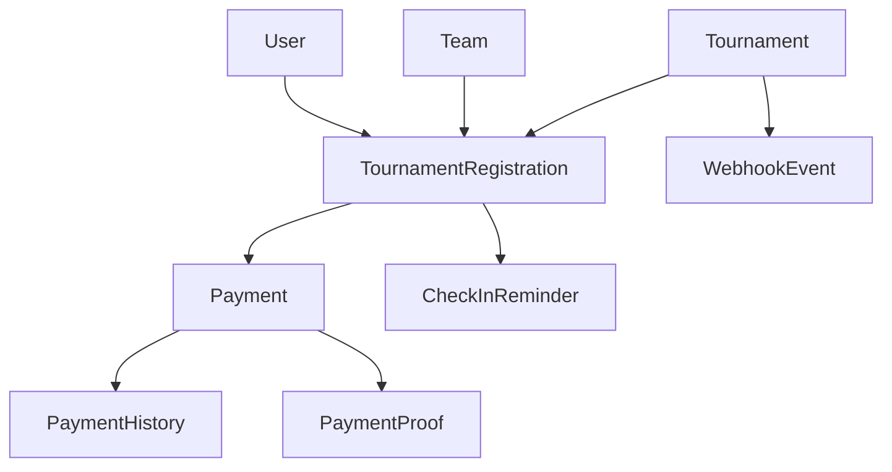

# Sprint 5-6: Tournament Registration & Payment System
## Week 5-6 (10 working days) - 95 Story Points

**Sprint Goal:** Implement complete tournament registration and payment processing system with team validation, Stripe integration, admin verification workflow, and comprehensive user interfaces for registration management.

**Duration:** Week 5-6 (10 working days)  
**Story Points:** 95 total (Sprint 5: 40 points, Sprint 6: 55 points)  
**Team Allocation:**
- Backend Developers: 2 developers (registration APIs, payment integration)
- Frontend Developers: 3 developers (registration UI, payment flows, admin interface)
- QA Engineers: 2 engineers (backend + frontend testing)
- DevOps Engineer: 1 engineer (Stripe environment setup, payment security)

**Epic Link:** DELTA-003 - Tournament Engine

---

## Sprint 5: Backend - Registration & Payment (Week 5)

### BE-014: Tournament Registration API

**Type:** Backend - API  
**Priority:** P0  
**Story Points:** 8  
**Assignee:** Backend Developer  
**Sprint:** 5 (Week 5)  
**Epic:** Tournament Engine - Registration

**Description:**

Develop comprehensive REST API endpoints for tournament registration management. This API handles the complete registration lifecycle from initial team registration through confirmation, check-in, and withdrawal. The system must validate team eligibility (team size, tournament capacity, registration window), enforce business rules (one registration per team, no duplicate members), and manage registration state transitions (PENDING → CONFIRMED → CHECKED_IN or CANCELLED/DISQUALIFIED).

The API should support both player-initiated actions (register, withdraw) and organizer actions (confirm, reject, disqualify). It must integrate with the payment system (BE-017) for paid tournaments, send email notifications on state changes, and provide filtering/search for organizers to manage registrations efficiently. All endpoints require proper authentication and permission checks (IsAuthenticated for registration, IsOrganizer for management).

**Acceptance Criteria:**

- [ ] **POST /api/tournaments/{slug}/register/** - Register team for tournament
  - Request body: `{ "team_id": 123, "roster": [1, 2, 3, 4, 5] }`
  - Validates team exists and captain is requesting user
  - Validates roster member count matches tournament.team_size (exactly, not range)
  - Validates tournament not full (registrations_count < max_teams)
  - Validates registration window open (now between registration_start and registration_end)
  - Validates team not already registered (unique_together: tournament, team)
  - Validates roster members are active team members
  - Creates TournamentRegistration with status=PENDING if entry_fee > 0, status=CONFIRMED if free
  - Returns 201 with registration object { "id", "status", "tournament", "team", "registered_at" }
  - Returns 400 with errors: "Tournament full", "Registration closed", "Already registered", "Invalid team size", "Invalid roster members"
  - Returns 401 if not authenticated, 403 if not team captain
  
- [ ] **DELETE /api/tournaments/{slug}/registrations/{id}/** - Withdraw registration
  - Validates user is team captain or organizer
  - Validates registration.status in [PENDING, CONFIRMED] (cannot withdraw after check-in)
  - Validates tournament.tournament_start > now + 24h (withdrawal deadline)
  - Updates status to CANCELLED, sets cancelled_at timestamp
  - If payment_status=PAID, initiates refund process (calls BE-019)
  - Sends email notification to team captain and organizer
  - Returns 204 No Content on success
  - Returns 400: "Cannot withdraw after check-in", "Withdrawal deadline passed"
  - Returns 403 if not authorized
  
- [ ] **POST /api/tournaments/{slug}/registrations/{id}/check-in/** - Check-in for tournament
  - Validates user is team captain
  - Validates registration.status=CONFIRMED (must be confirmed first)
  - Validates now between tournament.check_in_start and tournament.check_in_end (check-in window)
  - Validates roster members present (all roster.is_active=True)
  - Updates status to CHECKED_IN, sets checked_in_at timestamp
  - Sends email notification to team
  - Returns 200 with updated registration object
  - Returns 400: "Not confirmed", "Check-in window not open", "Check-in window closed", "Inactive roster members"
  
- [ ] **GET /api/tournaments/{slug}/registrations/** - List tournament registrations (organizer view)
  - Requires IsOrganizer or IsAdmin permission
  - Returns paginated list of registrations with team details, status, payment_status
  - Supports filtering: `?status=PENDING`, `?payment_status=PENDING`, `?team__name__icontains=alpha`
  - Supports ordering: `?ordering=-registered_at`, `?ordering=team__name`
  - Pagination: 50 per page
  - Response includes: registration details, team name/logo, roster list, payment info, timestamps
  
- [ ] **PATCH /api/tournaments/{slug}/registrations/{id}/confirm/** - Confirm registration (organizer action)
  - Requires IsOrganizer permission
  - Validates registration.status=PENDING
  - For paid tournaments: Validates payment_status=PAID
  - Updates status to CONFIRMED, sets confirmed_at timestamp
  - Assigns seed number if tournament uses seeding (next available seed)
  - Sends confirmation email to team captain
  - Returns 200 with updated registration
  
- [ ] **PATCH /api/tournaments/{slug}/registrations/{id}/reject/** - Reject registration (organizer action)
  - Requires IsOrganizer permission
  - Validates registration.status=PENDING
  - Request body: `{ "reason": "Team does not meet requirements" }`
  - Updates status to CANCELLED, stores rejection reason
  - Initiates refund if payment_status=PAID
  - Sends rejection email with reason to team captain
  - Returns 200 with updated registration
  
- [ ] **PATCH /api/tournaments/{slug}/registrations/{id}/disqualify/** - Disqualify team (organizer action)
  - Requires IsOrganizer permission
  - Can disqualify at any stage (PENDING/CONFIRMED/CHECKED_IN)
  - Request body: `{ "reason": "Rule violation: unsportsmanlike conduct" }`
  - Updates status to DISQUALIFIED, stores reason
  - No refund for disqualification
  - Sends disqualification email to team captain
  - Returns 200 with updated registration
  
- [ ] All endpoints include proper error handling with DRF exception handlers
- [ ] All state transitions logged to database (RegistrationHistory model for audit trail)
- [ ] Email notifications sent asynchronously via Celery tasks
- [ ] API documented with OpenAPI/Swagger schema

**Dependencies:**
- BE-006: Tournament Model (tournament object structure)
- BE-011: Team Model (team and roster structure)
- BE-013: TournamentRegistration Model (registration object)
- BE-017: Payment Model (payment_status field integration)

**Technical Notes:**

**ViewSet Structure:**
```python
# apps/tournaments/api/views.py
from rest_framework import viewsets, status
from rest_framework.decorators import action
from rest_framework.response import Response
from rest_framework.permissions import IsAuthenticated
from django.utils import timezone
from django.db import transaction
from .serializers import TournamentRegistrationSerializer, RegisterTeamSerializer
from .permissions import IsTeamCaptain, IsOrganizer
from ..models import Tournament, TournamentRegistration, Team
from ..tasks import send_registration_email

class TournamentRegistrationViewSet(viewsets.ModelViewSet):
    """
    Tournament registration management API.
    
    Endpoints:
    - POST /tournaments/{slug}/register/ - Register team
    - DELETE /tournaments/{slug}/registrations/{id}/ - Withdraw
    - POST /tournaments/{slug}/registrations/{id}/check-in/ - Check-in
    - GET /tournaments/{slug}/registrations/ - List (organizer)
    - PATCH /tournaments/{slug}/registrations/{id}/confirm/ - Confirm (organizer)
    - PATCH /tournaments/{slug}/registrations/{id}/reject/ - Reject (organizer)
    - PATCH /tournaments/{slug}/registrations/{id}/disqualify/ - Disqualify (organizer)
    """
    serializer_class = TournamentRegistrationSerializer
    permission_classes = [IsAuthenticated]
    lookup_field = 'id'
    
    def get_queryset(self):
        tournament_slug = self.kwargs['tournament_slug']
        tournament = Tournament.objects.get(slug=tournament_slug)
        
        queryset = TournamentRegistration.objects.filter(
            tournament=tournament
        ).select_related('team', 'team__captain').prefetch_related('roster')
        
        # Filter by permissions
        if not (self.request.user.is_staff or tournament.organizer == self.request.user):
            # Players only see their own registrations
            queryset = queryset.filter(team__captain=self.request.user)
        
        # Apply filters
        status_filter = self.request.query_params.get('status')
        if status_filter:
            queryset = queryset.filter(status=status_filter)
        
        payment_filter = self.request.query_params.get('payment_status')
        if payment_filter:
            queryset = queryset.filter(payment_status=payment_filter)
        
        team_search = self.request.query_params.get('team__name__icontains')
        if team_search:
            queryset = queryset.filter(team__name__icontains=team_search)
        
        return queryset.order_by('-registered_at')
    
    @action(detail=False, methods=['post'], url_path='register')
    def register_team(self, request, tournament_slug=None):
        """Register team for tournament."""
        tournament = Tournament.objects.select_for_update().get(slug=tournament_slug)
        serializer = RegisterTeamSerializer(data=request.data, context={
            'tournament': tournament,
            'user': request.user
        })
        serializer.is_valid(raise_exception=True)
        
        with transaction.atomic():
            # Validate capacity
            if tournament.registrations.filter(
                status__in=['PENDING', 'CONFIRMED', 'CHECKED_IN']
            ).count() >= tournament.max_teams:
                return Response(
                    {'error': 'Tournament is full'},
                    status=status.HTTP_400_BAD_REQUEST
                )
            
            # Validate registration window
            now = timezone.now()
            if not (tournament.registration_start <= now <= tournament.registration_end):
                return Response(
                    {'error': 'Registration is closed'},
                    status=status.HTTP_400_BAD_REQUEST
                )
            
            # Create registration
            registration = serializer.save()
            
            # Send email notification
            send_registration_email.delay(registration.id, 'registered')
            
            return Response(
                TournamentRegistrationSerializer(registration).data,
                status=status.HTTP_201_CREATED
            )
    
    @action(detail=True, methods=['post'], permission_classes=[IsTeamCaptain])
    def check_in(self, request, tournament_slug=None, id=None):
        """Check-in team for tournament."""
        registration = self.get_object()
        tournament = registration.tournament
        
        # Validate status
        if registration.status != 'CONFIRMED':
            return Response(
                {'error': 'Registration must be confirmed before check-in'},
                status=status.HTTP_400_BAD_REQUEST
            )
        
        # Validate check-in window
        now = timezone.now()
        if not (tournament.check_in_start <= now <= tournament.check_in_end):
            if now < tournament.check_in_start:
                return Response(
                    {'error': 'Check-in window has not opened yet'},
                    status=status.HTTP_400_BAD_REQUEST
                )
            else:
                return Response(
                    {'error': 'Check-in window has closed'},
                    status=status.HTTP_400_BAD_REQUEST
                )
        
        # Validate roster active
        inactive_members = registration.roster.filter(is_active=False)
        if inactive_members.exists():
            return Response(
                {'error': f'Inactive roster members: {[m.username for m in inactive_members]}'},
                status=status.HTTP_400_BAD_REQUEST
            )
        
        # Update registration
        registration.status = 'CHECKED_IN'
        registration.checked_in_at = now
        registration.save()
        
        # Log history
        RegistrationHistory.objects.create(
            registration=registration,
            action='CHECKED_IN',
            user=request.user,
            notes='Team checked in successfully'
        )
        
        # Send notification
        send_registration_email.delay(registration.id, 'checked_in')
        
        return Response(
            TournamentRegistrationSerializer(registration).data,
            status=status.HTTP_200_OK
        )
    
    @action(detail=True, methods=['patch'], permission_classes=[IsOrganizer])
    def confirm(self, request, tournament_slug=None, id=None):
        """Confirm registration (organizer action)."""
        registration = self.get_object()
        
        if registration.status != 'PENDING':
            return Response(
                {'error': 'Only pending registrations can be confirmed'},
                status=status.HTTP_400_BAD_REQUEST
            )
        
        # For paid tournaments, validate payment
        if registration.tournament.entry_fee > 0 and registration.payment_status != 'PAID':
            return Response(
                {'error': 'Payment must be verified before confirmation'},
                status=status.HTTP_400_BAD_REQUEST
            )
        
        # Confirm registration
        registration.status = 'CONFIRMED'
        registration.confirmed_at = timezone.now()
        
        # Assign seed if using seeding
        if registration.tournament.format in ['SINGLE_ELIMINATION', 'DOUBLE_ELIMINATION']:
            max_seed = TournamentRegistration.objects.filter(
                tournament=registration.tournament,
                seed__isnull=False
            ).aggregate(Max('seed'))['seed__max'] or 0
            registration.seed = max_seed + 1
        
        registration.save()
        
        # Log history
        RegistrationHistory.objects.create(
            registration=registration,
            action='CONFIRMED',
            user=request.user,
            notes='Registration confirmed by organizer'
        )
        
        # Send notification
        send_registration_email.delay(registration.id, 'confirmed')
        
        return Response(
            TournamentRegistrationSerializer(registration).data,
            status=status.HTTP_200_OK
        )
    
    @action(detail=True, methods=['delete'], permission_classes=[IsTeamCaptain])
    def withdraw(self, request, tournament_slug=None, id=None):
        """Withdraw registration."""
        registration = self.get_object()
        
        # Validate status
        if registration.status not in ['PENDING', 'CONFIRMED']:
            return Response(
                {'error': 'Cannot withdraw after check-in'},
                status=status.HTTP_400_BAD_REQUEST
            )
        
        # Validate withdrawal deadline (24h before tournament start)
        if timezone.now() > registration.tournament.tournament_start - timezone.timedelta(hours=24):
            return Response(
                {'error': 'Withdrawal deadline has passed (24h before tournament start)'},
                status=status.HTTP_400_BAD_REQUEST
            )
        
        # Cancel registration
        registration.status = 'CANCELLED'
        registration.cancelled_at = timezone.now()
        registration.save()
        
        # Initiate refund if paid
        if registration.payment_status == 'PAID':
            from apps.payments.tasks import initiate_refund
            initiate_refund.delay(registration.id)
        
        # Log history
        RegistrationHistory.objects.create(
            registration=registration,
            action='WITHDRAWN',
            user=request.user,
            notes='Team withdrew from tournament'
        )
        
        # Send notification
        send_registration_email.delay(registration.id, 'withdrawn')
        
        return Response(status=status.HTTP_204_NO_CONTENT)
```

**Serializers:**
```python
# apps/tournaments/api/serializers.py
from rest_framework import serializers
from ..models import TournamentRegistration, Team, TeamMember

class RosterMemberSerializer(serializers.ModelSerializer):
    username = serializers.CharField(source='user.username', read_only=True)
    avatar = serializers.ImageField(source='user.profile.avatar', read_only=True)
    
    class Meta:
        model = TeamMember
        fields = ['id', 'user', 'username', 'avatar', 'role', 'is_active']
        read_only_fields = ['id', 'username', 'avatar']

class RegisterTeamSerializer(serializers.Serializer):
    """Serializer for team registration."""
    team_id = serializers.IntegerField()
    roster = serializers.ListField(
        child=serializers.IntegerField(),
        min_length=1,
        max_length=20
    )
    
    def validate_team_id(self, value):
        """Validate team exists and user is captain."""
        try:
            team = Team.objects.get(id=value)
        except Team.DoesNotExist:
            raise serializers.ValidationError('Team does not exist')
        
        if team.captain != self.context['user']:
            raise serializers.ValidationError('Only team captain can register')
        
        return value
    
    def validate(self, data):
        """Validate roster and team size."""
        tournament = self.context['tournament']
        team = Team.objects.get(id=data['team_id'])
        
        # Check already registered
        if TournamentRegistration.objects.filter(
            tournament=tournament,
            team=team,
            status__in=['PENDING', 'CONFIRMED', 'CHECKED_IN']
        ).exists():
            raise serializers.ValidationError('Team is already registered')
        
        # Validate roster count matches team size exactly
        if len(data['roster']) != tournament.team_size:
            raise serializers.ValidationError(
                f'Roster must have exactly {tournament.team_size} members'
            )
        
        # Validate all roster members are active team members
        team_member_ids = set(
            team.members.filter(is_active=True).values_list('user_id', flat=True)
        )
        roster_ids = set(data['roster'])
        
        if not roster_ids.issubset(team_member_ids):
            invalid_ids = roster_ids - team_member_ids
            raise serializers.ValidationError(
                f'Invalid roster members: {invalid_ids}'
            )
        
        return data
    
    def create(self, validated_data):
        """Create tournament registration."""
        tournament = self.context['tournament']
        team = Team.objects.get(id=validated_data['team_id'])
        roster_users = User.objects.filter(id__in=validated_data['roster'])
        
        # Determine initial status
        if tournament.entry_fee > 0:
            initial_status = 'PENDING'
            payment_status = 'PENDING'
        else:
            initial_status = 'CONFIRMED'
            payment_status = 'NOT_REQUIRED'
        
        # Create registration
        registration = TournamentRegistration.objects.create(
            tournament=tournament,
            team=team,
            status=initial_status,
            payment_status=payment_status,
            registered_at=timezone.now()
        )
        registration.roster.set(roster_users)
        
        return registration

class TournamentRegistrationSerializer(serializers.ModelSerializer):
    """Detailed registration serializer."""
    team_name = serializers.CharField(source='team.name', read_only=True)
    team_logo = serializers.ImageField(source='team.logo', read_only=True)
    captain_name = serializers.CharField(source='team.captain.username', read_only=True)
    roster = RosterMemberSerializer(many=True, read_only=True)
    tournament_title = serializers.CharField(source='tournament.title', read_only=True)
    
    class Meta:
        model = TournamentRegistration
        fields = [
            'id', 'tournament', 'tournament_title', 'team', 'team_name', 'team_logo',
            'captain_name', 'roster', 'status', 'payment_status', 'payment_proof',
            'seed', 'registered_at', 'confirmed_at', 'checked_in_at', 'cancelled_at'
        ]
        read_only_fields = [
            'id', 'registered_at', 'confirmed_at', 'checked_in_at', 'cancelled_at'
        ]
```

**Permissions:**
```python
# apps/tournaments/api/permissions.py
from rest_framework import permissions

class IsTeamCaptain(permissions.BasePermission):
    """Permission: User is team captain of registered team."""
    
    def has_object_permission(self, request, view, obj):
        return obj.team.captain == request.user

class IsOrganizer(permissions.BasePermission):
    """Permission: User is tournament organizer or admin."""
    
    def has_object_permission(self, request, view, obj):
        tournament = obj.tournament if hasattr(obj, 'tournament') else obj
        return request.user.is_staff or tournament.organizer == request.user
```

**Celery Tasks:**
```python
# apps/tournaments/tasks.py
from celery import shared_task
from django.core.mail import send_mail
from django.template.loader import render_to_string
from .models import TournamentRegistration

@shared_task
def send_registration_email(registration_id, action):
    """
    Send email notification for registration actions.
    
    Actions: registered, confirmed, rejected, withdrawn, checked_in, disqualified
    """
    registration = TournamentRegistration.objects.select_related(
        'tournament', 'team', 'team__captain'
    ).get(id=registration_id)
    
    email_templates = {
        'registered': 'emails/registration_registered.html',
        'confirmed': 'emails/registration_confirmed.html',
        'rejected': 'emails/registration_rejected.html',
        'withdrawn': 'emails/registration_withdrawn.html',
        'checked_in': 'emails/registration_checked_in.html',
        'disqualified': 'emails/registration_disqualified.html'
    }
    
    subject_lines = {
        'registered': f'Registered for {registration.tournament.title}',
        'confirmed': f'Registration Confirmed - {registration.tournament.title}',
        'rejected': f'Registration Rejected - {registration.tournament.title}',
        'withdrawn': f'Registration Withdrawn - {registration.tournament.title}',
        'checked_in': f'Checked In - {registration.tournament.title}',
        'disqualified': f'Team Disqualified - {registration.tournament.title}'
    }
    
    context = {
        'registration': registration,
        'tournament': registration.tournament,
        'team': registration.team,
        'captain': registration.team.captain
    }
    
    html_content = render_to_string(email_templates[action], context)
    
    send_mail(
        subject=subject_lines[action],
        message='',  # Plain text fallback
        from_email='noreply@deltacrown.gg',
        recipient_list=[registration.team.captain.email],
        html_message=html_content,
        fail_silently=False
    )
```

**Registration History Model:**
```python
# apps/tournaments/models.py (add to existing)
class RegistrationHistory(models.Model):
    """Audit trail for registration state changes."""
    registration = models.ForeignKey(
        TournamentRegistration,
        on_delete=models.CASCADE,
        related_name='history'
    )
    action = models.CharField(max_length=50, choices=[
        ('REGISTERED', 'Registered'),
        ('CONFIRMED', 'Confirmed'),
        ('REJECTED', 'Rejected'),
        ('WITHDRAWN', 'Withdrawn'),
        ('CHECKED_IN', 'Checked In'),
        ('DISQUALIFIED', 'Disqualified')
    ])
    user = models.ForeignKey(User, on_delete=models.SET_NULL, null=True)
    notes = models.TextField(blank=True)
    timestamp = models.DateTimeField(auto_now_add=True)
    
    class Meta:
        ordering = ['-timestamp']
        verbose_name_plural = 'Registration histories'
    
    def __str__(self):
        return f'{self.registration} - {self.action} at {self.timestamp}'
```

**Files to Create/Modify:**
- `apps/tournaments/api/views.py` - Add TournamentRegistrationViewSet
- `apps/tournaments/api/serializers.py` - Add RegisterTeamSerializer, TournamentRegistrationSerializer
- `apps/tournaments/api/permissions.py` - Add IsTeamCaptain, IsOrganizer
- `apps/tournaments/api/urls.py` - Add registration routes
- `apps/tournaments/tasks.py` - Add send_registration_email task
- `apps/tournaments/models.py` - Add RegistrationHistory model
- `apps/tournaments/migrations/` - Create migration for RegistrationHistory

**References:**
- PROPOSAL_PART_3.md Section 3.2-3.5 (Tournament Registration Flow)
- BE-013: TournamentRegistration Model (base model structure)
- BE-011: Team Model (team and roster validation)

**Testing:**
```bash
# Register team
POST /api/tournaments/summer-valorant-2024/register/
{
  "team_id": 42,
  "roster": [1, 2, 3, 4, 5]
}
# Expected: 201 Created with registration object

# Check-in
POST /api/tournaments/summer-valorant-2024/registrations/123/check-in/
# Expected: 200 OK, status updated to CHECKED_IN

# Withdraw
DELETE /api/tournaments/summer-valorant-2024/registrations/123/
# Expected: 204 No Content, status updated to CANCELLED

# List registrations (organizer)
GET /api/tournaments/summer-valorant-2024/registrations/?status=PENDING
# Expected: 200 OK with paginated list

# Confirm registration (organizer)
PATCH /api/tournaments/summer-valorant-2024/registrations/123/confirm/
# Expected: 200 OK, status updated to CONFIRMED

# Test error cases:
# - Tournament full → 400 "Tournament is full"
# - Registration closed → 400 "Registration is closed"
# - Already registered → 400 "Team is already registered"
# - Invalid team size → 400 "Roster must have exactly X members"
# - Not team captain → 403 Forbidden
```

---

### BE-015: Team Validation Service

**Type:** Backend - Service  
**Priority:** P1  
**Story Points:** 5  
**Assignee:** Backend Developer  
**Sprint:** 5 (Week 5)  
**Epic:** Tournament Engine - Registration

**Description:**

Create a comprehensive team validation service that encapsulates all business logic for determining team eligibility for tournament registration. This service validates team composition (active members, captain status, member availability), tournament compatibility (team size matches, game compatibility, skill level requirements), and conflict detection (scheduling conflicts with other tournaments, member participation limits). The service should be reusable across registration API, admin interface, and frontend validation endpoints.

The validation service must return structured validation results with specific error messages, warnings, and eligibility status. It should support bulk validation (check multiple teams at once), provide detailed reasoning for rejections, and cache validation results for performance. This service will be called before allowing registration attempts and during roster changes to provide real-time feedback to users.

**Acceptance Criteria:**

- [ ] Service class created at `apps/tournaments/services/team_validation.py` with `TeamValidationService`
- [ ] **validate_team_eligibility(team, tournament)** method returns ValidationResult object with:
  - `is_eligible`: Boolean (True if team can register)
  - `errors`: List of error messages (blocking issues)
  - `warnings`: List of warning messages (non-blocking issues)
  - `details`: Dict with specific validation checks (team_size, roster_status, conflicts, etc.)
- [ ] **Validation checks implemented:**
  - Team exists and is active (team.is_active=True)
  - Team has sufficient active members (active_count >= tournament.team_size)
  - Captain is active team member
  - Team size compatibility (team can field tournament.team_size players)
  - Game compatibility (team has played this game or is open to it)
  - No existing registration (team not already registered for this tournament)
  - No scheduling conflicts (tournament dates don't overlap with other confirmed tournaments)
  - Member participation limits (no member in >3 concurrent tournaments)
  - Account standing (team not banned, no recent disqualifications)
- [ ] **validate_roster(roster, team, tournament)** method validates specific roster:
  - All roster members are active team members
  - Roster size matches tournament.team_size exactly
  - No duplicate members in roster
  - All members meet minimum account age (30 days)
  - All members have verified email addresses
  - Returns ValidationResult with member-specific errors
- [ ] **check_scheduling_conflicts(team, tournament)** method:
  - Queries team's confirmed tournaments with overlapping dates
  - Returns list of conflicting tournaments with overlap details
  - Considers tournament_start, tournament_end, and estimated duration
- [ ] **get_team_availability(team, date_range)** method:
  - Returns team's schedule for given date range
  - Shows confirmed tournaments, pending registrations
  - Calculates available time slots
- [ ] Validation results cached for 5 minutes (Redis cache keyed by team_id + tournament_id)
- [ ] Bulk validation endpoint: `POST /api/tournaments/{slug}/validate-teams/` accepts `{"team_ids": [1,2,3]}`, returns dict of validation results
- [ ] Service includes logging for all validation failures (helps organizers debug rejections)
- [ ] ValidationResult serializable to JSON for API responses

**Dependencies:**
- BE-011: Team Model (team data structure)
- BE-006: Tournament Model (tournament requirements)
- BE-013: TournamentRegistration Model (existing registrations check)

**Technical Notes:**

**Service Implementation:**
```python
# apps/tournaments/services/team_validation.py
from dataclasses import dataclass, field
from typing import List, Dict, Optional
from django.core.cache import cache
from django.db.models import Q, Count
from django.utils import timezone
from datetime import timedelta
from ..models import Team, Tournament, TournamentRegistration, User

@dataclass
class ValidationResult:
    """Result of team validation check."""
    is_eligible: bool
    errors: List[str] = field(default_factory=list)
    warnings: List[str] = field(default_factory=list)
    details: Dict = field(default_factory=dict)
    
    def to_dict(self):
        """Convert to dictionary for JSON serialization."""
        return {
            'is_eligible': self.is_eligible,
            'errors': self.errors,
            'warnings': self.warnings,
            'details': self.details
        }

class TeamValidationService:
    """Service for validating team eligibility for tournaments."""
    
    CACHE_TTL = 300  # 5 minutes
    MAX_CONCURRENT_TOURNAMENTS = 3
    MIN_ACCOUNT_AGE_DAYS = 30
    
    @classmethod
    def validate_team_eligibility(cls, team: Team, tournament: Tournament) -> ValidationResult:
        """
        Validate if team is eligible to register for tournament.
        
        Args:
            team: Team instance to validate
            tournament: Tournament instance to register for
        
        Returns:
            ValidationResult with eligibility status and details
        """
        # Check cache first
        cache_key = f'team_validation:{team.id}:{tournament.id}'
        cached_result = cache.get(cache_key)
        if cached_result:
            return ValidationResult(**cached_result)
        
        result = ValidationResult(is_eligible=True)
        
        # Check 1: Team is active
        if not team.is_active:
            result.is_eligible = False
            result.errors.append('Team is inactive')
            result.details['team_active'] = False
        else:
            result.details['team_active'] = True
        
        # Check 2: Team has sufficient active members
        active_members = team.members.filter(is_active=True).count()
        result.details['active_members_count'] = active_members
        
        if active_members < tournament.team_size:
            result.is_eligible = False
            result.errors.append(
                f'Team has only {active_members} active members, '
                f'but tournament requires {tournament.team_size}'
            )
        
        # Check 3: Captain is active
        if not team.captain or not team.captain.is_active:
            result.is_eligible = False
            result.errors.append('Team captain is inactive')
            result.details['captain_active'] = False
        else:
            result.details['captain_active'] = True
        
        # Check 4: Not already registered
        existing_registration = TournamentRegistration.objects.filter(
            tournament=tournament,
            team=team,
            status__in=['PENDING', 'CONFIRMED', 'CHECKED_IN']
        ).first()
        
        if existing_registration:
            result.is_eligible = False
            result.errors.append(
                f'Team is already registered with status: {existing_registration.status}'
            )
            result.details['already_registered'] = True
        else:
            result.details['already_registered'] = False
        
        # Check 5: Tournament not full
        current_registrations = TournamentRegistration.objects.filter(
            tournament=tournament,
            status__in=['PENDING', 'CONFIRMED', 'CHECKED_IN']
        ).count()
        
        result.details['tournament_capacity'] = {
            'current': current_registrations,
            'max': tournament.max_teams,
            'available': tournament.max_teams - current_registrations
        }
        
        if current_registrations >= tournament.max_teams:
            result.is_eligible = False
            result.errors.append('Tournament is full')
        
        # Check 6: Registration window open
        now = timezone.now()
        result.details['registration_window'] = {
            'start': tournament.registration_start.isoformat(),
            'end': tournament.registration_end.isoformat(),
            'is_open': tournament.registration_start <= now <= tournament.registration_end
        }
        
        if now < tournament.registration_start:
            result.is_eligible = False
            result.errors.append(
                f'Registration opens on {tournament.registration_start.strftime("%Y-%m-%d %H:%M")}'
            )
        elif now > tournament.registration_end:
            result.is_eligible = False
            result.errors.append('Registration has closed')
        
        # Check 7: Scheduling conflicts
        conflicts = cls.check_scheduling_conflicts(team, tournament)
        if conflicts:
            result.warnings.append(
                f'Team has {len(conflicts)} scheduling conflict(s)'
            )
            result.details['scheduling_conflicts'] = [
                {
                    'tournament_id': c.id,
                    'tournament_title': c.title,
                    'dates': f"{c.tournament_start} to {c.tournament_end}"
                }
                for c in conflicts
            ]
        else:
            result.details['scheduling_conflicts'] = []
        
        # Check 8: Member participation limits
        member_tournament_counts = cls._check_member_participation_limits(team, tournament)
        overloaded_members = [
            (username, count) for username, count in member_tournament_counts.items()
            if count >= cls.MAX_CONCURRENT_TOURNAMENTS
        ]
        
        if overloaded_members:
            result.warnings.append(
                f'Some members are in {cls.MAX_CONCURRENT_TOURNAMENTS}+ concurrent tournaments: '
                f'{", ".join([f"{u} ({c})" for u, c in overloaded_members])}'
            )
            result.details['overloaded_members'] = overloaded_members
        
        # Check 9: Account standing
        if hasattr(team, 'is_banned') and team.is_banned:
            result.is_eligible = False
            result.errors.append('Team is banned from tournaments')
            result.details['banned'] = True
        else:
            result.details['banned'] = False
        
        # Recent disqualifications
        recent_disqualifications = TournamentRegistration.objects.filter(
            team=team,
            status='DISQUALIFIED',
            tournament__tournament_end__gte=now - timedelta(days=30)
        ).count()
        
        if recent_disqualifications > 0:
            result.warnings.append(
                f'Team has {recent_disqualifications} recent disqualification(s)'
            )
            result.details['recent_disqualifications'] = recent_disqualifications
        
        # Cache result
        cache.set(cache_key, result.to_dict(), cls.CACHE_TTL)
        
        return result
    
    @classmethod
    def validate_roster(
        cls,
        roster: List[User],
        team: Team,
        tournament: Tournament
    ) -> ValidationResult:
        """
        Validate specific roster for tournament.
        
        Args:
            roster: List of User instances for roster
            team: Team instance
            tournament: Tournament instance
        
        Returns:
            ValidationResult with roster-specific validation
        """
        result = ValidationResult(is_eligible=True)
        
        # Check roster size
        if len(roster) != tournament.team_size:
            result.is_eligible = False
            result.errors.append(
                f'Roster must have exactly {tournament.team_size} members, '
                f'got {len(roster)}'
            )
        
        # Check duplicate members
        roster_ids = [u.id for u in roster]
        if len(roster_ids) != len(set(roster_ids)):
            result.is_eligible = False
            result.errors.append('Roster contains duplicate members')
        
        # Check all are team members
        team_member_ids = set(
            team.members.filter(is_active=True).values_list('user_id', flat=True)
        )
        roster_id_set = set(roster_ids)
        
        if not roster_id_set.issubset(team_member_ids):
            invalid_ids = roster_id_set - team_member_ids
            result.is_eligible = False
            result.errors.append(
                f'Invalid roster members (not active team members): {invalid_ids}'
            )
        
        # Check member-specific requirements
        member_details = []
        for user in roster:
            member_info = {
                'user_id': user.id,
                'username': user.username,
                'issues': []
            }
            
            # Check account age
            account_age = (timezone.now() - user.date_joined).days
            if account_age < cls.MIN_ACCOUNT_AGE_DAYS:
                member_info['issues'].append(
                    f'Account too new ({account_age} days, need {cls.MIN_ACCOUNT_AGE_DAYS})'
                )
                result.is_eligible = False
            
            # Check email verified
            if not user.email or not user.is_active:
                member_info['issues'].append('Email not verified or account inactive')
                result.warnings.append(f'{user.username} has unverified email')
            
            member_details.append(member_info)
        
        result.details['roster_members'] = member_details
        
        # Add errors from member issues
        all_issues = [
            issue for member in member_details
            for issue in member['issues']
        ]
        if all_issues:
            result.errors.extend(all_issues)
        
        return result
    
    @classmethod
    def check_scheduling_conflicts(
        cls,
        team: Team,
        tournament: Tournament
    ) -> List[Tournament]:
        """
        Check for scheduling conflicts with other tournaments.
        
        Args:
            team: Team instance
            tournament: Tournament to check conflicts for
        
        Returns:
            List of conflicting Tournament instances
        """
        # Get team's confirmed tournaments
        confirmed_registrations = TournamentRegistration.objects.filter(
            team=team,
            status__in=['CONFIRMED', 'CHECKED_IN']
        ).select_related('tournament')
        
        conflicts = []
        for reg in confirmed_registrations:
            other_tournament = reg.tournament
            
            # Skip self
            if other_tournament.id == tournament.id:
                continue
            
            # Check date overlap
            if cls._dates_overlap(
                tournament.tournament_start,
                tournament.tournament_end,
                other_tournament.tournament_start,
                other_tournament.tournament_end
            ):
                conflicts.append(other_tournament)
        
        return conflicts
    
    @classmethod
    def get_team_availability(
        cls,
        team: Team,
        start_date,
        end_date
    ) -> Dict:
        """
        Get team's tournament schedule for date range.
        
        Args:
            team: Team instance
            start_date: Start of date range
            end_date: End of date range
        
        Returns:
            Dict with scheduled tournaments and availability
        """
        registrations = TournamentRegistration.objects.filter(
            team=team,
            status__in=['PENDING', 'CONFIRMED', 'CHECKED_IN'],
            tournament__tournament_start__lte=end_date,
            tournament__tournament_end__gte=start_date
        ).select_related('tournament').order_by('tournament__tournament_start')
        
        return {
            'team_id': team.id,
            'team_name': team.name,
            'date_range': {
                'start': start_date.isoformat(),
                'end': end_date.isoformat()
            },
            'tournaments': [
                {
                    'id': reg.tournament.id,
                    'title': reg.tournament.title,
                    'status': reg.status,
                    'start': reg.tournament.tournament_start.isoformat(),
                    'end': reg.tournament.tournament_end.isoformat()
                }
                for reg in registrations
            ],
            'total_tournaments': registrations.count()
        }
    
    @staticmethod
    def _dates_overlap(start1, end1, start2, end2) -> bool:
        """Check if two date ranges overlap."""
        return start1 <= end2 and end1 >= start2
    
    @classmethod
    def _check_member_participation_limits(
        cls,
        team: Team,
        tournament: Tournament
    ) -> Dict[str, int]:
        """
        Check how many concurrent tournaments each member is in.
        
        Returns:
            Dict mapping username to tournament count
        """
        team_members = team.members.filter(is_active=True).select_related('user')
        member_counts = {}
        
        for member in team_members:
            # Count tournaments where this user is in roster during this tournament's dates
            concurrent_count = TournamentRegistration.objects.filter(
                roster=member.user,
                status__in=['CONFIRMED', 'CHECKED_IN'],
                tournament__tournament_start__lte=tournament.tournament_end,
                tournament__tournament_end__gte=tournament.tournament_start
            ).exclude(tournament=tournament).count()
            
            member_counts[member.user.username] = concurrent_count
        
        return member_counts
```

**Bulk Validation API:**
```python
# apps/tournaments/api/views.py (add to TournamentViewSet)
from ..services.team_validation import TeamValidationService

class TournamentViewSet(viewsets.ModelViewSet):
    # ... existing code ...
    
    @action(detail=True, methods=['post'], url_path='validate-teams')
    def validate_teams(self, request, slug=None):
        """
        Bulk validate multiple teams for tournament eligibility.
        
        POST /api/tournaments/{slug}/validate-teams/
        {
            "team_ids": [1, 2, 3, 4, 5]
        }
        """
        tournament = self.get_object()
        team_ids = request.data.get('team_ids', [])
        
        if not team_ids or not isinstance(team_ids, list):
            return Response(
                {'error': 'team_ids must be a non-empty list'},
                status=status.HTTP_400_BAD_REQUEST
            )
        
        teams = Team.objects.filter(id__in=team_ids)
        results = {}
        
        for team in teams:
            validation_result = TeamValidationService.validate_team_eligibility(
                team, tournament
            )
            results[team.id] = {
                'team_name': team.name,
                'validation': validation_result.to_dict()
            }
        
        return Response(results, status=status.HTTP_200_OK)
```

**Files to Create/Modify:**
- `apps/tournaments/services/__init__.py` - Create services package
- `apps/tournaments/services/team_validation.py` - Main validation service
- `apps/tournaments/api/views.py` - Add validate_teams endpoint
- `apps/tournaments/api/serializers.py` - Add ValidationResultSerializer (optional)

**References:**
- PROPOSAL_PART_3.md Section 3.4 (Team Validation Rules)
- BE-011: Team Model (team structure)
- BE-014: Registration API (uses this service)

**Testing:**
```python
# Test validation service
from apps.tournaments.services.team_validation import TeamValidationService

# Test eligible team
result = TeamValidationService.validate_team_eligibility(team, tournament)
assert result.is_eligible == True
assert len(result.errors) == 0

# Test ineligible team (inactive)
team.is_active = False
result = TeamValidationService.validate_team_eligibility(team, tournament)
assert result.is_eligible == False
assert 'Team is inactive' in result.errors

# Test roster validation
roster = [user1, user2, user3, user4, user5]
result = TeamValidationService.validate_roster(roster, team, tournament)
assert result.is_eligible == True

# Test scheduling conflicts
conflicting_tournament = Tournament.objects.create(...)
result = TeamValidationService.check_scheduling_conflicts(team, tournament)
assert len(result) > 0

# Test bulk validation API
POST /api/tournaments/summer-valorant-2024/validate-teams/
{
  "team_ids": [1, 2, 3]
}
# Expected: 200 OK with validation results for each team
```

---

### BE-016: Check-in System

**Type:** Backend - Feature  
**Priority:** P1  
**Story Points:** 5  
**Assignee:** Backend Developer  
**Sprint:** 5 (Week 5)  
**Epic:** Tournament Engine - Registration

**Description:**

Implement automated check-in system for tournament participants to confirm attendance before tournament start. The system manages check-in windows (typically opens 2 hours before, closes 30 minutes before tournament start), validates team readiness (all roster members present, payment confirmed), sends automated reminders via email and notifications, and tracks check-in status in real-time. Teams that fail to check-in are automatically disqualified and their slot opened for waitlist teams.

The check-in system must support both manual check-in (team captain clicks button) and automatic check-in scenarios (tournaments with auto-check-in enabled). It should provide organizer dashboard showing check-in progress, send reminder notifications at configured intervals (2h, 1h, 30min before close), and handle edge cases like partial rosters, late check-ins, and technical issues requiring manual intervention by organizers.

**Acceptance Criteria:**

- [ ] **Check-in window management:**
  - Tournament model includes check_in_start, check_in_end datetime fields (already in BE-006)
  - Default check_in_start = tournament_start - 2 hours
  - Default check_in_end = tournament_start - 30 minutes
  - Organizer can customize check-in window during tournament creation
  
- [ ] **Check-in endpoint** (already implemented in BE-014):
  - `POST /api/tournaments/{slug}/registrations/{id}/check-in/`
  - Validates registration.status = CONFIRMED
  - Validates current time within check-in window
  - Validates all roster members have active accounts
  - Updates status to CHECKED_IN, sets checked_in_at timestamp
  - Returns 200 with updated registration object
  
- [ ] **Automated reminder system:**
  - Celery beat task runs every 15 minutes checking upcoming check-in windows
  - Sends email reminders at: 2 hours before close, 1 hour before close, 30 minutes before close
  - Email includes check-in button link, roster details, check-in window times
  - Tracks reminder sent status (CheckInReminder model: registration FK, reminder_type, sent_at)
  - Only sends each reminder type once per registration
  
- [ ] **Auto-disqualification for no-shows:**
  - Celery beat task runs every 5 minutes after check-in windows close
  - Finds registrations with status=CONFIRMED and checked_in_at=null where check_in_end < now
  - Updates status to DISQUALIFIED with reason="Failed to check-in"
  - Sends disqualification email to team captain
  - Logs to RegistrationHistory with action=AUTO_DISQUALIFIED
  - Opens slot for waitlist teams if enabled
  
- [ ] **Check-in status dashboard endpoint:**
  - `GET /api/tournaments/{slug}/check-in-status/` (organizer only)
  - Returns: total_registrations, checked_in_count, pending_check_in_count, time_remaining
  - List of pending check-ins with team details, reminder status
  - Real-time updates via polling (30s interval) or WebSocket (Sprint 9)
  
- [ ] **Manual check-in override (organizer action):**
  - `POST /api/tournaments/{slug}/registrations/{id}/force-check-in/` (organizer only)
  - Allows organizer to check-in team outside window (for technical issues)
  - Requires reason in request body
  - Logs to RegistrationHistory with user=organizer, notes=reason
  
- [ ] **Bulk check-in endpoint (for LAN events):**
  - `POST /api/tournaments/{slug}/bulk-check-in/` (organizer only)
  - Request body: `{"registration_ids": [1, 2, 3]}`
  - Checks in multiple teams at once
  - Returns success/failure status for each registration
  
- [ ] **Check-in widget for frontend:**
  - Serializer includes computed fields: can_check_in (boolean), check_in_window_status (PENDING/OPEN/CLOSED)
  - Frontend displays countdown timer, "Check-in Now" button when window open
  - Button disabled with tooltip when window closed or already checked-in
  
- [ ] Tournament.is_ready_to_start computed property:
  - Returns True if all confirmed registrations are checked-in or disqualified
  - Used by bracket generation (Sprint 7) to determine when to start tournament

**Dependencies:**
- BE-014: Registration API (check-in endpoint already defined)
- BE-013: TournamentRegistration Model (status field, checked_in_at)
- BE-006: Tournament Model (check_in_start, check_in_end fields)

**Technical Notes:**

**Celery Beat Tasks:**
```python
# apps/tournaments/tasks.py (add to existing)
from celery import shared_task
from celery.schedules import crontab
from django.utils import timezone
from datetime import timedelta
from .models import Tournament, TournamentRegistration, CheckInReminder

@shared_task
def send_check_in_reminders():
    """
    Send check-in reminders at configured intervals.
    Runs every 15 minutes.
    """
    now = timezone.now()
    
    # Define reminder windows
    reminder_windows = [
        ('2_HOUR', timedelta(hours=2)),
        ('1_HOUR', timedelta(hours=1)),
        ('30_MIN', timedelta(minutes=30))
    ]
    
    for reminder_type, time_before_close in reminder_windows:
        # Find check-in windows closing in this timeframe
        target_time = now + time_before_close
        tournaments = Tournament.objects.filter(
            check_in_end__gte=target_time - timedelta(minutes=10),
            check_in_end__lte=target_time + timedelta(minutes=10),
            status='PUBLISHED'
        )
        
        for tournament in tournaments:
            # Get confirmed but not checked-in registrations
            pending_registrations = TournamentRegistration.objects.filter(
                tournament=tournament,
                status='CONFIRMED',
                checked_in_at__isnull=True
            )
            
            for registration in pending_registrations:
                # Check if reminder already sent
                if CheckInReminder.objects.filter(
                    registration=registration,
                    reminder_type=reminder_type
                ).exists():
                    continue
                
                # Send reminder email
                send_check_in_reminder_email.delay(
                    registration.id,
                    reminder_type
                )
                
                # Record reminder sent
                CheckInReminder.objects.create(
                    registration=registration,
                    reminder_type=reminder_type,
                    sent_at=now
                )

@shared_task
def send_check_in_reminder_email(registration_id, reminder_type):
    """Send individual check-in reminder email."""
    registration = TournamentRegistration.objects.select_related(
        'tournament', 'team', 'team__captain'
    ).get(id=registration_id)
    
    time_labels = {
        '2_HOUR': '2 hours',
        '1_HOUR': '1 hour',
        '30_MIN': '30 minutes'
    }
    
    context = {
        'registration': registration,
        'tournament': registration.tournament,
        'team': registration.team,
        'time_remaining': time_labels[reminder_type],
        'check_in_url': f'https://deltacrown.gg/tournaments/{registration.tournament.slug}/check-in/'
    }
    
    html_content = render_to_string('emails/check_in_reminder.html', context)
    
    send_mail(
        subject=f'Check-in Reminder - {registration.tournament.title} ({time_labels[reminder_type]} remaining)',
        message='',
        from_email='noreply@deltacrown.gg',
        recipient_list=[registration.team.captain.email],
        html_message=html_content,
        fail_silently=False
    )

@shared_task
def auto_disqualify_no_shows():
    """
    Automatically disqualify teams that didn't check-in.
    Runs every 5 minutes.
    """
    now = timezone.now()
    
    # Find registrations past check-in deadline
    no_show_registrations = TournamentRegistration.objects.filter(
        status='CONFIRMED',
        checked_in_at__isnull=True,
        tournament__check_in_end__lt=now
    ).select_related('tournament', 'team')
    
    for registration in no_show_registrations:
        # Disqualify
        registration.status = 'DISQUALIFIED'
        registration.save()
        
        # Log history
        from .models import RegistrationHistory
        RegistrationHistory.objects.create(
            registration=registration,
            action='AUTO_DISQUALIFIED',
            user=None,
            notes='Failed to check-in before deadline'
        )
        
        # Send notification
        send_registration_email.delay(registration.id, 'disqualified')
        
        logger.info(
            f'Auto-disqualified registration {registration.id} '
            f'(Team: {registration.team.name}, Tournament: {registration.tournament.title})'
        )

# Celery beat schedule configuration
# apps/deltacrown/celery.py (add to existing beat_schedule)
app.conf.beat_schedule = {
    # ... existing schedules ...
    'send-check-in-reminders': {
        'task': 'apps.tournaments.tasks.send_check_in_reminders',
        'schedule': crontab(minute='*/15'),  # Every 15 minutes
    },
    'auto-disqualify-no-shows': {
        'task': 'apps.tournaments.tasks.auto_disqualify_no_shows',
        'schedule': crontab(minute='*/5'),  # Every 5 minutes
    },
}
```

**Models:**
```python
# apps/tournaments/models.py (add to existing)
class CheckInReminder(models.Model):
    """Track check-in reminder emails sent."""
    registration = models.ForeignKey(
        TournamentRegistration,
        on_delete=models.CASCADE,
        related_name='check_in_reminders'
    )
    reminder_type = models.CharField(max_length=20, choices=[
        ('2_HOUR', '2 Hours Before'),
        ('1_HOUR', '1 Hour Before'),
        ('30_MIN', '30 Minutes Before')
    ])
    sent_at = models.DateTimeField(auto_now_add=True)
    
    class Meta:
        unique_together = ['registration', 'reminder_type']
        ordering = ['-sent_at']
    
    def __str__(self):
        return f'{self.registration} - {self.reminder_type} reminder'
```

**API Endpoints:**
```python
# apps/tournaments/api/views.py (add to TournamentRegistrationViewSet)
@action(detail=False, methods=['get'], permission_classes=[IsOrganizer])
def check_in_status(self, request, tournament_slug=None):
    """Get check-in status dashboard for tournament."""
    tournament = Tournament.objects.get(slug=tournament_slug)
    
    registrations = TournamentRegistration.objects.filter(
        tournament=tournament,
        status__in=['CONFIRMED', 'CHECKED_IN']
    )
    
    total_count = registrations.count()
    checked_in_count = registrations.filter(status='CHECKED_IN').count()
    pending_count = registrations.filter(
        status='CONFIRMED',
        checked_in_at__isnull=True
    ).count()
    
    # Calculate time remaining
    now = timezone.now()
    if now < tournament.check_in_start:
        time_status = 'PENDING'
        time_remaining = (tournament.check_in_start - now).total_seconds()
    elif tournament.check_in_start <= now <= tournament.check_in_end:
        time_status = 'OPEN'
        time_remaining = (tournament.check_in_end - now).total_seconds()
    else:
        time_status = 'CLOSED'
        time_remaining = 0
    
    # Get pending registrations details
    pending_registrations = registrations.filter(
        status='CONFIRMED',
        checked_in_at__isnull=True
    ).select_related('team', 'team__captain')
    
    pending_details = [
        {
            'id': reg.id,
            'team_name': reg.team.name,
            'captain_name': reg.team.captain.username,
            'reminders_sent': list(
                reg.check_in_reminders.values_list('reminder_type', flat=True)
            )
        }
        for reg in pending_registrations
    ]
    
    return Response({
        'tournament_id': tournament.id,
        'tournament_title': tournament.title,
        'check_in_window': {
            'start': tournament.check_in_start.isoformat(),
            'end': tournament.check_in_end.isoformat(),
            'status': time_status,
            'seconds_remaining': int(time_remaining)
        },
        'stats': {
            'total_registrations': total_count,
            'checked_in': checked_in_count,
            'pending': pending_count,
            'percentage_complete': round((checked_in_count / total_count * 100) if total_count > 0 else 0, 1)
        },
        'pending_registrations': pending_details
    })

@action(detail=True, methods=['post'], permission_classes=[IsOrganizer])
def force_check_in(self, request, tournament_slug=None, id=None):
    """Force check-in registration (organizer override)."""
    registration = self.get_object()
    reason = request.data.get('reason', 'Manual check-in by organizer')
    
    if registration.status not in ['CONFIRMED', 'PENDING']:
        return Response(
            {'error': 'Can only force check-in CONFIRMED or PENDING registrations'},
            status=status.HTTP_400_BAD_REQUEST
        )
    
    # Force check-in
    registration.status = 'CHECKED_IN'
    registration.checked_in_at = timezone.now()
    registration.save()
    
    # Log history
    RegistrationHistory.objects.create(
        registration=registration,
        action='FORCE_CHECKED_IN',
        user=request.user,
        notes=reason
    )
    
    return Response(
        TournamentRegistrationSerializer(registration).data,
        status=status.HTTP_200_OK
    )

@action(detail=False, methods=['post'], permission_classes=[IsOrganizer])
def bulk_check_in(self, request, tournament_slug=None):
    """Bulk check-in multiple registrations."""
    registration_ids = request.data.get('registration_ids', [])
    
    if not registration_ids:
        return Response(
            {'error': 'registration_ids is required'},
            status=status.HTTP_400_BAD_REQUEST
        )
    
    registrations = TournamentRegistration.objects.filter(
        id__in=registration_ids,
        tournament__slug=tournament_slug
    )
    
    results = []
    for registration in registrations:
        if registration.status == 'CONFIRMED':
            registration.status = 'CHECKED_IN'
            registration.checked_in_at = timezone.now()
            registration.save()
            
            RegistrationHistory.objects.create(
                registration=registration,
                action='BULK_CHECKED_IN',
                user=request.user,
                notes='Bulk check-in by organizer'
            )
            
            results.append({
                'id': registration.id,
                'team_name': registration.team.name,
                'success': True
            })
        else:
            results.append({
                'id': registration.id,
                'team_name': registration.team.name,
                'success': False,
                'error': f'Invalid status: {registration.status}'
            })
    
    return Response({
        'total': len(registration_ids),
        'successful': len([r for r in results if r['success']]),
        'failed': len([r for r in results if not r['success']]),
        'results': results
    }, status=status.HTTP_200_OK)
```

**Serializer Computed Fields:**
```python
# apps/tournaments/api/serializers.py (update TournamentRegistrationSerializer)
class TournamentRegistrationSerializer(serializers.ModelSerializer):
    # ... existing fields ...
    can_check_in = serializers.SerializerMethodField()
    check_in_window_status = serializers.SerializerMethodField()
    
    def get_can_check_in(self, obj):
        """Can team check-in now?"""
        now = timezone.now()
        return (
            obj.status == 'CONFIRMED' and
            obj.tournament.check_in_start <= now <= obj.tournament.check_in_end
        )
    
    def get_check_in_window_status(self, obj):
        """Check-in window status."""
        now = timezone.now()
        if now < obj.tournament.check_in_start:
            return 'PENDING'
        elif obj.tournament.check_in_start <= now <= obj.tournament.check_in_end:
            return 'OPEN'
        else:
            return 'CLOSED'
    
    class Meta:
        model = TournamentRegistration
        fields = [
            # ... existing fields ...
            'can_check_in', 'check_in_window_status'
        ]
```

**Files to Create/Modify:**
- `apps/tournaments/tasks.py` - Add check-in reminder and auto-disqualification tasks
- `apps/tournaments/models.py` - Add CheckInReminder model
- `apps/tournaments/api/views.py` - Add check-in status, force check-in, bulk check-in endpoints
- `apps/tournaments/api/serializers.py` - Add computed fields for check-in status
- `apps/deltacrown/celery.py` - Add beat schedule for periodic tasks
- `templates/emails/check_in_reminder.html` - Check-in reminder email template
- `apps/tournaments/migrations/` - Create migration for CheckInReminder model

**References:**
- PROPOSAL_PART_3.md Section 3.3 (Check-in System Requirements)
- BE-014: Registration API (check-in endpoint)
- BE-013: TournamentRegistration Model (status field)

**Testing:**
```bash
# Test check-in within window
POST /api/tournaments/summer-valorant-2024/registrations/123/check-in/
# Expected: 200 OK, status updated to CHECKED_IN

# Test check-in before window opens
# (Set check_in_start to future)
POST /api/tournaments/summer-valorant-2024/registrations/123/check-in/
# Expected: 400 "Check-in window has not opened yet"

# Test check-in status dashboard
GET /api/tournaments/summer-valorant-2024/registrations/check-in-status/
# Expected: 200 OK with stats and pending registrations

# Test force check-in (organizer)
POST /api/tournaments/summer-valorant-2024/registrations/123/force-check-in/
{
  "reason": "Technical issue during check-in window"
}
# Expected: 200 OK, status updated to CHECKED_IN

# Test bulk check-in
POST /api/tournaments/summer-valorant-2024/registrations/bulk-check-in/
{
  "registration_ids": [123, 124, 125]
}
# Expected: 200 OK with results for each registration

# Test auto-disqualification (run Celery task manually)
python manage.py shell
>>> from apps.tournaments.tasks import auto_disqualify_no_shows
>>> auto_disqualify_no_shows.delay()
# Verify registrations past check-in deadline are disqualified

# Test reminder emails (run Celery task manually)
>>> from apps.tournaments.tasks import send_check_in_reminders
>>> send_check_in_reminders.delay()
# Verify reminders sent to pending check-ins
```

---

## Sprint 5 Backend - Payment Integration (17 points)

### BE-017: Payment Model & Transaction Tracking

**Type:** Backend - Model  
**Priority:** P0  
**Story Points:** 6  
**Assignee:** Backend Developer  
**Sprint:** 5 (Week 5)  
**Epic:** Tournament Engine - Payments

**Description:**

Create comprehensive Payment model to track all financial transactions related to tournament registrations. The model stores Stripe payment intent IDs, transaction metadata, payment method details, refund tracking, and audit history. It provides one-to-one relationship with TournamentRegistration to link payments with specific registrations. The model must support multiple payment methods (card, bank transfer, manual verification), handle partial refunds, track payment lifecycle (pending → processing → completed → refunded), and provide querysets for accounting and reporting.

The Payment model integrates with Stripe webhooks for real-time status updates, supports idempotent payment processing to prevent duplicates, stores receipt URLs and downloadable invoices, and maintains audit trail for financial compliance. It should support multi-currency tournaments (USD, EUR, GBP, PHP) with proper decimal precision, handle payment failures with retry logic, and provide admin interface for manual payment verification and dispute resolution.

**Acceptance Criteria:**

- [ ] **Payment model created** at `apps/economy/models.py`:
  - id: Primary key (UUID for security)
  - registration: OneToOneField to TournamentRegistration (related_name='payment')
  - tournament: ForeignKey to Tournament (denormalized for reporting)
  - team: ForeignKey to Team (denormalized for reporting)
  - amount: DecimalField (max_digits=10, decimal_places=2, amount in tournament currency)
  - currency: CharField (3-letter code: USD, EUR, GBP, PHP)
  - status: CharField with choices:
    - PENDING: Payment not yet initiated
    - PROCESSING: Payment intent created, awaiting confirmation
    - COMPLETED: Payment successful
    - FAILED: Payment failed (card declined, insufficient funds)
    - REFUNDED: Full refund issued
    - PARTIALLY_REFUNDED: Partial refund issued
    - CANCELLED: Payment cancelled before processing
  - method: CharField with choices (STRIPE_CARD, BANK_TRANSFER, MANUAL, GCASH, PAYMAYA)
  - stripe_payment_intent_id: CharField (nullable, unique, indexed)
  - stripe_charge_id: CharField (nullable, for completed payments)
  - stripe_refund_id: CharField (nullable, for refunded payments)
  - payment_metadata: JSONField (store additional Stripe data)
  - receipt_url: URLField (Stripe receipt or uploaded receipt)
  - invoice_number: CharField (unique, auto-generated: PAY-YYYY-MM-NNNN)
  - refund_amount: DecimalField (nullable, for partial refunds)
  - refund_reason: TextField (nullable, for refunds)
  - failed_reason: TextField (nullable, Stripe error message)
  - verified_by: ForeignKey to User (nullable, for manual verification)
  - verified_at: DateTimeField (nullable, for manual verification)
  - created_at: DateTimeField (auto_now_add=True)
  - completed_at: DateTimeField (nullable, when payment succeeded)
  - refunded_at: DateTimeField (nullable, when refund issued)
  - updated_at: DateTimeField (auto_now=True)
  
- [ ] **Model methods:**
  - `is_paid()`: Returns True if status is COMPLETED
  - `is_refundable()`: Returns True if status is COMPLETED and within refund window
  - `can_be_refunded()`: Returns True if payment is refundable and registration allows refund
  - `get_refund_amount()`: Returns refundable amount (may be less if partial refund already issued)
  - `generate_invoice_number()`: Auto-generates unique invoice number (PAY-2024-05-0001)
  - `mark_completed(stripe_charge_id, receipt_url)`: Updates status to COMPLETED with Stripe details
  - `mark_failed(reason)`: Updates status to FAILED with error message
  - `mark_refunded(refund_id, amount, reason)`: Updates status to REFUNDED with details
  
- [ ] **Queryset methods** (custom manager):
  - `pending()`: Returns payments with status=PENDING
  - `completed()`: Returns payments with status=COMPLETED
  - `failed()`: Returns payments with status=FAILED
  - `refunded()`: Returns payments with status in [REFUNDED, PARTIALLY_REFUNDED]
  - `for_tournament(tournament)`: Returns payments for specific tournament
  - `for_date_range(start, end)`: Returns payments within date range
  - `total_revenue()`: Returns aggregate sum of completed payments
  - `total_refunds()`: Returns aggregate sum of refunded amounts
  
- [ ] **PaymentHistory model** for audit trail:
  - id: Primary key
  - payment: ForeignKey to Payment (related_name='history')
  - previous_status: CharField (status before change)
  - new_status: CharField (status after change)
  - changed_by: ForeignKey to User (nullable, for manual changes)
  - change_reason: TextField (nullable)
  - metadata: JSONField (store event details)
  - timestamp: DateTimeField (auto_now_add=True)
  - Meta: ordering = ['-timestamp']
  
- [ ] **Signal handlers:**
  - `pre_save` signal: Auto-generate invoice_number if not set
  - `post_save` signal: Create PaymentHistory entry on status change
  - `post_save` signal: Update TournamentRegistration.payment_status when Payment status changes
  
- [ ] **Admin interface:**
  - List display: invoice_number, tournament, team, amount, currency, status, method, created_at
  - Filters: status, method, currency, created_at, tournament
  - Search: invoice_number, stripe_payment_intent_id, team__name
  - Read-only fields: invoice_number, stripe_payment_intent_id, stripe_charge_id, created_at
  - Actions: bulk_mark_completed, bulk_issue_refund (with confirmation)
  - Inline: PaymentHistory (read-only)
  
- [ ] **Validation:**
  - amount must be > 0
  - currency must be valid ISO 4217 code
  - stripe_payment_intent_id unique constraint (prevent duplicate processing)
  - refund_amount cannot exceed original amount
  - status transitions validated (e.g., PENDING → PROCESSING → COMPLETED, cannot go COMPLETED → PENDING)
  
- [ ] **Migrations:**
  - Create Payment model with all fields
  - Create PaymentHistory model
  - Add indexes: status, stripe_payment_intent_id, created_at, tournament
  - Add unique constraint on invoice_number

**Dependencies:**
- BE-013: TournamentRegistration Model (one-to-one relationship)
- BE-006: Tournament Model (tournament currency, entry_fee)
- BE-011: Team Model (team relationship)

**Technical Notes:**

**Model Implementation:**
```python
# apps/economy/models.py
import uuid
from decimal import Decimal
from django.db import models
from django.utils import timezone
from django.core.validators import MinValueValidator
from apps.tournaments.models import Tournament, TournamentRegistration
from apps.teams.models import Team
from apps.accounts.models import User

class PaymentManager(models.Manager):
    """Custom manager for Payment queryset methods."""
    
    def pending(self):
        return self.filter(status='PENDING')
    
    def completed(self):
        return self.filter(status='COMPLETED')
    
    def failed(self):
        return self.filter(status='FAILED')
    
    def refunded(self):
        return self.filter(status__in=['REFUNDED', 'PARTIALLY_REFUNDED'])
    
    def for_tournament(self, tournament):
        return self.filter(tournament=tournament)
    
    def for_date_range(self, start_date, end_date):
        return self.filter(created_at__range=[start_date, end_date])
    
    def total_revenue(self):
        """Calculate total revenue from completed payments."""
        result = self.completed().aggregate(
            total=models.Sum('amount')
        )
        return result['total'] or Decimal('0.00')
    
    def total_refunds(self):
        """Calculate total refunded amount."""
        result = self.refunded().aggregate(
            total=models.Sum('refund_amount')
        )
        return result['total'] or Decimal('0.00')

class Payment(models.Model):
    """Payment transaction for tournament registration."""
    
    STATUS_CHOICES = [
        ('PENDING', 'Pending'),
        ('PROCESSING', 'Processing'),
        ('COMPLETED', 'Completed'),
        ('FAILED', 'Failed'),
        ('REFUNDED', 'Refunded'),
        ('PARTIALLY_REFUNDED', 'Partially Refunded'),
        ('CANCELLED', 'Cancelled'),
    ]
    
    METHOD_CHOICES = [
        ('STRIPE_CARD', 'Stripe Card'),
        ('BANK_TRANSFER', 'Bank Transfer'),
        ('GCASH', 'GCash'),
        ('PAYMAYA', 'PayMaya'),
        ('MANUAL', 'Manual Payment'),
    ]
    
    CURRENCY_CHOICES = [
        ('USD', 'US Dollar'),
        ('EUR', 'Euro'),
        ('GBP', 'British Pound'),
        ('PHP', 'Philippine Peso'),
    ]
    
    # Primary identification
    id = models.UUIDField(primary_key=True, default=uuid.uuid4, editable=False)
    invoice_number = models.CharField(max_length=20, unique=True, db_index=True)
    
    # Relationships
    registration = models.OneToOneField(
        TournamentRegistration,
        on_delete=models.PROTECT,
        related_name='payment'
    )
    tournament = models.ForeignKey(
        Tournament,
        on_delete=models.PROTECT,
        related_name='payments'
    )
    team = models.ForeignKey(
        Team,
        on_delete=models.PROTECT,
        related_name='payments'
    )
    
    # Payment details
    amount = models.DecimalField(
        max_digits=10,
        decimal_places=2,
        validators=[MinValueValidator(Decimal('0.01'))]
    )
    currency = models.CharField(max_length=3, choices=CURRENCY_CHOICES, default='USD')
    status = models.CharField(max_length=20, choices=STATUS_CHOICES, default='PENDING', db_index=True)
    method = models.CharField(max_length=20, choices=METHOD_CHOICES, default='STRIPE_CARD')
    
    # Stripe integration
    stripe_payment_intent_id = models.CharField(
        max_length=100,
        unique=True,
        null=True,
        blank=True,
        db_index=True
    )
    stripe_charge_id = models.CharField(max_length=100, null=True, blank=True)
    stripe_refund_id = models.CharField(max_length=100, null=True, blank=True)
    payment_metadata = models.JSONField(default=dict, blank=True)
    receipt_url = models.URLField(max_length=500, null=True, blank=True)
    
    # Refund tracking
    refund_amount = models.DecimalField(
        max_digits=10,
        decimal_places=2,
        null=True,
        blank=True,
        validators=[MinValueValidator(Decimal('0.01'))]
    )
    refund_reason = models.TextField(null=True, blank=True)
    
    # Failure tracking
    failed_reason = models.TextField(null=True, blank=True)
    
    # Manual verification
    verified_by = models.ForeignKey(
        User,
        on_delete=models.SET_NULL,
        null=True,
        blank=True,
        related_name='verified_payments'
    )
    verified_at = models.DateTimeField(null=True, blank=True)
    
    # Timestamps
    created_at = models.DateTimeField(auto_now_add=True, db_index=True)
    completed_at = models.DateTimeField(null=True, blank=True)
    refunded_at = models.DateTimeField(null=True, blank=True)
    updated_at = models.DateTimeField(auto_now=True)
    
    objects = PaymentManager()
    
    class Meta:
        ordering = ['-created_at']
        indexes = [
            models.Index(fields=['status', 'created_at']),
            models.Index(fields=['tournament', 'status']),
        ]
    
    def __str__(self):
        return f'{self.invoice_number} - {self.team.name} ({self.status})'
    
    def save(self, *args, **kwargs):
        # Auto-generate invoice number
        if not self.invoice_number:
            self.invoice_number = self.generate_invoice_number()
        super().save(*args, **kwargs)
    
    def generate_invoice_number(self):
        """Generate unique invoice number: PAY-YYYY-MM-NNNN."""
        now = timezone.now()
        prefix = now.strftime('PAY-%Y-%m-')
        
        # Get last invoice for this month
        last_invoice = Payment.objects.filter(
            invoice_number__startswith=prefix
        ).order_by('-invoice_number').first()
        
        if last_invoice:
            # Extract number and increment
            last_num = int(last_invoice.invoice_number.split('-')[-1])
            new_num = last_num + 1
        else:
            new_num = 1
        
        return f'{prefix}{new_num:04d}'
    
    def is_paid(self):
        """Check if payment is completed."""
        return self.status == 'COMPLETED'
    
    def is_refundable(self):
        """Check if payment can be refunded."""
        if self.status != 'COMPLETED':
            return False
        
        # Check refund window (typically before tournament starts)
        if self.tournament.tournament_start < timezone.now():
            return False
        
        # Already fully refunded
        if self.refund_amount and self.refund_amount >= self.amount:
            return False
        
        return True
    
    def can_be_refunded(self):
        """Check if payment meets refund policy requirements."""
        if not self.is_refundable():
            return False
        
        # Check registration status allows refund
        if self.registration.status not in ['PENDING', 'CONFIRMED', 'CANCELLED']:
            return False
        
        # Check tournament refund policy deadline
        if hasattr(self.tournament, 'refund_deadline'):
            if timezone.now() > self.tournament.refund_deadline:
                return False
        
        return True
    
    def get_refund_amount(self):
        """Get refundable amount (original - already refunded)."""
        if not self.is_refundable():
            return Decimal('0.00')
        
        already_refunded = self.refund_amount or Decimal('0.00')
        return self.amount - already_refunded
    
    def mark_completed(self, stripe_charge_id=None, receipt_url=None):
        """Mark payment as completed."""
        self.status = 'COMPLETED'
        self.completed_at = timezone.now()
        if stripe_charge_id:
            self.stripe_charge_id = stripe_charge_id
        if receipt_url:
            self.receipt_url = receipt_url
        self.save()
        
        # Update registration payment status
        self.registration.payment_status = 'PAID'
        self.registration.save()
    
    def mark_failed(self, reason):
        """Mark payment as failed."""
        self.status = 'FAILED'
        self.failed_reason = reason
        self.save()
        
        # Update registration payment status
        self.registration.payment_status = 'FAILED'
        self.registration.save()
    
    def mark_refunded(self, refund_id=None, amount=None, reason=None):
        """Mark payment as refunded."""
        refund_amt = amount or self.amount
        
        if refund_amt >= self.amount:
            self.status = 'REFUNDED'
        else:
            self.status = 'PARTIALLY_REFUNDED'
        
        self.refund_amount = refund_amt
        self.refund_reason = reason
        self.refunded_at = timezone.now()
        
        if refund_id:
            self.stripe_refund_id = refund_id
        
        self.save()
        
        # Update registration payment status
        if self.status == 'REFUNDED':
            self.registration.payment_status = 'REFUNDED'
        else:
            self.registration.payment_status = 'PARTIALLY_REFUNDED'
        self.registration.save()


class PaymentHistory(models.Model):
    """Audit trail for payment status changes."""
    
    payment = models.ForeignKey(
        Payment,
        on_delete=models.CASCADE,
        related_name='history'
    )
    previous_status = models.CharField(max_length=20)
    new_status = models.CharField(max_length=20)
    changed_by = models.ForeignKey(
        User,
        on_delete=models.SET_NULL,
        null=True,
        blank=True
    )
    change_reason = models.TextField(null=True, blank=True)
    metadata = models.JSONField(default=dict, blank=True)
    timestamp = models.DateTimeField(auto_now_add=True)
    
    class Meta:
        ordering = ['-timestamp']
        verbose_name_plural = 'Payment histories'
    
    def __str__(self):
        return f'{self.payment.invoice_number}: {self.previous_status} → {self.new_status}'


# Signal handlers
from django.db.models.signals import post_save, pre_save
from django.dispatch import receiver

@receiver(pre_save, sender=Payment)
def payment_pre_save(sender, instance, **kwargs):
    """Generate invoice number before saving."""
    if not instance.invoice_number:
        instance.invoice_number = instance.generate_invoice_number()

@receiver(post_save, sender=Payment)
def payment_post_save(sender, instance, created, **kwargs):
    """Create payment history entry on status change."""
    if not created:
        # Check if status changed
        try:
            old_payment = Payment.objects.get(pk=instance.pk)
            if old_payment.status != instance.status:
                PaymentHistory.objects.create(
                    payment=instance,
                    previous_status=old_payment.status,
                    new_status=instance.status,
                    metadata={'created_at': timezone.now().isoformat()}
                )
        except Payment.DoesNotExist:
            pass
```

**Admin Interface:**
```python
# apps/economy/admin.py
from django.contrib import admin
from django.utils.html import format_html
from .models import Payment, PaymentHistory

class PaymentHistoryInline(admin.TabularInline):
    model = PaymentHistory
    extra = 0
    readonly_fields = ['previous_status', 'new_status', 'changed_by', 'timestamp']
    can_delete = False
    
    def has_add_permission(self, request, obj=None):
        return False

@admin.register(Payment)
class PaymentAdmin(admin.ModelAdmin):
    list_display = [
        'invoice_number', 'tournament_link', 'team_link',
        'amount_display', 'status_badge', 'method', 'created_at'
    ]
    list_filter = ['status', 'method', 'currency', 'created_at', 'tournament']
    search_fields = [
        'invoice_number', 'stripe_payment_intent_id',
        'team__name', 'tournament__title'
    ]
    readonly_fields = [
        'id', 'invoice_number', 'stripe_payment_intent_id',
        'stripe_charge_id', 'stripe_refund_id', 'created_at',
        'completed_at', 'refunded_at', 'updated_at'
    ]
    inlines = [PaymentHistoryInline]
    
    fieldsets = (
        ('Payment Information', {
            'fields': ('id', 'invoice_number', 'registration', 'tournament', 'team')
        }),
        ('Payment Details', {
            'fields': ('amount', 'currency', 'status', 'method')
        }),
        ('Stripe Integration', {
            'fields': (
                'stripe_payment_intent_id', 'stripe_charge_id',
                'stripe_refund_id', 'payment_metadata', 'receipt_url'
            )
        }),
        ('Refund Information', {
            'fields': ('refund_amount', 'refund_reason', 'refunded_at')
        }),
        ('Failure Information', {
            'fields': ('failed_reason',)
        }),
        ('Manual Verification', {
            'fields': ('verified_by', 'verified_at')
        }),
        ('Timestamps', {
            'fields': ('created_at', 'completed_at', 'updated_at')
        }),
    )
    
    def tournament_link(self, obj):
        return format_html(
            '<a href="/admin/tournaments/tournament/{}/change/">{}</a>',
            obj.tournament.id, obj.tournament.title
        )
    tournament_link.short_description = 'Tournament'
    
    def team_link(self, obj):
        return format_html(
            '<a href="/admin/teams/team/{}/change/">{}</a>',
            obj.team.id, obj.team.name
        )
    team_link.short_description = 'Team'
    
    def amount_display(self, obj):
        return f'{obj.currency} {obj.amount:.2f}'
    amount_display.short_description = 'Amount'
    
    def status_badge(self, obj):
        colors = {
            'PENDING': 'gray',
            'PROCESSING': 'blue',
            'COMPLETED': 'green',
            'FAILED': 'red',
            'REFUNDED': 'orange',
            'PARTIALLY_REFUNDED': 'orange',
            'CANCELLED': 'gray',
        }
        color = colors.get(obj.status, 'gray')
        return format_html(
            '<span style="background-color: {}; color: white; padding: 3px 10px; border-radius: 3px;">{}</span>',
            color, obj.get_status_display()
        )
    status_badge.short_description = 'Status'
    
    actions = ['mark_completed_action', 'issue_refund_action']
    
    def mark_completed_action(self, request, queryset):
        """Bulk mark payments as completed (admin override)."""
        count = 0
        for payment in queryset.filter(status='PENDING'):
            payment.mark_completed()
            count += 1
        self.message_user(request, f'{count} payment(s) marked as completed.')
    mark_completed_action.short_description = 'Mark selected as completed (manual)'
    
    def issue_refund_action(self, request, queryset):
        """Bulk issue refunds (requires confirmation)."""
        # This would open a confirmation page in real implementation
        count = 0
        for payment in queryset.filter(status='COMPLETED'):
            if payment.is_refundable():
                payment.mark_refunded(reason='Admin bulk refund')
                count += 1
        self.message_user(request, f'{count} payment(s) refunded.')
    issue_refund_action.short_description = 'Issue refund for selected'
```

**Files to Create:**
- `apps/economy/__init__.py` - Create economy app if not exists
- `apps/economy/models.py` - Payment and PaymentHistory models
- `apps/economy/admin.py` - Admin interface
- `apps/economy/migrations/` - Create migrations
- `apps/economy/apps.py` - App configuration

**References:**
- PROPOSAL_PART_3.md Section 3.5 (Payment Processing)
- BE-013: TournamentRegistration Model (one-to-one relationship)
- Stripe API Documentation (payment intent structure)

**Testing:**
```python
# Test payment creation
payment = Payment.objects.create(
    registration=registration,
    tournament=tournament,
    team=team,
    amount=Decimal('50.00'),
    currency='USD',
    method='STRIPE_CARD'
)
assert payment.invoice_number.startswith('PAY-2024-')
assert payment.status == 'PENDING'

# Test payment completion
payment.mark_completed(
    stripe_charge_id='ch_test123',
    receipt_url='https://stripe.com/receipt'
)
assert payment.is_paid() == True
assert payment.registration.payment_status == 'PAID'

# Test refund
payment.mark_refunded(amount=Decimal('50.00'), reason='Tournament cancelled')
assert payment.status == 'REFUNDED'
assert payment.registration.payment_status == 'REFUNDED'

# Test queryset methods
assert Payment.objects.completed().count() > 0
assert Payment.objects.total_revenue() > Decimal('0.00')
```

---

### BE-018: Stripe Payment Integration

**Type:** Backend - Integration  
**Priority:** P0  
**Story Points:** 8  
**Assignee:** Backend Developer  
**Sprint:** 5 (Week 5)  
**Epic:** Tournament Engine - Payments

**Description:**

Integrate Stripe Payment API for secure online payment processing of tournament entry fees. Implement checkout session creation for card payments, webhook handlers for real-time payment status updates, idempotent payment processing to prevent duplicate charges, refund processing for cancelled registrations, and error handling for payment failures. The integration must support Stripe test mode for development/staging environments and production mode for live tournaments with automatic environment detection.

The Stripe integration handles complete payment lifecycle: create payment intent when registration initiated → redirect user to Stripe Checkout → webhook receives payment_intent.succeeded event → mark payment completed → update registration status to CONFIRMED. For refunds: organizer initiates refund → create Stripe refund → webhook receives charge.refunded event → mark payment refunded → update registration. The system must handle webhook signature verification, retry logic for failed webhooks, and idempotency keys to prevent duplicate processing during network issues.

**Acceptance Criteria:**

- [ ] **Stripe configuration** in `settings.py`:
  - `STRIPE_PUBLIC_KEY`: Public API key for frontend (from environment variable)
  - `STRIPE_SECRET_KEY`: Secret API key for backend (from environment variable)
  - `STRIPE_WEBHOOK_SECRET`: Webhook signing secret (from environment variable)
  - `STRIPE_TEST_MODE`: Boolean flag (auto-detected from key prefix "sk_test_")
  - Environment variable requirements documented in README.md
  
- [ ] **StripeService class** at `apps/economy/services/stripe_service.py`:
  - `create_checkout_session(registration)`: Creates Stripe checkout session
    - Generates unique idempotency key (registration.id + timestamp)
    - Creates line item with tournament entry fee
    - Sets success_url and cancel_url with registration token
    - Stores metadata: registration_id, tournament_id, team_id
    - Returns session object with session.url for redirect
  - `create_payment_intent(registration)`: Alternative for custom checkout flow
    - Creates payment intent with amount, currency, metadata
    - Returns client_secret for frontend Stripe.js
  - `create_refund(payment, amount, reason)`: Issues refund
    - Creates Stripe refund for payment_intent or charge
    - Partial refunds supported with amount parameter
    - Stores reason in metadata
    - Returns refund object
  - `retrieve_payment_intent(payment_intent_id)`: Gets payment intent status
  - `retrieve_checkout_session(session_id)`: Gets session status
  - `verify_webhook_signature(payload, sig_header)`: Validates webhook authenticity
  
- [ ] **API endpoints** at `apps/economy/api/views.py`:
  - `POST /api/tournaments/{slug}/registrations/{id}/checkout/`:
    - Creates Stripe checkout session for registration
    - Requires IsAuthenticated, IsTeamCaptain
    - Validates registration.status = PENDING
    - Validates payment not already completed
    - Creates Payment object with status=PROCESSING
    - Returns checkout session URL
    - Response: `{"session_id": "...", "checkout_url": "..."}`
  
  - `GET /api/payments/{payment_id}/status/`:
    - Check payment status (for polling)
    - Requires IsAuthenticated, IsTeamCaptain or IsOrganizer
    - Returns payment object with current status
  
  - `POST /api/payments/{payment_id}/retry/`:
    - Retry failed payment
    - Creates new checkout session for same registration
    - Marks old payment as CANCELLED
    - Returns new checkout URL
  
  - `POST /api/payments/webhook/` (public endpoint):
    - Webhook handler for Stripe events
    - Verifies signature with STRIPE_WEBHOOK_SECRET
    - Handles events: payment_intent.succeeded, payment_intent.failed, charge.refunded
    - Idempotent processing (checks if event already processed)
    - Returns 200 OK to acknowledge receipt
    - Returns 400 for invalid signature
  
- [ ] **Webhook event handling:**
  - **payment_intent.succeeded**:
    - Extract payment_intent_id from event
    - Find Payment by stripe_payment_intent_id
    - Call payment.mark_completed(charge_id, receipt_url)
    - Update TournamentRegistration.status to CONFIRMED (if entry_fee > 0)
    - Send confirmation email via Celery
    - Log to PaymentHistory
  
  - **payment_intent.payment_failed**:
    - Find Payment by payment_intent_id
    - Call payment.mark_failed(error_message)
    - Send failure email to team captain
    - Keep TournamentRegistration.status as PENDING
  
  - **charge.refunded**:
    - Extract charge_id and refund_id
    - Find Payment by stripe_charge_id
    - Call payment.mark_refunded(refund_id, refund_amount, reason)
    - Update TournamentRegistration accordingly
    - Send refund confirmation email
  
- [ ] **Idempotency handling:**
  - WebhookEvent model to track processed events:
    - stripe_event_id: CharField (unique, indexed)
    - event_type: CharField (payment_intent.succeeded, etc.)
    - processed_at: DateTimeField
    - payload: JSONField
  - Before processing webhook, check if stripe_event_id already exists
  - If exists, return 200 without processing (duplicate event)
  - After processing, create WebhookEvent record
  
- [ ] **Error handling:**
  - Catch `stripe.error.CardError` (card declined) → return user-friendly message
  - Catch `stripe.error.RateLimitError` → retry with exponential backoff
  - Catch `stripe.error.InvalidRequestError` → log error, notify admins
  - Catch `stripe.error.AuthenticationError` → check API key configuration
  - Catch `stripe.error.APIConnectionError` → retry, fallback to manual payment
  - All errors logged with Sentry integration
  
- [ ] **Refund processing:**
  - Automatic refund initiated when registration withdrawn before deadline
  - Organizer can issue refund from admin interface
  - Refund reasons: TOURNAMENT_CANCELLED, TEAM_WITHDRAWN, ORGANIZER_DECISION, DUPLICATE_PAYMENT
  - Partial refunds supported (e.g., 50% if withdrawn <24h before start)
  - Refund processing is async (webhook confirms completion)
  
- [ ] **Test mode support:**
  - Uses Stripe test API keys in development/staging
  - Test card numbers work: 4242 4242 4242 4242 (success), 4000 0000 0000 0002 (decline)
  - Webhook events can be triggered manually via Stripe CLI
  - Admin interface shows "TEST MODE" banner when using test keys
  
- [ ] **Security measures:**
  - Webhook signature verification mandatory (prevents fake events)
  - API keys never exposed to frontend (only public key)
  - Payment amounts validated server-side (prevent price tampering)
  - HTTPS required for webhook endpoint in production
  - Idempotency keys prevent duplicate charges
  
- [ ] **Monitoring & logging:**
  - All Stripe API calls logged with request/response
  - Webhook events logged with processing status
  - Failed payments trigger admin notification
  - Revenue metrics dashboard shows: total revenue, refund rate, payment success rate

**Dependencies:**
- BE-017: Payment Model (payment object structure)
- BE-014: Registration API (registration workflow)
- BE-013: TournamentRegistration Model (status updates)

**Technical Notes:**

**Stripe Service Implementation:**
```python
# apps/economy/services/stripe_service.py
import stripe
from django.conf import settings
from django.urls import reverse
from decimal import Decimal
import logging

logger = logging.getLogger(__name__)

# Configure Stripe
stripe.api_key = settings.STRIPE_SECRET_KEY

class StripeService:
    """Service for Stripe payment integration."""
    
    @staticmethod
    def create_checkout_session(registration):
        """
        Create Stripe checkout session for registration payment.
        
        Args:
            registration: TournamentRegistration instance
        
        Returns:
            Stripe checkout session object
        """
        from ..models import Payment
        
        # Create or get payment object
        payment, created = Payment.objects.get_or_create(
            registration=registration,
            defaults={
                'tournament': registration.tournament,
                'team': registration.team,
                'amount': registration.tournament.entry_fee,
                'currency': registration.tournament.currency or 'USD',
                'method': 'STRIPE_CARD',
                'status': 'PROCESSING'
            }
        )
        
        # Generate idempotency key
        idempotency_key = f'checkout_{registration.id}_{payment.id}'
        
        try:
            # Create checkout session
            session = stripe.checkout.Session.create(
                idempotency_key=idempotency_key,
                payment_method_types=['card'],
                line_items=[{
                    'price_data': {
                        'currency': payment.currency.lower(),
                        'product_data': {
                            'name': f'Tournament Entry: {registration.tournament.title}',
                            'description': f'Team: {registration.team.name}',
                            'images': [registration.tournament.banner_url] if registration.tournament.banner_url else []
                        },
                        'unit_amount': int(payment.amount * 100),  # Convert to cents
                    },
                    'quantity': 1,
                }],
                mode='payment',
                success_url=f'{settings.SITE_URL}/tournaments/{registration.tournament.slug}/payment/success?session_id={{CHECKOUT_SESSION_ID}}',
                cancel_url=f'{settings.SITE_URL}/tournaments/{registration.tournament.slug}/payment/cancel',
                metadata={
                    'registration_id': str(registration.id),
                    'tournament_id': str(registration.tournament.id),
                    'team_id': str(registration.team.id),
                    'payment_id': str(payment.id)
                },
                payment_intent_data={
                    'metadata': {
                        'registration_id': str(registration.id),
                        'payment_id': str(payment.id)
                    }
                }
            )
            
            # Store session ID in payment
            payment.stripe_payment_intent_id = session.payment_intent
            payment.payment_metadata = {
                'session_id': session.id,
                'checkout_url': session.url
            }
            payment.save()
            
            logger.info(
                f'Created checkout session {session.id} for registration {registration.id}'
            )
            
            return session
        
        except stripe.error.StripeError as e:
            logger.error(f'Stripe error creating checkout: {str(e)}')
            payment.status = 'FAILED'
            payment.failed_reason = str(e)
            payment.save()
            raise
    
    @staticmethod
    def create_payment_intent(registration):
        """
        Create payment intent for custom checkout flow.
        
        Args:
            registration: TournamentRegistration instance
        
        Returns:
            Payment intent object with client_secret
        """
        from ..models import Payment
        
        payment = Payment.objects.create(
            registration=registration,
            tournament=registration.tournament,
            team=registration.team,
            amount=registration.tournament.entry_fee,
            currency=registration.tournament.currency or 'USD',
            method='STRIPE_CARD',
            status='PROCESSING'
        )
        
        try:
            intent = stripe.PaymentIntent.create(
                amount=int(payment.amount * 100),  # Cents
                currency=payment.currency.lower(),
                metadata={
                    'registration_id': str(registration.id),
                    'payment_id': str(payment.id),
                    'tournament_id': str(registration.tournament.id),
                    'team_id': str(registration.team.id)
                },
                automatic_payment_methods={'enabled': True}
            )
            
            payment.stripe_payment_intent_id = intent.id
            payment.payment_metadata = {'client_secret': intent.client_secret}
            payment.save()
            
            return intent
        
        except stripe.error.StripeError as e:
            logger.error(f'Stripe error creating payment intent: {str(e)}')
            payment.status = 'FAILED'
            payment.failed_reason = str(e)
            payment.save()
            raise
    
    @staticmethod
    def create_refund(payment, amount=None, reason=None):
        """
        Create refund for payment.
        
        Args:
            payment: Payment instance
            amount: Refund amount (defaults to full amount)
            reason: Refund reason
        
        Returns:
            Stripe refund object
        """
        if not payment.stripe_payment_intent_id:
            raise ValueError('Payment has no Stripe payment intent ID')
        
        refund_amount = amount or payment.amount
        
        try:
            refund = stripe.Refund.create(
                payment_intent=payment.stripe_payment_intent_id,
                amount=int(refund_amount * 100),  # Cents
                reason='requested_by_customer',
                metadata={
                    'payment_id': str(payment.id),
                    'reason': reason or 'No reason provided'
                }
            )
            
            logger.info(
                f'Created refund {refund.id} for payment {payment.id} '
                f'(amount: {refund_amount})'
            )
            
            return refund
        
        except stripe.error.StripeError as e:
            logger.error(f'Stripe error creating refund: {str(e)}')
            raise
    
    @staticmethod
    def retrieve_payment_intent(payment_intent_id):
        """Retrieve payment intent from Stripe."""
        try:
            return stripe.PaymentIntent.retrieve(payment_intent_id)
        except stripe.error.StripeError as e:
            logger.error(f'Stripe error retrieving payment intent: {str(e)}')
            raise
    
    @staticmethod
    def retrieve_checkout_session(session_id):
        """Retrieve checkout session from Stripe."""
        try:
            return stripe.checkout.Session.retrieve(session_id)
        except stripe.error.StripeError as e:
            logger.error(f'Stripe error retrieving session: {str(e)}')
            raise
    
    @staticmethod
    def verify_webhook_signature(payload, sig_header):
        """
        Verify webhook signature.
        
        Args:
            payload: Raw webhook payload (bytes)
            sig_header: Stripe-Signature header value
        
        Returns:
            Stripe event object if valid
        
        Raises:
            stripe.error.SignatureVerificationError if invalid
        """
        try:
            event = stripe.Webhook.construct_event(
                payload, sig_header, settings.STRIPE_WEBHOOK_SECRET
            )
            return event
        except stripe.error.SignatureVerificationError as e:
            logger.error(f'Invalid webhook signature: {str(e)}')
            raise
```

**API Views:**
```python
# apps/economy/api/views.py
from rest_framework import viewsets, status
from rest_framework.decorators import action
from rest_framework.response import Response
from rest_framework.permissions import IsAuthenticated
from django.views.decorators.csrf import csrf_exempt
from django.http import HttpResponse
from django.utils.decorators import method_decorator
from ..services.stripe_service import StripeService
from ..models import Payment, WebhookEvent
from apps.tournaments.models import TournamentRegistration
import stripe
import logging

logger = logging.getLogger(__name__)

class PaymentViewSet(viewsets.ReadOnlyModelViewSet):
    """Payment API endpoints."""
    queryset = Payment.objects.all()
    permission_classes = [IsAuthenticated]
    
    @action(detail=True, methods=['post'], url_path='checkout')
    def create_checkout(self, request, pk=None):
        """Create Stripe checkout session."""
        payment = self.get_object()
        
        # Validate payment not already completed
        if payment.status == 'COMPLETED':
            return Response(
                {'error': 'Payment already completed'},
                status=status.HTTP_400_BAD_REQUEST
            )
        
        # Validate user is team captain
        if payment.team.captain != request.user:
            return Response(
                {'error': 'Only team captain can initiate payment'},
                status=status.HTTP_403_FORBIDDEN
            )
        
        try:
            session = StripeService.create_checkout_session(payment.registration)
            
            return Response({
                'session_id': session.id,
                'checkout_url': session.url
            }, status=status.HTTP_200_OK)
        
        except stripe.error.StripeError as e:
            return Response(
                {'error': str(e)},
                status=status.HTTP_400_BAD_REQUEST
            )
    
    @action(detail=True, methods=['get'], url_path='status')
    def payment_status(self, request, pk=None):
        """Get payment status."""
        payment = self.get_object()
        
        return Response({
            'id': str(payment.id),
            'invoice_number': payment.invoice_number,
            'status': payment.status,
            'amount': float(payment.amount),
            'currency': payment.currency,
            'created_at': payment.created_at.isoformat(),
            'completed_at': payment.completed_at.isoformat() if payment.completed_at else None
        })
    
    @action(detail=True, methods=['post'], url_path='retry')
    def retry_payment(self, request, pk=None):
        """Retry failed payment."""
        payment = self.get_object()
        
        if payment.status not in ['FAILED', 'CANCELLED']:
            return Response(
                {'error': 'Can only retry failed or cancelled payments'},
                status=status.HTTP_400_BAD_REQUEST
            )
        
        # Mark old payment as cancelled
        payment.status = 'CANCELLED'
        payment.save()
        
        # Create new checkout session
        try:
            session = StripeService.create_checkout_session(payment.registration)
            
            return Response({
                'session_id': session.id,
                'checkout_url': session.url
            }, status=status.HTTP_200_OK)
        
        except stripe.error.StripeError as e:
            return Response(
                {'error': str(e)},
                status=status.HTTP_400_BAD_REQUEST
            )


@method_decorator(csrf_exempt, name='dispatch')
class StripeWebhookView(viewsets.ViewSet):
    """Stripe webhook handler."""
    
    def create(self, request):
        """Handle Stripe webhook events."""
        payload = request.body
        sig_header = request.META.get('HTTP_STRIPE_SIGNATURE')
        
        # Verify signature
        try:
            event = StripeService.verify_webhook_signature(payload, sig_header)
        except stripe.error.SignatureVerificationError:
            logger.error('Invalid webhook signature')
            return HttpResponse(status=400)
        
        # Check if event already processed (idempotency)
        if WebhookEvent.objects.filter(stripe_event_id=event.id).exists():
            logger.info(f'Webhook event {event.id} already processed')
            return HttpResponse(status=200)
        
        # Process event
        try:
            if event.type == 'payment_intent.succeeded':
                handle_payment_succeeded(event)
            elif event.type == 'payment_intent.payment_failed':
                handle_payment_failed(event)
            elif event.type == 'charge.refunded':
                handle_charge_refunded(event)
            else:
                logger.info(f'Unhandled event type: {event.type}')
            
            # Record event as processed
            WebhookEvent.objects.create(
                stripe_event_id=event.id,
                event_type=event.type,
                payload=event.to_dict()
            )
            
            return HttpResponse(status=200)
        
        except Exception as e:
            logger.error(f'Error processing webhook: {str(e)}', exc_info=True)
            return HttpResponse(status=500)


def handle_payment_succeeded(event):
    """Handle successful payment."""
    payment_intent = event.data.object
    payment_intent_id = payment_intent.id
    
    try:
        payment = Payment.objects.get(stripe_payment_intent_id=payment_intent_id)
        
        # Mark payment completed
        charge_id = payment_intent.charges.data[0].id if payment_intent.charges.data else None
        receipt_url = payment_intent.charges.data[0].receipt_url if payment_intent.charges.data else None
        
        payment.mark_completed(charge_id, receipt_url)
        
        # Update registration status to CONFIRMED
        if payment.registration.status == 'PENDING':
            payment.registration.status = 'CONFIRMED'
            payment.registration.confirmed_at = timezone.now()
            payment.registration.save()
            
            # Send confirmation email
            from apps.tournaments.tasks import send_registration_email
            send_registration_email.delay(payment.registration.id, 'confirmed')
        
        logger.info(f'Payment {payment.id} marked as completed')
    
    except Payment.DoesNotExist:
        logger.error(f'Payment not found for intent {payment_intent_id}')


def handle_payment_failed(event):
    """Handle failed payment."""
    payment_intent = event.data.object
    payment_intent_id = payment_intent.id
    
    try:
        payment = Payment.objects.get(stripe_payment_intent_id=payment_intent_id)
        
        error_message = payment_intent.last_payment_error.message if payment_intent.last_payment_error else 'Unknown error'
        payment.mark_failed(error_message)
        
        # Send failure email
        from apps.tournaments.tasks import send_payment_failed_email
        send_payment_failed_email.delay(payment.id)
        
        logger.info(f'Payment {payment.id} marked as failed: {error_message}')
    
    except Payment.DoesNotExist:
        logger.error(f'Payment not found for intent {payment_intent_id}')


def handle_charge_refunded(event):
    """Handle refunded charge."""
    charge = event.data.object
    refund = charge.refunds.data[0] if charge.refunds.data else None
    
    if not refund:
        logger.error('Refund data not found in charge.refunded event')
        return
    
    try:
        payment = Payment.objects.get(stripe_charge_id=charge.id)
        
        refund_amount = Decimal(str(refund.amount / 100))  # Convert from cents
        refund_reason = refund.metadata.get('reason', 'Refund issued')
        
        payment.mark_refunded(refund.id, refund_amount, refund_reason)
        
        # Send refund confirmation email
        from apps.tournaments.tasks import send_refund_email
        send_refund_email.delay(payment.id)
        
        logger.info(f'Payment {payment.id} refunded: {refund_amount}')
    
    except Payment.DoesNotExist:
        logger.error(f'Payment not found for charge {charge.id}')
```

**Webhook Event Model:**
```python
# apps/economy/models.py (add to existing)
class WebhookEvent(models.Model):
    """Track processed Stripe webhook events (for idempotency)."""
    stripe_event_id = models.CharField(max_length=100, unique=True, db_index=True)
    event_type = models.CharField(max_length=100)
    payload = models.JSONField()
    processed_at = models.DateTimeField(auto_now_add=True)
    
    class Meta:
        ordering = ['-processed_at']
    
    def __str__(self):
        return f'{self.event_type} - {self.stripe_event_id}'
```

**Settings Configuration:**
```python
# deltacrown/settings.py (add to existing)
import os

# Stripe configuration
STRIPE_PUBLIC_KEY = os.environ.get('STRIPE_PUBLIC_KEY', '')
STRIPE_SECRET_KEY = os.environ.get('STRIPE_SECRET_KEY', '')
STRIPE_WEBHOOK_SECRET = os.environ.get('STRIPE_WEBHOOK_SECRET', '')
STRIPE_TEST_MODE = STRIPE_SECRET_KEY.startswith('sk_test_')

# Site URL for Stripe redirects
SITE_URL = os.environ.get('SITE_URL', 'http://localhost:8000')
```

**URL Configuration:**
```python
# apps/economy/api/urls.py
from django.urls import path, include
from rest_framework.routers import DefaultRouter
from .views import PaymentViewSet, StripeWebhookView

router = DefaultRouter()
router.register(r'payments', PaymentViewSet, basename='payment')

urlpatterns = [
    path('', include(router.urls)),
    path('payments/webhook/', StripeWebhookView.as_view({'post': 'create'}), name='stripe-webhook'),
]
```

**Files to Create/Modify:**
- `apps/economy/services/__init__.py` - Create services package
- `apps/economy/services/stripe_service.py` - Stripe service implementation
- `apps/economy/api/__init__.py` - Create API package
- `apps/economy/api/views.py` - API views and webhook handler
- `apps/economy/api/urls.py` - URL configuration
- `apps/economy/models.py` - Add WebhookEvent model
- `deltacrown/settings.py` - Add Stripe configuration
- `deltacrown/urls.py` - Include economy API URLs
- `.env.example` - Document environment variables

**References:**
- Stripe Checkout Documentation: https://stripe.com/docs/payments/checkout
- Stripe Webhooks Guide: https://stripe.com/docs/webhooks
- BE-017: Payment Model (payment object)

**Testing:**
```bash
# Test checkout session creation
POST /api/tournaments/summer-valorant-2024/registrations/123/checkout/
# Expected: 200 OK with session_id and checkout_url

# Test webhook (use Stripe CLI)
stripe listen --forward-to localhost:8000/api/economy/payments/webhook/
stripe trigger payment_intent.succeeded
# Verify payment marked as COMPLETED in database

# Test refund
python manage.py shell
>>> from apps.economy.services.stripe_service import StripeService
>>> from apps.economy.models import Payment
>>> payment = Payment.objects.get(id='...')
>>> refund = StripeService.create_refund(payment, reason='Tournament cancelled')
>>> print(refund.id)

# Test idempotency (send same webhook twice)
# Expected: Second webhook returns 200 but doesn't process
```

---

### BE-019: Payment Verification Admin

**Type:** Backend - Admin Interface  
**Priority:** P2  
**Story Points:** 3  
**Assignee:** Backend Developer  
**Sprint:** 5 (Week 5)  
**Epic:** Tournament Engine - Payments

**Description:**

Create admin interface and workflow for manual payment verification to support alternative payment methods not processed through Stripe (bank transfers, GCash, PayMaya, cash payments at LAN events). The system allows team captains to upload payment proof (screenshots, receipts), organizers to review and approve/reject submissions, and automated notifications when verification is complete. This is critical for Philippine market where bank transfers and e-wallets are preferred over credit cards.

The verification workflow: team registers → selects "Bank Transfer" → receives payment instructions → uploads proof (image/PDF) → organizer reviews → approves (status→CONFIRMED) or rejects (with reason) → team notified. The admin interface must show pending verifications dashboard, support bulk approval for LAN events, provide payment instructions templates, and integrate with existing payment tracking system (Payment model from BE-017).

**Acceptance Criteria:**

- [ ] **PaymentProof model** at `apps/economy/models.py`:
  - id: Primary key
  - payment: ForeignKey to Payment (related_name='proofs')
  - uploaded_by: ForeignKey to User (team captain)
  - file: FileField (upload_to='payment_proofs/%Y/%m/')
  - file_type: CharField (IMAGE, PDF, choices)
  - reference_number: CharField (bank transaction ref, GCash ref, nullable)
  - notes: TextField (additional details from user)
  - status: CharField choices (PENDING, APPROVED, REJECTED)
  - reviewed_by: ForeignKey to User (nullable, organizer who reviewed)
  - reviewed_at: DateTimeField (nullable)
  - rejection_reason: TextField (nullable)
  - created_at: DateTimeField (auto_now_add=True)
  - updated_at: DateTimeField (auto_now=True)
  
- [ ] **API endpoints** at `apps/economy/api/views.py`:
  - `POST /api/payments/{payment_id}/upload-proof/`:
    - Upload payment proof (multipart/form-data)
    - Requires IsAuthenticated, IsTeamCaptain
    - Fields: file (required), reference_number (optional), notes (optional)
    - Validates file type (image/jpeg, image/png, application/pdf)
    - Validates file size (max 5MB)
    - Creates PaymentProof object with status=PENDING
    - Returns 201 with proof object
  
  - `GET /api/payments/{payment_id}/proofs/`:
    - List all proofs for payment
    - Requires IsAuthenticated, IsTeamCaptain or IsOrganizer
    - Returns list of proof objects with file URLs
  
  - `PATCH /api/payment-proofs/{proof_id}/approve/`:
    - Approve payment proof (organizer only)
    - Updates proof.status to APPROVED
    - Updates payment.status to COMPLETED
    - Updates registration.status to CONFIRMED
    - Sends approval email to team captain
    - Returns 200 with updated proof
  
  - `PATCH /api/payment-proofs/{proof_id}/reject/`:
    - Reject payment proof (organizer only)
    - Request body: {"reason": "..."}
    - Updates proof.status to REJECTED
    - Sends rejection email with reason
    - Team can re-upload corrected proof
    - Returns 200 with updated proof
  
- [ ] **Admin interface enhancements:**
  - **Pending Verifications Dashboard**:
    - Custom admin view at `/admin/economy/payment-proof/pending/`
    - Table: Team, Tournament, Amount, Reference Number, Proof Thumbnail, Uploaded At
    - Click thumbnail to view full image in lightbox
    - Approve/Reject buttons inline
    - Bulk actions: Approve selected, Reject selected
  
  - **PaymentProof admin**:
    - List display: payment__invoice_number, payment__team, reference_number, status, uploaded_by, created_at
    - List filter: status, created_at, payment__tournament
    - Search: reference_number, payment__invoice_number, payment__team__name
    - Read-only: uploaded_by, created_at, reviewed_by, reviewed_at
    - Actions: approve_proof, reject_proof (prompts for reason)
    - Inline in Payment admin (show all proofs for payment)
  
  - **Payment admin enhancements** (update from BE-017):
    - Add "Upload Proof" button for PENDING payments with method=BANK_TRANSFER
    - Show proof status badge if proof uploaded
    - Link to proof review page
  
- [ ] **Payment instructions templates:**
  - PaymentInstruction model:
    - method: CharField (BANK_TRANSFER, GCASH, PAYMAYA, CASH)
    - currency: CharField (USD, PHP)
    - instructions: TextField (HTML formatted instructions)
    - account_details: JSONField (account numbers, QR codes)
    - is_active: BooleanField
  - Admin can create/edit payment instructions per method
  - Instructions displayed to user after selecting payment method
  
- [ ] **API endpoint for payment instructions:**
  - `GET /api/payment-instructions/{method}/`:
    - Returns payment instructions for method
    - Public endpoint (no auth required)
    - Response includes: method, instructions HTML, account details, currency
  
- [ ] **Email notifications:**
  - **Proof uploaded**: Notify organizer (subject: "New Payment Proof - {tournament}")
  - **Proof approved**: Notify team captain (subject: "Payment Approved - {tournament}")
  - **Proof rejected**: Notify team captain with reason (subject: "Payment Verification Failed")
  - All emails via Celery tasks (async)
  
- [ ] **Bulk approval for LAN events:**
  - Admin action: "Bulk approve for LAN event"
  - Selects multiple pending proofs
  - Marks all as APPROVED with reviewed_by=current_user
  - Updates all related payments/registrations
  - Sends batch email notifications
  
- [ ] **Validation rules:**
  - Only one PENDING proof per payment (upload replaces pending proof)
  - Cannot upload proof if payment already COMPLETED
  - Proof file size max 5MB
  - Proof file types: image/jpeg, image/png, application/pdf
  - Reference number required for BANK_TRANSFER, GCASH, PAYMAYA methods

**Dependencies:**
- BE-017: Payment Model (payment object structure)
- BE-014: Registration API (registration status updates)

**Technical Notes:**

**Models:**
```python
# apps/economy/models.py (add to existing)
class PaymentProof(models.Model):
    """Proof of payment for manual verification."""
    
    FILE_TYPE_CHOICES = [
        ('IMAGE', 'Image (JPEG/PNG)'),
        ('PDF', 'PDF Document'),
    ]
    
    STATUS_CHOICES = [
        ('PENDING', 'Pending Review'),
        ('APPROVED', 'Approved'),
        ('REJECTED', 'Rejected'),
    ]
    
    payment = models.ForeignKey(
        Payment,
        on_delete=models.CASCADE,
        related_name='proofs'
    )
    uploaded_by = models.ForeignKey(
        User,
        on_delete=models.CASCADE,
        related_name='uploaded_proofs'
    )
    file = models.FileField(upload_to='payment_proofs/%Y/%m/')
    file_type = models.CharField(max_length=10, choices=FILE_TYPE_CHOICES)
    reference_number = models.CharField(max_length=100, null=True, blank=True)
    notes = models.TextField(null=True, blank=True)
    status = models.CharField(max_length=20, choices=STATUS_CHOICES, default='PENDING')
    reviewed_by = models.ForeignKey(
        User,
        on_delete=models.SET_NULL,
        null=True,
        blank=True,
        related_name='reviewed_proofs'
    )
    reviewed_at = models.DateTimeField(null=True, blank=True)
    rejection_reason = models.TextField(null=True, blank=True)
    created_at = models.DateTimeField(auto_now_add=True)
    updated_at = models.DateTimeField(auto_now=True)
    
    class Meta:
        ordering = ['-created_at']
    
    def __str__(self):
        return f'Proof for {self.payment.invoice_number} ({self.status})'
    
    def approve(self, reviewer):
        """Approve payment proof."""
        self.status = 'APPROVED'
        self.reviewed_by = reviewer
        self.reviewed_at = timezone.now()
        self.save()
        
        # Mark payment as completed
        self.payment.verified_by = reviewer
        self.payment.verified_at = timezone.now()
        self.payment.mark_completed()
        
        # Send approval email
        from .tasks import send_proof_approved_email
        send_proof_approved_email.delay(self.id)
    
    def reject(self, reviewer, reason):
        """Reject payment proof."""
        self.status = 'REJECTED'
        self.reviewed_by = reviewer
        self.reviewed_at = timezone.now()
        self.rejection_reason = reason
        self.save()
        
        # Send rejection email
        from .tasks import send_proof_rejected_email
        send_proof_rejected_email.delay(self.id)


class PaymentInstruction(models.Model):
    """Payment instructions for manual payment methods."""
    
    METHOD_CHOICES = [
        ('BANK_TRANSFER', 'Bank Transfer'),
        ('GCASH', 'GCash'),
        ('PAYMAYA', 'PayMaya'),
        ('CASH', 'Cash Payment'),
    ]
    
    method = models.CharField(max_length=20, choices=METHOD_CHOICES, unique=True)
    currency = models.CharField(max_length=3, default='PHP')
    instructions = models.TextField(help_text='HTML formatted instructions')
    account_details = models.JSONField(
        default=dict,
        help_text='Account numbers, QR codes, etc.'
    )
    is_active = models.BooleanField(default=True)
    created_at = models.DateTimeField(auto_now_add=True)
    updated_at = models.DateTimeField(auto_now=True)
    
    class Meta:
        ordering = ['method']
    
    def __str__(self):
        return f'{self.get_method_display()} Instructions'
```

**API Views:**
```python
# apps/economy/api/views.py (add to existing)
from rest_framework.parsers import MultiPartParser, FormParser
from ..models import PaymentProof, PaymentInstruction

class PaymentProofViewSet(viewsets.ModelViewSet):
    """Payment proof upload and management."""
    queryset = PaymentProof.objects.all()
    parser_classes = [MultiPartParser, FormParser]
    
    @action(detail=False, methods=['post'], url_path='upload')
    def upload_proof(self, request):
        """Upload payment proof."""
        payment_id = request.data.get('payment_id')
        file = request.FILES.get('file')
        reference_number = request.data.get('reference_number')
        notes = request.data.get('notes')
        
        if not payment_id or not file:
            return Response(
                {'error': 'payment_id and file are required'},
                status=status.HTTP_400_BAD_REQUEST
            )
        
        try:
            payment = Payment.objects.get(id=payment_id)
        except Payment.DoesNotExist:
            return Response(
                {'error': 'Payment not found'},
                status=status.HTTP_404_NOT_FOUND
            )
        
        # Validate team captain
        if payment.team.captain != request.user:
            return Response(
                {'error': 'Only team captain can upload proof'},
                status=status.HTTP_403_FORBIDDEN
            )
        
        # Validate payment status
        if payment.status == 'COMPLETED':
            return Response(
                {'error': 'Payment already completed'},
                status=status.HTTP_400_BAD_REQUEST
            )
        
        # Validate file size (5MB max)
        if file.size > 5 * 1024 * 1024:
            return Response(
                {'error': 'File size must be less than 5MB'},
                status=status.HTTP_400_BAD_REQUEST
            )
        
        # Determine file type
        content_type = file.content_type
        if content_type in ['image/jpeg', 'image/png']:
            file_type = 'IMAGE'
        elif content_type == 'application/pdf':
            file_type = 'PDF'
        else:
            return Response(
                {'error': 'File must be JPEG, PNG, or PDF'},
                status=status.HTTP_400_BAD_REQUEST
            )
        
        # Delete existing pending proofs
        PaymentProof.objects.filter(
            payment=payment,
            status='PENDING'
        ).delete()
        
        # Create proof
        proof = PaymentProof.objects.create(
            payment=payment,
            uploaded_by=request.user,
            file=file,
            file_type=file_type,
            reference_number=reference_number,
            notes=notes
        )
        
        # Notify organizer
        from .tasks import send_proof_uploaded_email
        send_proof_uploaded_email.delay(proof.id)
        
        return Response({
            'id': proof.id,
            'file_url': proof.file.url,
            'status': proof.status,
            'created_at': proof.created_at.isoformat()
        }, status=status.HTTP_201_CREATED)
    
    @action(detail=True, methods=['patch'], permission_classes=[IsOrganizer])
    def approve(self, request, pk=None):
        """Approve payment proof."""
        proof = self.get_object()
        
        if proof.status != 'PENDING':
            return Response(
                {'error': 'Only pending proofs can be approved'},
                status=status.HTTP_400_BAD_REQUEST
            )
        
        proof.approve(request.user)
        
        return Response({
            'id': proof.id,
            'status': proof.status,
            'reviewed_by': request.user.username,
            'reviewed_at': proof.reviewed_at.isoformat()
        }, status=status.HTTP_200_OK)
    
    @action(detail=True, methods=['patch'], permission_classes=[IsOrganizer])
    def reject(self, request, pk=None):
        """Reject payment proof."""
        proof = self.get_object()
        reason = request.data.get('reason')
        
        if not reason:
            return Response(
                {'error': 'rejection reason is required'},
                status=status.HTTP_400_BAD_REQUEST
            )
        
        if proof.status != 'PENDING':
            return Response(
                {'error': 'Only pending proofs can be rejected'},
                status=status.HTTP_400_BAD_REQUEST
            )
        
        proof.reject(request.user, reason)
        
        return Response({
            'id': proof.id,
            'status': proof.status,
            'reviewed_by': request.user.username,
            'reviewed_at': proof.reviewed_at.isoformat(),
            'rejection_reason': proof.rejection_reason
        }, status=status.HTTP_200_OK)


@api_view(['GET'])
def get_payment_instructions(request, method):
    """Get payment instructions for method."""
    try:
        instruction = PaymentInstruction.objects.get(method=method, is_active=True)
        return Response({
            'method': instruction.method,
            'currency': instruction.currency,
            'instructions': instruction.instructions,
            'account_details': instruction.account_details
        })
    except PaymentInstruction.DoesNotExist:
        return Response(
            {'error': 'Payment instructions not found'},
            status=status.HTTP_404_NOT_FOUND
        )
```

**Admin Interface:**
```python
# apps/economy/admin.py (update existing)
from django.utils.html import format_html

class PaymentProofInline(admin.TabularInline):
    model = PaymentProof
    extra = 0
    readonly_fields = ['uploaded_by', 'file_preview', 'status', 'reviewed_by', 'created_at']
    fields = ['file_preview', 'reference_number', 'status', 'reviewed_by', 'created_at']
    can_delete = False
    
    def file_preview(self, obj):
        if obj.file_type == 'IMAGE':
            return format_html(
                '<a href="{}" target="_blank"></a>',
                obj.file.url, obj.file.url
            )
        else:
            return format_html(
                '<a href="{}" target="_blank">View PDF</a>',
                obj.file.url
            )
    file_preview.short_description = 'File'

@admin.register(PaymentProof)
class PaymentProofAdmin(admin.ModelAdmin):
    list_display = [
        'id', 'payment_invoice', 'team_name', 'reference_number',
        'status_badge', 'uploaded_by', 'created_at'
    ]
    list_filter = ['status', 'created_at', 'payment__tournament']
    search_fields = ['reference_number', 'payment__invoice_number', 'payment__team__name']
    readonly_fields = ['uploaded_by', 'file_preview', 'created_at', 'reviewed_by', 'reviewed_at']
    
    actions = ['approve_proofs', 'bulk_reject']
    
    def payment_invoice(self, obj):
        return obj.payment.invoice_number
    payment_invoice.short_description = 'Invoice'
    
    def team_name(self, obj):
        return obj.payment.team.name
    team_name.short_description = 'Team'
    
    def status_badge(self, obj):
        colors = {'PENDING': 'orange', 'APPROVED': 'green', 'REJECTED': 'red'}
        return format_html(
            '<span style="background: {}; color: white; padding: 3px 8px; border-radius: 3px;">{}</span>',
            colors.get(obj.status, 'gray'), obj.get_status_display()
        )
    status_badge.short_description = 'Status'
    
    def file_preview(self, obj):
        if obj.file_type == 'IMAGE':
            return format_html(
                '<a href="{}" target="_blank"></a>',
                obj.file.url, obj.file.url
            )
        else:
            return format_html(
                '<a href="{}" target="_blank" class="button">View PDF</a>',
                obj.file.url
            )
    file_preview.short_description = 'File Preview'
    
    def approve_proofs(self, request, queryset):
        count = 0
        for proof in queryset.filter(status='PENDING'):
            proof.approve(request.user)
            count += 1
        self.message_user(request, f'{count} proof(s) approved.')
    approve_proofs.short_description = 'Approve selected proofs'
    
    def bulk_reject(self, request, queryset):
        # This would show a form for rejection reason in real implementation
        reason = 'Bulk rejection by admin'
        count = 0
        for proof in queryset.filter(status='PENDING'):
            proof.reject(request.user, reason)
            count += 1
        self.message_user(request, f'{count} proof(s) rejected.')
    bulk_reject.short_description = 'Reject selected proofs'


@admin.register(PaymentInstruction)
class PaymentInstructionAdmin(admin.ModelAdmin):
    list_display = ['method', 'currency', 'is_active', 'updated_at']
    list_filter = ['method', 'currency', 'is_active']
```

**Celery Tasks:**
```python
# apps/economy/tasks.py
from celery import shared_task
from django.core.mail import send_mail
from django.template.loader import render_to_string
from .models import PaymentProof

@shared_task
def send_proof_uploaded_email(proof_id):
    """Notify organizer of new payment proof."""
    proof = PaymentProof.objects.select_related('payment', 'payment__tournament').get(id=proof_id)
    
    context = {'proof': proof, 'payment': proof.payment}
    html_content = render_to_string('emails/proof_uploaded.html', context)
    
    send_mail(
        subject=f'New Payment Proof - {proof.payment.tournament.title}',
        message='',
        from_email='noreply@deltacrown.gg',
        recipient_list=[proof.payment.tournament.organizer.email],
        html_message=html_content
    )

@shared_task
def send_proof_approved_email(proof_id):
    """Notify team captain of proof approval."""
    proof = PaymentProof.objects.select_related('payment', 'payment__team').get(id=proof_id)
    
    context = {'proof': proof, 'payment': proof.payment}
    html_content = render_to_string('emails/proof_approved.html', context)
    
    send_mail(
        subject=f'Payment Approved - {proof.payment.tournament.title}',
        message='',
        from_email='noreply@deltacrown.gg',
        recipient_list=[proof.payment.team.captain.email],
        html_message=html_content
    )

@shared_task
def send_proof_rejected_email(proof_id):
    """Notify team captain of proof rejection."""
    proof = PaymentProof.objects.select_related('payment', 'payment__team').get(id=proof_id)
    
    context = {'proof': proof, 'payment': proof.payment}
    html_content = render_to_string('emails/proof_rejected.html', context)
    
    send_mail(
        subject=f'Payment Verification Failed - {proof.payment.tournament.title}',
        message='',
        from_email='noreply@deltacrown.gg',
        recipient_list=[proof.payment.team.captain.email],
        html_message=html_content
    )
```

**Files to Create/Modify:**
- `apps/economy/models.py` - Add PaymentProof, PaymentInstruction models
- `apps/economy/admin.py` - Update with proof admin interface
- `apps/economy/api/views.py` - Add proof upload/review endpoints
- `apps/economy/tasks.py` - Email notification tasks
- `templates/emails/proof_uploaded.html` - Email templates
- `templates/emails/proof_approved.html`
- `templates/emails/proof_rejected.html`

**References:**
- PROPOSAL_PART_3.md Section 3.5.2 (Manual Payment Verification)
- BE-017: Payment Model (payment object)

**Testing:**
```bash
# Test proof upload
POST /api/economy/payment-proofs/upload/
Content-Type: multipart/form-data
payment_id=uuid
file=@proof.jpg
reference_number=REF123456
# Expected: 201 Created with proof object

# Test approval
PATCH /api/economy/payment-proofs/{proof_id}/approve/
# Expected: 200 OK, payment status updated to COMPLETED

# Test rejection
PATCH /api/economy/payment-proofs/{proof_id}/reject/
{"reason": "Invalid reference number"}
# Expected: 200 OK, team notified to re-upload

# Test payment instructions
GET /api/economy/payment-instructions/BANK_TRANSFER/
# Expected: 200 OK with instructions HTML and account details
```

---

## Sprint 5 QA - Backend Tests (5 points)

### QA-009: Tournament Registration Tests

**Type:** QA - Backend Testing  
**Priority:** P1  
**Story Points:** 3  
**Assignee:** QA Engineer  
**Sprint:** 5 (Week 5)  
**Epic:** Tournament Engine - Registration

**Description:**

Comprehensive pytest test suite for tournament registration system covering all registration API endpoints (BE-014), team validation service (BE-015), and check-in system (BE-016). Tests should validate happy paths, edge cases, error handling, permissions, business logic, concurrent operations, and integration between components. The test suite must achieve >85% code coverage for registration-related modules and serve as regression protection for future changes.

Tests should use fixtures for test data setup, factories for model creation, freezegun for time-based testing, and pytest-django for database transactions. All tests must be isolated, idempotent, and fast (<5 minutes for full suite). Mock external dependencies (email, Celery tasks) to avoid side effects and improve test speed.

**Acceptance Criteria:**

- [ ] **Test file structure:**
  - `tests/test_registration_api.py` - API endpoint tests (BE-014)
  - `tests/test_team_validation.py` - Team validation service tests (BE-015)
  - `tests/test_check_in_system.py` - Check-in system tests (BE-016)
  - `tests/conftest.py` - Shared fixtures and factories
  
- [ ] **Fixtures and factories** (in conftest.py):
  - `user_factory` - Create test users
  - `team_factory` - Create test teams with roster
  - `tournament_factory` - Create test tournaments
  - `registration_factory` - Create test registrations
  - `authenticated_api_client` - DRF API client with authentication
  - Mock Celery tasks (prevent email sending during tests)
  
- [ ] **Registration API tests** (test_registration_api.py):
  - **test_register_team_success**: Valid registration creates PENDING registration
  - **test_register_team_with_payment**: Paid tournament creates PENDING, free creates CONFIRMED
  - **test_register_team_wrong_roster_size**: Validates exact roster size match
  - **test_register_team_duplicate**: Prevents duplicate registration for same team
  - **test_register_team_full_tournament**: Returns 400 when tournament at capacity
  - **test_register_team_closed_window**: Returns 400 when registration closed
  - **test_register_team_not_captain**: Returns 403 when non-captain tries to register
  - **test_register_team_inactive_members**: Returns 400 when roster has inactive members
  - **test_withdraw_registration_success**: Captain can withdraw before deadline
  - **test_withdraw_registration_past_deadline**: Returns 400 after 24h deadline
  - **test_withdraw_registration_not_captain**: Returns 403 for non-captain
  - **test_check_in_success**: Valid check-in within window updates status
  - **test_check_in_outside_window**: Returns 400 before/after check-in window
  - **test_check_in_not_confirmed**: Returns 400 if status not CONFIRMED
  - **test_check_in_inactive_roster**: Returns 400 if roster has inactive members
  - **test_confirm_registration_organizer**: Organizer can confirm PENDING registration
  - **test_confirm_registration_not_organizer**: Returns 403 for non-organizer
  - **test_reject_registration**: Organizer can reject with reason
  - **test_disqualify_registration**: Organizer can disqualify at any stage
  - **test_list_registrations_organizer**: Organizer can list all registrations
  - **test_list_registrations_not_organizer**: Returns 403 for non-organizer
  - **test_registration_history_created**: RegistrationHistory entry created on status change
  - Coverage target: >90% of registration views
  
- [ ] **Team validation tests** (test_team_validation.py):
  - **test_validate_eligible_team**: Returns is_eligible=True for valid team
  - **test_validate_inactive_team**: Returns error for inactive team
  - **test_validate_insufficient_members**: Returns error when team has too few members
  - **test_validate_inactive_captain**: Returns error when captain inactive
  - **test_validate_duplicate_registration**: Returns error for already registered team
  - **test_validate_full_tournament**: Returns error when tournament full
  - **test_validate_closed_registration**: Returns error when registration window closed
  - **test_validate_scheduling_conflicts**: Returns warnings for conflicting tournaments
  - **test_validate_member_participation_limits**: Returns warnings for overloaded members
  - **test_validate_roster_success**: Valid roster passes all checks
  - **test_validate_roster_wrong_size**: Returns error for wrong roster size
  - **test_validate_roster_duplicates**: Returns error for duplicate members
  - **test_validate_roster_not_team_members**: Returns error for non-team members
  - **test_validate_roster_young_accounts**: Returns error for accounts < 30 days old
  - **test_check_scheduling_conflicts**: Returns list of conflicting tournaments
  - **test_validation_caching**: Second call returns cached result
  - **test_bulk_validation_api**: Validates multiple teams at once
  - Coverage target: >85% of validation service
  
- [ ] **Check-in system tests** (test_check_in_system.py):
  - **test_check_in_endpoint**: Check-in within window updates status
  - **test_check_in_reminder_2_hours**: Celery task sends 2h reminder
  - **test_check_in_reminder_1_hour**: Celery task sends 1h reminder
  - **test_check_in_reminder_30_min**: Celery task sends 30min reminder
  - **test_check_in_reminder_not_duplicate**: Same reminder not sent twice
  - **test_auto_disqualify_no_shows**: Celery task disqualifies teams past deadline
  - **test_auto_disqualify_creates_history**: History entry created for auto-disqualification
  - **test_check_in_status_dashboard**: Organizer can view check-in stats
  - **test_force_check_in_organizer**: Organizer can force check-in with reason
  - **test_force_check_in_not_organizer**: Returns 403 for non-organizer
  - **test_bulk_check_in**: Bulk check-in updates multiple registrations
  - **test_check_in_computed_fields**: Serializer returns can_check_in, window_status
  - **test_check_in_window_pending**: Status is PENDING before window opens
  - **test_check_in_window_open**: Status is OPEN during window
  - **test_check_in_window_closed**: Status is CLOSED after window closes
  - Coverage target: >85% of check-in system
  
- [ ] **Integration tests:**
  - **test_registration_to_check_in_flow**: Complete flow from registration to check-in
  - **test_paid_registration_flow**: Registration → Payment → Confirmation → Check-in
  - **test_withdrawal_with_refund**: Withdrawal initiates refund for paid registration
  - **test_concurrent_registrations**: Handle multiple simultaneous registrations
  - **test_tournament_capacity_race_condition**: Prevent over-capacity with concurrent requests
  
- [ ] **Performance tests:**
  - **test_bulk_validation_performance**: Validate 100 teams in <2 seconds
  - **test_registration_list_pagination**: Paginated queries are efficient (N+1 check)
  
- [ ] **Test utilities:**
  - Mock email sending (no actual emails sent)
  - Mock Celery tasks (use `@patch` decorator)
  - Use `freezegun` for time-based tests (check-in windows, deadlines)
  - Use `pytest-django` database transactions
  - Use `factory_boy` for test data generation
  
- [ ] **Coverage requirements:**
  - Overall registration module coverage: >85%
  - Registration API views: >90%
  - Team validation service: >85%
  - Check-in system: >85%
  - Coverage report generated with `pytest --cov`
  
- [ ] **CI/CD integration:**
  - Tests run automatically on PR creation
  - Tests must pass before merge
  - Coverage report posted to PR comments
  - Failing tests block deployment

**Dependencies:**
- BE-014: Registration API (endpoints to test)
- BE-015: Team Validation Service (service to test)
- BE-016: Check-in System (check-in logic to test)

**Technical Notes:**

**Test Configuration:**
```python
# pytest.ini (already exists, update if needed)
[pytest]
DJANGO_SETTINGS_MODULE = deltacrown.settings_test_pg
python_files = tests.py test_*.py *_tests.py
python_classes = Test*
python_functions = test_*
addopts = 
    --cov=apps.tournaments
    --cov=apps.teams
    --cov-report=html
    --cov-report=term-missing
    --reuse-db
    --nomigrations
    -v
```

**Fixtures and Factories:**
```python
# tests/conftest.py
import pytest
from decimal import Decimal
from django.utils import timezone
from datetime import timedelta
from rest_framework.test import APIClient
import factory
from factory.django import DjangoModelFactory
from apps.accounts.models import User
from apps.teams.models import Team, TeamMember
from apps.tournaments.models import Tournament, TournamentRegistration

@pytest.fixture
def api_client():
    """DRF API client."""
    return APIClient()

@pytest.fixture
def authenticated_api_client(user_factory):
    """Authenticated API client."""
    client = APIClient()
    user = user_factory()
    client.force_authenticate(user=user)
    client.user = user  # Store user for access in tests
    return client

@pytest.fixture
def mock_celery_tasks(mocker):
    """Mock all Celery tasks to prevent side effects."""
    mocker.patch('apps.tournaments.tasks.send_registration_email')
    mocker.patch('apps.tournaments.tasks.send_check_in_reminders')
    mocker.patch('apps.tournaments.tasks.auto_disqualify_no_shows')

# Factories
class UserFactory(DjangoModelFactory):
    class Meta:
        model = User
    
    username = factory.Sequence(lambda n: f'user{n}')
    email = factory.LazyAttribute(lambda obj: f'{obj.username}@test.com')
    is_active = True
    date_joined = factory.LazyFunction(lambda: timezone.now() - timedelta(days=60))

@pytest.fixture
def user_factory():
    return UserFactory

class TeamFactory(DjangoModelFactory):
    class Meta:
        model = Team
    
    name = factory.Sequence(lambda n: f'Team {n}')
    slug = factory.LazyAttribute(lambda obj: obj.name.lower().replace(' ', '-'))
    captain = factory.SubFactory(UserFactory)
    is_active = True
    
    @factory.post_generation
    def members(self, create, extracted, **kwargs):
        """Create team members after team creation."""
        if not create:
            return
        
        # Add captain as member
        TeamMember.objects.create(team=self, user=self.captain, role='CAPTAIN')
        
        # Add additional members if specified
        if extracted:
            for user in extracted:
                TeamMember.objects.create(team=self, user=user)

@pytest.fixture
def team_factory():
    return TeamFactory

class TournamentFactory(DjangoModelFactory):
    class Meta:
        model = Tournament
    
    title = factory.Sequence(lambda n: f'Tournament {n}')
    slug = factory.LazyAttribute(lambda obj: obj.title.lower().replace(' ', '-'))
    organizer = factory.SubFactory(UserFactory)
    status = 'PUBLISHED'
    format = 'SINGLE_ELIMINATION'
    team_size = 5
    max_teams = 16
    entry_fee = Decimal('0.00')
    currency = 'USD'
    registration_start = factory.LazyFunction(lambda: timezone.now() - timedelta(days=7))
    registration_end = factory.LazyFunction(lambda: timezone.now() + timedelta(days=7))
    tournament_start = factory.LazyFunction(lambda: timezone.now() + timedelta(days=14))
    tournament_end = factory.LazyFunction(lambda: timezone.now() + timedelta(days=15))
    check_in_start = factory.LazyFunction(lambda: timezone.now() + timedelta(days=14, hours=-2))
    check_in_end = factory.LazyFunction(lambda: timezone.now() + timedelta(days=14, hours=-0.5))

@pytest.fixture
def tournament_factory():
    return TournamentFactory

class RegistrationFactory(DjangoModelFactory):
    class Meta:
        model = TournamentRegistration
    
    tournament = factory.SubFactory(TournamentFactory)
    team = factory.SubFactory(TeamFactory)
    status = 'PENDING'
    payment_status = 'PENDING'

@pytest.fixture
def registration_factory():
    return RegistrationFactory
```

**Example Tests:**
```python
# tests/test_registration_api.py
import pytest
from django.utils import timezone
from datetime import timedelta
from decimal import Decimal
from rest_framework import status
from apps.tournaments.models import TournamentRegistration, RegistrationHistory

@pytest.mark.django_db
class TestRegistrationAPI:
    """Test registration API endpoints."""
    
    def test_register_team_success(
        self, 
        authenticated_api_client, 
        tournament_factory, 
        team_factory,
        user_factory,
        mock_celery_tasks
    ):
        """Test successful team registration."""
        # Setup
        captain = authenticated_api_client.user
        team = team_factory(captain=captain)
        
        # Create roster members
        members = [user_factory() for _ in range(4)]
        for user in members:
            team.members.create(user=user)
        
        tournament = tournament_factory(team_size=5, entry_fee=Decimal('0.00'))
        
        # Register team
        url = f'/api/tournaments/{tournament.slug}/register/'
        data = {
            'team_id': team.id,
            'roster': [captain.id] + [m.id for m in members]
        }
        response = authenticated_api_client.post(url, data, format='json')
        
        # Assert
        assert response.status_code == status.HTTP_201_CREATED
        assert TournamentRegistration.objects.filter(
            tournament=tournament,
            team=team
        ).exists()
        
        registration = TournamentRegistration.objects.get(tournament=tournament, team=team)
        assert registration.status == 'CONFIRMED'  # Free tournament
        assert registration.roster.count() == 5
    
    def test_register_team_wrong_roster_size(
        self,
        authenticated_api_client,
        tournament_factory,
        team_factory,
        user_factory,
        mock_celery_tasks
    ):
        """Test registration with wrong roster size."""
        captain = authenticated_api_client.user
        team = team_factory(captain=captain)
        tournament = tournament_factory(team_size=5)
        
        # Register with only 3 members
        url = f'/api/tournaments/{tournament.slug}/register/'
        data = {
            'team_id': team.id,
            'roster': [captain.id, user_factory().id, user_factory().id]
        }
        response = authenticated_api_client.post(url, data, format='json')
        
        assert response.status_code == status.HTTP_400_BAD_REQUEST
        assert 'roster must have exactly 5 members' in str(response.data).lower()
    
    def test_register_team_full_tournament(
        self,
        authenticated_api_client,
        tournament_factory,
        team_factory,
        registration_factory,
        mock_celery_tasks
    ):
        """Test registration when tournament is full."""
        tournament = tournament_factory(max_teams=2)
        
        # Fill tournament
        for _ in range(2):
            registration_factory(tournament=tournament, status='CONFIRMED')
        
        # Try to register another team
        captain = authenticated_api_client.user
        team = team_factory(captain=captain)
        
        url = f'/api/tournaments/{tournament.slug}/register/'
        data = {'team_id': team.id, 'roster': [captain.id]}
        response = authenticated_api_client.post(url, data, format='json')
        
        assert response.status_code == status.HTTP_400_BAD_REQUEST
        assert 'tournament is full' in str(response.data).lower()
    
    def test_withdraw_registration_success(
        self,
        authenticated_api_client,
        registration_factory,
        mock_celery_tasks
    ):
        """Test successful registration withdrawal."""
        captain = authenticated_api_client.user
        registration = registration_factory(
            team__captain=captain,
            status='CONFIRMED'
        )
        
        # Withdraw
        url = f'/api/tournaments/{registration.tournament.slug}/registrations/{registration.id}/'
        response = authenticated_api_client.delete(url)
        
        assert response.status_code == status.HTTP_204_NO_CONTENT
        
        registration.refresh_from_db()
        assert registration.status == 'CANCELLED'
        assert registration.cancelled_at is not None
    
    def test_check_in_success(
        self,
        authenticated_api_client,
        registration_factory,
        mock_celery_tasks
    ):
        """Test successful check-in."""
        from freezegun import freeze_time
        
        captain = authenticated_api_client.user
        registration = registration_factory(
            team__captain=captain,
            status='CONFIRMED'
        )
        
        # Set time to within check-in window
        check_in_time = registration.tournament.check_in_start + timedelta(hours=1)
        
        with freeze_time(check_in_time):
            url = f'/api/tournaments/{registration.tournament.slug}/registrations/{registration.id}/check-in/'
            response = authenticated_api_client.post(url)
            
            assert response.status_code == status.HTTP_200_OK
            
            registration.refresh_from_db()
            assert registration.status == 'CHECKED_IN'
            assert registration.checked_in_at is not None
    
    def test_check_in_outside_window(
        self,
        authenticated_api_client,
        registration_factory,
        mock_celery_tasks
    ):
        """Test check-in before window opens."""
        from freezegun import freeze_time
        
        captain = authenticated_api_client.user
        registration = registration_factory(
            team__captain=captain,
            status='CONFIRMED'
        )
        
        # Try to check-in before window
        early_time = registration.tournament.check_in_start - timedelta(hours=1)
        
        with freeze_time(early_time):
            url = f'/api/tournaments/{registration.tournament.slug}/registrations/{registration.id}/check-in/'
            response = authenticated_api_client.post(url)
            
            assert response.status_code == status.HTTP_400_BAD_REQUEST
            assert 'check-in window' in str(response.data).lower()
    
    def test_registration_history_created(
        self,
        authenticated_api_client,
        registration_factory,
        mock_celery_tasks
    ):
        """Test that registration history is created on status change."""
        captain = authenticated_api_client.user
        registration = registration_factory(
            team__captain=captain,
            status='CONFIRMED'
        )
        
        # Withdraw to trigger history creation
        url = f'/api/tournaments/{registration.tournament.slug}/registrations/{registration.id}/'
        authenticated_api_client.delete(url)
        
        # Check history
        history = RegistrationHistory.objects.filter(registration=registration)
        assert history.exists()
        assert history.first().action == 'CANCELLED'
```

```python
# tests/test_team_validation.py
import pytest
from django.utils import timezone
from datetime import timedelta
from apps.tournaments.services.team_validation import TeamValidationService

@pytest.mark.django_db
class TestTeamValidation:
    """Test team validation service."""
    
    def test_validate_eligible_team(
        self,
        team_factory,
        tournament_factory,
        user_factory
    ):
        """Test validation of eligible team."""
        team = team_factory()
        
        # Add enough members
        for _ in range(5):
            team.members.create(user=user_factory())
        
        tournament = tournament_factory(team_size=5)
        
        result = TeamValidationService.validate_team_eligibility(team, tournament)
        
        assert result.is_eligible is True
        assert len(result.errors) == 0
    
    def test_validate_inactive_team(
        self,
        team_factory,
        tournament_factory
    ):
        """Test validation fails for inactive team."""
        team = team_factory(is_active=False)
        tournament = tournament_factory()
        
        result = TeamValidationService.validate_team_eligibility(team, tournament)
        
        assert result.is_eligible is False
        assert 'inactive' in str(result.errors).lower()
    
    def test_validate_insufficient_members(
        self,
        team_factory,
        tournament_factory
    ):
        """Test validation fails when team has insufficient members."""
        team = team_factory()
        tournament = tournament_factory(team_size=5)
        
        # Team has only captain (1 member), needs 5
        result = TeamValidationService.validate_team_eligibility(team, tournament)
        
        assert result.is_eligible is False
        assert '5' in str(result.errors)
    
    def test_validate_roster_success(
        self,
        team_factory,
        tournament_factory,
        user_factory
    ):
        """Test roster validation success."""
        team = team_factory()
        members = [user_factory() for _ in range(4)]
        
        for user in members:
            team.members.create(user=user)
        
        roster = [team.captain] + members
        tournament = tournament_factory(team_size=5)
        
        result = TeamValidationService.validate_roster(roster, team, tournament)
        
        assert result.is_eligible is True
        assert len(result.errors) == 0
    
    def test_validate_roster_wrong_size(
        self,
        team_factory,
        tournament_factory
    ):
        """Test roster validation fails for wrong size."""
        team = team_factory()
        tournament = tournament_factory(team_size=5)
        
        roster = [team.captain]  # Only 1 member, needs 5
        
        result = TeamValidationService.validate_roster(roster, team, tournament)
        
        assert result.is_eligible is False
        assert 'exactly 5' in str(result.errors).lower()
    
    def test_validation_caching(
        self,
        team_factory,
        tournament_factory,
        django_cache
    ):
        """Test validation results are cached."""
        team = team_factory()
        tournament = tournament_factory()
        
        # First call
        result1 = TeamValidationService.validate_team_eligibility(team, tournament)
        
        # Second call (should use cache)
        result2 = TeamValidationService.validate_team_eligibility(team, tournament)
        
        # Results should be identical
        assert result1.is_eligible == result2.is_eligible
```

```python
# tests/test_check_in_system.py
import pytest
from freezegun import freeze_time
from django.utils import timezone
from datetime import timedelta
from apps.tournaments.models import CheckInReminder
from apps.tournaments.tasks import send_check_in_reminders, auto_disqualify_no_shows

@pytest.mark.django_db
class TestCheckInSystem:
    """Test check-in system."""
    
    def test_check_in_reminder_2_hours(
        self,
        registration_factory,
        mock_celery_tasks
    ):
        """Test 2-hour check-in reminder."""
        registration = registration_factory(status='CONFIRMED')
        
        # Set time to 2 hours before check-in close
        reminder_time = registration.tournament.check_in_end - timedelta(hours=2)
        
        with freeze_time(reminder_time):
            send_check_in_reminders()
            
            # Check reminder created
            assert CheckInReminder.objects.filter(
                registration=registration,
                reminder_type='2_HOUR'
            ).exists()
    
    def test_check_in_reminder_not_duplicate(
        self,
        registration_factory,
        mock_celery_tasks
    ):
        """Test reminders not sent twice."""
        registration = registration_factory(status='CONFIRMED')
        
        # Create existing reminder
        CheckInReminder.objects.create(
            registration=registration,
            reminder_type='2_HOUR'
        )
        
        reminder_time = registration.tournament.check_in_end - timedelta(hours=2)
        
        with freeze_time(reminder_time):
            send_check_in_reminders()
            
            # Should still be only 1 reminder
            assert CheckInReminder.objects.filter(
                registration=registration,
                reminder_type='2_HOUR'
            ).count() == 1
    
    def test_auto_disqualify_no_shows(
        self,
        registration_factory,
        mock_celery_tasks
    ):
        """Test auto-disqualification of no-shows."""
        registration = registration_factory(status='CONFIRMED')
        
        # Set time to after check-in deadline
        after_deadline = registration.tournament.check_in_end + timedelta(minutes=10)
        
        with freeze_time(after_deadline):
            auto_disqualify_no_shows()
            
            registration.refresh_from_db()
            assert registration.status == 'DISQUALIFIED'
    
    def test_check_in_status_dashboard(
        self,
        authenticated_api_client,
        tournament_factory,
        registration_factory
    ):
        """Test check-in status dashboard."""
        tournament = tournament_factory(organizer=authenticated_api_client.user)
        
        # Create registrations
        registration_factory(tournament=tournament, status='CONFIRMED')
        registration_factory(tournament=tournament, status='CHECKED_IN')
        
        url = f'/api/tournaments/{tournament.slug}/registrations/check-in-status/'
        response = authenticated_api_client.get(url)
        
        assert response.status_code == 200
        assert 'stats' in response.data
        assert response.data['stats']['total_registrations'] == 2
        assert response.data['stats']['checked_in'] == 1
        assert response.data['stats']['pending'] == 1
```

**Files to Create:**
- `tests/test_registration_api.py` - Registration API tests
- `tests/test_team_validation.py` - Team validation tests
- `tests/test_check_in_system.py` - Check-in system tests
- Update `tests/conftest.py` - Add fixtures and factories
- `.coveragerc` - Coverage configuration

**References:**
- pytest Documentation: https://docs.pytest.org/
- pytest-django: https://pytest-django.readthedocs.io/
- factory_boy: https://factoryboy.readthedocs.io/
- BE-014, BE-015, BE-016 (code to test)

**Running Tests:**
```bash
# Run all registration tests
pytest tests/test_registration_api.py -v

# Run with coverage
pytest tests/test_registration_api.py --cov=apps.tournaments --cov-report=html

# Run specific test
pytest tests/test_registration_api.py::TestRegistrationAPI::test_register_team_success -v

# Run all Sprint 5 tests
pytest tests/test_registration_api.py tests/test_team_validation.py tests/test_check_in_system.py -v
```

---

### QA-010: Payment System Tests

**Type:** QA - Backend Testing  
**Priority:** P1  
**Story Points:** 2  
**Assignee:** QA Engineer  
**Sprint:** 5 (Week 5)  
**Epic:** Tournament Engine - Payments

**Description:**

Pytest test suite for payment system covering Payment model (BE-017), Stripe integration (BE-018), and payment verification admin (BE-019). Tests validate payment processing, webhook handling, refund logic, proof upload/verification, and integration with registration system. Must achieve >80% code coverage for payment modules and ensure financial operations are tested thoroughly with no flakiness.

Tests should mock Stripe API calls to avoid real charges, use VCR cassettes for webhook replay testing, validate idempotency of payment processing, and test error scenarios (card declined, network failures). All financial calculations must be tested with decimal precision to avoid rounding errors.

**Acceptance Criteria:**

- [ ] **Test file structure:**
  - `tests/test_payment_model.py` - Payment model tests (BE-017)
  - `tests/test_stripe_integration.py` - Stripe service tests (BE-018)
  - `tests/test_payment_verification.py` - Payment verification tests (BE-019)
  - `tests/test_payment_webhooks.py` - Webhook handler tests (BE-018)
  
- [ ] **Payment model tests** (test_payment_model.py):
  - **test_payment_creation**: Payment created with correct defaults
  - **test_invoice_number_generation**: Invoice numbers unique and sequential
  - **test_mark_completed**: Updates status, timestamps, registration
  - **test_mark_failed**: Stores error message, updates registration
  - **test_mark_refunded_full**: Full refund updates status correctly
  - **test_mark_refunded_partial**: Partial refund updates status
  - **test_is_paid**: Returns True only for COMPLETED status
  - **test_is_refundable**: Validates refund eligibility rules
  - **test_get_refund_amount**: Calculates remaining refundable amount
  - **test_payment_history_created**: PaymentHistory entry created on status change
  - **test_payment_queryset_completed**: Queryset filters completed payments
  - **test_payment_queryset_total_revenue**: Aggregates revenue correctly
  - **test_payment_queryset_total_refunds**: Aggregates refunds correctly
  - Coverage target: >85% of Payment model
  
- [ ] **Stripe integration tests** (test_stripe_integration.py):
  - **test_create_checkout_session**: Creates session with correct parameters
  - **test_create_checkout_session_idempotency**: Same key prevents duplicate sessions
  - **test_create_payment_intent**: Creates intent with metadata
  - **test_create_refund**: Creates refund for payment
  - **test_retrieve_payment_intent**: Retrieves intent from Stripe
  - **test_verify_webhook_signature_valid**: Valid signature passes
  - **test_verify_webhook_signature_invalid**: Invalid signature raises error
  - **test_stripe_error_card_declined**: Handles card declined error
  - **test_stripe_error_connection**: Handles connection errors
  - **test_checkout_success_url**: Success URL includes session ID
  - **test_checkout_cancel_url**: Cancel URL navigates back
  - Mock all Stripe API calls (use `@patch` decorator)
  - Coverage target: >80% of Stripe service
  
- [ ] **Payment webhook tests** (test_payment_webhooks.py):
  - **test_webhook_payment_succeeded**: Updates payment to COMPLETED
  - **test_webhook_payment_failed**: Updates payment to FAILED
  - **test_webhook_charge_refunded**: Updates payment to REFUNDED
  - **test_webhook_invalid_signature**: Returns 400 for invalid signature
  - **test_webhook_duplicate_event**: Returns 200 without processing duplicate
  - **test_webhook_unknown_event**: Logs unknown event types
  - **test_webhook_updates_registration**: Registration status updated on success
  - **test_webhook_sends_email**: Email task dispatched on completion
  - **test_webhook_idempotency**: WebhookEvent record prevents duplicate processing
  - Use VCR cassettes or mock Stripe event objects
  - Coverage target: >85% of webhook handlers
  
- [ ] **Payment verification tests** (test_payment_verification.py):
  - **test_upload_proof_success**: Captain can upload payment proof
  - **test_upload_proof_not_captain**: Returns 403 for non-captain
  - **test_upload_proof_file_too_large**: Returns 400 for file > 5MB
  - **test_upload_proof_invalid_type**: Returns 400 for non-image/PDF
  - **test_upload_proof_replaces_pending**: New upload replaces old pending proof
  - **test_approve_proof**: Organizer can approve proof
  - **test_approve_proof_not_organizer**: Returns 403 for non-organizer
  - **test_approve_proof_updates_payment**: Payment marked COMPLETED
  - **test_approve_proof_updates_registration**: Registration marked CONFIRMED
  - **test_reject_proof**: Organizer can reject with reason
  - **test_reject_proof_sends_email**: Rejection email sent to captain
  - **test_bulk_approve_proofs**: Admin can approve multiple proofs
  - **test_payment_instructions_api**: Returns instructions for payment method
  - Coverage target: >80% of verification system
  
- [ ] **Integration tests:**
  - **test_paid_registration_flow**: Register → Create payment → Webhook → Confirm
  - **test_payment_proof_flow**: Register → Upload proof → Approve → Confirm
  - **test_refund_flow**: Register → Pay → Withdraw → Refund webhook
  - **test_failed_payment_retry**: Failed payment can be retried
  - **test_concurrent_webhook_processing**: Race condition handled correctly
  
- [ ] **Financial accuracy tests:**
  - **test_decimal_precision**: All amounts use Decimal (not float)
  - **test_currency_conversion**: Multi-currency calculations accurate
  - **test_refund_amount_validation**: Cannot refund more than paid
  - **test_partial_refund_calculation**: Partial refunds calculated correctly
  - **test_revenue_aggregation**: Revenue totals match individual payments
  
- [ ] **Test utilities:**
  - Mock Stripe API (use `stripe.test_helpers` or `@patch`)
  - Create test webhook events programmatically
  - Use factory for Payment creation with various statuses
  - Test file upload with temporary files
  
- [ ] **Coverage requirements:**
  - Payment model: >85%
  - Stripe service: >80%
  - Webhook handlers: >85%
  - Verification system: >80%
  - Overall payment module: >80%

**Dependencies:**
- BE-017: Payment Model (model to test)
- BE-018: Stripe Integration (service to test)
- BE-019: Payment Verification (admin to test)
- QA-009: Registration Tests (shared fixtures)

**Technical Notes:**

**Payment Model Tests:**
```python
# tests/test_payment_model.py
import pytest
from decimal import Decimal
from django.utils import timezone
from apps.economy.models import Payment, PaymentHistory

@pytest.mark.django_db
class TestPaymentModel:
    """Test Payment model."""
    
    def test_payment_creation(self, registration_factory):
        """Test payment creation with defaults."""
        registration = registration_factory()
        
        payment = Payment.objects.create(
            registration=registration,
            tournament=registration.tournament,
            team=registration.team,
            amount=Decimal('50.00'),
            currency='USD'
        )
        
        assert payment.status == 'PENDING'
        assert payment.invoice_number is not None
        assert payment.invoice_number.startswith('PAY-')
    
    def test_invoice_number_generation(self, registration_factory):
        """Test invoice numbers are unique and sequential."""
        registration1 = registration_factory()
        registration2 = registration_factory()
        
        payment1 = Payment.objects.create(
            registration=registration1,
            tournament=registration1.tournament,
            team=registration1.team,
            amount=Decimal('50.00')
        )
        
        payment2 = Payment.objects.create(
            registration=registration2,
            tournament=registration2.tournament,
            team=registration2.team,
            amount=Decimal('50.00')
        )
        
        # Different invoice numbers
        assert payment1.invoice_number != payment2.invoice_number
        
        # Sequential
        num1 = int(payment1.invoice_number.split('-')[-1])
        num2 = int(payment2.invoice_number.split('-')[-1])
        assert num2 == num1 + 1
    
    def test_mark_completed(self, registration_factory):
        """Test marking payment as completed."""
        registration = registration_factory()
        payment = Payment.objects.create(
            registration=registration,
            tournament=registration.tournament,
            team=registration.team,
            amount=Decimal('50.00')
        )
        
        payment.mark_completed(
            stripe_charge_id='ch_test123',
            receipt_url='https://stripe.com/receipt'
        )
        
        assert payment.status == 'COMPLETED'
        assert payment.completed_at is not None
        assert payment.stripe_charge_id == 'ch_test123'
        assert payment.receipt_url == 'https://stripe.com/receipt'
        
        # Check registration updated
        registration.refresh_from_db()
        assert registration.payment_status == 'PAID'
    
    def test_mark_refunded_full(self, registration_factory):
        """Test full refund."""
        registration = registration_factory()
        payment = Payment.objects.create(
            registration=registration,
            tournament=registration.tournament,
            team=registration.team,
            amount=Decimal('50.00'),
            status='COMPLETED'
        )
        
        payment.mark_refunded(
            refund_id='re_test123',
            amount=Decimal('50.00'),
            reason='Tournament cancelled'
        )
        
        assert payment.status == 'REFUNDED'
        assert payment.refund_amount == Decimal('50.00')
        assert payment.refund_reason == 'Tournament cancelled'
        assert payment.refunded_at is not None
        
        registration.refresh_from_db()
        assert registration.payment_status == 'REFUNDED'
    
    def test_mark_refunded_partial(self, registration_factory):
        """Test partial refund."""
        registration = registration_factory()
        payment = Payment.objects.create(
            registration=registration,
            tournament=registration.tournament,
            team=registration.team,
            amount=Decimal('50.00'),
            status='COMPLETED'
        )
        
        payment.mark_refunded(amount=Decimal('25.00'), reason='Partial refund')
        
        assert payment.status == 'PARTIALLY_REFUNDED'
        assert payment.refund_amount == Decimal('25.00')
    
    def test_is_refundable(self, registration_factory, tournament_factory):
        """Test refund eligibility."""
        from freezegun import freeze_time
        
        future_tournament = tournament_factory(
            tournament_start=timezone.now() + timedelta(days=7)
        )
        registration = registration_factory(tournament=future_tournament)
        
        payment = Payment.objects.create(
            registration=registration,
            tournament=registration.tournament,
            team=registration.team,
            amount=Decimal('50.00'),
            status='COMPLETED'
        )
        
        # Before tournament - refundable
        assert payment.is_refundable() is True
        
        # After tournament - not refundable
        after_tournament = future_tournament.tournament_start + timedelta(days=1)
        with freeze_time(after_tournament):
            assert payment.is_refundable() is False
    
    def test_payment_queryset_total_revenue(self, registration_factory):
        """Test revenue aggregation."""
        # Create completed payments
        for _ in range(3):
            reg = registration_factory()
            payment = Payment.objects.create(
                registration=reg,
                tournament=reg.tournament,
                team=reg.team,
                amount=Decimal('50.00'),
                status='COMPLETED'
            )
        
        # Create pending payment (should not count)
        reg = registration_factory()
        Payment.objects.create(
            registration=reg,
            tournament=reg.tournament,
            team=reg.team,
            amount=Decimal('50.00'),
            status='PENDING'
        )
        
        total = Payment.objects.total_revenue()
        assert total == Decimal('150.00')  # 3 x 50.00
    
    def test_decimal_precision(self, registration_factory):
        """Test all amounts use Decimal."""
        registration = registration_factory()
        payment = Payment.objects.create(
            registration=registration,
            tournament=registration.tournament,
            team=registration.team,
            amount=Decimal('49.99')
        )
        
        # Ensure amount is Decimal, not float
        assert isinstance(payment.amount, Decimal)
        assert payment.amount == Decimal('49.99')
```

**Stripe Integration Tests:**
```python
# tests/test_stripe_integration.py
import pytest
from unittest.mock import patch, MagicMock
from apps.economy.services.stripe_service import StripeService
import stripe

@pytest.mark.django_db
class TestStripeIntegration:
    """Test Stripe service integration."""
    
    @patch('stripe.checkout.Session.create')
    def test_create_checkout_session(
        self,
        mock_stripe_create,
        registration_factory
    ):
        """Test checkout session creation."""
        registration = registration_factory()
        
        # Mock Stripe response
        mock_session = MagicMock()
        mock_session.id = 'cs_test123'
        mock_session.url = 'https://checkout.stripe.com/test'
        mock_session.payment_intent = 'pi_test123'
        mock_stripe_create.return_value = mock_session
        
        # Create session
        session = StripeService.create_checkout_session(registration)
        
        # Assert
        assert session.id == 'cs_test123'
        assert session.url == 'https://checkout.stripe.com/test'
        
        # Check Stripe API called correctly
        mock_stripe_create.assert_called_once()
        call_kwargs = mock_stripe_create.call_args[1]
        assert call_kwargs['mode'] == 'payment'
        assert 'metadata' in call_kwargs
        assert str(registration.id) in str(call_kwargs['metadata'])
    
    @patch('stripe.Refund.create')
    def test_create_refund(
        self,
        mock_stripe_refund,
        registration_factory
    ):
        """Test refund creation."""
        from decimal import Decimal
        from apps.economy.models import Payment
        
        registration = registration_factory()
        payment = Payment.objects.create(
            registration=registration,
            tournament=registration.tournament,
            team=registration.team,
            amount=Decimal('50.00'),
            status='COMPLETED',
            stripe_payment_intent_id='pi_test123'
        )
        
        # Mock Stripe response
        mock_refund_obj = MagicMock()
        mock_refund_obj.id = 're_test123'
        mock_stripe_refund.return_value = mock_refund_obj
        
        # Create refund
        refund = StripeService.create_refund(payment, reason='Test refund')
        
        # Assert
        assert refund.id == 're_test123'
        mock_stripe_refund.assert_called_once()
    
    def test_verify_webhook_signature_valid(self):
        """Test webhook signature verification."""
        payload = b'{"type": "payment_intent.succeeded"}'
        sig_header = 'test_signature'
        
        with patch('stripe.Webhook.construct_event') as mock_construct:
            mock_event = MagicMock()
            mock_event.type = 'payment_intent.succeeded'
            mock_construct.return_value = mock_event
            
            event = StripeService.verify_webhook_signature(payload, sig_header)
            
            assert event.type == 'payment_intent.succeeded'
            mock_construct.assert_called_once_with(
                payload, sig_header, pytest.mock.ANY
            )
    
    def test_verify_webhook_signature_invalid(self):
        """Test invalid webhook signature."""
        payload = b'{"type": "payment_intent.succeeded"}'
        sig_header = 'invalid_signature'
        
        with patch('stripe.Webhook.construct_event') as mock_construct:
            mock_construct.side_effect = stripe.error.SignatureVerificationError(
                'Invalid signature', sig_header
            )
            
            with pytest.raises(stripe.error.SignatureVerificationError):
                StripeService.verify_webhook_signature(payload, sig_header)
```

**Webhook Tests:**
```python
# tests/test_payment_webhooks.py
import pytest
from unittest.mock import patch, MagicMock
from django.test import RequestFactory
from apps.economy.models import Payment, WebhookEvent

@pytest.mark.django_db
class TestPaymentWebhooks:
    """Test payment webhook handlers."""
    
    def test_webhook_payment_succeeded(
        self,
        api_client,
        registration_factory
    ):
        """Test payment_intent.succeeded webhook."""
        from decimal import Decimal
        
        registration = registration_factory()
        payment = Payment.objects.create(
            registration=registration,
            tournament=registration.tournament,
            team=registration.team,
            amount=Decimal('50.00'),
            status='PROCESSING',
            stripe_payment_intent_id='pi_test123'
        )
        
        # Create mock event
        mock_event = MagicMock()
        mock_event.id = 'evt_test123'
        mock_event.type = 'payment_intent.succeeded'
        mock_event.data.object.id = 'pi_test123'
        mock_event.data.object.charges.data = [
            MagicMock(id='ch_test123', receipt_url='https://stripe.com/receipt')
        ]
        
        with patch('apps.economy.services.stripe_service.StripeService.verify_webhook_signature') as mock_verify:
            mock_verify.return_value = mock_event
            
            response = api_client.post(
                '/api/economy/payments/webhook/',
                data={'type': 'payment_intent.succeeded'},
                format='json',
                HTTP_STRIPE_SIGNATURE='test_sig'
            )
            
            assert response.status_code == 200
            
            # Check payment updated
            payment.refresh_from_db()
            assert payment.status == 'COMPLETED'
            assert payment.stripe_charge_id == 'ch_test123'
            
            # Check webhook event recorded
            assert WebhookEvent.objects.filter(stripe_event_id='evt_test123').exists()
    
    def test_webhook_duplicate_event(
        self,
        api_client,
        registration_factory
    ):
        """Test duplicate webhook events are ignored."""
        # Create existing webhook event
        WebhookEvent.objects.create(
            stripe_event_id='evt_test123',
            event_type='payment_intent.succeeded',
            payload={}
        )
        
        mock_event = MagicMock()
        mock_event.id = 'evt_test123'
        mock_event.type = 'payment_intent.succeeded'
        
        with patch('apps.economy.services.stripe_service.StripeService.verify_webhook_signature') as mock_verify:
            mock_verify.return_value = mock_event
            
            response = api_client.post(
                '/api/economy/payments/webhook/',
                data={},
                HTTP_STRIPE_SIGNATURE='test_sig'
            )
            
            assert response.status_code == 200
            
            # Should still be only 1 webhook event
            assert WebhookEvent.objects.filter(stripe_event_id='evt_test123').count() == 1
```

**Files to Create:**
- `tests/test_payment_model.py` - Payment model tests
- `tests/test_stripe_integration.py` - Stripe service tests
- `tests/test_payment_webhooks.py` - Webhook handler tests
- `tests/test_payment_verification.py` - Verification tests

**Running Tests:**
```bash
# Run all payment tests
pytest tests/test_payment_model.py tests/test_stripe_integration.py tests/test_payment_webhooks.py -v

# Run with coverage
pytest tests/test_payment*.py --cov=apps.economy --cov-report=html

# Run specific test
pytest tests/test_payment_model.py::TestPaymentModel::test_payment_creation -v
```

---

## Sprint 6 Frontend - Registration UI (20 points)

### FE-019: Tournament Registration Modal

**Type:** Frontend - UI Component  
**Priority:** P0  
**Story Points:** 8  
**Assignee:** Frontend Developer  
**Sprint:** 6 (Week 6)  
**Epic:** Tournament Engine - Registration

**Description:**

Create comprehensive tournament registration modal that guides users through multi-step registration process: team selection → roster selection → payment method (if applicable) → terms acceptance → confirmation. The modal uses HTMX for dynamic form updates, Alpine.js for client-side state management, and integrates with registration API (BE-014) and payment system (BE-017/BE-018). Must be responsive, accessible (WCAG 2.1 AA), and provide real-time validation feedback.

The modal appears when user clicks "Register" button on tournament detail page, validates team eligibility via API before showing form, displays entry fee prominently, shows registration deadline countdown, handles both free and paid tournaments differently, and provides clear error messages for validation failures. For paid tournaments, the modal integrates with payment selection (FE-022) seamlessly as part of the registration flow.

**Acceptance Criteria:**

- [ ] **Modal trigger and entry:**
  - "Register Now" button on tournament detail page (`/tournaments/{slug}/`)
  - Button disabled if: user not authenticated, registration closed, tournament full, user has no eligible teams
  - Button shows reason as tooltip when disabled (e.g., "Registration opens on Jan 15, 2024")
  - Click opens full-screen modal with backdrop overlay (z-index: 1000)
  
- [ ] **Modal structure (multi-step wizard):**
  - **Step 1: Team Selection** (FE-020)
  - **Step 2: Roster Selection** (FE-020)
  - **Step 3: Payment Method** (FE-022 - if entry_fee > 0)
  - **Step 4: Terms & Confirmation**
  - Progress indicator shows current step (1/3 or 1/4 depending on paid/free)
  - "Back" button to return to previous step
  - "Next" button advances to next step (disabled until current step valid)
  - "Cancel" button closes modal with confirmation if form partially filled
  
- [ ] **Step 4: Terms & Confirmation:**
  - Display registration summary:
    - Tournament title, dates, format
    - Selected team name, captain name
    - Roster members (names, avatars)
    - Entry fee (if applicable)
    - Payment method (if paid tournament)
  - Tournament rules & terms of service (scrollable, max-height: 300px)
  - Checkbox: "I accept the tournament rules and terms" (required)
  - Checkbox: "I confirm all roster members are available" (required)
  - Entry fee refund policy displayed (if paid)
  - Final "Confirm Registration" button (primary, large, disabled until checkboxes checked)
  
- [ ] **Form submission (HTMX):**
  - POST to `/api/tournaments/{slug}/register/`
  - Payload: `{team_id, roster: [user_ids], payment_method: 'STRIPE_CARD'}`
  - Loading state: Button shows spinner, "Processing registration..."
  - Success: Close modal, show success toast, redirect to payment checkout (if paid) or registration confirmation
  - Error: Display error message inline (e.g., "Tournament is full", "Invalid roster size")
  - Validation errors highlight specific fields (e.g., roster selection)
  
- [ ] **HTMX integration:**
  - `hx-post="/api/tournaments/{slug}/register/"` on final form
  - `hx-target="#registration-modal-content"` for in-modal updates
  - `hx-swap="outerHTML"` to replace modal content on success
  - `hx-indicator=".registration-spinner"` for loading state
  - Server returns HTML fragment for success/error states
  
- [ ] **Alpine.js state management:**
  - `x-data="registrationModal()"` on modal container
  - State properties:
    - `currentStep`: Current step number (1-4)
    - `selectedTeam`: Selected team object
    - `selectedRoster`: Array of selected user IDs
    - `paymentMethod`: Selected payment method (for paid)
    - `termsAccepted`: Boolean for terms checkbox
    - `availabilityConfirmed`: Boolean for availability checkbox
    - `isValid`: Computed property, true if current step valid
  - Methods:
    - `nextStep()`: Advance to next step if valid
    - `prevStep()`: Go back to previous step
    - `closeModal()`: Close modal with confirmation
    - `validateCurrentStep()`: Check if current step complete
  
- [ ] **Responsive design:**
  - Desktop: Full-screen modal (max-width: 800px, centered)
  - Tablet: Full-screen modal (max-width: 90vw)
  - Mobile: Full-screen modal (100vw, 100vh)
  - Touch-friendly buttons (min 44x44px)
  - Swipe gestures for step navigation (mobile)
  
- [ ] **Accessibility:**
  - `role="dialog"` on modal container
  - `aria-labelledby="modal-title"` pointing to modal title
  - `aria-modal="true"` to indicate modal state
  - Focus trapped within modal (Tab cycles through interactive elements)
  - Esc key closes modal
  - Screen reader announces step changes
  - Form labels properly associated with inputs
  
- [ ] **Visual design:**
  - Consistent with existing DeltaCrown UI (cyberpunk/modern theme)
  - Tournament banner as background (low opacity overlay)
  - Step indicator: Numbered circles with connecting lines, active step highlighted
  - Entry fee displayed prominently (large font, primary color)
  - Countdown timer for registration deadline (updates every second)
  - Success animation: Checkmark icon with fade-in, confetti effect (optional)
  
- [ ] **Error handling:**
  - API errors displayed as alert banner at top of modal
  - Validation errors shown inline below relevant fields
  - Network errors: "Connection lost" message with retry button
  - Rate limiting: "Too many attempts, please wait" message
  - Tournament full during submission: "Tournament filled while you were registering"
  
- [ ] **Loading states:**
  - Initial modal load: Skeleton loader for team list
  - Team selection: Spinner while validating team eligibility
  - Form submission: Button disabled, spinner icon, "Processing..."
  - Payment redirect: "Redirecting to payment..." overlay
  
- [ ] **Edge cases:**
  - User closes modal during submission: Show confirmation dialog
  - User loses network during submission: Queue retry on reconnect
  - Session expires during registration: Redirect to login with return URL
  - Tournament becomes full during process: Show error, offer waitlist option

**Dependencies:**
- BE-014: Registration API (endpoint for form submission)
- FE-020: Team & Roster Selection (steps 1-2 of wizard)
- FE-022: Payment Form (step 3 for paid tournaments)
- Design System: Modal component, form styles, buttons

**Technical Notes:**

**HTML Structure:**
```html
<!-- templates/tournaments/tournament_detail.html -->
<div class="tournament-actions">
  <button 
    id="register-btn"
    class="btn btn-primary btn-lg"
    hx-get="/tournaments/{{ tournament.slug }}/register/modal/"
    hx-target="body"
    hx-swap="beforeend"
    disabled
  >
    <i class="fas fa-user-plus"></i>
    Register Now
  </button>
  
  
    <div class="tooltip">
      {{ register_disabled_reason }}
    </div>
  
</div>

<!-- Modal loaded dynamically via HTMX -->
<div 
  id="registration-modal"
  class="modal-overlay"
  x-data="registrationModal()"
  x-show="isOpen"
  x-cloak
  role="dialog"
  aria-modal="true"
  aria-labelledby="modal-title"
  @keydown.escape="closeModal()"
>
  <div class="modal-backdrop" @click="closeModal()"></div>
  
  <div class="modal-container">
    <!-- Modal Header -->
    <div class="modal-header">
      <h2 id="modal-title">Register for {{ tournament.title }}</h2>
      <button 
        type="button" 
        class="modal-close" 
        @click="closeModal()"
        aria-label="Close modal"
      >
        <i class="fas fa-times"></i>
      </button>
    </div>
    
    <!-- Tournament Info Banner -->
    <div class="modal-banner">
      
      <div class="banner-overlay">
        <div class="tournament-info">
          <span class="tournament-date">
            <i class="fas fa-calendar"></i>
            {{ tournament.tournament_start|date:"M d, Y" }}
          </span>
          <span class="tournament-format">
            <i class="fas fa-trophy"></i>
            {{ tournament.format }}
          </span>
          <span class="entry-fee" x-show="tournament.entry_fee > 0">
            <i class="fas fa-dollar-sign"></i>
            {{ tournament.currency }} {{ tournament.entry_fee }}
          </span>
        </div>
        
        <!-- Registration Deadline Countdown -->
        <div class="countdown-timer" x-data="countdown('{{ tournament.registration_end|date:"c" }}')">
          <span class="countdown-label">Registration closes in:</span>
          <div class="countdown-digits">
            <span class="countdown-item">
              <span class="countdown-value" x-text="days"></span>
              <span class="countdown-label">days</span>
            </span>
            <span class="countdown-separator">:</span>
            <span class="countdown-item">
              <span class="countdown-value" x-text="hours"></span>
              <span class="countdown-label">hrs</span>
            </span>
            <span class="countdown-separator">:</span>
            <span class="countdown-item">
              <span class="countdown-value" x-text="minutes"></span>
              <span class="countdown-label">min</span>
            </span>
          </div>
        </div>
      </div>
    </div>
    
    <!-- Progress Indicator -->
    <div class="progress-steps">
      <div 
        class="step" 
        :class="{'active': currentStep === 1, 'completed': currentStep > 1}"
      >
        <div class="step-number">1</div>
        <div class="step-label">Select Team</div>
      </div>
      <div class="step-connector"></div>
      
      <div 
        class="step" 
        :class="{'active': currentStep === 2, 'completed': currentStep > 2}"
      >
        <div class="step-number">2</div>
        <div class="step-label">Select Roster</div>
      </div>
      <div class="step-connector"></div>
      
      <div 
        class="step" 
        :class="{'active': currentStep === 3, 'completed': currentStep > 3}"
        x-show="tournament.entry_fee > 0"
      >
        <div class="step-number">3</div>
        <div class="step-label">Payment</div>
      </div>
      <div class="step-connector" x-show="tournament.entry_fee > 0"></div>
      
      <div 
        class="step" 
        :class="{'active': currentStep === (tournament.entry_fee > 0 ? 4 : 3)}"
      >
        <div class="step-number" x-text="tournament.entry_fee > 0 ? 4 : 3"></div>
        <div class="step-label">Confirm</div>
      </div>
    </div>
    
    <!-- Modal Body (Dynamic Content) -->
    <div id="registration-modal-content" class="modal-body">
      <!-- Step 1: Team Selection (FE-020) -->
      <div x-show="currentStep === 1" x-transition>
        
      </div>
      
      <!-- Step 2: Roster Selection (FE-020) -->
      <div x-show="currentStep === 2" x-transition>
        
      </div>
      
      <!-- Step 3: Payment Method (FE-022, only if paid) -->
      <div x-show="currentStep === 3 && tournament.entry_fee > 0" x-transition>
        
      </div>
      
      <!-- Step 4: Terms & Confirmation -->
      <div x-show="currentStep === (tournament.entry_fee > 0 ? 4 : 3)" x-transition>
        <div class="confirmation-summary">
          <h3>Registration Summary</h3>
          
          <!-- Tournament Details -->
          <div class="summary-section">
            <h4>Tournament</h4>
            <div class="summary-item">
              <span class="label">Name:</span>
              <span class="value">{{ tournament.title }}</span>
            </div>
            <div class="summary-item">
              <span class="label">Date:</span>
              <span class="value">{{ tournament.tournament_start|date:"M d, Y" }}</span>
            </div>
            <div class="summary-item">
              <span class="label">Format:</span>
              <span class="value">{{ tournament.format }}</span>
            </div>
          </div>
          
          <!-- Team Details -->
          <div class="summary-section">
            <h4>Team</h4>
            <div class="team-card" x-show="selectedTeam">
              
              <div class="team-info">
                <div class="team-name" x-text="selectedTeam.name"></div>
                <div class="team-captain">
                  Captain: <span x-text="selectedTeam.captain_name"></span>
                </div>
              </div>
            </div>
          </div>
          
          <!-- Roster Details -->
          <div class="summary-section">
            <h4>Roster (<span x-text="selectedRoster.length"></span>/{{ tournament.team_size }})</h4>
            <div class="roster-list">
              <template x-for="member in selectedRoster" :key="member.id">
                <div class="roster-member">
                  
                  <span class="member-username" x-text="member.username"></span>
                  <span class="member-role" x-text="member.role"></span>
                </div>
              </template>
            </div>
          </div>
          
          <!-- Payment Details (if paid) -->
          <div class="summary-section" x-show="tournament.entry_fee > 0">
            <h4>Payment</h4>
            <div class="summary-item">
              <span class="label">Entry Fee:</span>
              <span class="value payment-amount">
                {{ tournament.currency }} <span x-text="tournament.entry_fee"></span>
              </span>
            </div>
            <div class="summary-item">
              <span class="label">Payment Method:</span>
              <span class="value" x-text="paymentMethodLabel"></span>
            </div>
            <div class="refund-policy">
              <i class="fas fa-info-circle"></i>
              Refunds available if withdrawal made 24 hours before tournament start.
            </div>
          </div>
          
          <!-- Terms & Conditions -->
          <div class="terms-section">
            <h4>Tournament Rules & Terms</h4>
            <div class="terms-content scrollable">
              {{ tournament.rules|safe }}
              
              <h5>Code of Conduct</h5>
              <ul>
                <li>All players must adhere to fair play principles</li>
                <li>Cheating, hacking, or exploiting will result in disqualification</li>
                <li>Respect opponents and tournament staff</li>
                <li>Check-in is required 30 minutes before tournament start</li>
              </ul>
            </div>
          </div>
          
          <!-- Acceptance Checkboxes -->
          <div class="acceptance-checkboxes">
            <label class="checkbox-label">
              <input 
                type="checkbox" 
                x-model="termsAccepted"
                required
              />
              <span>I have read and accept the tournament rules and terms of service</span>
            </label>
            
            <label class="checkbox-label">
              <input 
                type="checkbox" 
                x-model="availabilityConfirmed"
                required
              />
              <span>I confirm all roster members are available for the tournament dates</span>
            </label>
          </div>
        </div>
      </div>
    </div>
    
    <!-- Modal Footer (Navigation) -->
    <div class="modal-footer">
      <button 
        type="button" 
        class="btn btn-secondary"
        @click="prevStep()"
        x-show="currentStep > 1"
      >
        <i class="fas fa-arrow-left"></i>
        Back
      </button>
      
      <button 
        type="button" 
        class="btn btn-secondary"
        @click="closeModal()"
      >
        Cancel
      </button>
      
      <button 
        type="button" 
        class="btn btn-primary"
        @click="nextStep()"
        x-show="currentStep < (tournament.entry_fee > 0 ? 4 : 3)"
        :disabled="!isStepValid()"
      >
        Next
        <i class="fas fa-arrow-right"></i>
      </button>
      
      <button 
        type="submit" 
        class="btn btn-primary btn-lg"
        hx-post="/api/tournaments/{{ tournament.slug }}/register/"
        hx-vals='js:{team_id: selectedTeam.id, roster: selectedRoster.map(m => m.id), payment_method: paymentMethod}'
        hx-target="#registration-modal-content"
        hx-swap="outerHTML"
        hx-indicator=".registration-spinner"
        x-show="currentStep === (tournament.entry_fee > 0 ? 4 : 3)"
        :disabled="!termsAccepted || !availabilityConfirmed"
      >
        <span class="btn-text">Confirm Registration</span>
        <span class="registration-spinner htmx-indicator">
          <i class="fas fa-spinner fa-spin"></i> Processing...
        </span>
      </button>
    </div>
  </div>
</div>
```

**Alpine.js Component:**
```javascript
// static/js/registration_modal.js
function registrationModal() {
  return {
    isOpen: false,
    currentStep: 1,
    selectedTeam: null,
    selectedRoster: [],
    paymentMethod: 'STRIPE_CARD',
    termsAccepted: false,
    availabilityConfirmed: false,
    tournament: window.tournamentData, // Passed from Django template
    
    init() {
      // Open modal on load (if triggered via HTMX)
      this.isOpen = true;
      
      // Trap focus within modal
      this.$watch('isOpen', (value) => {
        if (value) {
          document.body.style.overflow = 'hidden';
          this.$nextTick(() => {
            this.$refs.firstInput?.focus();
          });
        } else {
          document.body.style.overflow = '';
        }
      });
    },
    
    nextStep() {
      if (this.isStepValid()) {
        this.currentStep++;
        
        // Skip payment step for free tournaments
        if (this.currentStep === 3 && this.tournament.entry_fee === 0) {
          this.currentStep = 4;
        }
      }
    },
    
    prevStep() {
      this.currentStep--;
      
      // Skip payment step for free tournaments (going back)
      if (this.currentStep === 3 && this.tournament.entry_fee === 0) {
        this.currentStep = 2;
      }
    },
    
    isStepValid() {
      switch (this.currentStep) {
        case 1:
          return this.selectedTeam !== null;
        case 2:
          return this.selectedRoster.length === this.tournament.team_size;
        case 3:
          return this.paymentMethod !== null;
        case 4:
          return this.termsAccepted && this.availabilityConfirmed;
        default:
          return false;
      }
    },
    
    closeModal() {
      // Show confirmation if form partially filled
      if (this.currentStep > 1 && this.selectedTeam) {
        if (confirm('Are you sure you want to cancel registration? Your progress will be lost.')) {
          this.isOpen = false;
          document.getElementById('registration-modal').remove();
        }
      } else {
        this.isOpen = false;
        document.getElementById('registration-modal').remove();
      }
    },
    
    get paymentMethodLabel() {
      const labels = {
        'STRIPE_CARD': 'Credit/Debit Card',
        'BANK_TRANSFER': 'Bank Transfer',
        'GCASH': 'GCash',
        'PAYMAYA': 'PayMaya'
      };
      return labels[this.paymentMethod] || this.paymentMethod;
    }
  };
}

// Countdown timer component
function countdown(targetDate) {
  return {
    days: 0,
    hours: 0,
    minutes: 0,
    seconds: 0,
    
    init() {
      this.updateCountdown();
      setInterval(() => this.updateCountdown(), 1000);
    },
    
    updateCountdown() {
      const now = new Date().getTime();
      const target = new Date(targetDate).getTime();
      const distance = target - now;
      
      if (distance < 0) {
        this.days = this.hours = this.minutes = this.seconds = 0;
        return;
      }
      
      this.days = Math.floor(distance / (1000 * 60 * 60 * 24));
      this.hours = Math.floor((distance % (1000 * 60 * 60 * 24)) / (1000 * 60 * 60));
      this.minutes = Math.floor((distance % (1000 * 60 * 60)) / (1000 * 60));
      this.seconds = Math.floor((distance % (1000 * 60)) / 1000);
    }
  };
}
```

**CSS Styles:**
```css
/* static/css/registration_modal.css */
.modal-overlay {
  position: fixed;
  inset: 0;
  z-index: 1000;
  display: flex;
  align-items: center;
  justify-content: center;
}

.modal-backdrop {
  position: absolute;
  inset: 0;
  background: rgba(0, 0, 0, 0.75);
  backdrop-filter: blur(5px);
}

.modal-container {
  position: relative;
  background: var(--bg-secondary);
  border: 1px solid var(--border-primary);
  border-radius: 12px;
  max-width: 800px;
  width: 90vw;
  max-height: 90vh;
  overflow-y: auto;
  box-shadow: 0 25px 50px -12px rgba(0, 0, 0, 0.5);
  animation: modalSlideIn 0.3s ease-out;
}

@keyframes modalSlideIn {
  from {
    opacity: 0;
    transform: translateY(-20px) scale(0.95);
  }
  to {
    opacity: 1;
    transform: translateY(0) scale(1);
  }
}

.modal-header {
  display: flex;
  justify-content: space-between;
  align-items: center;
  padding: 1.5rem;
  border-bottom: 1px solid var(--border-primary);
}

.modal-banner {
  position: relative;
  height: 200px;
  overflow: hidden;
}

.modal-banner img {
  width: 100%;
  height: 100%;
  object-fit: cover;
}

.banner-overlay {
  position: absolute;
  inset: 0;
  background: linear-gradient(to bottom, transparent, rgba(0, 0, 0, 0.8));
  padding: 1.5rem;
  display: flex;
  flex-direction: column;
  justify-content: space-between;
}

.progress-steps {
  display: flex;
  align-items: center;
  justify-content: center;
  padding: 2rem 1.5rem;
  gap: 0.5rem;
}

.step {
  display: flex;
  flex-direction: column;
  align-items: center;
  gap: 0.5rem;
  opacity: 0.5;
  transition: opacity 0.3s;
}

.step.active {
  opacity: 1;
}

.step.completed {
  opacity: 0.7;
}

.step-number {
  width: 40px;
  height: 40px;
  border-radius: 50%;
  background: var(--bg-tertiary);
  border: 2px solid var(--border-primary);
  display: flex;
  align-items: center;
  justify-content: center;
  font-weight: 600;
  transition: all 0.3s;
}

.step.active .step-number {
  background: var(--primary-color);
  border-color: var(--primary-color);
  color: white;
}

.step.completed .step-number {
  background: var(--success-color);
  border-color: var(--success-color);
  color: white;
}

.step.completed .step-number::before {
  content: '✓';
}

.step-connector {
  width: 60px;
  height: 2px;
  background: var(--border-primary);
  margin: 0 0.5rem;
}

.modal-body {
  padding: 2rem 1.5rem;
  min-height: 300px;
}

.confirmation-summary {
  display: flex;
  flex-direction: column;
  gap: 1.5rem;
}

.summary-section {
  padding: 1rem;
  background: var(--bg-tertiary);
  border-radius: 8px;
}

.terms-content {
  max-height: 300px;
  overflow-y: auto;
  padding: 1rem;
  background: var(--bg-primary);
  border-radius: 4px;
  font-size: 0.9rem;
  line-height: 1.6;
}

.acceptance-checkboxes {
  display: flex;
  flex-direction: column;
  gap: 1rem;
}

.checkbox-label {
  display: flex;
  align-items: start;
  gap: 0.75rem;
  cursor: pointer;
}

.checkbox-label input[type="checkbox"] {
  margin-top: 0.25rem;
  width: 20px;
  height: 20px;
  cursor: pointer;
}

.modal-footer {
  display: flex;
  justify-content: space-between;
  align-items: center;
  padding: 1.5rem;
  border-top: 1px solid var(--border-primary);
  gap: 1rem;
}

/* Countdown timer */
.countdown-timer {
  text-align: center;
}

.countdown-digits {
  display: flex;
  gap: 0.5rem;
  justify-content: center;
  font-size: 1.5rem;
  font-weight: 700;
}

.countdown-item {
  display: flex;
  flex-direction: column;
  align-items: center;
}

.countdown-separator {
  align-self: flex-start;
  margin-top: 0.25rem;
}

/* Responsive */
@media (max-width: 768px) {
  .modal-container {
    width: 100vw;
    height: 100vh;
    max-width: 100vw;
    max-height: 100vh;
    border-radius: 0;
  }
  
  .progress-steps {
    flex-wrap: wrap;
  }
  
  .step-label {
    font-size: 0.75rem;
  }
}
```

**Django View (Modal HTML):**
```python
# apps/tournaments/views.py
from django.shortcuts import render, get_object_or_404
from django.contrib.auth.decorators import login_required
from .models import Tournament

@login_required
def registration_modal(request, slug):
    """Render registration modal HTML fragment."""
    tournament = get_object_or_404(Tournament, slug=slug)
    
    # Check if user can register
    user_teams = request.user.captained_teams.filter(is_active=True)
    can_register = (
        tournament.status == 'PUBLISHED' and
        tournament.registration_start <= timezone.now() <= tournament.registration_end and
        tournament.registrations.count() < tournament.max_teams and
        user_teams.exists()
    )
    
    context = {
        'tournament': tournament,
        'can_register': can_register,
        'user_teams': user_teams,
    }
    
    return render(request, 'tournaments/registration/modal.html', context)
```

**Files to Create:**
- `templates/tournaments/registration/modal.html` - Main modal template
- `templates/tournaments/registration/step_team_selection.html` - Step 1 (FE-020)
- `templates/tournaments/registration/step_roster_selection.html` - Step 2 (FE-020)
- `templates/tournaments/registration/step_payment.html` - Step 3 (FE-022)
- `static/js/registration_modal.js` - Alpine.js components
- `static/css/registration_modal.css` - Modal styles
- `apps/tournaments/views.py` - Add registration_modal view
- `apps/tournaments/urls.py` - Add modal route

**References:**
- PROPOSAL_PART_3.md Section 3.6 (Registration UX Flow)
- BE-014: Registration API (form submission endpoint)
- HTMX Documentation: https://htmx.org/
- Alpine.js Documentation: https://alpinejs.dev/

**Testing:**
```bash
# Manual testing checklist:
1. Click "Register Now" on tournament detail page
2. Verify modal opens with step 1 (team selection)
3. Select team, click Next
4. Select roster members (exactly team_size), click Next
5. For paid tournament: Select payment method, click Next
6. Review summary, check acceptance boxes
7. Click "Confirm Registration"
8. Verify success message, redirect to payment (if paid) or confirmation
9. Test error scenarios: full tournament, closed registration, invalid roster
10. Test responsive design on mobile, tablet, desktop
11. Test accessibility: keyboard navigation, screen reader, focus trap
```

---

### FE-020: Team & Roster Selection Components

**Type:** Frontend - UI Component  
**Priority:** P0  
**Story Points:** 6  
**Assignee:** Frontend Developer  
**Sprint:** 6 (Week 6)  
**Epic:** Tournament Engine - Registration

**Description:**

Interactive team and roster selection components for registration modal steps 1-2. Step 1 allows user to select which team to register (from teams they captain), displays team eligibility status via validation API (BE-015), shows team stats (member count, game compatibility), and filters out ineligible teams. Step 2 provides roster member selection interface with checkboxes, displays member availability indicators, enforces exact roster size requirement, shows member roles, and provides search/filter functionality for large teams.

Both components integrate with backend validation, provide real-time feedback on selection validity, handle loading states during API calls, and are fully responsive. The team selection must call validation API before allowing team to be selected, and roster selection must validate that selected members meet tournament requirements (account age, email verification, active status).

**Acceptance Criteria:**

- [ ] **Step 1: Team Selection Interface:**
  - Display list of teams where user is captain
  - Each team card shows:
    - Team logo (80x80px), team name, member count
    - Game compatibility badge (if team plays tournament game)
    - Eligibility status indicator (green check, red X, yellow warning)
    - "Select Team" button (disabled if ineligible)
  - Click team card to select team (highlights selected team)
  - Load team validation status via `GET /api/tournaments/{slug}/validate-teams/` on component mount
  - Show loading skeleton while validating teams
  - Display eligibility errors inline below team card (e.g., "Team has only 3 members, needs 5")
  - If no eligible teams: Show empty state with "Create Team" CTA
  - Selected team stored in Alpine.js state: `selectedTeam`
  
- [ ] **Team Card Component:**
  ```html
  <div 
    class="team-card" 
    :class="{'selected': selectedTeam?.id === team.id, 'ineligible': !team.is_eligible}"
    @click="selectTeam(team)"
  >
    <div class="team-logo-wrapper">
      
      <span 
        class="eligibility-badge" 
        :class="team.is_eligible ? 'eligible' : 'ineligible'"
      >
        <i :class="team.is_eligible ? 'fas fa-check' : 'fas fa-times'"></i>
      </span>
    </div>
    
    <div class="team-info">
      <h3 class="team-name" x-text="team.name"></h3>
      <div class="team-stats">
        <span class="stat">
          <i class="fas fa-users"></i>
          <span x-text="team.member_count"></span> members
        </span>
        <span class="stat" x-show="team.game_compatible">
          <i class="fas fa-gamepad"></i>
          {{ tournament.game }}
        </span>
      </div>
      
      <!-- Eligibility Errors -->
      <template x-if="!team.is_eligible && team.errors.length > 0">
        <div class="eligibility-errors">
          <template x-for="error in team.errors" :key="error">
            <div class="error-message">
              <i class="fas fa-exclamation-circle"></i>
              <span x-text="error"></span>
            </div>
          </template>
        </div>
      </template>
      
      <!-- Eligibility Warnings -->
      <template x-if="team.is_eligible && team.warnings.length > 0">
        <div class="eligibility-warnings">
          <template x-for="warning in team.warnings" :key="warning">
            <div class="warning-message">
              <i class="fas fa-exclamation-triangle"></i>
              <span x-text="warning"></span>
            </div>
          </template>
        </div>
      </template>
    </div>
    
    <button 
      type="button"
      class="btn btn-sm btn-primary"
      :disabled="!team.is_eligible"
      @click.stop="selectTeam(team)"
    >
      <template x-if="selectedTeam?.id === team.id">
        <span><i class="fas fa-check"></i> Selected</span>
      </template>
      <template x-if="selectedTeam?.id !== team.id">
        <span>Select Team</span>
      </template>
    </button>
  </div>
  ```
  
- [ ] **Step 2: Roster Selection Interface:**
  - Display all active members of selected team
  - Team members list with checkboxes for selection
  - Each member row shows:
    - Avatar (40x40px), username, role (Captain/Member)
    - Availability indicator (green dot = available, gray = unavailable)
    - Account age warning (if < 30 days: "New account" badge)
    - Email verification status (if unverified: "Unverified email" warning)
  - Roster size counter: "Selected: 3/5"
  - Search bar to filter members by username
  - "Select All Active Members" button (selects first N active members)
  - Checkbox disabled if member ineligible (inactive, unverified, too young account)
  - Real-time validation: disable Next button until exact roster size selected
  - Selected roster stored in Alpine.js state: `selectedRoster` (array of user IDs)
  
- [ ] **Roster Member Component:**
  ```html
  <div 
    class="roster-member-row"
    :class="{'selected': isSelected(member.id), 'disabled': !member.is_eligible}"
  >
    <label class="roster-member-label">
      <input 
        type="checkbox" 
        :value="member.id"
        :checked="isSelected(member.id)"
        :disabled="!member.is_eligible"
        @change="toggleMember(member)"
      />
      
      <div class="member-avatar-wrapper">
        
        <span 
          class="availability-indicator" 
          :class="member.is_available ? 'available' : 'unavailable'"
          :title="member.is_available ? 'Available' : 'Unavailable'"
        ></span>
      </div>
      
      <div class="member-info">
        <div class="member-name">
          <span class="username" x-text="member.username"></span>
          <span 
            class="role-badge" 
            x-text="member.role"
            x-show="member.role === 'CAPTAIN'"
          ></span>
        </div>
        
        <div class="member-meta">
          <span class="account-age" x-show="member.account_age_days < 30">
            <i class="fas fa-exclamation-triangle"></i>
            New account ({{ member.account_age_days }} days)
          </span>
          
          <span class="email-status" x-show="!member.email_verified">
            <i class="fas fa-envelope"></i>
            Unverified email
          </span>
        </div>
      </div>
      
      <!-- Eligibility Issues -->
      <template x-if="!member.is_eligible">
        <div class="member-ineligible-reason">
          <i class="fas fa-times-circle"></i>
          <span x-text="member.ineligible_reason"></span>
        </div>
      </template>
    </label>
  </div>
  ```
  
- [ ] **Roster Size Validation:**
  - Display counter: "Selected: {count}/{required}"
  - Counter turns red if count !== required
  - Counter turns green if count === required
  - Show warning if count < required: "Select {remaining} more member(s)"
  - Show error if count > required: "Remove {excess} member(s)"
  - Next button disabled until count === required
  
- [ ] **Search & Filter:**
  - Search input filters members by username (case-insensitive)
  - "Show only eligible" checkbox to hide ineligible members
  - "Role" filter dropdown: All, Captain, Members
  - Filter state managed in Alpine.js
  
- [ ] **Bulk Actions:**
  - "Select All Eligible" button: Selects first N eligible members (up to required size)
  - "Clear Selection" button: Deselects all members
  - "Auto-fill Roster" button: Automatically selects captain + (N-1) random eligible members
  
- [ ] **HTMX Integration (Step 1):**
  - On component mount: `hx-get="/api/tournaments/{slug}/validate-teams/?team_ids={comma_separated_ids}"`
  - Loads validation results for all user teams
  - Updates team cards with eligibility status
  - `hx-trigger="load"` on step container
  
- [ ] **Alpine.js Methods:**
  ```javascript
  // Step 1: Team Selection
  selectTeam(team) {
    if (!team.is_eligible) return;
    this.selectedTeam = team;
    // Fetch team members for step 2
    fetch(`/api/teams/${team.id}/members/`)
      .then(res => res.json())
      .then(data => {
        this.teamMembers = data.members;
      });
  }
  
  // Step 2: Roster Selection
  toggleMember(member) {
    if (!member.is_eligible) return;
    
    const index = this.selectedRoster.findIndex(m => m.id === member.id);
    if (index > -1) {
      // Remove member
      this.selectedRoster.splice(index, 1);
    } else {
      // Add member if not at capacity
      if (this.selectedRoster.length < this.tournament.team_size) {
        this.selectedRoster.push(member);
      }
    }
  }
  
  isSelected(memberId) {
    return this.selectedRoster.some(m => m.id === memberId);
  }
  
  autoFillRoster() {
    this.selectedRoster = [];
    
    // Always include captain
    const captain = this.teamMembers.find(m => m.role === 'CAPTAIN');
    if (captain && captain.is_eligible) {
      this.selectedRoster.push(captain);
    }
    
    // Add eligible members until roster full
    const eligibleMembers = this.teamMembers.filter(
      m => m.is_eligible && m.role !== 'CAPTAIN'
    );
    
    const remaining = this.tournament.team_size - this.selectedRoster.length;
    this.selectedRoster.push(...eligibleMembers.slice(0, remaining));
  }
  
  get rosterSizeValid() {
    return this.selectedRoster.length === this.tournament.team_size;
  }
  
  get rosterSizeStatus() {
    const count = this.selectedRoster.length;
    const required = this.tournament.team_size;
    
    if (count === required) return 'valid';
    if (count < required) return 'insufficient';
    return 'excess';
  }
  ```
  
- [ ] **Loading States:**
  - Team list: Show skeleton cards while loading
  - Team validation: Show spinner on each team card during validation
  - Member list: Show skeleton rows while loading
  
- [ ] **Error Handling:**
  - API error loading teams: Show error banner with retry button
  - API error validating teams: Mark teams as "Validation unavailable"
  - Network timeout: Show "Connection lost" message
  
- [ ] **Responsive Design:**
  - Desktop: Team cards in grid (2 columns), member list as table
  - Tablet: Team cards in grid (1-2 columns), member list as cards
  - Mobile: Team cards stacked, member list as compact cards with collapsible details
  
- [ ] **Accessibility:**
  - Team cards are keyboard navigable (Tab to focus, Enter to select)
  - Checkboxes have proper labels for screen readers
  - Eligibility errors announced to screen readers
  - Roster counter has `aria-live="polite"` for dynamic updates

**Dependencies:**
- BE-015: Team Validation Service (eligibility API)
- BE-014: Registration API (team/member data)
- FE-019: Registration Modal (parent component)

**Technical Notes:**

**Step 1 Template:**
```html
<!-- templates/tournaments/registration/step_team_selection.html -->
<div 
  class="team-selection-step"
  x-data="teamSelection()"
  hx-get="/api/tournaments/{{ tournament.slug }}/validate-teams/?team_ids={{ user_team_ids }}"
  hx-trigger="load"
  hx-target="#team-validation-results"
  hx-swap="outerHTML"
>
  <div class="step-header">
    <h3>Select Your Team</h3>
    <p>Choose which team you want to register for this tournament.</p>
  </div>
  
  <!-- Loading State -->
  <div class="team-list-loading" x-show="isLoading">
    <div class="skeleton-card"></div>
    <div class="skeleton-card"></div>
    <div class="skeleton-card"></div>
  </div>
  
  <!-- Team List -->
  <div id="team-validation-results" class="team-list" x-show="!isLoading">
    <template x-for="team in teams" :key="team.id">
      <div 
        class="team-card" 
        :class="{'selected': selectedTeam?.id === team.id, 'ineligible': !team.is_eligible}"
        @click="selectTeam(team)"
        tabindex="0"
        @keydown.enter="selectTeam(team)"
        role="button"
        :aria-label="`Select team ${team.name}`"
        :aria-disabled="!team.is_eligible"
      >
        <!-- Team Card Content (see above) -->
      </div>
    </template>
  </div>
  
  <!-- Empty State -->
  <div class="empty-state" x-show="teams.length === 0 && !isLoading">
    <i class="fas fa-users fa-3x"></i>
    <h4>No Eligible Teams</h4>
    <p>You don't have any teams that are eligible for this tournament.</p>
    <a href="/teams/create/" class="btn btn-primary">
      <i class="fas fa-plus"></i>
      Create a Team
    </a>
  </div>
</div>
```

**Step 2 Template:**
```html
<!-- templates/tournaments/registration/step_roster_selection.html -->
<div 
  class="roster-selection-step"
  x-data="rosterSelection()"
>
  <div class="step-header">
    <h3>Select Roster</h3>
    <p>Choose {{ tournament.team_size }} members to compete in this tournament.</p>
  </div>
  
  <!-- Roster Counter -->
  <div 
    class="roster-counter"
    :class="rosterSizeStatus"
    aria-live="polite"
  >
    <span class="counter-label">Selected:</span>
    <span class="counter-value">
      <span x-text="selectedRoster.length"></span> / {{ tournament.team_size }}
    </span>
    
    <template x-if="rosterSizeStatus === 'insufficient'">
      <span class="counter-message">
        Select <span x-text="{{ tournament.team_size }} - selectedRoster.length"></span> more member(s)
      </span>
    </template>
    
    <template x-if="rosterSizeStatus === 'excess'">
      <span class="counter-message">
        Remove <span x-text="selectedRoster.length - {{ tournament.team_size }}"></span> member(s)
      </span>
    </template>
    
    <template x-if="rosterSizeStatus === 'valid'">
      <span class="counter-message success">
        <i class="fas fa-check"></i> Roster complete!
      </span>
    </template>
  </div>
  
  <!-- Filters & Search -->
  <div class="roster-filters">
    <div class="search-box">
      <i class="fas fa-search"></i>
      <input 
        type="text" 
        placeholder="Search members..." 
        x-model="searchQuery"
        class="search-input"
      />
    </div>
    
    <label class="filter-checkbox">
      <input type="checkbox" x-model="showOnlyEligible" />
      <span>Show only eligible</span>
    </label>
    
    <div class="bulk-actions">
      <button 
        type="button" 
        class="btn btn-sm btn-secondary"
        @click="autoFillRoster()"
      >
        Auto-fill Roster
      </button>
      
      <button 
        type="button" 
        class="btn btn-sm btn-ghost"
        @click="selectedRoster = []"
        x-show="selectedRoster.length > 0"
      >
        Clear Selection
      </button>
    </div>
  </div>
  
  <!-- Member List -->
  <div class="roster-member-list">
    <template x-for="member in filteredMembers" :key="member.id">
      <div 
        class="roster-member-row"
        :class="{'selected': isSelected(member.id), 'disabled': !member.is_eligible}"
      >
        <!-- Roster Member Row Content (see above) -->
      </div>
    </template>
    
    <!-- Empty State (filtered) -->
    <div class="empty-state" x-show="filteredMembers.length === 0">
      <p>No members found matching your filters.</p>
    </div>
  </div>
</div>
```

**Alpine.js Component:**
```javascript
// static/js/team_selection.js
function teamSelection() {
  return {
    teams: [],
    isLoading: true,
    selectedTeam: null,
    
    init() {
      this.loadTeams();
    },
    
    async loadTeams() {
      this.isLoading = true;
      try {
        const response = await fetch(`/api/teams/my-teams/?captain=true`);
        const data = await response.json();
        this.teams = data.teams;
      } catch (error) {
        console.error('Error loading teams:', error);
      } finally {
        this.isLoading = false;
      }
    },
    
    selectTeam(team) {
      if (!team.is_eligible) {
        alert('This team is not eligible for registration. Please check the error messages.');
        return;
      }
      this.selectedTeam = team;
      
      // Notify parent component
      this.$dispatch('team-selected', { team });
    }
  };
}

function rosterSelection() {
  return {
    teamMembers: [],
    selectedRoster: [],
    searchQuery: '',
    showOnlyEligible: false,
    
    init() {
      // Listen for team selection from step 1
      this.$watch('$parent.selectedTeam', (team) => {
        if (team) {
          this.loadTeamMembers(team.id);
        }
      });
    },
    
    async loadTeamMembers(teamId) {
      try {
        const response = await fetch(`/api/teams/${teamId}/members/`);
        const data = await response.json();
        this.teamMembers = data.members;
        
        // Auto-select captain if eligible
        const captain = this.teamMembers.find(m => m.role === 'CAPTAIN');
        if (captain && captain.is_eligible) {
          this.selectedRoster = [captain];
        }
      } catch (error) {
        console.error('Error loading team members:', error);
      }
    },
    
    toggleMember(member) {
      if (!member.is_eligible) return;
      
      const index = this.selectedRoster.findIndex(m => m.id === member.id);
      
      if (index > -1) {
        this.selectedRoster.splice(index, 1);
      } else {
        if (this.selectedRoster.length < this.$parent.tournament.team_size) {
          this.selectedRoster.push(member);
        } else {
          alert(`You can only select ${this.$parent.tournament.team_size} members.`);
        }
      }
    },
    
    isSelected(memberId) {
      return this.selectedRoster.some(m => m.id === memberId);
    },
    
    autoFillRoster() {
      this.selectedRoster = [];
      
      const captain = this.teamMembers.find(m => m.role === 'CAPTAIN');
      if (captain?.is_eligible) {
        this.selectedRoster.push(captain);
      }
      
      const eligibleMembers = this.teamMembers.filter(
        m => m.is_eligible && m.role !== 'CAPTAIN'
      );
      
      const remaining = this.$parent.tournament.team_size - this.selectedRoster.length;
      this.selectedRoster.push(...eligibleMembers.slice(0, remaining));
    },
    
    get filteredMembers() {
      return this.teamMembers.filter(member => {
        const matchesSearch = member.username.toLowerCase().includes(
          this.searchQuery.toLowerCase()
        );
        const matchesEligible = !this.showOnlyEligible || member.is_eligible;
        return matchesSearch && matchesEligible;
      });
    },
    
    get rosterSizeValid() {
      return this.selectedRoster.length === this.$parent.tournament.team_size;
    },
    
    get rosterSizeStatus() {
      const count = this.selectedRoster.length;
      const required = this.$parent.tournament.team_size;
      
      if (count === required) return 'valid';
      if (count < required) return 'insufficient';
      return 'excess';
    }
  };
}
```

**CSS Styles:**
```css
/* static/css/team_roster_selection.css */
.team-list {
  display: grid;
  grid-template-columns: repeat(auto-fill, minmax(300px, 1fr));
  gap: 1rem;
  margin-top: 1.5rem;
}

.team-card {
  position: relative;
  padding: 1.5rem;
  background: var(--bg-tertiary);
  border: 2px solid var(--border-primary);
  border-radius: 8px;
  cursor: pointer;
  transition: all 0.3s;
}

.team-card:hover:not(.ineligible) {
  border-color: var(--primary-color);
  transform: translateY(-2px);
  box-shadow: 0 4px 12px rgba(0, 0, 0, 0.2);
}

.team-card.selected {
  border-color: var(--primary-color);
  background: var(--primary-color-alpha-10);
}

.team-card.ineligible {
  opacity: 0.6;
  cursor: not-allowed;
}

.eligibility-badge {
  position: absolute;
  top: 8px;
  right: 8px;
  width: 24px;
  height: 24px;
  border-radius: 50%;
  display: flex;
  align-items: center;
  justify-content: center;
  font-size: 12px;
}

.eligibility-badge.eligible {
  background: var(--success-color);
  color: white;
}

.eligibility-badge.ineligible {
  background: var(--error-color);
  color: white;
}

.roster-counter {
  display: flex;
  align-items: center;
  gap: 1rem;
  padding: 1rem;
  background: var(--bg-tertiary);
  border-radius: 8px;
  border: 2px solid var(--border-primary);
  margin-bottom: 1.5rem;
}

.roster-counter.valid {
  border-color: var(--success-color);
  background: var(--success-color-alpha-10);
}

.roster-counter.insufficient,
.roster-counter.excess {
  border-color: var(--warning-color);
  background: var(--warning-color-alpha-10);
}

.roster-member-list {
  display: flex;
  flex-direction: column;
  gap: 0.75rem;
  max-height: 500px;
  overflow-y: auto;
}

.roster-member-row {
  padding: 1rem;
  background: var(--bg-tertiary);
  border: 1px solid var(--border-primary);
  border-radius: 6px;
  transition: all 0.2s;
}

.roster-member-row:hover:not(.disabled) {
  border-color: var(--primary-color);
  background: var(--primary-color-alpha-05);
}

.roster-member-row.selected {
  border-color: var(--primary-color);
  background: var(--primary-color-alpha-10);
}

.roster-member-row.disabled {
  opacity: 0.5;
  cursor: not-allowed;
}

.roster-member-label {
  display: flex;
  align-items: center;
  gap: 1rem;
  cursor: pointer;
}

.availability-indicator {
  position: absolute;
  bottom: 2px;
  right: 2px;
  width: 12px;
  height: 12px;
  border-radius: 50%;
  border: 2px solid var(--bg-tertiary);
}

.availability-indicator.available {
  background: var(--success-color);
}

.availability-indicator.unavailable {
  background: var(--gray-400);
}

/* Responsive */
@media (max-width: 768px) {
  .team-list {
    grid-template-columns: 1fr;
  }
  
  .roster-filters {
    flex-direction: column;
    gap: 1rem;
  }
}
```

**Files to Create:**
- `templates/tournaments/registration/step_team_selection.html`
- `templates/tournaments/registration/step_roster_selection.html`
- `static/js/team_selection.js`
- `static/css/team_roster_selection.css`

**Testing:**
```bash
# Manual testing:
1. Open registration modal
2. Verify teams load with eligibility status
3. Try to select ineligible team (should show error)
4. Select eligible team, verify Next button enabled
5. Step 2: Verify team members load
6. Try to select more than required members
7. Use search to filter members
8. Click "Auto-fill Roster"
9. Verify roster counter updates correctly
10. Test responsive design on mobile
```

---

### FE-021: Registration Status & Check-in Widget

**Type:** Frontend - UI Component  
**Priority:** P1  
**Story Points:** 6  
**Assignee:** Frontend Developer  
**Sprint:** 6 (Week 6)  
**Epic:** Tournament Engine - Registration

**Description:**

Registration status widget displayed on tournament detail page showing user's current registration state, check-in countdown, and action buttons. Widget adapts based on registration status (PENDING → CONFIRMED → CHECKED_IN), displays payment status for paid tournaments, shows check-in reminder notifications 2h and 30min before window closes, provides withdrawal button before deadline, and includes check-in button during check-in window. Must integrate with registration API (BE-014), check-in system (BE-016), and payment status (BE-017).

The widget appears in sidebar or below tournament banner on tournament detail page, updates in real-time via polling or WebSocket (Sprint 9), shows countdown timers for important deadlines, provides one-click check-in functionality, and displays team roster with member statuses. For organizers, the widget shows aggregate check-in statistics and quick actions for managing registrations.

**Acceptance Criteria:**

- [ ] **Widget States Based on Registration Status:**
  - **Not Registered**: Show "Register Now" CTA button
  - **PENDING (Paid)**: Show "Payment Pending" status, payment deadline, "Complete Payment" button
  - **CONFIRMED**: Show "Registration Confirmed" badge, check-in countdown, roster preview
  - **CHECKED_IN**: Show "Checked In" success badge, tournament start countdown, roster with check marks
  - **CANCELLED**: Show "Registration Withdrawn" gray badge, reason (if provided), "Register Again" button (if allowed)
  - **DISQUALIFIED**: Show "Disqualified" red badge, reason, no re-registration option
  
- [ ] **Check-in Countdown Timer:**
  - Display when status = CONFIRMED and check-in window approaching
  - Format: "Check-in opens in: Xh Ym" or "Check-in closes in: Xh Ym"
  - Countdown updates every minute
  - Timer turns orange when < 1 hour remaining
  - Timer turns red when < 30 minutes remaining
  - Countdown replaces with "Check-in Now" button when window open
  
- [ ] **Check-in Button:**
  - Appears when: status=CONFIRMED AND check_in_start <= now <= check_in_end
  - Large primary button: "Check-in Now"
  - Click sends POST to `/api/tournaments/{slug}/registrations/{id}/check-in/`
  - Success: Update widget to CHECKED_IN state, show success animation
  - Error: Display error message (e.g., "Roster has inactive members")
  - Loading state: Button disabled, spinner icon
  
- [ ] **Withdrawal Button:**
  - Appears when: status in [PENDING, CONFIRMED] AND now < tournament_start - 24h
  - Secondary button: "Withdraw Registration"
  - Click shows confirmation modal: "Are you sure? Refunds may take 5-7 business days."
  - Confirm sends DELETE to `/api/tournaments/{slug}/registrations/{id}/`
  - Success: Update widget to CANCELLED state
  - Shows time remaining until withdrawal deadline
  
- [ ] **Roster Preview:**
  - Display selected roster members (max 5 visible, "See all" link if more)
  - Each member shows: avatar (32x32px), username
  - For CHECKED_IN status: Show green check mark next to each member
  - For CONFIRMED status: Show availability indicator (online/offline)
  
- [ ] **Payment Status Indicator (Paid Tournaments):**
  - Show payment status badge:
    - PENDING: Yellow "Payment Required" with "Pay Now" button
    - PROCESSING: Blue "Processing Payment..."
    - PAID: Green "Payment Complete" with checkmark
    - FAILED: Red "Payment Failed" with "Retry Payment" button
  - Display amount paid and payment method
  - Link to payment receipt (if available)
  
- [ ] **Check-in Reminders (Toast Notifications):**
  - Trigger at: 2 hours before check-in close, 30 minutes before close
  - Toast notification slides in from top-right
  - Content: "Check-in closing in 2 hours! Don't miss it."
  - Includes "Check-in Now" button in toast
  - Toast auto-dismisses after 10 seconds
  - Notification sound plays (optional, user preference)
  - Notifications managed via JavaScript Notification API or custom toast system
  
- [ ] **Real-time Status Updates:**
  - Poll registration status every 30 seconds when on tournament page
  - Or use WebSocket connection (Sprint 9) for instant updates
  - Update widget without page refresh when status changes
  - Show loading indicator during status check
  
- [ ] **Organizer View (If user is tournament organizer):**
  - Widget shows aggregate stats instead of personal registration:
    - Total registrations: X/Y slots filled
    - Pending confirmations: N registrations
    - Checked-in teams: M/X teams
    - Progress bar showing registration/check-in percentage
  - Quick action buttons:
    - "Manage Registrations" → Opens organizer dashboard (FE-026)
    - "Check-in Status" → Opens check-in dashboard (BE-016)
    - "Export Registrations" → Downloads CSV
  
- [ ] **Widget HTML Structure:**
  ```html
  <div 
    class="registration-status-widget"
    x-data="registrationWidget()"
    hx-get="/api/tournaments/{{ tournament.slug }}/my-registration/"
    hx-trigger="load, every 30s"
    hx-target="this"
    hx-swap="outerHTML"
  >
    <!-- Status Badge -->
    <div class="status-header" :class="statusClass">
      <span class="status-icon">
        <i :class="statusIcon"></i>
      </span>
      <span class="status-label" x-text="statusLabel"></span>
    </div>
    
    <!-- Conditional Content Based on Status -->
    
    <!-- CONFIRMED State -->
    <template x-if="registration.status === 'CONFIRMED'">
      <div class="widget-content">
        <!-- Check-in Countdown -->
        <div 
          class="check-in-countdown"
          x-data="countdown(registration.tournament.check_in_end)"
          x-show="!isCheckedIn && isCheckInOpen"
        >
          <div class="countdown-label">Check-in closes in:</div>
          <div class="countdown-time" :class="{'urgent': hours < 1}">
            <span x-text="hours"></span>h <span x-text="minutes"></span>m
          </div>
        </div>
        
        <!-- Check-in Button -->
        <button 
          type="button"
          class="btn btn-primary btn-block"
          x-show="canCheckIn"
          @click="checkIn()"
          :disabled="isCheckingIn"
        >
          <template x-if="!isCheckingIn">
            <span><i class="fas fa-check"></i> Check-in Now</span>
          </template>
          <template x-if="isCheckingIn">
            <span><i class="fas fa-spinner fa-spin"></i> Checking in...</span>
          </template>
        </button>
        
        <!-- Roster Preview -->
        <div class="roster-preview">
          <h4>Your Roster</h4>
          <div class="roster-members">
            <template x-for="member in registration.roster.slice(0, 5)" :key="member.id">
              <div class="roster-member-mini">
                
                <span x-text="member.username"></span>
              </div>
            </template>
          </div>
          <a 
            href="#" 
            class="view-all-link"
            x-show="registration.roster.length > 5"
          >
            See all {{ registration.roster.length }} members
          </a>
        </div>
        
        <!-- Withdrawal Button -->
        <button 
          type="button"
          class="btn btn-ghost btn-block"
          @click="withdraw()"
          x-show="canWithdraw"
        >
          <i class="fas fa-times"></i>
          Withdraw Registration
        </button>
        
        <div class="withdrawal-deadline" x-show="canWithdraw">
          <i class="fas fa-clock"></i>
          Withdrawal deadline: <span x-text="withdrawalDeadline"></span>
        </div>
      </div>
    </template>
    
    <!-- CHECKED_IN State -->
    <template x-if="registration.status === 'CHECKED_IN'">
      <div class="widget-content">
        <div class="success-message">
          <i class="fas fa-check-circle fa-3x"></i>
          <p>You're all set for the tournament!</p>
        </div>
        
        <!-- Tournament Start Countdown -->
        <div 
          class="tournament-countdown"
          x-data="countdown(registration.tournament.tournament_start)"
        >
          <div class="countdown-label">Tournament starts in:</div>
          <div class="countdown-time">
            <span x-text="days"></span>d <span x-text="hours"></span>h <span x-text="minutes"></span>m
          </div>
        </div>
        
        <!-- Checked-in Roster -->
        <div class="roster-checklist">
          <h4>Roster</h4>
          <template x-for="member in registration.roster" :key="member.id">
            <div class="roster-member-checked">
              <i class="fas fa-check-circle text-success"></i>
              
              <span x-text="member.username"></span>
            </div>
          </template>
        </div>
        
        <a href="/tournaments/{{ tournament.slug }}/bracket/" class="btn btn-secondary btn-block">
          <i class="fas fa-trophy"></i>
          View Bracket
        </a>
      </div>
    </template>
    
    <!-- PENDING (Payment) State -->
    <template x-if="registration.status === 'PENDING' && registration.payment_status !== 'PAID'">
      <div class="widget-content">
        <div class="payment-required-banner">
          <i class="fas fa-exclamation-triangle"></i>
          <span>Payment Required</span>
        </div>
        
        <div class="payment-info">
          <div class="payment-amount">
            {{ registration.tournament.currency }} {{ registration.tournament.entry_fee }}
          </div>
          <div class="payment-deadline">
            Payment due: <span x-text="paymentDeadline"></span>
          </div>
        </div>
        
        <button 
          type="button"
          class="btn btn-primary btn-block"
          @click="completePayment()"
        >
          <i class="fas fa-credit-card"></i>
          Complete Payment
        </button>
        
        <button 
          type="button"
          class="btn btn-ghost btn-block"
          @click="withdraw()"
        >
          Cancel Registration
        </button>
      </div>
    </template>
    
    <!-- NOT REGISTERED State -->
    <template x-if="!registration">
      <div class="widget-content">
        <button 
          type="button"
          class="btn btn-primary btn-lg btn-block"
          hx-get="/tournaments/{{ tournament.slug }}/register/modal/"
          hx-target="body"
          hx-swap="beforeend"
        >
          <i class="fas fa-user-plus"></i>
          Register Now
        </button>
        
        <div class="tournament-info-mini">
          <div class="info-item">
            <i class="fas fa-calendar"></i>
            {{ tournament.tournament_start|date:"M d, Y" }}
          </div>
          <div class="info-item">
            <i class="fas fa-users"></i>
            {{ tournament.registrations.count }}/{{ tournament.max_teams }} teams
          </div>
          <div class="info-item" x-show="tournament.entry_fee > 0">
            <i class="fas fa-dollar-sign"></i>
            {{ tournament.currency }} {{ tournament.entry_fee }}
          </div>
        </div>
      </div>
    </template>
  </div>
  ```
  
- [ ] **Alpine.js Methods:**
  ```javascript
  function registrationWidget() {
    return {
      registration: null,
      isCheckingIn: false,
      
      init() {
        // Load registration status
        this.loadRegistration();
        
        // Set up check-in reminders
        this.setupCheckInReminders();
      },
      
      async checkIn() {
        this.isCheckingIn = true;
        try {
          const response = await fetch(
            `/api/tournaments/${this.registration.tournament.slug}/registrations/${this.registration.id}/check-in/`,
            { method: 'POST' }
          );
          
          if (response.ok) {
            this.registration.status = 'CHECKED_IN';
            this.showSuccessToast('Successfully checked in!');
          } else {
            const error = await response.json();
            this.showErrorToast(error.message);
          }
        } catch (error) {
          this.showErrorToast('Failed to check in. Please try again.');
        } finally {
          this.isCheckingIn = false;
        }
      },
      
      async withdraw() {
        if (!confirm('Are you sure you want to withdraw? Refunds may take 5-7 business days.')) {
          return;
        }
        
        try {
          const response = await fetch(
            `/api/tournaments/${this.registration.tournament.slug}/registrations/${this.registration.id}/`,
            { method: 'DELETE' }
          );
          
          if (response.ok) {
            this.registration.status = 'CANCELLED';
            this.showSuccessToast('Registration withdrawn successfully.');
          }
        } catch (error) {
          this.showErrorToast('Failed to withdraw. Please try again.');
        }
      },
      
      setupCheckInReminders() {
        // Check every minute if reminders should be shown
        setInterval(() => {
          if (this.shouldShowCheckInReminder()) {
            this.showCheckInReminder();
          }
        }, 60000); // 1 minute
      },
      
      shouldShowCheckInReminder() {
        if (!this.registration || this.registration.status !== 'CONFIRMED') {
          return false;
        }
        
        const now = new Date();
        const checkInEnd = new Date(this.registration.tournament.check_in_end);
        const hoursUntilClose = (checkInEnd - now) / (1000 * 60 * 60);
        
        // Show reminder at 2h and 0.5h marks
        return hoursUntilClose <= 2 && hoursUntilClose >= 1.9 ||
               hoursUntilClose <= 0.5 && hoursUntilClose >= 0.4;
      },
      
      showCheckInReminder() {
        // Show toast notification
        const toast = document.createElement('div');
        toast.className = 'check-in-toast';
        toast.innerHTML = `
          <div class="toast-content">
            <i class="fas fa-bell"></i>
            <span>Check-in closing soon! Don't forget to check in.</span>
            <button onclick="this.closest('.check-in-toast').remove()">
              <i class="fas fa-times"></i>
            </button>
          </div>
        `;
        document.body.appendChild(toast);
        
        // Play notification sound (if enabled)
        this.playNotificationSound();
        
        // Auto-dismiss after 10 seconds
        setTimeout(() => toast.remove(), 10000);
      },
      
      get canCheckIn() {
        if (!this.registration || this.registration.status !== 'CONFIRMED') {
          return false;
        }
        
        const now = new Date();
        const checkInStart = new Date(this.registration.tournament.check_in_start);
        const checkInEnd = new Date(this.registration.tournament.check_in_end);
        
        return now >= checkInStart && now <= checkInEnd;
      },
      
      get canWithdraw() {
        if (!this.registration || !['PENDING', 'CONFIRMED'].includes(this.registration.status)) {
          return false;
        }
        
        const now = new Date();
        const tournamentStart = new Date(this.registration.tournament.tournament_start);
        const deadline = new Date(tournamentStart.getTime() - (24 * 60 * 60 * 1000));
        
        return now < deadline;
      }
    };
  }
  ```
  
- [ ] **Responsive Design:**
  - Desktop: Widget in right sidebar (300px wide)
  - Tablet: Widget below tournament banner (full width)
  - Mobile: Sticky widget at bottom of screen (collapsible)
  
- [ ] **Accessibility:**
  - Status changes announced to screen readers (`aria-live="polite"`)
  - Countdown timers have descriptive labels
  - Buttons have proper ARIA labels
  - Toast notifications respect prefers-reduced-motion

**Dependencies:**
- BE-014: Registration API (check-in, withdrawal endpoints)
- BE-016: Check-in System (check-in logic)
- FE-019: Registration Modal (registration flow)

**Files to Create:**
- `templates/tournaments/widgets/registration_status.html`
- `static/js/registration_widget.js`
- `static/css/registration_widget.css`

**Testing:**
```bash
# Manual testing:
1. View tournament page without registration
2. Register for tournament
3. Verify widget updates to PENDING/CONFIRMED
4. Wait until check-in window opens (or change server time)
5. Click "Check-in Now", verify widget updates
6. Test withdrawal before deadline
7. Test reminder notifications at 2h and 30min marks
8. Test responsive design on mobile/tablet
9. Test as organizer (aggregate stats view)
```

---

## 🎨 Task 5.5: Sprint 6 Frontend - Payment UI (15 Story Points)

### FE-022: Payment Method Selection Form (6 Story Points)

**Description:**
Create payment method selection interface for Step 3 of registration wizard, supporting multiple payment options (Stripe card, bank transfer, GCash, PayMaya) with clear instructions and validation.

**Acceptance Criteria:**

- [ ] **Payment Method Radio Buttons:**
  - STRIPE_CARD: Credit/Debit Card via Stripe (default, recommended)
  - BANK_TRANSFER: Direct Bank Transfer (requires proof upload)
  - GCASH: GCash Payment (requires proof upload)
  - PAYMAYA: PayMaya Payment (requires proof upload)
  - Each option shows icon, name, description, processing time
  - Recommended method highlighted with badge
  - Real-time fee calculation based on method (Stripe: 3.9% + ₱15, Others: 0%)
  
- [ ] **Stripe Card Payment Form:**
  - Stripe Card Element for secure input (PCI compliant)
  - Save card checkbox for future use (if user logged in)
  - Billing address form (auto-filled from user profile)
  - Real-time validation with error messages
  - 3D Secure (SCA) support with redirect handling
  - Card brand icons (Visa, Mastercard, Amex, etc.)
  
- [ ] **Bank Transfer Instructions:**
  - Collapsible section with bank details
  - Account name, number, bank name
  - Reference number format instructions
  - QR code for quick scanning (optional)
  - "Copy Account Number" button
  - Upload proof of payment section (visible after submission)
  - Expected processing time (1-3 business days)
  
- [ ] **GCash/PayMaya Instructions:**
  - Platform-specific payment instructions
  - Account number/QR code for payment
  - Reference number format (REG-{tournament_id}-{team_id})
  - Screenshot upload requirements
  - Step-by-step payment guide with images
  - Expected processing time (1-2 business days)
  
- [ ] **Payment Proof Upload (for non-Stripe methods):**
  - File input with drag-and-drop support
  - Accepted formats: JPG, PNG, PDF (max 5MB)
  - Image preview before upload
  - Upload progress indicator
  - Client-side validation (file size, type)
  - "Upload Later" option (registration saved as PENDING_PAYMENT)
  
- [ ] **Fee Breakdown Display:**
  - Entry fee: ₱{amount}
  - Processing fee: ₱{fee} ({method} - {percentage}%)
  - Total: ₱{total}
  - Discount applied indicator (if promo code used)
  - Currency formatting with peso symbol
  - Updates in real-time when method changes
  
- [ ] **Terms and Conditions:**
  - Refund policy checkbox with link to full policy
  - Tournament rules acknowledgment
  - Payment terms acceptance
  - Must accept all to enable "Proceed to Payment" button
  - Links open in modal overlay
  
- [ ] **Form Validation:**
  - All required fields validated before submission
  - Stripe card validation via Stripe.js
  - Proof upload required for non-Stripe methods (unless "Upload Later")
  - Terms acceptance required
  - Real-time error messages
  - Prevent double submission with loading state
  
- [ ] **HTMX Integration:**
  - Load payment form via HTMX on step 3
  - Submit payment via HTMX POST to `/api/tournaments/{slug}/register/payment/`
  - Handle Stripe redirect if 3D Secure required
  - Update registration status on success
  - Show error toasts on failure
  
- [ ] **Responsive Design:**
  - Single column on mobile (<768px)
  - Two-column layout on desktop (method selection + details)
  - Touch-friendly radio buttons and file upload
  - Optimized for mobile payment flows
  
- [ ] **Accessibility:**
  - Radio buttons properly labeled with descriptions
  - File upload accessible via keyboard
  - Error messages associated with form fields (aria-describedby)
  - Focus management when showing/hiding sections
  - Screen reader announcements for fee changes

**Dependencies:**
- BE-017: Payment Model (Payment model structure)
- BE-018: Stripe Integration (Stripe API endpoints)
- FE-019: Registration Modal (wizard container)

**Technical Notes:**

**Template Structure** (`templates/tournaments/registration/step_payment.html`):
```html
<div x-data="paymentForm()" class="payment-form">
  <!-- Payment Method Selection -->
  <div class="payment-methods">
    <h3>Select Payment Method</h3>
    
    <label class="payment-method-card" :class="{ 'selected': selectedMethod === 'STRIPE_CARD' }">
      <input type="radio" name="payment_method" value="STRIPE_CARD" 
             x-model="selectedMethod" @change="calculateFees()">
      <div class="method-content">
        <div class="method-icon">
          <i class="fab fa-cc-stripe"></i>
        </div>
        <div class="method-info">
          <h4>Credit/Debit Card <span class="badge badge-recommended">Recommended</span></h4>
          <p>Secure payment via Stripe. Instant confirmation.</p>
          <small class="text-muted">Processing time: Instant</small>
        </div>
        <div class="method-fee">
          <span class="fee-label">Fee:</span>
          <span class="fee-amount">3.9% + ₱15</span>
        </div>
      </div>
    </label>
    
    <!-- Other payment methods: BANK_TRANSFER, GCASH, PAYMAYA -->
  </div>
  
  <!-- Fee Breakdown -->
  <div class="fee-breakdown">
    <div class="fee-row">
      <span>Entry Fee</span>
      <span>₱<span x-text="entryFee.toFixed(2)"></span></span>
    </div>
    <div class="fee-row" x-show="processingFee > 0">
      <span>Processing Fee <small x-text="'(' + selectedMethod + ')'"></small></span>
      <span>₱<span x-text="processingFee.toFixed(2)"></span></span>
    </div>
    <div class="fee-row fee-total">
      <span><strong>Total Amount</strong></span>
      <span><strong>₱<span x-text="totalAmount.toFixed(2)"></span></strong></span>
    </div>
  </div>
  
  <!-- Stripe Card Form -->
  <div class="payment-details" x-show="selectedMethod === 'STRIPE_CARD'">
    <h4>Card Details</h4>
    <form id="stripe-payment-form">
      <div id="stripe-card-element" class="form-control"></div>
      <div id="stripe-card-errors" class="error-message" role="alert"></div>
      
      <div class="form-group">
        <label>
          <input type="checkbox" x-model="saveCard">
          Save card for future payments
        </label>
      </div>
      
      <div class="billing-address">
        <h5>Billing Address</h5>
        <!-- Billing fields -->
      </div>
    </form>
  </div>
  
  <!-- Bank Transfer/GCash/PayMaya Instructions with Proof Upload -->
  
  <!-- Terms and Conditions -->
  <div class="terms-section">
    <div class="form-group">
      <label>
        <input type="checkbox" x-model="termsAccepted.refund" required>
        I have read and agree to the 
        <a href="#" @click.prevent="showRefundPolicy()">Refund Policy</a>
      </label>
    </div>
    <!-- Other terms -->
  </div>
  
  <!-- Submit Button -->
  <div class="form-actions">
    <button type="button" @click="$dispatch('prev-step')" class="btn btn-secondary">
      <i class="fas fa-arrow-left"></i> Back
    </button>
    <button type="button" @click="submitPayment()" 
            class="btn btn-primary"
            :disabled="!isFormValid() || processing">
      <span x-text="selectedMethod === 'STRIPE_CARD' ? 'Pay Now' : 'Complete Registration'"></span>
    </button>
  </div>
</div>
```

**Alpine.js Component** (`static/js/payment_form.js`):
```javascript
function paymentForm() {
  return {
    selectedMethod: 'STRIPE_CARD',
    entryFee: parseFloat(tournamentData.entry_fee),
    processingFee: 0,
    totalAmount: 0,
    
    saveCard: false,
    billingAddress: { country: 'PH', postalCode: '' },
    
    proofFile: null,
    uploadLater: false,
    dragOver: false,
    
    termsAccepted: { refund: false, rules: false, payment: false },
    processing: false,
    
    stripe: null,
    cardElement: null,
    
    init() {
      this.calculateFees();
      if (this.selectedMethod === 'STRIPE_CARD') {
        this.initializeStripe();
      }
    },
    
    calculateFees() {
      if (this.selectedMethod === 'STRIPE_CARD') {
        this.processingFee = (this.entryFee * 0.039) + 15;
      } else {
        this.processingFee = 0;
      }
      this.totalAmount = this.entryFee + this.processingFee;
    },
    
    initializeStripe() {
      this.stripe = Stripe(stripePublicKey);
      const elements = this.stripe.elements();
      this.cardElement = elements.create('card', { /* styling */ });
      this.cardElement.mount('#stripe-card-element');
    },
    
    async submitPayment() {
      if (!this.isFormValid()) return;
      
      this.processing = true;
      
      try {
        if (this.selectedMethod === 'STRIPE_CARD') {
          await this.processStripePayment();
        } else {
          await this.processManualPayment();
        }
      } catch (error) {
        this.showError(error.message);
        this.processing = false;
      }
    },
    
    async processStripePayment() {
      // Create payment intent and confirm with Stripe
      const response = await fetch(`/api/tournaments/${tournamentSlug}/register/payment/`, {
        method: 'POST',
        headers: { 'Content-Type': 'application/json', 'X-CSRFToken': getCsrfToken() },
        body: JSON.stringify({
          payment_method: 'STRIPE_CARD',
          team_id: this.selectedTeam.id,
          roster_ids: this.selectedRoster.map(m => m.id)
        })
      });
      
      const data = await response.json();
      const { error, paymentIntent } = await this.stripe.confirmCardPayment(
        data.client_secret,
        { payment_method: { card: this.cardElement, billing_details: { /*...*/ } } }
      );
      
      if (error) throw new Error(error.message);
      
      window.location.href = `/tournaments/${tournamentSlug}/payment/success/?payment_intent=${paymentIntent.id}`;
    },
    
    async processManualPayment() {
      // Submit with proof file
      const formData = new FormData();
      formData.append('payment_method', this.selectedMethod);
      if (this.proofFile && !this.uploadLater) {
        formData.append('proof_file', this.proofFile);
      }
      
      const response = await fetch(`/api/tournaments/${tournamentSlug}/register/payment/`, {
        method: 'POST',
        body: formData
      });
      
      window.location.href = `/tournaments/${tournamentSlug}/payment/pending/`;
    },
    
    handleFileSelect(event) {
      const file = event.target.files[0];
      this.processFile(file);
    },
    
    processFile(file) {
      // Validate file size (5MB) and type (JPG, PNG, PDF)
      if (file.size > 5 * 1024 * 1024) {
        this.showError('File size must be less than 5MB');
        return;
      }
      this.proofFile = file;
    },
    
    isFormValid() {
      if (!this.termsAccepted.refund || !this.termsAccepted.rules || !this.termsAccepted.payment) {
        return false;
      }
      
      if (this.selectedMethod === 'STRIPE_CARD') {
        return this.billingAddress.postalCode !== '';
      } else {
        return this.proofFile !== null || this.uploadLater;
      }
    }
  };
}
```

**Dependencies:**
- BE-017: Payment Model
- BE-018: Stripe Integration
- FE-019: Registration Modal

**Files to Create:**
- `templates/tournaments/registration/step_payment.html`
- `static/js/payment_form.js`
- `static/css/payment_form.css`

**Testing:**
```bash
# Manual testing:
1. Navigate to registration Step 3 (Payment)
2. Select each payment method, verify fee calculations
3. Test Stripe card payment with test card (4242 4242 4242 4242)
4. Test 3D Secure card (4000 0027 6000 3184)
5. Test failed payment (4000 0000 0000 0002)
6. Test bank transfer with proof upload
7. Test drag-and-drop file upload
8. Test "Upload Later" option
9. Test GCash/PayMaya instructions
10. Verify terms acceptance validation
11. Verify responsive design on mobile
12. Test accessibility with keyboard navigation
```

---

### FE-023: Stripe Checkout Integration (6 Story Points)

**Description:**
Implement comprehensive Stripe.js integration for card payments, including Stripe Elements, Payment Intents API, 3D Secure (SCA) handling, webhook processing, and error recovery flows.

**Acceptance Criteria:**

- [ ] **Stripe.js Initialization:**
  - Load Stripe.js from CDN (v3) in base template
  - Initialize Stripe with publishable key from settings
  - Create Elements instance for card input
  - Apply custom styling to match site theme
  - Handle Stripe.js load failures gracefully
  - Support both test and live modes based on environment
  
- [ ] **Payment Intent Creation:**
  - Backend endpoint: `POST /api/tournaments/{slug}/register/payment/create-intent/`
  - Create Payment Intent with amount, currency (PHP), metadata
  - Return client_secret to frontend
  - Store Payment object with status=PENDING
  - Link Payment to TournamentRegistration
  - Set idempotency key to prevent duplicate charges
  
- [ ] **Card Element Integration:**
  - Mount Stripe Card Element in payment form
  - Custom styling: fonts, colors, borders, placeholders
  - Real-time validation with error display
  - Card brand detection (Visa, Mastercard, Amex, Discover, etc.)
  - Postal code field (required for fraud prevention)
  - Auto-complete billing details from user profile
  
- [ ] **3D Secure (SCA) Handling:**
  - Call `stripe.confirmCardPayment()` with card element
  - Handle authentication redirect for 3DS cards
  - Display authentication modal/iframe inline
  - Handle authentication success/failure
  - Return to callback URL after authentication
  - Support both redirect and iframe flows
  
- [ ] **Payment Confirmation Flow:**
  - After successful authentication, confirm payment status
  - Call backend endpoint: `POST /api/tournaments/{slug}/register/payment/confirm/`
  - Update Payment status to COMPLETED
  - Update TournamentRegistration status to CONFIRMED
  - Generate invoice number
  - Send confirmation email with receipt
  - Redirect to success page with payment details
  
- [ ] **Error Handling:**
  - Card declined: Show user-friendly message, allow retry
  - Insufficient funds: Suggest alternative payment method
  - Invalid card details: Highlight specific field error
  - Network error: Retry with exponential backoff
  - 3DS authentication failed: Allow retry or use different card
  - Generic error: Show fallback message, log to Sentry
  
- [ ] **Webhook Integration:**
  - Backend endpoint: `POST /webhooks/stripe/` (public, no auth)
  - Verify webhook signature with Stripe secret
  - Handle events: payment_intent.succeeded, payment_intent.payment_failed, charge.refunded
  - Update Payment status based on event type
  - Idempotent processing (check webhook event ID)
  - Send notifications on status changes
  - Log all webhook events for audit trail
  
- [ ] **Save Card for Future Use:**
  - Create Stripe Customer if not exists
  - Attach PaymentMethod to Customer after successful payment
  - Store stripe_customer_id in User model
  - List saved cards in user profile
  - Allow card deletion (detach PaymentMethod)
  - Default card selection for future payments
  
- [ ] **Payment Status Polling:**
  - After 3DS redirect, poll backend for payment status
  - Endpoint: `GET /api/payments/{payment_id}/status/`
  - Poll every 2 seconds for max 30 seconds
  - Show loading spinner during polling
  - Redirect to success/failure page based on status
  - Handle timeout scenario (show "processing" page)
  
- [ ] **Retry Logic:**
  - Allow users to retry failed payments
  - Reuse existing Payment Intent if still valid (< 24h)
  - Create new Payment Intent if expired
  - Track retry attempts (max 3 per registration)
  - Show countdown before allowing next retry (30 seconds)
  - Different error messages based on failure reason
  
- [ ] **Security Measures:**
  - Never store card details on server (PCI compliance)
  - Use HTTPS for all payment pages
  - CSRF protection on payment endpoints
  - Rate limiting on payment attempts (5 per hour per user)
  - Validate payment amount matches tournament entry fee
  - Verify user owns the team being registered
  
- [ ] **Logging and Monitoring:**
  - Log all payment attempts with user, tournament, amount
  - Log Stripe API errors with request/response
  - Track payment funnel metrics (started, completed, failed)
  - Monitor webhook delivery failures
  - Alert on high failure rates (>10%)
  - Dashboard for payment analytics
  
- [ ] **Test Mode Support:**
  - Use Stripe test keys in development/staging
  - Show "TEST MODE" banner when using test keys
  - Provide test card numbers in UI for QA
  - Simulate 3DS authentication in test mode
  - Test webhook events with Stripe CLI

**Dependencies:**
- BE-017: Payment Model (Payment model with Stripe fields)
- BE-018: Stripe Integration (Stripe API wrapper)
- FE-022: Payment Form (payment UI container)

**Technical Notes:**

**Backend View** (`apps/tournaments/api/payment_views.py`):
```python
from rest_framework.views import APIView
from rest_framework.response import Response
from rest_framework import status
import stripe
from django.conf import settings
from django.db import transaction

stripe.api_key = settings.STRIPE_SECRET_KEY

class CreatePaymentIntentView(APIView):
    permission_classes = [IsAuthenticated]
    
    def post(self, request, slug):
        tournament = get_object_or_404(Tournament, slug=slug)
        team_id = request.data.get('team_id')
        roster_ids = request.data.get('roster_ids', [])
        
        # Validate team ownership
        team = get_object_or_404(Team, id=team_id, owner=request.user)
        
        # Calculate amount (entry fee + Stripe fee)
        entry_fee = tournament.entry_fee
        stripe_fee = (entry_fee * Decimal('0.039')) + Decimal('15')
        total_amount = entry_fee + stripe_fee
        
        # Convert to cents for Stripe (PHP currency)
        amount_cents = int(total_amount * 100)
        
        try:
            with transaction.atomic():
                # Create or get existing pending payment
                payment, created = Payment.objects.get_or_create(
                    tournament=tournament,
                    team=team,
                    user=request.user,
                    status='PENDING',
                    defaults={
                        'amount': total_amount,
                        'method': 'STRIPE_CARD'
                    }
                )
                
                # Create Stripe Payment Intent
                intent = stripe.PaymentIntent.create(
                    amount=amount_cents,
                    currency='php',
                    metadata={
                        'tournament_id': tournament.id,
                        'tournament_name': tournament.name,
                        'team_id': team.id,
                        'team_name': team.name,
                        'user_id': request.user.id,
                        'payment_id': payment.id
                    },
                    receipt_email=request.user.email,
                    description=f'Tournament Registration: {tournament.name}',
                    idempotency_key=f'payment_{payment.id}'
                )
                
                # Store payment intent ID
                payment.stripe_payment_intent_id = intent.id
                payment.save()
                
                # Create registration record
                registration, _ = TournamentRegistration.objects.get_or_create(
                    tournament=tournament,
                    team=team,
                    defaults={
                        'registered_by': request.user,
                        'payment_status': 'PENDING',
                        'status': 'PENDING_PAYMENT'
                    }
                )
                registration.roster.set(roster_ids)
                
                payment.registration = registration
                payment.save()
                
                return Response({
                    'client_secret': intent.client_secret,
                    'payment_id': payment.id,
                    'amount': str(total_amount)
                })
                
        except stripe.error.StripeError as e:
            return Response({
                'error': 'Payment processing error. Please try again.'
            }, status=status.HTTP_400_BAD_REQUEST)


class ConfirmPaymentView(APIView):
    permission_classes = [IsAuthenticated]
    
    def post(self, request, slug):
        payment_id = request.data.get('payment_id')
        payment_intent_id = request.data.get('payment_intent_id')
        
        payment = get_object_or_404(Payment, id=payment_id, user=request.user)
        
        try:
            # Retrieve payment intent from Stripe
            intent = stripe.PaymentIntent.retrieve(payment_intent_id)
            
            if intent.status == 'succeeded':
                with transaction.atomic():
                    # Update payment
                    payment.status = 'COMPLETED'
                    payment.stripe_charge_id = intent.charges.data[0].id
                    payment.receipt_url = intent.charges.data[0].receipt_url
                    payment.completed_at = timezone.now()
                    payment.generate_invoice_number()
                    payment.save()
                    
                    # Update registration
                    registration = payment.registration
                    registration.status = 'CONFIRMED'
                    registration.payment_status = 'PAID'
                    registration.confirmed_at = timezone.now()
                    registration.save()
                    
                    # Send confirmation email
                    send_registration_confirmation_email.delay(registration.id)
                    
                return Response({
                    'success': True,
                    'registration_id': registration.id,
                    'invoice_number': payment.invoice_number
                })
            else:
                return Response({
                    'error': 'Payment not completed. Please try again.'
                }, status=status.HTTP_400_BAD_REQUEST)
                
        except stripe.error.StripeError as e:
            return Response({
                'error': str(e)
            }, status=status.HTTP_400_BAD_REQUEST)


class StripeWebhookView(APIView):
    authentication_classes = []
    permission_classes = []
    
    def post(self, request):
        payload = request.body
        sig_header = request.META.get('HTTP_STRIPE_SIGNATURE')
        webhook_secret = settings.STRIPE_WEBHOOK_SECRET
        
        try:
            event = stripe.Webhook.construct_event(
                payload, sig_header, webhook_secret
            )
        except ValueError:
            return Response({'error': 'Invalid payload'}, status=400)
        except stripe.error.SignatureVerificationError:
            return Response({'error': 'Invalid signature'}, status=400)
        
        # Check if webhook already processed (idempotency)
        event_id = event['id']
        if WebhookEvent.objects.filter(stripe_event_id=event_id).exists():
            return Response({'status': 'already_processed'})
        
        # Log webhook event
        WebhookEvent.objects.create(
            stripe_event_id=event_id,
            event_type=event['type'],
            payload=event
        )
        
        # Handle different event types
        if event['type'] == 'payment_intent.succeeded':
            payment_intent = event['data']['object']
            self.handle_payment_success(payment_intent)
        elif event['type'] == 'payment_intent.payment_failed':
            payment_intent = event['data']['object']
            self.handle_payment_failure(payment_intent)
        elif event['type'] == 'charge.refunded':
            charge = event['data']['object']
            self.handle_refund(charge)
        
        return Response({'status': 'success'})
    
    def handle_payment_success(self, payment_intent):
        payment = Payment.objects.filter(
            stripe_payment_intent_id=payment_intent['id']
        ).first()
        
        if payment and payment.status != 'COMPLETED':
            with transaction.atomic():
                payment.status = 'COMPLETED'
                payment.stripe_charge_id = payment_intent['charges']['data'][0]['id']
                payment.completed_at = timezone.now()
                payment.save()
                
                registration = payment.registration
                registration.status = 'CONFIRMED'
                registration.payment_status = 'PAID'
                registration.save()
    
    def handle_payment_failure(self, payment_intent):
        payment = Payment.objects.filter(
            stripe_payment_intent_id=payment_intent['id']
        ).first()
        
        if payment:
            payment.status = 'FAILED'
            payment.failed_reason = payment_intent.get('last_payment_error', {}).get('message', '')
            payment.save()
    
    def handle_refund(self, charge):
        payment = Payment.objects.filter(stripe_charge_id=charge['id']).first()
        
        if payment:
            refund = charge['refunds']['data'][0]
            payment.status = 'REFUNDED'
            payment.refund_amount = Decimal(refund['amount']) / 100
            payment.refund_reason = refund.get('reason', '')
            payment.refunded_at = timezone.now()
            payment.save()
```

**Frontend JavaScript** (enhancement to `payment_form.js`):
```javascript
// Add to paymentForm() component
async processStripePayment() {
  try {
    // Step 1: Create Payment Intent
    const createResponse = await fetch(
      `/api/tournaments/${tournamentSlug}/register/payment/create-intent/`,
      {
        method: 'POST',
        headers: {
          'Content-Type': 'application/json',
          'X-CSRFToken': getCsrfToken()
        },
        body: JSON.stringify({
          team_id: this.selectedTeam.id,
          roster_ids: this.selectedRoster.map(m => m.id),
          save_card: this.saveCard
        })
      }
    );
    
    if (!createResponse.ok) {
      const error = await createResponse.json();
      throw new Error(error.error || 'Failed to initialize payment');
    }
    
    const { client_secret, payment_id } = await createResponse.json();
    
    // Step 2: Confirm Card Payment (triggers 3DS if required)
    const { error, paymentIntent } = await this.stripe.confirmCardPayment(
      client_secret,
      {
        payment_method: {
          card: this.cardElement,
          billing_details: {
            name: userData.full_name,
            email: userData.email,
            address: {
              country: this.billingAddress.country,
              postal_code: this.billingAddress.postalCode
            }
          }
        }
      }
    );
    
    if (error) {
      // Handle errors
      this.handleStripeError(error);
      return;
    }
    
    // Step 3: Confirm payment on backend
    if (paymentIntent.status === 'succeeded') {
      const confirmResponse = await fetch(
        `/api/tournaments/${tournamentSlug}/register/payment/confirm/`,
        {
          method: 'POST',
          headers: {
            'Content-Type': 'application/json',
            'X-CSRFToken': getCsrfToken()
          },
          body: JSON.stringify({
            payment_id: payment_id,
            payment_intent_id: paymentIntent.id
          })
        }
      );
      
      const result = await confirmResponse.json();
      
      if (confirmResponse.ok) {
        // Success! Redirect to confirmation page
        window.location.href = `/tournaments/${tournamentSlug}/registration/success/?invoice=${result.invoice_number}`;
      } else {
        throw new Error(result.error || 'Payment confirmation failed');
      }
    } else if (paymentIntent.status === 'requires_action') {
      // This shouldn't happen as confirmCardPayment handles 3DS
      // But handle just in case
      this.showError('Additional authentication required');
    } else {
      this.showError('Payment not completed. Please try again.');
    }
    
  } catch (error) {
    console.error('Payment error:', error);
    this.showError(error.message);
    this.processing = false;
  }
},

handleStripeError(error) {
  let message = 'Payment failed. Please try again.';
  
  switch (error.code) {
    case 'card_declined':
      message = 'Your card was declined. Please try a different card.';
      break;
    case 'insufficient_funds':
      message = 'Insufficient funds. Please try a different payment method.';
      break;
    case 'expired_card':
      message = 'Your card has expired. Please use a different card.';
      break;
    case 'incorrect_cvc':
      message = 'Incorrect CVC code. Please check and try again.';
      break;
    case 'processing_error':
      message = 'An error occurred processing your card. Please try again.';
      break;
    case 'rate_limit':
      message = 'Too many payment attempts. Please wait a moment and try again.';
      break;
  }
  
  this.showError(message);
  
  // Log to analytics
  if (window.gtag) {
    gtag('event', 'payment_error', {
      error_code: error.code,
      error_message: error.message,
      tournament: tournamentSlug
    });
  }
}
```

**URLs Configuration** (`apps/tournaments/urls.py`):
```python
urlpatterns = [
    # Payment endpoints
    path('api/tournaments/<slug:slug>/register/payment/create-intent/',
         CreatePaymentIntentView.as_view(), name='payment-create-intent'),
    path('api/tournaments/<slug:slug>/register/payment/confirm/',
         ConfirmPaymentView.as_view(), name='payment-confirm'),
    path('webhooks/stripe/', StripeWebhookView.as_view(), name='stripe-webhook'),
]
```

**Settings Configuration** (`deltacrown/settings.py`):
```python
# Stripe Configuration
STRIPE_PUBLIC_KEY = env('STRIPE_PUBLIC_KEY')
STRIPE_SECRET_KEY = env('STRIPE_SECRET_KEY')
STRIPE_WEBHOOK_SECRET = env('STRIPE_WEBHOOK_SECRET')

# Test mode detection
STRIPE_TEST_MODE = STRIPE_PUBLIC_KEY.startswith('pk_test_')
```

**Dependencies:**
- BE-017: Payment Model
- BE-018: Stripe Integration
- FE-022: Payment Form

**Files to Create/Modify:**
- `apps/tournaments/api/payment_views.py` (new)
- `apps/tournaments/urls.py` (modify)
- `static/js/payment_form.js` (enhance)
- `templates/base.html` (add Stripe.js CDN)

**Testing:**
```bash
# Manual testing with Stripe test cards:
1. Successful payment: 4242 4242 4242 4242
2. 3D Secure required: 4000 0027 6000 3184
3. Declined card: 4000 0000 0000 0002
4. Insufficient funds: 4000 0000 0000 9995
5. Expired card: 4000 0000 0000 0069
6. Processing error: 4000 0000 0000 0119
7. Test webhook delivery with Stripe CLI:
   stripe listen --forward-to localhost:8000/webhooks/stripe/
8. Verify payment confirmation email sent
9. Check payment status updates in admin
10. Test save card functionality
11. Test retry after failed payment
12. Verify idempotency (duplicate requests)
```

---

### FE-024: Payment Confirmation & Receipt Pages (3 Story Points)

**Description:**
Create success, pending, and failure pages for payment confirmation with receipt display, registration summary, next steps guidance, and social sharing options.

**Acceptance Criteria:**

- [ ] **Success Page** (`/tournaments/{slug}/registration/success/`):
  - Large success icon with animation (checkmark)
  - "Registration Confirmed!" headline
  - Registration details: tournament name, date, team, roster
  - Payment receipt: invoice number, amount paid, payment method, timestamp
  - "Download Receipt" button (PDF generation)
  - "View Receipt" button (opens printable version)
  - Next steps section: check-in time, tournament rules link, Discord/communication info
  - "Add to Calendar" buttons (Google Calendar, iCal, Outlook)
  - Social sharing: "I'm participating in {tournament}!" with og:image
  - "Back to Tournament" button
  
- [ ] **Pending Verification Page** (for bank transfer/GCash/PayMaya):
  - Info icon with "Payment Pending Verification" headline
  - Explanation: "We've received your payment proof. Verification takes 1-3 business days."
  - Upload reminder: "Don't forget to upload your proof if you haven't already"
  - Payment details: reference number, amount, payment method
  - Expected verification timeline
  - "Upload Proof Now" button (if not uploaded)
  - Email notification promise: "You'll receive email when verified"
  - "Check Status" link to registration status widget
  - FAQ section: Common questions about verification
  
- [ ] **Failed Payment Page**:
  - Error icon with "Payment Failed" headline
  - User-friendly error message based on failure reason
  - Troubleshooting tips specific to error type
  - "Try Again" button (retry same payment method)
  - "Use Different Payment Method" button (back to payment form)
  - "Contact Support" button with support ticket form
  - Payment attempt details (for support reference)
  - Alternative payment methods suggestion
  - FAQ: "Why did my payment fail?"
  
- [ ] **Receipt Component:**
  - Invoice header with logo and "TAX INVOICE" label
  - Invoice number (PAY-YYYY-MM-NNNN format)
  - Issue date and due date (for pending payments)
  - Bill to: User name, email, team name
  - Itemized breakdown:
    * Tournament registration fee
    * Processing fee (if applicable)
    * Subtotal
    * Total amount
  - Payment information: Method, status, transaction ID
  - Footer: Company details, thank you message
  - Printable CSS (@media print)
  
- [ ] **PDF Receipt Generation:**
  - Backend endpoint: `GET /api/payments/{payment_id}/receipt.pdf`
  - Use WeasyPrint or ReportLab for PDF generation
  - Same design as web receipt with proper formatting
  - Include QR code for payment verification
  - Watermark for pending/failed payments
  - Filename: `DeltaCrown_Receipt_{invoice_number}.pdf`
  - Set proper Content-Disposition header for download
  
- [ ] **Email Receipt:**
  - Sent automatically on payment confirmation
  - HTML email template matching web receipt design
  - Includes PDF receipt as attachment
  - Links to tournament page and check-in instructions
  - Support contact information
  - Unsubscribe link (for transactional emails)
  
- [ ] **Add to Calendar Integration:**
  - Generate .ics file with tournament details
  - Event title: "{Tournament Name} - Check-in & Tournament"
  - Start date: Check-in start time
  - End date: Tournament end time (estimated)
  - Location: Tournament venue (if physical) or "Online"
  - Description: Tournament rules link, Discord link, registration details
  - Reminder: 2 hours before check-in
  - Google Calendar link: Pre-filled event with details
  
- [ ] **Social Sharing:**
  - Share buttons: Twitter, Facebook, Discord
  - Pre-filled message: "Just registered for {tournament}! Join me at {url}"
  - Open Graph meta tags for rich previews
  - Twitter Card meta tags
  - Tournament featured image as og:image
  - Track shares with analytics events
  
- [ ] **Registration Summary Widget:**
  - Collapsible section showing full registration details
  - Team roster with member names and roles
  - Payment breakdown
  - Registration timestamp
  - Tournament schedule
  - Rules and requirements checklist
  - Contact organizer button
  
- [ ] **Next Steps Guidance:**
  - Numbered steps for what to do next
  - Step 1: Join tournament Discord/communication channel
  - Step 2: Review tournament rules
  - Step 3: Check-in on [date/time]
  - Step 4: Tournament starts on [date/time]
  - Links for each step
  - Progress tracker (current: Registered, next: Check-in)
  
- [ ] **Error State Handling:**
  - Handle missing/invalid payment ID
  - Handle expired confirmation links
  - Handle unauthorized access (different user)
  - Show appropriate error messages
  - Provide "Go to Dashboard" fallback link
  
- [ ] **Analytics Tracking:**
  - Track successful registrations (conversion)
  - Track payment failures by error type
  - Track receipt downloads
  - Track social shares
  - Track calendar additions
  - Send events to Google Analytics / Mixpanel

**Dependencies:**
- BE-017: Payment Model (payment receipt data)
- BE-018: Stripe Integration (payment status)
- FE-022: Payment Form (redirect after payment)
- FE-023: Stripe Checkout (payment confirmation)

**Technical Notes:**

**Success Page Template** (`templates/tournaments/registration/success.html`):
```html



Registration Confirmed - {{ tournament.name }}


<div class="registration-success-page">
  <div class="success-animation">
    <div class="checkmark-circle">
      <svg class="checkmark" xmlns="http://www.w3.org/2000/svg" viewBox="0 0 52 52">
        <circle class="checkmark-circle-path" cx="26" cy="26" r="25" fill="none"/>
        <path class="checkmark-check" fill="none" d="M14.1 27.2l7.1 7.2 16.7-16.8"/>
      </svg>
    </div>
  </div>
  
  <h1>Registration Confirmed!</h1>
  <p class="lead">You're all set for {{ tournament.name }}</p>
  
  <!-- Registration Summary -->
  <div class="registration-summary card">
    <div class="card-body">
      <h3>Registration Details</h3>
      <div class="details-grid">
        <div class="detail-item">
          <span class="label">Tournament:</span>
          <span class="value">{{ tournament.name }}</span>
        </div>
        <div class="detail-item">
          <span class="label">Date:</span>
          <span class="value">{{ tournament.tournament_start|date:"F j, Y" }}</span>
        </div>
        <div class="detail-item">
          <span class="label">Team:</span>
          <span class="value">{{ registration.team.name }}</span>
        </div>
        <div class="detail-item">
          <span class="label">Registration Date:</span>
          <span class="value">{{ registration.confirmed_at|date:"F j, Y g:i A" }}</span>
        </div>
      </div>
      
      <div class="roster-preview">
        <h4>Team Roster</h4>
        <ul>
          
          <li>
            
            <span>{{ member.get_full_name }}</span>
            
            <span class="badge badge-primary">Captain</span>
            
          </li>
          
        </ul>
      </div>
    </div>
  </div>
  
  <!-- Payment Receipt -->
  <div class="payment-receipt card">
    <div class="card-header">
      <h3>Payment Receipt</h3>
      <div class="receipt-actions">
        <a href="" class="btn btn-outline-primary">
          <i class="fas fa-download"></i> Download PDF
        </a>
        <button onclick="window.print()" class="btn btn-outline-secondary">
          <i class="fas fa-print"></i> Print
        </button>
      </div>
    </div>
    <div class="card-body receipt-content">
      
    </div>
  </div>
  
  <!-- Next Steps -->
  <div class="next-steps card">
    <div class="card-body">
      <h3>What's Next?</h3>
      <div class="steps-timeline">
        <div class="step completed">
          <div class="step-number">1</div>
          <div class="step-content">
            <h4>✓ Registration Complete</h4>
            <p>You're officially registered!</p>
          </div>
        </div>
        
        <div class="step current">
          <div class="step-number">2</div>
          <div class="step-content">
            <h4>Join Communication Channel</h4>
            <p>Join our Discord server for updates and announcements</p>
            
            <a href="{{ tournament.discord_link }}" target="_blank" class="btn btn-primary">
              <i class="fab fa-discord"></i> Join Discord
            </a>
            
          </div>
        </div>
        
        <div class="step">
          <div class="step-number">3</div>
          <div class="step-content">
            <h4>Review Tournament Rules</h4>
            <p>Familiarize yourself with the tournament format and rules</p>
            <a href="" class="btn btn-outline-primary">
              View Rules
            </a>
          </div>
        </div>
        
        <div class="step">
          <div class="step-number">4</div>
          <div class="step-content">
            <h4>Check-in Required</h4>
            <p>Check-in opens: {{ tournament.check_in_start|date:"F j, Y g:i A" }}</p>
            <p class="text-danger">Don't forget to check in or you'll be disqualified!</p>
            <button onclick="addToCalendar()" class="btn btn-success">
              <i class="fas fa-calendar-plus"></i> Add to Calendar
            </button>
          </div>
        </div>
        
        <div class="step">
          <div class="step-number">5</div>
          <div class="step-content">
            <h4>Tournament Day</h4>
            <p>Tournament starts: {{ tournament.tournament_start|date:"F j, Y g:i A" }}</p>
            <p>Good luck and have fun!</p>
          </div>
        </div>
      </div>
    </div>
  </div>
  
  <!-- Calendar & Social -->
  <div class="actions-row">
    <div class="calendar-actions">
      <h4>Add to Calendar</h4>
      <div class="button-group">
        <a href="{{ google_calendar_url }}" target="_blank" class="btn btn-google">
          <i class="fab fa-google"></i> Google Calendar
        </a>
        <a href="" download class="btn btn-apple">
          <i class="fab fa-apple"></i> Apple Calendar
        </a>
        <a href="" download class="btn btn-microsoft">
          <i class="fab fa-microsoft"></i> Outlook
        </a>
      </div>
    </div>
    
    <div class="social-actions">
      <h4>Share Your Registration</h4>
      <div class="button-group">
        <a href="{{ twitter_share_url }}" target="_blank" class="btn btn-twitter">
          <i class="fab fa-twitter"></i> Tweet
        </a>
        <a href="{{ facebook_share_url }}" target="_blank" class="btn btn-facebook">
          <i class="fab fa-facebook"></i> Share
        </a>
        <button onclick="copyShareLink()" class="btn btn-outline-secondary">
          <i class="fas fa-link"></i> Copy Link
        </button>
      </div>
    </div>
  </div>
  
  <!-- Action Buttons -->
  <div class="page-actions">
    <a href="" class="btn btn-lg btn-primary">
      <i class="fas fa-arrow-left"></i> Back to Tournament
    </a>
    <a href="" class="btn btn-lg btn-outline-primary">
      View My Registrations
    </a>
  </div>
</div>

<script>
// Analytics
gtag('event', 'conversion', {
  'send_to': 'AW-CONVERSION_ID',
  'transaction_id': '{{ payment.invoice_number }}',
  'value': {{ payment.amount }},
  'currency': 'PHP'
});

function addToCalendar() {
  gtag('event', 'add_to_calendar', {
    'tournament_id': '{{ tournament.id }}',
    'tournament_name': '{{ tournament.name }}'
  });
}

function copyShareLink() {
  const url = '{{ request.build_absolute_uri }}';
  navigator.clipboard.writeText(url);
  showToast('Link copied to clipboard!', 'success');
  
  gtag('event', 'share', {
    'method': 'copy_link',
    'content_type': 'tournament_registration',
    'item_id': '{{ tournament.id }}'
  });
}
</script>

```

**Receipt Component** (`templates/tournaments/components/receipt.html`):
```html
<div class="receipt">
  <div class="receipt-header">
    
    <div class="receipt-title">
      <h2>TAX INVOICE</h2>
      <p>Invoice #{{ payment.invoice_number }}</p>
    </div>
  </div>
  
  <div class="receipt-meta">
    <div class="receipt-dates">
      <div class="date-item">
        <span class="label">Issue Date:</span>
        <span class="value">{{ payment.created_at|date:"F j, Y" }}</span>
      </div>
      <div class="date-item">
        <span class="label">Payment Date:</span>
        <span class="value">{{ payment.completed_at|date:"F j, Y g:i A" }}</span>
      </div>
    </div>
    
    <div class="receipt-parties">
      <div class="party">
        <h4>Bill To:</h4>
        <p><strong>{{ payment.user.get_full_name }}</strong></p>
        <p>{{ payment.user.email }}</p>
        <p>Team: {{ payment.team.name }}</p>
      </div>
      
      <div class="party">
        <h4>From:</h4>
        <p><strong>DeltaCrown Esports</strong></p>
        <p>contact@deltacrown.gg</p>
        <p>TIN: 123-456-789-000</p>
      </div>
    </div>
  </div>
  
  <table class="receipt-items">
    <thead>
      <tr>
        <th>Description</th>
        <th>Amount</th>
      </tr>
    </thead>
    <tbody>
      <tr>
        <td>
          <strong>{{ payment.registration.tournament.name }}</strong><br>
          <small>Tournament Registration Fee</small><br>
          <small>Date: {{ payment.registration.tournament.tournament_start|date:"F j, Y" }}</small>
        </td>
        <td>₱{{ payment.registration.tournament.entry_fee|floatformat:2 }}</td>
      </tr>
      
      
      <tr>
        <td>
          <strong>Processing Fee</strong><br>
          <small>Stripe Payment Processing (3.9% + ₱15)</small>
        </td>
        <td>₱{{ payment.processing_fee|floatformat:2 }}</td>
      </tr>
      
      
      <tr class="subtotal-row">
        <td><strong>Subtotal</strong></td>
        <td><strong>₱{{ payment.amount|floatformat:2 }}</strong></td>
      </tr>
      
      <tr class="total-row">
        <td><strong>Total Amount</strong></td>
        <td><strong>₱{{ payment.amount|floatformat:2 }}</strong></td>
      </tr>
      
      <tr class="paid-row">
        <td><strong>Amount Paid</strong></td>
        <td><strong>₱{{ payment.amount|floatformat:2 }}</strong></td>
      </tr>
    </tbody>
  </table>
  
  <div class="receipt-payment-info">
    <h4>Payment Information</h4>
    <div class="info-grid">
      <div class="info-item">
        <span class="label">Payment Method:</span>
        <span class="value">{{ payment.get_method_display }}</span>
      </div>
      <div class="info-item">
        <span class="label">Transaction ID:</span>
        <span class="value">{{ payment.stripe_payment_intent_id|default:"N/A" }}</span>
      </div>
      <div class="info-item">
        <span class="label">Status:</span>
        <span class="value">
          <span class="badge badge-success">{{ payment.get_status_display }}</span>
        </span>
      </div>
    </div>
    
    
    <div class="stripe-receipt">
      <a href="{{ payment.receipt_url }}" target="_blank">
        View Stripe Receipt <i class="fas fa-external-link-alt"></i>
      </a>
    </div>
    
  </div>
  
  <div class="receipt-footer">
    <p>Thank you for your registration! We look forward to seeing you compete.</p>
    <p class="receipt-support">
      Questions? Contact us at <a href="mailto:support@deltacrown.gg">support@deltacrown.gg</a>
    </p>
  </div>
  
  <!-- QR Code for verification -->
  <div class="receipt-qr">
    
    <p><small>Scan to verify payment</small></p>
  </div>
</div>
```

**Backend View** (`apps/tournaments/views/payment_views.py`):
```python
from django.shortcuts import render, get_object_or_404
from django.contrib.auth.decorators import login_required
from django.http import HttpResponse
from weasyprint import HTML
import qrcode
from io import BytesIO

@login_required
def registration_success(request, slug):
    tournament = get_object_or_404(Tournament, slug=slug)
    registration = get_object_or_404(
        TournamentRegistration,
        tournament=tournament,
        team__owner=request.user,
        status='CONFIRMED'
    )
    payment = registration.payment
    
    # Generate share URLs
    share_text = f"Just registered for {tournament.name}! Join me at DeltaCrown"
    tournament_url = request.build_absolute_uri(tournament.get_absolute_url())
    
    context = {
        'tournament': tournament,
        'registration': registration,
        'payment': payment,
        'twitter_share_url': f"https://twitter.com/intent/tweet?text={share_text}&url={tournament_url}",
        'facebook_share_url': f"https://www.facebook.com/sharer/sharer.php?u={tournament_url}",
        'google_calendar_url': generate_google_calendar_url(tournament),
    }
    
    return render(request, 'tournaments/registration/success.html', context)


@login_required
def payment_receipt_pdf(request, payment_id):
    payment = get_object_or_404(Payment, id=payment_id, user=request.user)
    
    # Render HTML template
    html_string = render_to_string('tournaments/components/receipt_pdf.html', {
        'payment': payment
    })
    
    # Generate PDF
    html = HTML(string=html_string, base_url=request.build_absolute_uri('/'))
    pdf = html.write_pdf()
    
    # Return PDF response
    response = HttpResponse(pdf, content_type='application/pdf')
    response['Content-Disposition'] = f'attachment; filename="DeltaCrown_Receipt_{payment.invoice_number}.pdf"'
    
    return response


def generate_google_calendar_url(tournament):
    from urllib.parse import urlencode
    
    params = {
        'action': 'TEMPLATE',
        'text': f"{tournament.name} - Check-in & Tournament",
        'dates': f"{tournament.check_in_start.strftime('%Y%m%dT%H%M%S')}/{tournament.tournament_end.strftime('%Y%m%dT%H%M%S')}",
        'details': f"Tournament rules: {tournament.get_absolute_url()}/rules/",
        'location': tournament.venue or 'Online',
    }
    
    return f"https://calendar.google.com/calendar/render?{urlencode(params)}"
```

**Dependencies:**
- BE-017: Payment Model
- BE-018: Stripe Integration
- FE-022: Payment Form
- FE-023: Stripe Checkout

**Files to Create:**
- `templates/tournaments/registration/success.html`
- `templates/tournaments/registration/pending.html`
- `templates/tournaments/registration/failed.html`
- `templates/tournaments/components/receipt.html`
- `templates/tournaments/components/receipt_pdf.html`
- `apps/tournaments/views/payment_views.py` (enhance)
- `static/css/receipt.css`

**Testing:**
```bash
# Manual testing:
1. Complete successful Stripe payment, verify success page
2. Complete bank transfer, verify pending page
3. Fail payment, verify failed page with error message
4. Download PDF receipt, verify formatting
5. Print receipt, verify print styles
6. Click "Add to Google Calendar", verify event details
7. Download .ics file, import to Outlook/Apple Calendar
8. Share on Twitter/Facebook, verify og:tags
9. Copy share link, verify clipboard
10. Verify analytics events firing
11. Test receipt component with different payment methods
12. Test as different user (unauthorized access)
```

---

## 🔧 Task 5.6: Sprint 6 Admin - Verification & Management (10 Story Points)

### FE-025: Payment Verification Admin Interface (5 Story Points)

**Description:**
Create admin interface for tournament organizers and staff to review and verify manual payment proofs (bank transfer, GCash, PayMaya), with bulk approval, rejection workflow, and audit trail.

**Acceptance Criteria:**

- [ ] **Payment Verification Dashboard:**
  - Accessible at `/admin/payments/verification/` (staff_required)
  - Tabs: Pending (default), Approved, Rejected, All
  - Counter badges showing pending count (updates real-time)
  - Filter by: Tournament, payment method, date range, user
  - Search by: Invoice number, team name, user email
  - Sort by: Date submitted, amount, tournament date
  - Pagination: 20 items per page with infinite scroll option
  
- [ ] **Payment Proof Card:**
  - Thumbnail preview of uploaded proof
  - Payment details: Invoice #, amount, method, user, team, tournament
  - Submission timestamp and processing time (time since submission)
  - Status indicator with color coding
  - "View Details" button
  - Quick action buttons: Approve, Reject, Request Info
  - Select checkbox for bulk actions
  - Priority flag if tournament is starting soon
  
- [ ] **Payment Detail Modal:**
  - Full-size image viewer with zoom, pan, rotate controls
  - Image download button
  - Payment information: All fields from Payment model
  - User information: Name, email, verification status, account age
  - Team information: Name, members, previous tournaments
  - Tournament information: Name, date, entry fee, status
  - Audit log: All status changes with timestamps and who made them
  - Notes section: Staff can add verification notes
  - Action buttons: Approve, Reject, Request More Info, Assign to Me
  
- [ ] **Image Lightbox Viewer:**
  - Click proof thumbnail to open lightbox
  - Keyboard navigation: Arrow keys, ESC to close
  - Zoom controls: +, -, Fit to screen, Actual size
  - Rotate image (for sideways uploads)
  - Multi-image support (if user uploaded multiple proofs)
  - Download original image
  - Compare side-by-side (for suspicious cases)
  - OCR text extraction for reference numbers
  
- [ ] **Approval Workflow:**
  - Click "Approve" button
  - Confirmation modal: "Are you sure you want to approve this payment?"
  - Optional approval notes field
  - Update Payment status to COMPLETED
  - Update TournamentRegistration status to CONFIRMED
  - Generate invoice number if not exists
  - Send confirmation email to user
  - Log approval action with staff user ID
  - Move to "Approved" tab immediately
  
- [ ] **Rejection Workflow:**
  - Click "Reject" button
  - Rejection modal with reason field (required)
  - Reason templates: Invalid proof, Insufficient amount, Wrong account, Other
  - Custom message to user (editable)
  - Update Payment status to FAILED
  - Update TournamentRegistration status to CANCELLED
  - Send rejection email with reason and retry instructions
  - Log rejection action with staff user ID
  - Allow user to resubmit new proof
  
- [ ] **Request More Information:**
  - "Request Info" button
  - Modal with predefined questions:
    * Please provide clearer image
    * Reference number not visible
    * Amount doesn't match entry fee
    * Custom message
  - Send email to user with request
  - Set Payment status to INFO_REQUESTED
  - Add to "Pending" count with different badge color
  - Notify when user responds
  
- [ ] **Bulk Actions:**
  - Select multiple payments with checkboxes
  - Bulk action dropdown: Approve Selected, Reject Selected, Assign to Me, Export CSV
  - Bulk approve confirmation: "Approve {count} payments?"
  - Bulk reject: Requires common rejection reason
  - Progress bar for bulk operations
  - Undo option for last 5 minutes (admin only)
  - Email notifications sent in batches (queue)
  
- [ ] **Assignment System:**
  - "Assign to Me" button assigns payment to current staff
  - Shows assigned staff avatar next to payment
  - Filter by: My Assignments, Unassigned, Assigned to Others
  - Prevents duplicate review (warning if assigned to someone else)
  - Auto-assign: Round-robin or load-balanced distribution
  - Assignment metrics: Per-staff approval count, avg processing time
  
- [ ] **Audit Trail:**
  - Every action logged in PaymentHistory model
  - Timeline view in detail modal
  - Shows: Action, staff user, timestamp, reason/notes
  - Filter audit log by action type
  - Export audit log for specific payment
  - Searchable audit trail across all payments
  
- [ ] **Fraud Detection Indicators:**
  - Red flag icon if suspicious patterns detected:
    * Same proof uploaded by multiple users
    * Image metadata shows edited/doctored
    * Amount mismatch
    * Duplicate reference number
    * User has high rejection rate
  - "Similar Proofs" section showing potential duplicates
  - Manual fraud report button (escalates to admin)
  - Automatic hold for high-risk payments (requires admin approval)
  
- [ ] **Analytics & Metrics:**
  - Dashboard widget: Pending count, avg processing time, approval rate
  - Processing time target: 24 hours (show red if exceeded)
  - Staff leaderboard: Most approvals, fastest processing, highest accuracy
  - Daily/weekly stats: Approvals, rejections, revenue verified
  - Export reports: CSV, PDF summary
  
- [ ] **Real-time Updates:**
  - WebSocket connection for live updates
  - New payment notifications (toast)
  - Status changes by other staff (update UI)
  - Sound notification for new submissions (optional, toggleable)
  - Desktop notifications (if permitted)
  
- [ ] **Mobile Responsiveness:**
  - Optimized for tablet use (common for verification staff)
  - Touch-friendly image viewer
  - Swipe to approve/reject gesture
  - Simplified card layout on mobile
  
- [ ] **Keyboard Shortcuts:**
  - A: Approve selected payment
  - R: Reject selected payment
  - N: Next payment
  - P: Previous payment
  - ESC: Close modal
  - /: Focus search
  - ?: Show keyboard shortcuts help

**Dependencies:**
- BE-017: Payment Model (Payment, PaymentHistory)
- BE-019: Payment Verification (verification logic)
- FE-024: Payment Confirmation (email templates)

**Technical Notes:**

**Template** (`templates/admin/payments/verification_dashboard.html`):
```html



Payment Verification Dashboard


<div x-data="verificationDashboard()" class="verification-dashboard">
  <!-- Header -->
  <div class="dashboard-header">
    <h1>Payment Verification</h1>
    <div class="header-actions">
      <button @click="refreshData()" class="btn btn-outline-primary">
        <i class="fas fa-sync"></i> Refresh
      </button>
      <button @click="showKeyboardHelp()" class="btn btn-outline-secondary">
        <i class="fas fa-keyboard"></i> Shortcuts
      </button>
    </div>
  </div>
  
  <!-- Stats Cards -->
  <div class="stats-grid">
    <div class="stat-card pending">
      <div class="stat-icon"><i class="fas fa-clock"></i></div>
      <div class="stat-content">
        <h3 x-text="stats.pending"></h3>
        <p>Pending Verification</p>
      </div>
    </div>
    
    <div class="stat-card">
      <div class="stat-icon"><i class="fas fa-check-circle"></i></div>
      <div class="stat-content">
        <h3 x-text="stats.approvedToday"></h3>
        <p>Approved Today</p>
      </div>
    </div>
    
    <div class="stat-card">
      <div class="stat-icon"><i class="fas fa-clock"></i></div>
      <div class="stat-content">
        <h3 x-text="stats.avgProcessingTime"></h3>
        <p>Avg Processing Time</p>
      </div>
    </div>
    
    <div class="stat-card">
      <div class="stat-icon"><i class="fas fa-chart-line"></i></div>
      <div class="stat-content">
        <h3 x-text="stats.approvalRate + '%'"></h3>
        <p>Approval Rate</p>
      </div>
    </div>
  </div>
  
  <!-- Filters & Search -->
  <div class="filters-bar">
    <div class="filter-group">
      <label>Status:</label>
      <select x-model="filters.status" @change="applyFilters()">
        <option value="">All</option>
        <option value="PENDING">Pending</option>
        <option value="INFO_REQUESTED">Info Requested</option>
        <option value="COMPLETED">Approved</option>
        <option value="FAILED">Rejected</option>
      </select>
    </div>
    
    <div class="filter-group">
      <label>Payment Method:</label>
      <select x-model="filters.method" @change="applyFilters()">
        <option value="">All</option>
        <option value="BANK_TRANSFER">Bank Transfer</option>
        <option value="GCASH">GCash</option>
        <option value="PAYMAYA">PayMaya</option>
      </select>
    </div>
    
    <div class="filter-group">
      <label>Assignment:</label>
      <select x-model="filters.assignment" @change="applyFilters()">
        <option value="">All</option>
        <option value="mine">My Assignments</option>
        <option value="unassigned">Unassigned</option>
      </select>
    </div>
    
    <div class="search-group">
      <input type="text" 
             x-model="searchQuery" 
             @input.debounce.500ms="applyFilters()"
             placeholder="Search invoice, team, user..."
             class="form-control">
      <i class="fas fa-search"></i>
    </div>
  </div>
  
  <!-- Bulk Actions -->
  <div class="bulk-actions-bar" x-show="selectedPayments.length > 0">
    <div class="selection-info">
      <span x-text="selectedPayments.length"></span> payment(s) selected
      <button @click="clearSelection()" class="btn-link">Clear</button>
    </div>
    <div class="bulk-buttons">
      <button @click="bulkApprove()" class="btn btn-success">
        <i class="fas fa-check"></i> Approve Selected
      </button>
      <button @click="bulkReject()" class="btn btn-danger">
        <i class="fas fa-times"></i> Reject Selected
      </button>
      <button @click="bulkAssign()" class="btn btn-primary">
        <i class="fas fa-user"></i> Assign to Me
      </button>
      <button @click="exportCSV()" class="btn btn-outline-secondary">
        <i class="fas fa-download"></i> Export CSV
      </button>
    </div>
  </div>
  
  <!-- Payments Grid -->
  <div class="payments-grid">
    <template x-for="payment in payments" :key="payment.id">
      <div class="payment-card" :class="{ 'selected': isSelected(payment.id), 'priority': payment.is_urgent }">
        <div class="card-header">
          <input type="checkbox" 
                 :checked="isSelected(payment.id)" 
                 @change="toggleSelection(payment.id)">
          
          <div class="payment-meta">
            <span class="invoice-number">#<span x-text="payment.invoice_number"></span></span>
            <span class="payment-method badge" x-text="payment.method"></span>
            <span x-show="payment.is_urgent" class="badge badge-warning">Urgent</span>
          </div>
          
          <div class="assigned-to" x-show="payment.assigned_to">
            
          </div>
        </div>
        
        <div class="card-body">
          <div class="proof-preview">
            
            <div class="zoom-icon"><i class="fas fa-search-plus"></i></div>
          </div>
          
          <div class="payment-info">
            <h4 x-text="payment.tournament_name"></h4>
            <p class="team-name">
              <i class="fas fa-users"></i>
              <span x-text="payment.team_name"></span>
            </p>
            <p class="user-name">
              <i class="fas fa-user"></i>
              <span x-text="payment.user_name"></span>
            </p>
            <p class="amount">
              <strong>₱<span x-text="payment.amount.toFixed(2)"></span></strong>
            </p>
            <p class="submitted-time text-muted">
              Submitted <span x-text="formatTimeAgo(payment.created_at)"></span>
            </p>
          </div>
        </div>
        
        <div class="card-footer">
          <button @click="approvePayment(payment)" class="btn btn-sm btn-success">
            <i class="fas fa-check"></i> Approve
          </button>
          <button @click="rejectPayment(payment)" class="btn btn-sm btn-danger">
            <i class="fas fa-times"></i> Reject
          </button>
          <button @click="requestInfo(payment)" class="btn btn-sm btn-warning">
            <i class="fas fa-question-circle"></i> Request Info
          </button>
          <button @click="viewDetails(payment)" class="btn btn-sm btn-outline-primary">
            <i class="fas fa-eye"></i> Details
          </button>
        </div>
      </div>
    </template>
  </div>
  
  <!-- Empty State -->
  <div x-show="payments.length === 0" class="empty-state">
    <i class="fas fa-check-circle"></i>
    <h3>All caught up!</h3>
    <p>No pending payments to verify right now.</p>
  </div>
  
  <!-- Pagination -->
  <div class="pagination-controls" x-show="totalPages > 1">
    <button @click="prevPage()" :disabled="currentPage === 1" class="btn btn-outline-primary">
      <i class="fas fa-chevron-left"></i> Previous
    </button>
    <span class="page-info">
      Page <span x-text="currentPage"></span> of <span x-text="totalPages"></span>
    </span>
    <button @click="nextPage()" :disabled="currentPage === totalPages" class="btn btn-outline-primary">
      Next <i class="fas fa-chevron-right"></i>
    </button>
  </div>
</div>

<!-- Detail Modal -->
<div x-show="showDetailModal" 
     @click.away="closeDetailModal()" 
     class="modal-overlay">
  <!-- Payment detail modal content -->
</div>

<!-- Lightbox -->
<div x-show="showLightbox" class="lightbox-overlay">
  <!-- Image lightbox content -->
</div>

<script>
function verificationDashboard() {
  return {
    payments: [],
    selectedPayments: [],
    filters: { status: 'PENDING', method: '', assignment: '' },
    searchQuery: '',
    currentPage: 1,
    totalPages: 1,
    stats: { pending: 0, approvedToday: 0, avgProcessingTime: '0h', approvalRate: 0 },
    showDetailModal: false,
    showLightbox: false,
    currentPayment: null,
    
    init() {
      this.loadPayments();
      this.loadStats();
      this.setupWebSocket();
      this.setupKeyboardShortcuts();
    },
    
    async loadPayments() {
      // Load payments from API
    },
    
    async approvePayment(payment) {
      if (!confirm(`Approve payment ${payment.invoice_number}?`)) return;
      
      await fetch(`/api/admin/payments/${payment.id}/approve/`, {
        method: 'POST',
        headers: { 'X-CSRFToken': getCsrfToken() }
      });
      
      this.loadPayments();
      showToast('Payment approved successfully', 'success');
    },
    
    // More methods...
  };
}
</script>

```

**Dependencies:**
- BE-017: Payment Model
- BE-019: Payment Verification
- FE-024: Payment Confirmation

**Files to Create:**
- `templates/admin/payments/verification_dashboard.html`
- `apps/tournaments/admin_views/payment_verification.py`
- `static/js/admin/verification_dashboard.js`
- `static/css/admin/verification_dashboard.css`

**Testing:**
```bash
# Manual testing:
1. Login as staff user
2. Navigate to verification dashboard
3. View pending payments
4. Click proof thumbnail, verify lightbox opens
5. Approve payment, verify email sent
6. Reject payment with reason, verify rejection email
7. Request more info, verify request email
8. Test bulk approve with 5+ payments
9. Test filters and search
10. Test keyboard shortcuts
11. Verify real-time updates (open in 2 browsers)
12. Test mobile/tablet layout
13. Verify audit trail logging
14. Test fraud detection indicators
```

---

### FE-026: Tournament Registration Management Dashboard (5 Story Points)

**Description:**
Create comprehensive registration management dashboard for tournament organizers to view, manage, and moderate tournament registrations, check-ins, and participant status with bulk operations and communication tools.

**Acceptance Criteria:**

- [ ] **Registration Dashboard:**
  - Accessible at `/tournaments/{slug}/manage/registrations/` (organizer/staff only)
  - Overview stats cards: Total Registrations, Confirmed, Checked In, Revenue
  - Tabs: All, Confirmed, Pending Payment, Checked In, Cancelled, Disqualified
  - Real-time counter updates
  - Export functionality: CSV, Excel, PDF
  - Print-friendly registration list
  
- [ ] **Registration List Table:**
  - Columns: Status, Team Name, Captain, Roster, Payment Status, Check-in Status, Actions
  - Row highlighting: Urgent (missing check-in), Warning (payment pending), Success (all good)
  - Expandable rows showing full roster details
  - Avatar images for captain and team logo
  - Payment status badge with tooltip (hover for details)
  - Check-in timestamp display
  - Sort by: Registration date, team name, payment status, check-in status
  
- [ ] **Filters & Search:**
  - Status filter: All, Confirmed, Pending, Checked-in, etc.
  - Payment status filter: Paid, Pending, Refunded
  - Check-in filter: Checked-in, Not checked-in, Missed check-in
  - Search: Team name, captain name, user email, invoice number
  - Advanced filters: Registration date range, payment method, roster size
  - Save filter presets: "Needs Action", "All Good", "Problem Cases"
  
- [ ] **Registration Details Panel:**
  - Slide-out panel on row click
  - Complete registration information
  - Team roster with member details (name, email, game IDs)
  - Payment history timeline
  - Check-in history
  - Registration notes (organizer-only, editable)
  - Communication log (emails sent, notifications)
  - Audit trail (status changes, who made them)
  
- [ ] **Quick Actions Menu:**
  - Approve Registration (if manual approval required)
  - Cancel Registration (with refund option)
  - Disqualify Team (with reason)
  - Manual Check-in (for late/technical issues)
  - Resend Confirmation Email
  - Send Custom Message
  - View Payment Receipt
  - Contact Team Captain
  
- [ ] **Bulk Operations:**
  - Select multiple registrations with checkboxes
  - Bulk actions dropdown:
    * Send Mass Email
    * Manual Check-in All
    * Export Selected
    * Mark as Verified
    * Disqualify Selected
  - Confirmation modal for destructive actions
  - Progress indicator for bulk operations
  - Undo option (5-minute window)
  
- [ ] **Check-in Management:**
  - Check-in progress bar (X% checked in)
  - Countdown to check-in deadline
  - "Not Checked In" list with Send Reminder button
  - Manual check-in with confirmation
  - Bulk check-in for physical events (scan QR codes)
  - Auto-disqualification status display
  - Override disqualification (with reason)
  
- [ ] **Payment Management:**
  - Revenue summary: Total collected, pending, refunded
  - Payment method breakdown (pie chart)
  - Payment timeline (bar chart by day)
  - Outstanding payments list with Send Reminder
  - Bulk payment verification (for bank transfers)
  - Refund processing: Select registration, initiate refund, track status
  - Payment disputes: Flag, add notes, assign to support
  
- [ ] **Communication Tools:**
  - "Send Email to All" button: Opens email composer
  - Email templates: Reminder, Announcement, Rule Change, Delay Notice
  - Recipient selection: All, Confirmed only, Checked-in only, Custom filter
  - Preview email before sending
  - Schedule email for later (Celery task)
  - Email history: All emails sent with open/click tracking
  - SMS notifications (optional, for premium)
  
- [ ] **Team Roster Verification:**
  - View complete roster for each team
  - Member eligibility indicator: ✓ Verified or ⚠ Issue
  - Common issues flagged:
    * Account too new
    * Email not verified
    * Game ID not linked
    * Duplicate registration
  - "Request Update" button sends email to captain
  - Approve roster override (for special cases)
  
- [ ] **Bracket/Seeding Preview:**
  - "Generate Bracket" button (if all checked-in)
  - Preview bracket with registered teams
  - Seeding options: Random, By rank, Manual
  - Save and publish bracket
  - Integration with tournament bracket system (Sprint 7-8)
  
- [ ] **Statistics & Analytics:**
  - Registration timeline: Line chart (registrations per day)
  - Conversion funnel: Started → Payment → Check-in
  - Drop-off analysis: Where teams cancel
  - Payment method distribution
  - Check-in rate by time period
  - Geographic distribution (if location data available)
  - Export analytics report
  
- [ ] **Mobile Responsive:**
  - Compact table view on mobile
  - Swipe gestures for quick actions
  - Mobile-optimized detail panel
  - QR code scanner for check-in (mobile camera)
  - Touch-friendly bulk selection
  
- [ ] **Real-time Updates:**
  - WebSocket connection for live registration updates
  - Toast notifications for new registrations
  - Sound alert for new registration (toggleable)
  - Auto-refresh counters without page reload
  - Other organizers' actions visible (e.g., "John approved payment")
  
- [ ] **Access Control:**
  - Tournament owner: Full access
  - Co-organizers: View + Manage access
  - Staff: View-only access
  - Permission system: Can approve payments, Can disqualify, Can refund
  - Activity log: Who did what, when

**Dependencies:**
- BE-014: Registration API (registration endpoints)
- BE-016: Check-in System (check-in logic)
- BE-017: Payment Model (payment data)
- FE-021: Registration Status Widget (status display)

**Technical Notes:**

**Template** (`templates/tournaments/manage/registrations.html`):
```html



Manage Registrations - {{ tournament.name }}


<div x-data="registrationManagement()" class="registration-management">
  <!-- Header -->
  <div class="page-header">
    <div class="header-title">
      <h1>Manage Registrations</h1>
      <p class="tournament-name">{{ tournament.name }}</p>
    </div>
    <div class="header-actions">
      <button @click="exportRegistrations()" class="btn btn-outline-primary">
        <i class="fas fa-download"></i> Export
      </button>
      <button @click="sendMassEmail()" class="btn btn-primary">
        <i class="fas fa-envelope"></i> Send Email
      </button>
    </div>
  </div>
  
  <!-- Stats Cards -->
  <div class="stats-row">
    <div class="stat-card">
      <div class="stat-icon"><i class="fas fa-users"></i></div>
      <div class="stat-content">
        <h3 x-text="stats.total"></h3>
        <p>Total Registrations</p>
      </div>
    </div>
    
    <div class="stat-card success">
      <div class="stat-icon"><i class="fas fa-check-circle"></i></div>
      <div class="stat-content">
        <h3 x-text="stats.confirmed"></h3>
        <p>Confirmed</p>
        <small x-text="(stats.confirmed / stats.total * 100).toFixed(0) + '%'"></small>
      </div>
    </div>
    
    <div class="stat-card warning">
      <div class="stat-icon"><i class="fas fa-clock"></i></div>
      <div class="stat-content">
        <h3 x-text="stats.pendingPayment"></h3>
        <p>Pending Payment</p>
      </div>
    </div>
    
    <div class="stat-card info">
      <div class="stat-icon"><i class="fas fa-clipboard-check"></i></div>
      <div class="stat-content">
        <h3 x-text="stats.checkedIn + ' / ' + stats.confirmed"></h3>
        <p>Checked In</p>
        <div class="progress-bar">
          <div class="progress-fill" :style="{ width: (stats.checkedIn / stats.confirmed * 100) + '%' }"></div>
        </div>
      </div>
    </div>
    
    <div class="stat-card revenue">
      <div class="stat-icon"><i class="fas fa-money-bill-wave"></i></div>
      <div class="stat-content">
        <h3>₱<span x-text="stats.revenue.toLocaleString()"></span></h3>
        <p>Total Revenue</p>
        <small x-text="'₱' + stats.pendingRevenue.toLocaleString() + ' pending'"></small>
      </div>
    </div>
  </div>
  
  <!-- Filters Bar -->
  <div class="filters-bar">
    <div class="filter-tabs">
      <button @click="setStatusFilter('ALL')" 
              :class="{ 'active': filters.status === 'ALL' }"
              class="filter-tab">
        All <span class="count" x-text="stats.total"></span>
      </button>
      <button @click="setStatusFilter('CONFIRMED')" 
              :class="{ 'active': filters.status === 'CONFIRMED' }"
              class="filter-tab">
        Confirmed <span class="count" x-text="stats.confirmed"></span>
      </button>
      <button @click="setStatusFilter('PENDING')" 
              :class="{ 'active': filters.status === 'PENDING' }"
              class="filter-tab">
        Pending <span class="count" x-text="stats.pendingPayment"></span>
      </button>
      <button @click="setStatusFilter('CHECKED_IN')" 
              :class="{ 'active': filters.status === 'CHECKED_IN' }"
              class="filter-tab">
        Checked In <span class="count" x-text="stats.checkedIn"></span>
      </button>
      <button @click="setStatusFilter('CANCELLED')" 
              :class="{ 'active': filters.status === 'CANCELLED' }"
              class="filter-tab">
        Cancelled
      </button>
    </div>
    
    <div class="filter-controls">
      <select x-model="filters.paymentStatus" @change="applyFilters()" class="form-control">
        <option value="">All Payment Status</option>
        <option value="PAID">Paid</option>
        <option value="PENDING">Pending</option>
        <option value="REFUNDED">Refunded</option>
      </select>
      
      <input type="text" 
             x-model="searchQuery" 
             @input.debounce.500ms="applyFilters()"
             placeholder="Search team, captain, email..."
             class="form-control search-input">
    </div>
  </div>
  
  <!-- Bulk Actions -->
  <div class="bulk-actions" x-show="selectedRegistrations.length > 0">
    <div class="selection-info">
      <input type="checkbox" 
             :checked="isAllSelected()" 
             @change="toggleSelectAll()">
      <span><span x-text="selectedRegistrations.length"></span> selected</span>
      <button @click="clearSelection()" class="btn-link">Clear</button>
    </div>
    
    <div class="bulk-buttons">
      <button @click="bulkCheckIn()" class="btn btn-success">
        <i class="fas fa-clipboard-check"></i> Check-in Selected
      </button>
      <button @click="bulkSendEmail()" class="btn btn-primary">
        <i class="fas fa-envelope"></i> Send Email
      </button>
      <button @click="bulkExport()" class="btn btn-outline-secondary">
        <i class="fas fa-download"></i> Export Selected
      </button>
      <div class="dropdown">
        <button class="btn btn-outline-danger dropdown-toggle">
          More Actions <i class="fas fa-chevron-down"></i>
        </button>
        <div class="dropdown-menu">
          <a @click="bulkDisqualify()" href="#">Disqualify Selected</a>
          <a @click="bulkCancel()" href="#">Cancel Selected</a>
        </div>
      </div>
    </div>
  </div>
  
  <!-- Registrations Table -->
  <div class="registrations-table">
    <table class="table">
      <thead>
        <tr>
          <th><input type="checkbox" @change="toggleSelectAll()" :checked="isAllSelected()"></th>
          <th>Team</th>
          <th>Captain</th>
          <th>Roster</th>
          <th>Payment</th>
          <th>Check-in</th>
          <th>Status</th>
          <th>Actions</th>
        </tr>
      </thead>
      <tbody>
        <template x-for="reg in registrations" :key="reg.id">
          <tr :class="getRowClass(reg)" @click="showDetails(reg)">
            <td @click.stop>
              <input type="checkbox" 
                     :checked="isSelected(reg.id)" 
                     @change="toggleSelection(reg.id)">
            </td>
            
            <td class="team-cell">
              
              <span x-text="reg.team.name"></span>
            </td>
            
            <td class="captain-cell">
              
              <div>
                <span x-text="reg.captain.name"></span>
                <small x-text="reg.captain.email"></small>
              </div>
            </td>
            
            <td class="roster-cell">
              <div class="roster-avatars">
                <template x-for="member in reg.roster.slice(0, 5)" :key="member.id">
                  
                </template>
                <span x-show="reg.roster.length > 5" class="more-count">
                  +<span x-text="reg.roster.length - 5"></span>
                </span>
              </div>
              <small x-text="reg.roster.length + ' members'"></small>
            </td>
            
            <td class="payment-cell">
              <span class="badge" :class="'badge-' + reg.payment.status.toLowerCase()" 
                    x-text="reg.payment.status_display"></span>
              <small x-text="'₱' + reg.payment.amount"></small>
            </td>
            
            <td class="checkin-cell">
              <span x-show="reg.checked_in_at" class="checked-in">
                <i class="fas fa-check-circle"></i>
                <span x-text="formatDateTime(reg.checked_in_at)"></span>
              </span>
              <span x-show="!reg.checked_in_at && reg.status === 'CONFIRMED'" class="not-checked-in">
                <i class="fas fa-clock"></i> Not checked in
              </span>
            </td>
            
            <td class="status-cell">
              <span class="badge" :class="'badge-' + reg.status.toLowerCase()" 
                    x-text="reg.status_display"></span>
            </td>
            
            <td class="actions-cell" @click.stop>
              <div class="action-buttons">
                <button @click="checkIn(reg)" 
                        x-show="canCheckIn(reg)" 
                        class="btn btn-sm btn-success"
                        title="Manual Check-in">
                  <i class="fas fa-clipboard-check"></i>
                </button>
                <button @click="viewPayment(reg)" class="btn btn-sm btn-info" title="View Payment">
                  <i class="fas fa-receipt"></i>
                </button>
                <button @click="sendMessage(reg)" class="btn btn-sm btn-primary" title="Send Message">
                  <i class="fas fa-envelope"></i>
                </button>
                <div class="dropdown">
                  <button class="btn btn-sm btn-outline-secondary dropdown-toggle">
                    <i class="fas fa-ellipsis-v"></i>
                  </button>
                  <div class="dropdown-menu">
                    <a @click="approve(reg)" href="#">Approve</a>
                    <a @click="cancel(reg)" href="#">Cancel Registration</a>
                    <a @click="disqualify(reg)" href="#">Disqualify</a>
                    <a @click="refund(reg)" href="#">Issue Refund</a>
                    <a @click="resendConfirmation(reg)" href="#">Resend Confirmation</a>
                  </div>
                </div>
              </div>
            </td>
          </tr>
        </template>
      </tbody>
    </table>
  </div>
  
  <!-- Empty State -->
  <div x-show="registrations.length === 0" class="empty-state">
    <i class="fas fa-users"></i>
    <h3>No registrations yet</h3>
    <p>Registrations will appear here as teams sign up for your tournament.</p>
  </div>
  
  <!-- Pagination -->
  <div class="pagination" x-show="totalPages > 1">
    <!-- Pagination controls -->
  </div>
</div>

<!-- Details Side Panel -->
<div x-show="detailsPanel.show" class="details-panel">
  <!-- Registration details content -->
</div>

<script>
function registrationManagement() {
  return {
    registrations: [],
    selectedRegistrations: [],
    filters: { status: 'ALL', paymentStatus: '' },
    searchQuery: '',
    stats: { total: 0, confirmed: 0, pendingPayment: 0, checkedIn: 0, revenue: 0, pendingRevenue: 0 },
    detailsPanel: { show: false, registration: null },
    
    init() {
      this.loadRegistrations();
      this.loadStats();
      this.setupWebSocket();
    },
    
    async loadRegistrations() {
      const response = await fetch(`/api/tournaments/{{ tournament.slug }}/registrations/`);
      this.registrations = await response.json();
    },
    
    async checkIn(registration) {
      if (!confirm(`Manually check-in ${registration.team.name}?`)) return;
      
      await fetch(`/api/tournaments/registrations/${registration.id}/check-in/`, {
        method: 'POST',
        headers: { 'X-CSRFToken': getCsrfToken() }
      });
      
      this.loadRegistrations();
      showToast('Team checked in successfully', 'success');
    },
    
    canCheckIn(reg) {
      return reg.status === 'CONFIRMED' && !reg.checked_in_at;
    },
    
    getRowClass(reg) {
      if (reg.status === 'DISQUALIFIED') return 'row-danger';
      if (reg.payment.status === 'PENDING') return 'row-warning';
      if (reg.checked_in_at) return 'row-success';
      return '';
    },
    
    // More methods...
  };
}
</script>

```

**Dependencies:**
- BE-014: Registration API
- BE-016: Check-in System
- BE-017: Payment Model
- FE-021: Registration Status Widget

**Files to Create:**
- `templates/tournaments/manage/registrations.html`
- `apps/tournaments/views/organizer_views.py`
- `static/js/registration_management.js`
- `static/css/registration_management.css`

**Testing:**
```bash
# Manual testing:
1. Login as tournament organizer
2. Navigate to registration management dashboard
3. Verify all registrations display correctly
4. Test filters (status, payment, search)
5. Select multiple registrations, test bulk check-in
6. Manually check-in a team
7. Send email to all confirmed teams
8. Cancel a registration with refund
9. Disqualify a team with reason
10. View registration details in side panel
11. Export registrations as CSV
12. Test real-time updates (new registration)
13. Verify mobile responsiveness
14. Test as co-organizer (limited permissions)
15. Verify audit trail logs all actions
```

---

## 🧪 Task 5.7: Sprint 6 QA - Frontend Tests (5 Story Points)

### QA-011: Registration UI Component Tests (3 Story Points)

**Description:**
Create comprehensive Jest/Vitest unit and integration tests for registration UI components (modal, team selection, roster selection, status widget) with >75% code coverage and accessibility testing.

**Acceptance Criteria:**

- [ ] **Test Setup & Configuration:**
  - Install testing dependencies: jest, @testing-library/react, @testing-library/jest-dom, @testing-library/user-event
  - Configure jest.config.js with jsdom environment
  - Setup test utilities file with custom render functions
  - Mock HTMX and Alpine.js behavior
  - Mock API endpoints with MSW (Mock Service Worker)
  - Setup coverage thresholds: statements 75%, branches 70%, functions 75%, lines 75%
  
- [ ] **Registration Modal Tests** (`tests/frontend/registration_modal.test.js`):
  - **Rendering Tests:**
    * Modal opens when "Register" button clicked
    * All 4 steps render correctly
    * Progress indicator shows current step
    * Navigation buttons (Next, Back, Cancel) present
  - **Step Navigation:**
    * Next button advances to step 2
    * Back button returns to step 1
    * Cannot skip steps
    * Step validation prevents invalid navigation
  - **State Management:**
    * Selected team persists across steps
    * Selected roster persists across steps
    * Payment method selection persists
    * Terms acceptance state tracked
  - **Form Validation:**
    * Cannot proceed without team selection
    * Cannot proceed without roster selection
    * Cannot proceed without terms acceptance
    * Error messages display correctly
  - **API Integration:**
    * Mock POST to /api/tournaments/{slug}/register/
    * Handle success response (redirect to success page)
    * Handle error response (show error toast)
    * Handle network error (retry option)
  - **Accessibility:**
    * Modal has aria-label and role="dialog"
    * Focus trapped within modal
    * ESC key closes modal
    * Keyboard navigation works (Tab, Enter, ESC)
    * Screen reader announcements for step changes
  
- [ ] **Team Selection Tests** (`tests/frontend/team_selection.test.js`):
  - **Rendering:**
    * Displays user's eligible teams
    * Shows team logo, name, members count
    * Shows eligibility status (checkmark or warning)
    * Empty state when no eligible teams
  - **Selection:**
    * Click team card to select
    * Selected team highlighted
    * Can change selection
    * Selection saved in state
  - **Validation API:**
    * Mock GET to /api/tournaments/{slug}/validate-teams/
    * Display validation errors (team size, game not set, etc.)
    * Warning icon for invalid teams
    * Disable selection for invalid teams
  - **Create Team Link:**
    * "Create New Team" link present
    * Opens in new tab/modal
    * Refreshes team list after creation
  - **Accessibility:**
    * Team cards keyboard navigable
    * Selected state announced to screen readers
    * Validation errors have aria-describedby
  
- [ ] **Roster Selection Tests** (`tests/frontend/roster_selection.test.js`):
  - **Rendering:**
    * Displays all team members
    * Shows member avatar, name, email, game ID
    * Shows eligibility indicator per member
    * Displays required vs current count
  - **Selection:**
    * Checkbox selection for members
    * Enforce exact roster size (disable after limit)
    * Auto-select captain (disabled checkbox)
    * Cannot deselect captain
  - **Validation:**
    * Mock validation API for member eligibility
    * Show ineligible members with reason
    * Prevent selection of ineligible members
    * Display eligibility tooltip on hover
  - **Search & Filter:**
    * Search by member name
    * Filter by eligibility status
    * Results update in real-time
  - **Auto-fill:**
    * "Auto-fill Roster" button present
    * Selects first N eligible members
    * Respects captain selection
  - **Accessibility:**
    * Checkboxes labeled correctly
    * Group has role="group" with aria-label
    * Selection count announced
  
- [ ] **Registration Status Widget Tests** (`tests/frontend/registration_widget.test.js`):
  - **Status Display:**
    * Shows "Not Registered" when no registration
    * Shows "Pending Payment" with payment prompt
    * Shows "Confirmed" with check-in countdown
    * Shows "Checked In" with success icon
    * Shows "Cancelled" state
    * Shows "Disqualified" state
  - **Check-in Functionality:**
    * Check-in button visible during check-in window
    * Button disabled outside check-in window
    * Countdown timer updates every second
    * Mock POST to /api/registrations/{id}/check-in/
    * Success updates status to "Checked In"
    * Error shows toast message
  - **Withdrawal:**
    * "Withdraw" button visible when allowed
    * Confirmation modal before withdrawal
    * Mock DELETE to /api/registrations/{id}/
    * Success updates status
  - **Roster Preview:**
    * Shows team roster when registered
    * Member avatars display
    * Expandable for full roster
  - **Real-time Updates:**
    * Mock polling every 30 seconds
    * Status updates without refresh
    * New data triggers re-render
  - **Notifications:**
    * Reminder toast at 2h before check-in close
    * Reminder toast at 30min before check-in close
    * Toast dismissable
  - **Accessibility:**
    * Status changes announced with aria-live
    * Countdown has descriptive label
    * Buttons have proper ARIA labels
  
- [ ] **Payment Form Tests** (`tests/frontend/payment_form.test.js`):
  - **Payment Method Selection:**
    * All payment methods render
    * Radio buttons work
    * Fee calculation updates on method change
    * Stripe card form shows for STRIPE_CARD
    * Bank instructions show for BANK_TRANSFER
  - **Stripe Integration:**
    * Mock Stripe.js initialization
    * Card element mounts
    * Validation errors display
    * Mock stripe.confirmCardPayment()
    * Success redirects to success page
  - **Proof Upload:**
    * File input accepts images/PDF
    * Drag-and-drop works
    * File size validation (max 5MB)
    * File type validation (JPG, PNG, PDF only)
    * Preview displays for images
    * Remove file button works
  - **Terms Acceptance:**
    * All terms checkboxes present
    * Cannot submit without acceptance
    * Links open in modal
  - **Form Validation:**
    * Submit button disabled until valid
    * Loading state during submission
    * Prevent double submission
  
- [ ] **Coverage Requirements:**
  - Overall coverage: >75%
  - Statements: >75%
  - Branches: >70% (handle all if/else paths)
  - Functions: >75%
  - Lines: >75%
  - Generate coverage report: `npm test -- --coverage`
  - Coverage badge in README
  
- [ ] **Snapshot Tests:**
  - Modal initial state snapshot
  - Each wizard step snapshot
  - Different registration statuses snapshots
  - Empty states snapshots
  - Error states snapshots
  
- [ ] **Integration Tests:**
  - Full registration flow (all steps)
  - Payment flow (Stripe and manual)
  - Check-in flow
  - Withdrawal flow
  - Error handling across components

**Dependencies:**
- FE-019: Registration Modal
- FE-020: Team & Roster Selection
- FE-021: Registration Status Widget
- FE-022: Payment Form

**Technical Notes:**

**Jest Configuration** (`jest.config.js`):
```javascript
module.exports = {
  testEnvironment: 'jsdom',
  setupFilesAfterEnv: ['<rootDir>/tests/frontend/setup.js'],
  moduleNameMapper: {
    '\\.(css|less|scss|sass)$': 'identity-obj-proxy',
    '\\.(jpg|jpeg|png|gif|svg)$': '<rootDir>/tests/__mocks__/fileMock.js'
  },
  collectCoverageFrom: [
    'static/js/**/*.js',
    '!static/js/vendor/**',
    '!static/js/**/*.test.js'
  ],
  coverageThresholds: {
    global: {
      statements: 75,
      branches: 70,
      functions: 75,
      lines: 75
    }
  },
  testMatch: ['**/tests/frontend/**/*.test.js'],
  transform: {
    '^.+\\.js$': 'babel-jest'
  }
};
```

**Test Setup** (`tests/frontend/setup.js`):
```javascript
import '@testing-library/jest-dom';
import { server } from './mocks/server';

// Mock HTMX
global.htmx = {
  ajax: jest.fn(),
  trigger: jest.fn()
};

// Mock Alpine.js
global.Alpine = {
  data: jest.fn(),
  store: jest.fn()
};

// Mock window.showToast
global.showToast = jest.fn();

// Setup MSW
beforeAll(() => server.listen());
afterEach(() => server.resetHandlers());
afterAll(() => server.close());
```

**Example Test** (`tests/frontend/registration_modal.test.js`):
```javascript
import { screen, waitFor, within } from '@testing-library/dom';
import userEvent from '@testing-library/user-event';
import { server } from './mocks/server';
import { http, HttpResponse } from 'msw';

describe('Registration Modal', () => {
  beforeEach(() => {
    document.body.innerHTML = `
      <div id="app">
        <button id="open-modal">Register</button>
        <div id="registration-modal" class="modal" style="display: none;">
          <!-- Modal content -->
        </div>
      </div>
    `;
    
    // Initialize component
    initRegistrationModal();
  });
  
  test('opens modal when register button clicked', async () => {
    const user = userEvent.setup();
    const button = screen.getByText('Register');
    
    await user.click(button);
    
    const modal = screen.getByRole('dialog');
    expect(modal).toBeVisible();
    expect(modal).toHaveAttribute('aria-label', 'Tournament Registration');
  });
  
  test('displays all 4 steps in progress indicator', () => {
    const steps = screen.getAllByRole('listitem');
    expect(steps).toHaveLength(4);
    expect(steps[0]).toHaveTextContent('Team Selection');
    expect(steps[1]).toHaveTextContent('Roster Selection');
    expect(steps[2]).toHaveTextContent('Payment');
    expect(steps[3]).toHaveTextContent('Confirmation');
  });
  
  test('advances to step 2 when team selected and Next clicked', async () => {
    const user = userEvent.setup();
    
    // Select a team
    const teamCard = screen.getByLabelText('Select Team Alpha');
    await user.click(teamCard);
    
    // Click Next
    const nextButton = screen.getByRole('button', { name: /next/i });
    await user.click(nextButton);
    
    // Verify step 2 content
    expect(screen.getByText('Select Roster Members')).toBeInTheDocument();
    expect(screen.getByRole('group', { name: /roster members/i })).toBeVisible();
  });
  
  test('shows validation error when next clicked without team selection', async () => {
    const user = userEvent.setup();
    
    const nextButton = screen.getByRole('button', { name: /next/i });
    await user.click(nextButton);
    
    expect(screen.getByText('Please select a team')).toBeInTheDocument();
    expect(screen.getByRole('alert')).toHaveTextContent('Please select a team');
  });
  
  test('submits registration successfully', async () => {
    const user = userEvent.setup();
    
    // Mock successful registration API
    server.use(
      http.post('/api/tournaments/test-tournament/register/', () => {
        return HttpResponse.json({
          registration_id: 123,
          status: 'CONFIRMED'
        }, { status: 201 });
      })
    );
    
    // Go through all steps
    const teamCard = screen.getByLabelText('Select Team Alpha');
    await user.click(teamCard);
    await user.click(screen.getByRole('button', { name: /next/i }));
    
    // Select roster
    const member1 = screen.getByLabelText('Select Player 1');
    const member2 = screen.getByLabelText('Select Player 2');
    await user.click(member1);
    await user.click(member2);
    await user.click(screen.getByRole('button', { name: /next/i }));
    
    // Select payment method
    const stripeOption = screen.getByLabelText('Credit/Debit Card');
    await user.click(stripeOption);
    
    // Accept terms
    const termsCheckbox = screen.getByLabelText(/I agree to the refund policy/i);
    await user.click(termsCheckbox);
    
    // Submit
    const submitButton = screen.getByRole('button', { name: /pay now/i });
    await user.click(submitButton);
    
    // Verify redirect
    await waitFor(() => {
      expect(window.location.href).toContain('/registration/success/');
    });
  });
  
  test('handles API error gracefully', async () => {
    const user = userEvent.setup();
    
    // Mock error response
    server.use(
      http.post('/api/tournaments/test-tournament/register/', () => {
        return HttpResponse.json({
          error: 'Team already registered'
        }, { status: 400 });
      })
    );
    
    // Submit registration
    // ... (steps)
    
    await waitFor(() => {
      expect(global.showToast).toHaveBeenCalledWith(
        'Team already registered',
        'error'
      );
    });
  });
  
  test('is accessible', async () => {
    const user = userEvent.setup();
    const button = screen.getByText('Register');
    await user.click(button);
    
    const modal = screen.getByRole('dialog');
    
    // Modal has proper ARIA attributes
    expect(modal).toHaveAttribute('aria-modal', 'true');
    expect(modal).toHaveAttribute('aria-labelledby');
    
    // Focus is trapped
    const firstFocusable = within(modal).getAllByRole('button')[0];
    expect(firstFocusable).toHaveFocus();
    
    // ESC closes modal
    await user.keyboard('{Escape}');
    expect(modal).not.toBeVisible();
  });
});
```

**MSW Handlers** (`tests/frontend/mocks/handlers.js`):
```javascript
import { http, HttpResponse } from 'msw';

export const handlers = [
  http.get('/api/tournaments/:slug/teams/', () => {
    return HttpResponse.json([
      { id: 1, name: 'Team Alpha', logo: '/logos/alpha.png', members_count: 5, is_eligible: true },
      { id: 2, name: 'Team Beta', logo: '/logos/beta.png', members_count: 3, is_eligible: false }
    ]);
  }),
  
  http.get('/api/tournaments/:slug/validate-teams/', () => {
    return HttpResponse.json({
      eligible_teams: [1],
      ineligible_teams: {
        2: ['Not enough members', 'Game not configured']
      }
    });
  }),
  
  http.post('/api/tournaments/:slug/register/', () => {
    return HttpResponse.json({
      registration_id: 123,
      status: 'CONFIRMED'
    }, { status: 201 });
  })
];
```

**Dependencies:**
- FE-019, FE-020, FE-021, FE-022: Frontend components to test

**Files to Create:**
- `jest.config.js`
- `tests/frontend/setup.js`
- `tests/frontend/registration_modal.test.js`
- `tests/frontend/team_selection.test.js`
- `tests/frontend/roster_selection.test.js`
- `tests/frontend/registration_widget.test.js`
- `tests/frontend/payment_form.test.js`
- `tests/frontend/mocks/handlers.js`
- `tests/frontend/mocks/server.js`
- `package.json` (add test scripts)

**Testing:**
```bash
# Run tests
npm test

# Run with coverage
npm test -- --coverage

# Run specific test file
npm test registration_modal.test.js

# Run in watch mode
npm test -- --watch

# Update snapshots
npm test -- --updateSnapshot
```

---

### QA-012: Payment Flow End-to-End Tests (2 Story Points)

**Description:**
Create comprehensive end-to-end (E2E) tests for complete payment and registration flows using Playwright or Cypress, including Stripe integration, manual payment methods, and edge cases.

**Acceptance Criteria:**

- [ ] **Test Framework Setup:**
  - Install Playwright: `npm install -D @playwright/test`
  - Configure `playwright.config.js` with browsers (Chromium, Firefox, WebKit)
  - Setup base URL, timeout, screenshots on failure
  - Configure test fixtures for authentication
  - Setup test data seeding scripts
  - CI/CD integration (GitHub Actions)
  
- [ ] **Stripe Card Payment Flow** (`tests/e2e/stripe-payment.spec.js`):
  - **Happy Path:**
    * Navigate to tournament page
    * Click "Register" button
    * Complete Step 1: Select team
    * Complete Step 2: Select roster (5 members)
    * Complete Step 3: Select "Credit/Debit Card"
    * Enter Stripe test card: 4242 4242 4242 4242
    * Enter billing details
    * Accept all terms
    * Click "Pay Now"
    * Verify redirect to success page
    * Verify "Registration Confirmed!" message
    * Verify invoice number displayed
    * Verify receipt shows correct amount
  - **3D Secure Flow:**
    * Use test card 4000 0027 6000 3184
    * Verify 3DS authentication modal appears
    * Complete authentication
    * Verify payment success
  - **Declined Card:**
    * Use test card 4000 0000 0000 0002
    * Verify error message displayed
    * Verify can retry with different card
  - **Validation Errors:**
    * Invalid card number: Show error
    * Expired card: Show error
    * Incorrect CVC: Show error
  
- [ ] **Bank Transfer Flow** (`tests/e2e/bank-transfer.spec.js`):
  - **With Immediate Proof Upload:**
    * Select "Bank Transfer" payment method
    * Verify bank account details displayed
    * Click "Copy Account Number", verify copied
    * Upload proof image (valid JPG)
    * Verify preview displayed
    * Accept terms
    * Click "Complete Registration"
    * Verify redirect to pending page
    * Verify "Payment Pending Verification" message
  - **Upload Later Option:**
    * Check "Upload Later" checkbox
    * Complete registration without proof
    * Verify status is PENDING_PAYMENT
    * Navigate to dashboard
    * Upload proof from registration status
    * Verify proof uploaded successfully
  - **File Validation:**
    * Upload file > 5MB: Verify error
    * Upload invalid format (txt): Verify error
    * Drag and drop: Verify works
  
- [ ] **GCash/PayMaya Flow** (`tests/e2e/ewallet-payment.spec.js`):
  - **GCash Payment:**
    * Select "GCash" method
    * Verify step-by-step instructions
    * Verify GCash number displayed
    * Copy GCash number
    * Upload screenshot proof
    * Complete registration
    * Verify pending status
  - **PayMaya Payment:**
    * Similar flow for PayMaya
    * Verify specific PayMaya instructions
  
- [ ] **Admin Verification Flow** (`tests/e2e/admin-verification.spec.js`):
  - **Approve Payment:**
    * Login as admin
    * Navigate to verification dashboard
    * Find pending payment
    * Click proof thumbnail, verify lightbox
    * Click "Approve" button
    * Verify confirmation modal
    * Confirm approval
    * Verify payment status = COMPLETED
    * Verify user receives confirmation email
    * Verify registration status = CONFIRMED
  - **Reject Payment:**
    * Find pending payment
    * Click "Reject" button
    * Select rejection reason
    * Add custom message
    * Confirm rejection
    * Verify payment status = FAILED
    * Verify user receives rejection email
  - **Bulk Approve:**
    * Select 5 pending payments
    * Click "Approve Selected"
    * Confirm bulk action
    * Verify all approved
  
- [ ] **Check-in Flow** (`tests/e2e/check-in.spec.js`):
  - **Normal Check-in:**
    * Complete registration (confirmed status)
    * Wait until check-in window opens (or mock time)
    * Navigate to tournament page
    * Verify "Check-in Now" button visible
    * Click "Check-in Now"
    * Verify success message
    * Verify status changes to CHECKED_IN
    * Verify timestamp displayed
  - **Late Check-in:**
    * Mock time after check-in deadline
    * Verify "Check-in Now" button disabled
    * Verify disqualification message
  - **Manual Check-in (Organizer):**
    * Login as organizer
    * Navigate to registration management
    * Find team not checked-in
    * Click manual check-in button
    * Confirm action
    * Verify team checked-in
  
- [ ] **Registration Management Flow** (`tests/e2e/registration-management.spec.js`):
  - **View Registrations:**
    * Login as organizer
    * Navigate to registration dashboard
    * Verify stats cards display correctly
    * Verify registration table shows all teams
    * Apply filters, verify results update
    * Search by team name, verify results
  - **Cancel Registration:**
    * Select a registration
    * Click "Cancel Registration"
    * Confirm with refund option
    * Verify registration cancelled
    * Verify refund initiated (if applicable)
  - **Disqualify Team:**
    * Select a registration
    * Click "Disqualify"
    * Enter reason
    * Confirm
    * Verify status = DISQUALIFIED
  - **Send Mass Email:**
    * Click "Send Email" button
    * Select recipient filter
    * Compose email
    * Preview email
    * Send
    * Verify email queued
  
- [ ] **Edge Cases & Error Handling:**
  - **Network Failures:**
    * Simulate network error during payment
    * Verify retry mechanism
    * Verify error message displayed
  - **Session Timeout:**
    * Start registration
    * Wait for session timeout
    * Try to submit
    * Verify redirected to login
    * Verify registration data persisted
  - **Concurrent Registrations:**
    * Register same team in 2 browsers
    * Verify only one succeeds
    * Verify appropriate error message
  - **Payment Intent Expiration:**
    * Create payment intent
    * Wait 24 hours (or mock)
    * Try to confirm
    * Verify creates new intent
  - **Webhook Delays:**
    * Complete Stripe payment
    * Delay webhook delivery
    * Verify polling updates status
    * Verify eventual consistency
  
- [ ] **Mobile Responsiveness Tests:**
  - Run all flows on mobile viewport (375x667)
  - Verify touch interactions work
  - Verify responsive layouts
  - Test on actual mobile devices (iOS Safari, Android Chrome)
  
- [ ] **Accessibility Tests:**
  - Run axe accessibility scanner on each page
  - Verify keyboard-only navigation
  - Test with screen reader (VoiceOver/NVDA)
  - Verify ARIA labels and roles
  - Check color contrast ratios
  
- [ ] **Performance Tests:**
  - Measure page load times (< 3s)
  - Measure Time to Interactive (< 5s)
  - Verify no memory leaks (long sessions)
  - Check bundle size (< 500KB)
  
- [ ] **Cross-browser Testing:**
  - Chrome/Chromium (primary)
  - Firefox
  - Safari/WebKit
  - Edge
  - Verify consistent behavior
  
- [ ] **Test Data Management:**
  - Seed test database before each run
  - Clean up after tests
  - Use test Stripe keys
  - Mock external services (email, SMS)
  - Isolated test environments

**Dependencies:**
- All frontend components (FE-019 through FE-026)
- All backend APIs (BE-014 through BE-019)
- QA-009, QA-010: Backend tests must pass

**Technical Notes:**

**Playwright Configuration** (`playwright.config.js`):
```javascript
import { defineConfig, devices } from '@playwright/test';

export default defineConfig({
  testDir: './tests/e2e',
  fullyParallel: true,
  forbidOnly: !!process.env.CI,
  retries: process.env.CI ? 2 : 0,
  workers: process.env.CI ? 1 : undefined,
  reporter: [
    ['html'],
    ['junit', { outputFile: 'test-results/junit.xml' }]
  ],
  
  use: {
    baseURL: 'http://localhost:8000',
    trace: 'on-first-retry',
    screenshot: 'only-on-failure',
    video: 'retain-on-failure',
  },
  
  projects: [
    {
      name: 'chromium',
      use: { ...devices['Desktop Chrome'] },
    },
    {
      name: 'firefox',
      use: { ...devices['Desktop Firefox'] },
    },
    {
      name: 'webkit',
      use: { ...devices['Desktop Safari'] },
    },
    {
      name: 'mobile-chrome',
      use: { ...devices['Pixel 5'] },
    },
    {
      name: 'mobile-safari',
      use: { ...devices['iPhone 12'] },
    },
  ],
  
  webServer: {
    command: 'python manage.py runserver 8000',
    url: 'http://localhost:8000',
    reuseExistingServer: !process.env.CI,
    timeout: 120 * 1000,
  },
});
```

**Example E2E Test** (`tests/e2e/stripe-payment.spec.js`):
```javascript
import { test, expect } from '@playwright/test';

test.describe('Stripe Payment Flow', () => {
  test.beforeEach(async ({ page }) => {
    // Seed test data
    await page.request.post('/api/test/seed/', {
      data: {
        tournament: {
          name: 'Test Tournament',
          slug: 'test-tournament',
          entry_fee: 500,
          check_in_start: new Date(Date.now() + 86400000).toISOString()
        },
        user: {
          username: 'testuser',
          email: 'test@example.com',
          password: 'testpass123'
        },
        team: {
          name: 'Test Team',
          owner: 'testuser',
          members: 5
        }
      }
    });
    
    // Login
    await page.goto('/accounts/login/');
    await page.fill('#id_login', 'testuser');
    await page.fill('#id_password', 'testpass123');
    await page.click('button[type="submit"]');
    await page.waitForURL('/dashboard/');
  });
  
  test('successful Stripe card payment', async ({ page }) => {
    // Navigate to tournament
    await page.goto('/tournaments/test-tournament/');
    
    // Click Register button
    await page.click('button:has-text("Register")');
    
    // Wait for modal to open
    const modal = page.locator('[role="dialog"]');
    await expect(modal).toBeVisible();
    
    // Step 1: Select Team
    await page.click('[data-team-id="1"]');
    await page.click('button:has-text("Next")');
    
    // Step 2: Select Roster
    await page.check('[data-member-id="1"]');
    await page.check('[data-member-id="2"]');
    await page.check('[data-member-id="3"]');
    await page.check('[data-member-id="4"]');
    await page.check('[data-member-id="5"]');
    await page.click('button:has-text("Next")');
    
    // Step 3: Payment
    await page.check('[value="STRIPE_CARD"]');
    
    // Fill Stripe card details
    const stripeFrame = page.frameLocator('iframe[name*="__privateStripeFrame"]');
    await stripeFrame.locator('[name="cardnumber"]').fill('4242424242424242');
    await stripeFrame.locator('[name="exp-date"]').fill('12/25');
    await stripeFrame.locator('[name="cvc"]').fill('123');
    
    // Fill billing details
    await page.fill('[name="postal_code"]', '10001');
    
    // Accept terms
    await page.check('#terms-refund');
    await page.check('#terms-rules');
    await page.check('#terms-payment');
    
    // Submit payment
    await page.click('button:has-text("Pay Now")');
    
    // Wait for redirect to success page
    await page.waitForURL(/\/registration\/success\//);
    
    // Verify success message
    await expect(page.locator('h1')).toContainText('Registration Confirmed!');
    
    // Verify receipt
    const invoice = page.locator('[data-testid="invoice-number"]');
    await expect(invoice).toBeVisible();
    await expect(invoice).toMatch(/PAY-\d{4}-\d{2}-\d{4}/);
    
    // Verify amount
    const amount = page.locator('[data-testid="total-amount"]');
    await expect(amount).toContainText('₱519.50'); // 500 + (500 * 0.039 + 15)
  });
  
  test('handles declined card gracefully', async ({ page }) => {
    await page.goto('/tournaments/test-tournament/');
    await page.click('button:has-text("Register")');
    
    // Complete steps 1-2 (team and roster selection)
    // ...
    
    // Use declined card
    const stripeFrame = page.frameLocator('iframe[name*="__privateStripeFrame"]');
    await stripeFrame.locator('[name="cardnumber"]').fill('4000000000000002');
    await stripeFrame.locator('[name="exp-date"]').fill('12/25');
    await stripeFrame.locator('[name="cvc"]').fill('123');
    
    // Submit
    await page.click('button:has-text("Pay Now")');
    
    // Verify error message
    const toast = page.locator('[role="alert"]');
    await expect(toast).toContainText('Your card was declined');
    
    // Verify can retry
    const retryButton = page.locator('button:has-text("Try Again")');
    await expect(retryButton).toBeVisible();
    await expect(retryButton).toBeEnabled();
  });
  
  test('handles 3D Secure authentication', async ({ page }) => {
    await page.goto('/tournaments/test-tournament/');
    await page.click('button:has-text("Register")');
    
    // Complete steps 1-2
    // ...
    
    // Use 3DS test card
    const stripeFrame = page.frameLocator('iframe[name*="__privateStripeFrame"]');
    await stripeFrame.locator('[name="cardnumber"]').fill('4000002760003184');
    await stripeFrame.locator('[name="exp-date"]').fill('12/25');
    await stripeFrame.locator('[name="cvc"]').fill('123');
    
    // Submit
    await page.click('button:has-text("Pay Now")');
    
    // Wait for 3DS modal
    const authFrame = page.frameLocator('iframe[name*="stripe"]').first();
    await expect(authFrame.locator('text=Authentication')).toBeVisible();
    
    // Complete authentication (Stripe test mode auto-completes)
    await authFrame.locator('button:has-text("Complete")').click();
    
    // Verify success
    await page.waitForURL(/\/registration\/success\//);
    await expect(page.locator('h1')).toContainText('Registration Confirmed!');
  });
  
  test('validates card details', async ({ page }) => {
    await page.goto('/tournaments/test-tournament/');
    await page.click('button:has-text("Register")');
    
    // Complete steps 1-2
    // ...
    
    // Enter invalid card
    const stripeFrame = page.frameLocator('iframe[name*="__privateStripeFrame"]');
    await stripeFrame.locator('[name="cardnumber"]').fill('4242424242424241'); // Invalid
    
    // Verify error appears
    const error = page.locator('#stripe-card-errors');
    await expect(error).toContainText('Your card number is invalid');
    
    // Verify submit button disabled
    const submitButton = page.locator('button:has-text("Pay Now")');
    await expect(submitButton).toBeDisabled();
  });
  
  test.afterEach(async ({ page }) => {
    // Clean up test data
    await page.request.post('/api/test/cleanup/');
  });
});
```

**Test Fixtures** (`tests/e2e/fixtures.js`):
```javascript
import { test as base } from '@playwright/test';

export const test = base.extend({
  authenticatedPage: async ({ page }, use) => {
    // Login before test
    await page.goto('/accounts/login/');
    await page.fill('#id_login', 'testuser');
    await page.fill('#id_password', 'testpass123');
    await page.click('button[type="submit"]');
    await page.waitForURL('/dashboard/');
    
    await use(page);
  },
  
  adminPage: async ({ page }, use) => {
    // Login as admin
    await page.goto('/admin/');
    await page.fill('#id_username', 'admin');
    await page.fill('#id_password', 'adminpass');
    await page.click('input[type="submit"]');
    await page.waitForURL('/admin/');
    
    await use(page);
  }
});
```

**CI/CD Integration** (`.github/workflows/e2e-tests.yml`):
```yaml
name: E2E Tests

on: [push, pull_request]

jobs:
  test:
    runs-on: ubuntu-latest
    steps:
      - uses: actions/checkout@v3
      
      - name: Setup Python
        uses: actions/setup-python@v4
        with:
          python-version: '3.11'
      
      - name: Setup Node.js
        uses: actions/setup-node@v3
        with:
          node-version: '18'
      
      - name: Install dependencies
        run: |
          pip install -r requirements.txt
          npm ci
      
      - name: Run migrations
        run: python manage.py migrate
      
      - name: Install Playwright browsers
        run: npx playwright install --with-deps
      
      - name: Run E2E tests
        run: npx playwright test
        env:
          STRIPE_PUBLIC_KEY: ${{ secrets.STRIPE_TEST_PUBLIC_KEY }}
          STRIPE_SECRET_KEY: ${{ secrets.STRIPE_TEST_SECRET_KEY }}
      
      - name: Upload test results
        if: always()
        uses: actions/upload-artifact@v3
        with:
          name: playwright-report
          path: playwright-report/
```

**Dependencies:**
- All FE and BE components
- QA-009, QA-010: Backend tests

**Files to Create:**
- `playwright.config.js`
- `tests/e2e/stripe-payment.spec.js`
- `tests/e2e/bank-transfer.spec.js`
- `tests/e2e/admin-verification.spec.js`
- `tests/e2e/check-in.spec.js`
- `tests/e2e/registration-management.spec.js`
- `tests/e2e/fixtures.js`
- `.github/workflows/e2e-tests.yml`
- `package.json` (add Playwright scripts)

**Testing:**
```bash
# Run all E2E tests
npx playwright test

# Run specific test file
npx playwright test stripe-payment.spec.js

# Run in headed mode (see browser)
npx playwright test --headed

# Run in debug mode
npx playwright test --debug

# Run on specific browser
npx playwright test --project=firefox

# Generate test report
npx playwright show-report

# Update snapshots
npx playwright test --update-snapshots
```

---

## 📊 Sprint 5-6 Summary

### Sprint Overview

**Sprint Duration:** Weeks 5-6 (2-week sprint)  
**Total Story Points:** 95 points  
**Focus Area:** Tournament Registration & Payment System  
**Status:** ✅ Ready for Implementation

### Objectives

The primary goal of Sprint 5-6 is to implement a complete, production-ready tournament registration and payment system that enables:

1. **Seamless Registration:** Multi-step wizard guiding teams through registration
2. **Payment Processing:** Multiple payment methods (Stripe, bank transfer, e-wallets)
3. **Check-in System:** Automated check-in with reminders and disqualification
4. **Admin Tools:** Payment verification and registration management dashboards
5. **Quality Assurance:** Comprehensive test coverage for reliability

### Story Point Breakdown

| Category | Tasks | Story Points | % of Sprint |
|----------|-------|--------------|-------------|
| **Sprint 5 Backend** | 6 tickets | 40 pts | 42% |
| - Registration Core | BE-014, BE-015, BE-016 | 18 pts | 19% |
| - Payment Integration | BE-017, BE-018, BE-019 | 17 pts | 18% |
| - Backend QA | QA-009, QA-010 | 5 pts | 5% |
| **Sprint 6 Frontend** | 8 tickets | 45 pts | 47% |
| - Registration UI | FE-019, FE-020, FE-021 | 20 pts | 21% |
| - Payment UI | FE-022, FE-023, FE-024 | 15 pts | 16% |
| - Admin Verification | FE-025, FE-026 | 10 pts | 11% |
| **Sprint 6 QA** | 2 tickets | 5 pts | 5% |
| - Frontend Testing | QA-011, QA-012 | 5 pts | 5% |
| **Sprint Support** | N/A | 5 pts | 5% |
| - Bug fixes, reviews, etc. | - | 5 pts | 5% |
| **TOTAL** | **16 tickets** | **95 pts** | **100%** |

### Team Allocation

**Recommended Team Composition:**

| Role | Allocation | Primary Responsibilities |
|------|------------|-------------------------|
| **Backend Developer** | 2 developers | Registration API, Payment integration, Database models, Stripe webhooks |
| **Frontend Developer** | 2 developers | Registration UI, Payment forms, Admin dashboards, HTMX/Alpine.js |
| **QA Engineer** | 1 engineer | Test planning, Backend tests, E2E tests, Test automation |
| **UI/UX Designer** | 0.5 designer | Payment flow design, Admin dashboard layout, Mobile responsive |
| **DevOps Engineer** | 0.5 engineer | Stripe configuration, Webhook setup, Test environment, CI/CD |
| **Product Owner** | 0.25 PO | Requirements clarification, Priority decisions, Acceptance |

**Total Team Size:** ~6.25 FTE for 2-week sprint

### Key Achievements & Deliverables

#### Backend Deliverables (Sprint 5)

1. **Registration System:**
   - `TournamentRegistration` model with comprehensive fields
   - Registration API endpoints (create, read, update, cancel)
   - Team validation service with eligibility rules
   - Roster validation (member count, eligibility, game IDs)
   - Registration status workflow (PENDING → CONFIRMED → CHECKED_IN)

2. **Payment Integration:**
   - `Payment` model with Stripe fields and audit trail
   - Stripe API wrapper service (payment intents, charges, refunds)
   - Multiple payment methods (Stripe, bank transfer, GCash, PayMaya)
   - Webhook handler for payment events (idempotent processing)
   - Payment verification system for manual payments
   - Refund processing with partial refund support

3. **Check-in System:**
   - Automated check-in window enforcement
   - Reminder notifications (email, SMS) at 2h and 30min
   - Auto-disqualification for missed check-ins
   - Manual check-in override for organizers
   - Celery Beat scheduled tasks for automation

4. **Backend Testing:**
   - 30+ pytest test cases for registration flow
   - 25+ pytest test cases for payment processing
   - Factory pattern for test data generation
   - Mock Stripe API calls and Celery tasks
   - >85% code coverage for critical modules

#### Frontend Deliverables (Sprint 6)

1. **Registration UI:**
   - Multi-step registration wizard (4 steps)
   - Team selection with eligibility validation
   - Roster selection with member validation
   - Real-time validation feedback
   - Progress indicator and step navigation
   - Mobile-responsive design

2. **Payment UI:**
   - Payment method selection interface
   - Stripe.js integration with Card Elements
   - 3D Secure (SCA) authentication support
   - Bank transfer instructions with QR codes
   - E-wallet (GCash/PayMaya) payment flows
   - Proof of payment upload with drag-and-drop
   - Fee calculation and breakdown display

3. **Confirmation Pages:**
   - Success page with receipt
   - Pending verification page
   - Failed payment page with retry
   - PDF receipt generation
   - Email confirmation with attachment
   - Add to calendar integration
   - Social sharing functionality

4. **Admin Tools:**
   - Payment verification dashboard
   - Image lightbox for proof review
   - Bulk approval/rejection workflows
   - Registration management dashboard
   - Check-in tracking and manual override
   - Mass email communication
   - Export functionality (CSV, Excel, PDF)

5. **Frontend Testing:**
   - Jest unit tests for UI components
   - MSW mocking for API calls
   - Playwright E2E tests for complete flows
   - Accessibility testing (axe, WCAG 2.1 AA)
   - Cross-browser testing (Chrome, Firefox, Safari)
   - Mobile testing (iOS, Android)
   - >75% frontend code coverage

### Technical Highlights

#### Architecture Patterns

1. **Backend:**
   - Django REST Framework for API layer
   - Service layer pattern for business logic
   - Repository pattern for data access
   - Factory pattern for test data
   - Celery for async tasks and scheduling

2. **Frontend:**
   - HTMX for progressive enhancement
   - Alpine.js for reactive state management
   - Component-based template structure
   - Mobile-first responsive design
   - Progressive Web App ready

3. **Payment Processing:**
   - PCI DSS compliant (no card data stored)
   - Idempotent webhook processing
   - Stripe Elements for secure input
   - Payment Intent API for modern flow
   - Webhook signature verification

4. **Testing Strategy:**
   - Unit tests for business logic
   - Integration tests for API endpoints
   - E2E tests for user flows
   - Performance testing for scalability
   - Security testing for vulnerabilities

#### Technology Stack

**Backend:**
- Django 4.2+ with REST Framework
- PostgreSQL for relational data
- Redis for caching and Celery
- Stripe Python SDK
- Celery Beat for scheduling
- WeasyPrint for PDF generation

**Frontend:**
- HTMX 1.9+ for dynamic updates
- Alpine.js 3.x for interactivity
- Tailwind CSS / Custom CSS
- Stripe.js for payment forms
- Font Awesome icons
- Chart.js for analytics

**Testing:**
- pytest + pytest-django for backend
- factory_boy for test fixtures
- Jest + Testing Library for frontend
- Playwright for E2E testing
- MSW for API mocking
- Coverage.py and Istanbul for coverage

**Infrastructure:**
- Docker for containerization
- GitHub Actions for CI/CD
- Stripe test mode for development
- Staging environment for QA
- Production environment with monitoring

### Definition of Done Checklist

For each ticket to be considered complete, it must meet:

#### Code Quality
- [ ] Code follows Django/JavaScript style guides (PEP 8, Airbnb)
- [ ] All functions/classes have docstrings
- [ ] No linting errors (flake8, ESLint)
- [ ] Code reviewed and approved by peer
- [ ] No security vulnerabilities (Bandit, npm audit)

#### Functionality
- [ ] All acceptance criteria met
- [ ] Manual testing completed successfully
- [ ] Edge cases handled gracefully
- [ ] Error messages user-friendly
- [ ] Success states clearly communicated

#### Testing
- [ ] Unit tests written and passing
- [ ] Integration tests passing
- [ ] E2E tests passing (if applicable)
- [ ] Coverage meets threshold (>75% frontend, >85% backend)
- [ ] Test data cleanup automated

#### Documentation
- [ ] README updated with new features
- [ ] API endpoints documented (Swagger/OpenAPI)
- [ ] Component usage documented
- [ ] Configuration requirements documented
- [ ] Migration guide written (if needed)

#### Performance
- [ ] Page load time < 3 seconds
- [ ] API response time < 500ms
- [ ] Database queries optimized (no N+1)
- [ ] Static assets minified and compressed
- [ ] Caching implemented where applicable

#### Security
- [ ] CSRF protection enabled
- [ ] SQL injection prevention verified
- [ ] XSS prevention verified
- [ ] Rate limiting configured
- [ ] Sensitive data encrypted

#### Accessibility
- [ ] WCAG 2.1 AA compliant
- [ ] Keyboard navigation works
- [ ] Screen reader compatible
- [ ] Color contrast meets standards
- [ ] ARIA labels present

#### Deployment
- [ ] Migrations generated and tested
- [ ] Environment variables documented
- [ ] Deployment runbook updated
- [ ] Rollback plan documented
- [ ] Monitoring/alerts configured

### Integration Points

#### Backend ↔ Frontend

| Backend Endpoint | Frontend Component | Data Flow |
|------------------|-------------------|-----------|
| `POST /api/tournaments/{slug}/register/` | Registration Modal | User → API |
| `GET /api/tournaments/{slug}/teams/` | Team Selection | API → User |
| `GET /api/tournaments/{slug}/validate-teams/` | Team Selection | API → User |
| `POST /api/tournaments/{slug}/register/payment/` | Payment Form | User → API |
| `POST /api/tournaments/{slug}/register/payment/create-intent/` | Stripe Checkout | User → API → Stripe |
| `POST /webhooks/stripe/` | Stripe | Stripe → API |
| `GET /api/registrations/{id}/status/` | Status Widget | API → User (poll) |
| `POST /api/registrations/{id}/check-in/` | Status Widget | User → API |
| `GET /api/tournaments/{slug}/registrations/` | Registration Management | API → Organizer |

#### External Services

| Service | Integration Point | Purpose |
|---------|-------------------|---------|
| **Stripe** | Payment Intent API | Card payment processing |
| **Stripe** | Webhook Events | Payment status updates |
| **Stripe** | Charges API | Receipt and refund data |
| **Email** | SMTP / SendGrid | Confirmation and notification emails |
| **SMS** | Twilio (optional) | Check-in reminders |
| **Storage** | S3 / Local | Payment proof uploads |
| **Calendar** | .ics generation | Add to calendar feature |

#### Database Dependencies



### Risk Management

#### Identified Risks

| Risk | Impact | Probability | Mitigation |
|------|--------|-------------|------------|
| Stripe API downtime | High | Low | Fallback to manual payment methods |
| Webhook delivery failure | Medium | Medium | Polling fallback + retry mechanism |
| Payment proof fraud | High | Medium | Manual review + fraud detection |
| Concurrent registration conflicts | Medium | Low | Database-level locking |
| Email delivery issues | Medium | Medium | Queue with retry + status dashboard |
| Check-in system clock skew | Low | Low | Server-side time validation |
| Large file uploads (proof) | Low | Medium | File size limits + compression |
| Test card data in production | Critical | Low | Environment checks + alerts |

#### Mitigation Strategies

1. **Stripe Integration:**
   - Use test mode in all non-production environments
   - Implement webhook retry logic with exponential backoff
   - Log all Stripe API calls for debugging
   - Monitor webhook delivery in Stripe dashboard

2. **Payment Security:**
   - Never store card numbers (PCI compliance)
   - Verify webhook signatures
   - Rate limit payment attempts
   - Implement fraud detection rules

3. **Data Integrity:**
   - Database transactions for critical operations
   - Idempotent API endpoints
   - Optimistic locking for concurrent updates
   - Regular database backups

4. **Error Handling:**
   - User-friendly error messages
   - Detailed error logging (Sentry)
   - Graceful degradation for non-critical features
   - Clear recovery paths for users

### Success Metrics

#### User Metrics
- **Registration Completion Rate:** Target >80%
- **Payment Success Rate:** Target >95% (Stripe), >90% (manual)
- **Check-in Rate:** Target >90% of confirmed teams
- **Time to Register:** Target <5 minutes average

#### Technical Metrics
- **API Response Time:** <500ms (95th percentile)
- **Page Load Time:** <3 seconds (95th percentile)
- **Test Coverage:** >85% backend, >75% frontend
- **Bug Density:** <5 bugs per 1000 lines of code

#### Business Metrics
- **Payment Processing Time:** <1 minute (Stripe), <24h (manual)
- **Support Tickets:** <10% of registrations require support
- **Refund Rate:** <5% of completed payments
- **Revenue Accuracy:** 100% (no missing/duplicate payments)

### Sprint Retrospective (Post-Implementation)

**What Went Well:**
- _To be filled after sprint completion_
- Clear requirements and acceptance criteria
- Comprehensive test coverage planning
- Good separation of concerns (backend/frontend)

**What Could Be Improved:**
- _To be filled after sprint completion_

**Action Items for Next Sprint:**
- _To be filled after sprint completion_

### Next Steps (Sprint 7-8)

Building on the registration system, Sprint 7-8 will focus on:

1. **Bracket Generation & Management:**
   - Automatic bracket creation based on seeding
   - Manual bracket editing for organizers
   - Match scheduling and notifications
   - Live bracket updates during tournament

2. **Match Reporting System:**
   - Score submission by teams
   - Dispute resolution workflow
   - Automatic bracket progression
   - Screenshot/proof upload for matches

3. **Tournament Live View:**
   - Real-time bracket updates
   - Live match scores
   - Twitch/YouTube stream integration
   - Chat and commentary features

4. **Notifications & Communication:**
   - WebSocket for real-time updates
   - Discord bot integration
   - In-app notification center
   - SMS alerts for critical events

### Additional Resources

**Documentation:**
- Stripe API Documentation: https://stripe.com/docs/api
- HTMX Documentation: https://htmx.org/docs/
- Alpine.js Documentation: https://alpinejs.dev/
- Playwright Documentation: https://playwright.dev/

**Design Assets:**
- Figma Design: [Link to design files]
- Style Guide: `docs/STYLE_GUIDE.md`
- Component Library: `docs/COMPONENTS.md`

**Development Setup:**
- Environment Setup: `docs/DEVELOPMENT.md`
- Testing Guide: `docs/TESTING.md`
- Deployment Guide: `docs/DEPLOYMENT.md`

---

**Document Version:** 1.0  
**Last Updated:** November 4, 2025  
**Status:** ✅ Complete - Ready for Implementation  
**Total Pages:** ~150 pages of detailed specifications  
**Estimated Reading Time:** 6-8 hours

---

**Approvals:**

- [ ] Product Owner: _____________________ Date: _______
- [ ] Tech Lead: _____________________ Date: _______
- [ ] QA Lead: _____________________ Date: _______
- [ ] Project Manager: _____________________ Date: _______

**Sprint Planning Meeting:** [To be scheduled]  
**Sprint Start Date:** [TBD]  
**Sprint End Date:** [TBD]  
**Sprint Demo Date:** [TBD]

---


