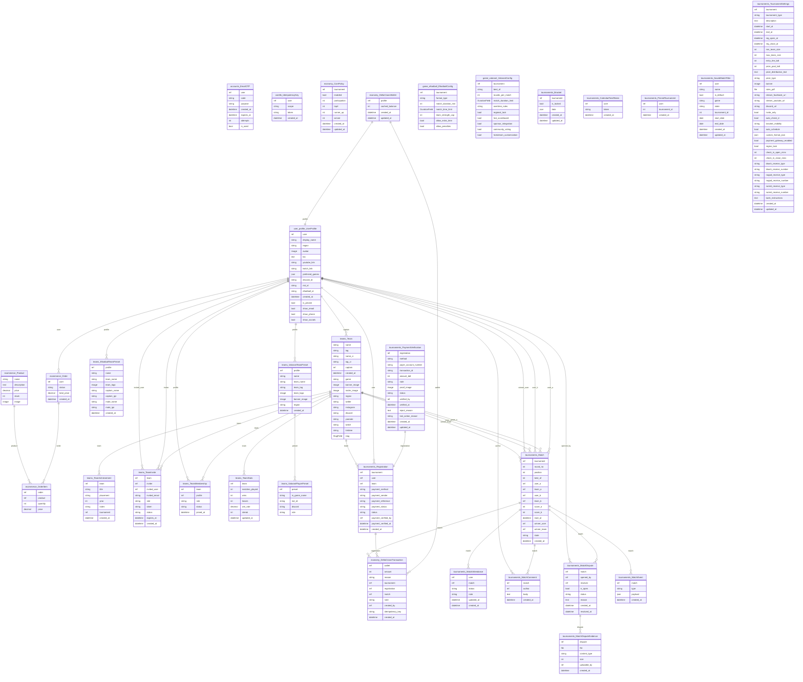

```mermaid
erDiagram
  accounts_EmailOTP {
    ref user
    string code
    string purpose
    datetime created_at
    datetime expires_at
    int attempts
    bool is_used
  }
  corelib_IdempotencyKey {
    ref user
    string scope
    string token
    datetime created_at
  }
  ecommerce_Order {
    ref user
    string status
    decimal total_price
    datetime created_at
  }
  ecommerce_OrderItem {
    ref order
    ref product
    int quantity
    decimal price
  }
  ecommerce_Product {
    string name
    text description
    decimal price
    int stock
    image image
  }
  economy_CoinPolicy {
    ref tournament
    bool enabled
    int participation
    int top4
    int runner_up
    int winner
    datetime created_at
    datetime updated_at
  }
  economy_DeltaCrownTransaction {
    ref wallet
    int amount
    string reason
    ref tournament
    ref registration
    ref match
    string note
    ref created_by
    string idempotency_key
    datetime created_at
  }
  economy_DeltaCrownWallet {
    ref profile
    int cached_balance
    datetime created_at
    datetime updated_at
  }
  game_efootball_EfootballConfig {
    ref tournament
    string format_type
    int match_duration_min
    DurationField match_time_limit
    int team_strength_cap
    bool allow_extra_time
    bool allow_penalties
  }
  game_valorant_ValorantConfig {
    ref tournament
    string best_of
    int rounds_per_match
    DurationField match_duration_limit
    string overtime_rules
    bool regional_lock
    bool live_scoreboard
    bool sponsor_integration
    bool community_voting
    bool livestream_customization
  }
  teams_EfootballTeamPreset {
    ref profile
    string name
    string team_name
    image team_logo
    string captain_name
    string captain_ign
    string mate_name
    string mate_ign
    datetime created_at
  }
  teams_Team {
    string name
    string tag
    string name_ci
    string tag_ci
    ref captain
    datetime created_at
    string game
    image banner_image
    image roster_image
    string region
    string twitter
    string instagram
    string discord
    string youtube
    string twitch
    string linktree
    SlugField slug
  }
  teams_TeamAchievement {
    ref team
    string title
    string placement
    int year
    string notes
    ref tournament
    datetime created_at
  }
  teams_TeamInvite {
    ref team
    ref inviter
    ref invited_user
    string invited_email
    string role
    string token
    string status
    datetime expires_at
    datetime created_at
  }
  teams_TeamMembership {
    ref team
    ref profile
    string role
    string status
    datetime joined_at
  }
  teams_TeamStats {
    ref team
    int matches_played
    int wins
    int losses
    decimal win_rate
    int streak
    datetime updated_at
  }
  teams_ValorantPlayerPreset {
    ref preset
    string in_game_name
    string riot_id
    string discord
    string role
  }
  teams_ValorantTeamPreset {
    ref profile
    string name
    string team_name
    string team_tag
    image team_logo
    image banner_image
    string region
    datetime created_at
  }
  tournaments_Bracket {
    ref tournament
    bool is_locked
    json data
    datetime created_at
    datetime updated_at
  }
  tournaments_CalendarFeedToken {
    ref user
    string token
    datetime created_at
  }
  tournaments_Match {
    ref tournament
    int round_no
    int position
    int best_of
    ref user_a
    ref team_a
    ref user_b
    ref team_b
    int score_a
    int score_b
    datetime start_at
    ref winner_user
    ref winner_team
    string state
    datetime created_at
  }
  tournaments_MatchAttendance {
    ref user
    ref match
    string status
    string note
    datetime updated_at
    datetime created_at
  }
  tournaments_MatchComment {
    ref match
    ref author
    text body
    datetime created_at
  }
  tournaments_MatchDispute {
    ref match
    ref opened_by
    ref resolver
    bool is_open
    string status
    text reason
    datetime created_at
    datetime resolved_at
  }
  tournaments_MatchDisputeEvidence {
    ref dispute
    file file
    string content_type
    int size
    ref uploaded_by
    datetime created_at
  }
  tournaments_MatchEvent {
    ref match
    string type
    json payload
    datetime created_at
  }
  tournaments_PaymentVerification {
    ref registration
    string method
    string payer_account_number
    string transaction_id
    int amount_bdt
    string note
    image proof_image
    string status
    ref verified_by
    datetime verified_at
    text reject_reason
    string last_action_reason
    datetime created_at
    datetime updated_at
  }
  tournaments_PinnedTournament {
    ref user
    int tournament_id
    datetime created_at
  }
  tournaments_Registration {
    ref tournament
    ref user
    ref team
    string payment_method
    string payment_sender
    string payment_reference
    string payment_status
    string status
    ref payment_verified_by
    datetime payment_verified_at
    datetime created_at
  }
  tournaments_SavedMatchFilter {
    ref user
    string name
    bool is_default
    string game
    string state
    int tournament_id
    date start_date
    date end_date
    datetime created_at
    datetime updated_at
  }
  tournaments_TournamentSettings {
    ref tournament
    string tournament_type
    text description
    datetime start_at
    datetime end_at
    datetime reg_open_at
    datetime reg_close_at
    int min_team_size
    int max_team_size
    int entry_fee_bdt
    int prize_pool_bdt
    text prize_distribution_text
    string prize_type
    image banner
    file rules_pdf
    string stream_facebook_url
    string stream_youtube_url
    string discord_url
    bool invite_only
    bool auto_check_in
    string bracket_visibility
    bool auto_schedule
    json custom_format_json
    bool payment_gateway_enabled
    bool region_lock
    int check_in_open_mins
    int check_in_close_mins
    string bkash_receive_type
    string bkash_receive_number
    string nagad_receive_type
    string nagad_receive_number
    string rocket_receive_type
    string rocket_receive_number
    text bank_instructions
    datetime created_at
    datetime updated_at
  }
  user_profile_UserProfile {
    ref user
    string display_name
    string region
    image avatar
    text bio
    string youtube_link
    string twitch_link
    json preferred_games
    string discord_id
    string riot_id
    string efootball_id
    datetime created_at
    bool is_private
    bool show_email
    bool show_phone
    bool show_socials
  }
  user_profile_UserProfile ||--o{ ecommerce_Order : "user"
  ecommerce_Order ||--o{ ecommerce_OrderItem : "order"
  ecommerce_Product ||--o{ ecommerce_OrderItem : "product"
  economy_DeltaCrownWallet ||--|| user_profile_UserProfile : "profile"
  economy_DeltaCrownWallet ||--o{ economy_DeltaCrownTransaction : "wallet"
  tournaments_Registration ||--o{ economy_DeltaCrownTransaction : "registration"
  tournaments_Match ||--o{ economy_DeltaCrownTransaction : "match"
  teams_Team ||--o{ teams_TeamAchievement : "team"
  user_profile_UserProfile ||--o{ teams_EfootballTeamPreset : "profile"
  user_profile_UserProfile ||--o{ teams_ValorantTeamPreset : "profile"
  teams_ValorantTeamPreset ||--o{ teams_ValorantPlayerPreset : "preset"
  teams_Team ||--o{ teams_TeamStats : "team"
  user_profile_UserProfile ||--o{ teams_Team : "captain"
  teams_Team ||--o{ teams_TeamMembership : "team"
  user_profile_UserProfile ||--o{ teams_TeamMembership : "profile"
  teams_Team ||--o{ teams_TeamInvite : "team"
  user_profile_UserProfile ||--o{ teams_TeamInvite : "inviter"
  user_profile_UserProfile ||--o{ teams_TeamInvite : "invited_user"
  tournaments_Match ||--o{ tournaments_MatchAttendance : "match"
  tournaments_Match ||--o{ tournaments_MatchDispute : "match"
  user_profile_UserProfile ||--o{ tournaments_MatchDispute : "opened_by"
  tournaments_Match ||--o{ tournaments_MatchEvent : "match"
  tournaments_Match ||--o{ tournaments_MatchComment : "match"
  user_profile_UserProfile ||--o{ tournaments_MatchComment : "author"
  tournaments_MatchDispute ||--o{ tournaments_MatchDisputeEvidence : "dispute"
  user_profile_UserProfile ||--o{ tournaments_Match : "user_a"
  teams_Team ||--o{ tournaments_Match : "team_a"
  user_profile_UserProfile ||--o{ tournaments_Match : "user_b"
  teams_Team ||--o{ tournaments_Match : "team_b"
  user_profile_UserProfile ||--o{ tournaments_Match : "winner_user"
  teams_Team ||--o{ tournaments_Match : "winner_team"
  tournaments_PaymentVerification ||--|| tournaments_Registration : "registration"
  user_profile_UserProfile ||--o{ tournaments_Registration : "user"
  teams_Team ||--o{ tournaments_Registration : "team"
```